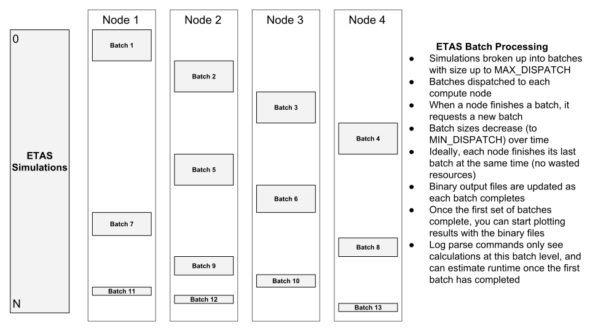

# Running ETAS simulations in parallel on HPC resources

## Overview

Many UCERF3-ETAS simulations are often required in order to sufficiently sample the probabilities of rare events. This is often intractable on a single machine in a reasonable timeframe, so we run simulations on many machines in parallel. This requires access to HPC resources, some additional libraries, and knowledge of submitting and managing batch jobs in a parallel environment. The following graphic illustrates the workflow of distributing a large ETAS simulation across multiple compute nodes, breaking the complete set of ETAS simulations into batches which are distributed to nodes for computation.



## Assumptions/prerequisites

* You have access to a linux cluster running the [Slurm workload manager](https://slurm.schedmd.com/)
* You have completed the main UCERF3-ETAS Launcher installation instructions on this HPC resource and are familiar with running ETAS simulations on a single computer
* You have installed, configured, and tested either MPJ Express or FastMPJ
  * These have already been configured at [USC CARC](https://carc.usc.edu/), [TACC Stampede2](https://www.tacc.utexas.edu/systems/stampede2), and [TACC Frontera](https://www.tacc.utexas.edu/systems/frontera)
* All commands below assume that you are in a terminal and have SSH'd into the HPC resource
* You have access to a parallel filesystem with a large (hundreds of gigabytes for large simulations) disk quota. This directory must be visible on all compute nodes
  * On USC CARC, this is typically `/project/scec_608/$USER/`
  * On TACC Stampede2 or Frontera, this is in `$SCRATCH`
* You know how to edit text files on a command line using vim, emacs, nano, or similar
* You know how to transfer files between computers using globus, scp, sftp, and/or rsync

## Slurm helper scripts

The [slurm_sbin](slurm_sbin) subdirectory contains many helper scripts which will make submitting and monitoring ETAS simulations much easier on HPC resources. You should add this directory to your PATH. Here is an example on USC CARC, along with the other UCERF3-ETAS environmental variables:

After logging into the server (in this case, endeavour.usc.edu), put this in your .bashrc script (replacing paths with your own paths):
```
export PROJFS=/project/scec_608/$USER
export ETAS_LAUNCHER=$PROJFS/ucerf3/ucerf3-etas-launcher
export ETAS_SIM_DIR=$PROJFS/ucerf3/etas_sim
export PATH=$ETAS_LAUNCHER/parallel/slurm_sbin/:$ETAS_LAUNCHER/sbin/:$PATH
export ETAS_MEM_GB=5 # this will be overridden in batch scripts for parallel jobs, set low enough so that the regular U3ETAS scripts can run on the login node to configure jobs
export MPJ_HOME=/project/scec_608/kmilner/mpj/mpj-current # it's fine to use my installation
```

Verify that it works by logging out of the system, logging back in, and typing `echo $ETAS_LAUNCHER`. You should see your ETAS Launcher path:

```
[kmilner@endeavour1 ~]$ echo $ETAS_LAUNCHER
/project/scec_608/kmilner/ucerf3/ucerf3-etas-launcher
[kmilner@endeavour1 ~]$
```

## Configuring a parallel ETAS script

NOTE: If you're configuring a simulation using one of the [helper scripts](../doc/configuring_simulations.md), you should use the `--hpc-site <site-name>` argmuent to automatically build the parallel ETAS script for you rather than following theses instructions. See decriptions of those options [here](../doc/configuring_simulations.md#hpc-options), then skip to the next section.

We'll use the Mojave M7 example from the [tutorial](../tutorial/). First create a directory on your large shared filesystem for this simulation. I like to include the current date in my directories in order to keep things straight later on (and quickly locate recent simulations):

```
[kmilner@endeavour1 ~]$ cd $ETAS_SIM_DIR
[kmilner@endeavour1 etas_sim]$ pwd
/project/scec_608/kmilner/ucerf3/etas_sim
[kmilner@endeavour1 etas_sim]$ mkdir 2023_10_20-MojaveM7
[kmilner@endeavour1 etas_sim]$ cd 2023_10_20-MojaveM7
```

Now create an ETAS JSON configuration file. For this one, we'll modify the tutorial Mojave M7 file:

```
[kmilner@endeavour1 2023_10_20-MojaveM7]$ cp $ETAS_LAUNCHER/tutorial/mojave_m7_example.json config.json
```

That tutorial file was only for 10 simulations, so we need to make some edits. Lets do 10000 simulations, and we also want to set the output directory to this new simulation directory. Here are my edits:

```
  "numSimulations": 10000,
  ...
  "outputDir": "$ETAS_SIM_DIR/2023_10_20-MojaveM7",
  ...
```

Next, you need to create a Slurm batch script which will execute the ETAS launcher in parallel mode. Example scripts are located in the [mpj_examples](mpj_examples) directory. We'll modify the `usc_hpcc_mpj_express.slurm` script.

```
[kmilner@hpc-login3 2018_08_30-MojaveM7]$ cp $ETAS_LAUNCHER/parallel/mpj_examples/usc_hpcc_mpj_express.slurm etas_parallel.slurm
```

Read through the "INPUT PARAMETERS" section of this Slurm script, updating variables as needed. On USC HPC, you should only need to update the path to the etas configuration file, as well as the Slurm node count and job limits. For this demo, lets run on 10 compute nodes with 2 hour max runtime:

```
#!/bin/bash

#SBATCH -t 24:00:00
#SBATCH -N 10
#SBATCH --cpus-per-task=20
#SBATCH -p scec
#SBATCH --mem 0

######################
## INPUT PARAMETERS ##
######################

# the above '#SBATCH' lines are requred, and are supposed to start with a '#'. They must be at the beginning of the file
# the '-t hh:mm:ss' argument is the wall clock time of the job
# the '-N 18' argument specifies the number of nodes required, in this case 18
# the '--cpus-per-task=20' argument specifies that we need access to all 20 cores on each node
# the 'p scec' argument specifies the queue, this line can be removed if you want the default queue (e.g., on discovery instead of endeavour)
# the '--mem 0' argument specifies that we want access to all available memory on the compute nodes

## ETAS PARAMETERS ##

# path to the JSON configuration file
ETAS_CONF_JSON=$ETAS_SIM_DIR/2023_10_20-MojaveM7/config.json
...continued...
```

## Submitting the Slurm parallel ETAS job

You are now ready to submit the Slurm simulation to the job scheduler. Use the `slurm_submit.sh` command from my [helper scripts](slurm_sbin/slurm_submit.sh), as it will place the job command line output (STDOUT/STDERR) in the correct places in order to easily monitor job progress later on. If you chose to submit manually with the `sbatch` command, then many of the 'Monitoring job progress' steps will not work.

*NOTE: If you need to specify a certain account to charge, set that with the `SLURM_ACCT` environmental variable first (e.g., `export SLURM_ACCT=EAR20005`)*

```
[kmilner@endeavour1 2023_10_20-MojaveM7]$ slurm_submit.sh etas_parallel.slurm 
Submitted batch job 17451850
[kmilner@endeavour1 2023_10_20-MojaveM7]$ squeue -u $USER
             JOBID PARTITION     NAME     USER ST       TIME  NODES NODELIST(REASON)
          17451850      scec etas_par  kmilner  PD      0:00     10 (Priority)
```

The first command outputs the job ID number. The STDOUT of the job will be stored in `etas_parallel.slurm.o<job-id>`, in this case `etas_parallel.slurm.o1437787`. If you run into problems, read over this file for clues as to what went wrong.

The second command (`squeue -u $USER`) checks the status of all of your running jobs. You can replace `$USER` with your username if it's easier for you. In this case, the job is not yet running as the state ('ST') is PD which means that the job is pending. A list of all Slurm job state codes can be found [here](https://slurm.schedmd.com/squeue.html#lbAG). Once your job has started running, it will look something like this:

```
[kmilner@endeavour1 2023_10_20-MojaveM7]$ squeue -u $USER
             JOBID PARTITION     NAME     USER ST       TIME  NODES NODELIST(REASON)
          17451850      scec etas_par  kmilner  R       0:12     10 e19-[24-33]
```

In this example, the job has been running for 5 minutes and 31 seconds. Depending on if other people are using the system (in this case the SCEC queue), it may start immediately or take a long time. For the SCEC queue at USC, the `scec_queue_check.py` script will let you know how many nodes are currently in use (out of a total of 38):

```
kmilner@endeavour1 2023_10_20-MojaveM7]$ scec_queue_check.py 
1 users running 1 jobs on 10 nodes, 0 queued jobs
user: kmilner,	running: 1 (10 nodes),	queued: 0
Total nodes in use: 10
```

## Monitoring job progress

Once submitted, you must wait for you job to start. This can be nearly instantaneous or take hours to days, depending on what else is running/queued in the queue. Monitor the job with the `squeue -u $USER` command demonstrated in the previous section. Once the job is in the 'R' state (it has begun execution), you can monitor it's process with some of the tools in the [slurm_sbin](slurm_sbin) directory. These tools can either take the job ID number (which is printed out to the console when you submit the job, or can be found with `squeue -u $USER`), or if omitted will use the lowest ID number of any of your jobs in the 'R' state (that is, detect the first ID number of a running job). As mentioned previously, all of this assumes that you sumitted your job with the `slurm_submit.sh` command and these tools will only work if this is the case. If something goes wrong, you can kill a job with the `scancel <job-id>` command, or you can cancel all submitted jobs with the `scancel_me.sh` script.

### Watching the job STDOUT

The first step is to make sure that the job launched sucessfully. This can be done by watching the STDOUT of the job (that is, what the  job would have printed to the console if run serially). Do this with the `wqtail` command. This will launch a linux "watch" command which will show the output of `squeue -u $USER`, and then when a job is running, refresh the end of the job's STDOUT every 2 seconds.

Try it out: `wqtail`  OR `stdout_job_tail.sh <job-id>`

At first you should see messages from MPJ about launching daemons. This part sometimes fails at first, but will retry a number of times to attempt to launch the simulation. Once you see lines similar to `[13:10:32.169 (hpc4222.hpcc.usc.edu) Process 3]: <some message here>` in the output, your job has launched sucessfully.

If no job is listed when you type `squeue -u $USER` or `wqtail`, then either the job wasn't submitted correctly, or it already ran and failed quickly/instantly. You can investigate failed jobs by reading the STDOUT of the job, which will be in a file named `<job-name>.slurm.o<job-ID>`, e.g. `etas_sim_mpj.slurm.o4893717`. Reading that file might help you troubleshoot any errors.

### Parsing the STDOUT file for job progress

Now that the simulation is running, you can parse the job STDOUT file for information on how many simulations have been dispatched to each of the compute nodes, how many have completed, and eventually some time estimates. Do this with the `log_parse_running.sh` command:

```
[kmilner@endeavour1 2023_10_20-MojaveM7]$ log_parse_running.sh 17451850
Job STDOUT: /project/scec_608/kmilner/ucerf3/etas_sim/2023_10_20-MojaveM7/etas_parallel.slurm.o17451850
Done parsing log

Process 0 (e19-24.hpc.usc.edu):	lastContact: 18.21 s	(22.18 s)	batches: 0/1	tasks: 000/100	avg: N/A	RUNNING: 100
Process 1 (e19-25.hpc.usc.edu):	lastContact: 18.88 s	(22.84 s)	batches: 0/1	tasks: 000/100	avg: N/A	RUNNING: 100
Process 2 (e19-26.hpc.usc.edu):	lastContact: 20.09 s	(24.06 s)	batches: 0/1	tasks: 000/100	avg: N/A	RUNNING: 100
Process 3 (e19-27.hpc.usc.edu):	lastContact: 0.00 ms	(3.97 s)	batches: 0/1	tasks: 000/100	avg: N/A	RUNNING: 100
Process 4 (e19-28.hpc.usc.edu):	lastContact: 22.33 s	(26.30 s)	batches: 0/1	tasks: 000/100	avg: N/A	RUNNING: 100
Process 5 (e19-29.hpc.usc.edu):	lastContact: 18.88 s	(22.85 s)	batches: 0/1	tasks: 000/100	avg: N/A	RUNNING: 100
Process 6 (e19-30.hpc.usc.edu):	lastContact: 22.07 s	(26.04 s)	batches: 0/1	tasks: 000/100	avg: N/A	RUNNING: 100
Process 7 (e19-31.hpc.usc.edu):	lastContact: 18.80 s	(22.77 s)	batches: 0/1	tasks: 000/100	avg: N/A	RUNNING: 100
Process 8 (e19-32.hpc.usc.edu):	lastContact: 20.01 s	(23.98 s)	batches: 0/1	tasks: 000/100	avg: N/A	RUNNING: 100
Process 9 (e19-33.hpc.usc.edu):	lastContact: 23.01 s	(26.98 s)	batches: 0/1	tasks: 000/100	avg: N/A	RUNNING: 100

Longest current time without contact: Process 9 (e19-33.hpc.usc.edu): 23.01 s (26.98 s)
Most recent contact from current date: Process 3 (e19-27.hpc.usc.edu): 3.97 s

1000/10000 (10.00 %) dispatched (9000 left)
0/10000 (0.00 %) completed (10000 left)
1000 in process on 10/10 nodes, batch sizes [100 100]
Calc durations (note: threading effects ignored):
	Range: [∞ d -∞ ms]
	Average: N/A
	Total: N/A
Batch durations:
	Range: [∞ d -∞ ms]
	Average: N/A
	Total: N/A

DONE? false

Current duration: 56.69 s (1.01 m)
Total rate: 0.00 task/d

None done, estimates if all currently dispatched completed now:
	Total rate: <16.48 tasks/s
	Time left: >9.10 m
	Tot duration: >10.11 m

results dir item count: 100
Exception count: 0
```

Simulations are sent to each compute node in batches whose size is dependent on the number of simulations left, the number of calculation threads, and the MIN_DISPATCH/MAX_DISPATCH parameters in your Slurm script. The `1000/10000 (10.00 %) dispatched (9000 left)` line shows that 1000 of the 10000 simulations have been sent off to the compute nodes for processing. The `0/10000 (0.00 %) completed (10000 left)` line indicates that no batches have completed. This tool only tracks completed batches, so even if some of the simulations within a batch have completed, they will not be counted until the whole batch for that node is complete.

If you call this command from within your main simulation directory, you will also see a line for "results dir item count". That will tell you how many subdirectories of "results" currently exist, which in this case is the number of either completed or in process simulations.

The "Exception count: " line will tell you if any java exceptions have been thrown, which indicate problems. Sometimes the exceptions are at the start during launching of the job, and it will retry and launch successfully. If you see exceptions later on, then there is a bigger problem and the simulation will abort. Read over the job STDOUT file for clues as to what went wrong.

You will also see time estimates until the simulation completes. In my exmple no batches have finished, so the time estimates at the end of the output are minimums: estimates if all currently running simulations were to finish instantaneously. Once at least one batch has completed, the estimates will update and become more accurate.

You can also watch the output of the log parser with the `watch_logparse.sh` command, which will update every minute.

### When the job completes

When the job completes, it will no longer be listed in the output of the `squeue -u $USER` command. This means that either it completed successfully, ended in error, or ran out of time and aborted. For the latter case, you can follow these steps again to resubmit and the job will pick up where it left off. If it completed sucessfully, then you will see the final binary output files. I usually like to look at the end of the STDOUT file for the job to make sure that everything looks good:

```
[kmilner@hpc-login3 2018_08_30-MojaveM7]$ tail -n 20 etas_parallel.slurm.o1437787
[14:42:41.924 (hpc4219.hpcc.usc.edu) Process 0]: async post-batch extimates: rate: 2.26 tasks/s, time for running: 5.30 s
[14:42:41.924 DispatcherThread]: checking if we're all done...
[14:42:41.924 DispatcherThread]: DONE!
[14:42:41.924 (hpc4221.hpcc.usc.edu) Process 2]: DONE!
[14:42:41.925 (hpc4221.hpcc.usc.edu) Process 2]: waiting for other processes with Barrier()
[14:42:41.926 (hpc4222.hpcc.usc.edu) Process 3]: Process 3 DONE!
[14:42:41.927 (hpc4221.hpcc.usc.edu) Process 2]: Process 2 DONE!
[14:42:41.927 (hpc4223.hpcc.usc.edu) Process 4]: Process 4 DONE!
[14:42:41.927 (hpc4220.hpcc.usc.edu) Process 1]: Process 1 DONE!
[14:42:42.430 (hpc4219.hpcc.usc.edu) Process 0]: done running async post-batch hook for process 2. running=12, queued=0, finished=988
[14:42:42.672 (hpc4219.hpcc.usc.edu) Process 0]: Process 0 DONE!
exit code: 0
Halting MPJ daemons
[hpc4219] MPJ Daemon stopped 
[hpc4220] MPJ Daemon stopped 
[hpc4221] MPJ Daemon stopped 
[hpc4222] MPJ Daemon stopped 
[hpc4223] MPJ Daemon stopped 
run succeeded or normal error, exiting. exit code: 0
Fri Aug 31 14:42:50 PDT 2018
```

If everything looks good, transfer the output files back to your computer to plot the results as with the serial job. You should not run the ETAS plot generator tool on the login node of HPC resources (it is a shared resource and will not make them happy); if your HPC system allows egress to outside servers, you can run it on a compute node.

## Alternate approaches

If you don't have access to a cluster environment, or want to use another technology to distribute the simulation across multiple machines, you can use the `u3etas_combine_binary.sh` script to combine the output of multiple binary output files into one master file for processing:

`USAGE: u3etas_combine_binary.sh </path/to/binary_catalogs_1.bin> </path/to/binary_catalogs_2.bin> [... </path/to/binary_catalogs_N.bin>] </path/to/combined_binary_catalogs.bin>`

In the simplest case, you could run the serial `u3etas_launcher.sh`  script manually on multiple machines. When each is done, copy all of the resultant binary files to a single machine, and then use the `u3etas_combine_binary.sh` script to generate a consolidated binary output file which will allow you to generate output plots for the entire set of simulations.
