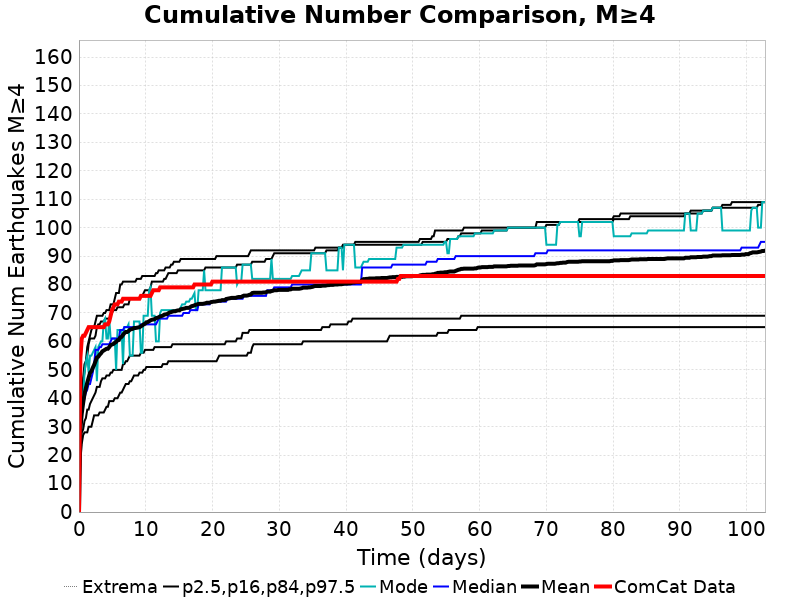
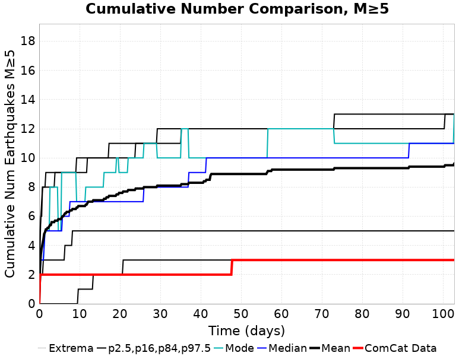
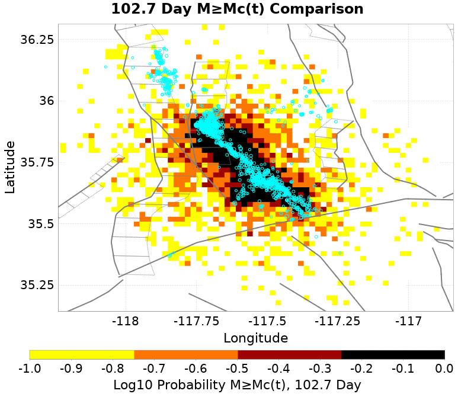
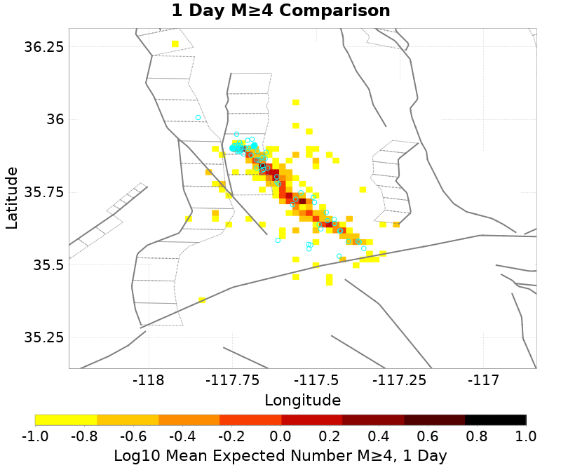
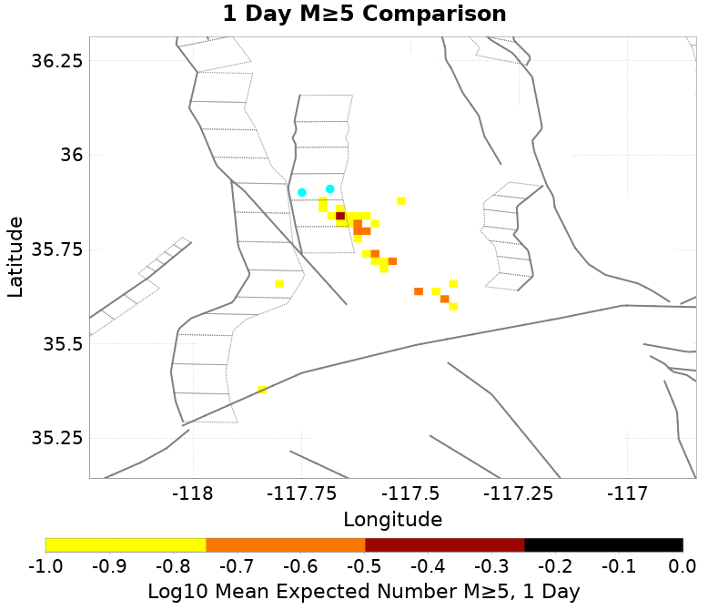
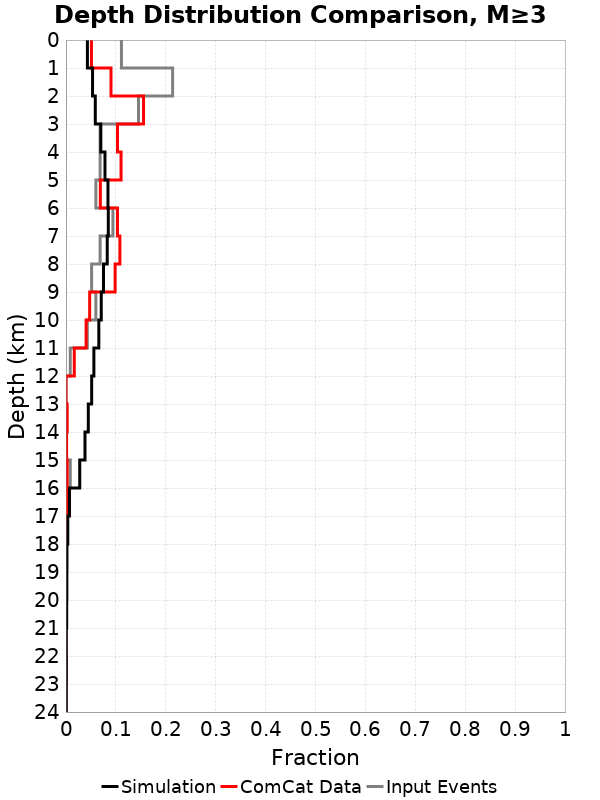

# ComCat M7.1 (ci38457511), ShakeMap Surfaces Results

|   | ComCat M7.1 (ci38457511), ShakeMap Surfaces |
|-----|-----|
| Num Simulations | 10 |
| Start Time | 2019/07/06 03:19:54 UTC |
| Start Time Epoch Milliseconds | 1562383194040 |
| Duration | 10 Years |
| Includes Spontaneous? | false |
| Trigger Ruptures | 227 Trigger Ruptures |
|   | First: M3.98 at 2019/07/04 17:02:55 UTC |
|   | Last: M7.1 at 2019/07/06 03:19:53 UTC |
|   | Largest: M7.1 at 2019/07/06 03:19:53 UTC |
| Historical Ruptures | *(none)* |
| Config Generated With | u3etas_comcat_event_config_builder.sh --event-id ci38457511 --num-simulations 10 --days-before 7 --finite-surf-shakemap --finite-surf-shakemap-min-mag 5 --output-dir user_output/comcat-ridgecrest-m7.1-example --random-seed 123456789 |

## Table Of Contents

* [Probabilities Summary Table](#probabilities-summary-table)
* [Magnitude Number Distribution](#magnitude-number-distribution)
  * [10 Year Magnitude Number Distribution](#10-year-magnitude-number-distribution)
  * [1 Year Magnitude Number Distribution](#1-year-magnitude-number-distribution)
  * [1 Month Magnitude Number Distribution](#1-month-magnitude-number-distribution)
  * [1 Week Magnitude Number Distribution](#1-week-magnitude-number-distribution)
  * [1 Day Magnitude Number Distribution](#1-day-magnitude-number-distribution)
  * [1 Hour Magnitude Number Distribution](#1-hour-magnitude-number-distribution)
* [Hazard Change Over Time](#hazard-change-over-time)
  * [M&ge;5.0 Hazard Change Over Time](#m50-hazard-change-over-time)
  * [M&ge;6.0 Hazard Change Over Time](#m60-hazard-change-over-time)
* [Trigger Rupture Fault Map](#trigger-rupture-fault-map)
* [Trigger Rupture Depth Map](#trigger-rupture-depth-map)
* [Fault Distances To Triggers](#fault-distances-to-triggers)
* [Individual Simulated Catalog Maps](#individual-simulated-catalog-maps)
* [ComCat Data Comparisons](#comcat-data-comparisons)
  * [ComCat Magnitude-Number Distributions](#comcat-magnitude-number-distributions)
  * [ComCat Time-Dependent Mc](#comcat-time-dependent-mc)
  * [ComCat Cumulative Number Vs Time](#comcat-cumulative-number-vs-time)
  * [ComCat Cumulative Number Simulation Percentiles](#comcat-cumulative-number-simulation-percentiles)
  * [ComCat Probability Spatial Distribution](#comcat-probability-spatial-distribution)
  * [ComCat Mean Expectation Spatial Distribution](#comcat-mean-expectation-spatial-distribution)
  * [ComCat Depth Distribution](#comcat-depth-distribution)
* [Section Participation](#section-participation)
  * [Section Participation Plots](#section-participation-plots)
  * [Supra-Seismogenic Parent Sections Table](#supra-seismogenic-parent-sections-table)
  * [Fault Magnitude-Probability Distributions](#fault-magnitude-probability-distributions)
* [Gridded Nucleation](#gridded-nucleation)
* [JSON Input File](#json-input-file)

## Probabilities Summary Table
*[(top)](#table-of-contents)*

| Magnitude | 1 Hour Prob | 1 Day Prob | 1 Week Prob | 1 Month Prob | 1 Year Prob | 10 Year Prob |
|-----|-----|-----|-----|-----|-----|-----|
| **M&ge;4** | 1.000 (100.00%) | 1.000 (100.00%) | 1.000 (100.00%) | 1.000 (100.00%) | 1.000 (100.00%) | 1.000 (100.00%) |
| **M&ge;4.5** | 1.000 (100.00%) | 1.000 (100.00%) | 1.000 (100.00%) | 1.000 (100.00%) | 1.000 (100.00%) | 1.000 (100.00%) |
| **M&ge;5** | 0.900 (90.00%) | 0.900 (90.00%) | 0.900 (90.00%) | 1.000 (100.00%) | 1.000 (100.00%) | 1.000 (100.00%) |
| **M&ge;5.5** | 0.400 (40.00%) | 0.700 (70.00%) | 0.800 (80.00%) | 0.800 (80.00%) | 0.900 (90.00%) | 0.900 (90.00%) |
| **M&ge;6** | 0.300 (30.00%) | 0.400 (40.00%) | 0.400 (40.00%) | 0.400 (40.00%) | 0.400 (40.00%) | 0.400 (40.00%) |
| **M&ge;7.1** | 0.000 (0.00%) | 0.000 (0.00%) | 0.000 (0.00%) | 0.000 (0.00%) | 0.000 (0.00%) | 0.000 (0.00%) |

## Magnitude Number Distribution
*[(top)](#table-of-contents)*

### 10 Year Magnitude Number Distribution
*[(top)](#table-of-contents)*

**Legend**
* **Mean** (thick black line): mean expected number across all 10 catalogs
* **2.5%,97.5%** (thin black lines): expected number percentiles across all 10 catalogs
* **Median** (thin blue line): median expected number across all 10 catalogs
* **Mode** (thin cyan line): modal expected number across all 10 catalogs
* **10 yr Probability** (thin red line): 10 year probability calculated as the fraction of catalogs with at least 1 occurrence
* **10 yr Supraseismogenic Probability** (thin dashed red line): same as above, but only for supraseismogenic ruptures on explicitly modeled UCERF3 faults
* **95% Conf** (light red shaded region): binomial 95% confidence bounds on probability
* **Primary** (thin green line): mean expected number from primary triggered aftershocks only (no secondary, tertiary, etc...) across all 10 catalogs


| Mag | Mean | 2.5 %ile | 97.5 %ile | Median | Mode | 10 yr Probability | 10 yr Supra-Seis Prob | Primary Aftershocks Mean |
|-----|-----|-----|-----|-----|-----|-----|-----|-----|
| **M&ge;2.5** | 4356.600 | 3712.000 | 5037.000 | 4188.000 | 4290.000 | 1.000 (100.00%) | 0.300 (30.00%) | 2398.300 |
| **M&ge;2.6** | 3470.300 | 2968.000 | 3978.000 | 3375.000 | 3434.000 | 1.000 (100.00%) | 0.300 (30.00%) | 1909.000 |
| **M&ge;2.7** | 2760.200 | 2355.000 | 3143.000 | 2667.000 | 2721.000 | 1.000 (100.00%) | 0.300 (30.00%) | 1526.100 |
| **M&ge;2.8** | 2191.700 | 1849.000 | 2527.000 | 2135.000 | 2157.000 | 1.000 (100.00%) | 0.300 (30.00%) | 1215.200 |
| **M&ge;2.9** | 1737.600 | 1469.000 | 2008.000 | 1675.000 | 1701.000 | 1.000 (100.00%) | 0.300 (30.00%) | 966.500 |
| **M&ge;3** | 1385.800 | 1146.000 | 1600.000 | 1350.000 | 1363.000 | 1.000 (100.00%) | 0.300 (30.00%) | 764.900 |
| **M&ge;3.1** | 1096.900 | 936.000 | 1266.000 | 1054.000 | 1087.000 | 1.000 (100.00%) | 0.300 (30.00%) | 609.300 |
| **M&ge;3.2** | 875.600 | 738.000 | 1008.000 | 844.000 | 894.000 | 1.000 (100.00%) | 0.300 (30.00%) | 485.200 |
| **M&ge;3.3** | 696.100 | 588.000 | 810.000 | 664.000 | 720.000 | 1.000 (100.00%) | 0.300 (30.00%) | 382.700 |
| **M&ge;3.4** | 554.500 | 481.000 | 664.000 | 521.000 | 481.000 | 1.000 (100.00%) | 0.300 (30.00%) | 304.400 |
| **M&ge;3.5** | 440.000 | 370.000 | 537.000 | 436.000 | 439.000 | 1.000 (100.00%) | 0.300 (30.00%) | 239.900 |
| **M&ge;3.6** | 344.400 | 286.000 | 428.000 | 351.000 | 369.000 | 1.000 (100.00%) | 0.300 (30.00%) | 188.800 |
| **M&ge;3.7** | 275.200 | 228.000 | 358.000 | 261.000 | 280.000 | 1.000 (100.00%) | 0.300 (30.00%) | 151.300 |
| **M&ge;3.8** | 215.300 | 176.000 | 278.000 | 210.000 | 226.000 | 1.000 (100.00%) | 0.300 (30.00%) | 119.100 |
| **M&ge;3.9** | 168.300 | 135.000 | 216.000 | 170.000 | 135.000 | 1.000 (100.00%) | 0.300 (30.00%) | 93.300 |
| **M&ge;4** | 133.000 | 104.000 | 166.000 | 129.000 | 136.000 | 1.000 (100.00%) | 0.300 (30.00%) | 74.300 |
| **M&ge;4.1** | 102.900 | 79.000 | 133.000 | 96.000 | 110.000 | 1.000 (100.00%) | 0.300 (30.00%) | 57.500 |
| **M&ge;4.2** | 81.500 | 63.000 | 103.000 | 80.000 | 81.000 | 1.000 (100.00%) | 0.300 (30.00%) | 45.800 |
| **M&ge;4.3** | 64.500 | 53.000 | 76.000 | 64.000 | 66.000 | 1.000 (100.00%) | 0.300 (30.00%) | 35.400 |
| **M&ge;4.4** | 50.500 | 40.000 | 63.000 | 49.000 | 58.000 | 1.000 (100.00%) | 0.300 (30.00%) | 28.200 |
| **M&ge;4.5** | 39.400 | 28.000 | 50.000 | 39.000 | 41.000 | 1.000 (100.00%) | 0.300 (30.00%) | 21.800 |
| **M&ge;4.6** | 30.500 | 19.000 | 41.000 | 31.000 | 33.000 | 1.000 (100.00%) | 0.300 (30.00%) | 16.600 |
| **M&ge;4.7** | 24.800 | 14.000 | 34.000 | 25.000 | 25.000 | 1.000 (100.00%) | 0.300 (30.00%) | 13.800 |
| **M&ge;4.8** | 20.200 | 11.000 | 27.000 | 18.000 | 18.000 | 1.000 (100.00%) | 0.300 (30.00%) | 11.200 |
| **M&ge;4.9** | 16.300 | 7.000 | 22.000 | 16.000 | 19.000 | 1.000 (100.00%) | 0.300 (30.00%) | 9.200 |
| **M&ge;5** | 12.900 | 3.000 | 18.000 | 13.000 | 16.000 | 1.000 (100.00%) | 0.300 (30.00%) | 7.600 |
| **M&ge;5.1** | 9.300 | 2.000 | 17.000 | 9.000 | 10.000 | 1.000 (100.00%) | 0.300 (30.00%) | 5.600 |
| **M&ge;5.2** | 7.700 | 2.000 | 17.000 | 7.000 | 8.000 | 1.000 (100.00%) | 0.300 (30.00%) | 4.300 |
| **M&ge;5.3** | 6.400 | 2.000 | 15.000 | 6.000 | 6.000 | 1.000 (100.00%) | 0.300 (30.00%) | 3.700 |
| **M&ge;5.4** | 4.600 | 1.000 | 11.000 | 3.000 | 3.000 | 1.000 (100.00%) | 0.300 (30.00%) | 2.600 |
| **M&ge;5.5** | 3.600 | 0.000 | 9.000 | 2.000 | 2.000 | 0.900 (90.00%) | 0.300 (30.00%) | 2.200 |
| **M&ge;5.6** | 2.200 | 0.000 | 4.000 | 2.000 | 4.000 | 0.800 (80.00%) | 0.300 (30.00%) | 1.500 |
| **M&ge;5.7** | 1.500 | 0.000 | 3.000 | 2.000 | 0.000 | 0.600 (60.00%) | 0.300 (30.00%) | 1.200 |
| **M&ge;5.8** | 1.300 | 0.000 | 3.000 | 1.000 | 0.000 | 0.600 (60.00%) | 0.300 (30.00%) | 1.100 |
| **M&ge;5.9** | 1.000 | 0.000 | 3.000 | 1.000 | 1.000 | 0.600 (60.00%) | 0.300 (30.00%) | 0.800 |
| **M&ge;6** | 0.700 | 0.000 | 3.000 | 0.000 | 0.000 | 0.400 (40.00%) | 0.300 (30.00%) | 0.600 |
| **M&ge;6.1** | 0.600 | 0.000 | 2.000 | 0.000 | 0.000 | 0.400 (40.00%) | 0.300 (30.00%) | 0.500 |
| **M&ge;6.2** | 0.200 | 0.000 | 1.000 | 0.000 | 0.000 | 0.200 (20.00%) | 0.100 (10.00%) | 0.200 |
| **M&ge;6.3** | 0.000 | 0.000 | 0.000 | 0.000 | 0.000 | 0.000 (0.00%) | 0.000 (0.00%) | 0.000 |
| **M&ge;6.4** | 0.000 | 0.000 | 0.000 | 0.000 | 0.000 | 0.000 (0.00%) | 0.000 (0.00%) | 0.000 |
| **M&ge;6.5** | 0.000 | 0.000 | 0.000 | 0.000 | 0.000 | 0.000 (0.00%) | 0.000 (0.00%) | 0.000 |
| **M&ge;6.6** | 0.000 | 0.000 | 0.000 | 0.000 | 0.000 | 0.000 (0.00%) | 0.000 (0.00%) | 0.000 |
| **M&ge;6.7** | 0.000 | 0.000 | 0.000 | 0.000 | 0.000 | 0.000 (0.00%) | 0.000 (0.00%) | 0.000 |
| **M&ge;6.8** | 0.000 | 0.000 | 0.000 | 0.000 | 0.000 | 0.000 (0.00%) | 0.000 (0.00%) | 0.000 |
| **M&ge;6.9** | 0.000 | 0.000 | 0.000 | 0.000 | 0.000 | 0.000 (0.00%) | 0.000 (0.00%) | 0.000 |
| **M&ge;7** | 0.000 | 0.000 | 0.000 | 0.000 | 0.000 | 0.000 (0.00%) | 0.000 (0.00%) | 0.000 |
| **M&ge;7.1** | 0.000 | 0.000 | 0.000 | 0.000 | 0.000 | 0.000 (0.00%) | 0.000 (0.00%) | 0.000 |
| **M&ge;7.2** | 0.000 | 0.000 | 0.000 | 0.000 | 0.000 | 0.000 (0.00%) | 0.000 (0.00%) | 0.000 |
| **M&ge;7.3** | 0.000 | 0.000 | 0.000 | 0.000 | 0.000 | 0.000 (0.00%) | 0.000 (0.00%) | 0.000 |
| **M&ge;7.4** | 0.000 | 0.000 | 0.000 | 0.000 | 0.000 | 0.000 (0.00%) | 0.000 (0.00%) | 0.000 |
| **M&ge;7.5** | 0.000 | 0.000 | 0.000 | 0.000 | 0.000 | 0.000 (0.00%) | 0.000 (0.00%) | 0.000 |
| **M&ge;7.6** | 0.000 | 0.000 | 0.000 | 0.000 | 0.000 | 0.000 (0.00%) | 0.000 (0.00%) | 0.000 |
| **M&ge;7.7** | 0.000 | 0.000 | 0.000 | 0.000 | 0.000 | 0.000 (0.00%) | 0.000 (0.00%) | 0.000 |
| **M&ge;7.8** | 0.000 | 0.000 | 0.000 | 0.000 | 0.000 | 0.000 (0.00%) | 0.000 (0.00%) | 0.000 |
| **M&ge;7.9** | 0.000 | 0.000 | 0.000 | 0.000 | 0.000 | 0.000 (0.00%) | 0.000 (0.00%) | 0.000 |
| **M&ge;8** | 0.000 | 0.000 | 0.000 | 0.000 | 0.000 | 0.000 (0.00%) | 0.000 (0.00%) | 0.000 |
| **M&ge;8.1** | 0.000 | 0.000 | 0.000 | 0.000 | 0.000 | 0.000 (0.00%) | 0.000 (0.00%) | 0.000 |
| **M&ge;8.2** | 0.000 | 0.000 | 0.000 | 0.000 | 0.000 | 0.000 (0.00%) | 0.000 (0.00%) | 0.000 |
| **M&ge;8.3** | 0.000 | 0.000 | 0.000 | 0.000 | 0.000 | 0.000 (0.00%) | 0.000 (0.00%) | 0.000 |
| **M&ge;8.4** | 0.000 | 0.000 | 0.000 | 0.000 | 0.000 | 0.000 (0.00%) | 0.000 (0.00%) | 0.000 |
| **M&ge;8.5** | 0.000 | 0.000 | 0.000 | 0.000 | 0.000 | 0.000 (0.00%) | 0.000 (0.00%) | 0.000 |
| **M&ge;8.6** | 0.000 | 0.000 | 0.000 | 0.000 | 0.000 | 0.000 (0.00%) | 0.000 (0.00%) | 0.000 |
| **M&ge;8.7** | 0.000 | 0.000 | 0.000 | 0.000 | 0.000 | 0.000 (0.00%) | 0.000 (0.00%) | 0.000 |
| **M&ge;8.8** | 0.000 | 0.000 | 0.000 | 0.000 | 0.000 | 0.000 (0.00%) | 0.000 (0.00%) | 0.000 |
| **M&ge;8.9** | 0.000 | 0.000 | 0.000 | 0.000 | 0.000 | 0.000 (0.00%) | 0.000 (0.00%) | 0.000 |
| **M&ge;9** | 0.000 | 0.000 | 0.000 | 0.000 | 0.000 | 0.000 (0.00%) | 0.000 (0.00%) | 0.000 |

### 1 Year Magnitude Number Distribution
*[(top)](#table-of-contents)*

**Legend**
* **Mean** (thick black line): mean expected number across all 10 catalogs
* **2.5%,97.5%** (thin black lines): expected number percentiles across all 10 catalogs
* **Median** (thin blue line): median expected number across all 10 catalogs
* **Mode** (thin cyan line): modal expected number across all 10 catalogs
* **1 yr Probability** (thin red line): 1 year probability calculated as the fraction of catalogs with at least 1 occurrence
* **1 yr Supraseismogenic Probability** (thin dashed red line): same as above, but only for supraseismogenic ruptures on explicitly modeled UCERF3 faults
* **95% Conf** (light red shaded region): binomial 95% confidence bounds on probability
* **Primary** (thin green line): mean expected number from primary triggered aftershocks only (no secondary, tertiary, etc...) across all 10 catalogs


| Mag | Mean | 2.5 %ile | 97.5 %ile | Median | Mode | 1 yr Probability | 1 yr Supra-Seis Prob | Primary Aftershocks Mean |
|-----|-----|-----|-----|-----|-----|-----|-----|-----|
| **M&ge;2.5** | 3535.400 | 2960.000 | 4151.000 | 3427.000 | 3565.000 | 1.000 (100.00%) | 0.300 (30.00%) | 2096.300 |
| **M&ge;2.6** | 2816.900 | 2360.000 | 3284.000 | 2771.000 | 2851.000 | 1.000 (100.00%) | 0.300 (30.00%) | 1670.100 |
| **M&ge;2.7** | 2241.500 | 1882.000 | 2590.000 | 2189.000 | 2259.000 | 1.000 (100.00%) | 0.300 (30.00%) | 1336.700 |
| **M&ge;2.8** | 1781.500 | 1520.000 | 2089.000 | 1755.000 | 1798.000 | 1.000 (100.00%) | 0.300 (30.00%) | 1064.600 |
| **M&ge;2.9** | 1409.700 | 1212.000 | 1651.000 | 1374.000 | 1212.000 | 1.000 (100.00%) | 0.300 (30.00%) | 845.600 |
| **M&ge;3** | 1121.100 | 950.000 | 1315.000 | 1110.000 | 1115.000 | 1.000 (100.00%) | 0.300 (30.00%) | 669.300 |
| **M&ge;3.1** | 885.300 | 744.000 | 1043.000 | 861.000 | 891.000 | 1.000 (100.00%) | 0.300 (30.00%) | 532.600 |
| **M&ge;3.2** | 706.600 | 595.000 | 838.000 | 693.000 | 730.000 | 1.000 (100.00%) | 0.300 (30.00%) | 423.500 |
| **M&ge;3.3** | 561.900 | 456.000 | 674.000 | 546.000 | 584.000 | 1.000 (100.00%) | 0.300 (30.00%) | 333.600 |
| **M&ge;3.4** | 446.900 | 350.000 | 560.000 | 427.000 | 476.000 | 1.000 (100.00%) | 0.300 (30.00%) | 265.600 |
| **M&ge;3.5** | 354.400 | 262.000 | 453.000 | 356.000 | 384.000 | 1.000 (100.00%) | 0.300 (30.00%) | 209.500 |
| **M&ge;3.6** | 278.200 | 208.000 | 356.000 | 288.000 | 290.000 | 1.000 (100.00%) | 0.300 (30.00%) | 165.000 |
| **M&ge;3.7** | 220.700 | 164.000 | 295.000 | 229.000 | 230.000 | 1.000 (100.00%) | 0.300 (30.00%) | 131.700 |
| **M&ge;3.8** | 172.300 | 123.000 | 232.000 | 179.000 | 184.000 | 1.000 (100.00%) | 0.300 (30.00%) | 103.900 |
| **M&ge;3.9** | 135.400 | 97.000 | 183.000 | 140.000 | 146.000 | 1.000 (100.00%) | 0.300 (30.00%) | 81.000 |
| **M&ge;4** | 107.500 | 79.000 | 142.000 | 112.000 | 115.000 | 1.000 (100.00%) | 0.300 (30.00%) | 64.700 |
| **M&ge;4.1** | 83.800 | 61.000 | 109.000 | 84.000 | 61.000 | 1.000 (100.00%) | 0.300 (30.00%) | 50.100 |
| **M&ge;4.2** | 66.700 | 48.000 | 88.000 | 65.000 | 68.000 | 1.000 (100.00%) | 0.300 (30.00%) | 39.900 |
| **M&ge;4.3** | 52.100 | 37.000 | 66.000 | 52.000 | 55.000 | 1.000 (100.00%) | 0.300 (30.00%) | 30.800 |
| **M&ge;4.4** | 41.300 | 29.000 | 54.000 | 41.000 | 42.000 | 1.000 (100.00%) | 0.300 (30.00%) | 24.900 |
| **M&ge;4.5** | 32.300 | 20.000 | 42.000 | 31.000 | 42.000 | 1.000 (100.00%) | 0.300 (30.00%) | 19.600 |
| **M&ge;4.6** | 24.600 | 15.000 | 36.000 | 27.000 | 27.000 | 1.000 (100.00%) | 0.300 (30.00%) | 15.000 |
| **M&ge;4.7** | 20.200 | 12.000 | 31.000 | 21.000 | 12.000 | 1.000 (100.00%) | 0.300 (30.00%) | 12.400 |
| **M&ge;4.8** | 16.600 | 10.000 | 25.000 | 15.000 | 10.000 | 1.000 (100.00%) | 0.300 (30.00%) | 10.200 |
| **M&ge;4.9** | 12.900 | 6.000 | 19.000 | 13.000 | 16.000 | 1.000 (100.00%) | 0.300 (30.00%) | 8.200 |
| **M&ge;5** | 10.800 | 3.000 | 17.000 | 12.000 | 13.000 | 1.000 (100.00%) | 0.300 (30.00%) | 7.000 |
| **M&ge;5.1** | 8.100 | 2.000 | 16.000 | 8.000 | 9.000 | 1.000 (100.00%) | 0.300 (30.00%) | 5.200 |
| **M&ge;5.2** | 6.700 | 2.000 | 16.000 | 6.000 | 6.000 | 1.000 (100.00%) | 0.300 (30.00%) | 4.000 |
| **M&ge;5.3** | 5.500 | 2.000 | 14.000 | 4.000 | 4.000 | 1.000 (100.00%) | 0.300 (30.00%) | 3.400 |
| **M&ge;5.4** | 4.100 | 1.000 | 11.000 | 3.000 | 2.000 | 1.000 (100.00%) | 0.300 (30.00%) | 2.500 |
| **M&ge;5.5** | 3.300 | 0.000 | 9.000 | 2.000 | 2.000 | 0.900 (90.00%) | 0.300 (30.00%) | 2.200 |
| **M&ge;5.6** | 2.000 | 0.000 | 4.000 | 2.000 | 2.000 | 0.800 (80.00%) | 0.300 (30.00%) | 1.500 |
| **M&ge;5.7** | 1.300 | 0.000 | 3.000 | 1.000 | 0.000 | 0.600 (60.00%) | 0.300 (30.00%) | 1.200 |
| **M&ge;5.8** | 1.200 | 0.000 | 3.000 | 1.000 | 2.000 | 0.600 (60.00%) | 0.300 (30.00%) | 1.100 |
| **M&ge;5.9** | 0.900 | 0.000 | 3.000 | 1.000 | 1.000 | 0.600 (60.00%) | 0.300 (30.00%) | 0.800 |
| **M&ge;6** | 0.700 | 0.000 | 3.000 | 0.000 | 0.000 | 0.400 (40.00%) | 0.300 (30.00%) | 0.600 |
| **M&ge;6.1** | 0.600 | 0.000 | 2.000 | 0.000 | 0.000 | 0.400 (40.00%) | 0.300 (30.00%) | 0.500 |
| **M&ge;6.2** | 0.200 | 0.000 | 1.000 | 0.000 | 0.000 | 0.200 (20.00%) | 0.100 (10.00%) | 0.200 |
| **M&ge;6.3** | 0.000 | 0.000 | 0.000 | 0.000 | 0.000 | 0.000 (0.00%) | 0.000 (0.00%) | 0.000 |
| **M&ge;6.4** | 0.000 | 0.000 | 0.000 | 0.000 | 0.000 | 0.000 (0.00%) | 0.000 (0.00%) | 0.000 |
| **M&ge;6.5** | 0.000 | 0.000 | 0.000 | 0.000 | 0.000 | 0.000 (0.00%) | 0.000 (0.00%) | 0.000 |
| **M&ge;6.6** | 0.000 | 0.000 | 0.000 | 0.000 | 0.000 | 0.000 (0.00%) | 0.000 (0.00%) | 0.000 |
| **M&ge;6.7** | 0.000 | 0.000 | 0.000 | 0.000 | 0.000 | 0.000 (0.00%) | 0.000 (0.00%) | 0.000 |
| **M&ge;6.8** | 0.000 | 0.000 | 0.000 | 0.000 | 0.000 | 0.000 (0.00%) | 0.000 (0.00%) | 0.000 |
| **M&ge;6.9** | 0.000 | 0.000 | 0.000 | 0.000 | 0.000 | 0.000 (0.00%) | 0.000 (0.00%) | 0.000 |
| **M&ge;7** | 0.000 | 0.000 | 0.000 | 0.000 | 0.000 | 0.000 (0.00%) | 0.000 (0.00%) | 0.000 |
| **M&ge;7.1** | 0.000 | 0.000 | 0.000 | 0.000 | 0.000 | 0.000 (0.00%) | 0.000 (0.00%) | 0.000 |
| **M&ge;7.2** | 0.000 | 0.000 | 0.000 | 0.000 | 0.000 | 0.000 (0.00%) | 0.000 (0.00%) | 0.000 |
| **M&ge;7.3** | 0.000 | 0.000 | 0.000 | 0.000 | 0.000 | 0.000 (0.00%) | 0.000 (0.00%) | 0.000 |
| **M&ge;7.4** | 0.000 | 0.000 | 0.000 | 0.000 | 0.000 | 0.000 (0.00%) | 0.000 (0.00%) | 0.000 |
| **M&ge;7.5** | 0.000 | 0.000 | 0.000 | 0.000 | 0.000 | 0.000 (0.00%) | 0.000 (0.00%) | 0.000 |
| **M&ge;7.6** | 0.000 | 0.000 | 0.000 | 0.000 | 0.000 | 0.000 (0.00%) | 0.000 (0.00%) | 0.000 |
| **M&ge;7.7** | 0.000 | 0.000 | 0.000 | 0.000 | 0.000 | 0.000 (0.00%) | 0.000 (0.00%) | 0.000 |
| **M&ge;7.8** | 0.000 | 0.000 | 0.000 | 0.000 | 0.000 | 0.000 (0.00%) | 0.000 (0.00%) | 0.000 |
| **M&ge;7.9** | 0.000 | 0.000 | 0.000 | 0.000 | 0.000 | 0.000 (0.00%) | 0.000 (0.00%) | 0.000 |
| **M&ge;8** | 0.000 | 0.000 | 0.000 | 0.000 | 0.000 | 0.000 (0.00%) | 0.000 (0.00%) | 0.000 |
| **M&ge;8.1** | 0.000 | 0.000 | 0.000 | 0.000 | 0.000 | 0.000 (0.00%) | 0.000 (0.00%) | 0.000 |
| **M&ge;8.2** | 0.000 | 0.000 | 0.000 | 0.000 | 0.000 | 0.000 (0.00%) | 0.000 (0.00%) | 0.000 |
| **M&ge;8.3** | 0.000 | 0.000 | 0.000 | 0.000 | 0.000 | 0.000 (0.00%) | 0.000 (0.00%) | 0.000 |
| **M&ge;8.4** | 0.000 | 0.000 | 0.000 | 0.000 | 0.000 | 0.000 (0.00%) | 0.000 (0.00%) | 0.000 |
| **M&ge;8.5** | 0.000 | 0.000 | 0.000 | 0.000 | 0.000 | 0.000 (0.00%) | 0.000 (0.00%) | 0.000 |
| **M&ge;8.6** | 0.000 | 0.000 | 0.000 | 0.000 | 0.000 | 0.000 (0.00%) | 0.000 (0.00%) | 0.000 |
| **M&ge;8.7** | 0.000 | 0.000 | 0.000 | 0.000 | 0.000 | 0.000 (0.00%) | 0.000 (0.00%) | 0.000 |
| **M&ge;8.8** | 0.000 | 0.000 | 0.000 | 0.000 | 0.000 | 0.000 (0.00%) | 0.000 (0.00%) | 0.000 |
| **M&ge;8.9** | 0.000 | 0.000 | 0.000 | 0.000 | 0.000 | 0.000 (0.00%) | 0.000 (0.00%) | 0.000 |
| **M&ge;9** | 0.000 | 0.000 | 0.000 | 0.000 | 0.000 | 0.000 (0.00%) | 0.000 (0.00%) | 0.000 |

### 1 Month Magnitude Number Distribution
*[(top)](#table-of-contents)*

**Legend**
* **Mean** (thick black line): mean expected number across all 10 catalogs
* **2.5%,97.5%** (thin black lines): expected number percentiles across all 10 catalogs
* **Median** (thin blue line): median expected number across all 10 catalogs
* **Mode** (thin cyan line): modal expected number across all 10 catalogs
* **1 mo Probability** (thin red line): 1 month probability calculated as the fraction of catalogs with at least 1 occurrence
* **1 mo Supraseismogenic Probability** (thin dashed red line): same as above, but only for supraseismogenic ruptures on explicitly modeled UCERF3 faults
* **95% Conf** (light red shaded region): binomial 95% confidence bounds on probability
* **Primary** (thin green line): mean expected number from primary triggered aftershocks only (no secondary, tertiary, etc...) across all 10 catalogs


| Mag | Mean | 2.5 %ile | 97.5 %ile | Median | Mode | 1 mo Probability | 1 mo Supra-Seis Prob | Primary Aftershocks Mean |
|-----|-----|-----|-----|-----|-----|-----|-----|-----|
| **M&ge;2.5** | 2592.000 | 2264.000 | 3022.000 | 2555.000 | 2564.000 | 1.000 (100.00%) | 0.300 (30.00%) | 1701.100 |
| **M&ge;2.6** | 2059.000 | 1801.000 | 2387.000 | 2008.000 | 2055.000 | 1.000 (100.00%) | 0.300 (30.00%) | 1350.800 |
| **M&ge;2.7** | 1639.900 | 1435.000 | 1933.000 | 1589.000 | 1630.000 | 1.000 (100.00%) | 0.300 (30.00%) | 1080.700 |
| **M&ge;2.8** | 1301.200 | 1127.000 | 1492.000 | 1281.000 | 1314.000 | 1.000 (100.00%) | 0.300 (30.00%) | 860.100 |
| **M&ge;2.9** | 1031.600 | 893.000 | 1180.000 | 1023.000 | 1029.000 | 1.000 (100.00%) | 0.300 (30.00%) | 682.000 |
| **M&ge;3** | 822.100 | 707.000 | 941.000 | 813.000 | 829.000 | 1.000 (100.00%) | 0.300 (30.00%) | 539.000 |
| **M&ge;3.1** | 648.200 | 563.000 | 757.000 | 649.000 | 656.000 | 1.000 (100.00%) | 0.300 (30.00%) | 430.200 |
| **M&ge;3.2** | 513.900 | 443.000 | 588.000 | 523.000 | 443.000 | 1.000 (100.00%) | 0.300 (30.00%) | 339.700 |
| **M&ge;3.3** | 409.400 | 344.000 | 473.000 | 414.000 | 417.000 | 1.000 (100.00%) | 0.300 (30.00%) | 269.400 |
| **M&ge;3.4** | 327.000 | 265.000 | 378.000 | 330.000 | 344.000 | 1.000 (100.00%) | 0.300 (30.00%) | 215.200 |
| **M&ge;3.5** | 259.000 | 201.000 | 298.000 | 273.000 | 276.000 | 1.000 (100.00%) | 0.300 (30.00%) | 169.500 |
| **M&ge;3.6** | 202.700 | 158.000 | 231.000 | 209.000 | 227.000 | 1.000 (100.00%) | 0.300 (30.00%) | 133.700 |
| **M&ge;3.7** | 160.000 | 127.000 | 182.000 | 170.000 | 171.000 | 1.000 (100.00%) | 0.300 (30.00%) | 106.900 |
| **M&ge;3.8** | 125.200 | 98.000 | 146.000 | 130.000 | 136.000 | 1.000 (100.00%) | 0.300 (30.00%) | 85.400 |
| **M&ge;3.9** | 98.600 | 77.000 | 119.000 | 100.000 | 78.000 | 1.000 (100.00%) | 0.300 (30.00%) | 66.600 |
| **M&ge;4** | 80.100 | 61.000 | 95.000 | 83.000 | 84.000 | 1.000 (100.00%) | 0.300 (30.00%) | 54.500 |
| **M&ge;4.1** | 61.800 | 43.000 | 76.000 | 61.000 | 76.000 | 1.000 (100.00%) | 0.300 (30.00%) | 41.500 |
| **M&ge;4.2** | 49.500 | 34.000 | 62.000 | 47.000 | 51.000 | 1.000 (100.00%) | 0.300 (30.00%) | 32.800 |
| **M&ge;4.3** | 38.100 | 28.000 | 49.000 | 36.000 | 45.000 | 1.000 (100.00%) | 0.300 (30.00%) | 24.900 |
| **M&ge;4.4** | 30.500 | 22.000 | 44.000 | 29.000 | 31.000 | 1.000 (100.00%) | 0.300 (30.00%) | 20.400 |
| **M&ge;4.5** | 23.400 | 16.000 | 34.000 | 23.000 | 18.000 | 1.000 (100.00%) | 0.300 (30.00%) | 15.800 |
| **M&ge;4.6** | 17.400 | 12.000 | 27.000 | 14.000 | 12.000 | 1.000 (100.00%) | 0.300 (30.00%) | 12.100 |
| **M&ge;4.7** | 15.000 | 9.000 | 23.000 | 12.000 | 11.000 | 1.000 (100.00%) | 0.300 (30.00%) | 10.400 |
| **M&ge;4.8** | 12.200 | 7.000 | 17.000 | 11.000 | 17.000 | 1.000 (100.00%) | 0.300 (30.00%) | 8.400 |
| **M&ge;4.9** | 9.700 | 5.000 | 15.000 | 8.000 | 7.000 | 1.000 (100.00%) | 0.300 (30.00%) | 6.800 |
| **M&ge;5** | 8.300 | 3.000 | 13.000 | 8.000 | 11.000 | 1.000 (100.00%) | 0.300 (30.00%) | 5.900 |
| **M&ge;5.1** | 6.300 | 2.000 | 10.000 | 6.000 | 7.000 | 1.000 (100.00%) | 0.300 (30.00%) | 4.600 |
| **M&ge;5.2** | 5.000 | 2.000 | 7.000 | 5.000 | 6.000 | 1.000 (100.00%) | 0.300 (30.00%) | 3.500 |
| **M&ge;5.3** | 4.100 | 2.000 | 7.000 | 4.000 | 4.000 | 1.000 (100.00%) | 0.300 (30.00%) | 2.900 |
| **M&ge;5.4** | 3.200 | 1.000 | 7.000 | 2.000 | 2.000 | 1.000 (100.00%) | 0.300 (30.00%) | 2.100 |
| **M&ge;5.5** | 2.500 | 0.000 | 6.000 | 2.000 | 2.000 | 0.800 (80.00%) | 0.300 (30.00%) | 1.800 |
| **M&ge;5.6** | 1.500 | 0.000 | 4.000 | 1.000 | 1.000 | 0.800 (80.00%) | 0.300 (30.00%) | 1.200 |
| **M&ge;5.7** | 1.100 | 0.000 | 3.000 | 1.000 | 0.000 | 0.600 (60.00%) | 0.300 (30.00%) | 1.000 |
| **M&ge;5.8** | 1.000 | 0.000 | 3.000 | 0.000 | 0.000 | 0.500 (50.00%) | 0.300 (30.00%) | 0.900 |
| **M&ge;5.9** | 0.800 | 0.000 | 3.000 | 0.000 | 0.000 | 0.500 (50.00%) | 0.300 (30.00%) | 0.700 |
| **M&ge;6** | 0.700 | 0.000 | 3.000 | 0.000 | 0.000 | 0.400 (40.00%) | 0.300 (30.00%) | 0.600 |
| **M&ge;6.1** | 0.600 | 0.000 | 2.000 | 0.000 | 0.000 | 0.400 (40.00%) | 0.300 (30.00%) | 0.500 |
| **M&ge;6.2** | 0.200 | 0.000 | 1.000 | 0.000 | 0.000 | 0.200 (20.00%) | 0.100 (10.00%) | 0.200 |
| **M&ge;6.3** | 0.000 | 0.000 | 0.000 | 0.000 | 0.000 | 0.000 (0.00%) | 0.000 (0.00%) | 0.000 |
| **M&ge;6.4** | 0.000 | 0.000 | 0.000 | 0.000 | 0.000 | 0.000 (0.00%) | 0.000 (0.00%) | 0.000 |
| **M&ge;6.5** | 0.000 | 0.000 | 0.000 | 0.000 | 0.000 | 0.000 (0.00%) | 0.000 (0.00%) | 0.000 |
| **M&ge;6.6** | 0.000 | 0.000 | 0.000 | 0.000 | 0.000 | 0.000 (0.00%) | 0.000 (0.00%) | 0.000 |
| **M&ge;6.7** | 0.000 | 0.000 | 0.000 | 0.000 | 0.000 | 0.000 (0.00%) | 0.000 (0.00%) | 0.000 |
| **M&ge;6.8** | 0.000 | 0.000 | 0.000 | 0.000 | 0.000 | 0.000 (0.00%) | 0.000 (0.00%) | 0.000 |
| **M&ge;6.9** | 0.000 | 0.000 | 0.000 | 0.000 | 0.000 | 0.000 (0.00%) | 0.000 (0.00%) | 0.000 |
| **M&ge;7** | 0.000 | 0.000 | 0.000 | 0.000 | 0.000 | 0.000 (0.00%) | 0.000 (0.00%) | 0.000 |
| **M&ge;7.1** | 0.000 | 0.000 | 0.000 | 0.000 | 0.000 | 0.000 (0.00%) | 0.000 (0.00%) | 0.000 |
| **M&ge;7.2** | 0.000 | 0.000 | 0.000 | 0.000 | 0.000 | 0.000 (0.00%) | 0.000 (0.00%) | 0.000 |
| **M&ge;7.3** | 0.000 | 0.000 | 0.000 | 0.000 | 0.000 | 0.000 (0.00%) | 0.000 (0.00%) | 0.000 |
| **M&ge;7.4** | 0.000 | 0.000 | 0.000 | 0.000 | 0.000 | 0.000 (0.00%) | 0.000 (0.00%) | 0.000 |
| **M&ge;7.5** | 0.000 | 0.000 | 0.000 | 0.000 | 0.000 | 0.000 (0.00%) | 0.000 (0.00%) | 0.000 |
| **M&ge;7.6** | 0.000 | 0.000 | 0.000 | 0.000 | 0.000 | 0.000 (0.00%) | 0.000 (0.00%) | 0.000 |
| **M&ge;7.7** | 0.000 | 0.000 | 0.000 | 0.000 | 0.000 | 0.000 (0.00%) | 0.000 (0.00%) | 0.000 |
| **M&ge;7.8** | 0.000 | 0.000 | 0.000 | 0.000 | 0.000 | 0.000 (0.00%) | 0.000 (0.00%) | 0.000 |
| **M&ge;7.9** | 0.000 | 0.000 | 0.000 | 0.000 | 0.000 | 0.000 (0.00%) | 0.000 (0.00%) | 0.000 |
| **M&ge;8** | 0.000 | 0.000 | 0.000 | 0.000 | 0.000 | 0.000 (0.00%) | 0.000 (0.00%) | 0.000 |
| **M&ge;8.1** | 0.000 | 0.000 | 0.000 | 0.000 | 0.000 | 0.000 (0.00%) | 0.000 (0.00%) | 0.000 |
| **M&ge;8.2** | 0.000 | 0.000 | 0.000 | 0.000 | 0.000 | 0.000 (0.00%) | 0.000 (0.00%) | 0.000 |
| **M&ge;8.3** | 0.000 | 0.000 | 0.000 | 0.000 | 0.000 | 0.000 (0.00%) | 0.000 (0.00%) | 0.000 |
| **M&ge;8.4** | 0.000 | 0.000 | 0.000 | 0.000 | 0.000 | 0.000 (0.00%) | 0.000 (0.00%) | 0.000 |
| **M&ge;8.5** | 0.000 | 0.000 | 0.000 | 0.000 | 0.000 | 0.000 (0.00%) | 0.000 (0.00%) | 0.000 |
| **M&ge;8.6** | 0.000 | 0.000 | 0.000 | 0.000 | 0.000 | 0.000 (0.00%) | 0.000 (0.00%) | 0.000 |
| **M&ge;8.7** | 0.000 | 0.000 | 0.000 | 0.000 | 0.000 | 0.000 (0.00%) | 0.000 (0.00%) | 0.000 |
| **M&ge;8.8** | 0.000 | 0.000 | 0.000 | 0.000 | 0.000 | 0.000 (0.00%) | 0.000 (0.00%) | 0.000 |
| **M&ge;8.9** | 0.000 | 0.000 | 0.000 | 0.000 | 0.000 | 0.000 (0.00%) | 0.000 (0.00%) | 0.000 |
| **M&ge;9** | 0.000 | 0.000 | 0.000 | 0.000 | 0.000 | 0.000 (0.00%) | 0.000 (0.00%) | 0.000 |

### 1 Week Magnitude Number Distribution
*[(top)](#table-of-contents)*

**Legend**
* **Mean** (thick black line): mean expected number across all 10 catalogs
* **2.5%,97.5%** (thin black lines): expected number percentiles across all 10 catalogs
* **Median** (thin blue line): median expected number across all 10 catalogs
* **Mode** (thin cyan line): modal expected number across all 10 catalogs
* **1 wk Probability** (thin red line): 1 week probability calculated as the fraction of catalogs with at least 1 occurrence
* **1 wk Supraseismogenic Probability** (thin dashed red line): same as above, but only for supraseismogenic ruptures on explicitly modeled UCERF3 faults
* **95% Conf** (light red shaded region): binomial 95% confidence bounds on probability
* **Primary** (thin green line): mean expected number from primary triggered aftershocks only (no secondary, tertiary, etc...) across all 10 catalogs


| Mag | Mean | 2.5 %ile | 97.5 %ile | Median | Mode | 1 wk Probability | 1 wk Supra-Seis Prob | Primary Aftershocks Mean |
|-----|-----|-----|-----|-----|-----|-----|-----|-----|
| **M&ge;2.5** | 2070.500 | 1769.000 | 2448.000 | 2034.000 | 2060.000 | 1.000 (100.00%) | 0.300 (30.00%) | 1437.200 |
| **M&ge;2.6** | 1649.800 | 1410.000 | 1956.000 | 1602.000 | 1651.000 | 1.000 (100.00%) | 0.300 (30.00%) | 1143.200 |
| **M&ge;2.7** | 1311.600 | 1111.000 | 1575.000 | 1256.000 | 1297.000 | 1.000 (100.00%) | 0.300 (30.00%) | 913.000 |
| **M&ge;2.8** | 1043.100 | 873.000 | 1214.000 | 1015.000 | 1036.000 | 1.000 (100.00%) | 0.300 (30.00%) | 725.800 |
| **M&ge;2.9** | 825.900 | 697.000 | 955.000 | 804.000 | 819.000 | 1.000 (100.00%) | 0.300 (30.00%) | 574.800 |
| **M&ge;3** | 658.900 | 557.000 | 764.000 | 649.000 | 654.000 | 1.000 (100.00%) | 0.300 (30.00%) | 453.800 |
| **M&ge;3.1** | 521.400 | 442.000 | 600.000 | 508.000 | 514.000 | 1.000 (100.00%) | 0.300 (30.00%) | 363.900 |
| **M&ge;3.2** | 414.900 | 347.000 | 470.000 | 409.000 | 413.000 | 1.000 (100.00%) | 0.300 (30.00%) | 288.900 |
| **M&ge;3.3** | 331.000 | 263.000 | 389.000 | 328.000 | 330.000 | 1.000 (100.00%) | 0.300 (30.00%) | 229.400 |
| **M&ge;3.4** | 265.100 | 200.000 | 310.000 | 264.000 | 271.000 | 1.000 (100.00%) | 0.300 (30.00%) | 183.600 |
| **M&ge;3.5** | 209.500 | 153.000 | 245.000 | 213.000 | 220.000 | 1.000 (100.00%) | 0.300 (30.00%) | 144.200 |
| **M&ge;3.6** | 165.700 | 123.000 | 198.000 | 169.000 | 176.000 | 1.000 (100.00%) | 0.300 (30.00%) | 114.200 |
| **M&ge;3.7** | 129.300 | 100.000 | 159.000 | 134.000 | 134.000 | 1.000 (100.00%) | 0.300 (30.00%) | 90.500 |
| **M&ge;3.8** | 101.500 | 80.000 | 128.000 | 104.000 | 84.000 | 1.000 (100.00%) | 0.300 (30.00%) | 72.300 |
| **M&ge;3.9** | 79.500 | 59.000 | 105.000 | 80.000 | 82.000 | 1.000 (100.00%) | 0.300 (30.00%) | 56.800 |
| **M&ge;4** | 65.200 | 47.000 | 82.000 | 65.000 | 67.000 | 1.000 (100.00%) | 0.300 (30.00%) | 46.500 |
| **M&ge;4.1** | 50.200 | 32.000 | 66.000 | 49.000 | 52.000 | 1.000 (100.00%) | 0.300 (30.00%) | 35.400 |
| **M&ge;4.2** | 39.600 | 24.000 | 53.000 | 39.000 | 40.000 | 1.000 (100.00%) | 0.300 (30.00%) | 27.500 |
| **M&ge;4.3** | 30.500 | 20.000 | 37.000 | 30.000 | 37.000 | 1.000 (100.00%) | 0.300 (30.00%) | 20.900 |
| **M&ge;4.4** | 24.300 | 16.000 | 34.000 | 25.000 | 27.000 | 1.000 (100.00%) | 0.300 (30.00%) | 17.100 |
| **M&ge;4.5** | 18.800 | 12.000 | 26.000 | 21.000 | 21.000 | 1.000 (100.00%) | 0.300 (30.00%) | 13.300 |
| **M&ge;4.6** | 14.000 | 6.000 | 20.000 | 13.000 | 19.000 | 1.000 (100.00%) | 0.300 (30.00%) | 10.000 |
| **M&ge;4.7** | 12.000 | 3.000 | 17.000 | 11.000 | 15.000 | 1.000 (100.00%) | 0.300 (30.00%) | 8.700 |
| **M&ge;4.8** | 9.500 | 1.000 | 14.000 | 10.000 | 10.000 | 1.000 (100.00%) | 0.300 (30.00%) | 6.900 |
| **M&ge;4.9** | 7.700 | 1.000 | 12.000 | 6.000 | 6.000 | 1.000 (100.00%) | 0.300 (30.00%) | 5.700 |
| **M&ge;5** | 6.500 | 0.000 | 10.000 | 6.000 | 8.000 | 0.900 (90.00%) | 0.300 (30.00%) | 4.900 |
| **M&ge;5.1** | 4.900 | 0.000 | 8.000 | 5.000 | 6.000 | 0.900 (90.00%) | 0.300 (30.00%) | 3.900 |
| **M&ge;5.2** | 3.900 | 0.000 | 6.000 | 4.000 | 4.000 | 0.900 (90.00%) | 0.300 (30.00%) | 3.000 |
| **M&ge;5.3** | 3.300 | 0.000 | 5.000 | 3.000 | 4.000 | 0.900 (90.00%) | 0.300 (30.00%) | 2.500 |
| **M&ge;5.4** | 2.600 | 0.000 | 5.000 | 2.000 | 3.000 | 0.900 (90.00%) | 0.300 (30.00%) | 1.800 |
| **M&ge;5.5** | 2.300 | 0.000 | 5.000 | 2.000 | 2.000 | 0.800 (80.00%) | 0.300 (30.00%) | 1.700 |
| **M&ge;5.6** | 1.400 | 0.000 | 3.000 | 1.000 | 1.000 | 0.800 (80.00%) | 0.300 (30.00%) | 1.100 |
| **M&ge;5.7** | 1.000 | 0.000 | 2.000 | 1.000 | 2.000 | 0.600 (60.00%) | 0.300 (30.00%) | 0.900 |
| **M&ge;5.8** | 0.900 | 0.000 | 2.000 | 0.000 | 0.000 | 0.500 (50.00%) | 0.300 (30.00%) | 0.800 |
| **M&ge;5.9** | 0.700 | 0.000 | 2.000 | 0.000 | 0.000 | 0.500 (50.00%) | 0.300 (30.00%) | 0.600 |
| **M&ge;6** | 0.600 | 0.000 | 2.000 | 0.000 | 0.000 | 0.400 (40.00%) | 0.300 (30.00%) | 0.500 |
| **M&ge;6.1** | 0.600 | 0.000 | 2.000 | 0.000 | 0.000 | 0.400 (40.00%) | 0.300 (30.00%) | 0.500 |
| **M&ge;6.2** | 0.200 | 0.000 | 1.000 | 0.000 | 0.000 | 0.200 (20.00%) | 0.100 (10.00%) | 0.200 |
| **M&ge;6.3** | 0.000 | 0.000 | 0.000 | 0.000 | 0.000 | 0.000 (0.00%) | 0.000 (0.00%) | 0.000 |
| **M&ge;6.4** | 0.000 | 0.000 | 0.000 | 0.000 | 0.000 | 0.000 (0.00%) | 0.000 (0.00%) | 0.000 |
| **M&ge;6.5** | 0.000 | 0.000 | 0.000 | 0.000 | 0.000 | 0.000 (0.00%) | 0.000 (0.00%) | 0.000 |
| **M&ge;6.6** | 0.000 | 0.000 | 0.000 | 0.000 | 0.000 | 0.000 (0.00%) | 0.000 (0.00%) | 0.000 |
| **M&ge;6.7** | 0.000 | 0.000 | 0.000 | 0.000 | 0.000 | 0.000 (0.00%) | 0.000 (0.00%) | 0.000 |
| **M&ge;6.8** | 0.000 | 0.000 | 0.000 | 0.000 | 0.000 | 0.000 (0.00%) | 0.000 (0.00%) | 0.000 |
| **M&ge;6.9** | 0.000 | 0.000 | 0.000 | 0.000 | 0.000 | 0.000 (0.00%) | 0.000 (0.00%) | 0.000 |
| **M&ge;7** | 0.000 | 0.000 | 0.000 | 0.000 | 0.000 | 0.000 (0.00%) | 0.000 (0.00%) | 0.000 |
| **M&ge;7.1** | 0.000 | 0.000 | 0.000 | 0.000 | 0.000 | 0.000 (0.00%) | 0.000 (0.00%) | 0.000 |
| **M&ge;7.2** | 0.000 | 0.000 | 0.000 | 0.000 | 0.000 | 0.000 (0.00%) | 0.000 (0.00%) | 0.000 |
| **M&ge;7.3** | 0.000 | 0.000 | 0.000 | 0.000 | 0.000 | 0.000 (0.00%) | 0.000 (0.00%) | 0.000 |
| **M&ge;7.4** | 0.000 | 0.000 | 0.000 | 0.000 | 0.000 | 0.000 (0.00%) | 0.000 (0.00%) | 0.000 |
| **M&ge;7.5** | 0.000 | 0.000 | 0.000 | 0.000 | 0.000 | 0.000 (0.00%) | 0.000 (0.00%) | 0.000 |
| **M&ge;7.6** | 0.000 | 0.000 | 0.000 | 0.000 | 0.000 | 0.000 (0.00%) | 0.000 (0.00%) | 0.000 |
| **M&ge;7.7** | 0.000 | 0.000 | 0.000 | 0.000 | 0.000 | 0.000 (0.00%) | 0.000 (0.00%) | 0.000 |
| **M&ge;7.8** | 0.000 | 0.000 | 0.000 | 0.000 | 0.000 | 0.000 (0.00%) | 0.000 (0.00%) | 0.000 |
| **M&ge;7.9** | 0.000 | 0.000 | 0.000 | 0.000 | 0.000 | 0.000 (0.00%) | 0.000 (0.00%) | 0.000 |
| **M&ge;8** | 0.000 | 0.000 | 0.000 | 0.000 | 0.000 | 0.000 (0.00%) | 0.000 (0.00%) | 0.000 |
| **M&ge;8.1** | 0.000 | 0.000 | 0.000 | 0.000 | 0.000 | 0.000 (0.00%) | 0.000 (0.00%) | 0.000 |
| **M&ge;8.2** | 0.000 | 0.000 | 0.000 | 0.000 | 0.000 | 0.000 (0.00%) | 0.000 (0.00%) | 0.000 |
| **M&ge;8.3** | 0.000 | 0.000 | 0.000 | 0.000 | 0.000 | 0.000 (0.00%) | 0.000 (0.00%) | 0.000 |
| **M&ge;8.4** | 0.000 | 0.000 | 0.000 | 0.000 | 0.000 | 0.000 (0.00%) | 0.000 (0.00%) | 0.000 |
| **M&ge;8.5** | 0.000 | 0.000 | 0.000 | 0.000 | 0.000 | 0.000 (0.00%) | 0.000 (0.00%) | 0.000 |
| **M&ge;8.6** | 0.000 | 0.000 | 0.000 | 0.000 | 0.000 | 0.000 (0.00%) | 0.000 (0.00%) | 0.000 |
| **M&ge;8.7** | 0.000 | 0.000 | 0.000 | 0.000 | 0.000 | 0.000 (0.00%) | 0.000 (0.00%) | 0.000 |
| **M&ge;8.8** | 0.000 | 0.000 | 0.000 | 0.000 | 0.000 | 0.000 (0.00%) | 0.000 (0.00%) | 0.000 |
| **M&ge;8.9** | 0.000 | 0.000 | 0.000 | 0.000 | 0.000 | 0.000 (0.00%) | 0.000 (0.00%) | 0.000 |
| **M&ge;9** | 0.000 | 0.000 | 0.000 | 0.000 | 0.000 | 0.000 (0.00%) | 0.000 (0.00%) | 0.000 |

### 1 Day Magnitude Number Distribution
*[(top)](#table-of-contents)*

**Legend**
* **Mean** (thick black line): mean expected number across all 10 catalogs
* **2.5%,97.5%** (thin black lines): expected number percentiles across all 10 catalogs
* **Median** (thin blue line): median expected number across all 10 catalogs
* **Mode** (thin cyan line): modal expected number across all 10 catalogs
* **1 d Probability** (thin red line): 1 day probability calculated as the fraction of catalogs with at least 1 occurrence
* **1 d Supraseismogenic Probability** (thin dashed red line): same as above, but only for supraseismogenic ruptures on explicitly modeled UCERF3 faults
* **95% Conf** (light red shaded region): binomial 95% confidence bounds on probability
* **Primary** (thin green line): mean expected number from primary triggered aftershocks only (no secondary, tertiary, etc...) across all 10 catalogs


| Mag | Mean | 2.5 %ile | 97.5 %ile | Median | Mode | 1 d Probability | 1 d Supra-Seis Prob | Primary Aftershocks Mean |
|-----|-----|-----|-----|-----|-----|-----|-----|-----|
| **M&ge;2.5** | 1402.600 | 1233.000 | 1653.000 | 1408.000 | 1411.000 | 1.000 (100.00%) | 0.300 (30.00%) | 1068.800 |
| **M&ge;2.6** | 1116.800 | 989.000 | 1329.000 | 1109.000 | 1122.000 | 1.000 (100.00%) | 0.300 (30.00%) | 848.400 |
| **M&ge;2.7** | 888.100 | 784.000 | 1062.000 | 866.000 | 876.000 | 1.000 (100.00%) | 0.300 (30.00%) | 678.300 |
| **M&ge;2.8** | 708.800 | 613.000 | 820.000 | 694.000 | 705.000 | 1.000 (100.00%) | 0.300 (30.00%) | 540.700 |
| **M&ge;2.9** | 557.300 | 483.000 | 645.000 | 547.000 | 550.000 | 1.000 (100.00%) | 0.300 (30.00%) | 425.900 |
| **M&ge;3** | 445.100 | 393.000 | 515.000 | 436.000 | 436.000 | 1.000 (100.00%) | 0.300 (30.00%) | 336.500 |
| **M&ge;3.1** | 352.300 | 302.000 | 402.000 | 345.000 | 353.000 | 1.000 (100.00%) | 0.300 (30.00%) | 269.800 |
| **M&ge;3.2** | 279.400 | 231.000 | 316.000 | 277.000 | 284.000 | 1.000 (100.00%) | 0.300 (30.00%) | 214.100 |
| **M&ge;3.3** | 222.100 | 168.000 | 259.000 | 219.000 | 226.000 | 1.000 (100.00%) | 0.300 (30.00%) | 169.600 |
| **M&ge;3.4** | 177.100 | 130.000 | 210.000 | 180.000 | 188.000 | 1.000 (100.00%) | 0.300 (30.00%) | 135.100 |
| **M&ge;3.5** | 140.600 | 100.000 | 156.000 | 145.000 | 156.000 | 1.000 (100.00%) | 0.300 (30.00%) | 106.500 |
| **M&ge;3.6** | 111.800 | 80.000 | 129.000 | 115.000 | 129.000 | 1.000 (100.00%) | 0.300 (30.00%) | 85.000 |
| **M&ge;3.7** | 87.700 | 65.000 | 101.000 | 89.000 | 93.000 | 1.000 (100.00%) | 0.300 (30.00%) | 67.900 |
| **M&ge;3.8** | 69.000 | 53.000 | 82.000 | 66.000 | 60.000 | 1.000 (100.00%) | 0.300 (30.00%) | 54.500 |
| **M&ge;3.9** | 53.700 | 38.000 | 67.000 | 50.000 | 59.000 | 1.000 (100.00%) | 0.300 (30.00%) | 42.000 |
| **M&ge;4** | 44.500 | 30.000 | 53.000 | 43.000 | 52.000 | 1.000 (100.00%) | 0.300 (30.00%) | 34.800 |
| **M&ge;4.1** | 34.300 | 22.000 | 46.000 | 32.000 | 37.000 | 1.000 (100.00%) | 0.300 (30.00%) | 26.800 |
| **M&ge;4.2** | 27.300 | 16.000 | 35.000 | 26.000 | 25.000 | 1.000 (100.00%) | 0.300 (30.00%) | 21.000 |
| **M&ge;4.3** | 21.500 | 14.000 | 28.000 | 21.000 | 23.000 | 1.000 (100.00%) | 0.300 (30.00%) | 16.100 |
| **M&ge;4.4** | 17.200 | 11.000 | 25.000 | 17.000 | 19.000 | 1.000 (100.00%) | 0.300 (30.00%) | 13.300 |
| **M&ge;4.5** | 13.500 | 9.000 | 20.000 | 11.000 | 9.000 | 1.000 (100.00%) | 0.300 (30.00%) | 10.300 |
| **M&ge;4.6** | 9.800 | 4.000 | 16.000 | 10.000 | 10.000 | 1.000 (100.00%) | 0.300 (30.00%) | 7.900 |
| **M&ge;4.7** | 8.100 | 2.000 | 13.000 | 8.000 | 8.000 | 1.000 (100.00%) | 0.300 (30.00%) | 6.700 |
| **M&ge;4.8** | 6.600 | 1.000 | 10.000 | 7.000 | 10.000 | 1.000 (100.00%) | 0.300 (30.00%) | 5.500 |
| **M&ge;4.9** | 5.300 | 1.000 | 9.000 | 5.000 | 3.000 | 1.000 (100.00%) | 0.300 (30.00%) | 4.500 |
| **M&ge;5** | 4.500 | 0.000 | 8.000 | 3.000 | 3.000 | 0.900 (90.00%) | 0.300 (30.00%) | 3.800 |
| **M&ge;5.1** | 3.100 | 0.000 | 6.000 | 3.000 | 3.000 | 0.900 (90.00%) | 0.300 (30.00%) | 2.800 |
| **M&ge;5.2** | 2.500 | 0.000 | 4.000 | 3.000 | 3.000 | 0.900 (90.00%) | 0.300 (30.00%) | 2.200 |
| **M&ge;5.3** | 2.100 | 0.000 | 3.000 | 2.000 | 3.000 | 0.900 (90.00%) | 0.300 (30.00%) | 1.900 |
| **M&ge;5.4** | 1.600 | 0.000 | 3.000 | 1.000 | 3.000 | 0.700 (70.00%) | 0.300 (30.00%) | 1.400 |
| **M&ge;5.5** | 1.400 | 0.000 | 3.000 | 1.000 | 2.000 | 0.700 (70.00%) | 0.300 (30.00%) | 1.300 |
| **M&ge;5.6** | 1.000 | 0.000 | 2.000 | 1.000 | 1.000 | 0.700 (70.00%) | 0.300 (30.00%) | 0.900 |
| **M&ge;5.7** | 0.900 | 0.000 | 2.000 | 1.000 | 0.000 | 0.600 (60.00%) | 0.300 (30.00%) | 0.800 |
| **M&ge;5.8** | 0.800 | 0.000 | 2.000 | 0.000 | 0.000 | 0.500 (50.00%) | 0.300 (30.00%) | 0.700 |
| **M&ge;5.9** | 0.700 | 0.000 | 2.000 | 0.000 | 0.000 | 0.500 (50.00%) | 0.300 (30.00%) | 0.600 |
| **M&ge;6** | 0.600 | 0.000 | 2.000 | 0.000 | 0.000 | 0.400 (40.00%) | 0.300 (30.00%) | 0.500 |
| **M&ge;6.1** | 0.600 | 0.000 | 2.000 | 0.000 | 0.000 | 0.400 (40.00%) | 0.300 (30.00%) | 0.500 |
| **M&ge;6.2** | 0.200 | 0.000 | 1.000 | 0.000 | 0.000 | 0.200 (20.00%) | 0.100 (10.00%) | 0.200 |
| **M&ge;6.3** | 0.000 | 0.000 | 0.000 | 0.000 | 0.000 | 0.000 (0.00%) | 0.000 (0.00%) | 0.000 |
| **M&ge;6.4** | 0.000 | 0.000 | 0.000 | 0.000 | 0.000 | 0.000 (0.00%) | 0.000 (0.00%) | 0.000 |
| **M&ge;6.5** | 0.000 | 0.000 | 0.000 | 0.000 | 0.000 | 0.000 (0.00%) | 0.000 (0.00%) | 0.000 |
| **M&ge;6.6** | 0.000 | 0.000 | 0.000 | 0.000 | 0.000 | 0.000 (0.00%) | 0.000 (0.00%) | 0.000 |
| **M&ge;6.7** | 0.000 | 0.000 | 0.000 | 0.000 | 0.000 | 0.000 (0.00%) | 0.000 (0.00%) | 0.000 |
| **M&ge;6.8** | 0.000 | 0.000 | 0.000 | 0.000 | 0.000 | 0.000 (0.00%) | 0.000 (0.00%) | 0.000 |
| **M&ge;6.9** | 0.000 | 0.000 | 0.000 | 0.000 | 0.000 | 0.000 (0.00%) | 0.000 (0.00%) | 0.000 |
| **M&ge;7** | 0.000 | 0.000 | 0.000 | 0.000 | 0.000 | 0.000 (0.00%) | 0.000 (0.00%) | 0.000 |
| **M&ge;7.1** | 0.000 | 0.000 | 0.000 | 0.000 | 0.000 | 0.000 (0.00%) | 0.000 (0.00%) | 0.000 |
| **M&ge;7.2** | 0.000 | 0.000 | 0.000 | 0.000 | 0.000 | 0.000 (0.00%) | 0.000 (0.00%) | 0.000 |
| **M&ge;7.3** | 0.000 | 0.000 | 0.000 | 0.000 | 0.000 | 0.000 (0.00%) | 0.000 (0.00%) | 0.000 |
| **M&ge;7.4** | 0.000 | 0.000 | 0.000 | 0.000 | 0.000 | 0.000 (0.00%) | 0.000 (0.00%) | 0.000 |
| **M&ge;7.5** | 0.000 | 0.000 | 0.000 | 0.000 | 0.000 | 0.000 (0.00%) | 0.000 (0.00%) | 0.000 |
| **M&ge;7.6** | 0.000 | 0.000 | 0.000 | 0.000 | 0.000 | 0.000 (0.00%) | 0.000 (0.00%) | 0.000 |
| **M&ge;7.7** | 0.000 | 0.000 | 0.000 | 0.000 | 0.000 | 0.000 (0.00%) | 0.000 (0.00%) | 0.000 |
| **M&ge;7.8** | 0.000 | 0.000 | 0.000 | 0.000 | 0.000 | 0.000 (0.00%) | 0.000 (0.00%) | 0.000 |
| **M&ge;7.9** | 0.000 | 0.000 | 0.000 | 0.000 | 0.000 | 0.000 (0.00%) | 0.000 (0.00%) | 0.000 |
| **M&ge;8** | 0.000 | 0.000 | 0.000 | 0.000 | 0.000 | 0.000 (0.00%) | 0.000 (0.00%) | 0.000 |
| **M&ge;8.1** | 0.000 | 0.000 | 0.000 | 0.000 | 0.000 | 0.000 (0.00%) | 0.000 (0.00%) | 0.000 |
| **M&ge;8.2** | 0.000 | 0.000 | 0.000 | 0.000 | 0.000 | 0.000 (0.00%) | 0.000 (0.00%) | 0.000 |
| **M&ge;8.3** | 0.000 | 0.000 | 0.000 | 0.000 | 0.000 | 0.000 (0.00%) | 0.000 (0.00%) | 0.000 |
| **M&ge;8.4** | 0.000 | 0.000 | 0.000 | 0.000 | 0.000 | 0.000 (0.00%) | 0.000 (0.00%) | 0.000 |
| **M&ge;8.5** | 0.000 | 0.000 | 0.000 | 0.000 | 0.000 | 0.000 (0.00%) | 0.000 (0.00%) | 0.000 |
| **M&ge;8.6** | 0.000 | 0.000 | 0.000 | 0.000 | 0.000 | 0.000 (0.00%) | 0.000 (0.00%) | 0.000 |
| **M&ge;8.7** | 0.000 | 0.000 | 0.000 | 0.000 | 0.000 | 0.000 (0.00%) | 0.000 (0.00%) | 0.000 |
| **M&ge;8.8** | 0.000 | 0.000 | 0.000 | 0.000 | 0.000 | 0.000 (0.00%) | 0.000 (0.00%) | 0.000 |
| **M&ge;8.9** | 0.000 | 0.000 | 0.000 | 0.000 | 0.000 | 0.000 (0.00%) | 0.000 (0.00%) | 0.000 |
| **M&ge;9** | 0.000 | 0.000 | 0.000 | 0.000 | 0.000 | 0.000 (0.00%) | 0.000 (0.00%) | 0.000 |

### 1 Hour Magnitude Number Distribution
*[(top)](#table-of-contents)*

**Legend**
* **Mean** (thick black line): mean expected number across all 10 catalogs
* **2.5%,97.5%** (thin black lines): expected number percentiles across all 10 catalogs
* **Median** (thin blue line): median expected number across all 10 catalogs
* **Mode** (thin cyan line): modal expected number across all 10 catalogs
* **1 hr Probability** (thin red line): 1 hour probability calculated as the fraction of catalogs with at least 1 occurrence
* **1 hr Supraseismogenic Probability** (thin dashed red line): same as above, but only for supraseismogenic ruptures on explicitly modeled UCERF3 faults
* **95% Conf** (light red shaded region): binomial 95% confidence bounds on probability
* **Primary** (thin green line): mean expected number from primary triggered aftershocks only (no secondary, tertiary, etc...) across all 10 catalogs


| Mag | Mean | 2.5 %ile | 97.5 %ile | Median | Mode | 1 hr Probability | 1 hr Supra-Seis Prob | Primary Aftershocks Mean |
|-----|-----|-----|-----|-----|-----|-----|-----|-----|
| **M&ge;2.5** | 514.400 | 440.000 | 635.000 | 497.000 | 503.000 | 1.000 (100.00%) | 0.200 (20.00%) | 455.000 |
| **M&ge;2.6** | 409.900 | 354.000 | 516.000 | 398.000 | 401.000 | 1.000 (100.00%) | 0.200 (20.00%) | 360.800 |
| **M&ge;2.7** | 325.300 | 288.000 | 396.000 | 314.000 | 315.000 | 1.000 (100.00%) | 0.200 (20.00%) | 288.100 |
| **M&ge;2.8** | 259.000 | 220.000 | 315.000 | 246.000 | 252.000 | 1.000 (100.00%) | 0.200 (20.00%) | 228.900 |
| **M&ge;2.9** | 206.200 | 183.000 | 248.000 | 194.000 | 195.000 | 1.000 (100.00%) | 0.200 (20.00%) | 182.000 |
| **M&ge;3** | 163.700 | 140.000 | 198.000 | 154.000 | 154.000 | 1.000 (100.00%) | 0.200 (20.00%) | 143.600 |
| **M&ge;3.1** | 130.200 | 111.000 | 157.000 | 124.000 | 130.000 | 1.000 (100.00%) | 0.200 (20.00%) | 115.300 |
| **M&ge;3.2** | 102.200 | 81.000 | 128.000 | 99.000 | 100.000 | 1.000 (100.00%) | 0.200 (20.00%) | 90.100 |
| **M&ge;3.3** | 81.800 | 60.000 | 104.000 | 81.000 | 82.000 | 1.000 (100.00%) | 0.200 (20.00%) | 72.100 |
| **M&ge;3.4** | 65.900 | 49.000 | 77.000 | 67.000 | 77.000 | 1.000 (100.00%) | 0.200 (20.00%) | 57.800 |
| **M&ge;3.5** | 51.400 | 36.000 | 62.000 | 53.000 | 54.000 | 1.000 (100.00%) | 0.200 (20.00%) | 44.900 |
| **M&ge;3.6** | 40.800 | 27.000 | 50.000 | 41.000 | 44.000 | 1.000 (100.00%) | 0.200 (20.00%) | 35.500 |
| **M&ge;3.7** | 32.500 | 24.000 | 41.000 | 32.000 | 31.000 | 1.000 (100.00%) | 0.200 (20.00%) | 28.100 |
| **M&ge;3.8** | 26.300 | 21.000 | 34.000 | 25.000 | 27.000 | 1.000 (100.00%) | 0.200 (20.00%) | 22.700 |
| **M&ge;3.9** | 20.000 | 15.000 | 27.000 | 18.000 | 16.000 | 1.000 (100.00%) | 0.200 (20.00%) | 17.200 |
| **M&ge;4** | 16.600 | 11.000 | 23.000 | 16.000 | 16.000 | 1.000 (100.00%) | 0.200 (20.00%) | 14.300 |
| **M&ge;4.1** | 12.400 | 9.000 | 19.000 | 11.000 | 11.000 | 1.000 (100.00%) | 0.200 (20.00%) | 10.900 |
| **M&ge;4.2** | 10.000 | 5.000 | 15.000 | 9.000 | 9.000 | 1.000 (100.00%) | 0.200 (20.00%) | 8.900 |
| **M&ge;4.3** | 7.300 | 3.000 | 12.000 | 7.000 | 7.000 | 1.000 (100.00%) | 0.200 (20.00%) | 6.300 |
| **M&ge;4.4** | 6.200 | 3.000 | 11.000 | 5.000 | 5.000 | 1.000 (100.00%) | 0.200 (20.00%) | 5.600 |
| **M&ge;4.5** | 4.800 | 2.000 | 9.000 | 4.000 | 3.000 | 1.000 (100.00%) | 0.200 (20.00%) | 4.300 |
| **M&ge;4.6** | 3.600 | 1.000 | 7.000 | 3.000 | 3.000 | 1.000 (100.00%) | 0.200 (20.00%) | 3.500 |
| **M&ge;4.7** | 3.000 | 0.000 | 5.000 | 3.000 | 3.000 | 0.900 (90.00%) | 0.200 (20.00%) | 2.900 |
| **M&ge;4.8** | 2.700 | 0.000 | 5.000 | 2.000 | 2.000 | 0.900 (90.00%) | 0.200 (20.00%) | 2.600 |
| **M&ge;4.9** | 2.100 | 0.000 | 4.000 | 1.000 | 1.000 | 0.900 (90.00%) | 0.200 (20.00%) | 2.100 |
| **M&ge;5** | 1.900 | 0.000 | 4.000 | 1.000 | 1.000 | 0.900 (90.00%) | 0.200 (20.00%) | 1.900 |
| **M&ge;5.1** | 1.300 | 0.000 | 4.000 | 1.000 | 1.000 | 0.700 (70.00%) | 0.200 (20.00%) | 1.300 |
| **M&ge;5.2** | 1.200 | 0.000 | 3.000 | 1.000 | 1.000 | 0.700 (70.00%) | 0.200 (20.00%) | 1.200 |
| **M&ge;5.3** | 1.100 | 0.000 | 3.000 | 1.000 | 1.000 | 0.700 (70.00%) | 0.200 (20.00%) | 1.100 |
| **M&ge;5.4** | 0.800 | 0.000 | 3.000 | 0.000 | 0.000 | 0.500 (50.00%) | 0.200 (20.00%) | 0.800 |
| **M&ge;5.5** | 0.700 | 0.000 | 3.000 | 0.000 | 0.000 | 0.400 (40.00%) | 0.200 (20.00%) | 0.700 |
| **M&ge;5.6** | 0.600 | 0.000 | 2.000 | 0.000 | 0.000 | 0.400 (40.00%) | 0.200 (20.00%) | 0.600 |
| **M&ge;5.7** | 0.600 | 0.000 | 2.000 | 0.000 | 0.000 | 0.400 (40.00%) | 0.200 (20.00%) | 0.600 |
| **M&ge;5.8** | 0.600 | 0.000 | 2.000 | 0.000 | 0.000 | 0.400 (40.00%) | 0.200 (20.00%) | 0.600 |
| **M&ge;5.9** | 0.500 | 0.000 | 2.000 | 0.000 | 0.000 | 0.400 (40.00%) | 0.200 (20.00%) | 0.500 |
| **M&ge;6** | 0.400 | 0.000 | 2.000 | 0.000 | 0.000 | 0.300 (30.00%) | 0.200 (20.00%) | 0.400 |
| **M&ge;6.1** | 0.400 | 0.000 | 2.000 | 0.000 | 0.000 | 0.300 (30.00%) | 0.200 (20.00%) | 0.400 |
| **M&ge;6.2** | 0.200 | 0.000 | 1.000 | 0.000 | 0.000 | 0.200 (20.00%) | 0.100 (10.00%) | 0.200 |
| **M&ge;6.3** | 0.000 | 0.000 | 0.000 | 0.000 | 0.000 | 0.000 (0.00%) | 0.000 (0.00%) | 0.000 |
| **M&ge;6.4** | 0.000 | 0.000 | 0.000 | 0.000 | 0.000 | 0.000 (0.00%) | 0.000 (0.00%) | 0.000 |
| **M&ge;6.5** | 0.000 | 0.000 | 0.000 | 0.000 | 0.000 | 0.000 (0.00%) | 0.000 (0.00%) | 0.000 |
| **M&ge;6.6** | 0.000 | 0.000 | 0.000 | 0.000 | 0.000 | 0.000 (0.00%) | 0.000 (0.00%) | 0.000 |
| **M&ge;6.7** | 0.000 | 0.000 | 0.000 | 0.000 | 0.000 | 0.000 (0.00%) | 0.000 (0.00%) | 0.000 |
| **M&ge;6.8** | 0.000 | 0.000 | 0.000 | 0.000 | 0.000 | 0.000 (0.00%) | 0.000 (0.00%) | 0.000 |
| **M&ge;6.9** | 0.000 | 0.000 | 0.000 | 0.000 | 0.000 | 0.000 (0.00%) | 0.000 (0.00%) | 0.000 |
| **M&ge;7** | 0.000 | 0.000 | 0.000 | 0.000 | 0.000 | 0.000 (0.00%) | 0.000 (0.00%) | 0.000 |
| **M&ge;7.1** | 0.000 | 0.000 | 0.000 | 0.000 | 0.000 | 0.000 (0.00%) | 0.000 (0.00%) | 0.000 |
| **M&ge;7.2** | 0.000 | 0.000 | 0.000 | 0.000 | 0.000 | 0.000 (0.00%) | 0.000 (0.00%) | 0.000 |
| **M&ge;7.3** | 0.000 | 0.000 | 0.000 | 0.000 | 0.000 | 0.000 (0.00%) | 0.000 (0.00%) | 0.000 |
| **M&ge;7.4** | 0.000 | 0.000 | 0.000 | 0.000 | 0.000 | 0.000 (0.00%) | 0.000 (0.00%) | 0.000 |
| **M&ge;7.5** | 0.000 | 0.000 | 0.000 | 0.000 | 0.000 | 0.000 (0.00%) | 0.000 (0.00%) | 0.000 |
| **M&ge;7.6** | 0.000 | 0.000 | 0.000 | 0.000 | 0.000 | 0.000 (0.00%) | 0.000 (0.00%) | 0.000 |
| **M&ge;7.7** | 0.000 | 0.000 | 0.000 | 0.000 | 0.000 | 0.000 (0.00%) | 0.000 (0.00%) | 0.000 |
| **M&ge;7.8** | 0.000 | 0.000 | 0.000 | 0.000 | 0.000 | 0.000 (0.00%) | 0.000 (0.00%) | 0.000 |
| **M&ge;7.9** | 0.000 | 0.000 | 0.000 | 0.000 | 0.000 | 0.000 (0.00%) | 0.000 (0.00%) | 0.000 |
| **M&ge;8** | 0.000 | 0.000 | 0.000 | 0.000 | 0.000 | 0.000 (0.00%) | 0.000 (0.00%) | 0.000 |
| **M&ge;8.1** | 0.000 | 0.000 | 0.000 | 0.000 | 0.000 | 0.000 (0.00%) | 0.000 (0.00%) | 0.000 |
| **M&ge;8.2** | 0.000 | 0.000 | 0.000 | 0.000 | 0.000 | 0.000 (0.00%) | 0.000 (0.00%) | 0.000 |
| **M&ge;8.3** | 0.000 | 0.000 | 0.000 | 0.000 | 0.000 | 0.000 (0.00%) | 0.000 (0.00%) | 0.000 |
| **M&ge;8.4** | 0.000 | 0.000 | 0.000 | 0.000 | 0.000 | 0.000 (0.00%) | 0.000 (0.00%) | 0.000 |
| **M&ge;8.5** | 0.000 | 0.000 | 0.000 | 0.000 | 0.000 | 0.000 (0.00%) | 0.000 (0.00%) | 0.000 |
| **M&ge;8.6** | 0.000 | 0.000 | 0.000 | 0.000 | 0.000 | 0.000 (0.00%) | 0.000 (0.00%) | 0.000 |
| **M&ge;8.7** | 0.000 | 0.000 | 0.000 | 0.000 | 0.000 | 0.000 (0.00%) | 0.000 (0.00%) | 0.000 |
| **M&ge;8.8** | 0.000 | 0.000 | 0.000 | 0.000 | 0.000 | 0.000 (0.00%) | 0.000 (0.00%) | 0.000 |
| **M&ge;8.9** | 0.000 | 0.000 | 0.000 | 0.000 | 0.000 | 0.000 (0.00%) | 0.000 (0.00%) | 0.000 |
| **M&ge;9** | 0.000 | 0.000 | 0.000 | 0.000 | 0.000 | 0.000 (0.00%) | 0.000 (0.00%) | 0.000 |


## Hazard Change Over Time
*[(top)](#table-of-contents)*

These plots show how the probability of ruptures of various magnitudes within 100km of any scenario rupture changes over time

### M&ge;5.0 Hazard Change Over Time
*[(top)](#table-of-contents)*


| Forecast Duration | UCERF3-ETAS [95% Conf] | UCERF3-ETAS Triggered Only | UCERF3-TD | UCERF3-ETAS/TD Gain | UCERF3-TI |
|-----|-----|-----|-----|-----|-----|
| 1 Hour | 0.900 [0.541 - 0.995] | 0.900 | 7.14E-5 | 12608.97 | 7.09E-5 |
| 1 Day | 0.900 [0.542 - 0.995] | 0.900 | 1.71E-3 | 525.9 | 1.70E-3 |
| 1 Week | 0.901 [0.547 - 0.995] | 0.900 | 0.012 | 75.6 | 0.012 |
| 1 Month | 1.000 [0.673 - 1.000] | 1.000 | 0.050 | 19.96 | 0.050 |
| 1 Year | 1.000 [0.816 - 1.000] | 1.000 | 0.465 | 2.15 | 0.463 |
| 10 Years | 1.000 [0.999 - 1.000] | 1.000 | 0.998 | 1 | 0.998 |
| 30 Years | 1.000 [1.000 - 1.000] \* | \* | 1.000 | 1 \* | 1.000 |
| 100 Years | 1.000 [1.000 - 1.000] \* | \* | 1.000 | 1 \* | 1.000 |

\* *forecast duration is longer than simulation length, only ETAS ruptures from the first 10 years are included*
### M&ge;6.0 Hazard Change Over Time
*[(top)](#table-of-contents)*


| Forecast Duration | UCERF3-ETAS [95% Conf] | UCERF3-ETAS Triggered Only | UCERF3-TD | UCERF3-ETAS/TD Gain | UCERF3-TI |
|-----|-----|-----|-----|-----|-----|
| 1 Hour | 0.300 [0.081 - 0.646] | 0.300 | 7.85E-6 | 38194.64 | 7.36E-6 |
| 1 Day | 0.400 [0.137 - 0.726] | 0.400 | 1.88E-4 | 2122.68 | 1.77E-4 |
| 1 Week | 0.401 [0.138 - 0.727] | 0.400 | 1.32E-3 | 303.92 | 1.23E-3 |
| 1 Month | 0.403 [0.142 - 0.728] | 0.400 | 5.64E-3 | 71.53 | 5.28E-3 |
| 1 Year | 0.440 [0.194 - 0.745] | 0.400 | 0.067 | 6.61 | 0.062 |
| 10 Years | 0.699 [0.567 - 0.863] | 0.400 | 0.498 | 1.4 | 0.475 |
| 30 Years | 0.925 [0.891 - 0.966] \* | \* | 0.874 | 1.06 \* | 0.855 |
| 100 Years | 0.999 [0.999 - 1.000] \* | \* | 0.999 | 1 \* | 0.998 |

\* *forecast duration is longer than simulation length, only ETAS ruptures from the first 10 years are included*

## Trigger Rupture Fault Map
*[(top)](#table-of-contents)*


## Trigger Rupture Depth Map
*[(top)](#table-of-contents)*


## Fault Distances To Triggers
*[(top)](#table-of-contents)*

| Section Name | Strike, Dip, Rake | # Hypos In Poly | Max Mag w/ Hypo In Poly | # Surfs In Poly | Max Mag w/ Surf In Poly | Min Dist To Any (km) | Min Poly Dist To Any (km) | Min Dist To Largest (km) | Min Poly Dist To Largest (km) | Min Hypo Dist To Largest (km) | Min Hypo Poly Dist To Largest (km) |
|-----|-----|-----|-----|-----|-----|-----|-----|-----|-----|-----|-----|
| Airport Lake | 359, 50, -90 | 90 | 7.1 | 90 | 7.1 | 0.036 | 0.000 | 0.036 | 0.000 | 5.612 | 0.000 |
| Little Lake | 327, 90, 180 | 16 | 3.85 | 17 | 7.1 | 2.321 | 0.000 | 11.284 | 0.000 | 13.471 | 1.469 |
| Garlock (Central) | 71, 90, 0 | 2 | 3.21 | 3 | 7.1 | 5.600 | 0.000 | 5.600 | 0.000 | 22.766 | 10.797 |
| So Sierra Nevada | 2, 50, -90 | 1 | 2.75 | 1 | 2.75 | 1.410 | 0.000 | 4.248 | 4.233 | 16.191 | 15.188 |
| Tank Canyon | 189, 50, -90 | 0 |  | 0 |  | 9.015 | 9.011 | 9.015 | 9.011 | 17.039 | 16.895 |
| Blackwater | 323, 90, 180 | 0 |  | 0 |  | 14.394 | 8.726 | 14.394 | 8.726 | 29.622 | 27.613 |
| Scodie Lineament | 221, 68, 0 | 0 |  | 0 |  | 16.722 | 15.781 | 28.750 | 27.702 | 36.559 | 32.668 |

## Individual Simulated Catalog Maps
*[(top)](#table-of-contents)*

These are map plots of individual catalogs from the simulations, selected as the closest catalog to each of the given percentiles in terms of total number of events.

| Duration | p0.0 %-ile | p25.0 %-ile | p50.0 %-ile | p75.0 %-ile | p100.0 %-ile |
|-----|-----|-----|-----|-----|-----|
| **1 Week** |  |  |  |  |  |
| **1 Month** |  |  |  |  |  |
| **1 Year** |  |  |  |  |  |
| **10 Year** |  |  |  |  |  |

## ComCat Data Comparisons
*[(top)](#table-of-contents)*

These plots compare simulated sequences with data from ComCat. All plots only consider events with hypocenters inside the ComCat region defined in the JSON input file.

Last updated at 2019/10/16 20:28:04 UTC, 102.7 d after the simulation start time

### ComCat Magnitude-Number Distributions
*[(top)](#table-of-contents)*

| Incremental MND | Cumulative MND |
|-----|-----|
|  |  |

### ComCat Time-Dependent Mc
*[(top)](#table-of-contents)*

The following plots compare simulation results with ComCat data above a magnitude threshold. Plots labeled as *M&ge;Mc(t)* use the time-dependent magnitude of completeness (Mc) defined in Helmstetter et al. (2006), which is plotted below. In the case of multiple M&ge;5 ruptures, either as input to the simulation or in the comparison data, the maximum calculated time-dependent Mc is used. This time-dependent Mc function is plotted below.


### ComCat Cumulative Number Vs Time
*[(top)](#table-of-contents)*

| M&ge;Mc(t) | M&ge;3 | M&ge;4 | M&ge;5 | M&ge;6 | M&ge;7 |
|-----|-----|-----|-----|-----|-----|
|  |  |  |  |  |  |

### ComCat Cumulative Number Simulation Percentiles
*[(top)](#table-of-contents)*


### ComCat Probability Spatial Distribution
*[(top)](#table-of-contents)*

|  | 1 Day | 1 Week | 1 Month | Current (102.7 Day) |
|-----|-----|-----|-----|-----|
| **M&ge;Mc(t)** |  |  |  |  |
| **M&ge;3** |  |  |  |  |
| **M&ge;4** |  |  |  |  |
| **M&ge;5** |  |  |  |  |
| **M&ge;6** |  |  |  |  |
| **M&ge;7** |  |  |  |  |
| **M&ge;8** |  |  |  |  |

### ComCat Mean Expectation Spatial Distribution
*[(top)](#table-of-contents)*

|  | 1 Day | 1 Week | 1 Month | Current (102.7 Day) |
|-----|-----|-----|-----|-----|
| **M&ge;Mc(t)** |  |  |  |  |
| **M&ge;3** |  |  |  |  |
| **M&ge;4** |  |  |  |  |
| **M&ge;5** |  |  |  |  |
| **M&ge;6** |  |  |  |  |
| **M&ge;7** |  |  |  |  |
| **M&ge;8** |  |  |  |  |

### ComCat Depth Distribution
*[(top)](#table-of-contents)*

| M&ge;Mc(t) | M&ge;3 | M&ge;4 | M&ge;5 | M&ge;6 | M&ge;7 | M&ge;8 |
|-----|-----|-----|-----|-----|-----|-----|
|  |  |  |  |  |  |  |

## Section Participation
*[(top)](#table-of-contents)*

### Section Participation Plots
*[(top)](#table-of-contents)*

| Min Mag | 1 yr Triggered Ruptures (no spontaneous) | 10 yr Triggered Ruptures (no spontaneous) | 10 yr Triggered Ruptures (primary aftershocks only) |
|-----|-----|-----|-----|
| **All Supra. Seis.** |  |  |  |

### Supra-Seismogenic Parent Sections Table
*[(top)](#table-of-contents)*

| Parent Name | Triggered 10 Year Mean Count | Triggered 1 Day Prob | Triggered 1 Week Prob | Triggered 1 Month Prob | Triggered 1 Year Prob | Triggered 10 Year Prob | Triggered 10 Year Primary Mean Count |
|-----|-----|-----|-----|-----|-----|-----|-----|
| Garlock (Central) | 0.2 | 0.2 | 0.2 | 0.2 | 0.2 | 0.2 | 0.1 |
| Little Lake | 0.1 | 0.1 | 0.1 | 0.1 | 0.1 | 0.1 | 0.1 |

### Fault Magnitude-Probability Distributions
*[(top)](#table-of-contents)*

The first 2 sections (sorted by trigger rate) are plotted below. All fault MPDs are available [here](plots/parent_sect_mpds/README.md)

| 1 Week | 1 Month | 1 Year | 10 Year |
|-----|-----|-----|-----|
|  |  |  |  |
|  |  |  |  |

## Gridded Nucleation
*[(top)](#table-of-contents)*

| Min Mag | Triggered Ruptures (no spontaneous) | Triggered Ruptures (primary aftershocks only) |
|-----|-----|-----|
| **M&ge;2.5** |  |  |
| **M&ge;5** |  |  |
| **M&ge;6** |  |  |
| **M&ge;7** |  |  |


## JSON Input File
*[(top)](#table-of-contents)*

```
{
  "numSimulations": 10,
  "duration": 10.0,
  "startTimeMillis": 1562383194040,
  "includeSpontaneous": false,
  "randomSeed": 123456789,
  "binaryOutput": false,
  "binaryOutputFilters": [
    {
      "prefix": "results_complete",
      "descendantsOnly": false
    },
    {
      "prefix": "results_m5_preserve_chain",
      "minMag": 5.0,
      "preserveChainBelowMag": true,
      "descendantsOnly": false
    }
  ],
  "forceRecalc": false,
  "simulationName": "ComCat M7.1 (ci38457511), ShakeMap Surfaces",
  "numRetries": 3,
  "outputDir": "/home/kevin/git/ucerf3-etas-launcher/tutorial/user_output/comcat-ridgecrest-m7.1-example",
  "triggerRuptures": [
    "omitted due to length, see original input file"
  ],
  "cacheDir": "/home/kevin/git/ucerf3-etas-launcher/inputs/cache_fm3p1_ba",
  "fssFile": "/home/kevin/git/ucerf3-etas-launcher/inputs/2013_05_10-ucerf3p3-production-10runs_COMPOUND_SOL_FM3_1_SpatSeisU3_MEAN_BRANCH_AVG_SOL.zip",
  "probModel": "FULL_TD",
  "applySubSeisForSupraNucl": true,
  "totRateScaleFactor": 1.14,
  "gridSeisCorr": true,
  "timeIndependentERF": false,
  "griddedOnly": false,
  "imposeGR": false,
  "includeIndirectTriggering": true,
  "gridSeisDiscr": 0.1,
  "catalogCompletenessModel": "RELAXED",
  "configCommand": "u3etas_comcat_event_config_builder.sh --event-id ci38457511 --num-simulations 10 --days-before 7 --finite-surf-shakemap --finite-surf-shakemap-min-mag 5 --output-dir user_output/comcat-ridgecrest-m7.1-example --random-seed 123456789",
  "configTime": 1565132191614,
  "comcatMetadata": {
    "region": {
      "border": [
        {
          "latitude": 35.15123745324938,
          "longitude": -117.46198765392752
        },
        {
          "latitude": 35.170513097218205,
          "longitude": -117.55046477274733
        },
        {
          "latitude": 35.201997575622634,
          "longitude": -117.63356287896195
        },
        {
          "latitude": 35.24474776584818,
          "longitude": -117.70878534540662
        },
        {
          "latitude": 35.29030244291857,
          "longitude": -117.7650027179687
        },
        {
          "latitude": 35.28979894832488,
          "longitude": -117.7657059692625
        },
        {
          "latitude": 35.599352334844,
          "longitude": -118.10406638799292
        },
        {
          "latitude": 35.59991798729306,
          "longitude": -118.1032787187642
        },
        {
          "latitude": 35.59991798729306,
          "longitude": -118.10327871876426
        },
        {
          "latitude": 35.6081394160588,
          "longitude": -118.11346457171017
        },
        {
          "latitude": 35.66926981044508,
          "longitude": -118.1666275188854
        },
        {
          "latitude": 35.73695892585081,
          "longitude": -118.20599267135113
        },
        {
          "latitude": 35.80916411728616,
          "longitude": -118.23033589945786
        },
        {
          "latitude": 35.8837008101987,
          "longitude": -118.23887921717626
        },
        {
          "latitude": 35.95830771861983,
          "longitude": -118.2313189434723
        },
        {
          "latitude": 36.030715089420035,
          "longitude": -118.20784020820832
        },
        {
          "latitude": 36.09871396695588,
          "longitude": -118.16911673663371
        },
        {
          "latitude": 36.16022434972565,
          "longitude": -118.11629525880562
        },
        {
          "latitude": 36.21336005220017,
          "longitude": -118.05096440373305
        },
        {
          "latitude": 36.25648810437343,
          "longitude": -117.97510853634732
        },
        {
          "latitude": 36.28828062939993,
          "longitude": -117.8910476483114
        },
        {
          "latitude": 36.307757341513756,
          "longitude": -117.8013650783672
        },
        {
          "latitude": 36.31431710102649,
          "longitude": -117.70882546279998
        },
        {
          "latitude": 36.307757341513756,
          "longitude": -117.61628584723277
        },
        {
          "latitude": 36.28828062939993,
          "longitude": -117.52660327728856
        },
        {
          "latitude": 36.25648810437343,
          "longitude": -117.44254238925264
        },
        {
          "latitude": 36.21336005220017,
          "longitude": -117.36668652186691
        },
        {
          "latitude": 36.16849978031224,
          "longitude": -117.31153038795429
        },
        {
          "latitude": 36.1690738860583,
          "longitude": -117.3107309475365
        },
        {
          "latitude": 35.857302712860964,
          "longitude": -116.9730504737608
        },
        {
          "latitude": 35.85679179423907,
          "longitude": -116.9737640944955
        },
        {
          "latitude": 35.849566414597014,
          "longitude": -116.96491461360324
        },
        {
          "latitude": 35.78805819220281,
          "longitude": -116.9122967694479
        },
        {
          "latitude": 35.72006106557635,
          "longitude": -116.87372034968973
        },
        {
          "latitude": 35.64765482528862,
          "longitude": -116.85032807444419
        },
        {
          "latitude": 35.57304829206068,
          "longitude": -116.8427916482061
        },
        {
          "latitude": 35.49851117585832,
          "longitude": -116.8512961557198
        },
        {
          "latitude": 35.42630481575459,
          "longitude": -116.87553976530553
        },
        {
          "latitude": 35.35861392859174,
          "longitude": -116.91474809853695
        },
        {
          "latitude": 35.29748137319737,
          "longitude": -116.96770221389164
        },
        {
          "latitude": 35.24474776584818,
          "longitude": -117.03277884359336
        },
        {
          "latitude": 35.201997575622634,
          "longitude": -117.10800131003803
        },
        {
          "latitude": 35.170513097218205,
          "longitude": -117.19109941625265
        },
        {
          "latitude": 35.15123745324938,
          "longitude": -117.27957653507247
        },
        {
          "latitude": 35.14474752487352,
          "longitude": -117.3707820945
        }
      ]
    },
    "eventID": "ci38457511",
    "minDepth": -10.0,
    "maxDepth": 24.0,
    "minMag": 2.5,
    "startTime": 1561778393040,
    "endTime": 1562383193041
  }
}
```

