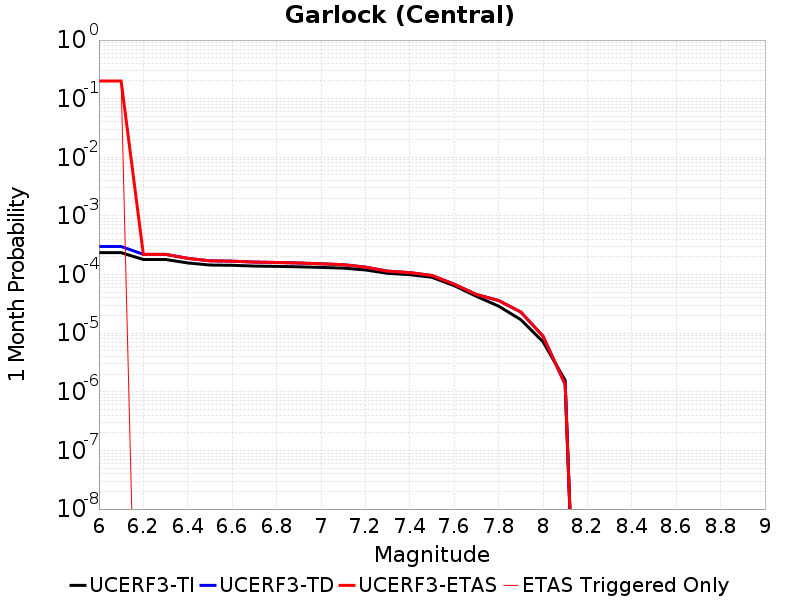
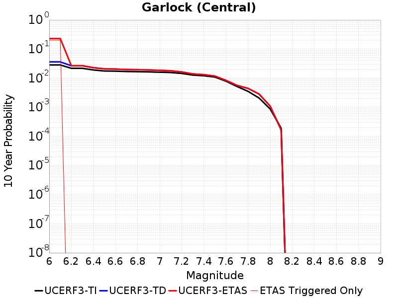

# Parent Section Magnitude-Probability Distributions

Only fault sections with at least one triggered aftershock are plotted. Sections are sorted by total supraseismogenic trigger rate (decreasing)

## Table Of Contents

* [Garlock (Central)](#garlock-central)
* [Little Lake](#little-lake)

## Garlock (Central)
*[(top)](#table-of-contents)*

| 1 Week | 1 Month | 1 Year | 10 Year |
|-----|-----|-----|-----|
|  |  |  |  |

| Magnitude | 1 wk TI Prob | 1 wk TD Prob | 1 wk ETAS Prob | 1 wk ETAS/TD Gain | 1 wk ETAS Triggered Only | 1 mo TI Prob | 1 mo TD Prob | 1 mo ETAS Prob | 1 mo ETAS/TD Gain | 1 mo ETAS Triggered Only | 1 yr TI Prob | 1 yr TD Prob | 1 yr ETAS Prob | 1 yr ETAS/TD Gain | 1 yr ETAS Triggered Only | 10 yr TI Prob | 10 yr TD Prob | 10 yr ETAS Prob | 10 yr ETAS/TD Gain | 10 yr ETAS Triggered Only |
|-----|-----|-----|-----|-----|-----|-----|-----|-----|-----|-----|-----|-----|-----|-----|-----|-----|-----|-----|-----|-----|
| 6.0 | 5.5131142E-5 | 7.024681E-5 | 0.2000562 | 2847.9043 | 0.2 | 2.3625491E-4 | 3.010234E-4 | 0.20024082 | 665.2002 | 0.2 | 0.0028726095 | 0.0036588663 | 0.2029271 | 55.46174 | 0.2 | 0.028357591 | 0.036079824 | 0.22886387 | 6.343264 | 0.2 |
| 6.1 | 5.5131142E-5 | 7.024681E-5 | 0.2000562 | 2847.9043 | 0.2 | 2.3625491E-4 | 3.010234E-4 | 0.20024082 | 665.2002 | 0.2 | 0.0028726095 | 0.0036588663 | 0.2029271 | 55.46174 | 0.2 | 0.028357591 | 0.036079824 | 0.22886387 | 6.343264 | 0.2 |
| 6.2 | 4.216245E-5 | 5.1661493E-5 | 5.1661493E-5 | 1.0 | 0.0 | 1.806837E-4 | 2.2138779E-4 | 2.2138779E-4 | 1.0 | 0.0 | 0.0021976046 | 0.0026920962 | 0.0026920962 | 1.0 | 0.0 | 0.021759989 | 0.026689773 | 0.026689773 | 1.0 | 0.0 |
| 6.3 | 4.216245E-5 | 5.1661493E-5 | 5.1661493E-5 | 1.0 | 0.0 | 1.806837E-4 | 2.2138779E-4 | 2.2138779E-4 | 1.0 | 0.0 | 0.0021976046 | 0.0026920962 | 0.0026920962 | 1.0 | 0.0 | 0.021759989 | 0.026689773 | 0.026689773 | 1.0 | 0.0 |
| 6.4 | 3.6858168E-5 | 4.411054E-5 | 4.411054E-5 | 1.0 | 0.0 | 1.5795401E-4 | 1.8903162E-4 | 1.8903162E-4 | 1.0 | 0.0 | 0.0019213937 | 0.002299056 | 0.002299056 | 1.0 | 0.0 | 0.019048655 | 0.02284894 | 0.02284894 | 1.0 | 0.0 |
| 6.5 | 3.39199E-5 | 4.0018083E-5 | 4.0018083E-5 | 1.0 | 0.0 | 1.453629E-4 | 1.7149492E-4 | 1.7149492E-4 | 1.0 | 0.0 | 0.0017683565 | 0.002085973 | 0.002085973 | 1.0 | 0.0 | 0.017543508 | 0.020759864 | 0.020759864 | 1.0 | 0.0 |
| 6.6 | 3.3571985E-5 | 3.9472274E-5 | 3.9472274E-5 | 1.0 | 0.0 | 1.4387199E-4 | 1.6915603E-4 | 1.6915603E-4 | 1.0 | 0.0 | 0.0017502342 | 0.0020575512 | 0.0020575512 | 1.0 | 0.0 | 0.017365133 | 0.020481179 | 0.020481179 | 1.0 | 0.0 |
| 6.7 | 3.2580007E-5 | 3.8088703E-5 | 3.8088703E-5 | 1.0 | 0.0 | 1.3962112E-4 | 1.632272E-4 | 1.632272E-4 | 1.0 | 0.0 | 0.0016985617 | 0.0019855013 | 0.0019855013 | 1.0 | 0.0 | 0.016856372 | 0.019773813 | 0.019773813 | 1.0 | 0.0 |
| 6.8 | 3.2185937E-5 | 3.7515918E-5 | 3.7515918E-5 | 1.0 | 0.0 | 1.3793244E-4 | 1.6077272E-4 | 1.6077272E-4 | 1.0 | 0.0 | 0.0016780337 | 0.001955672 | 0.001955672 | 1.0 | 0.0 | 0.016654192 | 0.019480614 | 0.019480614 | 1.0 | 0.0 |
| 6.9 | 3.165394E-5 | 3.6720503E-5 | 3.6720503E-5 | 1.0 | 0.0 | 1.3565269E-4 | 1.5736422E-4 | 1.5736422E-4 | 1.0 | 0.0 | 0.0016503202 | 0.001914247 | 0.001914247 | 1.0 | 0.0 | 0.01638118 | 0.019073246 | 0.019073246 | 1.0 | 0.0 |
| 7.0 | 3.0903822E-5 | 3.5625766E-5 | 3.5625766E-5 | 1.0 | 0.0 | 1.3243823E-4 | 1.5267303E-4 | 1.5267303E-4 | 1.0 | 0.0 | 0.0016112428 | 0.0018572307 | 0.0018572307 | 1.0 | 0.0 | 0.015996104 | 0.018512413 | 0.018512413 | 1.0 | 0.0 |
| 7.1 | 3.0069863E-5 | 3.4392073E-5 | 3.4392073E-5 | 1.0 | 0.0 | 1.2886449E-4 | 1.4738638E-4 | 1.4738638E-4 | 1.0 | 0.0 | 0.0015677959 | 0.0017929734 | 0.0017929734 | 1.0 | 0.0 | 0.01556781 | 0.017880075 | 0.017880075 | 1.0 | 0.0 |
| 7.2 | 2.7957109E-5 | 3.128145E-5 | 3.128145E-5 | 1.0 | 0.0 | 1.1981068E-4 | 1.340566E-4 | 1.340566E-4 | 1.0 | 0.0 | 0.0014577188 | 0.0016309366 | 0.0016309366 | 1.0 | 0.0 | 0.014481937 | 0.016283695 | 0.016283695 | 1.0 | 0.0 |
| 7.3 | 2.4519275E-5 | 2.6714795E-5 | 2.6714795E-5 | 1.0 | 0.0 | 1.0507837E-4 | 1.1448703E-4 | 1.1448703E-4 | 1.0 | 0.0 | 0.0012785783 | 0.001393003 | 0.001393003 | 1.0 | 0.0 | 0.012712469 | 0.013928054 | 0.013928054 | 1.0 | 0.0 |
| 7.4 | 2.3225532E-5 | 2.51994E-5 | 2.51994E-5 | 1.0 | 0.0 | 9.95342E-5 | 1.0799304E-4 | 1.0799304E-4 | 1.0 | 0.0 | 0.0012111551 | 0.0013140367 | 0.0013140367 | 1.0 | 0.0 | 0.012045753 | 0.013145725 | 0.013145725 | 1.0 | 0.0 |
| 7.5 | 2.097765E-5 | 2.2483688E-5 | 2.2483688E-5 | 1.0 | 0.0 | 8.9901114E-5 | 9.635517E-5 | 9.635517E-5 | 1.0 | 0.0 | 0.0010939965 | 0.0011725046 | 0.0011725046 | 1.0 | 0.0 | 0.010886264 | 0.011740365 | 0.011740365 | 1.0 | 0.0 |
| 7.6 | 1.511254E-5 | 1.5991332E-5 | 1.5991332E-5 | 1.0 | 0.0 | 6.476642E-5 | 6.853253E-5 | 6.853253E-5 | 1.0 | 0.0 | 7.882459E-4 | 8.3407195E-4 | 8.3407195E-4 | 1.0 | 0.0 | 0.007854558 | 0.008383559 | 0.008383559 | 1.0 | 0.0 |
| 7.7 | 9.934069E-6 | 1.0678794E-5 | 1.0678794E-5 | 1.0 | 0.0 | 4.2573887E-5 | 4.5765457E-5 | 4.5765457E-5 | 1.0 | 0.0 | 5.182138E-4 | 5.570524E-4 | 5.570524E-4 | 1.0 | 0.0 | 0.00517007 | 0.005627684 | 0.005627684 | 1.0 | 0.0 |
| 7.8 | 6.7562896E-6 | 8.428449E-6 | 8.428449E-6 | 1.0 | 0.0 | 2.8955206E-5 | 3.6121426E-5 | 3.6121426E-5 | 1.0 | 0.0 | 3.5247262E-4 | 4.3968976E-4 | 4.3968976E-4 | 1.0 | 0.0 | 0.0035191406 | 0.004446654 | 0.004446654 | 1.0 | 0.0 |
| 7.9 | 3.975453E-6 | 5.37103E-6 | 5.37103E-6 | 1.0 | 0.0 | 1.7037546E-5 | 2.3018498E-5 | 2.3018498E-5 | 1.0 | 0.0 | 2.0741238E-4 | 2.8021427E-4 | 2.8021427E-4 | 1.0 | 0.0 | 0.002072189 | 0.0028336283 | 0.0028336283 | 1.0 | 0.0 |
| 8.0 | 1.6729537E-6 | 2.0775144E-6 | 2.0775144E-6 | 1.0 | 0.0 | 7.169782E-6 | 8.903603E-6 | 8.903603E-6 | 1.0 | 0.0 | 8.7288594E-5 | 1.0839601E-4 | 1.0839601E-4 | 1.0 | 0.0 | 8.7254314E-4 | 0.0010969337 | 0.0010969337 | 1.0 | 0.0 |
| 8.1 | 3.6733252E-7 | 3.1489964E-7 | 3.1489964E-7 | 1.0 | 0.0 | 1.5742813E-6 | 1.3495693E-6 | 1.3495693E-6 | 1.0 | 0.0 | 1.9166706E-5 | 1.6430899E-5 | 1.6430899E-5 | 1.0 | 0.0 | 1.9165053E-4 | 1.6638759E-4 | 1.6638759E-4 | 1.0 | 0.0 |

## Little Lake
*[(top)](#table-of-contents)*

| 1 Week | 1 Month | 1 Year | 10 Year |
|-----|-----|-----|-----|
|  |  |  |  |

| Magnitude | 1 wk TI Prob | 1 wk TD Prob | 1 wk ETAS Prob | 1 wk ETAS/TD Gain | 1 wk ETAS Triggered Only | 1 mo TI Prob | 1 mo TD Prob | 1 mo ETAS Prob | 1 mo ETAS/TD Gain | 1 mo ETAS Triggered Only | 1 yr TI Prob | 1 yr TD Prob | 1 yr ETAS Prob | 1 yr ETAS/TD Gain | 1 yr ETAS Triggered Only | 10 yr TI Prob | 10 yr TD Prob | 10 yr ETAS Prob | 10 yr ETAS/TD Gain | 10 yr ETAS Triggered Only |
|-----|-----|-----|-----|-----|-----|-----|-----|-----|-----|-----|-----|-----|-----|-----|-----|-----|-----|-----|-----|-----|
| 6.0 | 2.8424427E-5 | 3.120572E-5 | 0.10002808 | 3205.4407 | 0.1 | 1.2181328E-4 | 1.337327E-4 | 0.10012036 | 748.6603 | 0.1 | 0.0014820677 | 0.0016271127 | 0.1014644 | 62.358555 | 0.1 | 0.014722223 | 0.016165402 | 0.11454886 | 7.0860515 | 0.1 |
| 6.1 | 2.8424427E-5 | 3.120572E-5 | 0.10002808 | 3205.4407 | 0.1 | 1.2181328E-4 | 1.337327E-4 | 0.10012036 | 748.6603 | 0.1 | 0.0014820677 | 0.0016271127 | 0.1014644 | 62.358555 | 0.1 | 0.014722223 | 0.016165402 | 0.11454886 | 7.0860515 | 0.1 |
| 6.2 | 2.8424427E-5 | 3.120572E-5 | 0.10002808 | 3205.4407 | 0.1 | 1.2181328E-4 | 1.337327E-4 | 0.10012036 | 748.6603 | 0.1 | 0.0014820677 | 0.0016271127 | 0.1014644 | 62.358555 | 0.1 | 0.014722223 | 0.016165402 | 0.11454886 | 7.0860515 | 0.1 |
| 6.3 | 1.48860645E-5 | 1.6081389E-5 | 1.6081389E-5 | 1.0 | 0.0 | 6.379586E-5 | 6.8918576E-5 | 6.8918576E-5 | 1.0 | 0.0 | 7.7643775E-4 | 8.3878887E-4 | 8.3878887E-4 | 1.0 | 0.0 | 0.007737305 | 0.008359048 | 0.008359048 | 1.0 | 0.0 |
| 6.4 | 1.48860645E-5 | 1.6081389E-5 | 1.6081389E-5 | 1.0 | 0.0 | 6.379586E-5 | 6.8918576E-5 | 6.8918576E-5 | 1.0 | 0.0 | 7.7643775E-4 | 8.3878887E-4 | 8.3878887E-4 | 1.0 | 0.0 | 0.007737305 | 0.008359048 | 0.008359048 | 1.0 | 0.0 |
| 6.5 | 1.2797581E-5 | 1.3765565E-5 | 1.3765565E-5 | 1.0 | 0.0 | 5.4845623E-5 | 5.899409E-5 | 5.899409E-5 | 1.0 | 0.0 | 6.675408E-4 | 7.18042E-4 | 7.18042E-4 | 1.0 | 0.0 | 0.006655392 | 0.00715977 | 0.00715977 | 1.0 | 0.0 |
| 6.6 | 9.661896E-6 | 1.0289038E-5 | 1.0289038E-5 | 1.0 | 0.0 | 4.1407468E-5 | 4.409522E-5 | 4.409522E-5 | 1.0 | 0.0 | 5.040193E-4 | 5.367433E-4 | 5.367433E-4 | 1.0 | 0.0 | 0.005028777 | 0.0053560743 | 0.0053560743 | 1.0 | 0.0 |
| 6.7 | 7.767871E-6 | 8.199687E-6 | 8.199687E-6 | 1.0 | 0.0 | 3.329045E-5 | 3.5141118E-5 | 3.5141118E-5 | 1.0 | 0.0 | 4.0523586E-4 | 4.2777284E-4 | 4.2777284E-4 | 1.0 | 0.0 | 0.004044977 | 0.004270846 | 0.004270846 | 1.0 | 0.0 |
| 6.8 | 6.4235196E-6 | 6.7357446E-6 | 6.7357446E-6 | 1.0 | 0.0 | 2.752908E-5 | 2.8867229E-5 | 2.8867229E-5 | 1.0 | 0.0 | 3.35115E-4 | 3.5141467E-4 | 3.5141467E-4 | 1.0 | 0.0 | 0.003346101 | 0.00350985 | 0.00350985 | 1.0 | 0.0 |
| 6.9 | 3.1283696E-6 | 3.1121804E-6 | 3.1121804E-6 | 1.0 | 0.0 | 1.3407229E-5 | 1.3337856E-5 | 1.3337856E-5 | 1.0 | 0.0 | 1.6322079E-4 | 1.6237781E-4 | 1.6237781E-4 | 1.0 | 0.0 | 0.0016310095 | 0.00162274 | 0.00162274 | 1.0 | 0.0 |
| 7.0 | 2.290603E-6 | 2.2286815E-6 | 2.2286815E-6 | 1.0 | 0.0 | 9.816834E-6 | 9.551463E-6 | 9.551463E-6 | 1.0 | 0.0 | 1.19513395E-4 | 1.162839E-4 | 1.162839E-4 | 1.0 | 0.0 | 0.0011944914 | 0.0011623327 | 0.0011623327 | 1.0 | 0.0 |
| 7.1 | 1.293693E-6 | 1.1776827E-6 | 1.1776827E-6 | 1.0 | 0.0 | 5.5443866E-6 | 5.0472063E-6 | 5.0472063E-6 | 1.0 | 0.0 | 6.750081E-5 | 6.14487E-5 | 6.14487E-5 | 1.0 | 0.0 | 6.7480316E-4 | 6.143856E-4 | 6.143856E-4 | 1.0 | 0.0 |
| 7.2 | 4.715842E-7 | 3.0917857E-7 | 3.0917857E-7 | 1.0 | 0.0 | 2.0210737E-6 | 1.3250503E-6 | 1.3250503E-6 | 1.0 | 0.0 | 2.4606294E-5 | 1.6132375E-5 | 1.6132375E-5 | 1.0 | 0.0 | 2.460357E-4 | 1.6131258E-4 | 1.6131258E-4 | 1.0 | 0.0 |
| 7.3 | 3.9430947E-7 | 2.3097488E-7 | 2.3097488E-7 | 1.0 | 0.0 | 1.6898966E-6 | 9.89892E-7 | 9.89892E-7 | 1.0 | 0.0 | 2.0574296E-5 | 1.2051869E-5 | 1.2051869E-5 | 1.0 | 0.0 | 2.0572392E-4 | 1.20512224E-4 | 1.20512224E-4 | 1.0 | 0.0 |
| 7.4 | 3.547123E-7 | 1.9679135E-7 | 1.9679135E-7 | 1.0 | 0.0 | 1.5201948E-6 | 8.4339126E-7 | 8.4339126E-7 | 1.0 | 0.0 | 1.8508214E-5 | 1.0268241E-5 | 1.0268241E-5 | 1.0 | 0.0 | 1.8506673E-4 | 1.02677724E-4 | 1.02677724E-4 | 1.0 | 0.0 |
| 7.5 | 2.6354266E-7 | 1.4423138E-7 | 1.4423138E-7 | 1.0 | 0.0 | 1.129468E-6 | 6.181344E-7 | 6.181344E-7 | 1.0 | 0.0 | 1.3751187E-5 | 7.5257603E-6 | 7.5257603E-6 | 1.0 | 0.0 | 1.3750336E-4 | 7.5255106E-5 | 7.5255106E-5 | 1.0 | 0.0 |
| 7.6 | 1.269913E-7 | 7.572556E-8 | 7.572556E-8 | 1.0 | 0.0 | 5.4424834E-7 | 3.245381E-7 | 3.245381E-7 | 1.0 | 0.0 | 6.6262032E-6 | 3.9512443E-6 | 3.9512443E-6 | 1.0 | 0.0 | 6.626006E-5 | 3.9511775E-5 | 3.9511775E-5 | 1.0 | 0.0 |

