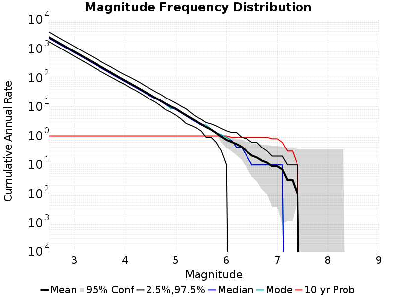
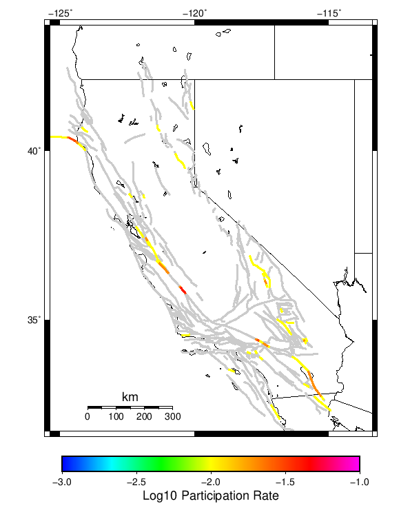
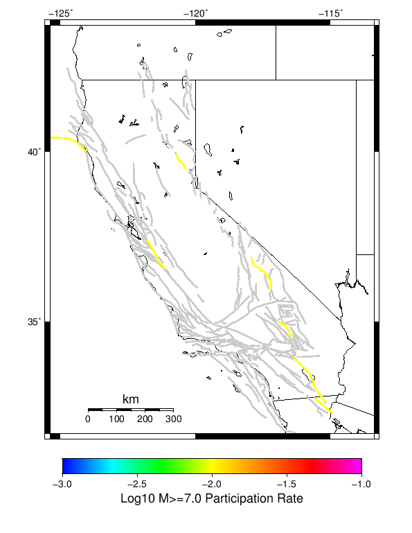
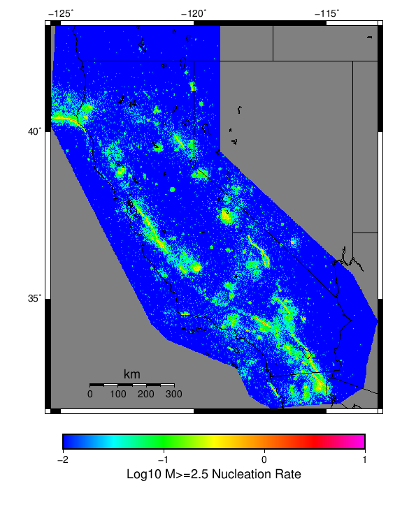
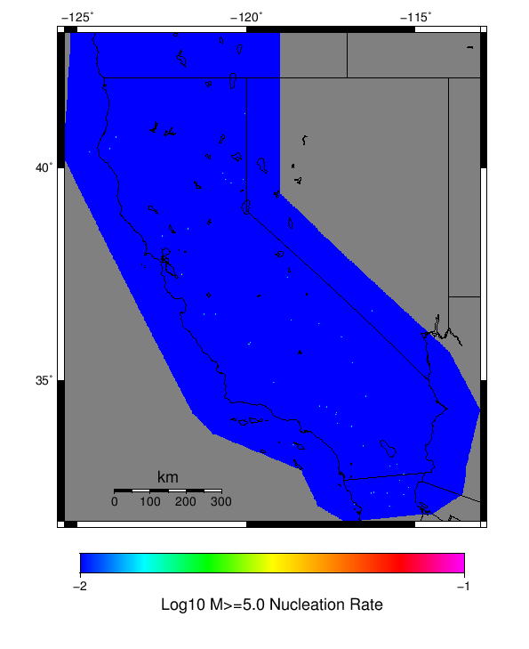

# Input Catalog With Spontaneous Results

|   | Input Catalog With Spontaneous |
|-----|-----|
| Num Simulations | 10 |
| Start Time | 2012/01/01 12:00:00 UTC |
| Start Time Epoch Milliseconds | 1325419200000 |
| Duration | 10 Years |
| Includes Spontaneous? | true |
| Trigger Ruptures | *(none)* |
| Historical Ruptures | 10167 Trigger Ruptures |
|   | First: M7.6 at 1872/03/26 10:31:39 UTC |
|   | Last: M3.2 at 2011/12/31 19:14:44 UTC |
|   | Largest: M7.8 at 1906/04/18 13:12:21 UTC |

## Table Of Contents

* [Magnitude Frequency Distribution](#magnitude-frequency-distribution)
* [Section Participation](#section-participation)
  * [Section Participation Plots](#section-participation-plots)
  * [Supra-Seismogenic Parent Sections Table](#supra-seismogenic-parent-sections-table)
  * [M≥6.5 Parent Sections Table](#m65-parent-sections-table)
  * [M≥7 Parent Sections Table](#m7-parent-sections-table)
* [Gridded Nucleation](#gridded-nucleation)

## Magnitude Frequency Distribution
*[(top)](#table-of-contents)*

**Legend**
* **Mean** (thick black line): mean annual rate across all 10 catalogs
* **95% Conf** (light gray shaded region): binomial 95% confidence bounds on mean value
* **2.5%,97.5%** (thin black lines): annual rate percentiles across all 10 catalogs
* **Median** (thin blue line): median annual rate across all 10 catalogs
* **Mode** (thin cyan line): modal annual rate across all 10 catalogs (scaled to annualized value)
* **10 yr Probability** (thin red line): 10 year probability calculated as the fraction of catalogs with at least 1 occurrence

| Mag | Mean | 2.5 %ile | 97.5 %ile | Median | Mode | 10 yr Probability |
|-----|-----|-----|-----|-----|-----|-----|
| **M≥2.5** | 2551.06 | 1789.3 | 3864.9 | 2337.7 | 2491.4 | 1.0 |
| **M≥2.6** | 2020.09 | 1415.7 | 3049.6 | 1853.1 | 1968.8 | 1.0 |
| **M≥2.7** | 1600.82 | 1131.6 | 2406.9 | 1465.2 | 1557.9 | 1.0 |
| **M≥2.8** | 1273.12 | 892.2 | 1917.0 | 1169.5 | 1235.6 | 1.0 |
| **M≥2.9** | 1009.53 | 708.4 | 1530.1 | 930.5 | 972.2 | 1.0 |
| **M≥3** | 803.9 | 557.7 | 1222.6 | 736.7 | 773.7 | 1.0 |
| **M≥3.1** | 638.76 | 444.2 | 962.6 | 590.8 | 618.7 | 1.0 |
| **M≥3.2** | 507.25 | 354.2 | 762.6 | 468.9 | 492.5 | 1.0 |
| **M≥3.3** | 402.75 | 280.4 | 610.0 | 370.1 | 389.2 | 1.0 |
| **M≥3.4** | 320.71 | 219.9 | 488.2 | 292.5 | 309.0 | 1.0 |
| **M≥3.5** | 254.11 | 173.4 | 385.2 | 231.6 | 245.6 | 1.0 |
| **M≥3.6** | 202.92 | 140.0 | 307.0 | 185.6 | 197.3 | 1.0 |
| **M≥3.7** | 160.78 | 111.4 | 249.1 | 147.0 | 154.3 | 1.0 |
| **M≥3.8** | 127.43 | 90.2 | 198.3 | 116.1 | 122.2 | 1.0 |
| **M≥3.9** | 101.27 | 72.1 | 156.6 | 93.3 | 98.2 | 1.0 |
| **M≥4** | 80.58 | 59.3 | 127.3 | 73.8 | 78.8 | 1.0 |
| **M≥4.1** | 64.25 | 45.9 | 104.6 | 59.0 | 61.3 | 1.0 |
| **M≥4.2** | 51.31 | 37.5 | 84.4 | 47.4 | 48.9 | 1.0 |
| **M≥4.3** | 40.94 | 29.8 | 67.8 | 37.8 | 38.1 | 1.0 |
| **M≥4.4** | 32.4 | 23.1 | 52.9 | 29.9 | 30.1 | 1.0 |
| **M≥4.5** | 25.76 | 18.1 | 42.3 | 23.5 | 23.8 | 1.0 |
| **M≥4.6** | 20.43 | 14.5 | 33.5 | 19.2 | 19.8 | 1.0 |
| **M≥4.7** | 16.52 | 11.0 | 27.2 | 15.6 | 15.9 | 1.0 |
| **M≥4.8** | 13.01 | 8.0 | 21.1 | 12.1 | 12.1 | 1.0 |
| **M≥4.9** | 10.39 | 6.6 | 16.7 | 9.8 | 8.9 | 1.0 |
| **M≥5** | 8.58 | 5.2 | 13.5 | 8.0 | 8.4 | 1.0 |
| **M≥5.1** | 6.64 | 3.9 | 10.6 | 6.3 | 6.4 | 1.0 |
| **M≥5.2** | 5.17 | 2.7 | 8.6 | 4.9 | 5.0 | 1.0 |
| **M≥5.3** | 4.09 | 2.3 | 6.2 | 3.8 | 3.8 | 1.0 |
| **M≥5.4** | 3.22 | 1.9 | 4.6 | 3.0 | 3.0 | 1.0 |
| **M≥5.5** | 2.58 | 1.5 | 3.8 | 2.4 | 2.4 | 1.0 |
| **M≥5.6** | 2.03 | 0.9 | 2.9 | 2.0 | 2.4 | 1.0 |
| **M≥5.7** | 1.65 | 0.9 | 2.6 | 1.7 | 1.7 | 1.0 |
| **M≥5.8** | 1.26 | 0.6 | 2.2 | 1.3 | 1.3 | 1.0 |
| **M≥5.9** | 0.94 | 0.3 | 1.8 | 1.0 | 1.1 | 1.0 |
| **M≥6** | 0.73 | 0.1 | 1.5 | 0.7 | 0.9 | 1.0 |
| **M≥6.1** | 0.62 | 0.0 | 1.3 | 0.7 | 0.7 | 0.9 |
| **M≥6.2** | 0.52 | 0.0 | 1.3 | 0.4 | 0.4 | 0.9 |
| **M≥6.3** | 0.42 | 0.0 | 0.9 | 0.4 | 0.4 | 0.9 |
| **M≥6.4** | 0.29 | 0.0 | 0.8 | 0.2 | 0.2 | 0.9 |
| **M≥6.5** | 0.21 | 0.0 | 0.6 | 0.1 | 0.1 | 0.9 |
| **M≥6.6** | 0.18 | 0.0 | 0.6 | 0.1 | 0.1 | 0.9 |
| **M≥6.7** | 0.14 | 0.0 | 0.4 | 0.1 | 0.1 | 0.9 |
| **M≥6.8** | 0.12 | 0.0 | 0.3 | 0.1 | 0.1 | 0.9 |
| **M≥6.9** | 0.09 | 0.0 | 0.2 | 0.1 | 0.1 | 0.8 |
| **M≥7** | 0.09 | 0.0 | 0.2 | 0.1 | 0.1 | 0.8 |
| **M≥7.1** | 0.07 | 0.0 | 0.2 | 0.1 | 0.1 | 0.6 |
| **M≥7.2** | 0.03 | 0.0 | 0.1 | 0.0 | 0.0 | 0.3 |
| **M≥7.3** | 0.03 | 0.0 | 0.1 | 0.0 | 0.0 | 0.3 |
| **M≥7.4** | 0.01 | 0.0 | 0.1 | 0.0 | 0.0 | 0.1 |
| **M≥7.5** | 0.0 | 0.0 | 0.0 | 0.0 | 0.0 | 0.0 |
| **M≥7.6** | 0.0 | 0.0 | 0.0 | 0.0 | 0.0 | 0.0 |
| **M≥7.7** | 0.0 | 0.0 | 0.0 | 0.0 | 0.0 | 0.0 |
| **M≥7.8** | 0.0 | 0.0 | 0.0 | 0.0 | 0.0 | 0.0 |
| **M≥7.9** | 0.0 | 0.0 | 0.0 | 0.0 | 0.0 | 0.0 |
| **M≥8** | 0.0 | 0.0 | 0.0 | 0.0 | 0.0 | 0.0 |
| **M≥8.1** | 0.0 | 0.0 | 0.0 | 0.0 | 0.0 | 0.0 |
| **M≥8.2** | 0.0 | 0.0 | 0.0 | 0.0 | 0.0 | 0.0 |
| **M≥8.3** | 0.0 | 0.0 | 0.0 | 0.0 | 0.0 | 0.0 |
| **M≥8.4** | 0.0 | 0.0 | 0.0 | 0.0 | 0.0 | 0.0 |
| **M≥8.5** | 0.0 | 0.0 | 0.0 | 0.0 | 0.0 | 0.0 |
| **M≥8.6** | 0.0 | 0.0 | 0.0 | 0.0 | 0.0 | 0.0 |
| **M≥8.7** | 0.0 | 0.0 | 0.0 | 0.0 | 0.0 | 0.0 |
| **M≥8.8** | 0.0 | 0.0 | 0.0 | 0.0 | 0.0 | 0.0 |
| **M≥8.9** | 0.0 | 0.0 | 0.0 | 0.0 | 0.0 | 0.0 |
| **M≥9** | 0.0 | 0.0 | 0.0 | 0.0 | 0.0 | 0.0 |

## Section Participation
*[(top)](#table-of-contents)*

### Section Participation Plots
*[(top)](#table-of-contents)*

| Min Mag | Complete Catalog (including spontaneous) |
|-----|-----|
| **All Supra. Seis.** |  |
| **M≥6.5** |  |
| **M≥7** |  |

### Supra-Seismogenic Parent Sections Table
*[(top)](#table-of-contents)*

*First 10 of 37 with matching ruptures shown*

| Parent Name | Total Mean Annual Rate | Total 10 Year Prob |
|-----|-----|-----|
| Mendocino | 0.05 | 0.4 |
| San Andreas (Parkfield) | 0.04 | 0.4 |
| Ash Hill | 0.03 | 0.1 |
| San Andreas (Mojave S) | 0.03 | 0.3 |
| Brawley (Seismic Zone) alt 1 | 0.02 | 0.2 |
| Calaveras (Central) 2011 CFM | 0.02 | 0.2 |
| Cleghorn Pass | 0.02 | 0.1 |
| Hayward (So) 2011 CFM | 0.02 | 0.2 |
| Imperial | 0.02 | 0.2 |
| San Andreas (Creeping Section) 2011 CFM | 0.02 | 0.2 |

### M≥6.5 Parent Sections Table
*[(top)](#table-of-contents)*

*First 10 of 21 with matching ruptures shown*

| Parent Name | Total Mean Annual Rate | Total 10 Year Prob |
|-----|-----|-----|
| Brawley (Seismic Zone) alt 1 | 0.02 | 0.2 |
| Imperial | 0.02 | 0.2 |
| Mendocino | 0.02 | 0.2 |
| Ash Hill | 0.01 | 0.1 |
| Cady | 0.01 | 0.1 |
| Calaveras (Central) 2011 CFM | 0.01 | 0.1 |
| Calaveras (So) - Paicines extension 2011 CFM | 0.01 | 0.1 |
| Calaveras (So) 2011 CFM | 0.01 | 0.1 |
| Calico-Hidalgo | 0.01 | 0.1 |
| Cerro Prieto | 0.01 | 0.1 |

### M≥7 Parent Sections Table
*[(top)](#table-of-contents)*

*First 10 of 14 with matching ruptures shown*

| Parent Name | Total Mean Annual Rate | Total 10 Year Prob |
|-----|-----|-----|
| Brawley (Seismic Zone) alt 1 | 0.01 | 0.1 |
| Calaveras (Central) 2011 CFM | 0.01 | 0.1 |
| Calaveras (So) - Paicines extension 2011 CFM | 0.01 | 0.1 |
| Calaveras (So) 2011 CFM | 0.01 | 0.1 |
| Calico-Hidalgo | 0.01 | 0.1 |
| Cerro Prieto | 0.01 | 0.1 |
| Hunter Mountain-Saline Valley | 0.01 | 0.1 |
| Imperial | 0.01 | 0.1 |
| Mendocino | 0.01 | 0.1 |
| Mohawk Valley 2011 CFM | 0.01 | 0.1 |
## Gridded Nucleation
*[(top)](#table-of-contents)*

| Min Mag | Complete Catalog (including spontaneous) |
|-----|-----|
| **M≥2.5** |  |
| **M≥5** |  |
| **M≥6** |  |
| **M≥7** |  |
