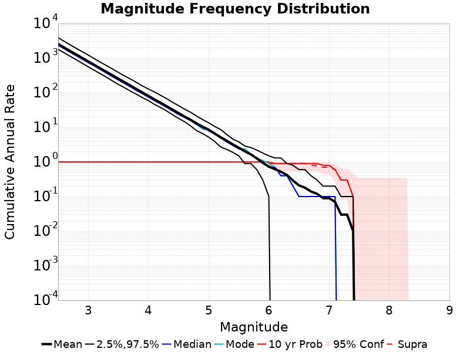

# Input Catalog With Spontaneous Results

|   | Input Catalog With Spontaneous |
|-----|-----|
| Num Simulations | 10 |
| Start Time | 2012/01/01 00:00:00 UTC |
| Start Time Epoch Milliseconds | 1325376000000 |
| Duration | 10 Years |
| Includes Spontaneous? | true |
| Trigger Ruptures | *(none)* |
| Historical Ruptures | 10167 Trigger Ruptures |
|   | First: M7.6 at 1872/03/26 10:31:39 UTC |
|   | Last: M3.2 at 2011/12/31 19:14:44 UTC |
|   | Largest: M7.8 at 1906/04/18 13:12:21 UTC |

## Table Of Contents

* [Magnitude Frequency Distribution](#magnitude-frequency-distribution)
* [Section Participation](#section-participation)
  * [Section Participation Plots](#section-participation-plots)
  * [Supra-Seismogenic Parent Sections Table](#supra-seismogenic-parent-sections-table)
  * [M≥6.5 Parent Sections Table](#m65-parent-sections-table)
  * [M≥7 Parent Sections Table](#m7-parent-sections-table)
* [Gridded Nucleation](#gridded-nucleation)

## Magnitude Frequency Distribution
*[(top)](#table-of-contents)*

**Legend**
* **Mean** (thick black line): mean annual rate across all 10 catalogs
* **2.5%,97.5%** (thin black lines): annual rate percentiles across all 10 catalogs
* **Median** (thin blue line): median annual rate across all 10 catalogs
* **Mode** (thin cyan line): modal annual rate across all 10 catalogs (scaled to annualized value)
* **10 yr Probability** (thin red line): 10 year probability calculated as the fraction of catalogs with at least 1 occurrence
* **95% Conf** (light red shaded region): binomial 95% confidence bounds on probability

| Mag | Mean | 2.5 %ile | 97.5 %ile | Median | Mode | 10 yr Probability |
|-----|-----|-----|-----|-----|-----|-----|
| **M≥2.5** | 2551.060 | 1789.300 | 3864.900 | 2337.700 | 2491.400 | 1.000 |
| **M≥2.6** | 2020.090 | 1415.700 | 3049.600 | 1853.100 | 1968.800 | 1.000 |
| **M≥2.7** | 1600.820 | 1131.600 | 2406.900 | 1465.200 | 1557.900 | 1.000 |
| **M≥2.8** | 1273.120 | 892.200 | 1917.000 | 1169.500 | 1235.600 | 1.000 |
| **M≥2.9** | 1009.530 | 708.400 | 1530.100 | 930.500 | 972.200 | 1.000 |
| **M≥3** | 803.900 | 557.700 | 1222.600 | 736.700 | 773.700 | 1.000 |
| **M≥3.1** | 638.760 | 444.200 | 962.600 | 590.800 | 618.700 | 1.000 |
| **M≥3.2** | 507.250 | 354.200 | 762.600 | 468.900 | 492.500 | 1.000 |
| **M≥3.3** | 402.750 | 280.400 | 610.000 | 370.100 | 389.200 | 1.000 |
| **M≥3.4** | 320.710 | 219.900 | 488.200 | 292.500 | 309.000 | 1.000 |
| **M≥3.5** | 254.110 | 173.400 | 385.200 | 231.600 | 245.600 | 1.000 |
| **M≥3.6** | 202.920 | 140.000 | 307.000 | 185.600 | 197.300 | 1.000 |
| **M≥3.7** | 160.780 | 111.400 | 249.100 | 147.000 | 154.300 | 1.000 |
| **M≥3.8** | 127.430 | 90.200 | 198.300 | 116.100 | 122.200 | 1.000 |
| **M≥3.9** | 101.270 | 72.100 | 156.600 | 93.300 | 98.200 | 1.000 |
| **M≥4** | 80.580 | 59.300 | 127.300 | 73.800 | 78.800 | 1.000 |
| **M≥4.1** | 64.250 | 45.900 | 104.600 | 59.000 | 61.300 | 1.000 |
| **M≥4.2** | 51.310 | 37.500 | 84.400 | 47.400 | 48.900 | 1.000 |
| **M≥4.3** | 40.940 | 29.800 | 67.800 | 37.800 | 38.100 | 1.000 |
| **M≥4.4** | 32.400 | 23.100 | 52.900 | 29.900 | 30.100 | 1.000 |
| **M≥4.5** | 25.760 | 18.100 | 42.300 | 23.500 | 23.800 | 1.000 |
| **M≥4.6** | 20.430 | 14.500 | 33.500 | 19.200 | 19.800 | 1.000 |
| **M≥4.7** | 16.520 | 11.000 | 27.200 | 15.600 | 15.900 | 1.000 |
| **M≥4.8** | 13.010 | 8.000 | 21.100 | 12.100 | 12.100 | 1.000 |
| **M≥4.9** | 10.390 | 6.600 | 16.700 | 9.800 | 8.900 | 1.000 |
| **M≥5** | 8.580 | 5.200 | 13.500 | 8.000 | 8.400 | 1.000 |
| **M≥5.1** | 6.640 | 3.900 | 10.600 | 6.300 | 6.400 | 1.000 |
| **M≥5.2** | 5.170 | 2.700 | 8.600 | 4.900 | 5.000 | 1.000 |
| **M≥5.3** | 4.090 | 2.300 | 6.200 | 3.800 | 3.800 | 1.000 |
| **M≥5.4** | 3.220 | 1.900 | 4.600 | 3.000 | 3.000 | 1.000 |
| **M≥5.5** | 2.580 | 1.500 | 3.800 | 2.400 | 2.400 | 1.000 |
| **M≥5.6** | 2.030 | 0.900 | 2.900 | 2.000 | 2.400 | 1.000 |
| **M≥5.7** | 1.650 | 0.900 | 2.600 | 1.700 | 1.700 | 1.000 |
| **M≥5.8** | 1.260 | 0.600 | 2.200 | 1.300 | 1.300 | 1.000 |
| **M≥5.9** | 0.940 | 0.300 | 1.800 | 1.000 | 1.100 | 1.000 |
| **M≥6** | 0.730 | 0.100 | 1.500 | 0.700 | 0.900 | 1.000 |
| **M≥6.1** | 0.620 | 0.000 | 1.300 | 0.700 | 0.700 | 0.900 |
| **M≥6.2** | 0.520 | 0.000 | 1.300 | 0.400 | 0.400 | 0.900 |
| **M≥6.3** | 0.420 | 0.000 | 0.900 | 0.400 | 0.400 | 0.900 |
| **M≥6.4** | 0.290 | 0.000 | 0.800 | 0.200 | 0.200 | 0.900 |
| **M≥6.5** | 0.210 | 0.000 | 0.600 | 0.100 | 0.100 | 0.900 |
| **M≥6.6** | 0.180 | 0.000 | 0.600 | 0.100 | 0.100 | 0.900 |
| **M≥6.7** | 0.140 | 0.000 | 0.400 | 0.100 | 0.100 | 0.900 |
| **M≥6.8** | 0.120 | 0.000 | 0.300 | 0.100 | 0.100 | 0.900 |
| **M≥6.9** | 0.090 | 0.000 | 0.200 | 0.100 | 0.100 | 0.800 |
| **M≥7** | 0.090 | 0.000 | 0.200 | 0.100 | 0.100 | 0.800 |
| **M≥7.1** | 0.070 | 0.000 | 0.200 | 0.100 | 0.100 | 0.600 |
| **M≥7.2** | 0.030 | 0.000 | 0.100 | 0.000 | 0.000 | 0.300 |
| **M≥7.3** | 0.030 | 0.000 | 0.100 | 0.000 | 0.000 | 0.300 |
| **M≥7.4** | 0.010 | 0.000 | 0.100 | 0.000 | 0.000 | 0.100 |
| **M≥7.5** | 0.000 | 0.000 | 0.000 | 0.000 | 0.000 | 0.000 |
| **M≥7.6** | 0.000 | 0.000 | 0.000 | 0.000 | 0.000 | 0.000 |
| **M≥7.7** | 0.000 | 0.000 | 0.000 | 0.000 | 0.000 | 0.000 |
| **M≥7.8** | 0.000 | 0.000 | 0.000 | 0.000 | 0.000 | 0.000 |
| **M≥7.9** | 0.000 | 0.000 | 0.000 | 0.000 | 0.000 | 0.000 |
| **M≥8** | 0.000 | 0.000 | 0.000 | 0.000 | 0.000 | 0.000 |
| **M≥8.1** | 0.000 | 0.000 | 0.000 | 0.000 | 0.000 | 0.000 |
| **M≥8.2** | 0.000 | 0.000 | 0.000 | 0.000 | 0.000 | 0.000 |
| **M≥8.3** | 0.000 | 0.000 | 0.000 | 0.000 | 0.000 | 0.000 |
| **M≥8.4** | 0.000 | 0.000 | 0.000 | 0.000 | 0.000 | 0.000 |
| **M≥8.5** | 0.000 | 0.000 | 0.000 | 0.000 | 0.000 | 0.000 |
| **M≥8.6** | 0.000 | 0.000 | 0.000 | 0.000 | 0.000 | 0.000 |
| **M≥8.7** | 0.000 | 0.000 | 0.000 | 0.000 | 0.000 | 0.000 |
| **M≥8.8** | 0.000 | 0.000 | 0.000 | 0.000 | 0.000 | 0.000 |
| **M≥8.9** | 0.000 | 0.000 | 0.000 | 0.000 | 0.000 | 0.000 |
| **M≥9** | 0.000 | 0.000 | 0.000 | 0.000 | 0.000 | 0.000 |

## Section Participation
*[(top)](#table-of-contents)*

### Section Participation Plots
*[(top)](#table-of-contents)*

| Min Mag | Complete Catalog (including spontaneous) |
|-----|-----|
| **All Supra. Seis.** |  |
| **M≥6.5** |  |
| **M≥7** |  |

### Supra-Seismogenic Parent Sections Table
*[(top)](#table-of-contents)*

*First 10 of 37 with matching ruptures shown*

| Parent Name | Total Mean Annual Rate | Total 10 Year Prob |
|-----|-----|-----|
| Mendocino | 0.05 | 0.4 |
| San Andreas (Parkfield) | 0.04 | 0.4 |
| Ash Hill | 0.03 | 0.1 |
| San Andreas (Mojave S) | 0.03 | 0.3 |
| Brawley (Seismic Zone) alt 1 | 0.02 | 0.2 |
| Calaveras (Central) 2011 CFM | 0.02 | 0.2 |
| Cleghorn Pass | 0.02 | 0.1 |
| Hayward (So) 2011 CFM | 0.02 | 0.2 |
| Imperial | 0.02 | 0.2 |
| San Andreas (Creeping Section) 2011 CFM | 0.02 | 0.2 |

### M≥6.5 Parent Sections Table
*[(top)](#table-of-contents)*

*First 10 of 21 with matching ruptures shown*

| Parent Name | Total Mean Annual Rate | Total 10 Year Prob |
|-----|-----|-----|
| Brawley (Seismic Zone) alt 1 | 0.02 | 0.2 |
| Imperial | 0.02 | 0.2 |
| Mendocino | 0.02 | 0.2 |
| Ash Hill | 0.01 | 0.1 |
| Cady | 0.01 | 0.1 |
| Calaveras (Central) 2011 CFM | 0.01 | 0.1 |
| Calaveras (So) - Paicines extension 2011 CFM | 0.01 | 0.1 |
| Calaveras (So) 2011 CFM | 0.01 | 0.1 |
| Calico-Hidalgo | 0.01 | 0.1 |
| Cerro Prieto | 0.01 | 0.1 |

### M≥7 Parent Sections Table
*[(top)](#table-of-contents)*

*First 10 of 14 with matching ruptures shown*

| Parent Name | Total Mean Annual Rate | Total 10 Year Prob |
|-----|-----|-----|
| Brawley (Seismic Zone) alt 1 | 0.01 | 0.1 |
| Calaveras (Central) 2011 CFM | 0.01 | 0.1 |
| Calaveras (So) - Paicines extension 2011 CFM | 0.01 | 0.1 |
| Calaveras (So) 2011 CFM | 0.01 | 0.1 |
| Calico-Hidalgo | 0.01 | 0.1 |
| Cerro Prieto | 0.01 | 0.1 |
| Hunter Mountain-Saline Valley | 0.01 | 0.1 |
| Imperial | 0.01 | 0.1 |
| Mendocino | 0.01 | 0.1 |
| Mohawk Valley 2011 CFM | 0.01 | 0.1 |
## Gridded Nucleation
*[(top)](#table-of-contents)*

| Min Mag | Complete Catalog (including spontaneous) |
|-----|-----|
| **M≥2.5** |  |
| **M≥5** |  |
| **M≥6** |  |
| **M≥7** |  |
