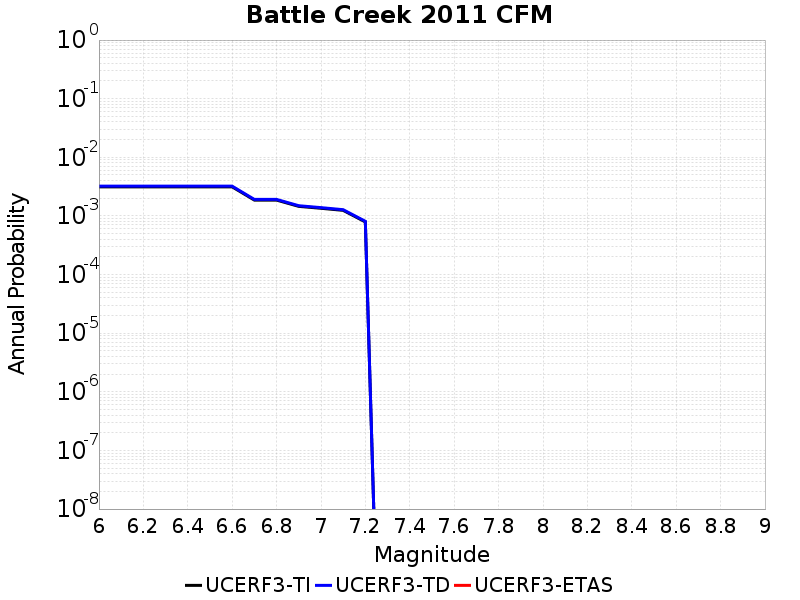
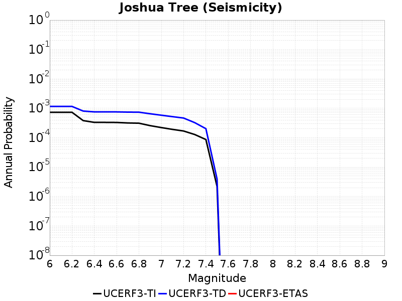
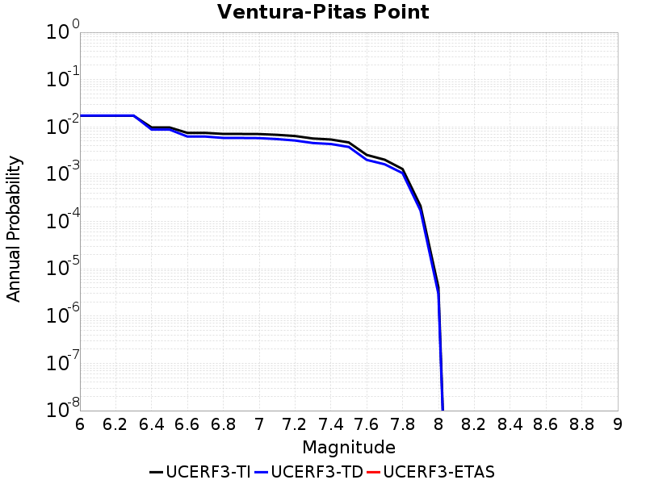

# Parent Section Magnitude-Probability Distributions

## Table Of Contents

* [Airport Lake](#airport-lake)
* [Almanor 2011 CFM](#almanor-2011-cfm)
* [Anacapa-Dume alt 1](#anacapa-dume-alt-1)
* [Anaheim](#anaheim)
* [Antelope Valley 2011](#antelope-valley-2011)
* [Ash Hill](#ash-hill)
* [Baker](#baker)
* [Bartlett Springs 2011 CFM](#bartlett-springs-2011-cfm)
* [Battle Creek 2011 CFM](#battle-creek-2011-cfm)
* [Bear River fault zone](#bear-river-fault-zone)
* [Bennett Valley 2011 CFM](#bennett-valley-2011-cfm)
* [Bicycle Lake](#bicycle-lake)
* [Big Lagoon - Bald Mtn 2011 CFM](#big-lagoon---bald-mtn-2011-cfm)
* [Big Pine (Central)](#big-pine-central)
* [Big Pine (East)](#big-pine-east)
* [Big Pine (West)](#big-pine-west)
* [Blackwater](#blackwater)
* [Blue Cut](#blue-cut)
* [Brawley (Seismic Zone) alt 1](#brawley-seismic-zone-alt-1)
* [Breckenridge 2011](#breckenridge-2011)
* [Bullion Mountains](#bullion-mountains)
* [Burnt Mtn](#burnt-mtn)
* [Butano 2011 CFM](#butano-2011-cfm)
* [Cady](#cady)
* [Calaveras (Central) 2011 CFM](#calaveras-central-2011-cfm)
* [Calaveras (No) 2011 CFM](#calaveras-no-2011-cfm)
* [Calaveras (So) - Paicines extension 2011 CFM](#calaveras-so---paicines-extension-2011-cfm)
* [Calaveras (So) 2011 CFM](#calaveras-so-2011-cfm)
* [Calico-Hidalgo](#calico-hidalgo)
* [Camp Rock 2011](#camp-rock-2011)
* [Canada David (Detachment)](#canada-david-detachment)
* [Carlsbad](#carlsbad)
* [Carson Range (Genoa)](#carson-range-genoa)
* [Casmalia 2011 CFM](#casmalia-2011-cfm)
* [Cedar Mtn-Mahogany Mtn](#cedar-mtn-mahogany-mtn)
* [Cerro Prieto](#cerro-prieto)
* [Channel Islands Thrust](#channel-islands-thrust)
* [Channel Islands Western Deep Ramp](#channel-islands-western-deep-ramp)
* [Chino alt 1](#chino-alt-1)
* [Clamshell-Sawpit](#clamshell-sawpit)
* [Clayton](#clayton)
* [Cleghorn](#cleghorn)
* [Cleghorn Lake](#cleghorn-lake)
* [Cleghorn Pass](#cleghorn-pass)
* [Collayami 2011 CFM](#collayami-2011-cfm)
* [Compton](#compton)
* [Concord 2011 CFM](#concord-2011-cfm)
* [Contra Costa (Lafayette) 2011 CFM](#contra-costa-lafayette-2011-cfm)
* [Contra Costa Shear Zone (connector) 2011 CFM](#contra-costa-shear-zone-connector-2011-cfm)
* [Coronado Bank alt1](#coronado-bank-alt1)
* [Coyote Canyon](#coyote-canyon)
* [Coyote Lake](#coyote-lake)
* [Cucamonga](#cucamonga)
* [Davis Creek](#davis-creek)
* [Death Valley (Black Mtns Frontal)](#death-valley-black-mtns-frontal)
* [Death Valley (Fish Lake Valley)](#death-valley-fish-lake-valley)
* [Death Valley (No)](#death-valley-no)
* [Death Valley (So)](#death-valley-so)
* [Deep Springs](#deep-springs)
* [Del Valle](#del-valle)
* [Dog Valley](#dog-valley)
* [Dry Mountain](#dry-mountain)
* [Earthquake Valley](#earthquake-valley)
* [Earthquake Valley (No  Extension)](#earthquake-valley-no--extension)
* [Earthquake Valley (So Extension)](#earthquake-valley-so-extension)
* [East Huasna 2011 CFM](#east-huasna-2011-cfm)
* [Eaton Roughs 2011 CFM](#eaton-roughs-2011-cfm)
* [Elmore Ranch](#elmore-ranch)
* [Elsinore (Coyote Mountains)](#elsinore-coyote-mountains)
* [Elsinore (Glen Ivy) rev](#elsinore-glen-ivy-rev)
* [Elsinore (Julian)](#elsinore-julian)
* [Elsinore (Stepovers Combined)](#elsinore-stepovers-combined)
* [Elsinore (Temecula) rev](#elsinore-temecula-rev)
* [Elysian Park (Lower CFM)](#elysian-park-lower-cfm)
* [Elysian Park (Upper)](#elysian-park-upper)
* [Emerson-Copper Mtn 2011](#emerson-copper-mtn-2011)
* [Eureka Peak](#eureka-peak)
* [Fickle Hill (alt1)](#fickle-hill-alt1)
* [Fish Slough 2011 CFM](#fish-slough-2011-cfm)
* [Fitzhugh Creek](#fitzhugh-creek)
* [Fontana (Seismicity)](#fontana-seismicity)
* [Franklin 2011 CFM](#franklin-2011-cfm)
* [Garberville - Briceland 2011 CFM](#garberville---briceland-2011-cfm)
* [Garlic Springs](#garlic-springs)
* [Garlock (Central)](#garlock-central)
* [Garlock (East)](#garlock-east)
* [Garlock (West)](#garlock-west)
* [Gillem - Big Crack 2011 CFM](#gillem---big-crack-2011-cfm)
* [Goldstone Lake](#goldstone-lake)
* [Goose Lake 2011 CFM](#goose-lake-2011-cfm)
* [Gravel Hills-Harper Lk](#gravel-hills-harper-lk)
* [Great Valley 01](#great-valley-01)
* [Great Valley 02](#great-valley-02)
* [Great Valley 03 Mysterious Ridge](#great-valley-03-mysterious-ridge)
* [Great Valley 03a Dunnigan Hills](#great-valley-03a-dunnigan-hills)
* [Great Valley 04a Trout Creek](#great-valley-04a-trout-creek)
* [Great Valley 04b Gordon Valley](#great-valley-04b-gordon-valley)
* [Great Valley 05 Pittsburg - Kirby Hills alt1](#great-valley-05-pittsburg---kirby-hills-alt1)
* [Great Valley 06 (Midland) 2011 CFM alt1](#great-valley-06-midland-2011-cfm-alt1)
* [Great Valley 07 (Orestimba)](#great-valley-07-orestimba)
* [Great Valley 08 (Quinto)](#great-valley-08-quinto)
* [Great Valley 09 (Laguna Seca)](#great-valley-09-laguna-seca)
* [Great Valley 10 (Panoche)](#great-valley-10-panoche)
* [Great Valley 11](#great-valley-11)
* [Great Valley 12](#great-valley-12)
* [Great Valley 13 (Coalinga)](#great-valley-13-coalinga)
* [Great Valley 14 (Kettleman Hills)](#great-valley-14-kettleman-hills)
* [Green Valley 2011 CFM](#green-valley-2011-cfm)
* [Greenville (No) 2011 CFM](#greenville-no-2011-cfm)
* [Greenville (So) 2011 CFM](#greenville-so-2011-cfm)
* [Hartley Springs 2011 CFM](#hartley-springs-2011-cfm)
* [Hat Creek-McArthur-Mayfield](#hat-creek-mcarthur-mayfield)
* [Hayward (No) 2011 CFM](#hayward-no-2011-cfm)
* [Hayward (So) 2011 CFM](#hayward-so-2011-cfm)
* [Hayward (So) extension 2011 CFM](#hayward-so-extension-2011-cfm)
* [Hector Mine](#hector-mine)
* [Helendale-So Lockhart](#helendale-so-lockhart)
* [Hilton Creek 2011 CFM](#hilton-creek-2011-cfm)
* [Hollywood](#hollywood)
* [Holser alt 1](#holser-alt-1)
* [Homestead Valley 2011](#homestead-valley-2011)
* [Honey Lake 2011 CFM](#honey-lake-2011-cfm)
* [Hosgri](#hosgri)
* [Hosgri (Extension)](#hosgri-extension)
* [Hunter Mountain-Saline Valley](#hunter-mountain-saline-valley)
* [Hunting Creek - Bartlett Springs connector 2011](#hunting-creek---bartlett-springs-connector-2011)
* [Hunting Creek - Berryessa 2011 CFM](#hunting-creek---berryessa-2011-cfm)
* [Imperial](#imperial)
* [Incline Village 2011 CFM](#incline-village-2011-cfm)
* [Independence rev 2011](#independence-rev-2011)
* [Jess Valley](#jess-valley)
* [Johnson Valley (No) 2011 rev](#johnson-valley-no-2011-rev)
* [Joshua Tree (Seismicity)](#joshua-tree-seismicity)
* [Keddie Ridge 2011 CFM](#keddie-ridge-2011-cfm)
* [Kern Canyon (Lake Isabella) 2011](#kern-canyon-lake-isabella-2011)
* [Kern Canyon (North Kern) 2011](#kern-canyon-north-kern-2011)
* [Kern Canyon (South Kern) 2011](#kern-canyon-south-kern-2011)
* [Kickapoo](#kickapoo)
* [King Range 2011 CFM](#king-range-2011-cfm)
* [La Panza 2011](#la-panza-2011)
* [Laguna Salada](#laguna-salada)
* [Lake Isabella (Seismicity)](#lake-isabella-seismicity)
* [Las Positas](#las-positas)
* [Last Chance](#last-chance)
* [Lenwood-Lockhart-Old Woman Springs](#lenwood-lockhart-old-woman-springs)
* [Likely 2011 CFM](#likely-2011-cfm)
* [Lions Head 2011 CFM](#lions-head-2011-cfm)
* [Little Lake](#little-lake)
* [Little Salmon (Offshore)](#little-salmon-offshore)
* [Little Salmon (Onshore)](#little-salmon-onshore)
* [Los Alamos 2011 CFM](#los-alamos-2011-cfm)
* [Los Alamos extension](#los-alamos-extension)
* [Los Medanos - Roe Island](#los-medanos---roe-island)
* [Los Osos 2011](#los-osos-2011)
* [Lost Hills](#lost-hills)
* [Ludlow](#ludlow)
* [Maacama 2011 CFM](#maacama-2011-cfm)
* [Mad River (alt1)](#mad-river-alt1)
* [Malibu Coast (Extension) alt 1](#malibu-coast-extension-alt-1)
* [Malibu Coast alt 1](#malibu-coast-alt-1)
* [Manix-Afton Hills](#manix-afton-hills)
* [McKinleyville (alt1)](#mckinleyville-alt1)
* [McLean Lake](#mclean-lake)
* [Mendocino](#mendocino)
* [Mission (connected) 2011 CFM](#mission-connected-2011-cfm)
* [Mission Creek](#mission-creek)
* [Mission Hills 2011](#mission-hills-2011)
* [Mission Ridge-Arroyo Parida-Santa Ana](#mission-ridge-arroyo-parida-santa-ana)
* [Mohawk Valley 2011 CFM](#mohawk-valley-2011-cfm)
* [Mono Lake 2011 CFM](#mono-lake-2011-cfm)
* [Monte Vista - Shannon 2011 CFM](#monte-vista---shannon-2011-cfm)
* [Monterey Bay-Tularcitos](#monterey-bay-tularcitos)
* [Morales (East)](#morales-east)
* [Morales (West)](#morales-west)
* [Mount Diablo Thrust North CFM](#mount-diablo-thrust-north-cfm)
* [Mount Diablo Thrust South](#mount-diablo-thrust-south)
* [Nelson Lake](#nelson-lake)
* [Newport-Inglewood (Offshore)](#newport-inglewood-offshore)
* [Newport-Inglewood alt 1](#newport-inglewood-alt-1)
* [North Frontal  (East)](#north-frontal--east)
* [North Frontal  (West)](#north-frontal--west)
* [North Salt Lake](#north-salt-lake)
* [North Tahoe 2011 CFM](#north-tahoe-2011-cfm)
* [Northridge](#northridge)
* [Northridge Hills](#northridge-hills)
* [Oak Ridge (Onshore)](#oak-ridge-onshore)
* [Oceanic - West Huasna](#oceanic---west-huasna)
* [Oceanside alt1](#oceanside-alt1)
* [Ortigalita (North)](#ortigalita-north)
* [Ortigalita (South)](#ortigalita-south)
* [Owens Valley](#owens-valley)
* [Owens Valley Keough Hot Springs](#owens-valley-keough-hot-springs)
* [Owl Lake](#owl-lake)
* [Ozena](#ozena)
* [Palos Verdes](#palos-verdes)
* [Panamint Valley](#panamint-valley)
* [Paradise](#paradise)
* [Peralta Hills](#peralta-hills)
* [Pilarcitos 2011 CFM](#pilarcitos-2011-cfm)
* [Pine Mtn](#pine-mtn)
* [Pinto Mtn](#pinto-mtn)
* [Pisgah-Bullion Mtn-Mesquite Lk](#pisgah-bullion-mtn-mesquite-lk)
* [Pitas Point (Lower West)](#pitas-point-lower-west)
* [Pitas Point (Lower)-Montalvo](#pitas-point-lower-montalvo)
* [Pittville 2011 CFM](#pittville-2011-cfm)
* [Pleito](#pleito)
* [Point Reyes 2011 CFM](#point-reyes-2011-cfm)
* [Point Reyes 2011 connector](#point-reyes-2011-connector)
* [Polaris 2011 CFM](#polaris-2011-cfm)
* [Puente Hills](#puente-hills)
* [Quien Sabe 2011 CFM](#quien-sabe-2011-cfm)
* [Raymond](#raymond)
* [Red Mountain](#red-mountain)
* [Red Pass](#red-pass)
* [Redondo Canyon alt 1](#redondo-canyon-alt-1)
* [Reliz 2011 CFM](#reliz-2011-cfm)
* [Richfield](#richfield)
* [Rinconada 2011 CFM](#rinconada-2011-cfm)
* [Robinson Creek](#robinson-creek)
* [Rocky Ledge 2011 CFM](#rocky-ledge-2011-cfm)
* [Rodgers Creek - Healdsburg 2011 CFM](#rodgers-creek---healdsburg-2011-cfm)
* [Rose Canyon](#rose-canyon)
* [Round Valley](#round-valley)
* [Russ 2011 CFM](#russ-2011-cfm)
* [San Andreas (Big Bend)](#san-andreas-big-bend)
* [San Andreas (Carrizo) rev](#san-andreas-carrizo-rev)
* [San Andreas (Cholame) rev](#san-andreas-cholame-rev)
* [San Andreas (Coachella) rev](#san-andreas-coachella-rev)
* [San Andreas (Creeping Section) 2011 CFM](#san-andreas-creeping-section-2011-cfm)
* [San Andreas (Mojave N)](#san-andreas-mojave-n)
* [San Andreas (Mojave S)](#san-andreas-mojave-s)
* [San Andreas (North Branch Mill Creek)](#san-andreas-north-branch-mill-creek)
* [San Andreas (North Coast) 2011 CFM](#san-andreas-north-coast-2011-cfm)
* [San Andreas (Offshore) 2011 CFM](#san-andreas-offshore-2011-cfm)
* [San Andreas (Parkfield)](#san-andreas-parkfield)
* [San Andreas (Peninsula) 2011 CFM](#san-andreas-peninsula-2011-cfm)
* [San Andreas (San Bernardino N)](#san-andreas-san-bernardino-n)
* [San Andreas (San Bernardino S)](#san-andreas-san-bernardino-s)
* [San Andreas (San Gorgonio Pass-Garnet HIll)](#san-andreas-san-gorgonio-pass-garnet-hill)
* [San Andreas (Santa Cruz Mts) 2011 CFM](#san-andreas-santa-cruz-mts-2011-cfm)
* [San Cayetano](#san-cayetano)
* [San Clemente](#san-clemente)
* [San Diego Trough north alt1](#san-diego-trough-north-alt1)
* [San Diego Trough south](#san-diego-trough-south)
* [San Gabriel](#san-gabriel)
* [San Gabriel (Extension)](#san-gabriel-extension)
* [San Gorgonio Pass](#san-gorgonio-pass)
* [San Gregorio (North) 2011 CFM](#san-gregorio-north-2011-cfm)
* [San Gregorio (South) 2011 CFM](#san-gregorio-south-2011-cfm)
* [San Jacinto (Anza) rev](#san-jacinto-anza-rev)
* [San Jacinto (Borrego)](#san-jacinto-borrego)
* [San Jacinto (Clark) rev](#san-jacinto-clark-rev)
* [San Jacinto (Coyote Creek)](#san-jacinto-coyote-creek)
* [San Jacinto (Lytle Creek connector)](#san-jacinto-lytle-creek-connector)
* [San Jacinto (San Bernardino)](#san-jacinto-san-bernardino)
* [San Jacinto (San Jacinto Valley) rev](#san-jacinto-san-jacinto-valley-rev)
* [San Jacinto (Stepovers Combined)](#san-jacinto-stepovers-combined)
* [San Jacinto (Superstition Mtn)](#san-jacinto-superstition-mtn)
* [San Joaquin Hills](#san-joaquin-hills)
* [San Jose](#san-jose)
* [San Juan](#san-juan)
* [San Luis Range - Oceano 2011 CFM](#san-luis-range---oceano-2011-cfm)
* [San Luis Range - Pecho 2011 CFM](#san-luis-range---pecho-2011-cfm)
* [San Luis Range 2011 CFM](#san-luis-range-2011-cfm)
* [San Pedro Basin](#san-pedro-basin)
* [San Pedro Escarpment](#san-pedro-escarpment)
* [San Vicente](#san-vicente)
* [Santa Cruz Catalina Ridge alt1](#santa-cruz-catalina-ridge-alt1)
* [Santa Cruz Island](#santa-cruz-island)
* [Santa Monica Bay](#santa-monica-bay)
* [Santa Monica alt 1](#santa-monica-alt-1)
* [Santa Rosa Island](#santa-rosa-island)
* [Santa Susana East (connector)](#santa-susana-east-connector)
* [Santa Susana alt 1](#santa-susana-alt-1)
* [Santa Ynez (East)](#santa-ynez-east)
* [Santa Ynez (West)](#santa-ynez-west)
* [Santa Ynez River](#santa-ynez-river)
* [Sargent 2011 CFM](#sargent-2011-cfm)
* [Scodie Lineament](#scodie-lineament)
* [Sheephole](#sheephole)
* [Shoreline](#shoreline)
* [Sierra Madre](#sierra-madre)
* [Sierra Madre (San Fernando)](#sierra-madre-san-fernando)
* [Sierra Nevada  (No Extension)](#sierra-nevada--no-extension)
* [Silver Creek 2011 CFM](#silver-creek-2011-cfm)
* [Simi-Santa Rosa](#simi-santa-rosa)
* [Sisar](#sisar)
* [Skinner Flat 2011 CFM](#skinner-flat-2011-cfm)
* [So Sierra Nevada](#so-sierra-nevada)
* [South Cuyama](#south-cuyama)
* [South Klamath Lake East](#south-klamath-lake-east)
* [South Klamath Lake West](#south-klamath-lake-west)
* [Superstition Hills](#superstition-hills)
* [Surprise Valley 2011 CFM](#surprise-valley-2011-cfm)
* [Swain Ravine - Spenceville](#swain-ravine---spenceville)
* [Table Bluff](#table-bluff)
* [Tank Canyon](#tank-canyon)
* [Thirty Mile Bank](#thirty-mile-bank)
* [Tin Mountain](#tin-mountain)
* [Towne Pass](#towne-pass)
* [Trinidad (alt1)](#trinidad-alt1)
* [Ventura-Pitas Point](#ventura-pitas-point)
* [Verdugo](#verdugo)
* [Walker Spring 2011 CFM](#walker-spring-2011-cfm)
* [West Napa 2011 CFM](#west-napa-2011-cfm)
* [West Tahoe](#west-tahoe)
* [White Mountains](#white-mountains)
* [White Wolf](#white-wolf)
* [White Wolf (Extension)](#white-wolf-extension)
* [Whittier alt 1](#whittier-alt-1)
* [Wight Way 2011 CFM](#wight-way-2011-cfm)
* [Yorba Linda](#yorba-linda)
* [Zayante-Vergeles 2011 CFM](#zayante-vergeles-2011-cfm)

## Airport Lake
*[(top)](#table-of-contents)*

|  |
|-----|

| Magnitude | UCERF3-TI Prob | UCERF3-TD Prob | UCERF3-ETAS Prob |
|-----|-----|-----|-----|
| 6.0 | 0.0064425888 | 0.006796466 | 0.0 |
| 6.1 | 0.0064425888 | 0.006796466 | 0.0 |
| 6.2 | 0.0064425888 | 0.006796466 | 0.0 |
| 6.3 | 0.0064425888 | 0.006796466 | 0.0 |
| 6.4 | 0.0064425888 | 0.006796466 | 0.0 |
| 6.5 | 0.003641826 | 0.0038353594 | 0.0 |
| 6.6 | 0.003641826 | 0.0038353594 | 0.0 |
| 6.7 | 0.0028538927 | 0.0030061677 | 0.0 |
| 6.8 | 0.0020823893 | 0.0021929555 | 0.0 |
| 6.9 | 0.001541707 | 0.0016237341 | 0.0 |
| 7.0 | 7.594696E-4 | 8.013377E-4 | 0.0 |
| 7.1 | 3.6493264E-4 | 3.8540488E-4 | 0.0 |

## Almanor 2011 CFM
*[(top)](#table-of-contents)*

|  |
|-----|

| Magnitude | UCERF3-TI Prob | UCERF3-TD Prob | UCERF3-ETAS Prob |
|-----|-----|-----|-----|
| 6.0 | 0.031571172 | 0.041881707 | 0.0 |
| 6.1 | 0.022894967 | 0.030251587 | 0.0 |
| 6.2 | 0.022894967 | 0.030251587 | 0.0 |
| 6.3 | 0.015287281 | 0.020129133 | 0.0 |
| 6.4 | 0.010646289 | 0.014013898 | 0.0 |
| 6.5 | 0.008702018 | 0.0114605 | 0.0 |
| 6.6 | 0.0076644225 | 0.010098751 | 0.0 |
| 6.7 | 5.1910203E-4 | 6.007318E-4 | 0.0 |
| 6.8 | 3.06049E-4 | 3.542557E-4 | 0.0 |

## Anacapa-Dume alt 1
*[(top)](#table-of-contents)*

|  |
|-----|

| Magnitude | UCERF3-TI Prob | UCERF3-TD Prob | UCERF3-ETAS Prob |
|-----|-----|-----|-----|
| 6.0 | 0.002702944 | 0.0027910136 | 0.0 |
| 6.1 | 0.002702944 | 0.0027910136 | 0.0 |
| 6.2 | 0.002702944 | 0.0027910136 | 0.0 |
| 6.3 | 0.002702944 | 0.0027910136 | 0.0 |
| 6.4 | 0.002702944 | 0.0027910136 | 0.0 |
| 6.5 | 0.002702944 | 0.0027910136 | 0.0 |
| 6.6 | 0.002702944 | 0.0027910136 | 0.0 |
| 6.7 | 0.0024854892 | 0.0025672303 | 0.0 |
| 6.8 | 0.002477193 | 0.002558682 | 0.0 |
| 6.9 | 0.001980861 | 0.0020476594 | 0.0 |
| 7.0 | 0.0019116632 | 0.0019763305 | 0.0 |
| 7.1 | 0.0016888938 | 0.0017469465 | 0.0 |
| 7.2 | 0.001612894 | 0.0016684992 | 0.0 |
| 7.3 | 0.0013350984 | 0.0013770805 | 0.0 |
| 7.4 | 0.0011175112 | 0.0011501584 | 0.0 |
| 7.5 | 8.990063E-4 | 9.2421856E-4 | 0.0 |
| 7.6 | 4.9774844E-4 | 5.112809E-4 | 0.0 |
| 7.7 | 1.4205484E-4 | 1.4151841E-4 | 0.0 |
| 7.8 | 2.348947E-5 | 2.196309E-5 | 0.0 |
| 7.9 | 4.1781706E-7 | 3.2070585E-7 | 0.0 |

## Anaheim
*[(top)](#table-of-contents)*

|  |
|-----|

| Magnitude | UCERF3-TI Prob | UCERF3-TD Prob | UCERF3-ETAS Prob |
|-----|-----|-----|-----|
| 6.0 | 0.0015253217 | 0.0013061801 | 0.0 |
| 6.1 | 8.7255245E-4 | 6.4020784E-4 | 0.0 |
| 6.2 | 8.7255245E-4 | 6.4020784E-4 | 0.0 |
| 6.3 | 5.96957E-4 | 3.5996252E-4 | 0.0 |
| 6.4 | 5.96957E-4 | 3.5996252E-4 | 0.0 |
| 6.5 | 5.938936E-4 | 3.5687015E-4 | 0.0 |
| 6.6 | 5.8243104E-4 | 3.4529014E-4 | 0.0 |
| 6.7 | 5.7892315E-4 | 3.417548E-4 | 0.0 |
| 6.8 | 5.77846E-4 | 3.406704E-4 | 0.0 |
| 6.9 | 5.750759E-4 | 3.3788464E-4 | 0.0 |
| 7.0 | 5.734383E-4 | 3.365383E-4 | 0.0 |
| 7.1 | 4.3480762E-4 | 2.2738497E-4 | 0.0 |
| 7.2 | 4.066187E-4 | 2.064934E-4 | 0.0 |
| 7.3 | 2.6174777E-4 | 1.3202336E-4 | 0.0 |
| 7.4 | 1.2526344E-4 | 6.4003034E-5 | 0.0 |
| 7.5 | 1.0573345E-5 | 8.389136E-6 | 0.0 |
| 7.6 | 7.759697E-7 | 7.864859E-7 | 0.0 |
| 7.7 | 7.8754645E-8 | 7.9942E-8 | 0.0 |

## Antelope Valley 2011
*[(top)](#table-of-contents)*

|  |
|-----|

| Magnitude | UCERF3-TI Prob | UCERF3-TD Prob | UCERF3-ETAS Prob |
|-----|-----|-----|-----|
| 6.0 | 0.016377583 | 0.018938474 | 0.0 |
| 6.1 | 0.016377583 | 0.018938474 | 0.0 |
| 6.2 | 0.016377583 | 0.018938474 | 0.0 |
| 6.3 | 0.016377583 | 0.018938474 | 0.0 |
| 6.4 | 0.016377583 | 0.018938474 | 0.0 |
| 6.5 | 0.009365888 | 0.010790538 | 0.0 |
| 6.6 | 0.009365888 | 0.010790538 | 0.0 |
| 6.7 | 0.007054463 | 0.008128005 | 0.0 |
| 6.8 | 0.005135455 | 0.0059263725 | 0.0 |
| 6.9 | 0.0037878908 | 0.004374691 | 0.0 |

## Ash Hill
*[(top)](#table-of-contents)*

|  |
|-----|

| Magnitude | UCERF3-TI Prob | UCERF3-TD Prob | UCERF3-ETAS Prob |
|-----|-----|-----|-----|
| 6.0 | 0.011179381 | 0.011990879 | 0.1 |
| 6.1 | 0.011179381 | 0.011990879 | 0.1 |
| 6.2 | 0.011179381 | 0.011990879 | 0.1 |
| 6.3 | 0.005217545 | 0.0055725765 | 0.1 |
| 6.4 | 0.005217545 | 0.0055725765 | 0.1 |
| 6.5 | 0.0036259557 | 0.0038698863 | 0.1 |
| 6.6 | 0.0026013597 | 0.002776431 | 0.1 |
| 6.7 | 0.0019095168 | 0.002038784 | 0.0 |
| 6.8 | 0.0013348613 | 0.0014264225 | 0.0 |
| 6.9 | 9.223483E-4 | 9.8604E-4 | 0.0 |

## Baker
*[(top)](#table-of-contents)*

|  |
|-----|

| Magnitude | UCERF3-TI Prob | UCERF3-TD Prob | UCERF3-ETAS Prob |
|-----|-----|-----|-----|
| 6.0 | 0.0029674405 | 0.0030364713 | 0.0 |
| 6.1 | 0.0029674405 | 0.0030364713 | 0.0 |
| 6.2 | 0.0029674405 | 0.0030364713 | 0.0 |
| 6.3 | 0.0017201907 | 0.0017616946 | 0.0 |
| 6.4 | 0.0017201907 | 0.0017616946 | 0.0 |
| 6.5 | 0.001450662 | 0.001487002 | 0.0 |
| 6.6 | 0.0012079047 | 0.0012397688 | 0.0 |
| 6.7 | 0.0010623431 | 0.0010916726 | 0.0 |
| 6.8 | 9.57371E-4 | 9.849286E-4 | 0.0 |
| 6.9 | 8.5069967E-4 | 8.7642955E-4 | 0.0 |
| 7.0 | 6.289736E-4 | 6.511977E-4 | 0.0 |
| 7.1 | 5.4896745E-4 | 5.700634E-4 | 0.0 |
| 7.2 | 5.251676E-4 | 5.4589217E-4 | 0.0 |
| 7.3 | 4.8825322E-4 | 5.083775E-4 | 0.0 |
| 7.4 | 4.596785E-4 | 4.7920257E-4 | 0.0 |
| 7.5 | 4.3259145E-4 | 4.51439E-4 | 0.0 |
| 7.6 | 3.9407116E-4 | 4.1185415E-4 | 0.0 |
| 7.7 | 3.405918E-4 | 3.5658097E-4 | 0.0 |
| 7.8 | 1.8045233E-4 | 1.8980012E-4 | 0.0 |
| 7.9 | 1.3353102E-6 | 1.389876E-6 | 0.0 |

## Bartlett Springs 2011 CFM
*[(top)](#table-of-contents)*

|  |
|-----|

| Magnitude | UCERF3-TI Prob | UCERF3-TD Prob | UCERF3-ETAS Prob |
|-----|-----|-----|-----|
| 6.0 | 0.031998757 | 0.040603098 | 0.0 |
| 6.1 | 0.031973712 | 0.040572226 | 0.0 |
| 6.2 | 0.03195787 | 0.04055276 | 0.0 |
| 6.3 | 0.031930014 | 0.04051812 | 0.0 |
| 6.4 | 0.026858058 | 0.033994492 | 0.0 |
| 6.5 | 0.026794989 | 0.03391626 | 0.0 |
| 6.6 | 0.025795965 | 0.032623913 | 0.0 |
| 6.7 | 0.025208864 | 0.031889293 | 0.0 |
| 6.8 | 0.023553653 | 0.029760579 | 0.0 |
| 6.9 | 0.021390721 | 0.027003033 | 0.0 |
| 7.0 | 0.018568378 | 0.0233914 | 0.0 |
| 7.1 | 0.017270854 | 0.021725245 | 0.0 |
| 7.2 | 0.014822568 | 0.018563235 | 0.0 |
| 7.3 | 0.01366893 | 0.017059905 | 0.0 |
| 7.4 | 0.012310251 | 0.015318881 | 0.0 |
| 7.5 | 0.011305175 | 0.014032434 | 0.0 |
| 7.6 | 0.0072241887 | 0.008909481 | 0.0 |
| 7.7 | 0.0022130446 | 0.0026603178 | 0.0 |
| 7.8 | 3.2059604E-4 | 3.6483927E-4 | 0.0 |

## Battle Creek 2011 CFM
*[(top)](#table-of-contents)*

|  |
|-----|

| Magnitude | UCERF3-TI Prob | UCERF3-TD Prob | UCERF3-ETAS Prob |
|-----|-----|-----|-----|
| 6.0 | 0.0031370334 | 0.0032202534 | 0.0 |
| 6.1 | 0.0031370334 | 0.0032202534 | 0.0 |
| 6.2 | 0.0031370334 | 0.0032202534 | 0.0 |
| 6.3 | 0.0031370334 | 0.0032202534 | 0.0 |
| 6.4 | 0.0031370334 | 0.0032202534 | 0.0 |
| 6.5 | 0.0031370334 | 0.0032202534 | 0.0 |
| 6.6 | 0.0031370334 | 0.0032202534 | 0.0 |
| 6.7 | 0.0018646746 | 0.0019135767 | 0.0 |
| 6.8 | 0.0018646746 | 0.0019135767 | 0.0 |
| 6.9 | 0.0014562025 | 0.0014942897 | 0.0 |
| 7.0 | 0.0013506714 | 0.0013860409 | 0.0 |
| 7.1 | 0.0012455335 | 0.0012782143 | 0.0 |
| 7.2 | 7.8970374E-4 | 8.104647E-4 | 0.0 |

## Bear River fault zone
*[(top)](#table-of-contents)*

|  |
|-----|

| Magnitude | UCERF3-TI Prob | UCERF3-TD Prob | UCERF3-ETAS Prob |
|-----|-----|-----|-----|
| 6.0 | 0.012328116 | 0.013892228 | 0.0 |
| 6.1 | 0.012328116 | 0.013892228 | 0.0 |
| 6.2 | 0.008300122 | 0.009319289 | 0.0 |
| 6.3 | 0.008300122 | 0.009319289 | 0.0 |
| 6.4 | 0.0067744725 | 0.007611304 | 0.0 |
| 6.5 | 0.0064955144 | 0.0073036887 | 0.0 |
| 6.6 | 0.006067064 | 0.0068319137 | 0.0 |
| 6.7 | 0.0055507803 | 0.0062646437 | 0.0 |
| 6.8 | 0.004765337 | 0.005403463 | 0.0 |
| 6.9 | 0.004001915 | 0.0045699235 | 0.0 |
| 7.0 | 0.0029861939 | 0.0034616636 | 0.0 |
| 7.1 | 0.002900493 | 0.0033629062 | 0.0 |
| 7.2 | 0.0020908823 | 0.0024158014 | 0.0 |
| 7.3 | 0.0010938413 | 0.0012617159 | 0.0 |

## Bennett Valley 2011 CFM
*[(top)](#table-of-contents)*

|  |
|-----|

| Magnitude | UCERF3-TI Prob | UCERF3-TD Prob | UCERF3-ETAS Prob |
|-----|-----|-----|-----|
| 6.0 | 0.012390262 | 0.014489741 | 0.0 |
| 6.1 | 0.012390262 | 0.014489741 | 0.0 |
| 6.2 | 0.008653872 | 0.010199159 | 0.0 |
| 6.3 | 0.008653872 | 0.010199159 | 0.0 |
| 6.4 | 0.0067301663 | 0.007999315 | 0.0 |
| 6.5 | 0.006543907 | 0.0077774143 | 0.0 |
| 6.6 | 0.005643701 | 0.0067021972 | 0.0 |
| 6.7 | 8.76385E-4 | 0.0011956188 | 0.0 |
| 6.8 | 7.620303E-4 | 0.0010504976 | 0.0 |
| 6.9 | 7.037667E-4 | 9.747358E-4 | 0.0 |
| 7.0 | 6.440897E-4 | 8.946053E-4 | 0.0 |
| 7.1 | 5.875135E-4 | 8.163621E-4 | 0.0 |
| 7.2 | 4.878418E-4 | 6.761801E-4 | 0.0 |
| 7.3 | 4.436259E-4 | 6.1513804E-4 | 0.0 |
| 7.4 | 3.5409955E-4 | 4.78401E-4 | 0.0 |
| 7.5 | 3.0399146E-4 | 4.0847395E-4 | 0.0 |
| 7.6 | 1.447063E-4 | 1.846775E-4 | 0.0 |
| 7.7 | 5.4947162E-5 | 6.760397E-5 | 0.0 |
| 7.8 | 6.6340967E-6 | 9.098755E-6 | 0.0 |
| 7.9 | 2.1267379E-6 | 3.3500949E-6 | 0.0 |
| 8.0 | 9.979741E-7 | 1.7773575E-6 | 0.0 |

## Bicycle Lake
*[(top)](#table-of-contents)*

|  |
|-----|

| Magnitude | UCERF3-TI Prob | UCERF3-TD Prob | UCERF3-ETAS Prob |
|-----|-----|-----|-----|
| 6.0 | 0.01018633 | 0.011403934 | 0.0 |
| 6.1 | 0.01018633 | 0.011403934 | 0.0 |
| 6.2 | 0.0052028033 | 0.005823454 | 0.0 |
| 6.3 | 0.0049911533 | 0.005587679 | 0.0 |
| 6.4 | 0.0049911533 | 0.005587679 | 0.0 |
| 6.5 | 0.0028957394 | 0.0032551533 | 0.0 |
| 6.6 | 0.002540112 | 0.0028560255 | 0.0 |
| 6.7 | 0.0020803404 | 0.0023403442 | 0.0 |

## Big Lagoon - Bald Mtn 2011 CFM
*[(top)](#table-of-contents)*

|  |
|-----|

| Magnitude | UCERF3-TI Prob | UCERF3-TD Prob | UCERF3-ETAS Prob |
|-----|-----|-----|-----|
| 6.0 | 0.009709897 | 0.010275429 | 0.0 |
| 6.1 | 0.009709897 | 0.010275429 | 0.0 |
| 6.2 | 0.009709897 | 0.010275429 | 0.0 |
| 6.3 | 0.009709897 | 0.010275429 | 0.0 |
| 6.4 | 0.009709897 | 0.010275429 | 0.0 |
| 6.5 | 0.009709897 | 0.010275429 | 0.0 |
| 6.6 | 0.009709897 | 0.010275429 | 0.0 |
| 6.7 | 0.009709897 | 0.010275429 | 0.0 |
| 6.8 | 0.006164385 | 0.006483108 | 0.0 |
| 6.9 | 0.006164385 | 0.006483108 | 0.0 |
| 7.0 | 0.005058831 | 0.0053121326 | 0.0 |
| 7.1 | 0.0044375416 | 0.0046567274 | 0.0 |
| 7.2 | 0.0038428132 | 0.0040307078 | 0.0 |
| 7.3 | 0.0033671674 | 0.0035286911 | 0.0 |
| 7.4 | 0.0031237002 | 0.0032727087 | 0.0 |
| 7.5 | 0.0025687215 | 0.002690364 | 0.0 |
| 7.6 | 0.0020319829 | 0.0021259005 | 0.0 |
| 7.7 | 0.00147086 | 0.0015380036 | 0.0 |
| 7.8 | 0.0010072939 | 0.0010539229 | 0.0 |
| 7.9 | 2.5870028E-4 | 2.715404E-4 | 0.0 |

## Big Pine (Central)
*[(top)](#table-of-contents)*

|  |
|-----|

| Magnitude | UCERF3-TI Prob | UCERF3-TD Prob | UCERF3-ETAS Prob |
|-----|-----|-----|-----|
| 6.0 | 0.006608314 | 0.007316419 | 0.0 |
| 6.1 | 0.0043435963 | 0.00486767 | 0.0 |
| 6.2 | 0.003606286 | 0.0040692124 | 0.0 |
| 6.3 | 0.0014226272 | 0.0017138047 | 0.0 |
| 6.4 | 0.0014149669 | 0.0017056521 | 0.0 |
| 6.5 | 0.0014063664 | 0.0016964887 | 0.0 |
| 6.6 | 0.0013917267 | 0.0016809264 | 0.0 |
| 6.7 | 0.0013769877 | 0.0016653605 | 0.0 |
| 6.8 | 0.0011361669 | 0.0014174777 | 0.0 |
| 6.9 | 7.5169955E-4 | 0.0010110746 | 0.0 |
| 7.0 | 5.2547833E-4 | 7.5043883E-4 | 0.0 |
| 7.1 | 4.6673836E-4 | 6.866729E-4 | 0.0 |
| 7.2 | 2.7208295E-4 | 4.7223835E-4 | 0.0 |
| 7.3 | 2.2968883E-4 | 4.2740066E-4 | 0.0 |
| 7.4 | 1.8850817E-4 | 3.8419178E-4 | 0.0 |
| 7.5 | 1.778184E-4 | 3.7227967E-4 | 0.0 |
| 7.6 | 1.6397667E-4 | 3.5447165E-4 | 0.0 |
| 7.7 | 9.377503E-5 | 2.2817629E-4 | 0.0 |
| 7.8 | 2.5687666E-5 | 5.383591E-5 | 0.0 |
| 7.9 | 1.920481E-6 | 1.8303797E-6 | 0.0 |

## Big Pine (East)
*[(top)](#table-of-contents)*

|  |
|-----|

| Magnitude | UCERF3-TI Prob | UCERF3-TD Prob | UCERF3-ETAS Prob |
|-----|-----|-----|-----|
| 6.0 | 0.0051611643 | 0.0064118537 | 0.0 |
| 6.1 | 0.0051611643 | 0.0064118537 | 0.0 |
| 6.2 | 0.0051611643 | 0.0064118537 | 0.0 |
| 6.3 | 0.0028551589 | 0.0039756554 | 0.0 |
| 6.4 | 0.0028475097 | 0.0039675212 | 0.0 |
| 6.5 | 0.0025153751 | 0.003617679 | 0.0 |
| 6.6 | 0.0022488134 | 0.0033376196 | 0.0 |
| 6.7 | 0.0019270873 | 0.0028910541 | 0.0 |
| 6.8 | 0.0018074579 | 0.0027446814 | 0.0 |
| 6.9 | 0.0014436257 | 0.0023089054 | 0.0 |
| 7.0 | 0.0011197845 | 0.0018905561 | 0.0 |
| 7.1 | 8.87599E-4 | 0.0015758716 | 0.0 |
| 7.2 | 6.551642E-4 | 0.0012990194 | 0.0 |
| 7.3 | 5.802127E-4 | 0.0012120923 | 0.0 |
| 7.4 | 5.288041E-4 | 0.0011524035 | 0.0 |
| 7.5 | 5.007165E-4 | 0.0011168098 | 0.0 |
| 7.6 | 4.1366243E-4 | 9.447977E-4 | 0.0 |
| 7.7 | 2.1681961E-4 | 5.2163523E-4 | 0.0 |
| 7.8 | 5.9829777E-5 | 1.16473646E-4 | 0.0 |
| 7.9 | 1.5252632E-5 | 1.8583834E-5 | 0.0 |

## Big Pine (West)
*[(top)](#table-of-contents)*

|  |
|-----|

| Magnitude | UCERF3-TI Prob | UCERF3-TD Prob | UCERF3-ETAS Prob |
|-----|-----|-----|-----|
| 6.0 | 3.5635266E-4 | 3.588903E-4 | 0.0 |
| 6.1 | 3.5635266E-4 | 3.588903E-4 | 0.0 |
| 6.2 | 3.5635266E-4 | 3.588903E-4 | 0.0 |
| 6.3 | 2.2056856E-4 | 2.2249376E-4 | 0.0 |
| 6.4 | 2.2056856E-4 | 2.2249376E-4 | 0.0 |
| 6.5 | 1.6454936E-4 | 1.6626067E-4 | 0.0 |
| 6.6 | 1.6454936E-4 | 1.6626067E-4 | 0.0 |
| 6.7 | 1.6454936E-4 | 1.6626067E-4 | 0.0 |
| 6.8 | 1.6454936E-4 | 1.6626067E-4 | 0.0 |
| 6.9 | 1.5862122E-4 | 1.602909E-4 | 0.0 |
| 7.0 | 1.2351504E-4 | 1.2485615E-4 | 0.0 |
| 7.1 | 8.5159016E-5 | 8.611386E-5 | 0.0 |
| 7.2 | 6.0127335E-5 | 6.0787082E-5 | 0.0 |
| 7.3 | 4.0582654E-5 | 4.1001127E-5 | 0.0 |
| 7.4 | 2.405375E-5 | 2.426274E-5 | 0.0 |
| 7.5 | 1.2230132E-5 | 1.23137725E-5 | 0.0 |
| 7.6 | 8.713663E-6 | 8.771669E-6 | 0.0 |
| 7.7 | 3.8644166E-6 | 3.8881594E-6 | 0.0 |
| 7.8 | 6.360267E-7 | 6.4004877E-7 | 0.0 |

## Blackwater
*[(top)](#table-of-contents)*

|  |
|-----|

| Magnitude | UCERF3-TI Prob | UCERF3-TD Prob | UCERF3-ETAS Prob |
|-----|-----|-----|-----|
| 6.0 | 0.015895851 | 0.017067092 | 0.0 |
| 6.1 | 0.015895851 | 0.017067092 | 0.0 |
| 6.2 | 0.006090366 | 0.006501464 | 0.0 |
| 6.3 | 0.006090366 | 0.006501464 | 0.0 |
| 6.4 | 0.0041288356 | 0.00439962 | 0.0 |
| 6.5 | 0.0030650778 | 0.0032632593 | 0.0 |
| 6.6 | 0.0030650778 | 0.0032632593 | 0.0 |
| 6.7 | 0.0016013865 | 0.0017048342 | 0.0 |
| 6.8 | 0.001184915 | 0.0012620717 | 0.0 |
| 6.9 | 5.191674E-4 | 5.5375876E-4 | 0.0 |
| 7.0 | 2.4722028E-4 | 2.6386016E-4 | 0.0 |

## Blue Cut
*[(top)](#table-of-contents)*

|  |
|-----|

| Magnitude | UCERF3-TI Prob | UCERF3-TD Prob | UCERF3-ETAS Prob |
|-----|-----|-----|-----|
| 6.0 | 0.011015458 | 0.011748409 | 0.0 |
| 6.1 | 0.011015458 | 0.011748409 | 0.0 |
| 6.2 | 0.011015458 | 0.011748409 | 0.0 |
| 6.3 | 0.0060417196 | 0.0064054118 | 0.0 |
| 6.4 | 0.0060417196 | 0.0064054118 | 0.0 |
| 6.5 | 0.0046494175 | 0.0049204375 | 0.0 |
| 6.6 | 0.0038253788 | 0.0040447796 | 0.0 |
| 6.7 | 0.0032701963 | 0.0034565774 | 0.0 |
| 6.8 | 0.002877895 | 0.0030417684 | 0.0 |
| 6.9 | 0.0024899957 | 0.0026321255 | 0.0 |
| 7.0 | 0.0020241356 | 0.0021406757 | 0.0 |
| 7.1 | 0.001478599 | 0.001564926 | 0.0 |

## Brawley (Seismic Zone) alt 1
*[(top)](#table-of-contents)*

|  |
|-----|

| Magnitude | UCERF3-TI Prob | UCERF3-TD Prob | UCERF3-ETAS Prob |
|-----|-----|-----|-----|
| 6.0 | 0.11088423 | 0.19859913 | 0.2 |
| 6.1 | 0.11088423 | 0.19859913 | 0.2 |
| 6.2 | 0.10837428 | 0.19527085 | 0.2 |
| 6.3 | 0.107082725 | 0.19317977 | 0.2 |
| 6.4 | 0.093263686 | 0.17001869 | 0.2 |
| 6.5 | 0.086755216 | 0.16016945 | 0.2 |
| 6.6 | 0.07970774 | 0.15010506 | 0.2 |
| 6.7 | 0.07174956 | 0.1388788 | 0.2 |
| 6.8 | 0.06264243 | 0.12720664 | 0.2 |
| 6.9 | 0.05173543 | 0.11634082 | 0.1 |
| 7.0 | 0.039192066 | 0.10074686 | 0.1 |
| 7.1 | 0.038443442 | 0.09939186 | 0.1 |
| 7.2 | 0.034803 | 0.091239065 | 0.1 |
| 7.3 | 0.03284188 | 0.08535159 | 0.1 |
| 7.4 | 0.023241805 | 0.057463463 | 0.0 |
| 7.5 | 0.01775316 | 0.042910825 | 0.0 |
| 7.6 | 0.013464959 | 0.032252777 | 0.0 |
| 7.7 | 0.008982267 | 0.02225924 | 0.0 |
| 7.8 | 0.0067227143 | 0.01779135 | 0.0 |
| 7.9 | 0.005308505 | 0.012840002 | 0.0 |
| 8.0 | 0.0045035016 | 0.010360249 | 0.0 |
| 8.1 | 0.0020520731 | 0.0031774084 | 0.0 |
| 8.2 | 8.9191867E-4 | 9.4040873E-4 | 0.0 |
| 8.3 | 1.5834332E-5 | 6.1871083E-6 | 0.0 |

## Breckenridge 2011
*[(top)](#table-of-contents)*

|  |
|-----|

| Magnitude | UCERF3-TI Prob | UCERF3-TD Prob | UCERF3-ETAS Prob |
|-----|-----|-----|-----|
| 6.0 | 5.9937296E-4 | 3.5078614E-4 | 0.0 |
| 6.1 | 5.9937296E-4 | 3.5078614E-4 | 0.0 |
| 6.2 | 5.9937296E-4 | 3.5078614E-4 | 0.0 |
| 6.3 | 5.55348E-4 | 3.0638452E-4 | 0.0 |
| 6.4 | 5.55348E-4 | 3.0638452E-4 | 0.0 |
| 6.5 | 5.55348E-4 | 3.0638452E-4 | 0.0 |
| 6.6 | 5.55348E-4 | 3.0638452E-4 | 0.0 |
| 6.7 | 4.9150345E-4 | 2.5784734E-4 | 0.0 |
| 6.8 | 4.4636242E-4 | 2.2440047E-4 | 0.0 |
| 6.9 | 4.035606E-4 | 1.9994473E-4 | 0.0 |
| 7.0 | 3.55651E-4 | 1.7419369E-4 | 0.0 |
| 7.1 | 2.9182562E-4 | 1.5049115E-4 | 0.0 |
| 7.2 | 2.004543E-4 | 1.0655889E-4 | 0.0 |
| 7.3 | 1.3776887E-4 | 8.5784755E-5 | 0.0 |
| 7.4 | 9.350559E-5 | 6.628045E-5 | 0.0 |
| 7.5 | 7.0692695E-5 | 4.8880986E-5 | 0.0 |
| 7.6 | 1.3421517E-5 | 9.0374915E-6 | 0.0 |

## Bullion Mountains
*[(top)](#table-of-contents)*

|  |
|-----|

| Magnitude | UCERF3-TI Prob | UCERF3-TD Prob | UCERF3-ETAS Prob |
|-----|-----|-----|-----|
| 6.0 | 0.008531413 | 0.0075958115 | 0.0 |
| 6.1 | 0.008531413 | 0.0075958115 | 0.0 |
| 6.2 | 0.008531413 | 0.0075958115 | 0.0 |
| 6.3 | 0.0062661595 | 0.0051035685 | 0.0 |
| 6.4 | 0.0062661595 | 0.0051035685 | 0.0 |
| 6.5 | 0.005331118 | 0.0040787375 | 0.0 |
| 6.6 | 0.00499945 | 0.0037157135 | 0.0 |
| 6.7 | 0.004479495 | 0.0031708642 | 0.0 |
| 6.8 | 0.0027033675 | 0.0013251187 | 0.0 |
| 6.9 | 0.0023610266 | 0.0012136112 | 0.0 |
| 7.0 | 0.0017889962 | 8.736749E-4 | 0.0 |

## Burnt Mtn
*[(top)](#table-of-contents)*

|  |
|-----|

| Magnitude | UCERF3-TI Prob | UCERF3-TD Prob | UCERF3-ETAS Prob |
|-----|-----|-----|-----|
| 6.0 | 0.008144741 | 0.006032562 | 0.0 |
| 6.1 | 0.008144741 | 0.006032562 | 0.0 |
| 6.2 | 0.008144741 | 0.006032562 | 0.0 |
| 6.3 | 0.008144741 | 0.006032562 | 0.0 |
| 6.4 | 0.008144741 | 0.006032562 | 0.0 |
| 6.5 | 0.0070811296 | 0.005172228 | 0.0 |

## Butano 2011 CFM
*[(top)](#table-of-contents)*

|  |
|-----|

| Magnitude | UCERF3-TI Prob | UCERF3-TD Prob | UCERF3-ETAS Prob |
|-----|-----|-----|-----|
| 6.0 | 0.004976464 | 0.0030872806 | 0.0 |
| 6.1 | 0.004976464 | 0.0030872806 | 0.0 |
| 6.2 | 0.0043551093 | 0.0024398055 | 0.0 |
| 6.3 | 0.0043551093 | 0.0024398055 | 0.0 |
| 6.4 | 0.0040451903 | 0.0021166636 | 0.0 |
| 6.5 | 0.0039959005 | 0.0020645247 | 0.0 |
| 6.6 | 0.003918452 | 0.001984047 | 0.0 |
| 6.7 | 0.003381786 | 0.0014337634 | 0.0 |
| 6.8 | 0.0032761577 | 0.0013231015 | 0.0 |
| 6.9 | 0.0031760489 | 0.0012227964 | 0.0 |
| 7.0 | 0.0029001853 | 9.734377E-4 | 0.0 |
| 7.1 | 0.0020217493 | 7.113295E-4 | 0.0 |
| 7.2 | 0.0019307317 | 6.513885E-4 | 0.0 |
| 7.3 | 0.0018390282 | 6.0541317E-4 | 0.0 |
| 7.4 | 0.0017574639 | 5.75118E-4 | 0.0 |
| 7.5 | 0.001589997 | 5.235836E-4 | 0.0 |
| 7.6 | 0.0011566412 | 3.6832385E-4 | 0.0 |
| 7.7 | 9.137166E-4 | 2.7865628E-4 | 0.0 |
| 7.8 | 5.9877743E-4 | 2.4720558E-4 | 0.0 |
| 7.9 | 3.1904536E-4 | 2.2607729E-4 | 0.0 |
| 8.0 | 2.4270554E-4 | 2.1136618E-4 | 0.0 |
| 8.1 | 1.4830762E-4 | 1.2582897E-4 | 0.0 |
| 8.2 | 2.9145367E-5 | 1.5985104E-5 | 0.0 |
| 8.3 | 5.4115542E-8 | 2.1287073E-8 | 0.0 |

## Cady
*[(top)](#table-of-contents)*

|  |
|-----|

| Magnitude | UCERF3-TI Prob | UCERF3-TD Prob | UCERF3-ETAS Prob |
|-----|-----|-----|-----|
| 6.0 | 0.010326075 | 0.011292931 | 0.1 |
| 6.1 | 0.010326075 | 0.011292931 | 0.1 |
| 6.2 | 0.010326075 | 0.011292931 | 0.1 |
| 6.3 | 0.0057841022 | 0.0063057146 | 0.1 |
| 6.4 | 0.0057841022 | 0.0063057146 | 0.1 |
| 6.5 | 0.0031794512 | 0.0034599325 | 0.1 |
| 6.6 | 0.0030307577 | 0.0033011958 | 0.1 |
| 6.7 | 0.0025454918 | 0.0027706013 | 0.0 |
| 6.8 | 9.2776294E-4 | 0.0010071364 | 0.0 |
| 6.9 | 3.9363815E-4 | 4.306444E-4 | 0.0 |
| 7.0 | 3.577705E-4 | 3.914511E-4 | 0.0 |

## Calaveras (Central) 2011 CFM
*[(top)](#table-of-contents)*

|  |
|-----|

| Magnitude | UCERF3-TI Prob | UCERF3-TD Prob | UCERF3-ETAS Prob |
|-----|-----|-----|-----|
| 6.0 | 0.07534136 | 0.11490213 | 0.2 |
| 6.1 | 0.07297657 | 0.11121364 | 0.2 |
| 6.2 | 0.07190444 | 0.11092985 | 0.2 |
| 6.3 | 0.0681982 | 0.10803495 | 0.2 |
| 6.4 | 0.06555412 | 0.10552738 | 0.2 |
| 6.5 | 0.053311124 | 0.0845233 | 0.1 |
| 6.6 | 0.05162293 | 0.08216917 | 0.1 |
| 6.7 | 0.049159497 | 0.07876731 | 0.1 |
| 6.8 | 0.046324775 | 0.073858544 | 0.1 |
| 6.9 | 0.037642512 | 0.05855418 | 0.1 |
| 7.0 | 0.02953797 | 0.044980794 | 0.1 |
| 7.1 | 0.0255274 | 0.0386555 | 0.1 |
| 7.2 | 0.01905776 | 0.028582165 | 0.0 |
| 7.3 | 0.013396223 | 0.020391474 | 0.0 |
| 7.4 | 0.009217911 | 0.014278886 | 0.0 |
| 7.5 | 0.0077359667 | 0.0124586625 | 0.0 |
| 7.6 | 0.004252361 | 0.0069711306 | 0.0 |
| 7.7 | 0.0017651088 | 0.0027467355 | 0.0 |
| 7.8 | 0.0014454306 | 0.0023598312 | 0.0 |
| 7.9 | 0.0010292825 | 0.0018260742 | 0.0 |
| 8.0 | 6.1381224E-4 | 0.0011374792 | 0.0 |
| 8.1 | 3.9185135E-4 | 6.880715E-4 | 0.0 |

## Calaveras (No) 2011 CFM
*[(top)](#table-of-contents)*

|  |
|-----|

| Magnitude | UCERF3-TI Prob | UCERF3-TD Prob | UCERF3-ETAS Prob |
|-----|-----|-----|-----|
| 6.0 | 0.02508881 | 0.03336645 | 0.0 |
| 6.1 | 0.02508881 | 0.03336645 | 0.0 |
| 6.2 | 0.024502134 | 0.032542918 | 0.0 |
| 6.3 | 0.024082264 | 0.03196749 | 0.0 |
| 6.4 | 0.02385771 | 0.031652138 | 0.0 |
| 6.5 | 0.023574775 | 0.03125718 | 0.0 |
| 6.6 | 0.023457756 | 0.031086743 | 0.0 |
| 6.7 | 0.019126613 | 0.02488521 | 0.0 |
| 6.8 | 0.018365284 | 0.023883915 | 0.0 |
| 6.9 | 0.017044188 | 0.022066731 | 0.0 |
| 7.0 | 0.01434065 | 0.018277017 | 0.0 |
| 7.1 | 0.0128157 | 0.016433217 | 0.0 |
| 7.2 | 0.01025145 | 0.013184459 | 0.0 |
| 7.3 | 0.0060364045 | 0.007756531 | 0.0 |
| 7.4 | 0.0025458818 | 0.0029028875 | 0.0 |
| 7.5 | 0.0015938957 | 0.0019466311 | 0.0 |
| 7.6 | 9.205016E-4 | 0.0012522502 | 0.0 |
| 7.7 | 6.8715087E-4 | 9.027275E-4 | 0.0 |
| 7.8 | 4.926005E-4 | 6.796595E-4 | 0.0 |
| 7.9 | 3.3327343E-4 | 4.913928E-4 | 0.0 |
| 8.0 | 1.6111376E-4 | 2.5521827E-4 | 0.0 |
| 8.1 | 8.726824E-5 | 1.2224427E-4 | 0.0 |

## Calaveras (So) - Paicines extension 2011 CFM
*[(top)](#table-of-contents)*

|  |
|-----|

| Magnitude | UCERF3-TI Prob | UCERF3-TD Prob | UCERF3-ETAS Prob |
|-----|-----|-----|-----|
| 6.0 | 0.076174594 | 0.13431787 | 0.1 |
| 6.1 | 0.075409345 | 0.13300249 | 0.1 |
| 6.2 | 0.064337276 | 0.113110736 | 0.1 |
| 6.3 | 0.058367174 | 0.102196805 | 0.1 |
| 6.4 | 0.0544031 | 0.09501251 | 0.1 |
| 6.5 | 0.04933773 | 0.08595239 | 0.1 |
| 6.6 | 0.04116161 | 0.07067833 | 0.1 |
| 6.7 | 0.039962657 | 0.06855438 | 0.1 |
| 6.8 | 0.03569247 | 0.059875514 | 0.1 |
| 6.9 | 0.029811295 | 0.04790021 | 0.1 |
| 7.0 | 0.025684336 | 0.040496003 | 0.1 |
| 7.1 | 0.022105146 | 0.0337361 | 0.1 |
| 7.2 | 0.017841442 | 0.026409812 | 0.0 |
| 7.3 | 0.013325208 | 0.019188298 | 0.0 |
| 7.4 | 0.009349857 | 0.013309043 | 0.0 |
| 7.5 | 0.008104719 | 0.011995945 | 0.0 |
| 7.6 | 0.0057804612 | 0.008821097 | 0.0 |
| 7.7 | 0.0032371588 | 0.0045730253 | 0.0 |
| 7.8 | 0.0027645302 | 0.004141368 | 0.0 |
| 7.9 | 0.0017534926 | 0.0032611843 | 0.0 |
| 8.0 | 0.0010571606 | 0.0019611218 | 0.0 |
| 8.1 | 6.366953E-4 | 0.0010548587 | 0.0 |

## Calaveras (So) 2011 CFM
*[(top)](#table-of-contents)*

|  |
|-----|

| Magnitude | UCERF3-TI Prob | UCERF3-TD Prob | UCERF3-ETAS Prob |
|-----|-----|-----|-----|
| 6.0 | 0.079865426 | 0.13982801 | 0.1 |
| 6.1 | 0.06843361 | 0.11964578 | 0.1 |
| 6.2 | 0.058084648 | 0.10077828 | 0.1 |
| 6.3 | 0.044339992 | 0.07529071 | 0.1 |
| 6.4 | 0.04343345 | 0.07395155 | 0.1 |
| 6.5 | 0.042916555 | 0.0731462 | 0.1 |
| 6.6 | 0.04185927 | 0.07147921 | 0.1 |
| 6.7 | 0.040946912 | 0.069949426 | 0.1 |
| 6.8 | 0.036469642 | 0.06104272 | 0.1 |
| 6.9 | 0.02947844 | 0.047294028 | 0.1 |
| 7.0 | 0.025115121 | 0.039604977 | 0.1 |
| 7.1 | 0.022186412 | 0.03475549 | 0.1 |
| 7.2 | 0.016668037 | 0.025768256 | 0.0 |
| 7.3 | 0.012319452 | 0.018861158 | 0.0 |
| 7.4 | 0.008312687 | 0.01293929 | 0.0 |
| 7.5 | 0.007182234 | 0.011670894 | 0.0 |
| 7.6 | 0.004590199 | 0.0076111043 | 0.0 |
| 7.7 | 0.0021033096 | 0.0033836507 | 0.0 |
| 7.8 | 0.0017793609 | 0.0029852185 | 0.0 |
| 7.9 | 0.0012901047 | 0.0023348713 | 0.0 |
| 8.0 | 7.944594E-4 | 0.0014633153 | 0.0 |
| 8.1 | 5.271009E-4 | 9.1146183E-4 | 0.0 |

## Calico-Hidalgo
*[(top)](#table-of-contents)*

|  |
|-----|

| Magnitude | UCERF3-TI Prob | UCERF3-TD Prob | UCERF3-ETAS Prob |
|-----|-----|-----|-----|
| 6.0 | 0.02111873 | 0.025905324 | 0.1 |
| 6.1 | 0.02111873 | 0.025905324 | 0.1 |
| 6.2 | 0.02111873 | 0.025905324 | 0.1 |
| 6.3 | 0.01257003 | 0.015451803 | 0.1 |
| 6.4 | 0.01257003 | 0.015451803 | 0.1 |
| 6.5 | 0.010529719 | 0.013017288 | 0.1 |
| 6.6 | 0.010520565 | 0.013007515 | 0.1 |
| 6.7 | 0.009347493 | 0.011596996 | 0.1 |
| 6.8 | 0.009068459 | 0.011239818 | 0.1 |
| 6.9 | 0.008018291 | 0.009798828 | 0.1 |
| 7.0 | 0.0076319184 | 0.009288439 | 0.1 |
| 7.1 | 0.0068324856 | 0.008347813 | 0.1 |
| 7.2 | 0.0057893298 | 0.0071444246 | 0.0 |
| 7.3 | 0.0051047057 | 0.006273693 | 0.0 |
| 7.4 | 0.0041356985 | 0.0050459225 | 0.0 |
| 7.5 | 0.0024557032 | 0.0029756874 | 0.0 |
| 7.6 | 1.1539775E-4 | 1.3560079E-4 | 0.0 |

## Camp Rock 2011
*[(top)](#table-of-contents)*

|  |
|-----|

| Magnitude | UCERF3-TI Prob | UCERF3-TD Prob | UCERF3-ETAS Prob |
|-----|-----|-----|-----|
| 6.0 | 0.008681616 | 0.0022013634 | 0.0 |
| 6.1 | 0.008681616 | 0.0022013634 | 0.0 |
| 6.2 | 0.008681616 | 0.0022013634 | 0.0 |
| 6.3 | 0.008681616 | 0.0022013634 | 0.0 |
| 6.4 | 0.0041566887 | 0.0019067135 | 0.0 |
| 6.5 | 0.0041566887 | 0.0019067135 | 0.0 |
| 6.6 | 0.0036712566 | 0.0017728669 | 0.0 |
| 6.7 | 0.0036392517 | 0.0017406589 | 0.0 |
| 6.8 | 0.0033202237 | 0.0016144773 | 0.0 |
| 6.9 | 0.003184194 | 0.0015185408 | 0.0 |
| 7.0 | 0.0028730053 | 0.0013684034 | 0.0 |
| 7.1 | 0.0025093083 | 0.0011049262 | 0.0 |
| 7.2 | 0.0019903728 | 6.689707E-4 | 0.0 |
| 7.3 | 0.0014165172 | 3.8113922E-4 | 0.0 |
| 7.4 | 0.0010895962 | 2.81752E-4 | 0.0 |
| 7.5 | 6.093505E-4 | 1.8601023E-4 | 0.0 |
| 7.6 | 6.863536E-5 | 3.6856225E-5 | 0.0 |

## Canada David (Detachment)
*[(top)](#table-of-contents)*

|  |
|-----|

| Magnitude | UCERF3-TI Prob | UCERF3-TD Prob | UCERF3-ETAS Prob |
|-----|-----|-----|-----|
| 6.0 | 0.001706678 | 0.0015351089 | 0.0 |
| 6.1 | 0.001706678 | 0.0015351089 | 0.0 |
| 6.2 | 0.001706678 | 0.0015351089 | 0.0 |
| 6.3 | 0.001706678 | 0.0015351089 | 0.0 |
| 6.4 | 0.001706678 | 0.0015351089 | 0.0 |
| 6.5 | 0.001706678 | 0.0015351089 | 0.0 |
| 6.6 | 0.001706678 | 0.0015351089 | 0.0 |
| 6.7 | 0.001706678 | 0.0015351089 | 0.0 |
| 6.8 | 0.001706678 | 0.0015351089 | 0.0 |
| 6.9 | 0.0012991455 | 0.0011180635 | 0.0 |
| 7.0 | 0.0012766428 | 0.0010961791 | 0.0 |
| 7.1 | 9.329135E-4 | 7.525711E-4 | 0.0 |
| 7.2 | 5.072095E-4 | 3.6968428E-4 | 0.0 |

## Carlsbad
*[(top)](#table-of-contents)*

|  |
|-----|

| Magnitude | UCERF3-TI Prob | UCERF3-TD Prob | UCERF3-ETAS Prob |
|-----|-----|-----|-----|
| 6.0 | 0.002555496 | 0.0025923315 | 0.0 |
| 6.1 | 0.002555496 | 0.0025923315 | 0.0 |
| 6.2 | 0.00228389 | 0.0023154507 | 0.0 |
| 6.3 | 0.0022426634 | 0.0022729572 | 0.0 |
| 6.4 | 0.0021284607 | 0.0021557978 | 0.0 |
| 6.5 | 0.002078621 | 0.0021044568 | 0.0 |
| 6.6 | 0.0020176715 | 0.0020413678 | 0.0 |
| 6.7 | 0.001725281 | 0.0017373335 | 0.0 |
| 6.8 | 0.0016354966 | 0.0016459612 | 0.0 |
| 6.9 | 0.0015149876 | 0.0015214887 | 0.0 |
| 7.0 | 0.0013073172 | 0.001305638 | 0.0 |
| 7.1 | 0.0011361635 | 0.0011271363 | 0.0 |
| 7.2 | 8.672715E-4 | 8.432367E-4 | 0.0 |
| 7.3 | 5.527277E-4 | 5.1089114E-4 | 0.0 |
| 7.4 | 4.150792E-4 | 3.734913E-4 | 0.0 |
| 7.5 | 2.6630386E-4 | 2.317213E-4 | 0.0 |
| 7.6 | 1.237771E-4 | 1.0368023E-4 | 0.0 |
| 7.7 | 1.0431565E-5 | 5.118422E-6 | 0.0 |

## Carson Range (Genoa)
*[(top)](#table-of-contents)*

|  |
|-----|

| Magnitude | UCERF3-TI Prob | UCERF3-TD Prob | UCERF3-ETAS Prob |
|-----|-----|-----|-----|
| 6.0 | 0.02130354 | 0.025586782 | 0.0 |
| 6.1 | 0.02130354 | 0.025586782 | 0.0 |
| 6.2 | 0.02130354 | 0.025586782 | 0.0 |
| 6.3 | 0.02130354 | 0.025586782 | 0.0 |
| 6.4 | 0.02130354 | 0.025586782 | 0.0 |
| 6.5 | 0.0133088045 | 0.015884528 | 0.0 |
| 6.6 | 0.0133088045 | 0.015884528 | 0.0 |
| 6.7 | 0.010365757 | 0.012363096 | 0.0 |
| 6.8 | 0.0076840227 | 0.009170501 | 0.0 |
| 6.9 | 0.005549967 | 0.0066376585 | 0.0 |
| 7.0 | 0.0039914316 | 0.004779217 | 0.0 |

## Casmalia 2011 CFM
*[(top)](#table-of-contents)*

|  |
|-----|

| Magnitude | UCERF3-TI Prob | UCERF3-TD Prob | UCERF3-ETAS Prob |
|-----|-----|-----|-----|
| 6.0 | 0.0021737402 | 0.002217719 | 0.0 |
| 6.1 | 0.0021737402 | 0.002217719 | 0.0 |
| 6.2 | 0.001802353 | 0.0018402762 | 0.0 |
| 6.3 | 0.001802353 | 0.0018402762 | 0.0 |
| 6.4 | 0.0016140083 | 0.0016488672 | 0.0 |
| 6.5 | 0.0016140083 | 0.0016488672 | 0.0 |
| 6.6 | 0.0015359579 | 0.0015694218 | 0.0 |
| 6.7 | 0.0014930099 | 0.001525652 | 0.0 |
| 6.8 | 0.001459926 | 0.0014918897 | 0.0 |
| 6.9 | 0.0013302186 | 0.0013588794 | 0.0 |
| 7.0 | 0.0012036557 | 0.0012290179 | 0.0 |
| 7.1 | 0.0010916302 | 0.0011141613 | 0.0 |
| 7.2 | 0.0010281504 | 0.0010489918 | 0.0 |
| 7.3 | 8.7045657E-4 | 8.8671665E-4 | 0.0 |
| 7.4 | 7.55832E-4 | 7.686565E-4 | 0.0 |
| 7.5 | 6.399603E-4 | 6.490865E-4 | 0.0 |
| 7.6 | 4.828555E-4 | 4.8669396E-4 | 0.0 |
| 7.7 | 2.8364395E-4 | 2.800959E-4 | 0.0 |
| 7.8 | 9.822522E-5 | 8.9672314E-5 | 0.0 |
| 7.9 | 3.309513E-5 | 2.3787004E-5 | 0.0 |
| 8.0 | 6.56134E-6 | 3.1764264E-6 | 0.0 |

## Cedar Mtn-Mahogany Mtn
*[(top)](#table-of-contents)*

|  |
|-----|

| Magnitude | UCERF3-TI Prob | UCERF3-TD Prob | UCERF3-ETAS Prob |
|-----|-----|-----|-----|
| 6.0 | 0.0143825635 | 0.015276298 | 0.0 |
| 6.1 | 0.008397939 | 0.008879144 | 0.0 |
| 6.2 | 0.008397939 | 0.008879144 | 0.0 |
| 6.3 | 0.0050724675 | 0.0053462326 | 0.0 |
| 6.4 | 0.0050724675 | 0.0053462326 | 0.0 |
| 6.5 | 0.0037966494 | 0.003995985 | 0.0 |
| 6.6 | 0.0029588798 | 0.0031115147 | 0.0 |
| 6.7 | 0.0018169804 | 0.001909237 | 0.0 |
| 6.8 | 0.0014357162 | 0.0015086964 | 0.0 |
| 6.9 | 8.654827E-4 | 9.100133E-4 | 0.0 |
| 7.0 | 2.6618753E-4 | 2.803582E-4 | 0.0 |

## Cerro Prieto
*[(top)](#table-of-contents)*

|  |
|-----|

| Magnitude | UCERF3-TI Prob | UCERF3-TD Prob | UCERF3-ETAS Prob |
|-----|-----|-----|-----|
| 6.0 | 0.14089979 | 0.2395047 | 0.1 |
| 6.1 | 0.14089979 | 0.2395047 | 0.1 |
| 6.2 | 0.14089979 | 0.2395047 | 0.1 |
| 6.3 | 0.14089979 | 0.2395047 | 0.1 |
| 6.4 | 0.12270685 | 0.21004274 | 0.1 |
| 6.5 | 0.12270685 | 0.21004274 | 0.1 |
| 6.6 | 0.11286586 | 0.19435865 | 0.1 |
| 6.7 | 0.09732539 | 0.16894297 | 0.1 |
| 6.8 | 0.07758363 | 0.13104697 | 0.1 |
| 6.9 | 0.060947374 | 0.098827906 | 0.1 |
| 7.0 | 0.04750344 | 0.07424314 | 0.1 |
| 7.1 | 0.025903556 | 0.036906987 | 0.1 |
| 7.2 | 3.414778E-5 | 2.3949257E-5 | 0.0 |

## Channel Islands Thrust
*[(top)](#table-of-contents)*

|  |
|-----|

| Magnitude | UCERF3-TI Prob | UCERF3-TD Prob | UCERF3-ETAS Prob |
|-----|-----|-----|-----|
| 6.0 | 0.011494373 | 0.012447177 | 0.0 |
| 6.1 | 0.011494373 | 0.012447177 | 0.0 |
| 6.2 | 0.011494373 | 0.012447177 | 0.0 |
| 6.3 | 0.011494373 | 0.012447177 | 0.0 |
| 6.4 | 0.011494373 | 0.012447177 | 0.0 |
| 6.5 | 0.011494373 | 0.012447177 | 0.0 |
| 6.6 | 0.011494373 | 0.012447177 | 0.0 |
| 6.7 | 0.005516363 | 0.005897906 | 0.0 |
| 6.8 | 0.0053323656 | 0.0057000946 | 0.0 |
| 6.9 | 0.0047108172 | 0.005029783 | 0.0 |
| 7.0 | 0.004505487 | 0.0048099468 | 0.0 |
| 7.1 | 0.004368766 | 0.0046641976 | 0.0 |
| 7.2 | 0.00310772 | 0.0033072282 | 0.0 |
| 7.3 | 0.0025417898 | 0.0027030571 | 0.0 |
| 7.4 | 0.002024039 | 0.002151153 | 0.0 |
| 7.5 | 7.036218E-4 | 7.4220286E-4 | 0.0 |
| 7.6 | 3.1605794E-4 | 3.303769E-4 | 0.0 |
| 7.7 | 1.1567579E-4 | 1.175958E-4 | 0.0 |
| 7.8 | 1.1277344E-5 | 8.045825E-6 | 0.0 |

## Channel Islands Western Deep Ramp
*[(top)](#table-of-contents)*

|  |
|-----|

| Magnitude | UCERF3-TI Prob | UCERF3-TD Prob | UCERF3-ETAS Prob |
|-----|-----|-----|-----|
| 6.0 | 0.0031369338 | 0.0032523153 | 0.0 |
| 6.1 | 0.0031369338 | 0.0032523153 | 0.0 |
| 6.2 | 0.0031369338 | 0.0032523153 | 0.0 |
| 6.3 | 0.0031369338 | 0.0032523153 | 0.0 |
| 6.4 | 0.0031369338 | 0.0032523153 | 0.0 |
| 6.5 | 0.0031369338 | 0.0032523153 | 0.0 |
| 6.6 | 0.0031369338 | 0.0032523153 | 0.0 |
| 6.7 | 0.0027685766 | 0.0028733287 | 0.0 |
| 6.8 | 0.0027685766 | 0.0028733287 | 0.0 |
| 6.9 | 0.0024724922 | 0.0025689222 | 0.0 |
| 7.0 | 0.002460954 | 0.0025569962 | 0.0 |
| 7.1 | 0.002403158 | 0.0024972213 | 0.0 |
| 7.2 | 0.002107878 | 0.002191015 | 0.0 |
| 7.3 | 0.0011072971 | 0.0011597781 | 0.0 |
| 7.4 | 9.93607E-4 | 0.0010410781 | 0.0 |
| 7.5 | 6.4724847E-4 | 6.7832705E-4 | 0.0 |
| 7.6 | 3.4139853E-4 | 3.582997E-4 | 0.0 |
| 7.7 | 2.0796029E-4 | 2.1817637E-4 | 0.0 |
| 7.8 | 1.933891E-5 | 2.0093383E-5 | 0.0 |

## Chino alt 1
*[(top)](#table-of-contents)*

|  |
|-----|

| Magnitude | UCERF3-TI Prob | UCERF3-TD Prob | UCERF3-ETAS Prob |
|-----|-----|-----|-----|
| 6.0 | 0.020348595 | 0.024831273 | 0.1 |
| 6.1 | 0.011158722 | 0.013629668 | 0.0 |
| 6.2 | 0.011158722 | 0.013629668 | 0.0 |
| 6.3 | 0.007429048 | 0.0091757355 | 0.0 |
| 6.4 | 0.007429048 | 0.0091757355 | 0.0 |
| 6.5 | 0.0067696036 | 0.00840062 | 0.0 |
| 6.6 | 0.004929154 | 0.00606665 | 0.0 |
| 6.7 | 0.004328829 | 0.0052483547 | 0.0 |
| 6.8 | 0.0018171056 | 0.0019308341 | 0.0 |
| 6.9 | 0.0011809369 | 0.0010969025 | 0.0 |
| 7.0 | 9.316847E-4 | 7.866665E-4 | 0.0 |
| 7.1 | 9.0308854E-4 | 7.511551E-4 | 0.0 |
| 7.2 | 8.34944E-4 | 6.920562E-4 | 0.0 |
| 7.3 | 6.9482654E-4 | 5.7234464E-4 | 0.0 |
| 7.4 | 5.81254E-4 | 4.716868E-4 | 0.0 |
| 7.5 | 4.879637E-4 | 3.8972226E-4 | 0.0 |
| 7.6 | 4.4455516E-4 | 3.5164246E-4 | 0.0 |
| 7.7 | 1.13761744E-4 | 7.243649E-5 | 0.0 |

## Clamshell-Sawpit
*[(top)](#table-of-contents)*

|  |
|-----|

| Magnitude | UCERF3-TI Prob | UCERF3-TD Prob | UCERF3-ETAS Prob |
|-----|-----|-----|-----|
| 6.0 | 0.0016698855 | 0.0015660551 | 0.0 |
| 6.1 | 0.0016698855 | 0.0015660551 | 0.0 |
| 6.2 | 0.0016698855 | 0.0015660551 | 0.0 |
| 6.3 | 0.0016698855 | 0.0015660551 | 0.0 |
| 6.4 | 0.0016698855 | 0.0015660551 | 0.0 |
| 6.5 | 0.0013485716 | 0.0012371223 | 0.0 |
| 6.6 | 0.0013485716 | 0.0012371223 | 0.0 |
| 6.7 | 0.0013485716 | 0.0012371223 | 0.0 |
| 6.8 | 0.0012566525 | 0.0011419086 | 0.0 |
| 6.9 | 0.0010468846 | 9.238039E-4 | 0.0 |
| 7.0 | 9.4746763E-4 | 8.2092284E-4 | 0.0 |
| 7.1 | 8.0695155E-4 | 6.7769614E-4 | 0.0 |
| 7.2 | 7.097964E-4 | 5.789014E-4 | 0.0 |
| 7.3 | 5.6074356E-4 | 4.3490666E-4 | 0.0 |
| 7.4 | 4.390833E-4 | 3.2140533E-4 | 0.0 |
| 7.5 | 3.275214E-4 | 2.3297548E-4 | 0.0 |
| 7.6 | 2.2863125E-4 | 1.5829496E-4 | 0.0 |
| 7.7 | 9.7593016E-5 | 5.8277965E-5 | 0.0 |
| 7.8 | 1.8459947E-5 | 1.1299907E-5 | 0.0 |
| 7.9 | 3.915966E-6 | 2.6972762E-6 | 0.0 |
| 8.0 | 8.6376616E-8 | 7.392065E-8 | 0.0 |

## Clayton
*[(top)](#table-of-contents)*

|  |
|-----|

| Magnitude | UCERF3-TI Prob | UCERF3-TD Prob | UCERF3-ETAS Prob |
|-----|-----|-----|-----|
| 6.0 | 0.005937509 | 0.006552866 | 0.0 |
| 6.1 | 0.005937509 | 0.006552866 | 0.0 |
| 6.2 | 0.005937509 | 0.006552866 | 0.0 |
| 6.3 | 0.0044454746 | 0.004933181 | 0.0 |
| 6.4 | 0.0044454746 | 0.004933181 | 0.0 |
| 6.5 | 0.003748503 | 0.004182042 | 0.0 |
| 6.6 | 0.0037373714 | 0.004169657 | 0.0 |
| 6.7 | 0.0032311971 | 0.0036113006 | 0.0 |
| 6.8 | 0.0018984007 | 0.0021337562 | 0.0 |
| 6.9 | 0.0013816995 | 0.0015534097 | 0.0 |
| 7.0 | 0.0010797448 | 0.001212719 | 0.0 |
| 7.1 | 6.3177146E-4 | 7.0454343E-4 | 0.0 |
| 7.2 | 2.063012E-4 | 2.196615E-4 | 0.0 |
| 7.3 | 1.3401502E-4 | 1.4277853E-4 | 0.0 |
| 7.4 | 7.734126E-5 | 8.2317034E-5 | 0.0 |
| 7.5 | 5.1117782E-5 | 5.4350807E-5 | 0.0 |
| 7.6 | 3.196103E-5 | 3.399508E-5 | 0.0 |

## Cleghorn
*[(top)](#table-of-contents)*

|  |
|-----|

| Magnitude | UCERF3-TI Prob | UCERF3-TD Prob | UCERF3-ETAS Prob |
|-----|-----|-----|-----|
| 6.0 | 0.004127522 | 0.0049363463 | 0.0 |
| 6.1 | 0.004127522 | 0.0049363463 | 0.0 |
| 6.2 | 0.004127522 | 0.0049363463 | 0.0 |
| 6.3 | 0.004127522 | 0.0049363463 | 0.0 |
| 6.4 | 0.0022643462 | 0.0029959297 | 0.0 |
| 6.5 | 0.0022643462 | 0.0029959297 | 0.0 |
| 6.6 | 0.002105855 | 0.0028310588 | 0.0 |
| 6.7 | 0.0017533366 | 0.002464145 | 0.0 |
| 6.8 | 0.0017153495 | 0.0024236527 | 0.0 |
| 6.9 | 0.00158057 | 0.0022694524 | 0.0 |
| 7.0 | 0.001473467 | 0.0021057434 | 0.0 |
| 7.1 | 0.0013537793 | 0.0019488583 | 0.0 |
| 7.2 | 0.0012122744 | 0.0017488899 | 0.0 |
| 7.3 | 0.001072701 | 0.001525559 | 0.0 |
| 7.4 | 9.4169343E-4 | 0.0013191517 | 0.0 |
| 7.5 | 7.658682E-4 | 0.0011134185 | 0.0 |
| 7.6 | 5.114327E-4 | 8.4209425E-4 | 0.0 |
| 7.7 | 3.8309532E-4 | 7.024833E-4 | 0.0 |
| 7.8 | 3.3567028E-4 | 6.5240456E-4 | 0.0 |
| 7.9 | 1.8231584E-4 | 3.1882143E-4 | 0.0 |
| 8.0 | 3.5050467E-5 | 2.2608594E-5 | 0.0 |
| 8.1 | 1.6689133E-5 | 4.5011616E-6 | 0.0 |
| 8.2 | 6.3599036E-6 | 1.2470853E-6 | 0.0 |

## Cleghorn Lake
*[(top)](#table-of-contents)*

|  |
|-----|

| Magnitude | UCERF3-TI Prob | UCERF3-TD Prob | UCERF3-ETAS Prob |
|-----|-----|-----|-----|
| 6.0 | 0.008038137 | 0.008691955 | 0.1 |
| 6.1 | 0.008038137 | 0.008691955 | 0.1 |
| 6.2 | 0.0065657445 | 0.007087862 | 0.0 |
| 6.3 | 0.0065657445 | 0.007087862 | 0.0 |
| 6.4 | 0.004901982 | 0.005275081 | 0.0 |
| 6.5 | 0.004876298 | 0.0052478816 | 0.0 |
| 6.6 | 0.0040636472 | 0.0043808273 | 0.0 |
| 6.7 | 0.001205052 | 0.001270566 | 0.0 |
| 6.8 | 0.0010890438 | 0.001147195 | 0.0 |
| 6.9 | 9.788794E-4 | 0.0010301992 | 0.0 |
| 7.0 | 8.010151E-4 | 8.4268645E-4 | 0.0 |
| 7.1 | 5.6886784E-4 | 5.9807283E-4 | 0.0 |
| 7.2 | 3.1650066E-4 | 3.3231854E-4 | 0.0 |

## Cleghorn Pass
*[(top)](#table-of-contents)*

|  |
|-----|

| Magnitude | UCERF3-TI Prob | UCERF3-TD Prob | UCERF3-ETAS Prob |
|-----|-----|-----|-----|
| 6.0 | 0.0054756533 | 0.0057353824 | 0.1 |
| 6.1 | 0.0054756533 | 0.0057353824 | 0.1 |
| 6.2 | 0.0010975406 | 0.0011490626 | 0.1 |
| 6.3 | 0.0010975406 | 0.0011490626 | 0.1 |
| 6.4 | 9.001937E-4 | 9.424809E-4 | 0.0 |

## Collayami 2011 CFM
*[(top)](#table-of-contents)*

|  |
|-----|

| Magnitude | UCERF3-TI Prob | UCERF3-TD Prob | UCERF3-ETAS Prob |
|-----|-----|-----|-----|
| 6.0 | 0.016109297 | 0.017970648 | 0.0 |
| 6.1 | 0.00889298 | 0.009891427 | 0.0 |
| 6.2 | 0.00889298 | 0.009891427 | 0.0 |
| 6.3 | 0.0047065257 | 0.005229797 | 0.0 |
| 6.4 | 0.0029162897 | 0.0032416515 | 0.0 |
| 6.5 | 0.0018405546 | 0.0020484307 | 0.0 |
| 6.6 | 0.001284103 | 0.001429809 | 0.0 |

## Compton
*[(top)](#table-of-contents)*

|  |
|-----|

| Magnitude | UCERF3-TI Prob | UCERF3-TD Prob | UCERF3-ETAS Prob |
|-----|-----|-----|-----|
| 6.0 | 0.0055183303 | 0.0032804492 | 0.0 |
| 6.1 | 0.0055183303 | 0.0032804492 | 0.0 |
| 6.2 | 0.0055183303 | 0.0032804492 | 0.0 |
| 6.3 | 0.0055183303 | 0.0032804492 | 0.0 |
| 6.4 | 0.0055183303 | 0.0032804492 | 0.0 |
| 6.5 | 0.0055183303 | 0.0032804492 | 0.0 |
| 6.6 | 0.0055183303 | 0.0032804492 | 0.0 |
| 6.7 | 0.0055183303 | 0.0032804492 | 0.0 |
| 6.8 | 0.0055183303 | 0.0032804492 | 0.0 |
| 6.9 | 0.0055183303 | 0.0032804492 | 0.0 |
| 7.0 | 0.0039954064 | 0.0022015916 | 0.0 |
| 7.1 | 0.0037311043 | 0.002000836 | 0.0 |
| 7.2 | 0.0033177056 | 0.0017051302 | 0.0 |
| 7.3 | 0.002344655 | 0.0012619348 | 0.0 |
| 7.4 | 0.0015575165 | 8.993007E-4 | 0.0 |
| 7.5 | 0.0012573242 | 7.4853405E-4 | 0.0 |
| 7.6 | 9.795959E-4 | 5.874041E-4 | 0.0 |
| 7.7 | 3.4769322E-4 | 1.8469428E-4 | 0.0 |
| 7.8 | 3.6809684E-5 | 2.1369784E-5 | 0.0 |
| 7.9 | 3.872125E-6 | 2.065463E-6 | 0.0 |

## Concord 2011 CFM
*[(top)](#table-of-contents)*

|  |
|-----|

| Magnitude | UCERF3-TI Prob | UCERF3-TD Prob | UCERF3-ETAS Prob |
|-----|-----|-----|-----|
| 6.0 | 0.029742775 | 0.048512354 | 0.0 |
| 6.1 | 0.029742775 | 0.048512354 | 0.0 |
| 6.2 | 0.029197963 | 0.04764484 | 0.0 |
| 6.3 | 0.026785625 | 0.04388885 | 0.0 |
| 6.4 | 0.024287801 | 0.039469738 | 0.0 |
| 6.5 | 0.015325619 | 0.023543313 | 0.0 |
| 6.6 | 0.010610655 | 0.015218686 | 0.0 |
| 6.7 | 0.009340706 | 0.013011602 | 0.0 |
| 6.8 | 0.008384023 | 0.011214677 | 0.0 |
| 6.9 | 0.006716994 | 0.008742703 | 0.0 |
| 7.0 | 0.005106334 | 0.006481673 | 0.0 |
| 7.1 | 0.004211805 | 0.005347675 | 0.0 |
| 7.2 | 0.0032649285 | 0.004167719 | 0.0 |
| 7.3 | 0.0019163118 | 0.0024833495 | 0.0 |
| 7.4 | 0.0014622464 | 0.0019033885 | 0.0 |
| 7.5 | 0.0012816609 | 0.0016652608 | 0.0 |
| 7.6 | 9.2382677E-4 | 0.0011984849 | 0.0 |
| 7.7 | 2.708347E-4 | 3.507163E-4 | 0.0 |

## Contra Costa (Lafayette) 2011 CFM
*[(top)](#table-of-contents)*

|  |
|-----|

| Magnitude | UCERF3-TI Prob | UCERF3-TD Prob | UCERF3-ETAS Prob |
|-----|-----|-----|-----|
| 6.0 | 0.0034666911 | 0.003546913 | 0.0 |
| 6.1 | 0.0034666911 | 0.003546913 | 0.0 |
| 6.2 | 0.003451089 | 0.0035305324 | 0.0 |
| 6.3 | 0.003451089 | 0.0035305324 | 0.0 |
| 6.4 | 0.003451089 | 0.0035305324 | 0.0 |
| 6.5 | 0.0034412253 | 0.0035199418 | 0.0 |
| 6.6 | 0.0034376972 | 0.003516082 | 0.0 |
| 6.7 | 0.0034155648 | 0.0034922601 | 0.0 |
| 6.8 | 0.0028512797 | 0.0028923883 | 0.0 |
| 6.9 | 0.002653593 | 0.002680094 | 0.0 |
| 7.0 | 0.0023726553 | 0.0023761666 | 0.0 |
| 7.1 | 0.002221126 | 0.0022102115 | 0.0 |
| 7.2 | 0.0019048514 | 0.0018703765 | 0.0 |
| 7.3 | 0.0011261696 | 0.0011277796 | 0.0 |
| 7.4 | 9.144157E-4 | 9.1725704E-4 | 0.0 |
| 7.5 | 4.897262E-4 | 5.010021E-4 | 0.0 |
| 7.6 | 1.4333417E-4 | 1.4866733E-4 | 0.0 |
| 7.7 | 1.0465423E-4 | 1.1152908E-4 | 0.0 |
| 7.8 | 4.560507E-5 | 5.301082E-5 | 0.0 |
| 7.9 | 2.4733554E-5 | 3.306969E-5 | 0.0 |
| 8.0 | 1.5609829E-5 | 2.4343703E-5 | 0.0 |
| 8.1 | 2.312143E-7 | 3.2525733E-7 | 0.0 |

## Contra Costa Shear Zone (connector) 2011 CFM
*[(top)](#table-of-contents)*

|  |
|-----|

| Magnitude | UCERF3-TI Prob | UCERF3-TD Prob | UCERF3-ETAS Prob |
|-----|-----|-----|-----|
| 6.0 | 0.006857436 | 0.007218751 | 0.0 |
| 6.1 | 0.006857436 | 0.007218751 | 0.0 |
| 6.2 | 0.006857436 | 0.007218751 | 0.0 |
| 6.3 | 0.004848858 | 0.0050398866 | 0.0 |
| 6.4 | 0.004848858 | 0.0050398866 | 0.0 |
| 6.5 | 0.0044215517 | 0.0045813997 | 0.0 |
| 6.6 | 0.0043745036 | 0.0045301295 | 0.0 |
| 6.7 | 0.0038452526 | 0.0039645433 | 0.0 |
| 6.8 | 0.0031283877 | 0.0031967 | 0.0 |
| 6.9 | 0.0028684495 | 0.0029132587 | 0.0 |
| 7.0 | 0.0025492862 | 0.0025666198 | 0.0 |
| 7.1 | 0.0022723526 | 0.002258363 | 0.0 |
| 7.2 | 0.0019624906 | 0.0019235195 | 0.0 |
| 7.3 | 0.0012087635 | 0.0012018147 | 0.0 |
| 7.4 | 9.584976E-4 | 9.5979223E-4 | 0.0 |
| 7.5 | 5.133313E-4 | 5.220239E-4 | 0.0 |
| 7.6 | 1.6488635E-4 | 1.6767617E-4 | 0.0 |
| 7.7 | 1.1544255E-4 | 1.20479286E-4 | 0.0 |
| 7.8 | 5.4835844E-5 | 6.230258E-5 | 0.0 |
| 7.9 | 3.1459633E-5 | 4.0003033E-5 | 0.0 |
| 8.0 | 1.842444E-5 | 2.8298975E-5 | 0.0 |
| 8.1 | 1.8386814E-7 | 2.7394006E-7 | 0.0 |

## Coronado Bank alt1
*[(top)](#table-of-contents)*

|  |
|-----|

| Magnitude | UCERF3-TI Prob | UCERF3-TD Prob | UCERF3-ETAS Prob |
|-----|-----|-----|-----|
| 6.0 | 0.03854755 | 0.04731706 | 0.1 |
| 6.1 | 0.021578677 | 0.025735425 | 0.1 |
| 6.2 | 0.021578677 | 0.025735425 | 0.1 |
| 6.3 | 0.016452603 | 0.019301698 | 0.1 |
| 6.4 | 0.015469253 | 0.018100347 | 0.1 |
| 6.5 | 0.012709012 | 0.01476589 | 0.1 |
| 6.6 | 0.011061605 | 0.012801537 | 0.1 |
| 6.7 | 0.0096509475 | 0.0111317625 | 0.1 |
| 6.8 | 0.008242928 | 0.009486687 | 0.1 |
| 6.9 | 0.006771452 | 0.0077820993 | 0.0 |
| 7.0 | 0.0057099373 | 0.0065617966 | 0.0 |
| 7.1 | 0.0045636636 | 0.0052466127 | 0.0 |
| 7.2 | 4.1869894E-4 | 4.3300688E-4 | 0.0 |
| 7.3 | 1.9457124E-4 | 1.9239853E-4 | 0.0 |
| 7.4 | 1.0725793E-4 | 1.0231671E-4 | 0.0 |
| 7.5 | 3.5717923E-5 | 3.2652853E-5 | 0.0 |
| 7.6 | 3.181591E-6 | 2.8842164E-6 | 0.0 |

## Coyote Canyon
*[(top)](#table-of-contents)*

|  |
|-----|

| Magnitude | UCERF3-TI Prob | UCERF3-TD Prob | UCERF3-ETAS Prob |
|-----|-----|-----|-----|
| 6.0 | 0.018143194 | 0.020708777 | 0.0 |
| 6.1 | 0.018143194 | 0.020708777 | 0.0 |
| 6.2 | 0.0095647145 | 0.010859078 | 0.0 |
| 6.3 | 0.0095647145 | 0.010859078 | 0.0 |
| 6.4 | 0.008894307 | 0.010093292 | 0.0 |
| 6.5 | 0.007664232 | 0.008693073 | 0.0 |
| 6.6 | 0.0062511545 | 0.0070928494 | 0.0 |
| 6.7 | 0.005253921 | 0.0059652985 | 0.0 |

## Coyote Lake
*[(top)](#table-of-contents)*

|  |
|-----|

| Magnitude | UCERF3-TI Prob | UCERF3-TD Prob | UCERF3-ETAS Prob |
|-----|-----|-----|-----|
| 6.0 | 0.010280091 | 0.011214502 | 0.0 |
| 6.1 | 0.010280091 | 0.011214502 | 0.0 |
| 6.2 | 0.010280091 | 0.011214502 | 0.0 |
| 6.3 | 0.007974784 | 0.008701711 | 0.0 |
| 6.4 | 0.007974784 | 0.008701711 | 0.0 |
| 6.5 | 0.0073766913 | 0.00805142 | 0.0 |
| 6.6 | 0.0070034964 | 0.0076461914 | 0.0 |
| 6.7 | 0.006774798 | 0.007393937 | 0.0 |
| 6.8 | 0.0029673933 | 0.003230228 | 0.0 |
| 6.9 | 0.002285778 | 0.002488933 | 0.0 |

## Cucamonga
*[(top)](#table-of-contents)*

|  |
|-----|

| Magnitude | UCERF3-TI Prob | UCERF3-TD Prob | UCERF3-ETAS Prob |
|-----|-----|-----|-----|
| 6.0 | 0.0061632637 | 0.005962924 | 0.0 |
| 6.1 | 0.0061632637 | 0.005962924 | 0.0 |
| 6.2 | 0.0061632637 | 0.005962924 | 0.0 |
| 6.3 | 0.0061632637 | 0.005962924 | 0.0 |
| 6.4 | 0.0061632637 | 0.005962924 | 0.0 |
| 6.5 | 0.006085745 | 0.005879759 | 0.0 |
| 6.6 | 0.006085745 | 0.005879759 | 0.0 |
| 6.7 | 0.005929234 | 0.005644106 | 0.0 |
| 6.8 | 0.00550732 | 0.0049701016 | 0.0 |
| 6.9 | 0.005043391 | 0.0043545566 | 0.0 |
| 7.0 | 0.0048831734 | 0.0041545136 | 0.0 |
| 7.1 | 0.0046572937 | 0.003946025 | 0.0 |
| 7.2 | 0.0042960253 | 0.003535641 | 0.0 |
| 7.3 | 0.004018998 | 0.0032849156 | 0.0 |
| 7.4 | 0.0037891332 | 0.0030527185 | 0.0 |
| 7.5 | 0.0033915674 | 0.0025783866 | 0.0 |
| 7.6 | 0.0028394572 | 0.001967204 | 0.0 |
| 7.7 | 0.002501296 | 0.0016059026 | 0.0 |
| 7.8 | 0.0017694668 | 0.0010409709 | 0.0 |
| 7.9 | 5.086407E-4 | 2.611467E-4 | 0.0 |
| 8.0 | 5.916129E-5 | 3.060474E-5 | 0.0 |

## Davis Creek
*[(top)](#table-of-contents)*

|  |
|-----|

| Magnitude | UCERF3-TI Prob | UCERF3-TD Prob | UCERF3-ETAS Prob |
|-----|-----|-----|-----|
| 6.0 | 0.01209173 | 0.013126482 | 0.0 |
| 6.1 | 0.0054158745 | 0.0058640135 | 0.0 |
| 6.2 | 0.0054158745 | 0.0058640135 | 0.0 |
| 6.3 | 0.0026743996 | 0.0028895354 | 0.0 |
| 6.4 | 0.0013028418 | 0.0014045406 | 0.0 |
| 6.5 | 0.0012956132 | 0.0013972168 | 0.0 |
| 6.6 | 1.081377E-4 | 1.0958316E-4 | 0.0 |
| 6.7 | 9.1540656E-5 | 9.2758135E-5 | 0.0 |
| 6.8 | 6.4284E-5 | 6.507867E-5 | 0.0 |
| 6.9 | 3.3393713E-5 | 3.3819186E-5 | 0.0 |
| 7.0 | 3.3631998E-6 | 3.407543E-6 | 0.0 |

## Death Valley (Black Mtns Frontal)
*[(top)](#table-of-contents)*

|  |
|-----|

| Magnitude | UCERF3-TI Prob | UCERF3-TD Prob | UCERF3-ETAS Prob |
|-----|-----|-----|-----|
| 6.0 | 0.00867977 | 0.009636777 | 0.0 |
| 6.1 | 0.00867977 | 0.009636777 | 0.0 |
| 6.2 | 0.00867977 | 0.009636777 | 0.0 |
| 6.3 | 0.00867977 | 0.009636777 | 0.0 |
| 6.4 | 0.008063202 | 0.008952209 | 0.0 |
| 6.5 | 0.008063202 | 0.008952209 | 0.0 |
| 6.6 | 0.00781795 | 0.008680203 | 0.0 |
| 6.7 | 0.007607299 | 0.008447153 | 0.0 |
| 6.8 | 0.007386771 | 0.008203314 | 0.0 |
| 6.9 | 0.0071645193 | 0.007957619 | 0.0 |
| 7.0 | 0.007063476 | 0.00784621 | 0.0 |
| 7.1 | 0.0069668638 | 0.007739739 | 0.0 |
| 7.2 | 0.006825765 | 0.007584353 | 0.0 |
| 7.3 | 0.006720101 | 0.0074680825 | 0.0 |
| 7.4 | 0.0066405144 | 0.007380519 | 0.0 |
| 7.5 | 0.006512506 | 0.0072404956 | 0.0 |
| 7.6 | 0.0058794282 | 0.0065380237 | 0.0 |
| 7.7 | 0.004783291 | 0.0053189876 | 0.0 |
| 7.8 | 1.8045233E-4 | 1.8980012E-4 | 0.0 |
| 7.9 | 1.3353102E-6 | 1.389876E-6 | 0.0 |

## Death Valley (Fish Lake Valley)
*[(top)](#table-of-contents)*

|  |
|-----|

| Magnitude | UCERF3-TI Prob | UCERF3-TD Prob | UCERF3-ETAS Prob |
|-----|-----|-----|-----|
| 6.0 | 0.02000288 | 0.024114667 | 0.0 |
| 6.1 | 0.02000288 | 0.024114667 | 0.0 |
| 6.2 | 0.02000288 | 0.024114667 | 0.0 |
| 6.3 | 0.014687235 | 0.017225735 | 0.0 |
| 6.4 | 0.014687235 | 0.017225735 | 0.0 |
| 6.5 | 0.012676105 | 0.014691037 | 0.0 |
| 6.6 | 0.011051672 | 0.012684023 | 0.0 |
| 6.7 | 0.009844234 | 0.011216453 | 0.0 |
| 6.8 | 0.008671708 | 0.009805129 | 0.0 |
| 6.9 | 0.007540013 | 0.008459245 | 0.0 |
| 7.0 | 0.006729651 | 0.007509574 | 0.0 |
| 7.1 | 0.006524288 | 0.0072733937 | 0.0 |
| 7.2 | 0.006495651 | 0.0072412225 | 0.0 |
| 7.3 | 0.0064328653 | 0.007171289 | 0.0 |
| 7.4 | 0.006325751 | 0.00705189 | 0.0 |
| 7.5 | 0.0060904534 | 0.0067930394 | 0.0 |
| 7.6 | 0.0053701443 | 0.0059865303 | 0.0 |
| 7.7 | 0.0046527605 | 0.0051839915 | 0.0 |
| 7.8 | 1.6215823E-4 | 1.7086728E-4 | 0.0 |
| 7.9 | 1.3353102E-6 | 1.389876E-6 | 0.0 |

## Death Valley (No)
*[(top)](#table-of-contents)*

|  |
|-----|

| Magnitude | UCERF3-TI Prob | UCERF3-TD Prob | UCERF3-ETAS Prob |
|-----|-----|-----|-----|
| 6.0 | 0.010420183 | 0.011599772 | 0.0 |
| 6.1 | 0.010420183 | 0.011599772 | 0.0 |
| 6.2 | 0.010420183 | 0.011599772 | 0.0 |
| 6.3 | 0.009891188 | 0.0110038435 | 0.0 |
| 6.4 | 0.009891188 | 0.0110038435 | 0.0 |
| 6.5 | 0.009537951 | 0.010606105 | 0.0 |
| 6.6 | 0.009241969 | 0.010272765 | 0.0 |
| 6.7 | 0.008844362 | 0.009827608 | 0.0 |
| 6.8 | 0.008595915 | 0.009554797 | 0.0 |
| 6.9 | 0.008393973 | 0.009336187 | 0.0 |
| 7.0 | 0.008259195 | 0.009191021 | 0.0 |
| 7.1 | 0.008108052 | 0.009025408 | 0.0 |
| 7.2 | 0.007963934 | 0.00886465 | 0.0 |
| 7.3 | 0.0075665074 | 0.008418575 | 0.0 |
| 7.4 | 0.0073391674 | 0.008164364 | 0.0 |
| 7.5 | 0.007021119 | 0.007813544 | 0.0 |
| 7.6 | 0.005868405 | 0.006526727 | 0.0 |
| 7.7 | 0.004783291 | 0.0053189876 | 0.0 |
| 7.8 | 1.8045233E-4 | 1.8980012E-4 | 0.0 |
| 7.9 | 1.3353102E-6 | 1.389876E-6 | 0.0 |

## Death Valley (So)
*[(top)](#table-of-contents)*

|  |
|-----|

| Magnitude | UCERF3-TI Prob | UCERF3-TD Prob | UCERF3-ETAS Prob |
|-----|-----|-----|-----|
| 6.0 | 0.010734817 | 0.013129319 | 0.0 |
| 6.1 | 0.010734817 | 0.013129319 | 0.0 |
| 6.2 | 0.010734817 | 0.013129319 | 0.0 |
| 6.3 | 0.010505628 | 0.012873518 | 0.0 |
| 6.4 | 0.010505628 | 0.012873518 | 0.0 |
| 6.5 | 0.010362327 | 0.012714432 | 0.0 |
| 6.6 | 0.009832645 | 0.011949097 | 0.0 |
| 6.7 | 0.009669261 | 0.011744982 | 0.0 |
| 6.8 | 0.009260561 | 0.0111836465 | 0.0 |
| 6.9 | 0.006830362 | 0.0078814635 | 0.0 |
| 7.0 | 0.0059864987 | 0.0067890827 | 0.0 |
| 7.1 | 0.0050568148 | 0.005616395 | 0.0 |
| 7.2 | 0.0048062233 | 0.0053195325 | 0.0 |
| 7.3 | 0.0045833546 | 0.0050750202 | 0.0 |
| 7.4 | 0.004533812 | 0.0050227554 | 0.0 |
| 7.5 | 0.004483909 | 0.0049697976 | 0.0 |
| 7.6 | 0.0043313587 | 0.004803982 | 0.0 |
| 7.7 | 0.00389112 | 0.00431911 | 0.0 |
| 7.8 | 1.8045233E-4 | 1.8980012E-4 | 0.0 |
| 7.9 | 1.3353102E-6 | 1.389876E-6 | 0.0 |

## Deep Springs
*[(top)](#table-of-contents)*

|  |
|-----|

| Magnitude | UCERF3-TI Prob | UCERF3-TD Prob | UCERF3-ETAS Prob |
|-----|-----|-----|-----|
| 6.0 | 0.010283757 | 0.011939212 | 0.0 |
| 6.1 | 0.010283757 | 0.011939212 | 0.0 |
| 6.2 | 0.010283757 | 0.011939212 | 0.0 |
| 6.3 | 0.010283757 | 0.011939212 | 0.0 |
| 6.4 | 0.010283757 | 0.011939212 | 0.0 |
| 6.5 | 0.008929676 | 0.010372415 | 0.0 |
| 6.6 | 0.008929676 | 0.010372415 | 0.0 |

## Del Valle
*[(top)](#table-of-contents)*

|  |
|-----|

| Magnitude | UCERF3-TI Prob | UCERF3-TD Prob | UCERF3-ETAS Prob |
|-----|-----|-----|-----|
| 6.0 | 0.0055759475 | 0.0045207785 | 0.0 |
| 6.1 | 0.0055759475 | 0.0045207785 | 0.0 |
| 6.2 | 0.0055759475 | 0.0045207785 | 0.0 |
| 6.3 | 0.0037131102 | 0.0024990544 | 0.0 |
| 6.4 | 0.0037131102 | 0.0024990544 | 0.0 |
| 6.5 | 0.0037131102 | 0.0024990544 | 0.0 |
| 6.6 | 0.0037131102 | 0.0024990544 | 0.0 |
| 6.7 | 0.003709649 | 0.0024977168 | 0.0 |
| 6.8 | 0.0035189227 | 0.0023408877 | 0.0 |
| 6.9 | 0.003474293 | 0.0023119643 | 0.0 |
| 7.0 | 0.0032912986 | 0.0021033946 | 0.0 |
| 7.1 | 0.0032552136 | 0.0020700989 | 0.0 |
| 7.2 | 0.0031472554 | 0.0019863788 | 0.0 |
| 7.3 | 0.00248537 | 0.0015808747 | 0.0 |
| 7.4 | 0.0018519156 | 0.0011256344 | 0.0 |
| 7.5 | 0.0014147845 | 8.190885E-4 | 0.0 |
| 7.6 | 9.988978E-4 | 6.0416904E-4 | 0.0 |
| 7.7 | 6.322281E-4 | 3.6938838E-4 | 0.0 |
| 7.8 | 3.272304E-4 | 2.0219943E-4 | 0.0 |
| 7.9 | 1.0587843E-4 | 6.154932E-5 | 0.0 |
| 8.0 | 2.2825214E-5 | 1.1099401E-5 | 0.0 |

## Dog Valley
*[(top)](#table-of-contents)*

|  |
|-----|

| Magnitude | UCERF3-TI Prob | UCERF3-TD Prob | UCERF3-ETAS Prob |
|-----|-----|-----|-----|
| 6.0 | 0.0041394117 | 0.004301814 | 0.0 |
| 6.1 | 0.0041394117 | 0.004301814 | 0.0 |
| 6.2 | 0.0041394117 | 0.004301814 | 0.0 |
| 6.3 | 0.0041394117 | 0.004301814 | 0.0 |
| 6.4 | 0.0023255737 | 0.0024058458 | 0.0 |
| 6.5 | 0.0023255737 | 0.0024058458 | 0.0 |
| 6.6 | 0.0021236122 | 0.0021950856 | 0.0 |
| 6.7 | 0.0021236122 | 0.0021950856 | 0.0 |
| 6.8 | 8.4282714E-4 | 8.598636E-4 | 0.0 |
| 6.9 | 7.2776515E-4 | 7.426417E-4 | 0.0 |
| 7.0 | 6.060955E-4 | 6.1849994E-4 | 0.0 |
| 7.1 | 4.1068246E-4 | 4.1934245E-4 | 0.0 |

## Dry Mountain
*[(top)](#table-of-contents)*

|  |
|-----|

| Magnitude | UCERF3-TI Prob | UCERF3-TD Prob | UCERF3-ETAS Prob |
|-----|-----|-----|-----|
| 6.0 | 0.0032417132 | 0.0033500246 | 0.0 |
| 6.1 | 0.0032417132 | 0.0033500246 | 0.0 |
| 6.2 | 0.0032417132 | 0.0033500246 | 0.0 |
| 6.3 | 0.0032417132 | 0.0033500246 | 0.0 |
| 6.4 | 0.0032417132 | 0.0033500246 | 0.0 |
| 6.5 | 0.0014874774 | 0.0015373809 | 0.0 |
| 6.6 | 0.0014874774 | 0.0015373809 | 0.0 |
| 6.7 | 0.0013249806 | 0.0013694866 | 0.0 |

## Earthquake Valley
*[(top)](#table-of-contents)*

|  |
|-----|

| Magnitude | UCERF3-TI Prob | UCERF3-TD Prob | UCERF3-ETAS Prob |
|-----|-----|-----|-----|
| 6.0 | 0.010080142 | 0.011626767 | 0.0 |
| 6.1 | 0.010080142 | 0.011626767 | 0.0 |
| 6.2 | 0.010080142 | 0.011626767 | 0.0 |
| 6.3 | 0.010080142 | 0.011626767 | 0.0 |
| 6.4 | 0.010080142 | 0.011626767 | 0.0 |
| 6.5 | 0.010066078 | 0.011610695 | 0.0 |
| 6.6 | 0.010066078 | 0.011610695 | 0.0 |
| 6.7 | 0.007757689 | 0.008874823 | 0.0 |
| 6.8 | 0.0070558446 | 0.008058558 | 0.0 |
| 6.9 | 0.0070558446 | 0.008058558 | 0.0 |
| 7.0 | 0.006984891 | 0.007978168 | 0.0 |
| 7.1 | 0.0042599645 | 0.0048677227 | 0.0 |
| 7.2 | 1.07815904E-4 | 8.848882E-5 | 0.0 |
| 7.3 | 1.0676406E-4 | 8.754045E-5 | 0.0 |
| 7.4 | 1.05244326E-4 | 8.642748E-5 | 0.0 |
| 7.5 | 7.747146E-5 | 6.421456E-5 | 0.0 |
| 7.6 | 6.8799505E-5 | 5.6889447E-5 | 0.0 |
| 7.7 | 1.4928154E-5 | 7.2055645E-6 | 0.0 |
| 7.8 | 3.4058282E-6 | 1.4945275E-6 | 0.0 |
| 7.9 | 6.7301295E-7 | 3.670055E-7 | 0.0 |

## Earthquake Valley (No  Extension)
*[(top)](#table-of-contents)*

|  |
|-----|

| Magnitude | UCERF3-TI Prob | UCERF3-TD Prob | UCERF3-ETAS Prob |
|-----|-----|-----|-----|
| 6.0 | 0.011341401 | 0.012971957 | 0.0 |
| 6.1 | 0.011341401 | 0.012971957 | 0.0 |
| 6.2 | 0.011341401 | 0.012971957 | 0.0 |
| 6.3 | 0.011341401 | 0.012971957 | 0.0 |
| 6.4 | 0.011341401 | 0.012971957 | 0.0 |
| 6.5 | 0.011341401 | 0.012971957 | 0.0 |
| 6.6 | 0.008298361 | 0.009465108 | 0.0 |
| 6.7 | 0.008298361 | 0.009465108 | 0.0 |
| 6.8 | 0.007959441 | 0.009078212 | 0.0 |
| 6.9 | 0.007089207 | 0.008088765 | 0.0 |
| 7.0 | 0.007017471 | 0.008007607 | 0.0 |
| 7.1 | 0.004291756 | 0.004896373 | 0.0 |
| 7.2 | 1.3829772E-4 | 1.15843635E-4 | 0.0 |
| 7.3 | 1.3466639E-4 | 1.1272857E-4 | 0.0 |
| 7.4 | 1.1831349E-4 | 9.806731E-5 | 0.0 |
| 7.5 | 8.115482E-5 | 6.7026995E-5 | 0.0 |
| 7.6 | 7.0170565E-5 | 5.773092E-5 | 0.0 |
| 7.7 | 1.550704E-5 | 7.415339E-6 | 0.0 |
| 7.8 | 3.8815665E-6 | 1.6613099E-6 | 0.0 |
| 7.9 | 8.0216864E-7 | 4.3451377E-7 | 0.0 |

## Earthquake Valley (So Extension)
*[(top)](#table-of-contents)*

|  |
|-----|

| Magnitude | UCERF3-TI Prob | UCERF3-TD Prob | UCERF3-ETAS Prob |
|-----|-----|-----|-----|
| 6.0 | 0.01563203 | 0.018988399 | 0.0 |
| 6.1 | 0.01563203 | 0.018988399 | 0.0 |
| 6.2 | 0.01563203 | 0.018988399 | 0.0 |
| 6.3 | 0.008207959 | 0.009506036 | 0.0 |
| 6.4 | 0.008207959 | 0.009506036 | 0.0 |
| 6.5 | 0.008207959 | 0.009506036 | 0.0 |
| 6.6 | 0.008207959 | 0.009506036 | 0.0 |
| 6.7 | 0.0059115817 | 0.0067829434 | 0.0 |
| 6.8 | 0.0052300454 | 0.00598938 | 0.0 |
| 6.9 | 0.0052300454 | 0.00598938 | 0.0 |
| 7.0 | 0.0052300454 | 0.00598938 | 0.0 |
| 7.1 | 0.0042384774 | 0.004850707 | 0.0 |
| 7.2 | 8.733451E-5 | 7.257621E-5 | 0.0 |
| 7.3 | 8.6780245E-5 | 7.205428E-5 | 0.0 |
| 7.4 | 8.645182E-5 | 7.177068E-5 | 0.0 |
| 7.5 | 6.1383886E-5 | 5.160899E-5 | 0.0 |
| 7.6 | 5.63135E-5 | 4.733907E-5 | 0.0 |
| 7.7 | 1.1388902E-5 | 5.67932E-6 | 0.0 |
| 7.8 | 1.365494E-6 | 6.126506E-7 | 0.0 |

## East Huasna 2011 CFM
*[(top)](#table-of-contents)*

|  |
|-----|

| Magnitude | UCERF3-TI Prob | UCERF3-TD Prob | UCERF3-ETAS Prob |
|-----|-----|-----|-----|
| 6.0 | 7.645637E-4 | 7.6730887E-4 | 0.0 |
| 6.1 | 7.645637E-4 | 7.6730887E-4 | 0.0 |
| 6.2 | 7.645637E-4 | 7.6730887E-4 | 0.0 |
| 6.3 | 7.645637E-4 | 7.6730887E-4 | 0.0 |
| 6.4 | 5.4711284E-4 | 5.489643E-4 | 0.0 |
| 6.5 | 5.4711284E-4 | 5.489643E-4 | 0.0 |
| 6.6 | 4.414933E-4 | 4.4291426E-4 | 0.0 |
| 6.7 | 4.108819E-4 | 4.1209586E-4 | 0.0 |
| 6.8 | 3.6487455E-4 | 3.6589633E-4 | 0.0 |
| 6.9 | 3.0778843E-4 | 3.0848588E-4 | 0.0 |
| 7.0 | 2.5010316E-4 | 2.5048002E-4 | 0.0 |
| 7.1 | 2.1524953E-4 | 2.153689E-4 | 0.0 |
| 7.2 | 1.4726835E-4 | 1.4685837E-4 | 0.0 |
| 7.3 | 7.962996E-5 | 7.861649E-5 | 0.0 |
| 7.4 | 4.161893E-5 | 4.2021587E-5 | 0.0 |
| 7.5 | 2.2287857E-5 | 2.252883E-5 | 0.0 |
| 7.6 | 1.1378794E-5 | 1.1502354E-5 | 0.0 |
| 7.7 | 2.462619E-6 | 2.4861918E-6 | 0.0 |
| 7.8 | 3.861218E-8 | 3.8935738E-8 | 0.0 |

## Eaton Roughs 2011 CFM
*[(top)](#table-of-contents)*

|  |
|-----|

| Magnitude | UCERF3-TI Prob | UCERF3-TD Prob | UCERF3-ETAS Prob |
|-----|-----|-----|-----|
| 6.0 | 0.03488314 | 0.04451981 | 0.0 |
| 6.1 | 0.03488314 | 0.04451981 | 0.0 |
| 6.2 | 0.03488314 | 0.04451981 | 0.0 |
| 6.3 | 0.03488314 | 0.04451981 | 0.0 |
| 6.4 | 0.023630321 | 0.029058529 | 0.0 |
| 6.5 | 0.023630321 | 0.029058529 | 0.0 |
| 6.6 | 0.016672665 | 0.019584099 | 0.0 |
| 6.7 | 0.012525126 | 0.0142811965 | 0.0 |
| 6.8 | 0.011318169 | 0.0128325 | 0.0 |
| 6.9 | 0.010743194 | 0.01216267 | 0.0 |
| 7.0 | 0.010435291 | 0.011808678 | 0.0 |
| 7.1 | 0.009464677 | 0.010701118 | 0.0 |
| 7.2 | 0.009103506 | 0.010301086 | 0.0 |
| 7.3 | 0.008172729 | 0.009287348 | 0.0 |
| 7.4 | 0.007515317 | 0.00855605 | 0.0 |
| 7.5 | 0.00693033 | 0.007911439 | 0.0 |
| 7.6 | 0.005567309 | 0.006389353 | 0.0 |
| 7.7 | 0.0030941102 | 0.0035402775 | 0.0 |
| 7.8 | 0.001127572 | 0.0012098865 | 0.0 |
| 7.9 | 2.5870028E-4 | 2.715404E-4 | 0.0 |

## Elmore Ranch
*[(top)](#table-of-contents)*

|  |
|-----|

| Magnitude | UCERF3-TI Prob | UCERF3-TD Prob | UCERF3-ETAS Prob |
|-----|-----|-----|-----|
| 6.0 | 0.046385348 | 0.044507742 | 0.0 |
| 6.1 | 0.019789828 | 0.020760233 | 0.0 |
| 6.2 | 0.019789828 | 0.020760233 | 0.0 |
| 6.3 | 0.017173318 | 0.01831941 | 0.0 |
| 6.4 | 0.01303681 | 0.013779236 | 0.0 |
| 6.5 | 0.01303681 | 0.013779236 | 0.0 |

## Elsinore (Coyote Mountains)
*[(top)](#table-of-contents)*

|  |
|-----|

| Magnitude | UCERF3-TI Prob | UCERF3-TD Prob | UCERF3-ETAS Prob |
|-----|-----|-----|-----|
| 6.0 | 0.021703249 | 0.0247685 | 0.0 |
| 6.1 | 0.021703249 | 0.0247685 | 0.0 |
| 6.2 | 0.012142851 | 0.0126419095 | 0.0 |
| 6.3 | 0.012142851 | 0.0126419095 | 0.0 |
| 6.4 | 0.0087768035 | 0.008493338 | 0.0 |
| 6.5 | 0.0087768035 | 0.008493338 | 0.0 |
| 6.6 | 0.0061957375 | 0.0053962586 | 0.0 |
| 6.7 | 0.0047622547 | 0.0036848471 | 0.0 |
| 6.8 | 0.0041159308 | 0.0029253857 | 0.0 |
| 6.9 | 0.004046161 | 0.0028497444 | 0.0 |
| 7.0 | 0.003997127 | 0.0027963368 | 0.0 |
| 7.1 | 0.003878636 | 0.0026715652 | 0.0 |
| 7.2 | 0.00371249 | 0.0024987774 | 0.0 |
| 7.3 | 0.0036933604 | 0.0024826261 | 0.0 |
| 7.4 | 0.0036726352 | 0.0024640032 | 0.0 |
| 7.5 | 0.0035994058 | 0.0024103448 | 0.0 |
| 7.6 | 0.0033035777 | 0.0021910022 | 0.0 |
| 7.7 | 0.0020436216 | 0.00113844 | 0.0 |
| 7.8 | 1.0876673E-4 | 4.298368E-5 | 0.0 |
| 7.9 | 2.3464577E-6 | 1.1644184E-6 | 0.0 |

## Elsinore (Glen Ivy) rev
*[(top)](#table-of-contents)*

|  |
|-----|

| Magnitude | UCERF3-TI Prob | UCERF3-TD Prob | UCERF3-ETAS Prob |
|-----|-----|-----|-----|
| 6.0 | 0.081081145 | 0.13725394 | 0.1 |
| 6.1 | 0.081081145 | 0.13725394 | 0.1 |
| 6.2 | 0.081081145 | 0.13725394 | 0.1 |
| 6.3 | 0.0513964 | 0.08547989 | 0.0 |
| 6.4 | 0.0513964 | 0.08547989 | 0.0 |
| 6.5 | 0.01892915 | 0.023128211 | 0.0 |
| 6.6 | 0.012986525 | 0.013164806 | 0.0 |
| 6.7 | 0.011511663 | 0.011126065 | 0.0 |
| 6.8 | 0.008652439 | 0.007311122 | 0.0 |
| 6.9 | 0.007818509 | 0.0062549007 | 0.0 |
| 7.0 | 0.007465612 | 0.0058097867 | 0.0 |
| 7.1 | 0.006897931 | 0.0052008666 | 0.0 |
| 7.2 | 0.006032603 | 0.004321731 | 0.0 |
| 7.3 | 0.005282581 | 0.0036824308 | 0.0 |
| 7.4 | 0.004726996 | 0.0032333678 | 0.0 |
| 7.5 | 0.0039949706 | 0.0026596247 | 0.0 |
| 7.6 | 0.0036406964 | 0.002384888 | 0.0 |
| 7.7 | 0.0021701038 | 0.0011818528 | 0.0 |
| 7.8 | 1.1839878E-4 | 4.7591875E-5 | 0.0 |
| 7.9 | 3.4838679E-6 | 1.7668759E-6 | 0.0 |

## Elsinore (Julian)
*[(top)](#table-of-contents)*

|  |
|-----|

| Magnitude | UCERF3-TI Prob | UCERF3-TD Prob | UCERF3-ETAS Prob |
|-----|-----|-----|-----|
| 6.0 | 0.006091637 | 0.004509406 | 0.0 |
| 6.1 | 0.006091637 | 0.004509406 | 0.0 |
| 6.2 | 0.006091637 | 0.004509406 | 0.0 |
| 6.3 | 0.006091637 | 0.004509406 | 0.0 |
| 6.4 | 0.006091637 | 0.004509406 | 0.0 |
| 6.5 | 0.006091637 | 0.004509406 | 0.0 |
| 6.6 | 0.0060607214 | 0.004474512 | 0.0 |
| 6.7 | 0.0060607214 | 0.004474512 | 0.0 |
| 6.8 | 0.0059528816 | 0.0043627005 | 0.0 |
| 6.9 | 0.005879169 | 0.0042840745 | 0.0 |
| 7.0 | 0.0057843104 | 0.00419007 | 0.0 |
| 7.1 | 0.005622267 | 0.0040282365 | 0.0 |
| 7.2 | 0.0053745564 | 0.0037817804 | 0.0 |
| 7.3 | 0.005008285 | 0.003511973 | 0.0 |
| 7.4 | 0.0047600917 | 0.0033099821 | 0.0 |
| 7.5 | 0.0041598766 | 0.002800498 | 0.0 |
| 7.6 | 0.0036227088 | 0.002371998 | 0.0 |
| 7.7 | 0.0021660565 | 0.0011793338 | 0.0 |
| 7.8 | 1.17902506E-4 | 4.732146E-5 | 0.0 |
| 7.9 | 3.4838679E-6 | 1.7668759E-6 | 0.0 |

## Elsinore (Stepovers Combined)
*[(top)](#table-of-contents)*

|  |
|-----|

| Magnitude | UCERF3-TI Prob | UCERF3-TD Prob | UCERF3-ETAS Prob |
|-----|-----|-----|-----|
| 6.0 | 0.011126885 | 0.010020911 | 0.0 |
| 6.1 | 0.011126885 | 0.010020911 | 0.0 |
| 6.2 | 0.011126885 | 0.010020911 | 0.0 |
| 6.3 | 0.010253254 | 0.0089873625 | 0.0 |
| 6.4 | 0.010253254 | 0.0089873625 | 0.0 |
| 6.5 | 0.010253254 | 0.0089873625 | 0.0 |
| 6.6 | 0.00996252 | 0.0086116595 | 0.0 |
| 6.7 | 0.009145746 | 0.0074668573 | 0.0 |
| 6.8 | 0.008816543 | 0.0069952467 | 0.0 |
| 6.9 | 0.008315775 | 0.0065191686 | 0.0 |
| 7.0 | 0.006923327 | 0.005304465 | 0.0 |
| 7.1 | 0.0066905143 | 0.0050469767 | 0.0 |
| 7.2 | 0.0060604266 | 0.0043880367 | 0.0 |
| 7.3 | 0.005208723 | 0.0036644875 | 0.0 |
| 7.4 | 0.00474572 | 0.003263662 | 0.0 |
| 7.5 | 0.0040983222 | 0.00274046 | 0.0 |
| 7.6 | 0.003634129 | 0.0023797553 | 0.0 |
| 7.7 | 0.0021691616 | 0.0011812368 | 0.0 |
| 7.8 | 1.1839878E-4 | 4.7591875E-5 | 0.0 |
| 7.9 | 3.4838679E-6 | 1.7668759E-6 | 0.0 |

## Elsinore (Temecula) rev
*[(top)](#table-of-contents)*

|  |
|-----|

| Magnitude | UCERF3-TI Prob | UCERF3-TD Prob | UCERF3-ETAS Prob |
|-----|-----|-----|-----|
| 6.0 | 0.015282745 | 0.0113897035 | 0.0 |
| 6.1 | 0.015282745 | 0.0113897035 | 0.0 |
| 6.2 | 0.015282745 | 0.0113897035 | 0.0 |
| 6.3 | 0.012044783 | 0.0093315765 | 0.0 |
| 6.4 | 0.012044783 | 0.0093315765 | 0.0 |
| 6.5 | 0.009523412 | 0.0074887117 | 0.0 |
| 6.6 | 0.009463696 | 0.007418221 | 0.0 |
| 6.7 | 0.00909636 | 0.007122514 | 0.0 |
| 6.8 | 0.009046922 | 0.007084061 | 0.0 |
| 6.9 | 0.008522186 | 0.0065948935 | 0.0 |
| 7.0 | 0.0072331014 | 0.005524276 | 0.0 |
| 7.1 | 0.0069702556 | 0.005246151 | 0.0 |
| 7.2 | 0.0063146 | 0.004574046 | 0.0 |
| 7.3 | 0.005466277 | 0.0038545828 | 0.0 |
| 7.4 | 0.005009353 | 0.0034569302 | 0.0 |
| 7.5 | 0.004277392 | 0.0028701103 | 0.0 |
| 7.6 | 0.0036328835 | 0.0023789508 | 0.0 |
| 7.7 | 0.0021680726 | 0.0011805419 | 0.0 |
| 7.8 | 1.1839878E-4 | 4.7591875E-5 | 0.0 |
| 7.9 | 3.4838679E-6 | 1.7668759E-6 | 0.0 |

## Elysian Park (Lower CFM)
*[(top)](#table-of-contents)*

|  |
|-----|

| Magnitude | UCERF3-TI Prob | UCERF3-TD Prob | UCERF3-ETAS Prob |
|-----|-----|-----|-----|
| 6.0 | 0.0011351013 | 0.0010954705 | 0.0 |
| 6.1 | 0.0011351013 | 0.0010954705 | 0.0 |
| 6.2 | 5.2327604E-4 | 4.7772433E-4 | 0.0 |
| 6.3 | 5.2327604E-4 | 4.7772433E-4 | 0.0 |
| 6.4 | 3.6312963E-4 | 3.1638786E-4 | 0.0 |
| 6.5 | 3.600655E-4 | 3.1329534E-4 | 0.0 |
| 6.6 | 3.349229E-4 | 2.8795408E-4 | 0.0 |
| 6.7 | 3.2025913E-4 | 2.7318724E-4 | 0.0 |
| 6.8 | 3.0508233E-4 | 2.5960951E-4 | 0.0 |
| 6.9 | 2.7769682E-4 | 2.3757762E-4 | 0.0 |
| 7.0 | 2.5119373E-4 | 2.1320746E-4 | 0.0 |
| 7.1 | 2.1877629E-4 | 1.8375635E-4 | 0.0 |
| 7.2 | 1.787505E-4 | 1.4405468E-4 | 0.0 |
| 7.3 | 1.4489799E-4 | 1.14396375E-4 | 0.0 |
| 7.4 | 1.18733085E-4 | 9.228338E-5 | 0.0 |
| 7.5 | 9.326255E-5 | 6.998132E-5 | 0.0 |
| 7.6 | 6.8479676E-5 | 4.772833E-5 | 0.0 |
| 7.7 | 4.4037708E-5 | 2.6130647E-5 | 0.0 |
| 7.8 | 6.5699946E-6 | 3.6965787E-6 | 0.0 |
| 7.9 | 1.4779177E-8 | 1.105913E-8 | 0.0 |

## Elysian Park (Upper)
*[(top)](#table-of-contents)*

|  |
|-----|

| Magnitude | UCERF3-TI Prob | UCERF3-TD Prob | UCERF3-ETAS Prob |
|-----|-----|-----|-----|
| 6.0 | 0.016495159 | 0.018984543 | 0.0 |
| 6.1 | 0.016495159 | 0.018984543 | 0.0 |
| 6.2 | 0.016495159 | 0.018984543 | 0.0 |
| 6.3 | 0.016495159 | 0.018984543 | 0.0 |
| 6.4 | 0.010006315 | 0.010920567 | 0.0 |
| 6.5 | 0.010006315 | 0.010920567 | 0.0 |
| 6.6 | 0.005107356 | 0.004998341 | 0.0 |
| 6.7 | 0.0051012407 | 0.0049919067 | 0.0 |
| 6.8 | 0.004218856 | 0.004020438 | 0.0 |
| 6.9 | 0.0031688702 | 0.0028366605 | 0.0 |
| 7.0 | 0.0029175316 | 0.0025788147 | 0.0 |
| 7.1 | 0.002454537 | 0.0021155279 | 0.0 |
| 7.2 | 0.0018799726 | 0.0015409866 | 0.0 |
| 7.3 | 0.0012885736 | 0.0010846171 | 0.0 |
| 7.4 | 6.071448E-4 | 5.3217623E-4 | 0.0 |
| 7.5 | 2.605767E-4 | 2.5522136E-4 | 0.0 |
| 7.6 | 1.2870505E-4 | 1.2858355E-4 | 0.0 |
| 7.7 | 4.2948723E-5 | 3.816772E-5 | 0.0 |
| 7.8 | 1.45156055E-5 | 8.902713E-6 | 0.0 |

## Emerson-Copper Mtn 2011
*[(top)](#table-of-contents)*

|  |
|-----|

| Magnitude | UCERF3-TI Prob | UCERF3-TD Prob | UCERF3-ETAS Prob |
|-----|-----|-----|-----|
| 6.0 | 0.011085749 | 0.0051498767 | 0.0 |
| 6.1 | 0.011085749 | 0.0051498767 | 0.0 |
| 6.2 | 0.011085749 | 0.0051498767 | 0.0 |
| 6.3 | 0.00921966 | 0.0041789943 | 0.0 |
| 6.4 | 0.00921966 | 0.0041789943 | 0.0 |
| 6.5 | 0.008255237 | 0.0034117203 | 0.0 |
| 6.6 | 0.008255237 | 0.0034117203 | 0.0 |
| 6.7 | 0.007425902 | 0.0028259433 | 0.0 |
| 6.8 | 0.007014576 | 0.0026209503 | 0.0 |
| 6.9 | 0.0063639707 | 0.0022146006 | 0.0 |
| 7.0 | 0.005728345 | 0.0019190261 | 0.0 |
| 7.1 | 0.0050622504 | 0.0016567891 | 0.0 |
| 7.2 | 0.00205035 | 5.9333036E-4 | 0.0 |
| 7.3 | 0.0013878393 | 3.5618202E-4 | 0.0 |
| 7.4 | 0.0010895962 | 2.81752E-4 | 0.0 |
| 7.5 | 6.093505E-4 | 1.8601023E-4 | 0.0 |
| 7.6 | 6.863536E-5 | 3.6856225E-5 | 0.0 |

## Eureka Peak
*[(top)](#table-of-contents)*

|  |
|-----|

| Magnitude | UCERF3-TI Prob | UCERF3-TD Prob | UCERF3-ETAS Prob |
|-----|-----|-----|-----|
| 6.0 | 0.016532637 | 0.004642702 | 0.0 |
| 6.1 | 0.016532637 | 0.004642702 | 0.0 |
| 6.2 | 0.016532637 | 0.004642702 | 0.0 |
| 6.3 | 0.0141644105 | 0.003971357 | 0.0 |
| 6.4 | 0.0141644105 | 0.003971357 | 0.0 |
| 6.5 | 5.0812232E-5 | 9.2678645E-5 | 0.0 |
| 6.6 | 4.8783666E-5 | 9.117256E-5 | 0.0 |
| 6.7 | 4.8783666E-5 | 9.117256E-5 | 0.0 |
| 6.8 | 4.482784E-5 | 8.9606496E-5 | 0.0 |
| 6.9 | 4.0436134E-5 | 8.662707E-5 | 0.0 |
| 7.0 | 3.5991467E-5 | 8.145441E-5 | 0.0 |
| 7.1 | 3.0572617E-5 | 7.322369E-5 | 0.0 |
| 7.2 | 2.6806558E-5 | 6.6288165E-5 | 0.0 |
| 7.3 | 2.371039E-5 | 5.7252797E-5 | 0.0 |
| 7.4 | 1.55591E-5 | 3.338833E-5 | 0.0 |
| 7.5 | 2.2134857E-6 | 3.9570095E-6 | 0.0 |

## Fickle Hill (alt1)
*[(top)](#table-of-contents)*

|  |
|-----|

| Magnitude | UCERF3-TI Prob | UCERF3-TD Prob | UCERF3-ETAS Prob |
|-----|-----|-----|-----|
| 6.0 | 0.0028614972 | 0.0030264168 | 0.0 |
| 6.1 | 0.0028614972 | 0.0030264168 | 0.0 |
| 6.2 | 0.0028614972 | 0.0030264168 | 0.0 |
| 6.3 | 0.0028614972 | 0.0030264168 | 0.0 |
| 6.4 | 0.0028614972 | 0.0030264168 | 0.0 |
| 6.5 | 0.0028614972 | 0.0030264168 | 0.0 |
| 6.6 | 0.0028614972 | 0.0030264168 | 0.0 |
| 6.7 | 0.0028614972 | 0.0030264168 | 0.0 |
| 6.8 | 0.0027204256 | 0.002880364 | 0.0 |
| 6.9 | 0.0027193436 | 0.0028792326 | 0.0 |
| 7.0 | 0.0022948137 | 0.0024401865 | 0.0 |
| 7.1 | 0.0018720542 | 0.001998408 | 0.0 |
| 7.2 | 0.0015058735 | 0.0016170301 | 0.0 |
| 7.3 | 0.0011863695 | 0.0012810548 | 0.0 |
| 7.4 | 0.0010829868 | 0.0011719906 | 0.0 |
| 7.5 | 8.580116E-4 | 9.319541E-4 | 0.0 |
| 7.6 | 6.09725E-4 | 6.658267E-4 | 0.0 |
| 7.7 | 2.0801972E-4 | 2.2965767E-4 | 0.0 |
| 7.8 | 5.9636226E-5 | 6.6635446E-5 | 0.0 |

## Fish Slough 2011 CFM
*[(top)](#table-of-contents)*

|  |
|-----|

| Magnitude | UCERF3-TI Prob | UCERF3-TD Prob | UCERF3-ETAS Prob |
|-----|-----|-----|-----|
| 6.0 | 0.0022739628 | 0.0019103886 | 0.0 |
| 6.1 | 0.0022739628 | 0.0019103886 | 0.0 |
| 6.2 | 0.0022739628 | 0.0019103886 | 0.0 |
| 6.3 | 0.0022739628 | 0.0019103886 | 0.0 |
| 6.4 | 0.0022739628 | 0.0019103886 | 0.0 |
| 6.5 | 0.0015598187 | 0.0011782871 | 0.0 |
| 6.6 | 0.0015598187 | 0.0011782871 | 0.0 |
| 6.7 | 0.0014542221 | 0.0010699223 | 0.0 |
| 6.8 | 0.0010126247 | 6.1706913E-4 | 0.0 |
| 6.9 | 9.6835295E-4 | 5.7133473E-4 | 0.0 |
| 7.0 | 8.6756604E-4 | 4.686618E-4 | 0.0 |
| 7.1 | 7.44888E-4 | 3.4713655E-4 | 0.0 |
| 7.2 | 6.160596E-4 | 2.2611578E-4 | 0.0 |
| 7.3 | 5.173762E-4 | 1.4639599E-4 | 0.0 |
| 7.4 | 4.305122E-4 | 1.049708E-4 | 0.0 |
| 7.5 | 2.778049E-4 | 6.0931146E-5 | 0.0 |
| 7.6 | 1.0631039E-4 | 2.3725477E-5 | 0.0 |
| 7.7 | 1.1740749E-5 | 1.584938E-6 | 0.0 |

## Fitzhugh Creek
*[(top)](#table-of-contents)*

|  |
|-----|

| Magnitude | UCERF3-TI Prob | UCERF3-TD Prob | UCERF3-ETAS Prob |
|-----|-----|-----|-----|
| 6.0 | 0.0031825465 | 0.0032328474 | 0.0 |
| 6.1 | 0.001550684 | 0.0015741776 | 0.0 |
| 6.2 | 0.001550684 | 0.0015741776 | 0.0 |
| 6.3 | 7.70965E-4 | 7.824209E-4 | 0.0 |
| 6.4 | 7.70965E-4 | 7.824209E-4 | 0.0 |
| 6.5 | 4.964952E-4 | 5.0383765E-4 | 0.0 |
| 6.6 | 3.2405215E-4 | 3.2885897E-4 | 0.0 |
| 6.7 | 1.1675821E-4 | 1.1852437E-4 | 0.0 |
| 6.8 | 7.714316E-5 | 7.83149E-5 | 0.0 |

## Fontana (Seismicity)
*[(top)](#table-of-contents)*

|  |
|-----|

| Magnitude | UCERF3-TI Prob | UCERF3-TD Prob | UCERF3-ETAS Prob |
|-----|-----|-----|-----|
| 6.0 | 0.003738865 | 0.003926618 | 0.0 |
| 6.1 | 0.003738865 | 0.003926618 | 0.0 |
| 6.2 | 0.003738865 | 0.003926618 | 0.0 |
| 6.3 | 0.003738865 | 0.003926618 | 0.0 |
| 6.4 | 0.003738865 | 0.003926618 | 0.0 |
| 6.5 | 0.002741426 | 0.0028791733 | 0.0 |
| 6.6 | 0.002741426 | 0.0028791733 | 0.0 |

## Franklin 2011 CFM
*[(top)](#table-of-contents)*

|  |
|-----|

| Magnitude | UCERF3-TI Prob | UCERF3-TD Prob | UCERF3-ETAS Prob |
|-----|-----|-----|-----|
| 6.0 | 0.009583955 | 0.010340294 | 0.0 |
| 6.1 | 0.009583955 | 0.010340294 | 0.0 |
| 6.2 | 0.009583955 | 0.010340294 | 0.0 |
| 6.3 | 0.007181826 | 0.007734837 | 0.0 |
| 6.4 | 0.007181826 | 0.007734837 | 0.0 |
| 6.5 | 0.0058835056 | 0.0063229185 | 0.0 |
| 6.6 | 0.005626298 | 0.006043303 | 0.0 |
| 6.7 | 0.005570874 | 0.005982319 | 0.0 |
| 6.8 | 0.0049154665 | 0.005255762 | 0.0 |
| 6.9 | 0.0045293528 | 0.004829032 | 0.0 |
| 7.0 | 0.004204433 | 0.0044646575 | 0.0 |
| 7.1 | 0.0038210868 | 0.0040267343 | 0.0 |
| 7.2 | 0.002696611 | 0.0027425543 | 0.0 |
| 7.3 | 0.0018361164 | 0.0018937074 | 0.0 |
| 7.4 | 0.001342686 | 0.0013957135 | 0.0 |
| 7.5 | 7.115741E-4 | 7.492492E-4 | 0.0 |
| 7.6 | 2.780275E-4 | 2.991457E-4 | 0.0 |
| 7.7 | 2.190805E-4 | 2.3923245E-4 | 0.0 |
| 7.8 | 1.17846146E-4 | 1.3292239E-4 | 0.0 |
| 7.9 | 7.601527E-5 | 9.2047354E-5 | 0.0 |
| 8.0 | 2.7585504E-5 | 4.367785E-5 | 0.0 |
| 8.1 | 1.3850448E-6 | 2.0977184E-6 | 0.0 |

## Garberville - Briceland 2011 CFM
*[(top)](#table-of-contents)*

|  |
|-----|

| Magnitude | UCERF3-TI Prob | UCERF3-TD Prob | UCERF3-ETAS Prob |
|-----|-----|-----|-----|
| 6.0 | 0.024938442 | 0.032631665 | 0.0 |
| 6.1 | 0.024938442 | 0.032631665 | 0.0 |
| 6.2 | 0.024938442 | 0.032631665 | 0.0 |
| 6.3 | 0.024938442 | 0.032631665 | 0.0 |
| 6.4 | 0.024938442 | 0.032631665 | 0.0 |
| 6.5 | 0.024938442 | 0.032631665 | 0.0 |
| 6.6 | 0.024938442 | 0.032631665 | 0.0 |
| 6.7 | 0.018072363 | 0.023535682 | 0.0 |
| 6.8 | 0.014255894 | 0.018479172 | 0.0 |
| 6.9 | 0.014219119 | 0.018437361 | 0.0 |
| 7.0 | 0.009877323 | 0.012654352 | 0.0 |
| 7.1 | 0.002900493 | 0.0033629062 | 0.0 |
| 7.2 | 0.0020908823 | 0.0024158014 | 0.0 |
| 7.3 | 0.0010938413 | 0.0012617159 | 0.0 |

## Garlic Springs
*[(top)](#table-of-contents)*

|  |
|-----|

| Magnitude | UCERF3-TI Prob | UCERF3-TD Prob | UCERF3-ETAS Prob |
|-----|-----|-----|-----|
| 6.0 | 0.008707083 | 0.009701908 | 0.0 |
| 6.1 | 0.005127866 | 0.0056836605 | 0.0 |
| 6.2 | 0.005127866 | 0.0056836605 | 0.0 |
| 6.3 | 0.0022499003 | 0.0024787483 | 0.0 |
| 6.4 | 0.0022499003 | 0.0024787483 | 0.0 |
| 6.5 | 0.0022499003 | 0.0024787483 | 0.0 |
| 6.6 | 0.0022418506 | 0.0024698812 | 0.0 |
| 6.7 | 0.0020120554 | 0.0022163112 | 0.0 |

## Garlock (Central)
*[(top)](#table-of-contents)*

|  |
|-----|

| Magnitude | UCERF3-TI Prob | UCERF3-TD Prob | UCERF3-ETAS Prob |
|-----|-----|-----|-----|
| 6.0 | 0.028357591 | 0.034722675 | 0.0 |
| 6.1 | 0.028357591 | 0.034722675 | 0.0 |
| 6.2 | 0.021759989 | 0.025448035 | 0.0 |
| 6.3 | 0.021759989 | 0.025448035 | 0.0 |
| 6.4 | 0.019048655 | 0.021655407 | 0.0 |
| 6.5 | 0.017543508 | 0.019595075 | 0.0 |
| 6.6 | 0.017365133 | 0.019319378 | 0.0 |
| 6.7 | 0.016856372 | 0.018621588 | 0.0 |
| 6.8 | 0.016654192 | 0.018333156 | 0.0 |
| 6.9 | 0.01638118 | 0.017932994 | 0.0 |
| 7.0 | 0.015996104 | 0.017381663 | 0.0 |
| 7.1 | 0.01556781 | 0.016760385 | 0.0 |
| 7.2 | 0.014481937 | 0.015191089 | 0.0 |
| 7.3 | 0.012712469 | 0.012908346 | 0.0 |
| 7.4 | 0.012045753 | 0.0121495705 | 0.0 |
| 7.5 | 0.010886264 | 0.010798806 | 0.0 |
| 7.6 | 0.007854558 | 0.0075323973 | 0.0 |
| 7.7 | 0.00517007 | 0.004860954 | 0.0 |
| 7.8 | 0.0035191406 | 0.0038216214 | 0.0 |
| 7.9 | 0.002072189 | 0.0024496824 | 0.0 |
| 8.0 | 8.7254314E-4 | 9.615041E-4 | 0.0 |
| 8.1 | 1.9165053E-4 | 1.4654254E-4 | 0.0 |

## Garlock (East)
*[(top)](#table-of-contents)*

|  |
|-----|

| Magnitude | UCERF3-TI Prob | UCERF3-TD Prob | UCERF3-ETAS Prob |
|-----|-----|-----|-----|
| 6.0 | 0.023254504 | 0.031570993 | 0.0 |
| 6.1 | 0.023254504 | 0.031570993 | 0.0 |
| 6.2 | 0.01382215 | 0.017255198 | 0.0 |
| 6.3 | 0.01382215 | 0.017255198 | 0.0 |
| 6.4 | 0.013121112 | 0.016155472 | 0.0 |
| 6.5 | 0.013121112 | 0.016155472 | 0.0 |
| 6.6 | 0.011653901 | 0.01401992 | 0.0 |
| 6.7 | 0.011538187 | 0.013852208 | 0.0 |
| 6.8 | 0.010138147 | 0.011882323 | 0.0 |
| 6.9 | 0.0069254204 | 0.0074702837 | 0.0 |
| 7.0 | 0.0061178906 | 0.0064082462 | 0.0 |
| 7.1 | 0.005237907 | 0.0052790856 | 0.0 |
| 7.2 | 0.0050842804 | 0.0050731576 | 0.0 |
| 7.3 | 0.0048639905 | 0.004793508 | 0.0 |
| 7.4 | 0.004697283 | 0.0045650406 | 0.0 |
| 7.5 | 0.003688092 | 0.0033621262 | 0.0 |
| 7.6 | 0.0031863707 | 0.0027942453 | 0.0 |
| 7.7 | 0.0024999576 | 0.0021910125 | 0.0 |
| 7.8 | 0.0017740062 | 0.0018195601 | 0.0 |
| 7.9 | 0.0013519945 | 0.0015435953 | 0.0 |
| 8.0 | 7.1686733E-4 | 7.7472447E-4 | 0.0 |
| 8.1 | 1.9165053E-4 | 1.4654254E-4 | 0.0 |

## Garlock (West)
*[(top)](#table-of-contents)*

|  |
|-----|

| Magnitude | UCERF3-TI Prob | UCERF3-TD Prob | UCERF3-ETAS Prob |
|-----|-----|-----|-----|
| 6.0 | 0.013053683 | 0.012126847 | 0.0 |
| 6.1 | 0.013000126 | 0.012076513 | 0.0 |
| 6.2 | 0.012932341 | 0.012016197 | 0.0 |
| 6.3 | 0.012822957 | 0.011924496 | 0.0 |
| 6.4 | 0.012051838 | 0.011095565 | 0.0 |
| 6.5 | 0.011791403 | 0.011004859 | 0.0 |
| 6.6 | 0.011062649 | 0.010383408 | 0.0 |
| 6.7 | 0.010230771 | 0.009681105 | 0.0 |
| 6.8 | 0.009733009 | 0.009432917 | 0.0 |
| 6.9 | 0.0091206245 | 0.008952885 | 0.0 |
| 7.0 | 0.008724891 | 0.008580527 | 0.0 |
| 7.1 | 0.008488664 | 0.008329378 | 0.0 |
| 7.2 | 0.008200042 | 0.008048372 | 0.0 |
| 7.3 | 0.00782677 | 0.0077720718 | 0.0 |
| 7.4 | 0.0077382675 | 0.0076901265 | 0.0 |
| 7.5 | 0.0075422134 | 0.0074860337 | 0.0 |
| 7.6 | 0.006634211 | 0.0064922017 | 0.0 |
| 7.7 | 0.0053750467 | 0.0052113384 | 0.0 |
| 7.8 | 0.003661789 | 0.0040328945 | 0.0 |
| 7.9 | 0.0021165414 | 0.0024929533 | 0.0 |
| 8.0 | 8.7254314E-4 | 9.615041E-4 | 0.0 |
| 8.1 | 1.9165053E-4 | 1.4654254E-4 | 0.0 |

## Gillem - Big Crack 2011 CFM
*[(top)](#table-of-contents)*

|  |
|-----|

| Magnitude | UCERF3-TI Prob | UCERF3-TD Prob | UCERF3-ETAS Prob |
|-----|-----|-----|-----|
| 6.0 | 0.011397537 | 0.012203677 | 0.0 |
| 6.1 | 0.0052005537 | 0.005555008 | 0.0 |
| 6.2 | 0.0052005537 | 0.005555008 | 0.0 |
| 6.3 | 0.0024039985 | 0.0025666466 | 0.0 |
| 6.4 | 0.0024039985 | 0.0025666466 | 0.0 |
| 6.5 | 0.0014165393 | 0.0015124675 | 0.0 |
| 6.6 | 7.2075747E-4 | 7.7025464E-4 | 0.0 |

## Goldstone Lake
*[(top)](#table-of-contents)*

|  |
|-----|

| Magnitude | UCERF3-TI Prob | UCERF3-TD Prob | UCERF3-ETAS Prob |
|-----|-----|-----|-----|
| 6.0 | 0.013842222 | 0.015636697 | 0.1 |
| 6.1 | 0.013842222 | 0.015636697 | 0.1 |
| 6.2 | 0.007380498 | 0.008317944 | 0.0 |
| 6.3 | 0.007380498 | 0.008317944 | 0.0 |
| 6.4 | 0.006884126 | 0.007758771 | 0.0 |
| 6.5 | 0.006884126 | 0.007758771 | 0.0 |
| 6.6 | 0.0058935313 | 0.006650362 | 0.0 |
| 6.7 | 0.0045039062 | 0.0050884685 | 0.0 |
| 6.8 | 5.3288206E-4 | 6.096753E-4 | 0.0 |
| 6.9 | 4.140076E-4 | 4.8135343E-4 | 0.0 |
| 7.0 | 3.8804344E-4 | 4.535061E-4 | 0.0 |
| 7.1 | 3.375881E-4 | 3.9966858E-4 | 0.0 |
| 7.2 | 3.3162883E-4 | 3.9328152E-4 | 0.0 |
| 7.3 | 3.0100282E-4 | 3.576564E-4 | 0.0 |
| 7.4 | 2.7179506E-4 | 3.214045E-4 | 0.0 |
| 7.5 | 2.3545188E-4 | 2.7747368E-4 | 0.0 |
| 7.6 | 1.1539775E-4 | 1.3560079E-4 | 0.0 |

## Goose Lake 2011 CFM
*[(top)](#table-of-contents)*

|  |
|-----|

| Magnitude | UCERF3-TI Prob | UCERF3-TD Prob | UCERF3-ETAS Prob |
|-----|-----|-----|-----|
| 6.0 | 0.001970914 | 0.0019917807 | 0.0 |
| 6.1 | 0.0011491019 | 0.0011621015 | 0.0 |
| 6.2 | 8.1494235E-4 | 8.2493474E-4 | 0.0 |
| 6.3 | 8.1494235E-4 | 8.2493474E-4 | 0.0 |
| 6.4 | 6.553905E-4 | 6.639895E-4 | 0.0 |
| 6.5 | 5.6915404E-4 | 5.7698396E-4 | 0.0 |
| 6.6 | 4.980042E-4 | 5.0515E-4 | 0.0 |
| 6.7 | 4.0640513E-4 | 4.126125E-4 | 0.0 |
| 6.8 | 3.323974E-4 | 3.376986E-4 | 0.0 |
| 6.9 | 2.569914E-4 | 2.613418E-4 | 0.0 |
| 7.0 | 1.6331839E-4 | 1.6628814E-4 | 0.0 |
| 7.1 | 9.22479E-5 | 9.394679E-5 | 0.0 |
| 7.2 | 2.537988E-5 | 2.5756026E-5 | 0.0 |
| 7.3 | 2.8130391E-6 | 2.8548702E-6 | 0.0 |

## Gravel Hills-Harper Lk
*[(top)](#table-of-contents)*

|  |
|-----|

| Magnitude | UCERF3-TI Prob | UCERF3-TD Prob | UCERF3-ETAS Prob |
|-----|-----|-----|-----|
| 6.0 | 0.015880952 | 0.016197218 | 0.0 |
| 6.1 | 0.015880952 | 0.016197218 | 0.0 |
| 6.2 | 0.007871548 | 0.007051031 | 0.0 |
| 6.3 | 0.007871548 | 0.007051031 | 0.0 |
| 6.4 | 0.0065179965 | 0.005533207 | 0.0 |
| 6.5 | 0.0057720304 | 0.004704331 | 0.0 |
| 6.6 | 0.0050424994 | 0.0039022067 | 0.0 |
| 6.7 | 0.004672008 | 0.003497526 | 0.0 |
| 6.8 | 0.0038943281 | 0.0026518742 | 0.0 |
| 6.9 | 0.0033031502 | 0.002025275 | 0.0 |
| 7.0 | 0.0026700313 | 0.0013499792 | 0.0 |
| 7.1 | 0.002313479 | 0.001086632 | 0.0 |
| 7.2 | 0.0018264982 | 6.5251015E-4 | 0.0 |
| 7.3 | 0.0013357349 | 3.675904E-4 | 0.0 |
| 7.4 | 0.0010622547 | 2.7370622E-4 | 0.0 |
| 7.5 | 6.093505E-4 | 1.8601023E-4 | 0.0 |
| 7.6 | 6.863536E-5 | 3.6856225E-5 | 0.0 |

## Great Valley 01
*[(top)](#table-of-contents)*

|  |
|-----|

| Magnitude | UCERF3-TI Prob | UCERF3-TD Prob | UCERF3-ETAS Prob |
|-----|-----|-----|-----|
| 6.0 | 0.0017411702 | 0.0017592902 | 0.0 |
| 6.1 | 9.345838E-4 | 9.4451377E-4 | 0.0 |
| 6.2 | 9.345838E-4 | 9.4451377E-4 | 0.0 |
| 6.3 | 6.069944E-4 | 6.13814E-4 | 0.0 |
| 6.4 | 4.5755E-4 | 4.6303045E-4 | 0.0 |
| 6.5 | 3.52316E-4 | 3.5686E-4 | 0.0 |
| 6.6 | 2.7406693E-4 | 2.7792488E-4 | 0.0 |
| 6.7 | 2.160204E-4 | 2.193872E-4 | 0.0 |
| 6.8 | 1.6546051E-4 | 1.6837505E-4 | 0.0 |
| 6.9 | 1.3190156E-4 | 1.3448631E-4 | 0.0 |
| 7.0 | 1.0783524E-4 | 1.1012516E-4 | 0.0 |
| 7.1 | 8.322964E-5 | 8.5140804E-5 | 0.0 |
| 7.2 | 5.3696727E-5 | 5.5054574E-5 | 0.0 |
| 7.3 | 3.4339595E-5 | 3.5281882E-5 | 0.0 |
| 7.4 | 1.6238733E-5 | 1.6706255E-5 | 0.0 |

## Great Valley 02
*[(top)](#table-of-contents)*

|  |
|-----|

| Magnitude | UCERF3-TI Prob | UCERF3-TD Prob | UCERF3-ETAS Prob |
|-----|-----|-----|-----|
| 6.0 | 0.0011599615 | 0.0011883288 | 0.0 |
| 6.1 | 0.0011599615 | 0.0011883288 | 0.0 |
| 6.2 | 8.2344277E-4 | 8.473548E-4 | 0.0 |
| 6.3 | 7.745686E-4 | 7.978802E-4 | 0.0 |
| 6.4 | 7.441537E-4 | 7.672055E-4 | 0.0 |
| 6.5 | 6.639096E-4 | 6.857705E-4 | 0.0 |
| 6.6 | 6.1850325E-4 | 6.3981686E-4 | 0.0 |
| 6.7 | 5.5037E-4 | 5.7022687E-4 | 0.0 |
| 6.8 | 4.688774E-4 | 4.8699882E-4 | 0.0 |
| 6.9 | 3.934392E-4 | 4.0968205E-4 | 0.0 |
| 7.0 | 3.083136E-4 | 3.215411E-4 | 0.0 |
| 7.1 | 2.2984203E-4 | 2.402802E-4 | 0.0 |
| 7.2 | 1.5807994E-4 | 1.6559359E-4 | 0.0 |
| 7.3 | 9.757392E-5 | 1.0240291E-4 | 0.0 |
| 7.4 | 1.6238733E-5 | 1.6706255E-5 | 0.0 |

## Great Valley 03 Mysterious Ridge
*[(top)](#table-of-contents)*

|  |
|-----|

| Magnitude | UCERF3-TI Prob | UCERF3-TD Prob | UCERF3-ETAS Prob |
|-----|-----|-----|-----|
| 6.0 | 0.016139153 | 0.01849696 | 0.0 |
| 6.1 | 0.016139153 | 0.01849696 | 0.0 |
| 6.2 | 0.016139153 | 0.01849696 | 0.0 |
| 6.3 | 0.010933585 | 0.012286851 | 0.0 |
| 6.4 | 0.010933585 | 0.012286851 | 0.0 |
| 6.5 | 0.010066401 | 0.011281995 | 0.0 |
| 6.6 | 0.010056281 | 0.01127165 | 0.0 |
| 6.7 | 0.008688197 | 0.009700881 | 0.0 |
| 6.8 | 0.007417957 | 0.008262022 | 0.0 |
| 6.9 | 0.006485529 | 0.007212731 | 0.0 |
| 7.0 | 0.00456803 | 0.0050664335 | 0.0 |
| 7.1 | 0.0031813353 | 0.0035283482 | 0.0 |
| 7.2 | 0.0015325027 | 0.0016970384 | 0.0 |
| 7.3 | 3.7763783E-4 | 4.1551853E-4 | 0.0 |
| 7.4 | 1.6238733E-5 | 1.6706255E-5 | 0.0 |

## Great Valley 03a Dunnigan Hills
*[(top)](#table-of-contents)*

|  |
|-----|

| Magnitude | UCERF3-TI Prob | UCERF3-TD Prob | UCERF3-ETAS Prob |
|-----|-----|-----|-----|
| 6.0 | 0.008619824 | 0.009367199 | 0.1 |
| 6.1 | 0.004186971 | 0.004546317 | 0.0 |
| 6.2 | 0.0017103611 | 0.0018576905 | 0.0 |
| 6.3 | 0.0010085925 | 0.001095678 | 0.0 |
| 6.4 | 6.8552926E-4 | 7.4470806E-4 | 0.0 |

## Great Valley 04a Trout Creek
*[(top)](#table-of-contents)*

|  |
|-----|

| Magnitude | UCERF3-TI Prob | UCERF3-TD Prob | UCERF3-ETAS Prob |
|-----|-----|-----|-----|
| 6.0 | 0.007324295 | 0.008121383 | 0.0 |
| 6.1 | 0.007324295 | 0.008121383 | 0.0 |
| 6.2 | 0.007324295 | 0.008121383 | 0.0 |
| 6.3 | 0.0066995937 | 0.0074309227 | 0.0 |
| 6.4 | 0.0066995937 | 0.0074309227 | 0.0 |
| 6.5 | 0.00663712 | 0.007362189 | 0.0 |
| 6.6 | 0.00663712 | 0.007362189 | 0.0 |
| 6.7 | 0.006531183 | 0.0072458754 | 0.0 |
| 6.8 | 0.0061752927 | 0.0068539795 | 0.0 |
| 6.9 | 0.005463991 | 0.0060665724 | 0.0 |
| 7.0 | 0.0044380166 | 0.004932577 | 0.0 |
| 7.1 | 0.0031293905 | 0.003475289 | 0.0 |
| 7.2 | 0.0015184027 | 0.0016826884 | 0.0 |
| 7.3 | 3.766272E-4 | 4.1448977E-4 | 0.0 |
| 7.4 | 1.6238733E-5 | 1.6706255E-5 | 0.0 |

## Great Valley 04b Gordon Valley
*[(top)](#table-of-contents)*

|  |
|-----|

| Magnitude | UCERF3-TI Prob | UCERF3-TD Prob | UCERF3-ETAS Prob |
|-----|-----|-----|-----|
| 6.0 | 0.010991322 | 0.012368738 | 0.0 |
| 6.1 | 0.010991322 | 0.012368738 | 0.0 |
| 6.2 | 0.010991322 | 0.012368738 | 0.0 |
| 6.3 | 0.010991322 | 0.012368738 | 0.0 |
| 6.4 | 0.005717147 | 0.0063377162 | 0.0 |
| 6.5 | 0.005717147 | 0.0063377162 | 0.0 |
| 6.6 | 0.0054730466 | 0.006064433 | 0.0 |
| 6.7 | 0.004056071 | 0.0044916254 | 0.0 |
| 6.8 | 0.0039499826 | 0.004375232 | 0.0 |
| 6.9 | 0.0034400085 | 0.0038100574 | 0.0 |
| 7.0 | 0.0027981328 | 0.0031015663 | 0.0 |
| 7.1 | 0.0023289204 | 0.0025832045 | 0.0 |
| 7.2 | 0.0014773258 | 0.0016400071 | 0.0 |
| 7.3 | 3.6563876E-4 | 4.0324125E-4 | 0.0 |
| 7.4 | 1.6238733E-5 | 1.6706255E-5 | 0.0 |

## Great Valley 05 Pittsburg - Kirby Hills alt1
*[(top)](#table-of-contents)*

|  |
|-----|

| Magnitude | UCERF3-TI Prob | UCERF3-TD Prob | UCERF3-ETAS Prob |
|-----|-----|-----|-----|
| 6.0 | 0.021611776 | 0.027224218 | 0.0 |
| 6.1 | 0.021611776 | 0.027224218 | 0.0 |
| 6.2 | 0.009013915 | 0.011375384 | 0.0 |
| 6.3 | 0.009013915 | 0.011375384 | 0.0 |
| 6.4 | 0.0072933645 | 0.009208863 | 0.0 |

## Great Valley 06 (Midland) 2011 CFM alt1
*[(top)](#table-of-contents)*

|  |
|-----|

| Magnitude | UCERF3-TI Prob | UCERF3-TD Prob | UCERF3-ETAS Prob |
|-----|-----|-----|-----|
| 6.0 | 0.0066113044 | 0.006858252 | 0.0 |
| 6.1 | 0.0066113044 | 0.006858252 | 0.0 |
| 6.2 | 0.0066113044 | 0.006858252 | 0.0 |
| 6.3 | 0.0066113044 | 0.006858252 | 0.0 |
| 6.4 | 0.0066113044 | 0.006858252 | 0.0 |
| 6.5 | 0.0066113044 | 0.006858252 | 0.0 |
| 6.6 | 0.0029996498 | 0.0031050162 | 0.0 |
| 6.7 | 0.0029996498 | 0.0031050162 | 0.0 |
| 6.8 | 0.0017451472 | 0.0018053891 | 0.0 |
| 6.9 | 0.0010613267 | 0.0010978687 | 0.0 |
| 7.0 | 6.480942E-4 | 6.70546E-4 | 0.0 |
| 7.1 | 3.490376E-4 | 3.6133413E-4 | 0.0 |
| 7.2 | 2.0598859E-4 | 2.132938E-4 | 0.0 |

## Great Valley 07 (Orestimba)
*[(top)](#table-of-contents)*

|  |
|-----|

| Magnitude | UCERF3-TI Prob | UCERF3-TD Prob | UCERF3-ETAS Prob |
|-----|-----|-----|-----|
| 6.0 | 0.015371585 | 0.016865151 | 0.0 |
| 6.1 | 0.015371585 | 0.016865151 | 0.0 |
| 6.2 | 0.00998465 | 0.010925789 | 0.0 |
| 6.3 | 0.006888649 | 0.0075252457 | 0.0 |
| 6.4 | 0.004071363 | 0.0044413605 | 0.0 |
| 6.5 | 0.0027656353 | 0.0030162341 | 0.0 |
| 6.6 | 0.0018768552 | 0.0020480386 | 0.0 |
| 6.7 | 0.0013224703 | 0.0014441517 | 0.0 |
| 6.8 | 6.3198735E-4 | 6.910094E-4 | 0.0 |

## Great Valley 08 (Quinto)
*[(top)](#table-of-contents)*

|  |
|-----|

| Magnitude | UCERF3-TI Prob | UCERF3-TD Prob | UCERF3-ETAS Prob |
|-----|-----|-----|-----|
| 6.0 | 0.004029296 | 0.0042842804 | 0.0 |
| 6.1 | 0.004029296 | 0.0042842804 | 0.0 |
| 6.2 | 0.004029296 | 0.0042842804 | 0.0 |
| 6.3 | 0.0028001624 | 0.0029863934 | 0.0 |
| 6.4 | 0.0028001624 | 0.0029863934 | 0.0 |
| 6.5 | 0.0019049325 | 0.0020468228 | 0.0 |
| 6.6 | 0.0018841444 | 0.0020246124 | 0.0 |
| 6.7 | 0.0012942884 | 0.0013950466 | 0.0 |
| 6.8 | 2.457859E-4 | 2.694964E-4 | 0.0 |
| 6.9 | 2.0653724E-4 | 2.2678827E-4 | 0.0 |
| 7.0 | 1.4102564E-4 | 1.5524465E-4 | 0.0 |
| 7.1 | 7.737054E-5 | 8.54394E-5 | 0.0 |

## Great Valley 09 (Laguna Seca)
*[(top)](#table-of-contents)*

|  |
|-----|

| Magnitude | UCERF3-TI Prob | UCERF3-TD Prob | UCERF3-ETAS Prob |
|-----|-----|-----|-----|
| 6.0 | 0.02796312 | 0.035554275 | 0.0 |
| 6.1 | 0.023502063 | 0.02946747 | 0.0 |
| 6.2 | 0.014779986 | 0.017711204 | 0.0 |
| 6.3 | 0.012289686 | 0.014418999 | 0.0 |
| 6.4 | 0.009963818 | 0.011336332 | 0.0 |
| 6.5 | 0.007901512 | 0.008632813 | 0.0 |
| 6.6 | 0.005715413 | 0.0057971333 | 0.0 |
| 6.7 | 0.004754993 | 0.0046552042 | 0.0 |
| 6.8 | 0.0040541845 | 0.0038473243 | 0.0 |
| 6.9 | 0.002906867 | 0.0025299117 | 0.0 |
| 7.0 | 0.0013982799 | 7.857037E-4 | 0.0 |
| 7.1 | 0.0010404752 | 3.8364023E-4 | 0.0 |
| 7.2 | 0.0010404752 | 3.8364023E-4 | 0.0 |
| 7.3 | 8.9120766E-4 | 3.3880607E-4 | 0.0 |
| 7.4 | 7.200583E-4 | 3.1307174E-4 | 0.0 |
| 7.5 | 7.200583E-4 | 3.1307174E-4 | 0.0 |

## Great Valley 10 (Panoche)
*[(top)](#table-of-contents)*

|  |
|-----|

| Magnitude | UCERF3-TI Prob | UCERF3-TD Prob | UCERF3-ETAS Prob |
|-----|-----|-----|-----|
| 6.0 | 0.008321454 | 0.008538059 | 0.0 |
| 6.1 | 0.008321454 | 0.008538059 | 0.0 |
| 6.2 | 0.008147354 | 0.008344236 | 0.0 |
| 6.3 | 0.007932622 | 0.008100285 | 0.0 |
| 6.4 | 0.007651695 | 0.007779696 | 0.0 |
| 6.5 | 0.0073212404 | 0.0073980046 | 0.0 |
| 6.6 | 0.006862442 | 0.0068669105 | 0.0 |
| 6.7 | 0.0052955584 | 0.0050291247 | 0.0 |
| 6.8 | 0.0044554602 | 0.0040642912 | 0.0 |
| 6.9 | 0.003202101 | 0.0026296093 | 0.0 |
| 7.0 | 0.0016845023 | 8.7516935E-4 | 0.0 |
| 7.1 | 0.0013268003 | 4.7314184E-4 | 0.0 |
| 7.2 | 0.0012764678 | 4.5535996E-4 | 0.0 |
| 7.3 | 0.0010721954 | 4.0681407E-4 | 0.0 |
| 7.4 | 9.0107694E-4 | 3.810815E-4 | 0.0 |
| 7.5 | 7.825126E-4 | 3.3752725E-4 | 0.0 |

## Great Valley 11
*[(top)](#table-of-contents)*

|  |
|-----|

| Magnitude | UCERF3-TI Prob | UCERF3-TD Prob | UCERF3-ETAS Prob |
|-----|-----|-----|-----|
| 6.0 | 0.0145552 | 0.01530987 | 0.0 |
| 6.1 | 0.012873529 | 0.013310895 | 0.0 |
| 6.2 | 0.012873529 | 0.013310895 | 0.0 |
| 6.3 | 0.01051472 | 0.010498399 | 0.0 |
| 6.4 | 0.009376635 | 0.009158458 | 0.0 |
| 6.5 | 0.007009294 | 0.00635625 | 0.0 |
| 6.6 | 0.006733784 | 0.0060526477 | 0.0 |
| 6.7 | 0.005864462 | 0.005063501 | 0.0 |
| 6.8 | 0.005117994 | 0.004228465 | 0.0 |
| 6.9 | 0.0038654688 | 0.0027940196 | 0.0 |
| 7.0 | 0.0023259693 | 0.0010372719 | 0.0 |
| 7.1 | 0.0018530512 | 6.1027484E-4 | 0.0 |
| 7.2 | 0.0016704041 | 5.796864E-4 | 0.0 |
| 7.3 | 0.0014662122 | 5.311466E-4 | 0.0 |
| 7.4 | 0.0012951613 | 5.0541724E-4 | 0.0 |
| 7.5 | 7.825126E-4 | 3.3752725E-4 | 0.0 |

## Great Valley 12
*[(top)](#table-of-contents)*

|  |
|-----|

| Magnitude | UCERF3-TI Prob | UCERF3-TD Prob | UCERF3-ETAS Prob |
|-----|-----|-----|-----|
| 6.0 | 0.004558956 | 0.0028726084 | 0.0 |
| 6.1 | 0.004558956 | 0.0028726084 | 0.0 |
| 6.2 | 0.0044249278 | 0.0027303272 | 0.0 |
| 6.3 | 0.004262705 | 0.0025581736 | 0.0 |
| 6.4 | 0.0041551464 | 0.0024401203 | 0.0 |
| 6.5 | 0.0040985704 | 0.0023779734 | 0.0 |
| 6.6 | 0.003910033 | 0.0021724855 | 0.0 |
| 6.7 | 0.0037133251 | 0.0019539099 | 0.0 |
| 6.8 | 0.0033216903 | 0.0015221165 | 0.0 |
| 6.9 | 0.003078753 | 0.0013865064 | 0.0 |
| 7.0 | 0.0027741324 | 0.0011329026 | 0.0 |
| 7.1 | 0.0022563424 | 7.0573593E-4 | 0.0 |
| 7.2 | 0.0020737692 | 6.751505E-4 | 0.0 |
| 7.3 | 0.0018696598 | 6.2661525E-4 | 0.0 |
| 7.4 | 0.0012951613 | 5.0541724E-4 | 0.0 |
| 7.5 | 7.825126E-4 | 3.3752725E-4 | 0.0 |

## Great Valley 13 (Coalinga)
*[(top)](#table-of-contents)*

|  |
|-----|

| Magnitude | UCERF3-TI Prob | UCERF3-TD Prob | UCERF3-ETAS Prob |
|-----|-----|-----|-----|
| 6.0 | 0.006537495 | 9.3938503E-4 | 0.0 |
| 6.1 | 0.006537495 | 9.3938503E-4 | 0.0 |
| 6.2 | 0.006537495 | 9.3938503E-4 | 0.0 |
| 6.3 | 0.006537495 | 9.3938503E-4 | 0.0 |
| 6.4 | 0.006537495 | 9.3938503E-4 | 0.0 |
| 6.5 | 0.006537495 | 9.3938503E-4 | 0.0 |
| 6.6 | 0.006537495 | 9.3938503E-4 | 0.0 |
| 6.7 | 0.006537495 | 9.3938503E-4 | 0.0 |
| 6.8 | 0.005578173 | 9.3938503E-4 | 0.0 |
| 6.9 | 0.005456226 | 9.373485E-4 | 0.0 |
| 7.0 | 0.0032976097 | 9.3474146E-4 | 0.0 |
| 7.1 | 0.0031372732 | 9.095037E-4 | 0.0 |
| 7.2 | 0.002954861 | 8.789245E-4 | 0.0 |
| 7.3 | 0.0025447358 | 7.5903017E-4 | 0.0 |
| 7.4 | 0.0012951613 | 5.0541724E-4 | 0.0 |
| 7.5 | 7.825126E-4 | 3.3752725E-4 | 0.0 |

## Great Valley 14 (Kettleman Hills)
*[(top)](#table-of-contents)*

|  |
|-----|

| Magnitude | UCERF3-TI Prob | UCERF3-TD Prob | UCERF3-ETAS Prob |
|-----|-----|-----|-----|
| 6.0 | 0.0032328626 | 0.0014891807 | 0.0 |
| 6.1 | 0.0032328626 | 0.0014891807 | 0.0 |
| 6.2 | 0.0032328626 | 0.0014891807 | 0.0 |
| 6.3 | 0.0032328626 | 0.0014891807 | 0.0 |
| 6.4 | 0.0032328626 | 0.0014891807 | 0.0 |
| 6.5 | 0.0032328626 | 0.0014891807 | 0.0 |
| 6.6 | 0.0032328626 | 0.0014891807 | 0.0 |
| 6.7 | 0.0032328626 | 0.0014891807 | 0.0 |
| 6.8 | 0.0032328626 | 0.0014891807 | 0.0 |
| 6.9 | 0.0032328626 | 0.0014891807 | 0.0 |
| 7.0 | 0.0032328626 | 0.0014891807 | 0.0 |
| 7.1 | 0.0025801011 | 8.0467755E-4 | 0.0 |
| 7.2 | 0.0025801011 | 8.0467755E-4 | 0.0 |
| 7.3 | 0.0023738695 | 7.333067E-4 | 0.0 |
| 7.4 | 0.0012951613 | 5.0541724E-4 | 0.0 |
| 7.5 | 7.825126E-4 | 3.3752725E-4 | 0.0 |

## Green Valley 2011 CFM
*[(top)](#table-of-contents)*

|  |
|-----|

| Magnitude | UCERF3-TI Prob | UCERF3-TD Prob | UCERF3-ETAS Prob |
|-----|-----|-----|-----|
| 6.0 | 0.050659515 | 0.083998755 | 0.0 |
| 6.1 | 0.050279044 | 0.08329247 | 0.0 |
| 6.2 | 0.04934063 | 0.081622 | 0.0 |
| 6.3 | 0.047246475 | 0.07779954 | 0.0 |
| 6.4 | 0.04284265 | 0.070279285 | 0.0 |
| 6.5 | 0.030579966 | 0.049105946 | 0.0 |
| 6.6 | 0.023391623 | 0.036812827 | 0.0 |
| 6.7 | 0.020046256 | 0.031261142 | 0.0 |
| 6.8 | 0.011560607 | 0.01589918 | 0.0 |
| 6.9 | 0.009374191 | 0.01246983 | 0.0 |
| 7.0 | 0.007673672 | 0.010013757 | 0.0 |
| 7.1 | 0.006449148 | 0.008349279 | 0.0 |
| 7.2 | 0.0055074887 | 0.007136393 | 0.0 |
| 7.3 | 0.004164653 | 0.0054061324 | 0.0 |
| 7.4 | 0.0035195686 | 0.0045817024 | 0.0 |
| 7.5 | 0.002969134 | 0.003857163 | 0.0 |
| 7.6 | 0.002347194 | 0.0030471736 | 0.0 |
| 7.7 | 5.672055E-4 | 7.2516943E-4 | 0.0 |
| 7.8 | 2.5762274E-5 | 3.1822306E-5 | 0.0 |

## Greenville (No) 2011 CFM
*[(top)](#table-of-contents)*

|  |
|-----|

| Magnitude | UCERF3-TI Prob | UCERF3-TD Prob | UCERF3-ETAS Prob |
|-----|-----|-----|-----|
| 6.0 | 0.017003356 | 0.020610824 | 0.0 |
| 6.1 | 0.017003356 | 0.020610824 | 0.0 |
| 6.2 | 0.01640377 | 0.019884659 | 0.0 |
| 6.3 | 0.016232004 | 0.01967683 | 0.0 |
| 6.4 | 0.015649348 | 0.018972289 | 0.0 |
| 6.5 | 0.01529447 | 0.018544778 | 0.0 |
| 6.6 | 0.014167317 | 0.017181326 | 0.0 |
| 6.7 | 0.013277191 | 0.0161524 | 0.0 |
| 6.8 | 0.0104120495 | 0.012667948 | 0.0 |
| 6.9 | 0.008480361 | 0.010357935 | 0.0 |
| 7.0 | 0.0063729626 | 0.0077769193 | 0.0 |
| 7.1 | 0.004683256 | 0.00574118 | 0.0 |
| 7.2 | 0.0031400328 | 0.0038940688 | 0.0 |
| 7.3 | 0.0016271701 | 0.0020386826 | 0.0 |
| 7.4 | 0.0010562785 | 0.0013406471 | 0.0 |
| 7.5 | 8.743095E-4 | 0.0011160135 | 0.0 |
| 7.6 | 6.2258187E-4 | 7.9367345E-4 | 0.0 |
| 7.7 | 1.5894524E-4 | 2.0473769E-4 | 0.0 |

## Greenville (So) 2011 CFM
*[(top)](#table-of-contents)*

|  |
|-----|

| Magnitude | UCERF3-TI Prob | UCERF3-TD Prob | UCERF3-ETAS Prob |
|-----|-----|-----|-----|
| 6.0 | 0.022083808 | 0.027940474 | 0.0 |
| 6.1 | 0.01760369 | 0.022004455 | 0.0 |
| 6.2 | 0.01760369 | 0.022004455 | 0.0 |
| 6.3 | 0.013452509 | 0.01657537 | 0.0 |
| 6.4 | 0.01097266 | 0.013416099 | 0.0 |
| 6.5 | 0.010397541 | 0.012703566 | 0.0 |
| 6.6 | 0.009552629 | 0.011664362 | 0.0 |
| 6.7 | 0.009288026 | 0.011343747 | 0.0 |
| 6.8 | 0.0069538904 | 0.008475754 | 0.0 |
| 6.9 | 0.005551645 | 0.006760339 | 0.0 |
| 7.0 | 0.004247444 | 0.005175832 | 0.0 |
| 7.1 | 0.0032021382 | 0.003924429 | 0.0 |
| 7.2 | 0.0024564038 | 0.0030426073 | 0.0 |
| 7.3 | 0.0012132627 | 0.0015180119 | 0.0 |
| 7.4 | 6.9446466E-4 | 8.8186393E-4 | 0.0 |
| 7.5 | 5.405776E-4 | 6.9078594E-4 | 0.0 |
| 7.6 | 4.050734E-4 | 5.1727827E-4 | 0.0 |
| 7.7 | 8.8322755E-5 | 1.1364728E-4 | 0.0 |

## Hartley Springs 2011 CFM
*[(top)](#table-of-contents)*

|  |
|-----|

| Magnitude | UCERF3-TI Prob | UCERF3-TD Prob | UCERF3-ETAS Prob |
|-----|-----|-----|-----|
| 6.0 | 0.007460968 | 0.007471219 | 0.0 |
| 6.1 | 0.007460968 | 0.007471219 | 0.0 |
| 6.2 | 0.007460968 | 0.007471219 | 0.0 |
| 6.3 | 0.007460968 | 0.007471219 | 0.0 |
| 6.4 | 0.007460968 | 0.007471219 | 0.0 |
| 6.5 | 0.0063870098 | 0.0062849214 | 0.0 |
| 6.6 | 0.0063870098 | 0.0062849214 | 0.0 |
| 6.7 | 0.0011098806 | 4.5341405E-4 | 0.0 |
| 6.8 | 0.0010457177 | 4.3443014E-4 | 0.0 |
| 6.9 | 0.0010457177 | 4.3443014E-4 | 0.0 |
| 7.0 | 9.5789164E-4 | 4.205288E-4 | 0.0 |
| 7.1 | 7.874823E-4 | 3.6780597E-4 | 0.0 |
| 7.2 | 7.0369354E-4 | 3.2787578E-4 | 0.0 |
| 7.3 | 4.121267E-4 | 2.0876713E-4 | 0.0 |

## Hat Creek-McArthur-Mayfield
*[(top)](#table-of-contents)*

|  |
|-----|

| Magnitude | UCERF3-TI Prob | UCERF3-TD Prob | UCERF3-ETAS Prob |
|-----|-----|-----|-----|
| 6.0 | 0.02048922 | 0.022179803 | 0.1 |
| 6.1 | 0.01298276 | 0.013971111 | 0.1 |
| 6.2 | 0.01298276 | 0.013971111 | 0.1 |
| 6.3 | 0.008636732 | 0.009256316 | 0.1 |
| 6.4 | 0.008636732 | 0.009256316 | 0.1 |
| 6.5 | 0.006964916 | 0.0074533694 | 0.0 |
| 6.6 | 0.005794574 | 0.006195199 | 0.0 |
| 6.7 | 0.0036562826 | 0.0039040036 | 0.0 |
| 6.8 | 0.0030947074 | 0.0033037742 | 0.0 |
| 6.9 | 0.002152571 | 0.0022970885 | 0.0 |
| 7.0 | 0.0013824535 | 0.0014740938 | 0.0 |
| 7.1 | 6.7770475E-4 | 7.228794E-4 | 0.0 |
| 7.2 | 2.5919956E-4 | 2.7689844E-4 | 0.0 |

## Hayward (No) 2011 CFM
*[(top)](#table-of-contents)*

|  |
|-----|

| Magnitude | UCERF3-TI Prob | UCERF3-TD Prob | UCERF3-ETAS Prob |
|-----|-----|-----|-----|
| 6.0 | 0.047403704 | 0.08294702 | 0.0 |
| 6.1 | 0.046153355 | 0.08086889 | 0.0 |
| 6.2 | 0.0459107 | 0.08049958 | 0.0 |
| 6.3 | 0.04504866 | 0.079009645 | 0.0 |
| 6.4 | 0.043514993 | 0.07633482 | 0.0 |
| 6.5 | 0.04164765 | 0.07321394 | 0.0 |
| 6.6 | 0.04082218 | 0.071824886 | 0.0 |
| 6.7 | 0.039771806 | 0.07013334 | 0.0 |
| 6.8 | 0.037518036 | 0.06619501 | 0.0 |
| 6.9 | 0.033137884 | 0.058423672 | 0.0 |
| 7.0 | 0.027709642 | 0.048485532 | 0.0 |
| 7.1 | 0.022854926 | 0.039653435 | 0.0 |
| 7.2 | 0.017051157 | 0.029490659 | 0.0 |
| 7.3 | 0.0127141625 | 0.021928912 | 0.0 |
| 7.4 | 0.009777189 | 0.016799472 | 0.0 |
| 7.5 | 0.00657237 | 0.011143762 | 0.0 |
| 7.6 | 0.0024319198 | 0.004122683 | 0.0 |
| 7.7 | 2.0034213E-4 | 3.2313445E-4 | 0.0 |
| 7.8 | 1.3376492E-4 | 2.384298E-4 | 0.0 |
| 7.9 | 8.943657E-5 | 1.6572379E-4 | 0.0 |
| 8.0 | 6.161523E-5 | 1.2268242E-4 | 0.0 |
| 8.1 | 2.6811784E-5 | 5.0166538E-5 | 0.0 |

## Hayward (So) 2011 CFM
*[(top)](#table-of-contents)*

|  |
|-----|

| Magnitude | UCERF3-TI Prob | UCERF3-TD Prob | UCERF3-ETAS Prob |
|-----|-----|-----|-----|
| 6.0 | 0.090090066 | 0.16041513 | 0.2 |
| 6.1 | 0.090090066 | 0.16041513 | 0.2 |
| 6.2 | 0.090090066 | 0.16041513 | 0.2 |
| 6.3 | 0.08643075 | 0.15445463 | 0.2 |
| 6.4 | 0.081704415 | 0.1464588 | 0.1 |
| 6.5 | 0.078181036 | 0.14085636 | 0.0 |
| 6.6 | 0.07067384 | 0.12814407 | 0.0 |
| 6.7 | 0.058094822 | 0.10738393 | 0.0 |
| 6.8 | 0.047804173 | 0.08800933 | 0.0 |
| 6.9 | 0.028553981 | 0.05115785 | 0.0 |
| 7.0 | 0.022015138 | 0.0395389 | 0.0 |
| 7.1 | 0.017101998 | 0.030331189 | 0.0 |
| 7.2 | 0.015458403 | 0.027446795 | 0.0 |
| 7.3 | 0.012733313 | 0.022236476 | 0.0 |
| 7.4 | 0.009866194 | 0.016984303 | 0.0 |
| 7.5 | 0.006648007 | 0.011312067 | 0.0 |
| 7.6 | 0.0025092314 | 0.0042932346 | 0.0 |
| 7.7 | 3.1739488E-4 | 5.397654E-4 | 0.0 |
| 7.8 | 2.3760769E-4 | 4.3378383E-4 | 0.0 |
| 7.9 | 1.7226185E-4 | 3.277492E-4 | 0.0 |
| 8.0 | 1.2245761E-4 | 2.4362307E-4 | 0.0 |
| 8.1 | 6.199812E-5 | 1.16396586E-4 | 0.0 |

## Hayward (So) extension 2011 CFM
*[(top)](#table-of-contents)*

|  |
|-----|

| Magnitude | UCERF3-TI Prob | UCERF3-TD Prob | UCERF3-ETAS Prob |
|-----|-----|-----|-----|
| 6.0 | 0.0593305 | 0.11044138 | 0.1 |
| 6.1 | 0.035825435 | 0.065799356 | 0.1 |
| 6.2 | 0.035825435 | 0.065799356 | 0.1 |
| 6.3 | 0.035720866 | 0.06564964 | 0.1 |
| 6.4 | 0.03562429 | 0.06549544 | 0.1 |
| 6.5 | 0.02466527 | 0.045151733 | 0.0 |
| 6.6 | 0.02303517 | 0.042596754 | 0.0 |
| 6.7 | 0.020065336 | 0.03773594 | 0.0 |
| 6.8 | 0.017698295 | 0.0330036 | 0.0 |
| 6.9 | 0.008793819 | 0.014750806 | 0.0 |
| 7.0 | 0.0065061417 | 0.011005545 | 0.0 |
| 7.1 | 0.0045560603 | 0.0073575117 | 0.0 |
| 7.2 | 0.0033101442 | 0.005640691 | 0.0 |
| 7.3 | 0.0024210536 | 0.004319062 | 0.0 |
| 7.4 | 0.0022069993 | 0.0039182487 | 0.0 |
| 7.5 | 0.0011570391 | 0.0019456728 | 0.0 |
| 7.6 | 1.4585107E-5 | 1.9276511E-5 | 0.0 |
| 7.7 | 8.970877E-6 | 1.1634237E-5 | 0.0 |

## Hector Mine
*[(top)](#table-of-contents)*

|  |
|-----|

| Magnitude | UCERF3-TI Prob | UCERF3-TD Prob | UCERF3-ETAS Prob |
|-----|-----|-----|-----|
| 6.0 | 0.009741086 | 0.0014434606 | 0.0 |
| 6.1 | 0.009741086 | 0.0014434606 | 0.0 |
| 6.2 | 0.009741086 | 0.0014434606 | 0.0 |
| 6.3 | 0.009741086 | 0.0014434606 | 0.0 |
| 6.4 | 0.0056651547 | 0.0014434606 | 0.0 |
| 6.5 | 0.0056651547 | 0.0014434606 | 0.0 |
| 6.6 | 0.0055835294 | 0.0014434606 | 0.0 |
| 6.7 | 0.0041039353 | 0.0014305948 | 0.0 |
| 6.8 | 0.0039412836 | 0.0014112435 | 0.0 |
| 6.9 | 0.0033718573 | 0.0012997125 | 0.0 |
| 7.0 | 0.0026034506 | 9.591509E-4 | 0.0 |
| 7.1 | 6.779636E-4 | 7.936063E-5 | 0.0 |
| 7.2 | 4.3782333E-4 | 4.9546827E-5 | 0.0 |
| 7.3 | 1.6331344E-4 | 2.4673871E-5 | 0.0 |

## Helendale-So Lockhart
*[(top)](#table-of-contents)*

|  |
|-----|

| Magnitude | UCERF3-TI Prob | UCERF3-TD Prob | UCERF3-ETAS Prob |
|-----|-----|-----|-----|
| 6.0 | 0.008984311 | 0.009381401 | 0.0 |
| 6.1 | 0.008984311 | 0.009381401 | 0.0 |
| 6.2 | 0.008984311 | 0.009381401 | 0.0 |
| 6.3 | 0.0055515557 | 0.0057806806 | 0.0 |
| 6.4 | 0.0055515557 | 0.0057806806 | 0.0 |
| 6.5 | 0.0045760344 | 0.004762942 | 0.0 |
| 6.6 | 0.003852198 | 0.0040089204 | 0.0 |
| 6.7 | 0.0033650869 | 0.0035019016 | 0.0 |
| 6.8 | 0.0029177975 | 0.0030339493 | 0.0 |
| 6.9 | 0.002521806 | 0.0026205103 | 0.0 |
| 7.0 | 0.0019255003 | 0.002000141 | 0.0 |
| 7.1 | 0.0014525814 | 0.0015077938 | 0.0 |
| 7.2 | 0.0011301794 | 0.0011730009 | 0.0 |
| 7.3 | 7.731704E-4 | 8.027127E-4 | 0.0 |
| 7.4 | 2.2080299E-4 | 2.2962787E-4 | 0.0 |
| 7.5 | 2.9711247E-5 | 3.0932017E-5 | 0.0 |

## Hilton Creek 2011 CFM
*[(top)](#table-of-contents)*

|  |
|-----|

| Magnitude | UCERF3-TI Prob | UCERF3-TD Prob | UCERF3-ETAS Prob |
|-----|-----|-----|-----|
| 6.0 | 0.012920785 | 0.0022649206 | 0.0 |
| 6.1 | 0.012920785 | 0.0022649206 | 0.0 |
| 6.2 | 0.012920785 | 0.0022649206 | 0.0 |
| 6.3 | 0.012920785 | 0.0022649206 | 0.0 |
| 6.4 | 0.012920785 | 0.0022649206 | 0.0 |
| 6.5 | 0.011395155 | 0.002106755 | 0.0 |
| 6.6 | 0.011395155 | 0.002106755 | 0.0 |
| 6.7 | 0.0100703845 | 0.0020420856 | 0.0 |
| 6.8 | 0.009954433 | 0.0019872994 | 0.0 |
| 6.9 | 0.0033758266 | 0.0016579474 | 0.0 |
| 7.0 | 0.002807605 | 0.0014320897 | 0.0 |
| 7.1 | 0.0023022245 | 0.0012129236 | 0.0 |
| 7.2 | 0.0013221119 | 5.747291E-4 | 0.0 |
| 7.3 | 4.121267E-4 | 2.0876713E-4 | 0.0 |

## Hollywood
*[(top)](#table-of-contents)*

|  |
|-----|

| Magnitude | UCERF3-TI Prob | UCERF3-TD Prob | UCERF3-ETAS Prob |
|-----|-----|-----|-----|
| 6.0 | 0.0064745755 | 0.0065121893 | 0.0 |
| 6.1 | 0.0064745755 | 0.0065121893 | 0.0 |
| 6.2 | 0.0064745755 | 0.0065121893 | 0.0 |
| 6.3 | 0.0064745755 | 0.0065121893 | 0.0 |
| 6.4 | 0.0064653796 | 0.0065021873 | 0.0 |
| 6.5 | 0.0058488925 | 0.0058525424 | 0.0 |
| 6.6 | 0.005844661 | 0.005847954 | 0.0 |
| 6.7 | 0.0058422405 | 0.005845245 | 0.0 |
| 6.8 | 0.005335517 | 0.0052853376 | 0.0 |
| 6.9 | 0.0048161 | 0.004713167 | 0.0 |
| 7.0 | 0.004412184 | 0.004272747 | 0.0 |
| 7.1 | 0.0034605677 | 0.0032436443 | 0.0 |
| 7.2 | 0.0028912104 | 0.002643407 | 0.0 |
| 7.3 | 0.0022442779 | 0.0020490575 | 0.0 |
| 7.4 | 0.0014886294 | 0.0013978325 | 0.0 |
| 7.5 | 0.0010392254 | 9.816431E-4 | 0.0 |
| 7.6 | 7.0159987E-4 | 6.3144194E-4 | 0.0 |
| 7.7 | 4.0083472E-4 | 3.229349E-4 | 0.0 |
| 7.8 | 1.907578E-4 | 1.2410834E-4 | 0.0 |
| 7.9 | 3.9145907E-5 | 2.7399808E-5 | 0.0 |

## Holser alt 1
*[(top)](#table-of-contents)*

|  |
|-----|

| Magnitude | UCERF3-TI Prob | UCERF3-TD Prob | UCERF3-ETAS Prob |
|-----|-----|-----|-----|
| 6.0 | 0.0032686873 | 0.0030048245 | 0.0 |
| 6.1 | 0.0032686873 | 0.0030048245 | 0.0 |
| 6.2 | 0.0032686873 | 0.0030048245 | 0.0 |
| 6.3 | 0.0032686873 | 0.0030048245 | 0.0 |
| 6.4 | 0.0032686873 | 0.0030048245 | 0.0 |
| 6.5 | 0.0032686873 | 0.0030048245 | 0.0 |
| 6.6 | 0.0017599097 | 0.0014353032 | 0.0 |
| 6.7 | 0.0017599097 | 0.0014353032 | 0.0 |
| 6.8 | 0.0017550698 | 0.0014303096 | 0.0 |
| 6.9 | 0.0016960226 | 0.0013690636 | 0.0 |
| 7.0 | 0.0015295728 | 0.0011963897 | 0.0 |
| 7.1 | 0.0015166114 | 0.0011838601 | 0.0 |
| 7.2 | 0.0014950791 | 0.0011630479 | 0.0 |
| 7.3 | 0.0014629456 | 0.0011360854 | 0.0 |
| 7.4 | 0.0013993206 | 0.0010916373 | 0.0 |
| 7.5 | 0.0012694797 | 9.937594E-4 | 0.0 |
| 7.6 | 0.0010385747 | 8.14908E-4 | 0.0 |
| 7.7 | 7.943385E-4 | 6.163615E-4 | 0.0 |
| 7.8 | 3.31224E-4 | 2.4263977E-4 | 0.0 |
| 7.9 | 8.066186E-5 | 5.2576655E-5 | 0.0 |
| 8.0 | 9.552709E-6 | 4.927017E-6 | 0.0 |

## Homestead Valley 2011
*[(top)](#table-of-contents)*

|  |
|-----|

| Magnitude | UCERF3-TI Prob | UCERF3-TD Prob | UCERF3-ETAS Prob |
|-----|-----|-----|-----|
| 6.0 | 0.008002302 | 0.0032628858 | 0.0 |
| 6.1 | 0.008002302 | 0.0032628858 | 0.0 |
| 6.2 | 0.008002302 | 0.0032628858 | 0.0 |
| 6.3 | 0.008002302 | 0.0032628858 | 0.0 |
| 6.4 | 0.008002302 | 0.0032628858 | 0.0 |
| 6.5 | 0.005341973 | 0.0014950787 | 0.0 |
| 6.6 | 0.003471502 | 2.7577445E-4 | 0.0 |
| 6.7 | 0.0034354846 | 2.7577445E-4 | 0.0 |
| 6.8 | 0.0024224254 | 1.192935E-4 | 0.0 |
| 6.9 | 0.0021593515 | 9.9086436E-5 | 0.0 |
| 7.0 | 0.0015992324 | 7.866636E-5 | 0.0 |
| 7.1 | 0.00122068 | 7.521754E-5 | 0.0 |
| 7.2 | 7.174166E-4 | 7.135896E-5 | 0.0 |
| 7.3 | 6.558388E-4 | 7.0873946E-5 | 0.0 |
| 7.4 | 5.734978E-4 | 6.719318E-5 | 0.0 |
| 7.5 | 2.899098E-4 | 3.472931E-5 | 0.0 |

## Honey Lake 2011 CFM
*[(top)](#table-of-contents)*

|  |
|-----|

| Magnitude | UCERF3-TI Prob | UCERF3-TD Prob | UCERF3-ETAS Prob |
|-----|-----|-----|-----|
| 6.0 | 0.03160919 | 0.04012185 | 0.0 |
| 6.1 | 0.03160919 | 0.04012185 | 0.0 |
| 6.2 | 0.021337535 | 0.026709784 | 0.0 |
| 6.3 | 0.021337535 | 0.026709784 | 0.0 |
| 6.4 | 0.016760793 | 0.02084125 | 0.0 |
| 6.5 | 0.014095354 | 0.017472384 | 0.0 |
| 6.6 | 0.010739161 | 0.013286787 | 0.0 |
| 6.7 | 0.009379748 | 0.011608565 | 0.0 |
| 6.8 | 0.007524277 | 0.009326602 | 0.0 |
| 6.9 | 0.0044589094 | 0.005552617 | 0.0 |

## Hosgri
*[(top)](#table-of-contents)*

|  |
|-----|

| Magnitude | UCERF3-TI Prob | UCERF3-TD Prob | UCERF3-ETAS Prob |
|-----|-----|-----|-----|
| 6.0 | 0.01493574 | 0.014997897 | 0.0 |
| 6.1 | 0.01493574 | 0.014997897 | 0.0 |
| 6.2 | 0.01493574 | 0.014997897 | 0.0 |
| 6.3 | 0.011885363 | 0.011672448 | 0.0 |
| 6.4 | 0.010482626 | 0.010158579 | 0.0 |
| 6.5 | 0.010342481 | 0.010010524 | 0.0 |
| 6.6 | 0.009398366 | 0.009006026 | 0.0 |
| 6.7 | 0.008707017 | 0.0082763685 | 0.0 |
| 6.8 | 0.008003947 | 0.007539366 | 0.0 |
| 6.9 | 0.007053386 | 0.006545983 | 0.0 |
| 7.0 | 0.006257884 | 0.005722181 | 0.0 |
| 7.1 | 0.0057090693 | 0.0051666074 | 0.0 |
| 7.2 | 0.00518453 | 0.00465527 | 0.0 |
| 7.3 | 0.00452975 | 0.004030607 | 0.0 |
| 7.4 | 0.004096119 | 0.0036005753 | 0.0 |
| 7.5 | 0.0035616932 | 0.003061809 | 0.0 |
| 7.6 | 0.002867472 | 0.0023543485 | 0.0 |
| 7.7 | 0.0018842196 | 0.0013468605 | 0.0 |
| 7.8 | 0.0010353916 | 5.6371174E-4 | 0.0 |
| 7.9 | 6.1649614E-4 | 2.5453515E-4 | 0.0 |
| 8.0 | 3.6325134E-4 | 1.2724145E-4 | 0.0 |
| 8.1 | 7.843835E-5 | 3.0841627E-5 | 0.0 |

## Hosgri (Extension)
*[(top)](#table-of-contents)*

|  |
|-----|

| Magnitude | UCERF3-TI Prob | UCERF3-TD Prob | UCERF3-ETAS Prob |
|-----|-----|-----|-----|
| 6.0 | 0.005914725 | 0.006261162 | 0.0 |
| 6.1 | 0.0036120464 | 0.0037980678 | 0.0 |
| 6.2 | 0.0036120464 | 0.0037980678 | 0.0 |
| 6.3 | 0.0023705168 | 0.0024734256 | 0.0 |
| 6.4 | 0.002198526 | 0.0022905758 | 0.0 |
| 6.5 | 0.0019377962 | 0.0020139809 | 0.0 |
| 6.6 | 0.0018040152 | 0.0018710069 | 0.0 |
| 6.7 | 0.001628441 | 0.0016833025 | 0.0 |
| 6.8 | 0.0014750857 | 0.001519292 | 0.0 |
| 6.9 | 0.0012797028 | 0.0013105014 | 0.0 |
| 7.0 | 0.0010955755 | 0.0011139954 | 0.0 |
| 7.1 | 9.097813E-4 | 9.15988E-4 | 0.0 |
| 7.2 | 8.0617814E-4 | 8.0567604E-4 | 0.0 |
| 7.3 | 7.185085E-4 | 7.123251E-4 | 0.0 |
| 7.4 | 6.335037E-4 | 6.217824E-4 | 0.0 |
| 7.5 | 5.2692357E-4 | 5.0842983E-4 | 0.0 |
| 7.6 | 4.2546875E-4 | 4.0051911E-4 | 0.0 |
| 7.7 | 2.482253E-4 | 2.115886E-4 | 0.0 |
| 7.8 | 1.4519131E-4 | 1.0110753E-4 | 0.0 |
| 7.9 | 8.842879E-5 | 4.512921E-5 | 0.0 |
| 8.0 | 5.335374E-5 | 2.1235694E-5 | 0.0 |
| 8.1 | 7.4986247E-6 | 2.7236813E-6 | 0.0 |

## Hunter Mountain-Saline Valley
*[(top)](#table-of-contents)*

|  |
|-----|

| Magnitude | UCERF3-TI Prob | UCERF3-TD Prob | UCERF3-ETAS Prob |
|-----|-----|-----|-----|
| 6.0 | 0.023260195 | 0.02767799 | 0.1 |
| 6.1 | 0.023260195 | 0.02767799 | 0.1 |
| 6.2 | 0.020330196 | 0.023916023 | 0.1 |
| 6.3 | 0.020330196 | 0.023916023 | 0.1 |
| 6.4 | 0.016718714 | 0.019325187 | 0.1 |
| 6.5 | 0.016718714 | 0.019325187 | 0.1 |
| 6.6 | 0.015175272 | 0.017418692 | 0.1 |
| 6.7 | 0.014414776 | 0.01648755 | 0.1 |
| 6.8 | 0.01213047 | 0.0137050785 | 0.1 |
| 6.9 | 0.010738871 | 0.01202521 | 0.1 |
| 7.0 | 0.009070295 | 0.010015226 | 0.1 |
| 7.1 | 0.007696735 | 0.008381609 | 0.1 |
| 7.2 | 0.0073716943 | 0.00800051 | 0.1 |
| 7.3 | 0.007138774 | 0.0077304915 | 0.1 |
| 7.4 | 0.006661878 | 0.0071850275 | 0.1 |
| 7.5 | 0.006032217 | 0.0065161143 | 0.0 |
| 7.6 | 0.0015629337 | 0.001687942 | 0.0 |

## Hunting Creek - Bartlett Springs connector 2011
*[(top)](#table-of-contents)*

|  |
|-----|

| Magnitude | UCERF3-TI Prob | UCERF3-TD Prob | UCERF3-ETAS Prob |
|-----|-----|-----|-----|
| 6.0 | 0.025447546 | 0.034169763 | 0.0 |
| 6.1 | 0.025447546 | 0.034169763 | 0.0 |
| 6.2 | 0.02306703 | 0.030779148 | 0.0 |
| 6.3 | 0.02306703 | 0.030779148 | 0.0 |
| 6.4 | 0.02065605 | 0.027357364 | 0.0 |
| 6.5 | 0.019649856 | 0.025946464 | 0.0 |
| 6.6 | 0.018884527 | 0.02488248 | 0.0 |
| 6.7 | 0.017441148 | 0.0228911 | 0.0 |
| 6.8 | 0.015352124 | 0.020022705 | 0.0 |
| 6.9 | 0.014816469 | 0.019226756 | 0.0 |
| 7.0 | 0.013833242 | 0.0178523 | 0.0 |
| 7.1 | 0.012733897 | 0.016320037 | 0.0 |
| 7.2 | 0.011907627 | 0.015217245 | 0.0 |
| 7.3 | 0.011030397 | 0.014062617 | 0.0 |
| 7.4 | 0.009753612 | 0.012422374 | 0.0 |
| 7.5 | 0.008959615 | 0.011388012 | 0.0 |
| 7.6 | 0.0055435603 | 0.007034297 | 0.0 |
| 7.7 | 0.0017132863 | 0.002105618 | 0.0 |
| 7.8 | 2.705359E-4 | 3.0911725E-4 | 0.0 |

## Hunting Creek - Berryessa 2011 CFM
*[(top)](#table-of-contents)*

|  |
|-----|

| Magnitude | UCERF3-TI Prob | UCERF3-TD Prob | UCERF3-ETAS Prob |
|-----|-----|-----|-----|
| 6.0 | 0.057117578 | 0.09618535 | 0.1 |
| 6.1 | 0.056962132 | 0.09594834 | 0.1 |
| 6.2 | 0.038862433 | 0.063223936 | 0.0 |
| 6.3 | 0.034799766 | 0.05621798 | 0.0 |
| 6.4 | 0.03191742 | 0.051392578 | 0.0 |
| 6.5 | 0.027970633 | 0.044840194 | 0.0 |
| 6.6 | 0.02437869 | 0.038919173 | 0.0 |
| 6.7 | 0.019057442 | 0.030131768 | 0.0 |
| 6.8 | 0.010532344 | 0.014698091 | 0.0 |
| 6.9 | 0.009281595 | 0.012464197 | 0.0 |
| 7.0 | 0.008528882 | 0.011181609 | 0.0 |
| 7.1 | 0.00800848 | 0.010398206 | 0.0 |
| 7.2 | 0.0075360634 | 0.009746114 | 0.0 |
| 7.3 | 0.0070790765 | 0.009121205 | 0.0 |
| 7.4 | 0.0063729943 | 0.008204716 | 0.0 |
| 7.5 | 0.0056782532 | 0.0072948607 | 0.0 |
| 7.6 | 0.00448937 | 0.0057596434 | 0.0 |
| 7.7 | 0.0010948193 | 0.001369733 | 0.0 |
| 7.8 | 9.615166E-5 | 1.1205533E-4 | 0.0 |

## Imperial
*[(top)](#table-of-contents)*

|  |
|-----|

| Magnitude | UCERF3-TI Prob | UCERF3-TD Prob | UCERF3-ETAS Prob |
|-----|-----|-----|-----|
| 6.0 | 0.13367249 | 0.20776126 | 0.2 |
| 6.1 | 0.123940155 | 0.201325 | 0.2 |
| 6.2 | 0.12148927 | 0.198051 | 0.2 |
| 6.3 | 0.11405133 | 0.1915139 | 0.2 |
| 6.4 | 0.100537635 | 0.16869049 | 0.2 |
| 6.5 | 0.0922623 | 0.15771115 | 0.2 |
| 6.6 | 0.08291132 | 0.14632933 | 0.2 |
| 6.7 | 0.07153955 | 0.1335551 | 0.2 |
| 6.8 | 0.06225166 | 0.121949136 | 0.2 |
| 6.9 | 0.05014893 | 0.111193106 | 0.1 |
| 7.0 | 0.037471764 | 0.09599963 | 0.1 |
| 7.1 | 0.03675245 | 0.09471841 | 0.1 |
| 7.2 | 0.033177625 | 0.08670781 | 0.1 |
| 7.3 | 0.031268585 | 0.08097837 | 0.1 |
| 7.4 | 0.02167372 | 0.053022567 | 0.0 |
| 7.5 | 0.016201803 | 0.038480766 | 0.0 |
| 7.6 | 0.011967761 | 0.027935749 | 0.0 |
| 7.7 | 0.007582182 | 0.018097198 | 0.0 |
| 7.8 | 0.0053875 | 0.013864473 | 0.0 |
| 7.9 | 0.004237258 | 0.009875545 | 0.0 |
| 8.0 | 0.0036135751 | 0.007998345 | 0.0 |
| 8.1 | 0.0017874148 | 0.0027633978 | 0.0 |
| 8.2 | 7.775182E-4 | 8.209013E-4 | 0.0 |
| 8.3 | 1.344007E-5 | 5.1960064E-6 | 0.0 |

## Incline Village 2011 CFM
*[(top)](#table-of-contents)*

|  |
|-----|

| Magnitude | UCERF3-TI Prob | UCERF3-TD Prob | UCERF3-ETAS Prob |
|-----|-----|-----|-----|
| 6.0 | 0.0034025894 | 5.2906893E-4 | 0.0 |
| 6.1 | 0.0034025894 | 5.2906893E-4 | 0.0 |
| 6.2 | 0.0034025894 | 5.2906893E-4 | 0.0 |
| 6.3 | 0.0034025894 | 5.2906893E-4 | 0.0 |
| 6.4 | 0.0024146605 | 5.217861E-4 | 0.0 |
| 6.5 | 0.0024146605 | 5.217861E-4 | 0.0 |
| 6.6 | 0.001279959 | 5.1727844E-4 | 0.0 |
| 6.7 | 9.6541987E-4 | 3.1247849E-4 | 0.0 |

## Independence rev 2011
*[(top)](#table-of-contents)*

|  |
|-----|

| Magnitude | UCERF3-TI Prob | UCERF3-TD Prob | UCERF3-ETAS Prob |
|-----|-----|-----|-----|
| 6.0 | 0.0023047708 | 0.002251423 | 0.0 |
| 6.1 | 0.0023047708 | 0.002251423 | 0.0 |
| 6.2 | 0.0023047708 | 0.002251423 | 0.0 |
| 6.3 | 0.0023047708 | 0.002251423 | 0.0 |
| 6.4 | 0.0023047708 | 0.002251423 | 0.0 |
| 6.5 | 0.0023047708 | 0.002251423 | 0.0 |
| 6.6 | 0.0013889399 | 0.0013175996 | 0.0 |
| 6.7 | 0.0013889399 | 0.0013175996 | 0.0 |
| 6.8 | 0.0010282523 | 9.532617E-4 | 0.0 |
| 6.9 | 9.798837E-4 | 9.068206E-4 | 0.0 |
| 7.0 | 7.8474457E-4 | 7.205283E-4 | 0.0 |
| 7.1 | 6.636695E-4 | 6.047755E-4 | 0.0 |
| 7.2 | 5.4339116E-4 | 4.8947503E-4 | 0.0 |
| 7.3 | 4.144738E-4 | 3.763927E-4 | 0.0 |
| 7.4 | 2.8116882E-4 | 2.6122446E-4 | 0.0 |
| 7.5 | 2.0270412E-4 | 1.9170546E-4 | 0.0 |
| 7.6 | 1.2599962E-4 | 1.2216775E-4 | 0.0 |
| 7.7 | 3.5636294E-5 | 3.5741567E-5 | 0.0 |

## Jess Valley
*[(top)](#table-of-contents)*

|  |
|-----|

| Magnitude | UCERF3-TI Prob | UCERF3-TD Prob | UCERF3-ETAS Prob |
|-----|-----|-----|-----|
| 6.0 | 0.001765276 | 0.0017892323 | 0.0 |
| 6.1 | 0.001765276 | 0.0017892323 | 0.0 |
| 6.2 | 0.001765276 | 0.0017892323 | 0.0 |
| 6.3 | 0.001765276 | 0.0017892323 | 0.0 |
| 6.4 | 7.975819E-4 | 8.080938E-4 | 0.0 |
| 6.5 | 7.975819E-4 | 8.080938E-4 | 0.0 |
| 6.6 | 2.8153812E-4 | 2.85293E-4 | 0.0 |
| 6.7 | 2.8153812E-4 | 2.85293E-4 | 0.0 |
| 6.8 | 1.8812988E-4 | 1.906422E-4 | 0.0 |

## Johnson Valley (No) 2011 rev
*[(top)](#table-of-contents)*

|  |
|-----|

| Magnitude | UCERF3-TI Prob | UCERF3-TD Prob | UCERF3-ETAS Prob |
|-----|-----|-----|-----|
| 6.0 | 0.013360229 | 0.0066541377 | 0.0 |
| 6.1 | 0.013360229 | 0.0066541377 | 0.0 |
| 6.2 | 0.013360229 | 0.0066541377 | 0.0 |
| 6.3 | 0.013360229 | 0.0066541377 | 0.0 |
| 6.4 | 0.007949836 | 0.003883437 | 0.0 |
| 6.5 | 0.007949836 | 0.003883437 | 0.0 |
| 6.6 | 0.0069102696 | 0.0030842128 | 0.0 |
| 6.7 | 0.0069102696 | 0.0030842128 | 0.0 |
| 6.8 | 0.0043374705 | 0.0014937249 | 0.0 |
| 6.9 | 0.0037684843 | 0.001175359 | 0.0 |
| 7.0 | 0.003393671 | 0.0010666177 | 0.0 |
| 7.1 | 6.083339E-4 | 1.4618329E-5 | 0.0 |
| 7.2 | 2.8244875E-4 | 1.4618329E-5 | 0.0 |
| 7.3 | 2.6486625E-4 | 1.4618329E-5 | 0.0 |
| 7.4 | 2.4817587E-4 | 1.4609503E-5 | 0.0 |
| 7.5 | 1.7925001E-4 | 1.2884516E-5 | 0.0 |

## Joshua Tree (Seismicity)
*[(top)](#table-of-contents)*

|  |
|-----|

| Magnitude | UCERF3-TI Prob | UCERF3-TD Prob | UCERF3-ETAS Prob |
|-----|-----|-----|-----|
| 6.0 | 7.315679E-4 | 0.0011598822 | 0.0 |
| 6.1 | 7.315679E-4 | 0.0011598822 | 0.0 |
| 6.2 | 7.315679E-4 | 0.0011598822 | 0.0 |
| 6.3 | 3.8252992E-4 | 8.0763834E-4 | 0.0 |
| 6.4 | 3.3297754E-4 | 7.5773505E-4 | 0.0 |
| 6.5 | 3.3297754E-4 | 7.5773505E-4 | 0.0 |
| 6.6 | 3.3094952E-4 | 7.5623E-4 | 0.0 |
| 6.7 | 3.179704E-4 | 7.4304536E-4 | 0.0 |
| 6.8 | 3.1222968E-4 | 7.3857856E-4 | 0.0 |
| 6.9 | 2.5805813E-4 | 6.535662E-4 | 0.0 |
| 7.0 | 2.2175396E-4 | 5.83703E-4 | 0.0 |
| 7.1 | 1.9246078E-4 | 5.213737E-4 | 0.0 |
| 7.2 | 1.6942917E-4 | 4.6732687E-4 | 0.0 |
| 7.3 | 1.2863107E-4 | 3.2600574E-4 | 0.0 |
| 7.4 | 8.689934E-5 | 2.0320619E-4 | 0.0 |
| 7.5 | 2.2134857E-6 | 3.9570095E-6 | 0.0 |

## Keddie Ridge 2011 CFM
*[(top)](#table-of-contents)*

|  |
|-----|

| Magnitude | UCERF3-TI Prob | UCERF3-TD Prob | UCERF3-ETAS Prob |
|-----|-----|-----|-----|
| 6.0 | 0.011719079 | 0.012988423 | 0.0 |
| 6.1 | 0.011719079 | 0.012988423 | 0.0 |
| 6.2 | 0.0071619535 | 0.007919583 | 0.0 |
| 6.3 | 0.005051381 | 0.005572417 | 0.0 |
| 6.4 | 0.003778399 | 0.0041573807 | 0.0 |
| 6.5 | 0.0031171376 | 0.0034263844 | 0.0 |
| 6.6 | 0.002102474 | 0.0023108863 | 0.0 |
| 6.7 | 8.2575605E-4 | 9.230814E-4 | 0.0 |
| 6.8 | 3.921875E-4 | 4.4480676E-4 | 0.0 |

## Kern Canyon (Lake Isabella) 2011
*[(top)](#table-of-contents)*

|  |
|-----|

| Magnitude | UCERF3-TI Prob | UCERF3-TD Prob | UCERF3-ETAS Prob |
|-----|-----|-----|-----|
| 6.0 | 0.0022092736 | 0.0020835774 | 0.0 |
| 6.1 | 0.0022092736 | 0.0020835774 | 0.0 |
| 6.2 | 0.0022092736 | 0.0020835774 | 0.0 |
| 6.3 | 0.0022092736 | 0.0020835774 | 0.0 |
| 6.4 | 0.0022092736 | 0.0020835774 | 0.0 |
| 6.5 | 0.0014525123 | 0.0013113621 | 0.0 |
| 6.6 | 0.001159433 | 0.0010126244 | 0.0 |
| 6.7 | 0.0011282542 | 9.810466E-4 | 0.0 |
| 6.8 | 9.745194E-4 | 8.2460954E-4 | 0.0 |
| 6.9 | 8.248681E-4 | 6.8052555E-4 | 0.0 |
| 7.0 | 7.18375E-4 | 5.8396236E-4 | 0.0 |
| 7.1 | 5.6947145E-4 | 4.565468E-4 | 0.0 |
| 7.2 | 3.9792358E-4 | 3.0745618E-4 | 0.0 |
| 7.3 | 2.778954E-4 | 2.2834203E-4 | 0.0 |
| 7.4 | 1.8232666E-4 | 1.5666321E-4 | 0.0 |
| 7.5 | 9.5571064E-5 | 7.421003E-5 | 0.0 |
| 7.6 | 1.3421517E-5 | 9.0374915E-6 | 0.0 |

## Kern Canyon (North Kern) 2011
*[(top)](#table-of-contents)*

|  |
|-----|

| Magnitude | UCERF3-TI Prob | UCERF3-TD Prob | UCERF3-ETAS Prob |
|-----|-----|-----|-----|
| 6.0 | 0.0034516277 | 0.0035161867 | 0.0 |
| 6.1 | 0.0034516277 | 0.0035161867 | 0.0 |
| 6.2 | 0.0034516277 | 0.0035161867 | 0.0 |
| 6.3 | 0.0034516277 | 0.0035161867 | 0.0 |
| 6.4 | 0.0034516277 | 0.0035161867 | 0.0 |
| 6.5 | 0.0016767744 | 0.0016962816 | 0.0 |
| 6.6 | 0.0016767744 | 0.0016962816 | 0.0 |
| 6.7 | 0.0011424901 | 0.0011498154 | 0.0 |
| 6.8 | 9.024858E-4 | 9.048006E-4 | 0.0 |
| 6.9 | 7.146078E-4 | 7.132967E-4 | 0.0 |
| 7.0 | 5.981946E-4 | 5.947926E-4 | 0.0 |
| 7.1 | 4.901085E-4 | 4.8480177E-4 | 0.0 |
| 7.2 | 3.5777962E-4 | 3.501869E-4 | 0.0 |
| 7.3 | 2.6660739E-4 | 2.5742536E-4 | 0.0 |
| 7.4 | 1.826053E-4 | 1.71967E-4 | 0.0 |
| 7.5 | 8.8811925E-5 | 7.686583E-5 | 0.0 |
| 7.6 | 1.3421517E-5 | 9.0374915E-6 | 0.0 |

## Kern Canyon (South Kern) 2011
*[(top)](#table-of-contents)*

|  |
|-----|

| Magnitude | UCERF3-TI Prob | UCERF3-TD Prob | UCERF3-ETAS Prob |
|-----|-----|-----|-----|
| 6.0 | 0.0021396813 | 0.0021421628 | 0.0 |
| 6.1 | 0.0021396813 | 0.0021421628 | 0.0 |
| 6.2 | 0.0021396813 | 0.0021421628 | 0.0 |
| 6.3 | 0.0021396813 | 0.0021421628 | 0.0 |
| 6.4 | 0.0021396813 | 0.0021421628 | 0.0 |
| 6.5 | 0.0015563103 | 0.0015486355 | 0.0 |
| 6.6 | 0.0015563103 | 0.0015486355 | 0.0 |
| 6.7 | 0.0013951553 | 0.0013846984 | 0.0 |
| 6.8 | 0.001214175 | 0.0012006809 | 0.0 |
| 6.9 | 0.0010937268 | 0.0010782382 | 0.0 |
| 7.0 | 8.935372E-4 | 8.746392E-4 | 0.0 |
| 7.1 | 7.414721E-4 | 7.198746E-4 | 0.0 |
| 7.2 | 4.7460053E-4 | 4.4833787E-4 | 0.0 |
| 7.3 | 3.2054266E-4 | 2.932869E-4 | 0.0 |
| 7.4 | 2.1129279E-4 | 1.8617442E-4 | 0.0 |
| 7.5 | 1.0367952E-4 | 8.247427E-5 | 0.0 |
| 7.6 | 1.3421517E-5 | 9.0374915E-6 | 0.0 |

## Kickapoo
*[(top)](#table-of-contents)*

|  |
|-----|

| Magnitude | UCERF3-TI Prob | UCERF3-TD Prob | UCERF3-ETAS Prob |
|-----|-----|-----|-----|
| 6.0 | 0.0023250172 | 2.3220196E-5 | 0.0 |
| 6.1 | 0.0023250172 | 2.3220196E-5 | 0.0 |
| 6.2 | 0.0023250172 | 2.3220196E-5 | 0.0 |
| 6.3 | 0.0023250172 | 2.3220196E-5 | 0.0 |
| 6.4 | 0.0023250172 | 2.3220196E-5 | 0.0 |
| 6.5 | 0.0023250172 | 2.3220196E-5 | 0.0 |
| 6.6 | 0.0022081244 | 2.3220196E-5 | 0.0 |
| 6.7 | 0.0022081244 | 2.3220196E-5 | 0.0 |
| 6.8 | 0.0012099637 | 2.3220196E-5 | 0.0 |
| 6.9 | 0.0011530985 | 2.3220196E-5 | 0.0 |
| 7.0 | 9.5034856E-4 | 2.3220196E-5 | 0.0 |
| 7.1 | 6.866045E-4 | 2.3220196E-5 | 0.0 |
| 7.2 | 3.5790002E-4 | 2.3219769E-5 | 0.0 |
| 7.3 | 3.354475E-4 | 2.3211884E-5 | 0.0 |
| 7.4 | 3.0705697E-4 | 2.269208E-5 | 0.0 |
| 7.5 | 1.7925001E-4 | 1.2884516E-5 | 0.0 |

## King Range 2011 CFM
*[(top)](#table-of-contents)*

|  |
|-----|

| Magnitude | UCERF3-TI Prob | UCERF3-TD Prob | UCERF3-ETAS Prob |
|-----|-----|-----|-----|
| 6.0 | 0.0064817313 | 0.006712877 | 0.0 |
| 6.1 | 0.0064817313 | 0.006712877 | 0.0 |
| 6.2 | 0.0064817313 | 0.006712877 | 0.0 |
| 6.3 | 0.004159618 | 0.004224675 | 0.0 |
| 6.4 | 0.004159618 | 0.004224675 | 0.0 |
| 6.5 | 0.0026327274 | 0.0026005688 | 0.0 |
| 6.6 | 0.0023644536 | 0.0023187923 | 0.0 |
| 6.7 | 0.0021445542 | 0.0020892874 | 0.0 |
| 6.8 | 0.0019975523 | 0.0019399333 | 0.0 |
| 6.9 | 0.0018245836 | 0.0017620922 | 0.0 |
| 7.0 | 0.0015365666 | 0.0014638678 | 0.0 |
| 7.1 | 0.0012958117 | 0.0012125319 | 0.0 |
| 7.2 | 0.0011368633 | 0.0010468396 | 0.0 |
| 7.3 | 0.0010627571 | 9.84322E-4 | 0.0 |
| 7.4 | 7.603208E-4 | 7.160128E-4 | 0.0 |
| 7.5 | 4.2091825E-4 | 3.269259E-4 | 0.0 |
| 7.6 | 1.6298964E-4 | 6.115647E-5 | 0.0 |
| 7.7 | 9.2598115E-5 | 2.145032E-5 | 0.0 |
| 7.8 | 1.0975983E-5 | 9.531493E-7 | 0.0 |
| 7.9 | 7.7135354E-7 | 1.5438739E-10 | 0.0 |

## La Panza 2011
*[(top)](#table-of-contents)*

|  |
|-----|

| Magnitude | UCERF3-TI Prob | UCERF3-TD Prob | UCERF3-ETAS Prob |
|-----|-----|-----|-----|
| 6.0 | 0.0024366176 | 0.002454388 | 0.0 |
| 6.1 | 0.0024366176 | 0.002454388 | 0.0 |
| 6.2 | 0.0024366176 | 0.002454388 | 0.0 |
| 6.3 | 0.0024366176 | 0.002454388 | 0.0 |
| 6.4 | 0.0024366176 | 0.002454388 | 0.0 |
| 6.5 | 0.0012959775 | 0.0013003276 | 0.0 |
| 6.6 | 0.0012959775 | 0.0013003276 | 0.0 |
| 6.7 | 7.880303E-4 | 7.8668667E-4 | 0.0 |
| 6.8 | 7.232384E-4 | 7.2097476E-4 | 0.0 |
| 6.9 | 5.126059E-4 | 5.078881E-4 | 0.0 |
| 7.0 | 3.5369597E-4 | 3.470352E-4 | 0.0 |
| 7.1 | 1.825031E-4 | 1.7381045E-4 | 0.0 |
| 7.2 | 1.3089878E-4 | 1.2146162E-4 | 0.0 |
| 7.3 | 5.3007258E-5 | 4.2293344E-5 | 0.0 |
| 7.4 | 1.8265595E-5 | 9.262339E-6 | 0.0 |
| 7.5 | 1.3526024E-5 | 4.7217413E-6 | 0.0 |
| 7.6 | 9.922603E-6 | 2.3477146E-6 | 0.0 |
| 7.7 | 6.143408E-6 | 4.864509E-7 | 0.0 |
| 7.8 | 2.8641189E-6 | 6.556261E-8 | 0.0 |
| 7.9 | 1.3086925E-6 | 2.0328445E-8 | 0.0 |

## Laguna Salada
*[(top)](#table-of-contents)*

|  |
|-----|

| Magnitude | UCERF3-TI Prob | UCERF3-TD Prob | UCERF3-ETAS Prob |
|-----|-----|-----|-----|
| 6.0 | 0.02395408 | 0.023374055 | 0.0 |
| 6.1 | 0.020565065 | 0.018812317 | 0.0 |
| 6.2 | 0.018644003 | 0.016471952 | 0.0 |
| 6.3 | 0.016999546 | 0.014578097 | 0.0 |
| 6.4 | 0.015085992 | 0.012560406 | 0.0 |
| 6.5 | 0.014028233 | 0.011537102 | 0.0 |
| 6.6 | 0.011603311 | 0.009403851 | 0.0 |
| 6.7 | 0.010101665 | 0.008069991 | 0.0 |
| 6.8 | 0.0056027942 | 0.0046589486 | 0.0 |
| 6.9 | 0.0011152053 | 9.3015854E-4 | 0.0 |
| 7.0 | 0.0010926984 | 9.0827007E-4 | 0.0 |
| 7.1 | 9.329135E-4 | 7.525711E-4 | 0.0 |
| 7.2 | 5.072095E-4 | 3.6968428E-4 | 0.0 |

## Lake Isabella (Seismicity)
*[(top)](#table-of-contents)*

|  |
|-----|

| Magnitude | UCERF3-TI Prob | UCERF3-TD Prob | UCERF3-ETAS Prob |
|-----|-----|-----|-----|
| 6.0 | 0.004909227 | 0.005062964 | 0.0 |
| 6.1 | 0.004909227 | 0.005062964 | 0.0 |
| 6.2 | 0.004909227 | 0.005062964 | 0.0 |
| 6.3 | 0.004909227 | 0.005062964 | 0.0 |
| 6.4 | 0.0026805066 | 0.002757722 | 0.0 |
| 6.5 | 0.0026805066 | 0.002757722 | 0.0 |
| 6.6 | 0.0017730123 | 0.001821407 | 0.0 |
| 6.7 | 0.0017662736 | 0.0018145719 | 0.0 |
| 6.8 | 0.0013860512 | 0.0014234358 | 0.0 |
| 6.9 | 0.0012546359 | 0.0012884798 | 0.0 |
| 7.0 | 8.84198E-4 | 9.078148E-4 | 0.0 |
| 7.1 | 1.8268047E-4 | 1.861441E-4 | 0.0 |
| 7.2 | 1.1646151E-4 | 1.1858374E-4 | 0.0 |
| 7.3 | 8.2232174E-5 | 8.37172E-5 | 0.0 |
| 7.4 | 5.8524372E-5 | 5.9587863E-5 | 0.0 |
| 7.5 | 2.5489873E-5 | 2.5952373E-5 | 0.0 |
| 7.6 | 7.8509987E-7 | 7.985175E-7 | 0.0 |

## Las Positas
*[(top)](#table-of-contents)*

|  |
|-----|

| Magnitude | UCERF3-TI Prob | UCERF3-TD Prob | UCERF3-ETAS Prob |
|-----|-----|-----|-----|
| 6.0 | 0.005546526 | 0.006020734 | 0.0 |
| 6.1 | 0.005546526 | 0.006020734 | 0.0 |
| 6.2 | 0.005546526 | 0.006020734 | 0.0 |
| 6.3 | 0.005546526 | 0.006020734 | 0.0 |

## Last Chance
*[(top)](#table-of-contents)*

|  |
|-----|

| Magnitude | UCERF3-TI Prob | UCERF3-TD Prob | UCERF3-ETAS Prob |
|-----|-----|-----|-----|
| 6.0 | 0.0016887904 | 0.001721539 | 0.0 |
| 6.1 | 0.0016887904 | 0.001721539 | 0.0 |
| 6.2 | 0.0016887904 | 0.001721539 | 0.0 |
| 6.3 | 0.0016887904 | 0.001721539 | 0.0 |
| 6.4 | 0.0016887904 | 0.001721539 | 0.0 |
| 6.5 | 0.0016887904 | 0.001721539 | 0.0 |
| 6.6 | 0.0016887904 | 0.001721539 | 0.0 |
| 6.7 | 0.0010242239 | 0.0010442992 | 0.0 |
| 6.8 | 9.643483E-4 | 9.833879E-4 | 0.0 |
| 6.9 | 8.4930024E-4 | 8.661805E-4 | 0.0 |
| 7.0 | 6.060955E-4 | 6.1849994E-4 | 0.0 |
| 7.1 | 4.1068246E-4 | 4.1934245E-4 | 0.0 |

## Lenwood-Lockhart-Old Woman Springs
*[(top)](#table-of-contents)*

|  |
|-----|

| Magnitude | UCERF3-TI Prob | UCERF3-TD Prob | UCERF3-ETAS Prob |
|-----|-----|-----|-----|
| 6.0 | 0.019349206 | 0.02257674 | 0.0 |
| 6.1 | 0.019349206 | 0.02257674 | 0.0 |
| 6.2 | 0.019349206 | 0.02257674 | 0.0 |
| 6.3 | 0.010939079 | 0.013080301 | 0.0 |
| 6.4 | 0.010939079 | 0.013080301 | 0.0 |
| 6.5 | 0.009036654 | 0.010668521 | 0.0 |
| 6.6 | 0.007902439 | 0.009131562 | 0.0 |
| 6.7 | 0.006928845 | 0.007888805 | 0.0 |
| 6.8 | 0.00599574 | 0.006740794 | 0.0 |
| 6.9 | 0.0053360825 | 0.005956756 | 0.0 |
| 7.0 | 0.0042199334 | 0.0046551568 | 0.0 |
| 7.1 | 0.003541148 | 0.0038913433 | 0.0 |
| 7.2 | 0.002964219 | 0.0032523277 | 0.0 |
| 7.3 | 0.00221688 | 0.0024356125 | 0.0 |
| 7.4 | 0.001326967 | 0.0014717565 | 0.0 |
| 7.5 | 2.2805343E-5 | 2.375409E-5 | 0.0 |

## Likely 2011 CFM
*[(top)](#table-of-contents)*

|  |
|-----|

| Magnitude | UCERF3-TI Prob | UCERF3-TD Prob | UCERF3-ETAS Prob |
|-----|-----|-----|-----|
| 6.0 | 0.013122803 | 0.013997162 | 0.0 |
| 6.1 | 0.013122803 | 0.013997162 | 0.0 |
| 6.2 | 0.008508399 | 0.009042258 | 0.0 |
| 6.3 | 0.0062136655 | 0.0065899785 | 0.0 |
| 6.4 | 0.004785171 | 0.005067947 | 0.0 |
| 6.5 | 0.0039988225 | 0.0042315703 | 0.0 |
| 6.6 | 0.003379844 | 0.003574756 | 0.0 |
| 6.7 | 0.002400498 | 0.0025373255 | 0.0 |
| 6.8 | 0.0017097679 | 0.0018072018 | 0.0 |
| 6.9 | 0.0012145005 | 0.0012842652 | 0.0 |
| 7.0 | 6.3183554E-4 | 6.688764E-4 | 0.0 |

## Lions Head 2011 CFM
*[(top)](#table-of-contents)*

|  |
|-----|

| Magnitude | UCERF3-TI Prob | UCERF3-TD Prob | UCERF3-ETAS Prob |
|-----|-----|-----|-----|
| 6.0 | 4.637269E-4 | 4.6361712E-4 | 0.0 |
| 6.1 | 4.637269E-4 | 4.6361712E-4 | 0.0 |
| 6.2 | 2.9964533E-4 | 2.9905853E-4 | 0.0 |
| 6.3 | 2.9964533E-4 | 2.9905853E-4 | 0.0 |
| 6.4 | 2.1826927E-4 | 2.1745566E-4 | 0.0 |
| 6.5 | 2.1826927E-4 | 2.1745566E-4 | 0.0 |
| 6.6 | 1.9250068E-4 | 1.9161783E-4 | 0.0 |
| 6.7 | 1.736558E-4 | 1.7272447E-4 | 0.0 |
| 6.8 | 1.5487912E-4 | 1.5390203E-4 | 0.0 |
| 6.9 | 1.4741877E-4 | 1.4641786E-4 | 0.0 |
| 7.0 | 1.3458285E-4 | 1.3353665E-4 | 0.0 |
| 7.1 | 1.1832791E-4 | 1.1720568E-4 | 0.0 |
| 7.2 | 1.0271065E-4 | 1.0151511E-4 | 0.0 |
| 7.3 | 8.4010215E-5 | 8.2699866E-5 | 0.0 |
| 7.4 | 6.807737E-5 | 6.665173E-5 | 0.0 |
| 7.5 | 4.9102036E-5 | 4.7508463E-5 | 0.0 |
| 7.6 | 3.4625533E-5 | 3.2878637E-5 | 0.0 |
| 7.7 | 2.040208E-5 | 1.846106E-5 | 0.0 |
| 7.8 | 1.0361853E-5 | 8.264419E-6 | 0.0 |
| 7.9 | 5.0705553E-6 | 3.264699E-6 | 0.0 |
| 8.0 | 2.0035359E-6 | 9.3858966E-7 | 0.0 |

## Little Lake
*[(top)](#table-of-contents)*

|  |
|-----|

| Magnitude | UCERF3-TI Prob | UCERF3-TD Prob | UCERF3-ETAS Prob |
|-----|-----|-----|-----|
| 6.0 | 0.014722223 | 0.016077248 | 0.0 |
| 6.1 | 0.014722223 | 0.016077248 | 0.0 |
| 6.2 | 0.014722223 | 0.016077248 | 0.0 |
| 6.3 | 0.007737305 | 0.008317716 | 0.0 |
| 6.4 | 0.007737305 | 0.008317716 | 0.0 |
| 6.5 | 0.006655392 | 0.007125143 | 0.0 |
| 6.6 | 0.005028777 | 0.0053315316 | 0.0 |
| 6.7 | 0.004044977 | 0.0042520724 | 0.0 |
| 6.8 | 0.003346101 | 0.0034945835 | 0.0 |
| 6.9 | 0.0016310095 | 0.0016172222 | 0.0 |
| 7.0 | 0.0011944914 | 0.0011581162 | 0.0 |
| 7.1 | 6.7480316E-4 | 6.1170914E-4 | 0.0 |
| 7.2 | 2.460357E-4 | 1.599614E-4 | 0.0 |
| 7.3 | 2.0572392E-4 | 1.19257944E-4 | 0.0 |
| 7.4 | 1.8506673E-4 | 1.0151087E-4 | 0.0 |
| 7.5 | 1.3750336E-4 | 7.44446E-5 | 0.0 |
| 7.6 | 6.626006E-5 | 3.91639E-5 | 0.0 |

## Little Salmon (Offshore)
*[(top)](#table-of-contents)*

|  |
|-----|

| Magnitude | UCERF3-TI Prob | UCERF3-TD Prob | UCERF3-ETAS Prob |
|-----|-----|-----|-----|
| 6.0 | 0.011956319 | 0.010972512 | 0.0 |
| 6.1 | 0.011956319 | 0.010972512 | 0.0 |
| 6.2 | 0.011956319 | 0.010972512 | 0.0 |
| 6.3 | 0.011956319 | 0.010972512 | 0.0 |
| 6.4 | 0.011956319 | 0.010972512 | 0.0 |
| 6.5 | 0.011956319 | 0.010972512 | 0.0 |
| 6.6 | 0.011956319 | 0.010972512 | 0.0 |
| 6.7 | 0.011956319 | 0.010972512 | 0.0 |
| 6.8 | 0.008747822 | 0.0072649373 | 0.0 |
| 6.9 | 0.008747822 | 0.0072649373 | 0.0 |
| 7.0 | 0.00782284 | 0.00620968 | 0.0 |
| 7.1 | 0.00782284 | 0.00620968 | 0.0 |
| 7.2 | 0.006464922 | 0.004957335 | 0.0 |
| 7.3 | 0.004872023 | 0.0038761816 | 0.0 |
| 7.4 | 0.0030954275 | 0.002495732 | 0.0 |

## Little Salmon (Onshore)
*[(top)](#table-of-contents)*

|  |
|-----|

| Magnitude | UCERF3-TI Prob | UCERF3-TD Prob | UCERF3-ETAS Prob |
|-----|-----|-----|-----|
| 6.0 | 0.021463778 | 0.025913369 | 0.1 |
| 6.1 | 0.021463778 | 0.025913369 | 0.1 |
| 6.2 | 0.021463778 | 0.025913369 | 0.1 |
| 6.3 | 0.021463778 | 0.025913369 | 0.1 |
| 6.4 | 0.021463778 | 0.025913369 | 0.1 |
| 6.5 | 0.021463778 | 0.025913369 | 0.1 |
| 6.6 | 0.021463778 | 0.025913369 | 0.1 |
| 6.7 | 0.021463778 | 0.025913369 | 0.1 |
| 6.8 | 0.01789616 | 0.020534687 | 0.0 |
| 6.9 | 0.01789616 | 0.020534687 | 0.0 |
| 7.0 | 0.009560696 | 0.00869136 | 0.0 |
| 7.1 | 0.008408628 | 0.0071371575 | 0.0 |
| 7.2 | 0.0077284635 | 0.0063165566 | 0.0 |
| 7.3 | 0.004872023 | 0.0038761816 | 0.0 |
| 7.4 | 0.0030954275 | 0.002495732 | 0.0 |

## Los Alamos 2011 CFM
*[(top)](#table-of-contents)*

|  |
|-----|

| Magnitude | UCERF3-TI Prob | UCERF3-TD Prob | UCERF3-ETAS Prob |
|-----|-----|-----|-----|
| 6.0 | 0.0024121467 | 0.0024718714 | 0.0 |
| 6.1 | 0.0024121467 | 0.0024718714 | 0.0 |
| 6.2 | 0.0024121467 | 0.0024718714 | 0.0 |
| 6.3 | 0.0024121467 | 0.0024718714 | 0.0 |
| 6.4 | 0.0024121467 | 0.0024718714 | 0.0 |
| 6.5 | 0.0024121467 | 0.0024718714 | 0.0 |
| 6.6 | 0.0024121467 | 0.0024718714 | 0.0 |
| 6.7 | 0.0021174205 | 0.0021676458 | 0.0 |
| 6.8 | 0.0021174205 | 0.0021676458 | 0.0 |
| 6.9 | 0.0017170844 | 0.0017551021 | 0.0 |
| 7.0 | 0.0016520657 | 0.0016884453 | 0.0 |
| 7.1 | 0.001531794 | 0.0015649094 | 0.0 |
| 7.2 | 0.0010441064 | 0.0010624231 | 0.0 |
| 7.3 | 9.0563187E-4 | 9.199504E-4 | 0.0 |
| 7.4 | 8.198299E-4 | 8.3169126E-4 | 0.0 |
| 7.5 | 7.2194956E-4 | 7.307002E-4 | 0.0 |
| 7.6 | 5.656504E-4 | 5.689265E-4 | 0.0 |
| 7.7 | 2.8927872E-4 | 2.8632162E-4 | 0.0 |
| 7.8 | 1.0804277E-4 | 1.0290178E-4 | 0.0 |
| 7.9 | 2.0777963E-5 | 1.7851396E-5 | 0.0 |
| 8.0 | 4.1119034E-8 | 4.2870365E-8 | 0.0 |

## Los Alamos extension
*[(top)](#table-of-contents)*

|  |
|-----|

| Magnitude | UCERF3-TI Prob | UCERF3-TD Prob | UCERF3-ETAS Prob |
|-----|-----|-----|-----|
| 6.0 | 0.0020925992 | 0.0021254215 | 0.0 |
| 6.1 | 0.0020925992 | 0.0021254215 | 0.0 |
| 6.2 | 0.0020925992 | 0.0021254215 | 0.0 |
| 6.3 | 0.0020925992 | 0.0021254215 | 0.0 |
| 6.4 | 0.0020925992 | 0.0021254215 | 0.0 |
| 6.5 | 0.0020925992 | 0.0021254215 | 0.0 |
| 6.6 | 0.0020925992 | 0.0021254215 | 0.0 |
| 6.7 | 0.0020925992 | 0.0021254215 | 0.0 |
| 6.8 | 0.0019071194 | 0.0019344491 | 0.0 |
| 6.9 | 0.0018999127 | 0.0019270197 | 0.0 |
| 7.0 | 0.0018932576 | 0.0019201377 | 0.0 |
| 7.1 | 0.0018246764 | 0.0018494618 | 0.0 |
| 7.2 | 0.0013142825 | 0.0013232038 | 0.0 |
| 7.3 | 0.0011159834 | 0.0011184616 | 0.0 |
| 7.4 | 0.0010253121 | 0.0010248615 | 0.0 |
| 7.5 | 8.9731114E-4 | 8.921311E-4 | 0.0 |
| 7.6 | 7.1551115E-4 | 7.040508E-4 | 0.0 |
| 7.7 | 4.315576E-4 | 4.1391727E-4 | 0.0 |
| 7.8 | 2.071707E-4 | 1.9092545E-4 | 0.0 |
| 7.9 | 4.8485912E-5 | 4.0998006E-5 | 0.0 |
| 8.0 | 4.1119034E-8 | 4.2870365E-8 | 0.0 |

## Los Medanos - Roe Island
*[(top)](#table-of-contents)*

|  |
|-----|

| Magnitude | UCERF3-TI Prob | UCERF3-TD Prob | UCERF3-ETAS Prob |
|-----|-----|-----|-----|
| 6.0 | 4.730149E-4 | 5.0925656E-4 | 0.0 |
| 6.1 | 4.730149E-4 | 5.0925656E-4 | 0.0 |
| 6.2 | 4.730149E-4 | 5.0925656E-4 | 0.0 |
| 6.3 | 4.730149E-4 | 5.0925656E-4 | 0.0 |
| 6.4 | 4.730149E-4 | 5.0925656E-4 | 0.0 |
| 6.5 | 4.730149E-4 | 5.0925656E-4 | 0.0 |
| 6.6 | 4.730149E-4 | 5.0925656E-4 | 0.0 |
| 6.7 | 4.6869842E-4 | 5.0491205E-4 | 0.0 |
| 6.8 | 4.4672855E-4 | 4.797156E-4 | 0.0 |
| 6.9 | 4.165983E-4 | 4.4680768E-4 | 0.0 |
| 7.0 | 3.598806E-4 | 3.8484513E-4 | 0.0 |
| 7.1 | 2.9077442E-4 | 3.104936E-4 | 0.0 |
| 7.2 | 2.1282726E-4 | 2.2662518E-4 | 0.0 |
| 7.3 | 1.3948113E-4 | 1.4860116E-4 | 0.0 |
| 7.4 | 8.270864E-5 | 8.803358E-5 | 0.0 |
| 7.5 | 5.5702203E-5 | 5.9230148E-5 | 0.0 |
| 7.6 | 3.381751E-5 | 3.5973488E-5 | 0.0 |
| 7.7 | 6.2525356E-7 | 6.7096516E-7 | 0.0 |

## Los Osos 2011
*[(top)](#table-of-contents)*

|  |
|-----|

| Magnitude | UCERF3-TI Prob | UCERF3-TD Prob | UCERF3-ETAS Prob |
|-----|-----|-----|-----|
| 6.0 | 0.002546817 | 0.0025919427 | 0.0 |
| 6.1 | 0.002546817 | 0.0025919427 | 0.0 |
| 6.2 | 0.002546817 | 0.0025919427 | 0.0 |
| 6.3 | 0.002546817 | 0.0025919427 | 0.0 |
| 6.4 | 0.002546817 | 0.0025919427 | 0.0 |
| 6.5 | 0.0016539496 | 0.0016774656 | 0.0 |
| 6.6 | 0.0016174077 | 0.0016398669 | 0.0 |
| 6.7 | 0.0013617266 | 0.0013786668 | 0.0 |
| 6.8 | 0.0012921972 | 0.0013073651 | 0.0 |
| 6.9 | 0.0011147653 | 0.0011258888 | 0.0 |
| 7.0 | 0.0010056482 | 0.0010144511 | 0.0 |
| 7.1 | 8.529247E-4 | 8.5857825E-4 | 0.0 |
| 7.2 | 7.535026E-4 | 7.571408E-4 | 0.0 |
| 7.3 | 6.267076E-4 | 6.277502E-4 | 0.0 |
| 7.4 | 5.064076E-4 | 5.048602E-4 | 0.0 |
| 7.5 | 3.7430652E-4 | 3.6969557E-4 | 0.0 |
| 7.6 | 2.37571E-4 | 2.2936527E-4 | 0.0 |
| 7.7 | 1.1047449E-4 | 9.839255E-5 | 0.0 |
| 7.8 | 5.1517753E-5 | 3.754394E-5 | 0.0 |
| 7.9 | 2.8384275E-5 | 1.5876283E-5 | 0.0 |
| 8.0 | 9.481861E-6 | 4.0822756E-6 | 0.0 |

## Lost Hills
*[(top)](#table-of-contents)*

|  |
|-----|

| Magnitude | UCERF3-TI Prob | UCERF3-TD Prob | UCERF3-ETAS Prob |
|-----|-----|-----|-----|
| 6.0 | 0.011586686 | 0.012950007 | 0.0 |
| 6.1 | 0.011586686 | 0.012950007 | 0.0 |
| 6.2 | 0.011586686 | 0.012950007 | 0.0 |
| 6.3 | 0.011586686 | 0.012950007 | 0.0 |
| 6.4 | 0.006391279 | 0.0071302736 | 0.0 |
| 6.5 | 0.006391279 | 0.0071302736 | 0.0 |
| 6.6 | 0.0044683935 | 0.004991464 | 0.0 |
| 6.7 | 0.0037527776 | 0.0041936645 | 0.0 |

## Ludlow
*[(top)](#table-of-contents)*

|  |
|-----|

| Magnitude | UCERF3-TI Prob | UCERF3-TD Prob | UCERF3-ETAS Prob |
|-----|-----|-----|-----|
| 6.0 | 0.011624013 | 0.012237755 | 0.0 |
| 6.1 | 0.011624013 | 0.012237755 | 0.0 |
| 6.2 | 0.00560974 | 0.005896788 | 0.0 |
| 6.3 | 0.00560974 | 0.005896788 | 0.0 |
| 6.4 | 0.0040691774 | 0.004277251 | 0.0 |
| 6.5 | 0.003385164 | 0.0035584287 | 0.0 |
| 6.6 | 0.0029084706 | 0.003057965 | 0.0 |
| 6.7 | 0.0024420423 | 0.0025673474 | 0.0 |
| 6.8 | 0.0018550502 | 0.0019503729 | 0.0 |
| 6.9 | 0.0013207254 | 0.001388817 | 0.0 |
| 7.0 | 8.9098496E-4 | 9.371374E-4 | 0.0 |
| 7.1 | 5.6886784E-4 | 5.9807283E-4 | 0.0 |
| 7.2 | 3.1650066E-4 | 3.3231854E-4 | 0.0 |

## Maacama 2011 CFM
*[(top)](#table-of-contents)*

|  |
|-----|

| Magnitude | UCERF3-TI Prob | UCERF3-TD Prob | UCERF3-ETAS Prob |
|-----|-----|-----|-----|
| 6.0 | 0.06890667 | 0.120860256 | 0.0 |
| 6.1 | 0.06890667 | 0.120860256 | 0.0 |
| 6.2 | 0.06854413 | 0.120304175 | 0.0 |
| 6.3 | 0.060292065 | 0.105687216 | 0.0 |
| 6.4 | 0.06000784 | 0.10525166 | 0.0 |
| 6.5 | 0.055543028 | 0.097438425 | 0.0 |
| 6.6 | 0.053330887 | 0.09364057 | 0.0 |
| 6.7 | 0.049551267 | 0.087203175 | 0.0 |
| 6.8 | 0.045725387 | 0.079930544 | 0.0 |
| 6.9 | 0.04007554 | 0.06961426 | 0.0 |
| 7.0 | 0.035675827 | 0.06165392 | 0.0 |
| 7.1 | 0.030820016 | 0.053159848 | 0.0 |
| 7.2 | 0.026344774 | 0.045538075 | 0.0 |
| 7.3 | 0.0217219 | 0.03745478 | 0.0 |
| 7.4 | 0.015013801 | 0.025379268 | 0.0 |
| 7.5 | 5.890428E-4 | 7.634115E-4 | 0.0 |
| 7.6 | 1.3844819E-4 | 1.7517607E-4 | 0.0 |
| 7.7 | 5.0756928E-5 | 6.120103E-5 | 0.0 |
| 7.8 | 3.2319003E-6 | 3.822009E-6 | 0.0 |

## Mad River (alt1)
*[(top)](#table-of-contents)*

|  |
|-----|

| Magnitude | UCERF3-TI Prob | UCERF3-TD Prob | UCERF3-ETAS Prob |
|-----|-----|-----|-----|
| 6.0 | 0.0058556325 | 0.0062412736 | 0.0 |
| 6.1 | 0.0058556325 | 0.0062412736 | 0.0 |
| 6.2 | 0.0058556325 | 0.0062412736 | 0.0 |
| 6.3 | 0.0058556325 | 0.0062412736 | 0.0 |
| 6.4 | 0.0058556325 | 0.0062412736 | 0.0 |
| 6.5 | 0.0058556325 | 0.0062412736 | 0.0 |
| 6.6 | 0.0058556325 | 0.0062412736 | 0.0 |
| 6.7 | 0.0036752177 | 0.0039446936 | 0.0 |
| 6.8 | 0.0036752177 | 0.0039446936 | 0.0 |
| 6.9 | 0.003504168 | 0.0037642734 | 0.0 |
| 7.0 | 0.0034909705 | 0.003750206 | 0.0 |
| 7.1 | 0.0027504463 | 0.0029732282 | 0.0 |
| 7.2 | 0.0022976769 | 0.0024994572 | 0.0 |
| 7.3 | 0.0017756595 | 0.0019460948 | 0.0 |
| 7.4 | 0.0015938769 | 0.0017525799 | 0.0 |
| 7.5 | 0.0013943089 | 0.0015392739 | 0.0 |
| 7.6 | 9.808034E-4 | 0.0010907915 | 0.0 |
| 7.7 | 3.370838E-4 | 3.802647E-4 | 0.0 |
| 7.8 | 1.6062055E-4 | 1.8273084E-4 | 0.0 |

## Malibu Coast (Extension) alt 1
*[(top)](#table-of-contents)*

|  |
|-----|

| Magnitude | UCERF3-TI Prob | UCERF3-TD Prob | UCERF3-ETAS Prob |
|-----|-----|-----|-----|
| 6.0 | 0.0046491115 | 0.0048417835 | 0.0 |
| 6.1 | 0.0037497976 | 0.00390899 | 0.0 |
| 6.2 | 0.0033193815 | 0.0034610606 | 0.0 |
| 6.3 | 0.00313433 | 0.003268242 | 0.0 |
| 6.4 | 0.0030272473 | 0.0031563737 | 0.0 |
| 6.5 | 0.0028537093 | 0.0029737747 | 0.0 |
| 6.6 | 0.0027212645 | 0.0028342656 | 0.0 |
| 6.7 | 0.002623077 | 0.0027307784 | 0.0 |
| 6.8 | 0.0023804565 | 0.0024713431 | 0.0 |
| 6.9 | 0.0022308815 | 0.0023122507 | 0.0 |
| 7.0 | 0.0020742472 | 0.0021452566 | 0.0 |
| 7.1 | 0.0019667868 | 0.0020316443 | 0.0 |
| 7.2 | 0.0017855153 | 0.0018396461 | 0.0 |
| 7.3 | 0.0014060794 | 0.0014339794 | 0.0 |
| 7.4 | 0.0011555878 | 0.0011689723 | 0.0 |
| 7.5 | 6.280445E-4 | 6.3513615E-4 | 0.0 |
| 7.6 | 3.4514067E-4 | 3.4724237E-4 | 0.0 |
| 7.7 | 1.3571928E-4 | 1.2666875E-4 | 0.0 |
| 7.8 | 1.4778497E-5 | 1.053153E-5 | 0.0 |

## Malibu Coast alt 1
*[(top)](#table-of-contents)*

|  |
|-----|

| Magnitude | UCERF3-TI Prob | UCERF3-TD Prob | UCERF3-ETAS Prob |
|-----|-----|-----|-----|
| 6.0 | 0.0086101135 | 0.009098534 | 0.0 |
| 6.1 | 0.0086101135 | 0.009098534 | 0.0 |
| 6.2 | 0.0057677035 | 0.005984937 | 0.0 |
| 6.3 | 0.0053125503 | 0.005486879 | 0.0 |
| 6.4 | 0.0047205184 | 0.004841341 | 0.0 |
| 6.5 | 0.0039607463 | 0.0040170536 | 0.0 |
| 6.6 | 0.003068543 | 0.003049612 | 0.0 |
| 6.7 | 0.0029520073 | 0.0029262488 | 0.0 |
| 6.8 | 0.0028769306 | 0.0028472804 | 0.0 |
| 6.9 | 0.0027603607 | 0.0027231094 | 0.0 |
| 7.0 | 0.0026610855 | 0.0026181885 | 0.0 |
| 7.1 | 0.0025258875 | 0.002474368 | 0.0 |
| 7.2 | 0.0023689792 | 0.002307265 | 0.0 |
| 7.3 | 0.001977751 | 0.0018946624 | 0.0 |
| 7.4 | 0.0014642165 | 0.001411777 | 0.0 |
| 7.5 | 9.5863023E-4 | 9.4501564E-4 | 0.0 |
| 7.6 | 5.890623E-4 | 5.715131E-4 | 0.0 |
| 7.7 | 2.642638E-4 | 2.3916637E-4 | 0.0 |
| 7.8 | 4.671434E-5 | 3.43731E-5 | 0.0 |
| 7.9 | 4.1781706E-7 | 3.2070585E-7 | 0.0 |

## Manix-Afton Hills
*[(top)](#table-of-contents)*

|  |
|-----|

| Magnitude | UCERF3-TI Prob | UCERF3-TD Prob | UCERF3-ETAS Prob |
|-----|-----|-----|-----|
| 6.0 | 0.0071661277 | 0.007621976 | 0.0 |
| 6.1 | 0.0071661277 | 0.007621976 | 0.0 |
| 6.2 | 0.0071661277 | 0.007621976 | 0.0 |
| 6.3 | 0.005748908 | 0.006114385 | 0.0 |
| 6.4 | 0.005748908 | 0.006114385 | 0.0 |
| 6.5 | 0.0050947363 | 0.00542195 | 0.0 |
| 6.6 | 0.0045864056 | 0.004883447 | 0.0 |
| 6.7 | 0.004581874 | 0.004878527 | 0.0 |
| 6.8 | 0.003593594 | 0.0038304345 | 0.0 |
| 6.9 | 0.0025705635 | 0.0027374416 | 0.0 |
| 7.0 | 0.0017454025 | 0.0018649001 | 0.0 |
| 7.1 | 6.297835E-4 | 6.723782E-4 | 0.0 |

## McKinleyville (alt1)
*[(top)](#table-of-contents)*

|  |
|-----|

| Magnitude | UCERF3-TI Prob | UCERF3-TD Prob | UCERF3-ETAS Prob |
|-----|-----|-----|-----|
| 6.0 | 0.005738032 | 0.0060833828 | 0.0 |
| 6.1 | 0.005738032 | 0.0060833828 | 0.0 |
| 6.2 | 0.005738032 | 0.0060833828 | 0.0 |
| 6.3 | 0.005738032 | 0.0060833828 | 0.0 |
| 6.4 | 0.005738032 | 0.0060833828 | 0.0 |
| 6.5 | 0.005738032 | 0.0060833828 | 0.0 |
| 6.6 | 0.005738032 | 0.0060833828 | 0.0 |
| 6.7 | 0.003377227 | 0.003590863 | 0.0 |
| 6.8 | 0.003377227 | 0.003590863 | 0.0 |
| 6.9 | 0.0021054882 | 0.0022558977 | 0.0 |
| 7.0 | 0.0019699533 | 0.0021140452 | 0.0 |
| 7.1 | 0.0019159593 | 0.0020575873 | 0.0 |
| 7.2 | 0.0015727748 | 0.0016983901 | 0.0 |
| 7.3 | 0.0012033667 | 0.0013072388 | 0.0 |
| 7.4 | 0.0010726595 | 0.0011684659 | 0.0 |
| 7.5 | 9.218261E-4 | 0.0010073385 | 0.0 |
| 7.6 | 6.7518733E-4 | 7.4165873E-4 | 0.0 |
| 7.7 | 3.0291567E-4 | 3.35104E-4 | 0.0 |
| 7.8 | 8.411359E-5 | 9.4247174E-5 | 0.0 |

## McLean Lake
*[(top)](#table-of-contents)*

|  |
|-----|

| Magnitude | UCERF3-TI Prob | UCERF3-TD Prob | UCERF3-ETAS Prob |
|-----|-----|-----|-----|
| 6.0 | 0.009017491 | 0.009580118 | 0.0 |
| 6.1 | 0.0047176396 | 0.004978453 | 0.0 |
| 6.2 | 0.0047176396 | 0.004978453 | 0.0 |
| 6.3 | 0.0037797375 | 0.003982011 | 0.0 |
| 6.4 | 0.0037797375 | 0.003982011 | 0.0 |
| 6.5 | 0.0031600643 | 0.0033269587 | 0.0 |
| 6.6 | 0.0029170897 | 0.003070967 | 0.0 |
| 6.7 | 0.0027340704 | 0.002878453 | 0.0 |
| 6.8 | 0.0020970714 | 0.0022077924 | 0.0 |
| 6.9 | 3.5662777E-4 | 3.716579E-4 | 0.0 |

## Mendocino
*[(top)](#table-of-contents)*

|  |
|-----|

| Magnitude | UCERF3-TI Prob | UCERF3-TD Prob | UCERF3-ETAS Prob |
|-----|-----|-----|-----|
| 6.0 | 0.25113493 | 0.40581414 | 0.4 |
| 6.1 | 0.19899574 | 0.32400557 | 0.3 |
| 6.2 | 0.19899574 | 0.32400557 | 0.3 |
| 6.3 | 0.1572094 | 0.25478473 | 0.3 |
| 6.4 | 0.13331394 | 0.21339898 | 0.3 |
| 6.5 | 0.11764851 | 0.1859382 | 0.2 |
| 6.6 | 0.10390546 | 0.16137126 | 0.2 |
| 6.7 | 0.063599944 | 0.0846144 | 0.1 |
| 6.8 | 0.057586733 | 0.07123426 | 0.1 |
| 6.9 | 0.050480947 | 0.05699401 | 0.1 |
| 7.0 | 0.04671385 | 0.049910035 | 0.1 |
| 7.1 | 0.042312626 | 0.04196504 | 0.1 |
| 7.2 | 0.040011603 | 0.0381109 | 0.1 |
| 7.3 | 0.035303112 | 0.028808257 | 0.1 |
| 7.4 | 0.02823963 | 0.01720984 | 0.0 |
| 7.5 | 0.020197518 | 0.005077832 | 0.0 |
| 7.6 | 0.018819444 | 0.0039688554 | 0.0 |
| 7.7 | 0.016209139 | 0.0018220902 | 0.0 |
| 7.8 | 0.011461443 | 0.0010622262 | 0.0 |
| 7.9 | 0.006573958 | 8.136332E-4 | 0.0 |
| 8.0 | 0.0034144172 | 6.5929664E-4 | 0.0 |
| 8.1 | 0.0016639848 | 5.378398E-4 | 0.0 |
| 8.2 | 0.0011052513 | 4.1137985E-4 | 0.0 |
| 8.3 | 3.9318635E-4 | 1.6072844E-4 | 0.0 |

## Mission (connected) 2011 CFM
*[(top)](#table-of-contents)*

|  |
|-----|

| Magnitude | UCERF3-TI Prob | UCERF3-TD Prob | UCERF3-ETAS Prob |
|-----|-----|-----|-----|
| 6.0 | 0.009728416 | 0.01341103 | 0.0 |
| 6.1 | 0.009098019 | 0.012715387 | 0.0 |
| 6.2 | 0.008565514 | 0.012123801 | 0.0 |
| 6.3 | 0.007915046 | 0.011325626 | 0.0 |
| 6.4 | 0.007504165 | 0.010626997 | 0.0 |
| 6.5 | 0.0067669353 | 0.009447771 | 0.0 |
| 6.6 | 0.005837737 | 0.008113479 | 0.0 |
| 6.7 | 0.004210367 | 0.005783603 | 0.0 |
| 6.8 | 0.0035606713 | 0.005015921 | 0.0 |
| 6.9 | 0.0027365363 | 0.0038646744 | 0.0 |
| 7.0 | 0.0023246086 | 0.0032859861 | 0.0 |
| 7.1 | 0.0021626868 | 0.0030615097 | 0.0 |
| 7.2 | 0.0011541754 | 0.0016212137 | 0.0 |
| 7.3 | 9.0555154E-4 | 0.0013119878 | 0.0 |
| 7.4 | 6.065701E-4 | 8.734906E-4 | 0.0 |
| 7.5 | 2.901265E-4 | 4.1986027E-4 | 0.0 |
| 7.6 | 2.3116439E-4 | 3.4326786E-4 | 0.0 |
| 7.7 | 1.8986604E-4 | 2.7664122E-4 | 0.0 |
| 7.8 | 1.6253842E-4 | 2.3874879E-4 | 0.0 |
| 7.9 | 9.410465E-5 | 1.6450939E-4 | 0.0 |
| 8.0 | 4.841707E-5 | 8.7777225E-5 | 0.0 |
| 8.1 | 3.0917407E-5 | 5.304405E-5 | 0.0 |

## Mission Creek
*[(top)](#table-of-contents)*

|  |
|-----|

| Magnitude | UCERF3-TI Prob | UCERF3-TD Prob | UCERF3-ETAS Prob |
|-----|-----|-----|-----|
| 6.0 | 0.006008218 | 0.008043008 | 0.0 |
| 6.1 | 0.006008218 | 0.008043008 | 0.0 |
| 6.2 | 0.006008218 | 0.008043008 | 0.0 |
| 6.3 | 0.006008218 | 0.008043008 | 0.0 |
| 6.4 | 0.006008218 | 0.008043008 | 0.0 |
| 6.5 | 0.006008218 | 0.008043008 | 0.0 |
| 6.6 | 0.004790339 | 0.0067632766 | 0.0 |
| 6.7 | 0.004695036 | 0.0066628614 | 0.0 |
| 6.8 | 0.0045155324 | 0.006468027 | 0.0 |
| 6.9 | 0.0036470229 | 0.0055400636 | 0.0 |
| 7.0 | 0.0030459496 | 0.0046310434 | 0.0 |
| 7.1 | 0.0028901845 | 0.0044531836 | 0.0 |
| 7.2 | 0.0022852682 | 0.0036168254 | 0.0 |
| 7.3 | 0.0019750162 | 0.0032268425 | 0.0 |
| 7.4 | 0.0011463572 | 0.0022545825 | 0.0 |
| 7.5 | 0.0010700922 | 0.0020534466 | 0.0 |
| 7.6 | 9.770069E-4 | 0.0018117406 | 0.0 |
| 7.7 | 9.6024893E-4 | 0.0017726058 | 0.0 |
| 7.8 | 8.967699E-4 | 0.0016238693 | 0.0 |
| 7.9 | 7.3206134E-4 | 0.0012862945 | 0.0 |
| 8.0 | 2.0513899E-4 | 2.3204018E-4 | 0.0 |
| 8.1 | 8.331492E-5 | 4.279372E-5 | 0.0 |
| 8.2 | 2.556876E-5 | 9.2307355E-6 | 0.0 |

## Mission Hills 2011
*[(top)](#table-of-contents)*

|  |
|-----|

| Magnitude | UCERF3-TI Prob | UCERF3-TD Prob | UCERF3-ETAS Prob |
|-----|-----|-----|-----|
| 6.0 | 0.009743992 | 0.009837762 | 0.0 |
| 6.1 | 0.009743992 | 0.009837762 | 0.0 |
| 6.2 | 0.009743992 | 0.009837762 | 0.0 |
| 6.3 | 0.009743992 | 0.009837762 | 0.0 |
| 6.4 | 0.002379829 | 0.0012918529 | 0.0 |
| 6.5 | 0.002379829 | 0.0012918529 | 0.0 |
| 6.6 | 0.002379829 | 0.0012918529 | 0.0 |
| 6.7 | 0.0012132917 | 6.869318E-4 | 0.0 |
| 6.8 | 0.0010600908 | 6.1476685E-4 | 0.0 |
| 6.9 | 6.8780396E-4 | 5.470788E-4 | 0.0 |
| 7.0 | 6.6380535E-4 | 5.2614155E-4 | 0.0 |
| 7.1 | 6.2928005E-4 | 4.955548E-4 | 0.0 |
| 7.2 | 4.7501532E-4 | 3.8170334E-4 | 0.0 |
| 7.3 | 3.6624918E-4 | 2.9531078E-4 | 0.0 |
| 7.4 | 2.8120633E-4 | 2.2973568E-4 | 0.0 |
| 7.5 | 1.5167553E-4 | 1.1803065E-4 | 0.0 |
| 7.6 | 8.8197085E-5 | 6.347722E-5 | 0.0 |
| 7.7 | 3.7401285E-5 | 1.9916948E-5 | 0.0 |
| 7.8 | 3.424996E-5 | 1.7165677E-5 | 0.0 |
| 7.9 | 5.2330133E-6 | 1.8770302E-6 | 0.0 |

## Mission Ridge-Arroyo Parida-Santa Ana
*[(top)](#table-of-contents)*

|  |
|-----|

| Magnitude | UCERF3-TI Prob | UCERF3-TD Prob | UCERF3-ETAS Prob |
|-----|-----|-----|-----|
| 6.0 | 0.021518968 | 0.024118688 | 0.0 |
| 6.1 | 0.009028391 | 0.008686183 | 0.0 |
| 6.2 | 0.007600669 | 0.007051881 | 0.0 |
| 6.3 | 0.00704657 | 0.006438149 | 0.0 |
| 6.4 | 0.006810953 | 0.006178747 | 0.0 |
| 6.5 | 0.006372592 | 0.0056986543 | 0.0 |
| 6.6 | 0.0059059616 | 0.005189802 | 0.0 |
| 6.7 | 0.005652734 | 0.004907846 | 0.0 |
| 6.8 | 0.005550127 | 0.004795617 | 0.0 |
| 6.9 | 0.005224364 | 0.00443044 | 0.0 |
| 7.0 | 0.00496445 | 0.004138039 | 0.0 |
| 7.1 | 0.004792784 | 0.0039458196 | 0.0 |
| 7.2 | 0.0039775306 | 0.0030588722 | 0.0 |
| 7.3 | 0.0037758215 | 0.0028865272 | 0.0 |
| 7.4 | 0.0033286542 | 0.002538602 | 0.0 |
| 7.5 | 0.0028027708 | 0.0021100705 | 0.0 |
| 7.6 | 0.0021511333 | 0.0015961456 | 0.0 |
| 7.7 | 0.0013248142 | 9.452492E-4 | 0.0 |
| 7.8 | 2.5359896E-4 | 1.8176645E-4 | 0.0 |
| 7.9 | 1.0682209E-5 | 6.5151344E-6 | 0.0 |
| 8.0 | 2.3185949E-6 | 1.0274523E-6 | 0.0 |

## Mohawk Valley 2011 CFM
*[(top)](#table-of-contents)*

|  |
|-----|

| Magnitude | UCERF3-TI Prob | UCERF3-TD Prob | UCERF3-ETAS Prob |
|-----|-----|-----|-----|
| 6.0 | 0.013179175 | 0.0142685855 | 0.1 |
| 6.1 | 0.013179175 | 0.0142685855 | 0.1 |
| 6.2 | 0.013179175 | 0.0142685855 | 0.1 |
| 6.3 | 0.013179175 | 0.0142685855 | 0.1 |
| 6.4 | 0.0061447476 | 0.006611783 | 0.1 |
| 6.5 | 0.0061447476 | 0.006611783 | 0.1 |
| 6.6 | 0.0048627043 | 0.0052282237 | 0.1 |
| 6.7 | 0.0036802588 | 0.0039550913 | 0.1 |
| 6.8 | 0.0025049183 | 0.002692588 | 0.1 |
| 6.9 | 0.0017810026 | 0.001915617 | 0.1 |
| 7.0 | 0.0013177756 | 0.0014185818 | 0.1 |

## Mono Lake 2011 CFM
*[(top)](#table-of-contents)*

|  |
|-----|

| Magnitude | UCERF3-TI Prob | UCERF3-TD Prob | UCERF3-ETAS Prob |
|-----|-----|-----|-----|
| 6.0 | 0.010557966 | 0.012304477 | 0.0 |
| 6.1 | 0.010557966 | 0.012304477 | 0.0 |
| 6.2 | 0.010557966 | 0.012304477 | 0.0 |
| 6.3 | 0.010557966 | 0.012304477 | 0.0 |
| 6.4 | 0.009088841 | 0.010597728 | 0.0 |
| 6.5 | 0.009088841 | 0.010597728 | 0.0 |

## Monte Vista - Shannon 2011 CFM
*[(top)](#table-of-contents)*

|  |
|-----|

| Magnitude | UCERF3-TI Prob | UCERF3-TD Prob | UCERF3-ETAS Prob |
|-----|-----|-----|-----|
| 6.0 | 0.014456532 | 0.014148769 | 0.0 |
| 6.1 | 0.014456532 | 0.014148769 | 0.0 |
| 6.2 | 0.014456532 | 0.014148769 | 0.0 |
| 6.3 | 0.014456532 | 0.014148769 | 0.0 |
| 6.4 | 0.014456532 | 0.014148769 | 0.0 |
| 6.5 | 0.0093431985 | 0.008526942 | 0.0 |
| 6.6 | 0.005022812 | 0.0037835801 | 0.0 |
| 6.7 | 0.0050113243 | 0.003772243 | 0.0 |
| 6.8 | 0.0035873733 | 0.0022318459 | 0.0 |
| 6.9 | 0.003267423 | 0.001890761 | 0.0 |
| 7.0 | 0.0028823826 | 0.0014910843 | 0.0 |
| 7.1 | 0.002022175 | 5.858998E-4 | 0.0 |
| 7.2 | 0.0018148809 | 4.262966E-4 | 0.0 |
| 7.3 | 0.0016517661 | 3.2799385E-4 | 0.0 |
| 7.4 | 0.0015489052 | 3.110445E-4 | 0.0 |
| 7.5 | 0.0012235056 | 2.5270795E-4 | 0.0 |
| 7.6 | 0.0011018137 | 2.175605E-4 | 0.0 |
| 7.7 | 8.878146E-4 | 1.72408E-4 | 0.0 |
| 7.8 | 3.7722773E-4 | 1.514395E-4 | 0.0 |
| 7.9 | 2.2741247E-4 | 1.4117431E-4 | 0.0 |
| 8.0 | 1.21660116E-4 | 1.3111031E-4 | 0.0 |
| 8.1 | 7.650368E-5 | 8.585342E-5 | 0.0 |
| 8.2 | 2.8662573E-6 | 2.0749706E-6 | 0.0 |

## Monterey Bay-Tularcitos
*[(top)](#table-of-contents)*

|  |
|-----|

| Magnitude | UCERF3-TI Prob | UCERF3-TD Prob | UCERF3-ETAS Prob |
|-----|-----|-----|-----|
| 6.0 | 0.015599402 | 0.016901523 | 0.0 |
| 6.1 | 0.015599402 | 0.016901523 | 0.0 |
| 6.2 | 0.015599402 | 0.016901523 | 0.0 |
| 6.3 | 0.0088303005 | 0.009481742 | 0.0 |
| 6.4 | 0.0088303005 | 0.009481742 | 0.0 |
| 6.5 | 0.0066292146 | 0.0070923846 | 0.0 |
| 6.6 | 0.0066252467 | 0.007088292 | 0.0 |
| 6.7 | 0.005287399 | 0.005642826 | 0.0 |
| 6.8 | 0.004347378 | 0.0046329135 | 0.0 |
| 6.9 | 0.0027063051 | 0.0028741783 | 0.0 |
| 7.0 | 0.0022720827 | 0.0024110891 | 0.0 |
| 7.1 | 0.001584897 | 0.0016783066 | 0.0 |
| 7.2 | 8.5658056E-4 | 9.006625E-4 | 0.0 |
| 7.3 | 1.7513991E-4 | 1.7117617E-4 | 0.0 |
| 7.4 | 1.1464794E-4 | 1.08950975E-4 | 0.0 |
| 7.5 | 6.2320854E-5 | 5.5255427E-5 | 0.0 |
| 7.6 | 2.4189996E-5 | 1.698328E-5 | 0.0 |
| 7.7 | 9.699204E-6 | 3.8948833E-6 | 0.0 |
| 7.8 | 1.4589199E-6 | 3.5054973E-7 | 0.0 |

## Morales (East)
*[(top)](#table-of-contents)*

|  |
|-----|

| Magnitude | UCERF3-TI Prob | UCERF3-TD Prob | UCERF3-ETAS Prob |
|-----|-----|-----|-----|
| 6.0 | 7.793892E-4 | 0.0010362605 | 0.0 |
| 6.1 | 7.793892E-4 | 0.0010362605 | 0.0 |
| 6.2 | 7.793892E-4 | 0.0010362605 | 0.0 |
| 6.3 | 7.793892E-4 | 0.0010362605 | 0.0 |
| 6.4 | 4.59006E-4 | 7.125423E-4 | 0.0 |
| 6.5 | 3.743203E-4 | 6.271417E-4 | 0.0 |
| 6.6 | 3.743203E-4 | 6.271417E-4 | 0.0 |
| 6.7 | 3.7347974E-4 | 6.258604E-4 | 0.0 |
| 6.8 | 3.6686313E-4 | 6.1667524E-4 | 0.0 |
| 6.9 | 3.6213463E-4 | 6.0927286E-4 | 0.0 |
| 7.0 | 3.283177E-4 | 5.5242266E-4 | 0.0 |
| 7.1 | 2.9320567E-4 | 4.911417E-4 | 0.0 |
| 7.2 | 2.56187E-4 | 4.2402543E-4 | 0.0 |
| 7.3 | 2.242303E-4 | 3.6169734E-4 | 0.0 |
| 7.4 | 1.969191E-4 | 3.0630696E-4 | 0.0 |
| 7.5 | 5.532462E-5 | 4.2328942E-5 | 0.0 |
| 7.6 | 5.1970514E-5 | 3.7473088E-5 | 0.0 |
| 7.7 | 3.3912722E-5 | 1.6860333E-5 | 0.0 |
| 7.8 | 1.1749043E-5 | 2.8658048E-6 | 0.0 |
| 7.9 | 4.4315284E-6 | 3.4315838E-7 | 0.0 |
| 8.0 | 7.81209E-7 | 1.2229718E-8 | 0.0 |

## Morales (West)
*[(top)](#table-of-contents)*

|  |
|-----|

| Magnitude | UCERF3-TI Prob | UCERF3-TD Prob | UCERF3-ETAS Prob |
|-----|-----|-----|-----|
| 6.0 | 7.316453E-4 | 7.548209E-4 | 0.0 |
| 6.1 | 7.316453E-4 | 7.548209E-4 | 0.0 |
| 6.2 | 7.316453E-4 | 7.548209E-4 | 0.0 |
| 6.3 | 7.316453E-4 | 7.548209E-4 | 0.0 |
| 6.4 | 3.3933815E-4 | 3.5922928E-4 | 0.0 |
| 6.5 | 3.3933815E-4 | 3.5922928E-4 | 0.0 |
| 6.6 | 3.0288487E-4 | 3.2253435E-4 | 0.0 |
| 6.7 | 2.9953578E-4 | 3.1916137E-4 | 0.0 |
| 6.8 | 2.7647841E-4 | 2.9139692E-4 | 0.0 |
| 6.9 | 2.516747E-4 | 2.6317968E-4 | 0.0 |
| 7.0 | 2.2572262E-4 | 2.3336291E-4 | 0.0 |
| 7.1 | 1.950692E-4 | 1.9481353E-4 | 0.0 |
| 7.2 | 1.6483181E-4 | 1.5988808E-4 | 0.0 |
| 7.3 | 1.18322445E-4 | 1.0285667E-4 | 0.0 |
| 7.4 | 6.415427E-5 | 3.8862527E-5 | 0.0 |
| 7.5 | 5.198549E-5 | 2.5137038E-5 | 0.0 |
| 7.6 | 4.2398857E-5 | 1.635993E-5 | 0.0 |
| 7.7 | 2.7033753E-5 | 4.8379347E-6 | 0.0 |
| 7.8 | 1.3730719E-5 | 8.474121E-7 | 0.0 |
| 7.9 | 6.4848123E-6 | 1.2367843E-7 | 0.0 |
| 8.0 | 3.1068191E-6 | 5.1434885E-8 | 0.0 |
| 8.1 | 6.56733E-7 | 2.4942088E-8 | 0.0 |

## Mount Diablo Thrust North CFM
*[(top)](#table-of-contents)*

|  |
|-----|

| Magnitude | UCERF3-TI Prob | UCERF3-TD Prob | UCERF3-ETAS Prob |
|-----|-----|-----|-----|
| 6.0 | 0.007690818 | 0.009635973 | 0.0 |
| 6.1 | 0.007690818 | 0.009635973 | 0.0 |
| 6.2 | 0.007690818 | 0.009635973 | 0.0 |
| 6.3 | 0.007690818 | 0.009635973 | 0.0 |
| 6.4 | 0.007690818 | 0.009635973 | 0.0 |
| 6.5 | 0.007690818 | 0.009635973 | 0.0 |
| 6.6 | 0.007687649 | 0.009632436 | 0.0 |
| 6.7 | 0.007687649 | 0.009632436 | 0.0 |
| 6.8 | 0.007678074 | 0.0096215485 | 0.0 |
| 6.9 | 0.006526142 | 0.00812174 | 0.0 |
| 7.0 | 0.005295345 | 0.0065807477 | 0.0 |
| 7.1 | 0.0043725655 | 0.005424693 | 0.0 |
| 7.2 | 0.0031387066 | 0.0039324453 | 0.0 |
| 7.3 | 0.0016735174 | 0.002124277 | 0.0 |
| 7.4 | 0.0011494348 | 0.0014753871 | 0.0 |
| 7.5 | 9.841E-4 | 0.0012677409 | 0.0 |
| 7.6 | 6.787415E-4 | 8.7278034E-4 | 0.0 |
| 7.7 | 1.8800174E-4 | 2.4235135E-4 | 0.0 |

## Mount Diablo Thrust South
*[(top)](#table-of-contents)*

|  |
|-----|

| Magnitude | UCERF3-TI Prob | UCERF3-TD Prob | UCERF3-ETAS Prob |
|-----|-----|-----|-----|
| 6.0 | 0.011608457 | 0.013845566 | 0.0 |
| 6.1 | 0.011608457 | 0.013845566 | 0.0 |
| 6.2 | 0.011608457 | 0.013845566 | 0.0 |
| 6.3 | 0.011608457 | 0.013845566 | 0.0 |
| 6.4 | 0.0063603627 | 0.007589535 | 0.0 |
| 6.5 | 0.0063603627 | 0.007589535 | 0.0 |
| 6.6 | 0.006277225 | 0.0074895713 | 0.0 |
| 6.7 | 0.0059823063 | 0.007142182 | 0.0 |
| 6.8 | 0.0045922096 | 0.0055741044 | 0.0 |
| 6.9 | 0.004190082 | 0.0051152534 | 0.0 |
| 7.0 | 0.0032597475 | 0.003990475 | 0.0 |
| 7.1 | 0.0019019748 | 0.0023257495 | 0.0 |
| 7.2 | 0.0012011749 | 0.0014967889 | 0.0 |
| 7.3 | 6.384805E-4 | 8.062911E-4 | 0.0 |
| 7.4 | 2.6921128E-4 | 3.455583E-4 | 0.0 |
| 7.5 | 1.8536777E-4 | 2.3962685E-4 | 0.0 |
| 7.6 | 6.8477246E-5 | 8.845968E-5 | 0.0 |
| 7.7 | 1.8884823E-5 | 2.4352667E-5 | 0.0 |

## Nelson Lake
*[(top)](#table-of-contents)*

|  |
|-----|

| Magnitude | UCERF3-TI Prob | UCERF3-TD Prob | UCERF3-ETAS Prob |
|-----|-----|-----|-----|
| 6.0 | 0.0051593683 | 0.005297471 | 0.0 |
| 6.1 | 0.0051593683 | 0.005297471 | 0.0 |
| 6.2 | 0.0023763329 | 0.002443803 | 0.0 |
| 6.3 | 0.0023763329 | 0.002443803 | 0.0 |
| 6.4 | 0.001773841 | 0.0018268342 | 0.0 |
| 6.5 | 0.0014783246 | 0.0015240412 | 0.0 |
| 6.6 | 0.0011741214 | 0.0012124319 | 0.0 |
| 6.7 | 9.863076E-4 | 0.0010198859 | 0.0 |
| 6.8 | 7.75846E-4 | 8.03697E-4 | 0.0 |
| 6.9 | 3.5662777E-4 | 3.716579E-4 | 0.0 |

## Newport-Inglewood (Offshore)
*[(top)](#table-of-contents)*

|  |
|-----|

| Magnitude | UCERF3-TI Prob | UCERF3-TD Prob | UCERF3-ETAS Prob |
|-----|-----|-----|-----|
| 6.0 | 0.010188672 | 0.009793914 | 0.0 |
| 6.1 | 0.006925544 | 0.0063130083 | 0.0 |
| 6.2 | 0.006371971 | 0.0057227495 | 0.0 |
| 6.3 | 0.0062970007 | 0.0056415843 | 0.0 |
| 6.4 | 0.005904155 | 0.0052229506 | 0.0 |
| 6.5 | 0.005727576 | 0.005033707 | 0.0 |
| 6.6 | 0.0055336943 | 0.0048279553 | 0.0 |
| 6.7 | 0.0051929182 | 0.0044773095 | 0.0 |
| 6.8 | 0.004994285 | 0.0042730966 | 0.0 |
| 6.9 | 0.004685402 | 0.003980966 | 0.0 |
| 7.0 | 0.0038574322 | 0.0031806745 | 0.0 |
| 7.1 | 0.003281663 | 0.002616334 | 0.0 |
| 7.2 | 0.0026558342 | 0.0020142444 | 0.0 |
| 7.3 | 0.00207211 | 0.0015058386 | 0.0 |
| 7.4 | 0.0015937461 | 0.0011101516 | 0.0 |
| 7.5 | 9.01189E-4 | 5.929657E-4 | 0.0 |
| 7.6 | 5.8195676E-4 | 3.7294588E-4 | 0.0 |
| 7.7 | 4.7575148E-5 | 3.5047095E-5 | 0.0 |

## Newport-Inglewood alt 1
*[(top)](#table-of-contents)*

|  |
|-----|

| Magnitude | UCERF3-TI Prob | UCERF3-TD Prob | UCERF3-ETAS Prob |
|-----|-----|-----|-----|
| 6.0 | 0.015361829 | 0.015651418 | 0.0 |
| 6.1 | 0.015361829 | 0.015651418 | 0.0 |
| 6.2 | 0.015361829 | 0.015651418 | 0.0 |
| 6.3 | 0.015361829 | 0.015651418 | 0.0 |
| 6.4 | 0.0066356123 | 0.0053130095 | 0.0 |
| 6.5 | 0.0066356123 | 0.0053130095 | 0.0 |
| 6.6 | 0.005855706 | 0.004482155 | 0.0 |
| 6.7 | 0.0054662596 | 0.0040883343 | 0.0 |
| 6.8 | 0.005451347 | 0.0040786862 | 0.0 |
| 6.9 | 0.004724967 | 0.0033587716 | 0.0 |
| 7.0 | 0.0045489795 | 0.0032147313 | 0.0 |
| 7.1 | 0.004368907 | 0.0030821783 | 0.0 |
| 7.2 | 0.0040600533 | 0.0028453309 | 0.0 |
| 7.3 | 0.0033722918 | 0.0024079306 | 0.0 |
| 7.4 | 0.0028043943 | 0.0020146219 | 0.0 |
| 7.5 | 0.0019017943 | 0.0013346379 | 0.0 |
| 7.6 | 0.0011945361 | 8.0190203E-4 | 0.0 |
| 7.7 | 3.1552566E-4 | 1.7653788E-4 | 0.0 |
| 7.8 | 6.05567E-6 | 5.100409E-6 | 0.0 |

## North Frontal  (East)
*[(top)](#table-of-contents)*

|  |
|-----|

| Magnitude | UCERF3-TI Prob | UCERF3-TD Prob | UCERF3-ETAS Prob |
|-----|-----|-----|-----|
| 6.0 | 0.0037164164 | 0.003886398 | 0.0 |
| 6.1 | 0.0037164164 | 0.003886398 | 0.0 |
| 6.2 | 0.0037164164 | 0.003886398 | 0.0 |
| 6.3 | 0.0037164164 | 0.003886398 | 0.0 |
| 6.4 | 0.0037164164 | 0.003886398 | 0.0 |
| 6.5 | 0.0037164164 | 0.003886398 | 0.0 |
| 6.6 | 0.0037164164 | 0.003886398 | 0.0 |
| 6.7 | 0.0037164164 | 0.003886398 | 0.0 |
| 6.8 | 0.0031045752 | 0.0032430426 | 0.0 |
| 6.9 | 0.0011966228 | 0.001239948 | 0.0 |
| 7.0 | 0.0011716976 | 0.0012138011 | 0.0 |
| 7.1 | 0.0010389143 | 0.0010747158 | 0.0 |
| 7.2 | 7.575835E-4 | 7.8329456E-4 | 0.0 |
| 7.3 | 4.6846745E-4 | 4.8468937E-4 | 0.0 |
| 7.4 | 4.0566566E-4 | 4.1971004E-4 | 0.0 |
| 7.5 | 2.7360884E-4 | 2.8332946E-4 | 0.0 |
| 7.6 | 8.08195E-5 | 8.3782805E-5 | 0.0 |

## North Frontal  (West)
*[(top)](#table-of-contents)*

|  |
|-----|

| Magnitude | UCERF3-TI Prob | UCERF3-TD Prob | UCERF3-ETAS Prob |
|-----|-----|-----|-----|
| 6.0 | 0.0024658558 | 0.0025251075 | 0.0 |
| 6.1 | 0.0024658558 | 0.0025251075 | 0.0 |
| 6.2 | 0.0024658558 | 0.0025251075 | 0.0 |
| 6.3 | 0.0024658558 | 0.0025251075 | 0.0 |
| 6.4 | 0.0024658558 | 0.0025251075 | 0.0 |
| 6.5 | 0.0024658558 | 0.0025251075 | 0.0 |
| 6.6 | 0.0024658558 | 0.0025251075 | 0.0 |
| 6.7 | 0.0018445229 | 0.0018897128 | 0.0 |
| 6.8 | 0.0018445229 | 0.0018897128 | 0.0 |
| 6.9 | 0.0015864341 | 0.0016253855 | 0.0 |
| 7.0 | 0.0013238228 | 0.0013565237 | 0.0 |
| 7.1 | 0.0011691054 | 0.0011978621 | 0.0 |
| 7.2 | 8.61971E-4 | 8.810934E-4 | 0.0 |
| 7.3 | 5.344801E-4 | 5.436304E-4 | 0.0 |
| 7.4 | 4.6451724E-4 | 4.71486E-4 | 0.0 |
| 7.5 | 3.3053322E-4 | 3.3330015E-4 | 0.0 |
| 7.6 | 1.3089196E-4 | 1.2676322E-4 | 0.0 |
| 7.7 | 1.7130013E-5 | 1.18621165E-5 | 0.0 |
| 7.8 | 4.5786537E-6 | 2.9516607E-6 | 0.0 |

## North Salt Lake
*[(top)](#table-of-contents)*

|  |
|-----|

| Magnitude | UCERF3-TI Prob | UCERF3-TD Prob | UCERF3-ETAS Prob |
|-----|-----|-----|-----|
| 6.0 | 9.646297E-4 | 0.0010170506 | 0.0 |
| 6.1 | 9.646297E-4 | 0.0010170506 | 0.0 |
| 6.2 | 9.646297E-4 | 0.0010170506 | 0.0 |
| 6.3 | 9.646297E-4 | 0.0010170506 | 0.0 |
| 6.4 | 9.28552E-4 | 9.808298E-4 | 0.0 |
| 6.5 | 3.0862886E-4 | 3.275741E-4 | 0.0 |
| 6.6 | 3.0862886E-4 | 3.275741E-4 | 0.0 |
| 6.7 | 3.0862886E-4 | 3.275741E-4 | 0.0 |
| 6.8 | 2.4800675E-4 | 2.6340224E-4 | 0.0 |
| 6.9 | 1.8962687E-4 | 2.014781E-4 | 0.0 |
| 7.0 | 1.2567634E-4 | 1.336707E-4 | 0.0 |
| 7.1 | 4.46198E-5 | 4.7050202E-5 | 0.0 |
| 7.2 | 1.2915569E-5 | 1.3478164E-5 | 0.0 |
| 7.3 | 7.937579E-6 | 8.2509505E-6 | 0.0 |
| 7.4 | 4.269242E-6 | 4.40024E-6 | 0.0 |
| 7.5 | 2.8593363E-6 | 2.9522255E-6 | 0.0 |
| 7.6 | 1.3990932E-7 | 1.4444366E-7 | 0.0 |

## North Tahoe 2011 CFM
*[(top)](#table-of-contents)*

|  |
|-----|

| Magnitude | UCERF3-TI Prob | UCERF3-TD Prob | UCERF3-ETAS Prob |
|-----|-----|-----|-----|
| 6.0 | 0.011157839 | 0.011448668 | 0.0 |
| 6.1 | 0.011157839 | 0.011448668 | 0.0 |
| 6.2 | 0.011157839 | 0.011448668 | 0.0 |
| 6.3 | 0.011157839 | 0.011448668 | 0.0 |
| 6.4 | 0.003831072 | 0.0033357444 | 0.0 |
| 6.5 | 0.003831072 | 0.0033357444 | 0.0 |
| 6.6 | 0.0035683226 | 0.0030456749 | 0.0 |
| 6.7 | 9.6541987E-4 | 3.1247849E-4 | 0.0 |

## Northridge
*[(top)](#table-of-contents)*

|  |
|-----|

| Magnitude | UCERF3-TI Prob | UCERF3-TD Prob | UCERF3-ETAS Prob |
|-----|-----|-----|-----|
| 6.0 | 0.009524435 | 0.0039005342 | 0.0 |
| 6.1 | 0.009524435 | 0.0039005342 | 0.0 |
| 6.2 | 0.009524435 | 0.0039005342 | 0.0 |
| 6.3 | 0.009524435 | 0.0039005342 | 0.0 |
| 6.4 | 0.009018354 | 0.0039005342 | 0.0 |
| 6.5 | 0.009018354 | 0.0039005342 | 0.0 |
| 6.6 | 0.008033488 | 0.0039005342 | 0.0 |
| 6.7 | 0.0065210275 | 0.0032864043 | 0.0 |
| 6.8 | 0.005950495 | 0.0032705392 | 0.0 |
| 6.9 | 0.0058295266 | 0.0032380768 | 0.0 |
| 7.0 | 0.0055211177 | 0.0031500931 | 0.0 |
| 7.1 | 0.0053428668 | 0.0030929577 | 0.0 |
| 7.2 | 0.0051589934 | 0.0029979239 | 0.0 |
| 7.3 | 0.00442326 | 0.0026772432 | 0.0 |
| 7.4 | 0.0042096223 | 0.0025684186 | 0.0 |
| 7.5 | 0.0035533418 | 0.0021943317 | 0.0 |
| 7.6 | 0.0023048974 | 0.0014977794 | 0.0 |
| 7.7 | 0.0013190953 | 8.291677E-4 | 0.0 |
| 7.8 | 6.524452E-4 | 4.5471362E-4 | 0.0 |
| 7.9 | 1.1803136E-4 | 7.585336E-5 | 0.0 |
| 8.0 | 1.4951038E-6 | 6.481659E-7 | 0.0 |

## Northridge Hills
*[(top)](#table-of-contents)*

|  |
|-----|

| Magnitude | UCERF3-TI Prob | UCERF3-TD Prob | UCERF3-ETAS Prob |
|-----|-----|-----|-----|
| 6.0 | 0.0026554854 | 0.0018656984 | 0.0 |
| 6.1 | 0.0026554854 | 0.0018656984 | 0.0 |
| 6.2 | 0.0026554854 | 0.0018656984 | 0.0 |
| 6.3 | 0.0026554854 | 0.0018656984 | 0.0 |
| 6.4 | 0.0026554854 | 0.0018656984 | 0.0 |
| 6.5 | 0.0026554854 | 0.0018656984 | 0.0 |
| 6.6 | 0.0026554854 | 0.0018656984 | 0.0 |
| 6.7 | 0.0026554854 | 0.0018656984 | 0.0 |
| 6.8 | 0.0026554854 | 0.0018656984 | 0.0 |
| 6.9 | 0.002654592 | 0.0018647705 | 0.0 |
| 7.0 | 0.0025280623 | 0.0017324366 | 0.0 |
| 7.1 | 0.0024967908 | 0.0017003694 | 0.0 |
| 7.2 | 0.0023869718 | 0.0016015383 | 0.0 |
| 7.3 | 0.0022359942 | 0.0014779355 | 0.0 |
| 7.4 | 0.002098492 | 0.0013771508 | 0.0 |
| 7.5 | 0.0018494357 | 0.0011760674 | 0.0 |
| 7.6 | 0.0015636457 | 9.519991E-4 | 0.0 |
| 7.7 | 0.001279793 | 7.418114E-4 | 0.0 |
| 7.8 | 7.1058323E-4 | 4.1030368E-4 | 0.0 |
| 7.9 | 4.0256142E-4 | 2.1478905E-4 | 0.0 |
| 8.0 | 6.3226486E-5 | 3.3535885E-5 | 0.0 |

## Oak Ridge (Onshore)
*[(top)](#table-of-contents)*

|  |
|-----|

| Magnitude | UCERF3-TI Prob | UCERF3-TD Prob | UCERF3-ETAS Prob |
|-----|-----|-----|-----|
| 6.0 | 0.01632816 | 0.015151999 | 0.0 |
| 6.1 | 0.01632816 | 0.015151999 | 0.0 |
| 6.2 | 0.01632816 | 0.015151999 | 0.0 |
| 6.3 | 0.01632816 | 0.015151999 | 0.0 |
| 6.4 | 0.01632816 | 0.015151999 | 0.0 |
| 6.5 | 0.01632816 | 0.015151999 | 0.0 |
| 6.6 | 0.01632816 | 0.015151999 | 0.0 |
| 6.7 | 0.016039822 | 0.014814927 | 0.0 |
| 6.8 | 0.015762992 | 0.014496264 | 0.0 |
| 6.9 | 0.0139789665 | 0.012442358 | 0.0 |
| 7.0 | 0.012905477 | 0.011235553 | 0.0 |
| 7.1 | 0.0108696 | 0.008923251 | 0.0 |
| 7.2 | 0.010608427 | 0.008643437 | 0.0 |
| 7.3 | 0.009587734 | 0.007913102 | 0.0 |
| 7.4 | 0.009157699 | 0.007469408 | 0.0 |
| 7.5 | 0.007068595 | 0.005755797 | 0.0 |
| 7.6 | 0.0036401073 | 0.0029143891 | 0.0 |
| 7.7 | 0.0021278851 | 0.0016999791 | 0.0 |
| 7.8 | 8.8787393E-4 | 7.455582E-4 | 0.0 |
| 7.9 | 1.4197957E-4 | 1.1736421E-4 | 0.0 |
| 8.0 | 4.8861225E-6 | 2.6101147E-6 | 0.0 |

## Oceanic - West Huasna
*[(top)](#table-of-contents)*

|  |
|-----|

| Magnitude | UCERF3-TI Prob | UCERF3-TD Prob | UCERF3-ETAS Prob |
|-----|-----|-----|-----|
| 6.0 | 0.016536033 | 0.014405708 | 0.0 |
| 6.1 | 0.010978713 | 0.009086869 | 0.0 |
| 6.2 | 0.008414844 | 0.006898489 | 0.0 |
| 6.3 | 0.0070501505 | 0.005789871 | 0.0 |
| 6.4 | 0.006304447 | 0.0051812143 | 0.0 |
| 6.5 | 0.0059054173 | 0.00485369 | 0.0 |
| 6.6 | 0.0051267436 | 0.0042163953 | 0.0 |
| 6.7 | 0.004610224 | 0.0037935034 | 0.0 |
| 6.8 | 0.003994821 | 0.0033134073 | 0.0 |
| 6.9 | 0.0034038287 | 0.0028294083 | 0.0 |
| 7.0 | 0.0028451765 | 0.0023683743 | 0.0 |
| 7.1 | 0.002336181 | 0.0019443638 | 0.0 |
| 7.2 | 0.0014712457 | 0.0012564603 | 0.0 |
| 7.3 | 0.001076635 | 9.1566326E-4 | 0.0 |
| 7.4 | 8.8561967E-4 | 7.435899E-4 | 0.0 |
| 7.5 | 7.1134215E-4 | 5.836483E-4 | 0.0 |
| 7.6 | 5.113757E-4 | 3.9521581E-4 | 0.0 |
| 7.7 | 3.123022E-4 | 2.0435899E-4 | 0.0 |
| 7.8 | 1.522967E-4 | 7.6148266E-5 | 0.0 |
| 7.9 | 6.2914136E-5 | 2.2250748E-5 | 0.0 |
| 8.0 | 1.7639674E-6 | 4.018799E-7 | 0.0 |

## Oceanside alt1
*[(top)](#table-of-contents)*

|  |
|-----|

| Magnitude | UCERF3-TI Prob | UCERF3-TD Prob | UCERF3-ETAS Prob |
|-----|-----|-----|-----|
| 6.0 | 0.0060435664 | 0.0059278873 | 0.0 |
| 6.1 | 0.0060435664 | 0.0059278873 | 0.0 |
| 6.2 | 0.0060435664 | 0.0059278873 | 0.0 |
| 6.3 | 0.0060435664 | 0.0059278873 | 0.0 |
| 6.4 | 0.0060435664 | 0.0059278873 | 0.0 |
| 6.5 | 0.0060435664 | 0.0059278873 | 0.0 |
| 6.6 | 0.0039378637 | 0.0037053039 | 0.0 |
| 6.7 | 0.0037000529 | 0.0034573637 | 0.0 |
| 6.8 | 0.0032743502 | 0.003013193 | 0.0 |
| 6.9 | 0.003203268 | 0.0029388985 | 0.0 |
| 7.0 | 0.0027376404 | 0.002453877 | 0.0 |
| 7.1 | 0.0024654015 | 0.002171416 | 0.0 |
| 7.2 | 0.001980741 | 0.0016703656 | 0.0 |
| 7.3 | 0.0017025196 | 0.0014027132 | 0.0 |
| 7.4 | 0.0013524436 | 0.001075884 | 0.0 |
| 7.5 | 9.7607676E-4 | 7.353551E-4 | 0.0 |
| 7.6 | 6.3881604E-4 | 4.4310882E-4 | 0.0 |
| 7.7 | 2.6819948E-4 | 1.4205767E-4 | 0.0 |
| 7.8 | 6.05567E-6 | 5.100409E-6 | 0.0 |

## Ortigalita (North)
*[(top)](#table-of-contents)*

|  |
|-----|

| Magnitude | UCERF3-TI Prob | UCERF3-TD Prob | UCERF3-ETAS Prob |
|-----|-----|-----|-----|
| 6.0 | 0.039442103 | 0.052570775 | 0.0 |
| 6.1 | 0.023756953 | 0.030509312 | 0.0 |
| 6.2 | 0.023756953 | 0.030509312 | 0.0 |
| 6.3 | 0.017212452 | 0.021638164 | 0.0 |
| 6.4 | 0.014366428 | 0.017876668 | 0.0 |
| 6.5 | 0.014344421 | 0.017851178 | 0.0 |
| 6.6 | 0.011917574 | 0.014703906 | 0.0 |
| 6.7 | 0.010315218 | 0.012764825 | 0.0 |
| 6.8 | 0.0034191788 | 0.0039285086 | 0.0 |
| 6.9 | 0.0029291727 | 0.003359789 | 0.0 |
| 7.0 | 0.0020201886 | 0.0023186395 | 0.0 |
| 7.1 | 8.3544437E-4 | 9.6066186E-4 | 0.0 |

## Ortigalita (South)
*[(top)](#table-of-contents)*

|  |
|-----|

| Magnitude | UCERF3-TI Prob | UCERF3-TD Prob | UCERF3-ETAS Prob |
|-----|-----|-----|-----|
| 6.0 | 0.019243775 | 0.022149753 | 0.0 |
| 6.1 | 0.014143906 | 0.01617559 | 0.0 |
| 6.2 | 0.014143906 | 0.01617559 | 0.0 |
| 6.3 | 0.010663681 | 0.012162409 | 0.0 |
| 6.4 | 0.010663681 | 0.012162409 | 0.0 |
| 6.5 | 0.009234319 | 0.010531852 | 0.0 |
| 6.6 | 0.008454733 | 0.009643958 | 0.0 |
| 6.7 | 0.006786986 | 0.0077560213 | 0.0 |
| 6.8 | 0.0054262993 | 0.0061880364 | 0.0 |
| 6.9 | 0.003978506 | 0.0045418744 | 0.0 |
| 7.0 | 0.0020432258 | 0.0023438332 | 0.0 |
| 7.1 | 8.3544437E-4 | 9.6066186E-4 | 0.0 |

## Owens Valley
*[(top)](#table-of-contents)*

|  |
|-----|

| Magnitude | UCERF3-TI Prob | UCERF3-TD Prob | UCERF3-ETAS Prob |
|-----|-----|-----|-----|
| 6.0 | 0.024929691 | 0.0017560738 | 0.0 |
| 6.1 | 0.024929691 | 0.0017560738 | 0.0 |
| 6.2 | 0.024929691 | 0.0017560738 | 0.0 |
| 6.3 | 0.020415364 | 0.001563413 | 0.0 |
| 6.4 | 0.020415364 | 0.001563413 | 0.0 |
| 6.5 | 0.017878477 | 0.0014900485 | 0.0 |
| 6.6 | 0.016111081 | 0.001452043 | 0.0 |
| 6.7 | 0.014539397 | 0.0014265485 | 0.0 |
| 6.8 | 0.01308639 | 0.0011340958 | 0.0 |
| 6.9 | 0.011777153 | 8.1759295E-4 | 0.0 |
| 7.0 | 0.010831586 | 7.8300934E-4 | 0.0 |
| 7.1 | 0.010097133 | 7.0647564E-4 | 0.0 |
| 7.2 | 0.009284316 | 6.369346E-4 | 0.0 |
| 7.3 | 0.0065626553 | 5.663149E-4 | 0.0 |
| 7.4 | 0.003899234 | 4.3456518E-4 | 0.0 |
| 7.5 | 0.0012897621 | 3.089459E-4 | 0.0 |
| 7.6 | 5.9094845E-4 | 1.6293801E-4 | 0.0 |
| 7.7 | 2.5362454E-4 | 4.530104E-5 | 0.0 |

## Owens Valley Keough Hot Springs
*[(top)](#table-of-contents)*

|  |
|-----|

| Magnitude | UCERF3-TI Prob | UCERF3-TD Prob | UCERF3-ETAS Prob |
|-----|-----|-----|-----|
| 6.0 | 0.008163051 | 0.002538087 | 0.0 |
| 6.1 | 0.008163051 | 0.002538087 | 0.0 |
| 6.2 | 0.008163051 | 0.002538087 | 0.0 |
| 6.3 | 0.008163051 | 0.002538087 | 0.0 |
| 6.4 | 0.007600839 | 0.001904756 | 0.0 |
| 6.5 | 0.0069341804 | 0.0011545639 | 0.0 |
| 6.6 | 0.0069327964 | 0.0011530833 | 0.0 |
| 6.7 | 0.0069252094 | 0.0011475993 | 0.0 |
| 6.8 | 0.0064707273 | 8.4888894E-4 | 0.0 |
| 6.9 | 0.0057909233 | 5.215687E-4 | 0.0 |
| 7.0 | 0.0057160086 | 4.8459676E-4 | 0.0 |
| 7.1 | 0.005438545 | 4.0532966E-4 | 0.0 |
| 7.2 | 0.0051986156 | 3.3134723E-4 | 0.0 |
| 7.3 | 0.0049267393 | 2.754395E-4 | 0.0 |
| 7.4 | 0.0033247585 | 2.0172824E-4 | 0.0 |
| 7.5 | 8.4455294E-4 | 1.2645096E-4 | 0.0 |
| 7.6 | 2.977E-4 | 5.4301632E-5 | 0.0 |
| 7.7 | 1.3559677E-4 | 2.2903005E-5 | 0.0 |

## Owl Lake
*[(top)](#table-of-contents)*

|  |
|-----|

| Magnitude | UCERF3-TI Prob | UCERF3-TD Prob | UCERF3-ETAS Prob |
|-----|-----|-----|-----|
| 6.0 | 0.02591553 | 0.03349545 | 0.0 |
| 6.1 | 0.02591553 | 0.03349545 | 0.0 |
| 6.2 | 0.012509781 | 0.015717195 | 0.0 |
| 6.3 | 0.009055373 | 0.011338037 | 0.0 |
| 6.4 | 0.009055373 | 0.011338037 | 0.0 |
| 6.5 | 0.0078909 | 0.009849312 | 0.0 |
| 6.6 | 0.0035039932 | 0.0042781467 | 0.0 |
| 6.7 | 0.003480947 | 0.0042435117 | 0.0 |
| 6.8 | 0.0034261728 | 0.0041651605 | 0.0 |
| 6.9 | 0.0033148455 | 0.003998457 | 0.0 |
| 7.0 | 0.0031956544 | 0.0038108686 | 0.0 |
| 7.1 | 0.0030441214 | 0.003561214 | 0.0 |
| 7.2 | 0.0024867293 | 0.0026509434 | 0.0 |
| 7.3 | 0.0015899199 | 0.0013126077 | 0.0 |
| 7.4 | 0.0014215811 | 0.0011086933 | 0.0 |
| 7.5 | 0.001360437 | 0.0010379145 | 0.0 |
| 7.6 | 0.001199845 | 8.8926277E-4 | 0.0 |
| 7.7 | 8.962536E-4 | 6.213976E-4 | 0.0 |
| 7.8 | 4.414008E-4 | 3.8323054E-4 | 0.0 |
| 7.9 | 1.4174548E-4 | 1.7161007E-4 | 0.0 |
| 8.0 | 1.14768345E-5 | 1.555214E-5 | 0.0 |

## Ozena
*[(top)](#table-of-contents)*

|  |
|-----|

| Magnitude | UCERF3-TI Prob | UCERF3-TD Prob | UCERF3-ETAS Prob |
|-----|-----|-----|-----|
| 6.0 | 7.4991904E-4 | 7.5667904E-4 | 0.0 |
| 6.1 | 7.4991904E-4 | 7.5667904E-4 | 0.0 |
| 6.2 | 7.4991904E-4 | 7.5667904E-4 | 0.0 |
| 6.3 | 7.4991904E-4 | 7.5667904E-4 | 0.0 |
| 6.4 | 7.4991904E-4 | 7.5667904E-4 | 0.0 |
| 6.5 | 7.4991904E-4 | 7.5667904E-4 | 0.0 |
| 6.6 | 7.4991904E-4 | 7.5667904E-4 | 0.0 |
| 6.7 | 7.4991904E-4 | 7.5667904E-4 | 0.0 |
| 6.8 | 4.811408E-4 | 4.8580836E-4 | 0.0 |
| 6.9 | 4.7687767E-4 | 4.8152E-4 | 0.0 |
| 7.0 | 4.5737892E-4 | 4.6187657E-4 | 0.0 |
| 7.1 | 4.2774176E-4 | 4.3199552E-4 | 0.0 |
| 7.2 | 3.853716E-4 | 3.891912E-4 | 0.0 |
| 7.3 | 3.3858258E-4 | 3.419363E-4 | 0.0 |
| 7.4 | 2.789462E-4 | 2.8169382E-4 | 0.0 |
| 7.5 | 1.5335804E-4 | 1.547084E-4 | 0.0 |
| 7.6 | 7.38399E-5 | 7.4341144E-5 | 0.0 |
| 7.7 | 2.3457947E-5 | 2.3603665E-5 | 0.0 |
| 7.8 | 3.1303573E-6 | 3.151113E-6 | 0.0 |

## Palos Verdes
*[(top)](#table-of-contents)*

|  |
|-----|

| Magnitude | UCERF3-TI Prob | UCERF3-TD Prob | UCERF3-ETAS Prob |
|-----|-----|-----|-----|
| 6.0 | 0.031460393 | 0.03857207 | 0.0 |
| 6.1 | 0.031460393 | 0.03857207 | 0.0 |
| 6.2 | 0.031460393 | 0.03857207 | 0.0 |
| 6.3 | 0.021083709 | 0.025362223 | 0.0 |
| 6.4 | 0.021083709 | 0.025362223 | 0.0 |
| 6.5 | 0.015794903 | 0.01871684 | 0.0 |
| 6.6 | 0.015149189 | 0.018000226 | 0.0 |
| 6.7 | 0.011863477 | 0.013987912 | 0.0 |
| 6.8 | 0.011065915 | 0.013061294 | 0.0 |
| 6.9 | 0.009869894 | 0.011624726 | 0.0 |
| 7.0 | 0.008882134 | 0.010452832 | 0.0 |
| 7.1 | 0.008304977 | 0.009775242 | 0.0 |
| 7.2 | 0.007520827 | 0.00885493 | 0.0 |
| 7.3 | 0.0027555283 | 0.0032060181 | 0.0 |
| 7.4 | 4.3192226E-4 | 4.3829312E-4 | 0.0 |
| 7.5 | 3.4222414E-4 | 3.4753772E-4 | 0.0 |
| 7.6 | 1.8270731E-4 | 1.8568245E-4 | 0.0 |
| 7.7 | 6.2539824E-5 | 6.358888E-5 | 0.0 |
| 7.8 | 1.5885644E-5 | 1.6173557E-5 | 0.0 |

## Panamint Valley
*[(top)](#table-of-contents)*

|  |
|-----|

| Magnitude | UCERF3-TI Prob | UCERF3-TD Prob | UCERF3-ETAS Prob |
|-----|-----|-----|-----|
| 6.0 | 0.015640736 | 0.017308237 | 0.1 |
| 6.1 | 0.015640736 | 0.017308237 | 0.1 |
| 6.2 | 0.015640736 | 0.017308237 | 0.1 |
| 6.3 | 0.01479908 | 0.016352024 | 0.1 |
| 6.4 | 0.01479908 | 0.016352024 | 0.1 |
| 6.5 | 0.014230782 | 0.015704945 | 0.1 |
| 6.6 | 0.013544982 | 0.014903021 | 0.1 |
| 6.7 | 0.012701893 | 0.013925685 | 0.1 |
| 6.8 | 0.011539802 | 0.012696895 | 0.1 |
| 6.9 | 0.010331288 | 0.011354172 | 0.1 |
| 7.0 | 0.009531168 | 0.010473421 | 0.1 |
| 7.1 | 0.009176437 | 0.010068775 | 0.1 |
| 7.2 | 0.008511325 | 0.009244072 | 0.1 |
| 7.3 | 0.0075480095 | 0.00813344 | 0.1 |
| 7.4 | 0.0066837464 | 0.00720314 | 0.1 |
| 7.5 | 0.006054099 | 0.006534239 | 0.0 |
| 7.6 | 0.0015676835 | 0.001691949 | 0.0 |

## Paradise
*[(top)](#table-of-contents)*

|  |
|-----|

| Magnitude | UCERF3-TI Prob | UCERF3-TD Prob | UCERF3-ETAS Prob |
|-----|-----|-----|-----|
| 6.0 | 0.0077192914 | 0.008637098 | 0.0 |
| 6.1 | 0.0077192914 | 0.008637098 | 0.0 |
| 6.2 | 0.0077192914 | 0.008637098 | 0.0 |
| 6.3 | 0.0054258266 | 0.0061571053 | 0.0 |
| 6.4 | 0.0054258266 | 0.0061571053 | 0.0 |
| 6.5 | 0.0048150513 | 0.0055015464 | 0.0 |
| 6.6 | 0.0041158604 | 0.0047466494 | 0.0 |
| 6.7 | 0.003753043 | 0.004357451 | 0.0 |
| 6.8 | 0.003487206 | 0.004064943 | 0.0 |
| 6.9 | 0.0031477278 | 0.0036964908 | 0.0 |
| 7.0 | 0.0021547892 | 0.0026337337 | 0.0 |
| 7.1 | 0.0019638946 | 0.0024014674 | 0.0 |
| 7.2 | 0.0017759053 | 0.002155356 | 0.0 |
| 7.3 | 0.0015607453 | 0.0018825663 | 0.0 |
| 7.4 | 0.0012540985 | 0.0015006876 | 0.0 |
| 7.5 | 6.6297496E-4 | 7.8664336E-4 | 0.0 |
| 7.6 | 1.1539775E-4 | 1.3560079E-4 | 0.0 |

## Peralta Hills
*[(top)](#table-of-contents)*

|  |
|-----|

| Magnitude | UCERF3-TI Prob | UCERF3-TD Prob | UCERF3-ETAS Prob |
|-----|-----|-----|-----|
| 6.0 | 0.0020250916 | 0.0019890137 | 0.0 |
| 6.1 | 0.0020250916 | 0.0019890137 | 0.0 |
| 6.2 | 0.0020250916 | 0.0019890137 | 0.0 |
| 6.3 | 0.0020250916 | 0.0019890137 | 0.0 |
| 6.4 | 0.0020250916 | 0.0019890137 | 0.0 |
| 6.5 | 8.1301836E-4 | 7.4147154E-4 | 0.0 |
| 6.6 | 8.1301836E-4 | 7.4147154E-4 | 0.0 |
| 6.7 | 7.833416E-4 | 7.105805E-4 | 0.0 |
| 6.8 | 7.6069974E-4 | 6.86881E-4 | 0.0 |
| 6.9 | 5.93741E-4 | 5.061962E-4 | 0.0 |
| 7.0 | 5.2010687E-4 | 4.2662636E-4 | 0.0 |
| 7.1 | 5.05193E-4 | 4.104071E-4 | 0.0 |
| 7.2 | 4.8205635E-4 | 3.8505194E-4 | 0.0 |
| 7.3 | 4.2561593E-4 | 3.2574244E-4 | 0.0 |
| 7.4 | 3.3296304E-4 | 2.4591692E-4 | 0.0 |
| 7.5 | 2.1021912E-4 | 1.4265403E-4 | 0.0 |
| 7.6 | 1.916332E-4 | 1.2730532E-4 | 0.0 |
| 7.7 | 1.485248E-4 | 9.1566195E-5 | 0.0 |

## Pilarcitos 2011 CFM
*[(top)](#table-of-contents)*

|  |
|-----|

| Magnitude | UCERF3-TI Prob | UCERF3-TD Prob | UCERF3-ETAS Prob |
|-----|-----|-----|-----|
| 6.0 | 0.0025613222 | 0.001565401 | 0.0 |
| 6.1 | 0.0025613222 | 0.001565401 | 0.0 |
| 6.2 | 0.002169499 | 0.0011638332 | 0.0 |
| 6.3 | 0.002169499 | 0.0011638332 | 0.0 |
| 6.4 | 0.0020208664 | 0.0010115282 | 0.0 |
| 6.5 | 0.001935883 | 9.248555E-4 | 0.0 |
| 6.6 | 0.0018271249 | 8.129453E-4 | 0.0 |
| 6.7 | 0.0017677402 | 7.5251E-4 | 0.0 |
| 6.8 | 0.0016918402 | 6.76272E-4 | 0.0 |
| 6.9 | 0.001628688 | 6.1214005E-4 | 0.0 |
| 7.0 | 0.0015610148 | 5.454511E-4 | 0.0 |
| 7.1 | 0.001432384 | 5.0196645E-4 | 0.0 |
| 7.2 | 0.0013519078 | 4.3350444E-4 | 0.0 |
| 7.3 | 0.0012785323 | 3.7776114E-4 | 0.0 |
| 7.4 | 0.0012176048 | 3.5936598E-4 | 0.0 |
| 7.5 | 0.0011138449 | 3.3791503E-4 | 0.0 |
| 7.6 | 8.5773255E-4 | 2.7340816E-4 | 0.0 |
| 7.7 | 7.120345E-4 | 2.288257E-4 | 0.0 |
| 7.8 | 5.47777E-4 | 2.1822788E-4 | 0.0 |
| 7.9 | 3.055336E-4 | 2.0616433E-4 | 0.0 |
| 8.0 | 2.3356717E-4 | 1.9552624E-4 | 0.0 |
| 8.1 | 1.3926817E-4 | 1.384276E-4 | 0.0 |
| 8.2 | 6.8869535E-6 | 4.1870476E-6 | 0.0 |

## Pine Mtn
*[(top)](#table-of-contents)*

|  |
|-----|

| Magnitude | UCERF3-TI Prob | UCERF3-TD Prob | UCERF3-ETAS Prob |
|-----|-----|-----|-----|
| 6.0 | 0.0035911554 | 0.003742549 | 0.0 |
| 6.1 | 0.0035911554 | 0.003742549 | 0.0 |
| 6.2 | 0.0035911554 | 0.003742549 | 0.0 |
| 6.3 | 0.0035911554 | 0.003742549 | 0.0 |
| 6.4 | 0.0035911554 | 0.003742549 | 0.0 |
| 6.5 | 0.0035911554 | 0.003742549 | 0.0 |
| 6.6 | 0.0035911554 | 0.003742549 | 0.0 |
| 6.7 | 0.0031709734 | 0.0033123288 | 0.0 |
| 6.8 | 0.002945339 | 0.0030804253 | 0.0 |
| 6.9 | 0.0023981342 | 0.0025158706 | 0.0 |
| 7.0 | 0.0023388295 | 0.002455373 | 0.0 |
| 7.1 | 0.0016703589 | 0.001769947 | 0.0 |
| 7.2 | 0.0011504296 | 0.0012256411 | 0.0 |
| 7.3 | 7.1799144E-4 | 7.804309E-4 | 0.0 |
| 7.4 | 5.866275E-4 | 6.446291E-4 | 0.0 |
| 7.5 | 4.1899405E-4 | 4.727827E-4 | 0.0 |
| 7.6 | 2.5539953E-4 | 3.032518E-4 | 0.0 |
| 7.7 | 3.4617424E-5 | 3.5379344E-5 | 0.0 |
| 7.8 | 4.8189804E-6 | 4.9438386E-6 | 0.0 |

## Pinto Mtn
*[(top)](#table-of-contents)*

|  |
|-----|

| Magnitude | UCERF3-TI Prob | UCERF3-TD Prob | UCERF3-ETAS Prob |
|-----|-----|-----|-----|
| 6.0 | 0.022796938 | 0.024312466 | 0.0 |
| 6.1 | 0.022796938 | 0.024312466 | 0.0 |
| 6.2 | 0.022796938 | 0.024312466 | 0.0 |
| 6.3 | 0.022796938 | 0.024312466 | 0.0 |
| 6.4 | 0.019274427 | 0.02013817 | 0.0 |
| 6.5 | 0.019274427 | 0.02013817 | 0.0 |
| 6.6 | 0.015636992 | 0.015869575 | 0.0 |
| 6.7 | 0.015458848 | 0.015670266 | 0.0 |
| 6.8 | 0.012867244 | 0.01270622 | 0.0 |
| 6.9 | 0.012089936 | 0.011849332 | 0.0 |
| 7.0 | 0.011320163 | 0.01104127 | 0.0 |
| 7.1 | 0.010722724 | 0.01041536 | 0.0 |
| 7.2 | 0.009859995 | 0.009653362 | 0.0 |
| 7.3 | 0.006934359 | 0.0075262766 | 0.0 |
| 7.4 | 0.0049001034 | 0.005961711 | 0.0 |
| 7.5 | 0.0037550807 | 0.0045749787 | 0.0 |
| 7.6 | 0.0017185259 | 0.0022083754 | 0.0 |
| 7.7 | 0.0013422335 | 0.0017177704 | 0.0 |

## Pisgah-Bullion Mtn-Mesquite Lk
*[(top)](#table-of-contents)*

|  |
|-----|

| Magnitude | UCERF3-TI Prob | UCERF3-TD Prob | UCERF3-ETAS Prob |
|-----|-----|-----|-----|
| 6.0 | 0.015655609 | 0.012398278 | 0.0 |
| 6.1 | 0.015655609 | 0.012398278 | 0.0 |
| 6.2 | 0.015655609 | 0.012398278 | 0.0 |
| 6.3 | 0.01063879 | 0.007027479 | 0.0 |
| 6.4 | 0.01063879 | 0.007027479 | 0.0 |
| 6.5 | 0.008994718 | 0.0053977524 | 0.0 |
| 6.6 | 0.007926274 | 0.00433364 | 0.0 |
| 6.7 | 0.0067589693 | 0.0033001888 | 0.0 |
| 6.8 | 0.0053879567 | 0.0022317604 | 0.0 |
| 6.9 | 0.00458965 | 0.0018445587 | 0.0 |
| 7.0 | 0.0035539411 | 0.0013233181 | 0.0 |
| 7.1 | 0.0030410455 | 0.0011479864 | 0.0 |
| 7.2 | 0.0022297418 | 8.394287E-4 | 0.0 |
| 7.3 | 9.806695E-4 | 4.3008724E-4 | 0.0 |

## Pitas Point (Lower West)
*[(top)](#table-of-contents)*

|  |
|-----|

| Magnitude | UCERF3-TI Prob | UCERF3-TD Prob | UCERF3-ETAS Prob |
|-----|-----|-----|-----|
| 6.0 | 0.0042443196 | 0.004073749 | 0.0 |
| 6.1 | 0.0042443196 | 0.004073749 | 0.0 |
| 6.2 | 0.0042443196 | 0.004073749 | 0.0 |
| 6.3 | 0.0042443196 | 0.004073749 | 0.0 |
| 6.4 | 0.0042443196 | 0.004073749 | 0.0 |
| 6.5 | 0.0042443196 | 0.004073749 | 0.0 |
| 6.6 | 0.0042443196 | 0.004073749 | 0.0 |
| 6.7 | 0.0042443196 | 0.004073749 | 0.0 |
| 6.8 | 0.0042443196 | 0.004073749 | 0.0 |
| 6.9 | 0.0042443196 | 0.004073749 | 0.0 |
| 7.0 | 0.0042193993 | 0.004047543 | 0.0 |
| 7.1 | 0.00408937 | 0.0039105746 | 0.0 |
| 7.2 | 0.0040466557 | 0.0038651405 | 0.0 |
| 7.3 | 0.0038509427 | 0.0036559661 | 0.0 |
| 7.4 | 0.0036274698 | 0.003418061 | 0.0 |
| 7.5 | 0.0034651754 | 0.0032464853 | 0.0 |
| 7.6 | 0.0029246826 | 0.0026723195 | 0.0 |
| 7.7 | 0.0023425296 | 0.0020733376 | 0.0 |
| 7.8 | 0.0013596788 | 0.0011323032 | 0.0 |
| 7.9 | 2.1109142E-4 | 1.6821834E-4 | 0.0 |
| 8.0 | 4.065434E-6 | 2.9312353E-6 | 0.0 |

## Pitas Point (Lower)-Montalvo
*[(top)](#table-of-contents)*

|  |
|-----|

| Magnitude | UCERF3-TI Prob | UCERF3-TD Prob | UCERF3-ETAS Prob |
|-----|-----|-----|-----|
| 6.0 | 0.0027379042 | 0.0025100887 | 0.0 |
| 6.1 | 0.0027379042 | 0.0025100887 | 0.0 |
| 6.2 | 0.0027379042 | 0.0025100887 | 0.0 |
| 6.3 | 0.0027379042 | 0.0025100887 | 0.0 |
| 6.4 | 0.0027379042 | 0.0025100887 | 0.0 |
| 6.5 | 0.0027379042 | 0.0025100887 | 0.0 |
| 6.6 | 0.0027379042 | 0.0025100887 | 0.0 |
| 6.7 | 0.0027379042 | 0.0025100887 | 0.0 |
| 6.8 | 0.0027379042 | 0.0025100887 | 0.0 |
| 6.9 | 0.0027379042 | 0.0025100887 | 0.0 |
| 7.0 | 0.0027379042 | 0.0025100887 | 0.0 |
| 7.1 | 0.0027379042 | 0.0025100887 | 0.0 |
| 7.2 | 0.0027334841 | 0.0025054943 | 0.0 |
| 7.3 | 0.002723483 | 0.0024950658 | 0.0 |
| 7.4 | 0.002715153 | 0.00248635 | 0.0 |
| 7.5 | 0.0026693381 | 0.0024385192 | 0.0 |
| 7.6 | 0.0025429246 | 0.0023060816 | 0.0 |
| 7.7 | 0.0021284167 | 0.001872163 | 0.0 |
| 7.8 | 0.0013268272 | 0.0010999464 | 0.0 |
| 7.9 | 2.1744163E-4 | 1.7273701E-4 | 0.0 |
| 8.0 | 4.065434E-6 | 2.9312353E-6 | 0.0 |

## Pittville 2011 CFM
*[(top)](#table-of-contents)*

|  |
|-----|

| Magnitude | UCERF3-TI Prob | UCERF3-TD Prob | UCERF3-ETAS Prob |
|-----|-----|-----|-----|
| 6.0 | 0.012976485 | 0.013971009 | 0.0 |
| 6.1 | 0.0065219323 | 0.0070004603 | 0.0 |
| 6.2 | 0.0034395473 | 0.0036876753 | 0.0 |
| 6.3 | 0.0034395473 | 0.0036876753 | 0.0 |
| 6.4 | 0.0020531558 | 0.0022011255 | 0.0 |
| 6.5 | 0.0012792832 | 0.0013719792 | 0.0 |
| 6.6 | 7.032437E-4 | 7.5493957E-4 | 0.0 |

## Pleito
*[(top)](#table-of-contents)*

|  |
|-----|

| Magnitude | UCERF3-TI Prob | UCERF3-TD Prob | UCERF3-ETAS Prob |
|-----|-----|-----|-----|
| 6.0 | 0.00870863 | 0.01164738 | 0.0 |
| 6.1 | 0.00870863 | 0.01164738 | 0.0 |
| 6.2 | 0.00870863 | 0.01164738 | 0.0 |
| 6.3 | 0.00870863 | 0.01164738 | 0.0 |
| 6.4 | 0.00870863 | 0.01164738 | 0.0 |
| 6.5 | 0.00870863 | 0.01164738 | 0.0 |
| 6.6 | 0.0051576863 | 0.0077596456 | 0.0 |
| 6.7 | 0.0051576863 | 0.0077596456 | 0.0 |
| 6.8 | 0.004321559 | 0.006861695 | 0.0 |
| 6.9 | 0.0042607468 | 0.0067956457 | 0.0 |
| 7.0 | 0.0037367654 | 0.0061851167 | 0.0 |
| 7.1 | 0.0037327618 | 0.006180314 | 0.0 |
| 7.2 | 0.0036796255 | 0.00610571 | 0.0 |
| 7.3 | 0.0036566744 | 0.0060787955 | 0.0 |
| 7.4 | 0.0036391679 | 0.0060591577 | 0.0 |
| 7.5 | 0.0036195726 | 0.0060378495 | 0.0 |
| 7.6 | 0.0036078666 | 0.006018607 | 0.0 |
| 7.7 | 0.0033317201 | 0.0054918854 | 0.0 |
| 7.8 | 0.0030563495 | 0.005000923 | 0.0 |
| 7.9 | 0.0019374699 | 0.003098361 | 0.0 |
| 8.0 | 5.6878536E-4 | 5.4811186E-4 | 0.0 |
| 8.1 | 1.4032227E-4 | 4.0573654E-5 | 0.0 |
| 8.2 | 2.7637393E-6 | 8.8398383E-7 | 0.0 |

## Point Reyes 2011 CFM
*[(top)](#table-of-contents)*

|  |
|-----|

| Magnitude | UCERF3-TI Prob | UCERF3-TD Prob | UCERF3-ETAS Prob |
|-----|-----|-----|-----|
| 6.0 | 0.0046147075 | 0.004661185 | 0.0 |
| 6.1 | 0.002359032 | 0.002360754 | 0.0 |
| 6.2 | 0.002359032 | 0.002360754 | 0.0 |
| 6.3 | 0.0013996155 | 0.0013832998 | 0.0 |
| 6.4 | 0.0013996155 | 0.0013832998 | 0.0 |
| 6.5 | 0.0010055936 | 9.823473E-4 | 0.0 |
| 6.6 | 7.6812494E-4 | 7.4084057E-4 | 0.0 |
| 6.7 | 4.471909E-4 | 4.1456165E-4 | 0.0 |
| 6.8 | 3.4820763E-4 | 3.1398612E-4 | 0.0 |
| 6.9 | 2.2390042E-4 | 1.8766365E-4 | 0.0 |
| 7.0 | 1.3989564E-4 | 1.0244927E-4 | 0.0 |
| 7.1 | 1.014886E-4 | 6.35541E-5 | 0.0 |
| 7.2 | 8.721343E-5 | 4.960258E-5 | 0.0 |
| 7.3 | 8.089007E-5 | 4.4275304E-5 | 0.0 |
| 7.4 | 7.436013E-5 | 3.9582505E-5 | 0.0 |
| 7.5 | 6.6317734E-5 | 3.4125012E-5 | 0.0 |
| 7.6 | 5.293224E-5 | 2.6360216E-5 | 0.0 |
| 7.7 | 3.6996673E-5 | 1.8867275E-5 | 0.0 |
| 7.8 | 2.0199188E-5 | 1.2687823E-5 | 0.0 |
| 7.9 | 8.906207E-6 | 4.8388088E-6 | 0.0 |
| 8.0 | 5.307899E-6 | 2.5435336E-6 | 0.0 |
| 8.1 | 1.9755437E-6 | 1.2981719E-6 | 0.0 |

## Point Reyes 2011 connector
*[(top)](#table-of-contents)*

|  |
|-----|

| Magnitude | UCERF3-TI Prob | UCERF3-TD Prob | UCERF3-ETAS Prob |
|-----|-----|-----|-----|
| 6.0 | 0.0019752553 | 0.0017662387 | 0.0 |
| 6.1 | 9.1007963E-4 | 6.884609E-4 | 0.0 |
| 6.2 | 9.1007963E-4 | 6.884609E-4 | 0.0 |
| 6.3 | 8.2091097E-4 | 5.984207E-4 | 0.0 |
| 6.4 | 7.8959437E-4 | 5.668108E-4 | 0.0 |
| 6.5 | 7.126527E-4 | 4.88944E-4 | 0.0 |
| 6.6 | 6.271311E-4 | 4.061261E-4 | 0.0 |
| 6.7 | 5.3181144E-4 | 3.1268905E-4 | 0.0 |
| 6.8 | 4.8056975E-4 | 2.6641795E-4 | 0.0 |
| 6.9 | 4.241537E-4 | 2.141534E-4 | 0.0 |
| 7.0 | 3.5336064E-4 | 1.505115E-4 | 0.0 |
| 7.1 | 2.9883112E-4 | 1.03057995E-4 | 0.0 |
| 7.2 | 2.7053748E-4 | 8.170692E-5 | 0.0 |
| 7.3 | 2.4833842E-4 | 7.263069E-5 | 0.0 |
| 7.4 | 2.2949366E-4 | 6.482462E-5 | 0.0 |
| 7.5 | 2.0765202E-4 | 5.6680063E-5 | 0.0 |
| 7.6 | 1.783743E-4 | 4.545587E-5 | 0.0 |
| 7.7 | 1.3884505E-4 | 3.3284236E-5 | 0.0 |
| 7.8 | 7.8823476E-5 | 2.2468837E-5 | 0.0 |
| 7.9 | 2.2555607E-5 | 8.8957895E-6 | 0.0 |
| 8.0 | 9.992109E-6 | 4.8827005E-6 | 0.0 |
| 8.1 | 3.537326E-6 | 2.4163303E-6 | 0.0 |

## Polaris 2011 CFM
*[(top)](#table-of-contents)*

|  |
|-----|

| Magnitude | UCERF3-TI Prob | UCERF3-TD Prob | UCERF3-ETAS Prob |
|-----|-----|-----|-----|
| 6.0 | 0.0065689543 | 0.007040452 | 0.0 |
| 6.1 | 0.0065689543 | 0.007040452 | 0.0 |
| 6.2 | 0.0065689543 | 0.007040452 | 0.0 |
| 6.3 | 0.0065689543 | 0.007040452 | 0.0 |
| 6.4 | 0.0034602303 | 0.0036886956 | 0.0 |
| 6.5 | 0.0034602303 | 0.0036886956 | 0.0 |
| 6.6 | 0.0031927335 | 0.0034032825 | 0.0 |
| 6.7 | 0.0025781945 | 0.0027509222 | 0.0 |
| 6.8 | 0.0024058819 | 0.002568332 | 0.0 |
| 6.9 | 0.0022517592 | 0.0024047273 | 0.0 |
| 7.0 | 0.0019486571 | 0.0020823563 | 0.0 |
| 7.1 | 0.0016649774 | 0.0017803924 | 0.0 |
| 7.2 | 0.0011658648 | 0.0012481093 | 0.0 |

## Puente Hills
*[(top)](#table-of-contents)*

|  |
|-----|

| Magnitude | UCERF3-TI Prob | UCERF3-TD Prob | UCERF3-ETAS Prob |
|-----|-----|-----|-----|
| 6.0 | 0.0062946146 | 0.004168994 | 0.0 |
| 6.1 | 0.0062946146 | 0.004168994 | 0.0 |
| 6.2 | 0.0062946146 | 0.004168994 | 0.0 |
| 6.3 | 0.0062946146 | 0.004168994 | 0.0 |
| 6.4 | 0.0062946146 | 0.004168994 | 0.0 |
| 6.5 | 0.0062946146 | 0.004168994 | 0.0 |
| 6.6 | 0.0053197746 | 0.0032883356 | 0.0 |
| 6.7 | 0.0053197746 | 0.0032883356 | 0.0 |
| 6.8 | 0.004496431 | 0.0025788662 | 0.0 |
| 6.9 | 0.0042001465 | 0.0024798086 | 0.0 |
| 7.0 | 0.0038505755 | 0.0022637653 | 0.0 |
| 7.1 | 0.0033682417 | 0.0019503067 | 0.0 |
| 7.2 | 0.002680074 | 0.001426988 | 0.0 |
| 7.3 | 0.002047612 | 0.0010691195 | 0.0 |
| 7.4 | 0.001454435 | 6.896083E-4 | 0.0 |
| 7.5 | 0.0010647819 | 4.4585162E-4 | 0.0 |
| 7.6 | 8.84509E-4 | 3.3923038E-4 | 0.0 |
| 7.7 | 7.702751E-4 | 2.7358366E-4 | 0.0 |
| 7.8 | 9.617568E-5 | 3.6812737E-5 | 0.0 |

## Quien Sabe 2011 CFM
*[(top)](#table-of-contents)*

|  |
|-----|

| Magnitude | UCERF3-TI Prob | UCERF3-TD Prob | UCERF3-ETAS Prob |
|-----|-----|-----|-----|
| 6.0 | 0.019274272 | 0.034715284 | 0.0 |
| 6.1 | 0.009258169 | 0.016352156 | 0.0 |
| 6.2 | 0.0025464818 | 0.0038576985 | 0.0 |
| 6.3 | 0.002011284 | 0.00286142 | 0.0 |
| 6.4 | 0.001604343 | 0.0021650537 | 0.0 |
| 6.5 | 0.0013078486 | 0.0017100766 | 0.0 |
| 6.6 | 9.129886E-4 | 0.0011893674 | 0.0 |
| 6.7 | 7.853641E-4 | 0.0010225885 | 0.0 |
| 6.8 | 6.741344E-4 | 8.682467E-4 | 0.0 |
| 6.9 | 4.6467435E-4 | 5.6328997E-4 | 0.0 |
| 7.0 | 3.4896782E-4 | 4.2710372E-4 | 0.0 |
| 7.1 | 2.3062891E-4 | 2.7143568E-4 | 0.0 |
| 7.2 | 8.6722066E-5 | 8.099974E-5 | 0.0 |
| 7.3 | 6.3355765E-5 | 5.944732E-5 | 0.0 |
| 7.4 | 1.2623449E-5 | 1.2489378E-5 | 0.0 |
| 7.5 | 7.530801E-6 | 7.4089007E-6 | 0.0 |

## Raymond
*[(top)](#table-of-contents)*

|  |
|-----|

| Magnitude | UCERF3-TI Prob | UCERF3-TD Prob | UCERF3-ETAS Prob |
|-----|-----|-----|-----|
| 6.0 | 0.007877788 | 0.008165411 | 0.0 |
| 6.1 | 0.007877788 | 0.008165411 | 0.0 |
| 6.2 | 0.007877788 | 0.008165411 | 0.0 |
| 6.3 | 0.007877788 | 0.008165411 | 0.0 |
| 6.4 | 0.007248361 | 0.007467668 | 0.0 |
| 6.5 | 0.007248361 | 0.007467668 | 0.0 |
| 6.6 | 0.005485909 | 0.005515786 | 0.0 |
| 6.7 | 0.005485909 | 0.005515786 | 0.0 |
| 6.8 | 0.0052453685 | 0.005260065 | 0.0 |
| 6.9 | 0.0040209293 | 0.0039029338 | 0.0 |
| 7.0 | 0.0037173668 | 0.003573054 | 0.0 |
| 7.1 | 0.0029463451 | 0.002738406 | 0.0 |
| 7.2 | 0.0025721465 | 0.0023379333 | 0.0 |
| 7.3 | 0.0022082955 | 0.0019640184 | 0.0 |
| 7.4 | 0.0018245826 | 0.0015690804 | 0.0 |
| 7.5 | 0.0014276401 | 0.0011851541 | 0.0 |
| 7.6 | 9.4849075E-4 | 7.410437E-4 | 0.0 |
| 7.7 | 5.5608735E-4 | 3.897643E-4 | 0.0 |
| 7.8 | 3.6067693E-4 | 2.1785349E-4 | 0.0 |
| 7.9 | 3.8742884E-5 | 2.709017E-5 | 0.0 |

## Red Mountain
*[(top)](#table-of-contents)*

|  |
|-----|

| Magnitude | UCERF3-TI Prob | UCERF3-TD Prob | UCERF3-ETAS Prob |
|-----|-----|-----|-----|
| 6.0 | 0.021580452 | 0.024328956 | 0.0 |
| 6.1 | 0.021580452 | 0.024328956 | 0.0 |
| 6.2 | 0.021580452 | 0.024328956 | 0.0 |
| 6.3 | 0.021580452 | 0.024328956 | 0.0 |
| 6.4 | 0.021580452 | 0.024328956 | 0.0 |
| 6.5 | 0.01632528 | 0.018136505 | 0.0 |
| 6.6 | 0.01632056 | 0.018131109 | 0.0 |
| 6.7 | 0.014641452 | 0.016159732 | 0.0 |
| 6.8 | 0.014613459 | 0.016128076 | 0.0 |
| 6.9 | 0.012562336 | 0.01373348 | 0.0 |
| 7.0 | 0.012179627 | 0.013288999 | 0.0 |
| 7.1 | 0.01157452 | 0.012588004 | 0.0 |
| 7.2 | 0.008590161 | 0.009112701 | 0.0 |
| 7.3 | 0.0076425658 | 0.008029208 | 0.0 |
| 7.4 | 0.0031951098 | 0.0028631466 | 0.0 |
| 7.5 | 0.003102299 | 0.0027645521 | 0.0 |
| 7.6 | 0.0025913084 | 0.002234331 | 0.0 |
| 7.7 | 0.0017523908 | 0.0014776902 | 0.0 |
| 7.8 | 6.170282E-4 | 5.250227E-4 | 0.0 |
| 7.9 | 1.1983275E-4 | 9.659693E-5 | 0.0 |

## Red Pass
*[(top)](#table-of-contents)*

|  |
|-----|

| Magnitude | UCERF3-TI Prob | UCERF3-TD Prob | UCERF3-ETAS Prob |
|-----|-----|-----|-----|
| 6.0 | 0.0042997985 | 0.004445762 | 0.0 |
| 6.1 | 0.0019027026 | 0.001964984 | 0.0 |
| 6.2 | 0.0019027026 | 0.001964984 | 0.0 |
| 6.3 | 7.263199E-4 | 7.5046415E-4 | 0.0 |
| 6.4 | 7.263199E-4 | 7.5046415E-4 | 0.0 |
| 6.5 | 5.1522546E-4 | 5.32398E-4 | 0.0 |

## Redondo Canyon alt 1
*[(top)](#table-of-contents)*

|  |
|-----|

| Magnitude | UCERF3-TI Prob | UCERF3-TD Prob | UCERF3-ETAS Prob |
|-----|-----|-----|-----|
| 6.0 | 0.0053840056 | 0.0056924373 | 0.0 |
| 6.1 | 0.0053840056 | 0.0056924373 | 0.0 |
| 6.2 | 0.0053840056 | 0.0056924373 | 0.0 |
| 6.3 | 0.001671074 | 0.0016755111 | 0.0 |
| 6.4 | 0.001671074 | 0.0016755111 | 0.0 |
| 6.5 | 0.001671074 | 0.0016755111 | 0.0 |
| 6.6 | 0.0010160941 | 9.4645267E-4 | 0.0 |
| 6.7 | 0.0010160941 | 9.4645267E-4 | 0.0 |
| 6.8 | 5.8830855E-4 | 4.669244E-4 | 0.0 |
| 6.9 | 5.8830855E-4 | 4.669244E-4 | 0.0 |
| 7.0 | 5.8830855E-4 | 4.669244E-4 | 0.0 |
| 7.1 | 5.500792E-4 | 4.4308093E-4 | 0.0 |
| 7.2 | 5.500792E-4 | 4.4308093E-4 | 0.0 |
| 7.3 | 4.9595343E-5 | 3.0408582E-5 | 0.0 |
| 7.4 | 2.062117E-5 | 1.3849779E-5 | 0.0 |
| 7.5 | 2.9289467E-6 | 1.9185736E-6 | 0.0 |
| 7.6 | 2.1426758E-6 | 1.3299006E-6 | 0.0 |
| 7.7 | 7.106588E-7 | 3.2387197E-7 | 0.0 |
| 7.8 | 7.106588E-7 | 3.2387197E-7 | 0.0 |

## Reliz 2011 CFM
*[(top)](#table-of-contents)*

|  |
|-----|

| Magnitude | UCERF3-TI Prob | UCERF3-TD Prob | UCERF3-ETAS Prob |
|-----|-----|-----|-----|
| 6.0 | 0.008315164 | 0.0084435735 | 0.0 |
| 6.1 | 0.008315164 | 0.0084435735 | 0.0 |
| 6.2 | 0.008315164 | 0.0084435735 | 0.0 |
| 6.3 | 0.0040577264 | 0.004052381 | 0.0 |
| 6.4 | 0.0040577264 | 0.004052381 | 0.0 |
| 6.5 | 0.00310811 | 0.0030787683 | 0.0 |
| 6.6 | 0.002727864 | 0.0026892005 | 0.0 |
| 6.7 | 0.002387038 | 0.0023394818 | 0.0 |
| 6.8 | 0.002124804 | 0.0020702437 | 0.0 |
| 6.9 | 0.0018637994 | 0.001802072 | 0.0 |
| 7.0 | 0.0015776722 | 0.0015083958 | 0.0 |
| 7.1 | 0.0013484878 | 0.0012728324 | 0.0 |
| 7.2 | 0.0011203039 | 0.0010376882 | 0.0 |
| 7.3 | 8.967956E-4 | 8.0760056E-4 | 0.0 |
| 7.4 | 6.6532596E-4 | 5.705152E-4 | 0.0 |
| 7.5 | 4.6148215E-4 | 3.6237133E-4 | 0.0 |
| 7.6 | 2.760573E-4 | 1.7753731E-4 | 0.0 |
| 7.7 | 1.547672E-4 | 6.660202E-5 | 0.0 |
| 7.8 | 6.527006E-5 | 1.2089296E-5 | 0.0 |
| 7.9 | 3.2420594E-5 | 4.932136E-6 | 0.0 |
| 8.0 | 3.090965E-6 | 7.59717E-7 | 0.0 |

## Richfield
*[(top)](#table-of-contents)*

|  |
|-----|

| Magnitude | UCERF3-TI Prob | UCERF3-TD Prob | UCERF3-ETAS Prob |
|-----|-----|-----|-----|
| 6.0 | 7.910745E-4 | 8.023196E-4 | 0.0 |
| 6.1 | 7.910745E-4 | 8.023196E-4 | 0.0 |
| 6.2 | 3.3770915E-4 | 3.4388396E-4 | 0.0 |
| 6.3 | 3.3770915E-4 | 3.4388396E-4 | 0.0 |
| 6.4 | 3.3770915E-4 | 3.4388396E-4 | 0.0 |
| 6.5 | 1.4585146E-4 | 1.4868328E-4 | 0.0 |
| 6.6 | 1.4585146E-4 | 1.4868328E-4 | 0.0 |
| 6.7 | 5.623283E-5 | 5.6711124E-5 | 0.0 |
| 6.8 | 1.1114952E-5 | 1.0777011E-5 | 0.0 |
| 6.9 | 9.607857E-6 | 9.256731E-6 | 0.0 |
| 7.0 | 6.4130086E-6 | 6.0352686E-6 | 0.0 |
| 7.1 | 3.3256335E-6 | 3.2100695E-6 | 0.0 |
| 7.2 | 1.9300805E-6 | 1.9483837E-6 | 0.0 |
| 7.3 | 1.0943911E-6 | 1.1055906E-6 | 0.0 |
| 7.4 | 3.0427532E-9 | 3.072642E-9 | 0.0 |

## Rinconada 2011 CFM
*[(top)](#table-of-contents)*

|  |
|-----|

| Magnitude | UCERF3-TI Prob | UCERF3-TD Prob | UCERF3-ETAS Prob |
|-----|-----|-----|-----|
| 6.0 | 0.008185739 | 0.008441815 | 0.0 |
| 6.1 | 0.0057056635 | 0.005880905 | 0.0 |
| 6.2 | 0.0057056635 | 0.005880905 | 0.0 |
| 6.3 | 0.0046467283 | 0.0047875787 | 0.0 |
| 6.4 | 0.0039977287 | 0.0041173208 | 0.0 |
| 6.5 | 0.003212744 | 0.003307131 | 0.0 |
| 6.6 | 0.0028935277 | 0.0029778522 | 0.0 |
| 6.7 | 0.0024951235 | 0.0025667222 | 0.0 |
| 6.8 | 0.002082636 | 0.0021407183 | 0.0 |
| 6.9 | 0.001785527 | 0.0018335144 | 0.0 |
| 7.0 | 0.0014449668 | 0.0014821189 | 0.0 |
| 7.1 | 0.0011615298 | 0.001190264 | 0.0 |
| 7.2 | 8.250187E-4 | 8.442714E-4 | 0.0 |
| 7.3 | 5.376376E-4 | 5.494354E-4 | 0.0 |
| 7.4 | 3.4095717E-4 | 3.4817905E-4 | 0.0 |
| 7.5 | 1.7038487E-4 | 1.7359598E-4 | 0.0 |
| 7.6 | 5.0895473E-5 | 5.1177616E-5 | 0.0 |
| 7.7 | 3.1307852E-6 | 3.0466863E-6 | 0.0 |
| 7.8 | 3.861218E-8 | 3.8935738E-8 | 0.0 |

## Robinson Creek
*[(top)](#table-of-contents)*

|  |
|-----|

| Magnitude | UCERF3-TI Prob | UCERF3-TD Prob | UCERF3-ETAS Prob |
|-----|-----|-----|-----|
| 6.0 | 0.0071257832 | 0.007928014 | 0.0 |
| 6.1 | 0.0071257832 | 0.007928014 | 0.0 |
| 6.2 | 0.0071257832 | 0.007928014 | 0.0 |
| 6.3 | 0.0071257832 | 0.007928014 | 0.0 |
| 6.4 | 0.0071257832 | 0.007928014 | 0.0 |

## Rocky Ledge 2011 CFM
*[(top)](#table-of-contents)*

|  |
|-----|

| Magnitude | UCERF3-TI Prob | UCERF3-TD Prob | UCERF3-ETAS Prob |
|-----|-----|-----|-----|
| 6.0 | 0.0045578624 | 0.0049253455 | 0.0 |
| 6.1 | 0.0045578624 | 0.0049253455 | 0.0 |
| 6.2 | 0.0038757676 | 0.0041890214 | 0.0 |

## Rodgers Creek - Healdsburg 2011 CFM
*[(top)](#table-of-contents)*

|  |
|-----|

| Magnitude | UCERF3-TI Prob | UCERF3-TD Prob | UCERF3-ETAS Prob |
|-----|-----|-----|-----|
| 6.0 | 0.037828278 | 0.06367112 | 0.0 |
| 6.1 | 0.037469655 | 0.06318344 | 0.0 |
| 6.2 | 0.0365612 | 0.061719522 | 0.0 |
| 6.3 | 0.035492823 | 0.060073256 | 0.0 |
| 6.4 | 0.034234364 | 0.058050297 | 0.0 |
| 6.5 | 0.03371918 | 0.05732489 | 0.0 |
| 6.6 | 0.032286562 | 0.05509361 | 0.0 |
| 6.7 | 0.031405866 | 0.05373116 | 0.0 |
| 6.8 | 0.030434765 | 0.05213737 | 0.0 |
| 6.9 | 0.027799325 | 0.047779564 | 0.0 |
| 7.0 | 0.024867928 | 0.042564973 | 0.0 |
| 7.1 | 0.02080602 | 0.035992045 | 0.0 |
| 7.2 | 0.01602694 | 0.027720954 | 0.0 |
| 7.3 | 0.0122466255 | 0.02120581 | 0.0 |
| 7.4 | 0.009478063 | 0.016308423 | 0.0 |
| 7.5 | 0.006455223 | 0.010939769 | 0.0 |
| 7.6 | 0.0023333887 | 0.0039479816 | 0.0 |
| 7.7 | 1.1259195E-4 | 1.6431072E-4 | 0.0 |
| 7.8 | 5.198066E-5 | 8.925149E-5 | 0.0 |
| 7.9 | 2.9608427E-5 | 5.2604E-5 | 0.0 |
| 8.0 | 1.4930434E-5 | 2.9466612E-5 | 0.0 |
| 8.1 | 1.8286064E-6 | 4.0360546E-6 | 0.0 |

## Rose Canyon
*[(top)](#table-of-contents)*

|  |
|-----|

| Magnitude | UCERF3-TI Prob | UCERF3-TD Prob | UCERF3-ETAS Prob |
|-----|-----|-----|-----|
| 6.0 | 0.023677798 | 0.025230838 | 0.0 |
| 6.1 | 0.023677798 | 0.025230838 | 0.0 |
| 6.2 | 0.0149382865 | 0.015138167 | 0.0 |
| 6.3 | 0.012017938 | 0.011841947 | 0.0 |
| 6.4 | 0.010415946 | 0.010066749 | 0.0 |
| 6.5 | 0.009229303 | 0.008767566 | 0.0 |
| 6.6 | 0.007914 | 0.0073547764 | 0.0 |
| 6.7 | 0.006606833 | 0.005997481 | 0.0 |
| 6.8 | 0.0060110865 | 0.00545595 | 0.0 |
| 6.9 | 0.0045459294 | 0.0040621883 | 0.0 |
| 7.0 | 0.0030913667 | 0.002641767 | 0.0 |
| 7.1 | 0.0026125133 | 0.0021611394 | 0.0 |
| 7.2 | 0.0021478499 | 0.0016980892 | 0.0 |
| 7.3 | 0.0016725556 | 0.001262766 | 0.0 |
| 7.4 | 0.0012616527 | 9.1471133E-4 | 0.0 |
| 7.5 | 7.220419E-4 | 4.8441827E-4 | 0.0 |
| 7.6 | 5.2277505E-4 | 3.3074123E-4 | 0.0 |
| 7.7 | 4.5717883E-5 | 3.3562017E-5 | 0.0 |

## Round Valley
*[(top)](#table-of-contents)*

|  |
|-----|

| Magnitude | UCERF3-TI Prob | UCERF3-TD Prob | UCERF3-ETAS Prob |
|-----|-----|-----|-----|
| 6.0 | 0.008252576 | 0.0070619746 | 0.0 |
| 6.1 | 0.008252576 | 0.0070619746 | 0.0 |
| 6.2 | 0.008252576 | 0.0070619746 | 0.0 |
| 6.3 | 0.008252576 | 0.0070619746 | 0.0 |
| 6.4 | 0.008252576 | 0.0070619746 | 0.0 |
| 6.5 | 0.005539963 | 0.004106043 | 0.0 |
| 6.6 | 0.0044944426 | 0.002974823 | 0.0 |
| 6.7 | 0.0044944426 | 0.002974823 | 0.0 |
| 6.8 | 0.0037206567 | 0.0021625662 | 0.0 |
| 6.9 | 0.0033921495 | 0.0018848773 | 0.0 |
| 7.0 | 0.0026375111 | 0.0013794203 | 0.0 |
| 7.1 | 0.0023022245 | 0.0012129236 | 0.0 |
| 7.2 | 0.0013221119 | 5.747291E-4 | 0.0 |
| 7.3 | 4.121267E-4 | 2.0876713E-4 | 0.0 |

## Russ 2011 CFM
*[(top)](#table-of-contents)*

|  |
|-----|

| Magnitude | UCERF3-TI Prob | UCERF3-TD Prob | UCERF3-ETAS Prob |
|-----|-----|-----|-----|
| 6.0 | 0.012345135 | 0.013540753 | 0.0 |
| 6.1 | 0.012345135 | 0.013540753 | 0.0 |
| 6.2 | 0.012345135 | 0.013540753 | 0.0 |
| 6.3 | 0.012345135 | 0.013540753 | 0.0 |
| 6.4 | 0.012345135 | 0.013540753 | 0.0 |
| 6.5 | 0.012345135 | 0.013540753 | 0.0 |
| 6.6 | 0.012345135 | 0.013540753 | 0.0 |
| 6.7 | 0.008580698 | 0.009399804 | 0.0 |
| 6.8 | 0.008580698 | 0.009399804 | 0.0 |
| 6.9 | 0.0067453682 | 0.007384653 | 0.0 |
| 7.0 | 0.00530904 | 0.005810486 | 0.0 |
| 7.1 | 0.004360176 | 0.0047727576 | 0.0 |
| 7.2 | 0.0034635565 | 0.0037926845 | 0.0 |
| 7.3 | 0.0025820795 | 0.0028288756 | 0.0 |

## San Andreas (Big Bend)
*[(top)](#table-of-contents)*

|  |
|-----|

| Magnitude | UCERF3-TI Prob | UCERF3-TD Prob | UCERF3-ETAS Prob |
|-----|-----|-----|-----|
| 6.0 | 0.051734097 | 0.08678311 | 0.0 |
| 6.1 | 0.051734097 | 0.08678311 | 0.0 |
| 6.2 | 0.051734097 | 0.08678311 | 0.0 |
| 6.3 | 0.051734097 | 0.08678311 | 0.0 |
| 6.4 | 0.046693064 | 0.07928398 | 0.0 |
| 6.5 | 0.046693064 | 0.07928398 | 0.0 |
| 6.6 | 0.046089325 | 0.078400165 | 0.0 |
| 6.7 | 0.045795817 | 0.07800161 | 0.0 |
| 6.8 | 0.04561414 | 0.077759385 | 0.0 |
| 6.9 | 0.04517103 | 0.07721908 | 0.0 |
| 7.0 | 0.044598386 | 0.07648271 | 0.0 |
| 7.1 | 0.04430731 | 0.076083764 | 0.0 |
| 7.2 | 0.043916024 | 0.07558121 | 0.0 |
| 7.3 | 0.043725148 | 0.075326405 | 0.0 |
| 7.4 | 0.043600157 | 0.075162075 | 0.0 |
| 7.5 | 0.043280575 | 0.07458933 | 0.0 |
| 7.6 | 0.042091176 | 0.07216412 | 0.0 |
| 7.7 | 0.035888977 | 0.06064556 | 0.0 |
| 7.8 | 0.03292141 | 0.05556757 | 0.0 |
| 7.9 | 0.025447013 | 0.04030659 | 0.0 |
| 8.0 | 0.017302496 | 0.022630611 | 0.0 |
| 8.1 | 0.009919235 | 0.008121761 | 0.0 |
| 8.2 | 0.0045001395 | 0.0022398732 | 0.0 |
| 8.3 | 0.0010342124 | 3.0144202E-4 | 0.0 |

## San Andreas (Carrizo) rev
*[(top)](#table-of-contents)*

|  |
|-----|

| Magnitude | UCERF3-TI Prob | UCERF3-TD Prob | UCERF3-ETAS Prob |
|-----|-----|-----|-----|
| 6.0 | 0.0591016 | 0.104578406 | 0.0 |
| 6.1 | 0.0591016 | 0.104578406 | 0.0 |
| 6.2 | 0.0591016 | 0.104578406 | 0.0 |
| 6.3 | 0.0591016 | 0.104578406 | 0.0 |
| 6.4 | 0.0591016 | 0.104578406 | 0.0 |
| 6.5 | 0.057327334 | 0.101566695 | 0.0 |
| 6.6 | 0.057327334 | 0.101566695 | 0.0 |
| 6.7 | 0.05652051 | 0.100195944 | 0.0 |
| 6.8 | 0.056293584 | 0.09976755 | 0.0 |
| 6.9 | 0.05604569 | 0.0992963 | 0.0 |
| 7.0 | 0.055809796 | 0.09886071 | 0.0 |
| 7.1 | 0.052368138 | 0.092297725 | 0.0 |
| 7.2 | 0.050979212 | 0.08967887 | 0.0 |
| 7.3 | 0.049935985 | 0.087435566 | 0.0 |
| 7.4 | 0.048678253 | 0.0847504 | 0.0 |
| 7.5 | 0.04114753 | 0.06905771 | 0.0 |
| 7.6 | 0.040369697 | 0.067542605 | 0.0 |
| 7.7 | 0.034394164 | 0.056640577 | 0.0 |
| 7.8 | 0.031569764 | 0.052221138 | 0.0 |
| 7.9 | 0.024550365 | 0.03827627 | 0.0 |
| 8.0 | 0.017356034 | 0.022586813 | 0.0 |
| 8.1 | 0.009955673 | 0.008126021 | 0.0 |
| 8.2 | 0.0045001395 | 0.0022398732 | 0.0 |
| 8.3 | 0.0010342124 | 3.0144202E-4 | 0.0 |

## San Andreas (Cholame) rev
*[(top)](#table-of-contents)*

|  |
|-----|

| Magnitude | UCERF3-TI Prob | UCERF3-TD Prob | UCERF3-ETAS Prob |
|-----|-----|-----|-----|
| 6.0 | 0.06217949 | 0.10823222 | 0.0 |
| 6.1 | 0.06217949 | 0.10823222 | 0.0 |
| 6.2 | 0.061695136 | 0.10742422 | 0.0 |
| 6.3 | 0.06139677 | 0.10692139 | 0.0 |
| 6.4 | 0.060036868 | 0.10477759 | 0.0 |
| 6.5 | 0.059444077 | 0.10390743 | 0.0 |
| 6.6 | 0.057545185 | 0.100977406 | 0.0 |
| 6.7 | 0.057119697 | 0.10030951 | 0.0 |
| 6.8 | 0.056856725 | 0.09983825 | 0.0 |
| 6.9 | 0.056506127 | 0.09918974 | 0.0 |
| 7.0 | 0.055614736 | 0.0975905 | 0.0 |
| 7.1 | 0.05048634 | 0.08811502 | 0.0 |
| 7.2 | 0.04934009 | 0.085924275 | 0.0 |
| 7.3 | 0.048228268 | 0.08349375 | 0.0 |
| 7.4 | 0.046973653 | 0.08080361 | 0.0 |
| 7.5 | 0.03946433 | 0.065108575 | 0.0 |
| 7.6 | 0.038697794 | 0.06361635 | 0.0 |
| 7.7 | 0.032734364 | 0.052719146 | 0.0 |
| 7.8 | 0.030132094 | 0.04886459 | 0.0 |
| 7.9 | 0.023692891 | 0.03628943 | 0.0 |
| 8.0 | 0.017046256 | 0.021983644 | 0.0 |
| 8.1 | 0.009956728 | 0.008126086 | 0.0 |
| 8.2 | 0.0045001395 | 0.0022398732 | 0.0 |
| 8.3 | 0.0010342124 | 3.0144202E-4 | 0.0 |

## San Andreas (Coachella) rev
*[(top)](#table-of-contents)*

|  |
|-----|

| Magnitude | UCERF3-TI Prob | UCERF3-TD Prob | UCERF3-ETAS Prob |
|-----|-----|-----|-----|
| 6.0 | 0.060334753 | 0.14500715 | 0.1 |
| 6.1 | 0.060334753 | 0.14500715 | 0.1 |
| 6.2 | 0.05451731 | 0.13413712 | 0.1 |
| 6.3 | 0.054396555 | 0.13390368 | 0.1 |
| 6.4 | 0.052604496 | 0.13044472 | 0.1 |
| 6.5 | 0.051971316 | 0.12921673 | 0.1 |
| 6.6 | 0.051421247 | 0.12819225 | 0.1 |
| 6.7 | 0.051094085 | 0.12757471 | 0.1 |
| 6.8 | 0.050728295 | 0.1267311 | 0.1 |
| 6.9 | 0.049738888 | 0.12460054 | 0.1 |
| 7.0 | 0.04338823 | 0.11079076 | 0.1 |
| 7.1 | 0.042484846 | 0.1090911 | 0.1 |
| 7.2 | 0.03870018 | 0.10066615 | 0.1 |
| 7.3 | 0.03628465 | 0.0934221 | 0.1 |
| 7.4 | 0.02649557 | 0.06510846 | 0.0 |
| 7.5 | 0.020801254 | 0.050020255 | 0.0 |
| 7.6 | 0.016132116 | 0.038388725 | 0.0 |
| 7.7 | 0.011465867 | 0.028034676 | 0.0 |
| 7.8 | 0.009081938 | 0.023187606 | 0.0 |
| 7.9 | 0.0072614877 | 0.017058954 | 0.0 |
| 8.0 | 0.006183513 | 0.013822241 | 0.0 |
| 8.1 | 0.002658026 | 0.003885316 | 0.0 |
| 8.2 | 0.0011996223 | 0.0011775681 | 0.0 |
| 8.3 | 5.4391792E-5 | 2.1132064E-5 | 0.0 |

## San Andreas (Creeping Section) 2011 CFM
*[(top)](#table-of-contents)*

|  |
|-----|

| Magnitude | UCERF3-TI Prob | UCERF3-TD Prob | UCERF3-ETAS Prob |
|-----|-----|-----|-----|
| 6.0 | 0.26835477 | 0.41314074 | 0.2 |
| 6.1 | 0.23032776 | 0.36166254 | 0.2 |
| 6.2 | 0.19150782 | 0.30099368 | 0.1 |
| 6.3 | 0.16538359 | 0.25856146 | 0.1 |
| 6.4 | 0.14201577 | 0.21952605 | 0.0 |
| 6.5 | 0.11499573 | 0.17256494 | 0.0 |
| 6.6 | 0.07934396 | 0.107911654 | 0.0 |
| 6.7 | 0.0782586 | 0.10594614 | 0.0 |
| 6.8 | 0.07788358 | 0.10519919 | 0.0 |
| 6.9 | 0.07602952 | 0.10133062 | 0.0 |
| 7.0 | 0.073302895 | 0.09638128 | 0.0 |
| 7.1 | 0.058563538 | 0.07027976 | 0.0 |
| 7.2 | 0.052791595 | 0.06299342 | 0.0 |
| 7.3 | 0.047533102 | 0.055233028 | 0.0 |
| 7.4 | 0.044233937 | 0.050389353 | 0.0 |
| 7.5 | 0.03739367 | 0.038637463 | 0.0 |
| 7.6 | 0.032811474 | 0.03557467 | 0.0 |
| 7.7 | 0.0283165 | 0.028295064 | 0.0 |
| 7.8 | 0.025890453 | 0.026248183 | 0.0 |
| 7.9 | 0.019260362 | 0.021476623 | 0.0 |
| 8.0 | 0.014149235 | 0.013441111 | 0.0 |
| 8.1 | 0.009317525 | 0.0073498543 | 0.0 |
| 8.2 | 0.0045001395 | 0.0022398732 | 0.0 |
| 8.3 | 0.0010342124 | 3.0144202E-4 | 0.0 |

## San Andreas (Mojave N)
*[(top)](#table-of-contents)*

|  |
|-----|

| Magnitude | UCERF3-TI Prob | UCERF3-TD Prob | UCERF3-ETAS Prob |
|-----|-----|-----|-----|
| 6.0 | 0.05023708 | 0.08321917 | 0.0 |
| 6.1 | 0.05023708 | 0.08321917 | 0.0 |
| 6.2 | 0.05023708 | 0.08321917 | 0.0 |
| 6.3 | 0.05023708 | 0.08321917 | 0.0 |
| 6.4 | 0.05023708 | 0.08321917 | 0.0 |
| 6.5 | 0.050156746 | 0.083099656 | 0.0 |
| 6.6 | 0.050156746 | 0.083099656 | 0.0 |
| 6.7 | 0.050125998 | 0.08305387 | 0.0 |
| 6.8 | 0.05008251 | 0.0829873 | 0.0 |
| 6.9 | 0.049980022 | 0.08284287 | 0.0 |
| 7.0 | 0.04976007 | 0.082533374 | 0.0 |
| 7.1 | 0.04941613 | 0.08208988 | 0.0 |
| 7.2 | 0.049176537 | 0.08177688 | 0.0 |
| 7.3 | 0.04899759 | 0.08156951 | 0.0 |
| 7.4 | 0.04882661 | 0.08130696 | 0.0 |
| 7.5 | 0.048669744 | 0.08107076 | 0.0 |
| 7.6 | 0.047957025 | 0.079551466 | 0.0 |
| 7.7 | 0.04189639 | 0.068462335 | 0.0 |
| 7.8 | 0.037304975 | 0.062252037 | 0.0 |
| 7.9 | 0.02772022 | 0.043408938 | 0.0 |
| 8.0 | 0.017935853 | 0.023563465 | 0.0 |
| 8.1 | 0.009943757 | 0.008236782 | 0.0 |
| 8.2 | 0.0045001395 | 0.0022398732 | 0.0 |
| 8.3 | 0.0010342124 | 3.0144202E-4 | 0.0 |

## San Andreas (Mojave S)
*[(top)](#table-of-contents)*

|  |
|-----|

| Magnitude | UCERF3-TI Prob | UCERF3-TD Prob | UCERF3-ETAS Prob |
|-----|-----|-----|-----|
| 6.0 | 0.1496549 | 0.27343848 | 0.3 |
| 6.1 | 0.1496549 | 0.27343848 | 0.3 |
| 6.2 | 0.1496549 | 0.27343848 | 0.3 |
| 6.3 | 0.1496549 | 0.27343848 | 0.3 |
| 6.4 | 0.098504856 | 0.18286175 | 0.0 |
| 6.5 | 0.065152965 | 0.12361801 | 0.0 |
| 6.6 | 0.065152965 | 0.12361801 | 0.0 |
| 6.7 | 0.054797906 | 0.10466208 | 0.0 |
| 6.8 | 0.053930566 | 0.10261603 | 0.0 |
| 6.9 | 0.05279156 | 0.09992074 | 0.0 |
| 7.0 | 0.05161361 | 0.0971964 | 0.0 |
| 7.1 | 0.05027629 | 0.094098896 | 0.0 |
| 7.2 | 0.049064007 | 0.09130852 | 0.0 |
| 7.3 | 0.046464786 | 0.08373682 | 0.0 |
| 7.4 | 0.045316286 | 0.080475606 | 0.0 |
| 7.5 | 0.04425787 | 0.07753979 | 0.0 |
| 7.6 | 0.04315024 | 0.07483672 | 0.0 |
| 7.7 | 0.042181134 | 0.072714746 | 0.0 |
| 7.8 | 0.03810269 | 0.065666676 | 0.0 |
| 7.9 | 0.027066574 | 0.043276604 | 0.0 |
| 8.0 | 0.017481409 | 0.023500491 | 0.0 |
| 8.1 | 0.009693642 | 0.008204724 | 0.0 |
| 8.2 | 0.0044469717 | 0.0022351204 | 0.0 |
| 8.3 | 0.0010342124 | 3.0144202E-4 | 0.0 |

## San Andreas (North Branch Mill Creek)
*[(top)](#table-of-contents)*

|  |
|-----|

| Magnitude | UCERF3-TI Prob | UCERF3-TD Prob | UCERF3-ETAS Prob |
|-----|-----|-----|-----|
| 6.0 | 0.0069992766 | 0.010867483 | 0.0 |
| 6.1 | 0.0069992766 | 0.010867483 | 0.0 |
| 6.2 | 0.0069992766 | 0.010867483 | 0.0 |
| 6.3 | 0.0069992766 | 0.010867483 | 0.0 |
| 6.4 | 0.0069992766 | 0.010867483 | 0.0 |
| 6.5 | 0.006993862 | 0.010861801 | 0.0 |
| 6.6 | 0.006798926 | 0.010663217 | 0.0 |
| 6.7 | 0.0067863287 | 0.010650567 | 0.0 |
| 6.8 | 0.0067110364 | 0.010572594 | 0.0 |
| 6.9 | 0.006691564 | 0.0105518615 | 0.0 |
| 7.0 | 0.0064990623 | 0.01025183 | 0.0 |
| 7.1 | 0.0064762887 | 0.010223927 | 0.0 |
| 7.2 | 0.006243344 | 0.009910383 | 0.0 |
| 7.3 | 0.0062021962 | 0.009844747 | 0.0 |
| 7.4 | 0.006039923 | 0.009537089 | 0.0 |
| 7.5 | 0.005742567 | 0.008917533 | 0.0 |
| 7.6 | 0.005578433 | 0.008646224 | 0.0 |
| 7.7 | 0.0048285574 | 0.00738698 | 0.0 |
| 7.8 | 0.0030398308 | 0.00487568 | 0.0 |
| 7.9 | 0.002444295 | 0.003662001 | 0.0 |
| 8.0 | 0.0015417566 | 0.0020565 | 0.0 |
| 8.1 | 8.54155E-4 | 9.0499985E-4 | 0.0 |
| 8.2 | 3.6326164E-4 | 1.6817737E-4 | 0.0 |
| 8.3 | 9.3270784E-5 | 3.0298113E-5 | 0.0 |

## San Andreas (North Coast) 2011 CFM
*[(top)](#table-of-contents)*

|  |
|-----|

| Magnitude | UCERF3-TI Prob | UCERF3-TD Prob | UCERF3-ETAS Prob |
|-----|-----|-----|-----|
| 6.0 | 0.0768977 | 0.032239683 | 0.0 |
| 6.1 | 0.0768977 | 0.032239683 | 0.0 |
| 6.2 | 0.07002798 | 0.027338808 | 0.0 |
| 6.3 | 0.07002798 | 0.027338808 | 0.0 |
| 6.4 | 0.06374981 | 0.022656644 | 0.0 |
| 6.5 | 0.05940335 | 0.019424329 | 0.0 |
| 6.6 | 0.058671024 | 0.0189104 | 0.0 |
| 6.7 | 0.057601593 | 0.018118309 | 0.0 |
| 6.8 | 0.05679232 | 0.017763976 | 0.0 |
| 6.9 | 0.055811852 | 0.017338568 | 0.0 |
| 7.0 | 0.054047033 | 0.01650634 | 0.0 |
| 7.1 | 0.053215165 | 0.01607637 | 0.0 |
| 7.2 | 0.052191395 | 0.015581912 | 0.0 |
| 7.3 | 0.051165357 | 0.015355281 | 0.0 |
| 7.4 | 0.049221683 | 0.014837318 | 0.0 |
| 7.5 | 0.04468165 | 0.009966195 | 0.0 |
| 7.6 | 0.040666126 | 0.008341191 | 0.0 |
| 7.7 | 0.032776527 | 0.004954913 | 0.0 |
| 7.8 | 0.021954332 | 0.003700094 | 0.0 |
| 7.9 | 0.011742111 | 0.003181106 | 0.0 |
| 8.0 | 0.007883203 | 0.002863728 | 0.0 |
| 8.1 | 0.0055577457 | 0.0025925643 | 0.0 |
| 8.2 | 0.004283088 | 0.002090646 | 0.0 |
| 8.3 | 0.0010342124 | 3.0144202E-4 | 0.0 |

## San Andreas (Offshore) 2011 CFM
*[(top)](#table-of-contents)*

|  |
|-----|

| Magnitude | UCERF3-TI Prob | UCERF3-TD Prob | UCERF3-ETAS Prob |
|-----|-----|-----|-----|
| 6.0 | 0.085237645 | 0.08729771 | 0.1 |
| 6.1 | 0.085237645 | 0.08729771 | 0.1 |
| 6.2 | 0.08160117 | 0.08367749 | 0.1 |
| 6.3 | 0.075787395 | 0.07685164 | 0.1 |
| 6.4 | 0.0755203 | 0.07633459 | 0.1 |
| 6.5 | 0.064419635 | 0.06260359 | 0.1 |
| 6.6 | 0.05609626 | 0.05261657 | 0.1 |
| 6.7 | 0.052778035 | 0.04840872 | 0.1 |
| 6.8 | 0.051321987 | 0.046238214 | 0.1 |
| 6.9 | 0.049853306 | 0.04367938 | 0.1 |
| 7.0 | 0.048185747 | 0.041005928 | 0.1 |
| 7.1 | 0.04637333 | 0.038021863 | 0.1 |
| 7.2 | 0.045121472 | 0.036302622 | 0.1 |
| 7.3 | 0.040525194 | 0.027941713 | 0.1 |
| 7.4 | 0.0331872 | 0.017310942 | 0.0 |
| 7.5 | 0.02539953 | 0.005622864 | 0.0 |
| 7.6 | 0.023780935 | 0.0045013265 | 0.0 |
| 7.7 | 0.020366974 | 0.0022627155 | 0.0 |
| 7.8 | 0.014394675 | 0.0014852616 | 0.0 |
| 7.9 | 0.008265611 | 0.0012067141 | 0.0 |
| 8.0 | 0.0047856434 | 0.0010332261 | 0.0 |
| 8.1 | 0.0029185633 | 8.7633077E-4 | 0.0 |
| 8.2 | 0.0022676561 | 7.323494E-4 | 0.0 |
| 8.3 | 0.001020786 | 2.9624754E-4 | 0.0 |

## San Andreas (Parkfield)
*[(top)](#table-of-contents)*

|  |
|-----|

| Magnitude | UCERF3-TI Prob | UCERF3-TD Prob | UCERF3-ETAS Prob |
|-----|-----|-----|-----|
| 6.0 | 0.25176284 | 0.2373705 | 0.4 |
| 6.1 | 0.095613256 | 0.11262873 | 0.0 |
| 6.2 | 0.048019063 | 0.078564286 | 0.0 |
| 6.3 | 0.047285385 | 0.07725303 | 0.0 |
| 6.4 | 0.046568092 | 0.0762344 | 0.0 |
| 6.5 | 0.045878403 | 0.075186834 | 0.0 |
| 6.6 | 0.04493529 | 0.07388482 | 0.0 |
| 6.7 | 0.04457213 | 0.07331636 | 0.0 |
| 6.8 | 0.04443313 | 0.07309091 | 0.0 |
| 6.9 | 0.044283327 | 0.07284041 | 0.0 |
| 7.0 | 0.043669727 | 0.07178066 | 0.0 |
| 7.1 | 0.040013418 | 0.065078 | 0.0 |
| 7.2 | 0.0393371 | 0.06392983 | 0.0 |
| 7.3 | 0.038652334 | 0.06262739 | 0.0 |
| 7.4 | 0.03798529 | 0.061345864 | 0.0 |
| 7.5 | 0.03157923 | 0.048002467 | 0.0 |
| 7.6 | 0.031148417 | 0.04724984 | 0.0 |
| 7.7 | 0.026592141 | 0.03905765 | 0.0 |
| 7.8 | 0.024781305 | 0.036551926 | 0.0 |
| 7.9 | 0.020503636 | 0.028969903 | 0.0 |
| 8.0 | 0.015009012 | 0.017509885 | 0.0 |
| 8.1 | 0.009780403 | 0.007904028 | 0.0 |
| 8.2 | 0.0045001395 | 0.0022398732 | 0.0 |
| 8.3 | 0.0010342124 | 3.0144202E-4 | 0.0 |

## San Andreas (Peninsula) 2011 CFM
*[(top)](#table-of-contents)*

|  |
|-----|

| Magnitude | UCERF3-TI Prob | UCERF3-TD Prob | UCERF3-ETAS Prob |
|-----|-----|-----|-----|
| 6.0 | 0.043983612 | 0.010413276 | 0.0 |
| 6.1 | 0.043983612 | 0.010413276 | 0.0 |
| 6.2 | 0.043983612 | 0.010413276 | 0.0 |
| 6.3 | 0.043639794 | 0.010272573 | 0.0 |
| 6.4 | 0.043639794 | 0.010272573 | 0.0 |
| 6.5 | 0.04344007 | 0.010190999 | 0.0 |
| 6.6 | 0.043376986 | 0.01015864 | 0.0 |
| 6.7 | 0.043197807 | 0.0100794975 | 0.0 |
| 6.8 | 0.043001823 | 0.0100330785 | 0.0 |
| 6.9 | 0.04271523 | 0.009942297 | 0.0 |
| 7.0 | 0.042432297 | 0.0098293265 | 0.0 |
| 7.1 | 0.041091725 | 0.009687617 | 0.0 |
| 7.2 | 0.040097635 | 0.009418147 | 0.0 |
| 7.3 | 0.03948827 | 0.0093171485 | 0.0 |
| 7.4 | 0.037644852 | 0.008510647 | 0.0 |
| 7.5 | 0.034891766 | 0.0075929076 | 0.0 |
| 7.6 | 0.02916862 | 0.0057169567 | 0.0 |
| 7.7 | 0.02548303 | 0.005347136 | 0.0 |
| 7.8 | 0.020511515 | 0.005257974 | 0.0 |
| 7.9 | 0.012504238 | 0.00497995 | 0.0 |
| 8.0 | 0.009222416 | 0.0046928693 | 0.0 |
| 8.1 | 0.0068428386 | 0.004023393 | 0.0 |
| 8.2 | 0.004495725 | 0.0022365877 | 0.0 |
| 8.3 | 0.0010342124 | 3.0144202E-4 | 0.0 |

## San Andreas (San Bernardino N)
*[(top)](#table-of-contents)*

|  |
|-----|

| Magnitude | UCERF3-TI Prob | UCERF3-TD Prob | UCERF3-ETAS Prob |
|-----|-----|-----|-----|
| 6.0 | 0.07177748 | 0.13826346 | 0.2 |
| 6.1 | 0.07177748 | 0.13826346 | 0.2 |
| 6.2 | 0.07177748 | 0.13826346 | 0.2 |
| 6.3 | 0.06914291 | 0.13355817 | 0.2 |
| 6.4 | 0.06914291 | 0.13355817 | 0.2 |
| 6.5 | 0.06530788 | 0.12669548 | 0.1 |
| 6.6 | 0.056403454 | 0.111012824 | 0.1 |
| 6.7 | 0.051936906 | 0.10278405 | 0.1 |
| 6.8 | 0.048912346 | 0.09626493 | 0.0 |
| 6.9 | 0.04780577 | 0.09387279 | 0.0 |
| 7.0 | 0.046384744 | 0.09088017 | 0.0 |
| 7.1 | 0.044737056 | 0.08722912 | 0.0 |
| 7.2 | 0.041300658 | 0.080056466 | 0.0 |
| 7.3 | 0.03971748 | 0.07545537 | 0.0 |
| 7.4 | 0.038480744 | 0.07202315 | 0.0 |
| 7.5 | 0.03724827 | 0.06884705 | 0.0 |
| 7.6 | 0.036463667 | 0.06691012 | 0.0 |
| 7.7 | 0.034406938 | 0.061973307 | 0.0 |
| 7.8 | 0.032343175 | 0.057154212 | 0.0 |
| 7.9 | 0.025666296 | 0.042145412 | 0.0 |
| 8.0 | 0.016667323 | 0.023207523 | 0.0 |
| 8.1 | 0.009055517 | 0.008020641 | 0.0 |
| 8.2 | 0.004078103 | 0.0021162108 | 0.0 |
| 8.3 | 0.0010342124 | 3.0144202E-4 | 0.0 |

## San Andreas (San Bernardino S)
*[(top)](#table-of-contents)*

|  |
|-----|

| Magnitude | UCERF3-TI Prob | UCERF3-TD Prob | UCERF3-ETAS Prob |
|-----|-----|-----|-----|
| 6.0 | 0.06234337 | 0.13474353 | 0.0 |
| 6.1 | 0.06234337 | 0.13474353 | 0.0 |
| 6.2 | 0.06234337 | 0.13474353 | 0.0 |
| 6.3 | 0.059286322 | 0.12948821 | 0.0 |
| 6.4 | 0.059286322 | 0.12948821 | 0.0 |
| 6.5 | 0.05425003 | 0.1207972 | 0.0 |
| 6.6 | 0.049677886 | 0.11302873 | 0.0 |
| 6.7 | 0.04466656 | 0.10440697 | 0.0 |
| 6.8 | 0.043698758 | 0.10245901 | 0.0 |
| 6.9 | 0.031450346 | 0.076939076 | 0.0 |
| 7.0 | 0.03011414 | 0.07432025 | 0.0 |
| 7.1 | 0.028868021 | 0.071670696 | 0.0 |
| 7.2 | 0.025707912 | 0.06525836 | 0.0 |
| 7.3 | 0.024434982 | 0.06166537 | 0.0 |
| 7.4 | 0.023491086 | 0.059014574 | 0.0 |
| 7.5 | 0.022230545 | 0.05553577 | 0.0 |
| 7.6 | 0.017628696 | 0.043909192 | 0.0 |
| 7.7 | 0.01466633 | 0.036530856 | 0.0 |
| 7.8 | 0.013589768 | 0.03305373 | 0.0 |
| 7.9 | 0.011140184 | 0.02562153 | 0.0 |
| 8.0 | 0.0064597935 | 0.013944022 | 0.0 |
| 8.1 | 0.002563781 | 0.003403927 | 0.0 |
| 8.2 | 0.0013366934 | 0.0012425155 | 0.0 |
| 8.3 | 2.7572823E-4 | 1.3411198E-4 | 0.0 |

## San Andreas (San Gorgonio Pass-Garnet HIll)
*[(top)](#table-of-contents)*

|  |
|-----|

| Magnitude | UCERF3-TI Prob | UCERF3-TD Prob | UCERF3-ETAS Prob |
|-----|-----|-----|-----|
| 6.0 | 0.042463828 | 0.10550623 | 0.1 |
| 6.1 | 0.042463828 | 0.10550623 | 0.1 |
| 6.2 | 0.042463828 | 0.10550623 | 0.1 |
| 6.3 | 0.042463828 | 0.10550623 | 0.1 |
| 6.4 | 0.041180745 | 0.1035112 | 0.1 |
| 6.5 | 0.041180745 | 0.1035112 | 0.1 |
| 6.6 | 0.03897764 | 0.10008391 | 0.1 |
| 6.7 | 0.038081564 | 0.09860584 | 0.1 |
| 6.8 | 0.03774495 | 0.097915195 | 0.1 |
| 6.9 | 0.037253562 | 0.09687155 | 0.1 |
| 7.0 | 0.03638325 | 0.094996355 | 0.1 |
| 7.1 | 0.036010686 | 0.09425073 | 0.1 |
| 7.2 | 0.035111405 | 0.09247427 | 0.1 |
| 7.3 | 0.033966612 | 0.08904897 | 0.1 |
| 7.4 | 0.02628654 | 0.06685476 | 0.0 |
| 7.5 | 0.020299247 | 0.050763037 | 0.0 |
| 7.6 | 0.0154556995 | 0.038534105 | 0.0 |
| 7.7 | 0.010967582 | 0.02846701 | 0.0 |
| 7.8 | 0.0097791655 | 0.024913203 | 0.0 |
| 7.9 | 0.007877152 | 0.01862468 | 0.0 |
| 8.0 | 0.005933798 | 0.013390384 | 0.0 |
| 8.1 | 0.0022677942 | 0.003225438 | 0.0 |
| 8.2 | 0.0012016051 | 0.0011737656 | 0.0 |
| 8.3 | 2.7144665E-4 | 1.3208626E-4 | 0.0 |

## San Andreas (Santa Cruz Mts) 2011 CFM
*[(top)](#table-of-contents)*

|  |
|-----|

| Magnitude | UCERF3-TI Prob | UCERF3-TD Prob | UCERF3-ETAS Prob |
|-----|-----|-----|-----|
| 6.0 | 0.08594794 | 0.06039922 | 0.0 |
| 6.1 | 0.08594794 | 0.06039922 | 0.0 |
| 6.2 | 0.08594794 | 0.06039922 | 0.0 |
| 6.3 | 0.08569809 | 0.060030513 | 0.0 |
| 6.4 | 0.08198654 | 0.059520654 | 0.0 |
| 6.5 | 0.078865945 | 0.055277918 | 0.0 |
| 6.6 | 0.0657725 | 0.05066082 | 0.0 |
| 6.7 | 0.06494093 | 0.049424592 | 0.0 |
| 6.8 | 0.06461738 | 0.04915118 | 0.0 |
| 6.9 | 0.06408122 | 0.0484497 | 0.0 |
| 7.0 | 0.06084648 | 0.047270812 | 0.0 |
| 7.1 | 0.041133516 | 0.02298049 | 0.0 |
| 7.2 | 0.03633994 | 0.018066704 | 0.0 |
| 7.3 | 0.031802133 | 0.011978705 | 0.0 |
| 7.4 | 0.030350044 | 0.011178364 | 0.0 |
| 7.5 | 0.027907165 | 0.010191642 | 0.0 |
| 7.6 | 0.022854783 | 0.008225242 | 0.0 |
| 7.7 | 0.021258866 | 0.007816618 | 0.0 |
| 7.8 | 0.018306552 | 0.0076720775 | 0.0 |
| 7.9 | 0.013403354 | 0.007189828 | 0.0 |
| 8.0 | 0.010266567 | 0.0061741224 | 0.0 |
| 8.1 | 0.0076331664 | 0.0050461804 | 0.0 |
| 8.2 | 0.004497249 | 0.002237398 | 0.0 |
| 8.3 | 0.0010342124 | 3.0144202E-4 | 0.0 |

## San Cayetano
*[(top)](#table-of-contents)*

|  |
|-----|

| Magnitude | UCERF3-TI Prob | UCERF3-TD Prob | UCERF3-ETAS Prob |
|-----|-----|-----|-----|
| 6.0 | 0.012175002 | 0.009318695 | 0.0 |
| 6.1 | 0.012175002 | 0.009318695 | 0.0 |
| 6.2 | 0.012175002 | 0.009318695 | 0.0 |
| 6.3 | 0.012175002 | 0.009318695 | 0.0 |
| 6.4 | 0.012175002 | 0.009318695 | 0.0 |
| 6.5 | 0.012175002 | 0.009318695 | 0.0 |
| 6.6 | 0.012175002 | 0.009318695 | 0.0 |
| 6.7 | 0.012175002 | 0.009318695 | 0.0 |
| 6.8 | 0.012054204 | 0.009199954 | 0.0 |
| 6.9 | 0.011806256 | 0.008941221 | 0.0 |
| 7.0 | 0.011621549 | 0.008753875 | 0.0 |
| 7.1 | 0.011347309 | 0.008508573 | 0.0 |
| 7.2 | 0.010750249 | 0.007986919 | 0.0 |
| 7.3 | 0.009559342 | 0.0071886224 | 0.0 |
| 7.4 | 0.00875714 | 0.0066038272 | 0.0 |
| 7.5 | 0.006668452 | 0.0049308036 | 0.0 |
| 7.6 | 0.0029319301 | 0.0019877055 | 0.0 |
| 7.7 | 0.0018381984 | 0.0012077129 | 0.0 |
| 7.8 | 7.733494E-4 | 5.4590666E-4 | 0.0 |
| 7.9 | 1.4383643E-4 | 8.73418E-5 | 0.0 |
| 8.0 | 2.8216898E-5 | 1.3631389E-5 | 0.0 |

## San Clemente
*[(top)](#table-of-contents)*

|  |
|-----|

| Magnitude | UCERF3-TI Prob | UCERF3-TD Prob | UCERF3-ETAS Prob |
|-----|-----|-----|-----|
| 6.0 | 0.03426291 | 0.041289996 | 0.0 |
| 6.1 | 0.03426291 | 0.041289996 | 0.0 |
| 6.2 | 0.020349167 | 0.023733279 | 0.0 |
| 6.3 | 0.01686163 | 0.019435057 | 0.0 |
| 6.4 | 0.015251739 | 0.017494693 | 0.0 |
| 6.5 | 0.014456868 | 0.016555216 | 0.0 |
| 6.6 | 0.011667615 | 0.013254646 | 0.0 |
| 6.7 | 0.010310682 | 0.0116734095 | 0.0 |
| 6.8 | 0.008674784 | 0.009785371 | 0.0 |
| 6.9 | 0.007909367 | 0.00890932 | 0.0 |
| 7.0 | 0.0064456454 | 0.007246682 | 0.0 |
| 7.1 | 0.0056890585 | 0.006393538 | 0.0 |
| 7.2 | 0.0049861963 | 0.005605192 | 0.0 |
| 7.3 | 0.0041742986 | 0.0046970034 | 0.0 |
| 7.4 | 0.001542307 | 0.0017410949 | 0.0 |

## San Diego Trough north alt1
*[(top)](#table-of-contents)*

|  |
|-----|

| Magnitude | UCERF3-TI Prob | UCERF3-TD Prob | UCERF3-ETAS Prob |
|-----|-----|-----|-----|
| 6.0 | 0.03752231 | 0.04458167 | 0.0 |
| 6.1 | 0.019602431 | 0.022938695 | 0.0 |
| 6.2 | 0.0148357535 | 0.017081618 | 0.0 |
| 6.3 | 0.0148357535 | 0.017081618 | 0.0 |
| 6.4 | 0.011519298 | 0.01309221 | 0.0 |
| 6.5 | 0.010900296 | 0.012365868 | 0.0 |
| 6.6 | 0.009454516 | 0.010669626 | 0.0 |
| 6.7 | 0.008254109 | 0.009276167 | 0.0 |
| 6.8 | 0.0074499645 | 0.008361261 | 0.0 |
| 6.9 | 0.0065396037 | 0.007335591 | 0.0 |
| 7.0 | 0.00566297 | 0.006349238 | 0.0 |
| 7.1 | 0.0048892107 | 0.0054824343 | 0.0 |
| 7.2 | 0.0042647356 | 0.0047868676 | 0.0 |
| 7.3 | 0.003265305 | 0.0036674319 | 0.0 |
| 7.4 | 0.002597825 | 0.002919879 | 0.0 |
| 7.5 | 9.1216754E-4 | 0.0010204737 | 0.0 |
| 7.6 | 8.8640954E-5 | 9.1332724E-5 | 0.0 |

## San Diego Trough south
*[(top)](#table-of-contents)*

|  |
|-----|

| Magnitude | UCERF3-TI Prob | UCERF3-TD Prob | UCERF3-ETAS Prob |
|-----|-----|-----|-----|
| 6.0 | 0.042283054 | 0.052331608 | 0.0 |
| 6.1 | 0.024206603 | 0.029339563 | 0.0 |
| 6.2 | 0.018137876 | 0.021528088 | 0.0 |
| 6.3 | 0.018137876 | 0.021528088 | 0.0 |
| 6.4 | 0.014090929 | 0.016451254 | 0.0 |
| 6.5 | 0.013261181 | 0.015443826 | 0.0 |
| 6.6 | 0.011431668 | 0.013227674 | 0.0 |
| 6.7 | 0.01006902 | 0.011595958 | 0.0 |
| 6.8 | 0.009149387 | 0.010503811 | 0.0 |
| 6.9 | 0.008117969 | 0.009287857 | 0.0 |
| 7.0 | 0.006990582 | 0.007966867 | 0.0 |
| 7.1 | 0.0063810493 | 0.007261039 | 0.0 |
| 7.2 | 0.0056831064 | 0.0064595165 | 0.0 |
| 7.3 | 0.0031833951 | 0.0035839279 | 0.0 |
| 7.4 | 0.002570763 | 0.0028922686 | 0.0 |
| 7.5 | 9.1216754E-4 | 0.0010204737 | 0.0 |
| 7.6 | 8.8640954E-5 | 9.1332724E-5 | 0.0 |

## San Gabriel
*[(top)](#table-of-contents)*

|  |
|-----|

| Magnitude | UCERF3-TI Prob | UCERF3-TD Prob | UCERF3-ETAS Prob |
|-----|-----|-----|-----|
| 6.0 | 0.0056390543 | 0.0058289384 | 0.0 |
| 6.1 | 0.0056390543 | 0.0058289384 | 0.0 |
| 6.2 | 0.0056390543 | 0.0058289384 | 0.0 |
| 6.3 | 0.0056390543 | 0.0058289384 | 0.0 |
| 6.4 | 0.0056390543 | 0.0058289384 | 0.0 |
| 6.5 | 0.003506398 | 0.003615766 | 0.0 |
| 6.6 | 0.003506398 | 0.003615766 | 0.0 |
| 6.7 | 0.0032687993 | 0.0033712059 | 0.0 |
| 6.8 | 0.003123856 | 0.0032220364 | 0.0 |
| 6.9 | 0.0029626573 | 0.0030495336 | 0.0 |
| 7.0 | 0.002726779 | 0.002802904 | 0.0 |
| 7.1 | 0.0026761394 | 0.0027468624 | 0.0 |
| 7.2 | 0.0025998424 | 0.0026620878 | 0.0 |
| 7.3 | 0.0025128627 | 0.0025761402 | 0.0 |
| 7.4 | 0.002455556 | 0.002519754 | 0.0 |
| 7.5 | 0.002371655 | 0.0024414891 | 0.0 |
| 7.6 | 0.0022638857 | 0.0023373538 | 0.0 |
| 7.7 | 0.0015309147 | 0.0011754595 | 0.0 |
| 7.8 | 7.584747E-4 | 3.7719798E-4 | 0.0 |
| 7.9 | 4.2250296E-4 | 9.0575726E-5 | 0.0 |
| 8.0 | 2.7376044E-4 | 2.484248E-5 | 0.0 |
| 8.1 | 1.7302166E-4 | 1.3299142E-5 | 0.0 |
| 8.2 | 5.3405143E-5 | 4.763294E-6 | 0.0 |

## San Gabriel (Extension)
*[(top)](#table-of-contents)*

|  |
|-----|

| Magnitude | UCERF3-TI Prob | UCERF3-TD Prob | UCERF3-ETAS Prob |
|-----|-----|-----|-----|
| 6.0 | 0.0029430336 | 0.002915485 | 0.0 |
| 6.1 | 0.0029430336 | 0.002915485 | 0.0 |
| 6.2 | 0.0029430336 | 0.002915485 | 0.0 |
| 6.3 | 0.0029430336 | 0.002915485 | 0.0 |
| 6.4 | 0.0029430336 | 0.002915485 | 0.0 |
| 6.5 | 0.0024563975 | 0.0024152799 | 0.0 |
| 6.6 | 0.0024563975 | 0.0024152799 | 0.0 |
| 6.7 | 0.0022135144 | 0.0021656654 | 0.0 |
| 6.8 | 0.0021464431 | 0.002096723 | 0.0 |
| 6.9 | 0.0020140803 | 0.0019606606 | 0.0 |
| 7.0 | 0.0019260074 | 0.0018701282 | 0.0 |
| 7.1 | 0.0018603588 | 0.0018011868 | 0.0 |
| 7.2 | 0.001461157 | 0.0013873101 | 0.0 |
| 7.3 | 0.0013475444 | 0.0012676421 | 0.0 |
| 7.4 | 0.0012757082 | 0.0011907122 | 0.0 |
| 7.5 | 0.001064934 | 9.341726E-4 | 0.0 |
| 7.6 | 9.5579936E-4 | 8.0677145E-4 | 0.0 |
| 7.7 | 7.7126746E-4 | 6.090882E-4 | 0.0 |
| 7.8 | 4.0156685E-4 | 2.797967E-4 | 0.0 |
| 7.9 | 9.206964E-5 | 3.8153295E-5 | 0.0 |
| 8.0 | 5.459536E-5 | 9.036321E-6 | 0.0 |
| 8.1 | 4.109352E-5 | 4.683925E-6 | 0.0 |
| 8.2 | 6.9482307E-6 | 5.6227736E-7 | 0.0 |

## San Gorgonio Pass
*[(top)](#table-of-contents)*

|  |
|-----|

| Magnitude | UCERF3-TI Prob | UCERF3-TD Prob | UCERF3-ETAS Prob |
|-----|-----|-----|-----|
| 6.0 | 0.003980772 | 0.006490245 | 0.0 |
| 6.1 | 0.003980772 | 0.006490245 | 0.0 |
| 6.2 | 0.003980772 | 0.006490245 | 0.0 |
| 6.3 | 0.003980772 | 0.006490245 | 0.0 |
| 6.4 | 0.003980772 | 0.006490245 | 0.0 |
| 6.5 | 0.003980772 | 0.006490245 | 0.0 |
| 6.6 | 0.003980772 | 0.006490245 | 0.0 |
| 6.7 | 0.0036393967 | 0.0061305715 | 0.0 |
| 6.8 | 0.0036393967 | 0.0061305715 | 0.0 |
| 6.9 | 0.0028681618 | 0.005318621 | 0.0 |
| 7.0 | 0.00285665 | 0.005306386 | 0.0 |
| 7.1 | 0.0028497311 | 0.0052989977 | 0.0 |
| 7.2 | 0.002841605 | 0.0052902275 | 0.0 |
| 7.3 | 0.0028356577 | 0.0052835117 | 0.0 |
| 7.4 | 0.0028129534 | 0.0052564577 | 0.0 |
| 7.5 | 0.002791768 | 0.005219367 | 0.0 |
| 7.6 | 0.0025062046 | 0.0045953887 | 0.0 |
| 7.7 | 8.340483E-4 | 0.0015420516 | 0.0 |
| 7.8 | 4.8297356E-4 | 9.237247E-4 | 0.0 |
| 7.9 | 3.1174847E-4 | 5.345278E-4 | 0.0 |
| 8.0 | 1.7954981E-4 | 2.8698661E-4 | 0.0 |
| 8.1 | 6.1506507E-6 | 3.5997919E-6 | 0.0 |

## San Gregorio (North) 2011 CFM
*[(top)](#table-of-contents)*

|  |
|-----|

| Magnitude | UCERF3-TI Prob | UCERF3-TD Prob | UCERF3-ETAS Prob |
|-----|-----|-----|-----|
| 6.0 | 0.02589687 | 0.02164939 | 0.0 |
| 6.1 | 0.02589687 | 0.02164939 | 0.0 |
| 6.2 | 0.022186736 | 0.01730384 | 0.0 |
| 6.3 | 0.022186736 | 0.01730384 | 0.0 |
| 6.4 | 0.02121817 | 0.016236193 | 0.0 |
| 6.5 | 0.021183075 | 0.016194552 | 0.0 |
| 6.6 | 0.020714961 | 0.015701137 | 0.0 |
| 6.7 | 0.019931622 | 0.014784234 | 0.0 |
| 6.8 | 0.017807078 | 0.012245132 | 0.0 |
| 6.9 | 0.01666756 | 0.010884423 | 0.0 |
| 7.0 | 0.015114053 | 0.009033301 | 0.0 |
| 7.1 | 0.013907375 | 0.0075721443 | 0.0 |
| 7.2 | 0.012718005 | 0.0062037823 | 0.0 |
| 7.3 | 0.012099981 | 0.0056346045 | 0.0 |
| 7.4 | 0.011484168 | 0.0050645564 | 0.0 |
| 7.5 | 0.010895205 | 0.0045887115 | 0.0 |
| 7.6 | 0.008878695 | 0.0033399283 | 0.0 |
| 7.7 | 0.006642225 | 0.0019208523 | 0.0 |
| 7.8 | 0.0036676454 | 8.988989E-4 | 0.0 |
| 7.9 | 0.0015364023 | 4.5212102E-4 | 0.0 |
| 8.0 | 5.963996E-4 | 2.278865E-4 | 0.0 |
| 8.1 | 1.391782E-4 | 6.91276E-5 | 0.0 |
| 8.2 | 6.629041E-6 | 3.590362E-6 | 0.0 |

## San Gregorio (South) 2011 CFM
*[(top)](#table-of-contents)*

|  |
|-----|

| Magnitude | UCERF3-TI Prob | UCERF3-TD Prob | UCERF3-ETAS Prob |
|-----|-----|-----|-----|
| 6.0 | 0.009746423 | 0.00832376 | 0.0 |
| 6.1 | 0.009746423 | 0.00832376 | 0.0 |
| 6.2 | 0.00909426 | 0.0076125646 | 0.0 |
| 6.3 | 0.00909426 | 0.0076125646 | 0.0 |
| 6.4 | 0.008316261 | 0.0067617893 | 0.0 |
| 6.5 | 0.008316261 | 0.0067617893 | 0.0 |
| 6.6 | 0.008025207 | 0.0064443513 | 0.0 |
| 6.7 | 0.0077441116 | 0.006139063 | 0.0 |
| 6.8 | 0.0072142133 | 0.0055603837 | 0.0 |
| 6.9 | 0.0069635725 | 0.00528743 | 0.0 |
| 7.0 | 0.006660442 | 0.0049567977 | 0.0 |
| 7.1 | 0.0063411663 | 0.004600204 | 0.0 |
| 7.2 | 0.0061223423 | 0.004352765 | 0.0 |
| 7.3 | 0.0059845424 | 0.0042060767 | 0.0 |
| 7.4 | 0.005853653 | 0.0040748366 | 0.0 |
| 7.5 | 0.0055141128 | 0.0037403556 | 0.0 |
| 7.6 | 0.004694739 | 0.0029393723 | 0.0 |
| 7.7 | 0.003252473 | 0.0016095326 | 0.0 |
| 7.8 | 0.0016653005 | 6.718828E-4 | 0.0 |
| 7.9 | 0.0010481571 | 3.2566595E-4 | 0.0 |
| 8.0 | 4.3575902E-4 | 1.4787776E-4 | 0.0 |
| 8.1 | 7.843835E-5 | 3.0841627E-5 | 0.0 |

## San Jacinto (Anza) rev
*[(top)](#table-of-contents)*

|  |
|-----|

| Magnitude | UCERF3-TI Prob | UCERF3-TD Prob | UCERF3-ETAS Prob |
|-----|-----|-----|-----|
| 6.0 | 0.032346968 | 0.019851096 | 0.0 |
| 6.1 | 0.032346968 | 0.019851096 | 0.0 |
| 6.2 | 0.032346968 | 0.019851096 | 0.0 |
| 6.3 | 0.032346968 | 0.019851096 | 0.0 |
| 6.4 | 0.032346968 | 0.019851096 | 0.0 |
| 6.5 | 0.02986684 | 0.018312527 | 0.0 |
| 6.6 | 0.02986684 | 0.018312527 | 0.0 |
| 6.7 | 0.029367693 | 0.01803917 | 0.0 |
| 6.8 | 0.029288229 | 0.017970104 | 0.0 |
| 6.9 | 0.028905109 | 0.017833067 | 0.0 |
| 7.0 | 0.027978465 | 0.017297849 | 0.0 |
| 7.1 | 0.026460782 | 0.016584631 | 0.0 |
| 7.2 | 0.024660049 | 0.015821747 | 0.0 |
| 7.3 | 0.02175019 | 0.01541098 | 0.0 |
| 7.4 | 0.020790804 | 0.015244081 | 0.0 |
| 7.5 | 0.01909306 | 0.014630567 | 0.0 |
| 7.6 | 0.01656168 | 0.013323335 | 0.0 |
| 7.7 | 0.014152412 | 0.011640831 | 0.0 |
| 7.8 | 0.012169928 | 0.010398437 | 0.0 |
| 7.9 | 0.0096645225 | 0.008233458 | 0.0 |
| 8.0 | 0.008034821 | 0.006789063 | 0.0 |
| 8.1 | 0.0051959283 | 0.003521843 | 0.0 |
| 8.2 | 0.0021488064 | 6.1107485E-4 | 0.0 |
| 8.3 | 6.6510175E-4 | 1.3694573E-4 | 0.0 |

## San Jacinto (Borrego)
*[(top)](#table-of-contents)*

|  |
|-----|

| Magnitude | UCERF3-TI Prob | UCERF3-TD Prob | UCERF3-ETAS Prob |
|-----|-----|-----|-----|
| 6.0 | 0.018322436 | 0.013229926 | 0.0 |
| 6.1 | 0.018313672 | 0.013229926 | 0.0 |
| 6.2 | 0.017937548 | 0.013229926 | 0.0 |
| 6.3 | 0.016603488 | 0.01315174 | 0.0 |
| 6.4 | 0.016470885 | 0.013135104 | 0.0 |
| 6.5 | 0.0163348 | 0.013004172 | 0.0 |
| 6.6 | 0.016285548 | 0.012925781 | 0.0 |
| 6.7 | 0.01616033 | 0.012733506 | 0.0 |
| 6.8 | 0.016053487 | 0.012644507 | 0.0 |
| 6.9 | 0.0138054015 | 0.010384084 | 0.0 |
| 7.0 | 0.012369866 | 0.009552707 | 0.0 |
| 7.1 | 0.0122763505 | 0.009470561 | 0.0 |
| 7.2 | 0.01178369 | 0.009085738 | 0.0 |
| 7.3 | 0.010906163 | 0.008507303 | 0.0 |
| 7.4 | 0.010734501 | 0.008409158 | 0.0 |
| 7.5 | 0.010378438 | 0.008210119 | 0.0 |
| 7.6 | 0.00929122 | 0.007543527 | 0.0 |
| 7.7 | 0.007861412 | 0.0064475327 | 0.0 |
| 7.8 | 0.006501599 | 0.005656748 | 0.0 |
| 7.9 | 0.0049763937 | 0.004285951 | 0.0 |
| 8.0 | 0.0041744304 | 0.003604688 | 0.0 |
| 8.1 | 0.0034076865 | 0.0027896024 | 0.0 |
| 8.2 | 9.371159E-4 | 3.2157978E-4 | 0.0 |
| 8.3 | 7.914075E-5 | 1.9074803E-5 | 0.0 |

## San Jacinto (Clark) rev
*[(top)](#table-of-contents)*

|  |
|-----|

| Magnitude | UCERF3-TI Prob | UCERF3-TD Prob | UCERF3-ETAS Prob |
|-----|-----|-----|-----|
| 6.0 | 0.02311874 | 0.009749824 | 0.0 |
| 6.1 | 0.02311874 | 0.009749824 | 0.0 |
| 6.2 | 0.02311874 | 0.009749824 | 0.0 |
| 6.3 | 0.02311874 | 0.009749824 | 0.0 |
| 6.4 | 0.02311874 | 0.009749824 | 0.0 |
| 6.5 | 0.01927216 | 0.00792272 | 0.0 |
| 6.6 | 0.01927216 | 0.00792272 | 0.0 |
| 6.7 | 0.01862939 | 0.0075586713 | 0.0 |
| 6.8 | 0.01811338 | 0.007384789 | 0.0 |
| 6.9 | 0.017764548 | 0.0073068542 | 0.0 |
| 7.0 | 0.014997416 | 0.006506778 | 0.0 |
| 7.1 | 0.013476475 | 0.0058002668 | 0.0 |
| 7.2 | 0.011694785 | 0.0050697196 | 0.0 |
| 7.3 | 0.009107036 | 0.004879634 | 0.0 |
| 7.4 | 0.008274844 | 0.004790808 | 0.0 |
| 7.5 | 0.006982579 | 0.004431451 | 0.0 |
| 7.6 | 0.005561762 | 0.003830508 | 0.0 |
| 7.7 | 0.0045876284 | 0.0032654125 | 0.0 |
| 7.8 | 0.0040515037 | 0.0029074128 | 0.0 |
| 7.9 | 0.0034086495 | 0.00247853 | 0.0 |
| 8.0 | 0.0028390845 | 0.0020435532 | 0.0 |
| 8.1 | 0.0014806325 | 5.497835E-4 | 0.0 |
| 8.2 | 0.0010587925 | 2.4066858E-4 | 0.0 |
| 8.3 | 5.5605895E-4 | 1.102205E-4 | 0.0 |

## San Jacinto (Coyote Creek)
*[(top)](#table-of-contents)*

|  |
|-----|

| Magnitude | UCERF3-TI Prob | UCERF3-TD Prob | UCERF3-ETAS Prob |
|-----|-----|-----|-----|
| 6.0 | 0.01418221 | 0.011254267 | 0.0 |
| 6.1 | 0.01418221 | 0.011254267 | 0.0 |
| 6.2 | 0.01418221 | 0.011254267 | 0.0 |
| 6.3 | 0.01418221 | 0.011254267 | 0.0 |
| 6.4 | 0.01418221 | 0.011254267 | 0.0 |
| 6.5 | 0.014134934 | 0.011196211 | 0.0 |
| 6.6 | 0.014134934 | 0.011196211 | 0.0 |
| 6.7 | 0.014100855 | 0.011158115 | 0.0 |
| 6.8 | 0.014030075 | 0.011116491 | 0.0 |
| 6.9 | 0.013980856 | 0.011076115 | 0.0 |
| 7.0 | 0.0137065975 | 0.010862321 | 0.0 |
| 7.1 | 0.013607717 | 0.010775124 | 0.0 |
| 7.2 | 0.013099162 | 0.010374631 | 0.0 |
| 7.3 | 0.012134149 | 0.009743407 | 0.0 |
| 7.4 | 0.011910575 | 0.00960977 | 0.0 |
| 7.5 | 0.011511209 | 0.0093749985 | 0.0 |
| 7.6 | 0.010388365 | 0.008675611 | 0.0 |
| 7.7 | 0.008950562 | 0.007570559 | 0.0 |
| 7.8 | 0.0075264242 | 0.0067107775 | 0.0 |
| 7.9 | 0.0057826187 | 0.005118652 | 0.0 |
| 8.0 | 0.0048551033 | 0.0043071993 | 0.0 |
| 8.1 | 0.003658111 | 0.0029432292 | 0.0 |
| 8.2 | 0.001061699 | 3.6216364E-4 | 0.0 |
| 8.3 | 1.0461917E-4 | 2.5782812E-5 | 0.0 |

## San Jacinto (Lytle Creek connector)
*[(top)](#table-of-contents)*

|  |
|-----|

| Magnitude | UCERF3-TI Prob | UCERF3-TD Prob | UCERF3-ETAS Prob |
|-----|-----|-----|-----|
| 6.0 | 0.00348675 | 0.0030099214 | 0.0 |
| 6.1 | 0.00348675 | 0.0030099214 | 0.0 |
| 6.2 | 0.00348675 | 0.0030099214 | 0.0 |
| 6.3 | 0.00348675 | 0.0030099214 | 0.0 |
| 6.4 | 0.00348675 | 0.0030099214 | 0.0 |
| 6.5 | 0.0034670907 | 0.0029892817 | 0.0 |
| 6.6 | 0.0034670907 | 0.0029892817 | 0.0 |
| 6.7 | 0.0034275902 | 0.0029473654 | 0.0 |
| 6.8 | 0.0034252026 | 0.0029445298 | 0.0 |
| 6.9 | 0.0034224992 | 0.0029401353 | 0.0 |
| 7.0 | 0.0034193532 | 0.0029350969 | 0.0 |
| 7.1 | 0.0034157229 | 0.0029293245 | 0.0 |
| 7.2 | 0.0034099987 | 0.0029201559 | 0.0 |
| 7.3 | 0.003404813 | 0.002910542 | 0.0 |
| 7.4 | 0.0033998888 | 0.0029011453 | 0.0 |
| 7.5 | 0.0033916887 | 0.0028892842 | 0.0 |
| 7.6 | 0.0033738504 | 0.0028687404 | 0.0 |
| 7.7 | 0.0032119295 | 0.0027654658 | 0.0 |
| 7.8 | 0.0028679797 | 0.0025521566 | 0.0 |
| 7.9 | 0.0020273007 | 0.0017771453 | 0.0 |
| 8.0 | 0.0013914363 | 0.0010860447 | 0.0 |
| 8.1 | 8.298933E-4 | 5.152242E-4 | 0.0 |
| 8.2 | 3.1977732E-4 | 8.2956074E-5 | 0.0 |
| 8.3 | 9.197987E-5 | 1.7478209E-5 | 0.0 |

## San Jacinto (San Bernardino)
*[(top)](#table-of-contents)*

|  |
|-----|

| Magnitude | UCERF3-TI Prob | UCERF3-TD Prob | UCERF3-ETAS Prob |
|-----|-----|-----|-----|
| 6.0 | 0.01763251 | 0.0161861 | 0.0 |
| 6.1 | 0.01763251 | 0.0161861 | 0.0 |
| 6.2 | 0.01763251 | 0.0161861 | 0.0 |
| 6.3 | 0.01763251 | 0.0161861 | 0.0 |
| 6.4 | 0.017588645 | 0.016131714 | 0.0 |
| 6.5 | 0.017284546 | 0.015756788 | 0.0 |
| 6.6 | 0.017258976 | 0.01572497 | 0.0 |
| 6.7 | 0.017256035 | 0.015719835 | 0.0 |
| 6.8 | 0.017213784 | 0.015666218 | 0.0 |
| 6.9 | 0.017192734 | 0.015636502 | 0.0 |
| 7.0 | 0.017172894 | 0.015606383 | 0.0 |
| 7.1 | 0.017138338 | 0.015546655 | 0.0 |
| 7.2 | 0.017089253 | 0.015479874 | 0.0 |
| 7.3 | 0.017049557 | 0.015414475 | 0.0 |
| 7.4 | 0.017028693 | 0.015376227 | 0.0 |
| 7.5 | 0.016978411 | 0.015309931 | 0.0 |
| 7.6 | 0.016826328 | 0.0151748285 | 0.0 |
| 7.7 | 0.01567979 | 0.014433828 | 0.0 |
| 7.8 | 0.013637724 | 0.01310227 | 0.0 |
| 7.9 | 0.010774517 | 0.01021069 | 0.0 |
| 8.0 | 0.008178596 | 0.0069128904 | 0.0 |
| 8.1 | 0.005259227 | 0.0035454477 | 0.0 |
| 8.2 | 0.0021834858 | 6.2085956E-4 | 0.0 |
| 8.3 | 6.6548464E-4 | 1.3705851E-4 | 0.0 |

## San Jacinto (San Jacinto Valley) rev
*[(top)](#table-of-contents)*

|  |
|-----|

| Magnitude | UCERF3-TI Prob | UCERF3-TD Prob | UCERF3-ETAS Prob |
|-----|-----|-----|-----|
| 6.0 | 0.018879099 | 0.015564633 | 0.0 |
| 6.1 | 0.018879099 | 0.015564633 | 0.0 |
| 6.2 | 0.018879099 | 0.015564633 | 0.0 |
| 6.3 | 0.018879099 | 0.015564633 | 0.0 |
| 6.4 | 0.018849645 | 0.015525084 | 0.0 |
| 6.5 | 0.018849645 | 0.015525084 | 0.0 |
| 6.6 | 0.018835869 | 0.015506618 | 0.0 |
| 6.7 | 0.018830549 | 0.015499352 | 0.0 |
| 6.8 | 0.018819023 | 0.0154837575 | 0.0 |
| 6.9 | 0.018804269 | 0.015463813 | 0.0 |
| 7.0 | 0.018760284 | 0.015404354 | 0.0 |
| 7.1 | 0.018742796 | 0.015382264 | 0.0 |
| 7.2 | 0.01871693 | 0.015349094 | 0.0 |
| 7.3 | 0.018670462 | 0.015293478 | 0.0 |
| 7.4 | 0.018649481 | 0.015267649 | 0.0 |
| 7.5 | 0.018535944 | 0.015174437 | 0.0 |
| 7.6 | 0.017003361 | 0.014461292 | 0.0 |
| 7.7 | 0.014957713 | 0.013027173 | 0.0 |
| 7.8 | 0.012934455 | 0.011729716 | 0.0 |
| 7.9 | 0.010320415 | 0.009377925 | 0.0 |
| 8.0 | 0.00812392 | 0.006873525 | 0.0 |
| 8.1 | 0.0052278144 | 0.0035342854 | 0.0 |
| 8.2 | 0.0021659054 | 6.158728E-4 | 0.0 |
| 8.3 | 6.6548464E-4 | 1.3705851E-4 | 0.0 |

## San Jacinto (Stepovers Combined)
*[(top)](#table-of-contents)*

|  |
|-----|

| Magnitude | UCERF3-TI Prob | UCERF3-TD Prob | UCERF3-ETAS Prob |
|-----|-----|-----|-----|
| 6.0 | 0.020996714 | 0.016043538 | 0.0 |
| 6.1 | 0.020996714 | 0.016043538 | 0.0 |
| 6.2 | 0.020996714 | 0.016043538 | 0.0 |
| 6.3 | 0.020996714 | 0.016043538 | 0.0 |
| 6.4 | 0.020950472 | 0.015979134 | 0.0 |
| 6.5 | 0.020950472 | 0.015979134 | 0.0 |
| 6.6 | 0.020930743 | 0.015951648 | 0.0 |
| 6.7 | 0.020919468 | 0.015936088 | 0.0 |
| 6.8 | 0.020908125 | 0.015921783 | 0.0 |
| 6.9 | 0.020892553 | 0.015902972 | 0.0 |
| 7.0 | 0.02084144 | 0.015843092 | 0.0 |
| 7.1 | 0.020830948 | 0.015832365 | 0.0 |
| 7.2 | 0.020787042 | 0.01578474 | 0.0 |
| 7.3 | 0.020625217 | 0.015700987 | 0.0 |
| 7.4 | 0.020513052 | 0.015645923 | 0.0 |
| 7.5 | 0.019140124 | 0.015205037 | 0.0 |
| 7.6 | 0.01704153 | 0.014125663 | 0.0 |
| 7.7 | 0.014625421 | 0.012433222 | 0.0 |
| 7.8 | 0.012614589 | 0.011150569 | 0.0 |
| 7.9 | 0.0100566605 | 0.008901735 | 0.0 |
| 8.0 | 0.008098091 | 0.006852511 | 0.0 |
| 8.1 | 0.0052172043 | 0.003530688 | 0.0 |
| 8.2 | 0.0021593217 | 6.14156E-4 | 0.0 |
| 8.3 | 6.6510175E-4 | 1.3694573E-4 | 0.0 |

## San Jacinto (Superstition Mtn)
*[(top)](#table-of-contents)*

|  |
|-----|

| Magnitude | UCERF3-TI Prob | UCERF3-TD Prob | UCERF3-ETAS Prob |
|-----|-----|-----|-----|
| 6.0 | 0.03294174 | 0.047222074 | 0.1 |
| 6.1 | 0.03294174 | 0.047222074 | 0.1 |
| 6.2 | 0.029316625 | 0.040976647 | 0.1 |
| 6.3 | 0.029274331 | 0.04090066 | 0.1 |
| 6.4 | 0.02787096 | 0.03820531 | 0.1 |
| 6.5 | 0.022570757 | 0.027778013 | 0.0 |
| 6.6 | 0.014360986 | 0.012193771 | 0.0 |
| 6.7 | 0.014053487 | 0.0117979795 | 0.0 |
| 6.8 | 0.0132051185 | 0.010531908 | 0.0 |
| 6.9 | 0.010981417 | 0.008286557 | 0.0 |
| 7.0 | 0.009738087 | 0.007575047 | 0.0 |
| 7.1 | 0.009698939 | 0.0075377915 | 0.0 |
| 7.2 | 0.009247236 | 0.0071863537 | 0.0 |
| 7.3 | 0.00861587 | 0.0067591234 | 0.0 |
| 7.4 | 0.008514405 | 0.006691339 | 0.0 |
| 7.5 | 0.008205604 | 0.006514473 | 0.0 |
| 7.6 | 0.007407237 | 0.0060294187 | 0.0 |
| 7.7 | 0.006005941 | 0.00495522 | 0.0 |
| 7.8 | 0.0047573727 | 0.0042673647 | 0.0 |
| 7.9 | 0.0036318225 | 0.0032484562 | 0.0 |
| 8.0 | 0.0030029714 | 0.002722493 | 0.0 |
| 8.1 | 0.0026640517 | 0.0023758665 | 0.0 |
| 8.2 | 5.777599E-4 | 2.1698378E-4 | 0.0 |
| 8.3 | 7.0881174E-6 | 1.7181866E-6 | 0.0 |

## San Joaquin Hills
*[(top)](#table-of-contents)*

|  |
|-----|

| Magnitude | UCERF3-TI Prob | UCERF3-TD Prob | UCERF3-ETAS Prob |
|-----|-----|-----|-----|
| 6.0 | 0.0017998833 | 0.0014634416 | 0.0 |
| 6.1 | 0.0017998833 | 0.0014634416 | 0.0 |
| 6.2 | 0.0017998833 | 0.0014634416 | 0.0 |
| 6.3 | 0.0017998833 | 0.0014634416 | 0.0 |
| 6.4 | 0.0017998833 | 0.0014634416 | 0.0 |
| 6.5 | 0.0017998833 | 0.0014634416 | 0.0 |
| 6.6 | 0.0017998833 | 0.0014634416 | 0.0 |
| 6.7 | 0.0017998833 | 0.0014634416 | 0.0 |
| 6.8 | 0.001766592 | 0.0014293272 | 0.0 |
| 6.9 | 0.0017044931 | 0.0013668368 | 0.0 |
| 7.0 | 0.0016927607 | 0.0013557348 | 0.0 |
| 7.1 | 0.0016612876 | 0.0013272929 | 0.0 |
| 7.2 | 0.0015756298 | 0.0012476109 | 0.0 |
| 7.3 | 0.0014534845 | 0.0011534224 | 0.0 |
| 7.4 | 0.0012824474 | 0.001000293 | 0.0 |
| 7.5 | 0.0010048538 | 7.481095E-4 | 0.0 |
| 7.6 | 6.055767E-4 | 4.2333425E-4 | 0.0 |
| 7.7 | 2.6695454E-4 | 1.4106158E-4 | 0.0 |
| 7.8 | 6.05567E-6 | 5.100409E-6 | 0.0 |

## San Jose
*[(top)](#table-of-contents)*

|  |
|-----|

| Magnitude | UCERF3-TI Prob | UCERF3-TD Prob | UCERF3-ETAS Prob |
|-----|-----|-----|-----|
| 6.0 | 0.0026498367 | 0.0021312356 | 0.0 |
| 6.1 | 0.0026498367 | 0.0021312356 | 0.0 |
| 6.2 | 0.0026498367 | 0.0021312356 | 0.0 |
| 6.3 | 0.0026498367 | 0.0021312356 | 0.0 |
| 6.4 | 0.0022471617 | 0.0017143703 | 0.0 |
| 6.5 | 0.0022471617 | 0.0017143703 | 0.0 |
| 6.6 | 0.0016216465 | 0.0010672613 | 0.0 |
| 6.7 | 0.0016216465 | 0.0010672613 | 0.0 |
| 6.8 | 0.0014894515 | 9.750591E-4 | 0.0 |
| 6.9 | 0.0011273995 | 7.237529E-4 | 0.0 |
| 7.0 | 0.001026573 | 6.754852E-4 | 0.0 |
| 7.1 | 8.3817646E-4 | 5.666328E-4 | 0.0 |
| 7.2 | 5.545912E-4 | 3.2342286E-4 | 0.0 |
| 7.3 | 3.6835007E-4 | 2.3066887E-4 | 0.0 |
| 7.4 | 1.7570681E-4 | 1.15344934E-4 | 0.0 |
| 7.5 | 1.6326184E-4 | 9.7094315E-5 | 0.0 |
| 7.6 | 1.4613457E-4 | 7.092925E-5 | 0.0 |
| 7.7 | 1.4531724E-4 | 6.980494E-5 | 0.0 |
| 7.8 | 6.162516E-5 | 3.779539E-5 | 0.0 |

## San Juan
*[(top)](#table-of-contents)*

|  |
|-----|

| Magnitude | UCERF3-TI Prob | UCERF3-TD Prob | UCERF3-ETAS Prob |
|-----|-----|-----|-----|
| 6.0 | 0.004520337 | 0.004476111 | 0.0 |
| 6.1 | 0.004520337 | 0.004476111 | 0.0 |
| 6.2 | 0.004520337 | 0.004476111 | 0.0 |
| 6.3 | 0.003284684 | 0.0031961403 | 0.0 |
| 6.4 | 0.0032033534 | 0.0031191173 | 0.0 |
| 6.5 | 0.0027121378 | 0.0026127612 | 0.0 |
| 6.6 | 0.0023546559 | 0.0022528141 | 0.0 |
| 6.7 | 0.002055947 | 0.001947946 | 0.0 |
| 6.8 | 0.0018004322 | 0.0016874779 | 0.0 |
| 6.9 | 0.0015953224 | 0.0014787067 | 0.0 |
| 7.0 | 0.0013820052 | 0.0012620407 | 0.0 |
| 7.1 | 0.0011493203 | 0.0010299658 | 0.0 |
| 7.2 | 5.6267687E-4 | 4.311204E-4 | 0.0 |
| 7.3 | 3.571734E-4 | 2.372207E-4 | 0.0 |
| 7.4 | 2.7287923E-4 | 1.5783175E-4 | 0.0 |
| 7.5 | 2.425198E-4 | 1.3142065E-4 | 0.0 |
| 7.6 | 2.0820512E-4 | 1.0666216E-4 | 0.0 |
| 7.7 | 9.801057E-5 | 2.503302E-5 | 0.0 |
| 7.8 | 5.225804E-5 | 5.5934343E-6 | 0.0 |
| 7.9 | 3.2201115E-5 | 1.798264E-6 | 0.0 |
| 8.0 | 7.2917055E-6 | 1.0309575E-7 | 0.0 |
| 8.1 | 9.602667E-7 | 3.9528643E-8 | 0.0 |

## San Luis Range - Oceano 2011 CFM
*[(top)](#table-of-contents)*

|  |
|-----|

| Magnitude | UCERF3-TI Prob | UCERF3-TD Prob | UCERF3-ETAS Prob |
|-----|-----|-----|-----|
| 6.0 | 8.3585386E-4 | 8.445627E-4 | 0.0 |
| 6.1 | 8.3585386E-4 | 8.445627E-4 | 0.0 |
| 6.2 | 8.3585386E-4 | 8.445627E-4 | 0.0 |
| 6.3 | 8.3585386E-4 | 8.445627E-4 | 0.0 |
| 6.4 | 6.0619344E-4 | 6.125815E-4 | 0.0 |
| 6.5 | 6.0619344E-4 | 6.125815E-4 | 0.0 |
| 6.6 | 3.737756E-4 | 3.7792057E-4 | 0.0 |
| 6.7 | 3.737756E-4 | 3.7792057E-4 | 0.0 |
| 6.8 | 3.495447E-4 | 3.5336416E-4 | 0.0 |
| 6.9 | 2.9517582E-4 | 2.9833557E-4 | 0.0 |
| 7.0 | 2.4043156E-4 | 2.4298938E-4 | 0.0 |
| 7.1 | 2.0440355E-4 | 2.0659654E-4 | 0.0 |
| 7.2 | 1.7725973E-4 | 1.791958E-4 | 0.0 |
| 7.3 | 1.5078956E-4 | 1.5243562E-4 | 0.0 |
| 7.4 | 1.1416818E-4 | 1.1544346E-4 | 0.0 |
| 7.5 | 7.077241E-5 | 7.153668E-5 | 0.0 |
| 7.6 | 3.0925385E-5 | 3.1293184E-5 | 0.0 |
| 7.7 | 3.102654E-6 | 3.1474556E-6 | 0.0 |

## San Luis Range - Pecho 2011 CFM
*[(top)](#table-of-contents)*

|  |
|-----|

| Magnitude | UCERF3-TI Prob | UCERF3-TD Prob | UCERF3-ETAS Prob |
|-----|-----|-----|-----|
| 6.0 | 8.8008645E-4 | 8.8156806E-4 | 0.0 |
| 6.1 | 8.8008645E-4 | 8.8156806E-4 | 0.0 |
| 6.2 | 5.6157995E-4 | 5.6092505E-4 | 0.0 |
| 6.3 | 4.4462472E-4 | 4.4322739E-4 | 0.0 |
| 6.4 | 4.4462472E-4 | 4.4322739E-4 | 0.0 |
| 6.5 | 3.653368E-4 | 3.6312625E-4 | 0.0 |
| 6.6 | 2.9131788E-4 | 2.8838575E-4 | 0.0 |
| 6.7 | 2.470043E-4 | 2.4356428E-4 | 0.0 |
| 6.8 | 2.1634075E-4 | 2.1253135E-4 | 0.0 |
| 6.9 | 1.67253E-4 | 1.6275527E-4 | 0.0 |
| 7.0 | 1.3730342E-4 | 1.323166E-4 | 0.0 |
| 7.1 | 1.1391206E-4 | 1.0848607E-4 | 0.0 |
| 7.2 | 9.075015E-5 | 8.482357E-5 | 0.0 |
| 7.3 | 7.171632E-5 | 6.5345754E-5 | 0.0 |
| 7.4 | 5.6952744E-5 | 5.01797E-5 | 0.0 |
| 7.5 | 4.951776E-5 | 4.2520398E-5 | 0.0 |
| 7.6 | 3.7863592E-5 | 3.0466297E-5 | 0.0 |
| 7.7 | 2.8417471E-5 | 2.0653919E-5 | 0.0 |
| 7.8 | 1.8706294E-5 | 1.0742549E-5 | 0.0 |
| 7.9 | 1.2829532E-5 | 5.5005553E-6 | 0.0 |
| 8.0 | 9.471285E-6 | 3.5206215E-6 | 0.0 |
| 8.1 | 4.987844E-6 | 1.9442466E-6 | 0.0 |

## San Luis Range 2011 CFM
*[(top)](#table-of-contents)*

|  |
|-----|

| Magnitude | UCERF3-TI Prob | UCERF3-TD Prob | UCERF3-ETAS Prob |
|-----|-----|-----|-----|
| 6.0 | 0.0046003438 | 0.0046630823 | 0.0 |
| 6.1 | 0.0046003438 | 0.0046630823 | 0.0 |
| 6.2 | 0.0046003438 | 0.0046630823 | 0.0 |
| 6.3 | 0.0046003438 | 0.0046630823 | 0.0 |
| 6.4 | 0.0020378039 | 0.0020521297 | 0.0 |
| 6.5 | 0.0020378039 | 0.0020521297 | 0.0 |
| 6.6 | 0.0015947534 | 0.0016015834 | 0.0 |
| 6.7 | 0.0013640919 | 0.0013671933 | 0.0 |
| 6.8 | 0.0013093639 | 0.0013114973 | 0.0 |
| 6.9 | 9.68196E-4 | 9.6486416E-4 | 0.0 |
| 7.0 | 8.0642226E-4 | 8.005109E-4 | 0.0 |
| 7.1 | 6.972912E-4 | 6.893473E-4 | 0.0 |
| 7.2 | 5.5415864E-4 | 5.4449233E-4 | 0.0 |
| 7.3 | 4.0856248E-4 | 4.024445E-4 | 0.0 |
| 7.4 | 3.1072134E-4 | 3.0780167E-4 | 0.0 |
| 7.5 | 2.1712543E-4 | 2.1448293E-4 | 0.0 |
| 7.6 | 1.2426086E-4 | 1.2163278E-4 | 0.0 |
| 7.7 | 5.1753424E-5 | 4.8723887E-5 | 0.0 |
| 7.8 | 1.8253233E-5 | 1.5283873E-5 | 0.0 |
| 7.9 | 8.674601E-6 | 5.80878E-6 | 0.0 |
| 8.0 | 3.3056278E-6 | 1.5055953E-6 | 0.0 |

## San Pedro Basin
*[(top)](#table-of-contents)*

|  |
|-----|

| Magnitude | UCERF3-TI Prob | UCERF3-TD Prob | UCERF3-ETAS Prob |
|-----|-----|-----|-----|
| 6.0 | 0.027504366 | 0.032279026 | 0.0 |
| 6.1 | 0.027504366 | 0.032279026 | 0.0 |
| 6.2 | 0.012027155 | 0.013703332 | 0.0 |
| 6.3 | 0.012027155 | 0.013703332 | 0.0 |
| 6.4 | 0.010206259 | 0.011569829 | 0.0 |
| 6.5 | 0.009008561 | 0.01017904 | 0.0 |
| 6.6 | 0.0074845953 | 0.008424125 | 0.0 |
| 6.7 | 0.006571059 | 0.0073776995 | 0.0 |
| 6.8 | 0.0059623276 | 0.0066825477 | 0.0 |
| 6.9 | 0.0047417083 | 0.0052935444 | 0.0 |
| 7.0 | 0.0030920706 | 0.0034110053 | 0.0 |
| 7.1 | 0.0011242128 | 0.0011497326 | 0.0 |
| 7.2 | 0.0011082845 | 0.0011332656 | 0.0 |
| 7.3 | 8.9424395E-4 | 9.078472E-4 | 0.0 |
| 7.4 | 7.546349E-4 | 7.621638E-4 | 0.0 |
| 7.5 | 6.678579E-4 | 6.731642E-4 | 0.0 |
| 7.6 | 3.5240475E-4 | 3.5244398E-4 | 0.0 |
| 7.7 | 3.2412205E-5 | 2.3777398E-5 | 0.0 |
| 7.8 | 1.3869354E-6 | 7.7933714E-7 | 0.0 |

## San Pedro Escarpment
*[(top)](#table-of-contents)*

|  |
|-----|

| Magnitude | UCERF3-TI Prob | UCERF3-TD Prob | UCERF3-ETAS Prob |
|-----|-----|-----|-----|
| 6.0 | 6.124038E-4 | 5.4063014E-4 | 0.0 |
| 6.1 | 6.124038E-4 | 5.4063014E-4 | 0.0 |
| 6.2 | 6.124038E-4 | 5.4063014E-4 | 0.0 |
| 6.3 | 6.124038E-4 | 5.4063014E-4 | 0.0 |
| 6.4 | 6.124038E-4 | 5.4063014E-4 | 0.0 |
| 6.5 | 6.124038E-4 | 5.4063014E-4 | 0.0 |
| 6.6 | 6.124038E-4 | 5.4063014E-4 | 0.0 |
| 6.7 | 6.124038E-4 | 5.4063014E-4 | 0.0 |
| 6.8 | 6.124038E-4 | 5.4063014E-4 | 0.0 |
| 6.9 | 6.124038E-4 | 5.4063014E-4 | 0.0 |
| 7.0 | 6.124038E-4 | 5.4063014E-4 | 0.0 |
| 7.1 | 6.124038E-4 | 5.4063014E-4 | 0.0 |
| 7.2 | 6.114669E-4 | 5.396852E-4 | 0.0 |
| 7.3 | 6.0066837E-4 | 5.287781E-4 | 0.0 |
| 7.4 | 5.792044E-4 | 5.0707493E-4 | 0.0 |
| 7.5 | 5.438344E-4 | 4.749179E-4 | 0.0 |
| 7.6 | 3.661442E-4 | 3.065091E-4 | 0.0 |
| 7.7 | 1.6106942E-4 | 1.1682247E-4 | 0.0 |
| 7.8 | 3.0008836E-5 | 2.1332069E-5 | 0.0 |
| 7.9 | 3.1516086E-6 | 1.7788109E-6 | 0.0 |

## San Vicente
*[(top)](#table-of-contents)*

|  |
|-----|

| Magnitude | UCERF3-TI Prob | UCERF3-TD Prob | UCERF3-ETAS Prob |
|-----|-----|-----|-----|
| 6.0 | 2.1313342E-4 | 2.0132757E-4 | 0.0 |
| 6.1 | 2.1313342E-4 | 2.0132757E-4 | 0.0 |
| 6.2 | 2.0452376E-4 | 1.9269256E-4 | 0.0 |
| 6.3 | 2.0452376E-4 | 1.9269256E-4 | 0.0 |
| 6.4 | 1.6841863E-4 | 1.564419E-4 | 0.0 |
| 6.5 | 1.6841863E-4 | 1.564419E-4 | 0.0 |
| 6.6 | 1.6681894E-4 | 1.548372E-4 | 0.0 |
| 6.7 | 1.6091186E-4 | 1.4889197E-4 | 0.0 |
| 6.8 | 1.5043007E-4 | 1.3832068E-4 | 0.0 |
| 6.9 | 1.3913128E-4 | 1.2691357E-4 | 0.0 |
| 7.0 | 1.238306E-4 | 1.1155189E-4 | 0.0 |
| 7.1 | 1.1080493E-4 | 9.8491786E-5 | 0.0 |
| 7.2 | 9.519454E-5 | 8.2864506E-5 | 0.0 |
| 7.3 | 8.410499E-5 | 7.273572E-5 | 0.0 |
| 7.4 | 7.382432E-5 | 6.3815205E-5 | 0.0 |
| 7.5 | 5.5877994E-5 | 4.789998E-5 | 0.0 |
| 7.6 | 3.520289E-5 | 2.8450608E-5 | 0.0 |
| 7.7 | 1.5100502E-5 | 9.928477E-6 | 0.0 |
| 7.8 | 5.2968703E-6 | 3.2502828E-6 | 0.0 |
| 7.9 | 1.4779177E-8 | 1.105913E-8 | 0.0 |

## Santa Cruz Catalina Ridge alt1
*[(top)](#table-of-contents)*

|  |
|-----|

| Magnitude | UCERF3-TI Prob | UCERF3-TD Prob | UCERF3-ETAS Prob |
|-----|-----|-----|-----|
| 6.0 | 0.016986247 | 0.018801479 | 0.1 |
| 6.1 | 0.010296632 | 0.011186703 | 0.1 |
| 6.2 | 0.010296632 | 0.011186703 | 0.1 |
| 6.3 | 0.008173222 | 0.008811407 | 0.1 |
| 6.4 | 0.008173222 | 0.008811407 | 0.1 |
| 6.5 | 0.0071270303 | 0.007658757 | 0.0 |
| 6.6 | 0.0065217763 | 0.006996875 | 0.0 |
| 6.7 | 0.005984721 | 0.0064125117 | 0.0 |
| 6.8 | 0.0052704164 | 0.005637948 | 0.0 |
| 6.9 | 0.0046647177 | 0.004982769 | 0.0 |
| 7.0 | 0.004189935 | 0.004471134 | 0.0 |
| 7.1 | 0.0037166206 | 0.0039629107 | 0.0 |
| 7.2 | 0.0033141149 | 0.0035317368 | 0.0 |
| 7.3 | 0.002607669 | 0.0027785832 | 0.0 |
| 7.4 | 0.0018194534 | 0.001938491 | 0.0 |
| 7.5 | 5.850142E-4 | 6.184643E-4 | 0.0 |
| 7.6 | 1.4921463E-4 | 1.5588969E-4 | 0.0 |
| 7.7 | 1.0842913E-4 | 1.1317978E-4 | 0.0 |
| 7.8 | 1.8861208E-5 | 1.9598283E-5 | 0.0 |

## Santa Cruz Island
*[(top)](#table-of-contents)*

|  |
|-----|

| Magnitude | UCERF3-TI Prob | UCERF3-TD Prob | UCERF3-ETAS Prob |
|-----|-----|-----|-----|
| 6.0 | 0.015102667 | 0.016297236 | 0.0 |
| 6.1 | 0.015102667 | 0.016297236 | 0.0 |
| 6.2 | 0.015102667 | 0.016297236 | 0.0 |
| 6.3 | 0.008642701 | 0.009215298 | 0.0 |
| 6.4 | 0.008642701 | 0.009215298 | 0.0 |
| 6.5 | 0.0063656955 | 0.006759716 | 0.0 |
| 6.6 | 0.005458487 | 0.005785424 | 0.0 |
| 6.7 | 0.0045288634 | 0.004792507 | 0.0 |
| 6.8 | 0.004325492 | 0.00457525 | 0.0 |
| 6.9 | 0.004203596 | 0.0044448725 | 0.0 |
| 7.0 | 0.003966579 | 0.0041911514 | 0.0 |
| 7.1 | 0.003709526 | 0.003917299 | 0.0 |
| 7.2 | 0.0033552512 | 0.0035448866 | 0.0 |
| 7.3 | 0.002862736 | 0.0030227054 | 0.0 |
| 7.4 | 0.0021267622 | 0.002240741 | 0.0 |
| 7.5 | 0.0012298629 | 0.0012872557 | 0.0 |
| 7.6 | 4.954795E-4 | 5.1322114E-4 | 0.0 |
| 7.7 | 1.357257E-4 | 1.3759277E-4 | 0.0 |
| 7.8 | 2.1665488E-5 | 2.0665782E-5 | 0.0 |
| 7.9 | 4.030379E-7 | 3.096467E-7 | 0.0 |

## Santa Monica Bay
*[(top)](#table-of-contents)*

|  |
|-----|

| Magnitude | UCERF3-TI Prob | UCERF3-TD Prob | UCERF3-ETAS Prob |
|-----|-----|-----|-----|
| 6.0 | 3.3876215E-4 | 3.425912E-4 | 0.0 |
| 6.1 | 3.3876215E-4 | 3.425912E-4 | 0.0 |
| 6.2 | 3.3876215E-4 | 3.425912E-4 | 0.0 |
| 6.3 | 3.3876215E-4 | 3.425912E-4 | 0.0 |
| 6.4 | 3.3876215E-4 | 3.425912E-4 | 0.0 |
| 6.5 | 3.3876215E-4 | 3.425912E-4 | 0.0 |
| 6.6 | 3.3876215E-4 | 3.425912E-4 | 0.0 |
| 6.7 | 3.3876215E-4 | 3.425912E-4 | 0.0 |
| 6.8 | 3.3876215E-4 | 3.425912E-4 | 0.0 |
| 6.9 | 3.3876215E-4 | 3.425912E-4 | 0.0 |
| 7.0 | 3.31914E-4 | 3.3571114E-4 | 0.0 |
| 7.1 | 3.0239785E-4 | 3.0601604E-4 | 0.0 |
| 7.2 | 2.7470608E-4 | 2.7813096E-4 | 0.0 |
| 7.3 | 2.3910566E-4 | 2.4223635E-4 | 0.0 |
| 7.4 | 2.0707825E-4 | 2.0989944E-4 | 0.0 |
| 7.5 | 1.3120825E-4 | 1.3315209E-4 | 0.0 |
| 7.6 | 8.56361E-5 | 8.7006585E-5 | 0.0 |
| 7.7 | 6.2770705E-5 | 6.3823034E-5 | 0.0 |
| 7.8 | 1.5935038E-5 | 1.622375E-5 | 0.0 |

## Santa Monica alt 1
*[(top)](#table-of-contents)*

|  |
|-----|

| Magnitude | UCERF3-TI Prob | UCERF3-TD Prob | UCERF3-ETAS Prob |
|-----|-----|-----|-----|
| 6.0 | 0.005757478 | 0.0059444285 | 0.0 |
| 6.1 | 0.005757478 | 0.0059444285 | 0.0 |
| 6.2 | 0.005757478 | 0.0059444285 | 0.0 |
| 6.3 | 0.005757478 | 0.0059444285 | 0.0 |
| 6.4 | 0.005757478 | 0.0059444285 | 0.0 |
| 6.5 | 0.0042609703 | 0.004318242 | 0.0 |
| 6.6 | 0.0042457907 | 0.004301803 | 0.0 |
| 6.7 | 0.0042232145 | 0.0042776824 | 0.0 |
| 6.8 | 0.00398062 | 0.004015886 | 0.0 |
| 6.9 | 0.0038381014 | 0.0038630008 | 0.0 |
| 7.0 | 0.0037549543 | 0.0037748788 | 0.0 |
| 7.1 | 0.0029195412 | 0.0028631594 | 0.0 |
| 7.2 | 0.0024745662 | 0.0023799967 | 0.0 |
| 7.3 | 0.0019959346 | 0.001884413 | 0.0 |
| 7.4 | 0.001361329 | 0.0012972376 | 0.0 |
| 7.5 | 9.3467993E-4 | 9.130438E-4 | 0.0 |
| 7.6 | 5.984669E-4 | 5.7263445E-4 | 0.0 |
| 7.7 | 2.7812112E-4 | 2.459303E-4 | 0.0 |
| 7.8 | 6.08831E-5 | 4.2329342E-5 | 0.0 |
| 7.9 | 4.1781706E-7 | 3.2070585E-7 | 0.0 |

## Santa Rosa Island
*[(top)](#table-of-contents)*

|  |
|-----|

| Magnitude | UCERF3-TI Prob | UCERF3-TD Prob | UCERF3-ETAS Prob |
|-----|-----|-----|-----|
| 6.0 | 0.021239553 | 0.024113491 | 0.0 |
| 6.1 | 0.01092941 | 0.012293449 | 0.0 |
| 6.2 | 0.01092941 | 0.012293449 | 0.0 |
| 6.3 | 0.007878214 | 0.008813008 | 0.0 |
| 6.4 | 0.006419184 | 0.007157452 | 0.0 |
| 6.5 | 0.004716845 | 0.0052337553 | 0.0 |
| 6.6 | 0.003929756 | 0.0043485025 | 0.0 |
| 6.7 | 0.0028669522 | 0.0031540242 | 0.0 |
| 6.8 | 0.0019470629 | 0.002118132 | 0.0 |
| 6.9 | 0.0012808773 | 0.0013659298 | 0.0 |
| 7.0 | 0.0012121652 | 0.0012900316 | 0.0 |
| 7.1 | 0.0011602144 | 0.001233245 | 0.0 |
| 7.2 | 0.0011134144 | 0.001182856 | 0.0 |
| 7.3 | 0.0010322682 | 0.0010959321 | 0.0 |
| 7.4 | 8.840988E-4 | 9.3797053E-4 | 0.0 |
| 7.5 | 4.688299E-4 | 4.9467175E-4 | 0.0 |
| 7.6 | 2.023439E-4 | 2.109285E-4 | 0.0 |
| 7.7 | 3.225525E-5 | 3.3011893E-5 | 0.0 |
| 7.8 | 7.1507833E-7 | 7.279125E-7 | 0.0 |

## Santa Susana East (connector)
*[(top)](#table-of-contents)*

|  |
|-----|

| Magnitude | UCERF3-TI Prob | UCERF3-TD Prob | UCERF3-ETAS Prob |
|-----|-----|-----|-----|
| 6.0 | 0.014804244 | 0.01638888 | 0.0 |
| 6.1 | 0.014804244 | 0.01638888 | 0.0 |
| 6.2 | 0.014804244 | 0.01638888 | 0.0 |
| 6.3 | 0.010090181 | 0.010455431 | 0.0 |
| 6.4 | 0.010090181 | 0.010455431 | 0.0 |
| 6.5 | 0.010090181 | 0.010455431 | 0.0 |
| 6.6 | 0.010090181 | 0.010455431 | 0.0 |
| 6.7 | 0.010073971 | 0.010449092 | 0.0 |
| 6.8 | 0.0063546924 | 0.0059634475 | 0.0 |
| 6.9 | 0.0063546924 | 0.0059634475 | 0.0 |
| 7.0 | 0.0048284214 | 0.0041474486 | 0.0 |
| 7.1 | 0.00475278 | 0.0040874397 | 0.0 |
| 7.2 | 0.0046077054 | 0.0039843535 | 0.0 |
| 7.3 | 0.004463301 | 0.0038859458 | 0.0 |
| 7.4 | 0.0040888423 | 0.003508612 | 0.0 |
| 7.5 | 0.0025466895 | 0.0022074154 | 0.0 |
| 7.6 | 7.247352E-4 | 5.972956E-4 | 0.0 |
| 7.7 | 1.5613029E-4 | 1.2263104E-4 | 0.0 |
| 7.8 | 2.5143789E-5 | 1.3430989E-5 | 0.0 |
| 7.9 | 1.3632817E-6 | 1.4399099E-6 | 0.0 |

## Santa Susana alt 1
*[(top)](#table-of-contents)*

|  |
|-----|

| Magnitude | UCERF3-TI Prob | UCERF3-TD Prob | UCERF3-ETAS Prob |
|-----|-----|-----|-----|
| 6.0 | 0.013860362 | 0.013936812 | 0.0 |
| 6.1 | 0.013860362 | 0.013936812 | 0.0 |
| 6.2 | 0.013860362 | 0.013936812 | 0.0 |
| 6.3 | 0.013860362 | 0.013936812 | 0.0 |
| 6.4 | 0.013860362 | 0.013936812 | 0.0 |
| 6.5 | 0.013860362 | 0.013936812 | 0.0 |
| 6.6 | 0.013808494 | 0.013873924 | 0.0 |
| 6.7 | 0.013808494 | 0.013873924 | 0.0 |
| 6.8 | 0.009902848 | 0.009057569 | 0.0 |
| 6.9 | 0.0098866755 | 0.009048514 | 0.0 |
| 7.0 | 0.008271185 | 0.0071251993 | 0.0 |
| 7.1 | 0.008198941 | 0.0070638196 | 0.0 |
| 7.2 | 0.008011877 | 0.0069241864 | 0.0 |
| 7.3 | 0.007555048 | 0.006539003 | 0.0 |
| 7.4 | 0.0066872234 | 0.005777479 | 0.0 |
| 7.5 | 0.0045955796 | 0.004025356 | 0.0 |
| 7.6 | 0.0016961104 | 0.0014850695 | 0.0 |
| 7.7 | 6.6514505E-4 | 5.9459393E-4 | 0.0 |
| 7.8 | 1.6004729E-4 | 1.6844535E-4 | 0.0 |
| 7.9 | 3.977493E-5 | 4.2061765E-5 | 0.0 |

## Santa Ynez (East)
*[(top)](#table-of-contents)*

|  |
|-----|

| Magnitude | UCERF3-TI Prob | UCERF3-TD Prob | UCERF3-ETAS Prob |
|-----|-----|-----|-----|
| 6.0 | 0.016697178 | 0.01888219 | 0.0 |
| 6.1 | 0.016697178 | 0.01888219 | 0.0 |
| 6.2 | 0.016697178 | 0.01888219 | 0.0 |
| 6.3 | 0.016697178 | 0.01888219 | 0.0 |
| 6.4 | 0.0074880854 | 0.007674959 | 0.0 |
| 6.5 | 0.0074880854 | 0.007674959 | 0.0 |
| 6.6 | 0.006657724 | 0.0067299656 | 0.0 |
| 6.7 | 0.00647886 | 0.006532332 | 0.0 |
| 6.8 | 0.0062912325 | 0.0063272705 | 0.0 |
| 6.9 | 0.005777207 | 0.0057728738 | 0.0 |
| 7.0 | 0.0055039856 | 0.005475625 | 0.0 |
| 7.1 | 0.0052155964 | 0.0051651914 | 0.0 |
| 7.2 | 0.0046197 | 0.0045283497 | 0.0 |
| 7.3 | 0.0039319694 | 0.003887642 | 0.0 |
| 7.4 | 0.003286749 | 0.0032035385 | 0.0 |
| 7.5 | 0.002402707 | 0.0023017344 | 0.0 |
| 7.6 | 6.707218E-4 | 6.755532E-4 | 0.0 |
| 7.7 | 2.7808524E-4 | 2.9198747E-4 | 0.0 |
| 7.8 | 2.4074554E-5 | 2.500783E-5 | 0.0 |

## Santa Ynez (West)
*[(top)](#table-of-contents)*

|  |
|-----|

| Magnitude | UCERF3-TI Prob | UCERF3-TD Prob | UCERF3-ETAS Prob |
|-----|-----|-----|-----|
| 6.0 | 0.024405818 | 0.028034013 | 0.1 |
| 6.1 | 0.024405818 | 0.028034013 | 0.1 |
| 6.2 | 0.015745522 | 0.01741046 | 0.1 |
| 6.3 | 0.015745522 | 0.01741046 | 0.1 |
| 6.4 | 0.013192902 | 0.014354883 | 0.1 |
| 6.5 | 0.012003611 | 0.0129366955 | 0.1 |
| 6.6 | 0.00992627 | 0.010497867 | 0.0 |
| 6.7 | 0.008949154 | 0.009366879 | 0.0 |
| 6.8 | 0.007960589 | 0.00822827 | 0.0 |
| 6.9 | 0.0067972173 | 0.0068941633 | 0.0 |
| 7.0 | 0.006157372 | 0.0061749686 | 0.0 |
| 7.1 | 0.0055142213 | 0.005458113 | 0.0 |
| 7.2 | 0.004992037 | 0.004898156 | 0.0 |
| 7.3 | 0.004470094 | 0.004339618 | 0.0 |
| 7.4 | 0.0037822074 | 0.0036005478 | 0.0 |
| 7.5 | 0.0029319443 | 0.0027207604 | 0.0 |
| 7.6 | 0.001181275 | 0.0010688652 | 0.0 |
| 7.7 | 6.832996E-4 | 5.7117123E-4 | 0.0 |
| 7.8 | 4.12332E-4 | 3.1434398E-4 | 0.0 |
| 7.9 | 3.691799E-6 | 2.6495372E-6 | 0.0 |

## Santa Ynez River
*[(top)](#table-of-contents)*

|  |
|-----|

| Magnitude | UCERF3-TI Prob | UCERF3-TD Prob | UCERF3-ETAS Prob |
|-----|-----|-----|-----|
| 6.0 | 0.0085190125 | 0.008916128 | 0.0 |
| 6.1 | 0.0085190125 | 0.008916128 | 0.0 |
| 6.2 | 0.0085190125 | 0.008916128 | 0.0 |
| 6.3 | 0.005067755 | 0.0052533047 | 0.0 |
| 6.4 | 0.005067755 | 0.0052533047 | 0.0 |
| 6.5 | 0.0036884616 | 0.0038063743 | 0.0 |
| 6.6 | 0.0030598943 | 0.0031475904 | 0.0 |
| 6.7 | 0.0025916274 | 0.0026577355 | 0.0 |
| 6.8 | 0.0022914023 | 0.0023436656 | 0.0 |
| 6.9 | 0.0018379007 | 0.0018710968 | 0.0 |
| 7.0 | 0.0016743679 | 0.0017008085 | 0.0 |
| 7.1 | 0.0013085462 | 0.0013199097 | 0.0 |
| 7.2 | 0.0010699122 | 0.001070877 | 0.0 |
| 7.3 | 8.7860145E-4 | 8.709167E-4 | 0.0 |
| 7.4 | 7.0939213E-4 | 6.9209305E-4 | 0.0 |
| 7.5 | 5.0784746E-4 | 4.8192946E-4 | 0.0 |
| 7.6 | 2.643637E-4 | 2.477441E-4 | 0.0 |
| 7.7 | 1.444767E-4 | 1.3391633E-4 | 0.0 |
| 7.8 | 8.893267E-5 | 8.0283775E-5 | 0.0 |
| 7.9 | 2.5225041E-5 | 2.124883E-5 | 0.0 |

## Sargent 2011 CFM
*[(top)](#table-of-contents)*

|  |
|-----|

| Magnitude | UCERF3-TI Prob | UCERF3-TD Prob | UCERF3-ETAS Prob |
|-----|-----|-----|-----|
| 6.0 | 0.01928905 | 0.018676378 | 0.0 |
| 6.1 | 0.012327154 | 0.009446424 | 0.0 |
| 6.2 | 0.011987597 | 0.009052421 | 0.0 |
| 6.3 | 0.008978641 | 0.005338923 | 0.0 |
| 6.4 | 0.0077132257 | 0.0037964282 | 0.0 |
| 6.5 | 0.0074643586 | 0.0035071946 | 0.0 |
| 6.6 | 0.005086244 | 6.584171E-4 | 0.0 |
| 6.7 | 0.005075942 | 6.4734824E-4 | 0.0 |
| 6.8 | 0.005000906 | 5.8815046E-4 | 0.0 |
| 6.9 | 0.004906904 | 5.3094863E-4 | 0.0 |
| 7.0 | 0.0048136655 | 4.6348295E-4 | 0.0 |
| 7.1 | 0.004682722 | 3.8383243E-4 | 0.0 |
| 7.2 | 0.004436213 | 2.3541562E-4 | 0.0 |
| 7.3 | 0.004188253 | 1.459142E-4 | 0.0 |
| 7.4 | 0.0039901207 | 1.2147782E-4 | 0.0 |
| 7.5 | 0.0036259065 | 9.663732E-5 | 0.0 |
| 7.6 | 0.0032726745 | 6.793174E-5 | 0.0 |
| 7.7 | 0.0025713982 | 1.961685E-5 | 0.0 |
| 7.8 | 0.0012375432 | 1.3631445E-5 | 0.0 |
| 7.9 | 9.5064886E-4 | 1.1989742E-5 | 0.0 |
| 8.0 | 9.963074E-5 | 5.6644517E-6 | 0.0 |

## Scodie Lineament
*[(top)](#table-of-contents)*

|  |
|-----|

| Magnitude | UCERF3-TI Prob | UCERF3-TD Prob | UCERF3-ETAS Prob |
|-----|-----|-----|-----|
| 6.0 | 0.0017162118 | 0.0015685272 | 0.0 |
| 6.1 | 9.7337784E-4 | 8.061718E-4 | 0.0 |
| 6.2 | 9.7337784E-4 | 8.061718E-4 | 0.0 |
| 6.3 | 9.7337784E-4 | 8.061718E-4 | 0.0 |
| 6.4 | 9.7337784E-4 | 8.061718E-4 | 0.0 |
| 6.5 | 9.4431615E-4 | 7.759628E-4 | 0.0 |
| 6.6 | 6.475708E-4 | 4.6823564E-4 | 0.0 |
| 6.7 | 5.770443E-4 | 3.951885E-4 | 0.0 |
| 6.8 | 5.220012E-4 | 3.3823727E-4 | 0.0 |
| 6.9 | 4.782258E-4 | 2.9300217E-4 | 0.0 |
| 7.0 | 4.0163012E-4 | 2.1393942E-4 | 0.0 |
| 7.1 | 3.7060137E-4 | 1.8309665E-4 | 0.0 |
| 7.2 | 1.08523476E-4 | 1.6103228E-5 | 0.0 |
| 7.3 | 7.851618E-5 | 8.2051665E-6 | 0.0 |
| 7.4 | 3.095951E-5 | 2.4977962E-6 | 0.0 |

## Sheephole
*[(top)](#table-of-contents)*

|  |
|-----|

| Magnitude | UCERF3-TI Prob | UCERF3-TD Prob | UCERF3-ETAS Prob |
|-----|-----|-----|-----|
| 6.0 | 0.0023754628 | 0.002466315 | 0.0 |
| 6.1 | 0.0023754628 | 0.002466315 | 0.0 |
| 6.2 | 0.0013910364 | 0.0014501016 | 0.0 |
| 6.3 | 0.0013910364 | 0.0014501016 | 0.0 |
| 6.4 | 0.0011555976 | 0.0012083702 | 0.0 |
| 6.5 | 0.0011465458 | 0.0011989481 | 0.0 |
| 6.6 | 7.9448614E-4 | 8.332807E-4 | 0.0 |
| 6.7 | 6.8525434E-4 | 7.193256E-4 | 0.0 |
| 6.8 | 6.4032647E-4 | 6.722425E-4 | 0.0 |
| 6.9 | 6.17452E-4 | 6.482266E-4 | 0.0 |
| 7.0 | 5.137943E-4 | 5.392927E-4 | 0.0 |
| 7.1 | 4.259143E-4 | 4.4699467E-4 | 0.0 |
| 7.2 | 2.9891645E-4 | 3.1371546E-4 | 0.0 |

## Shoreline
*[(top)](#table-of-contents)*

|  |
|-----|

| Magnitude | UCERF3-TI Prob | UCERF3-TD Prob | UCERF3-ETAS Prob |
|-----|-----|-----|-----|
| 6.0 | 0.0020791737 | 0.0021072447 | 0.0 |
| 6.1 | 0.0020791737 | 0.0021072447 | 0.0 |
| 6.2 | 7.3230127E-4 | 7.336714E-4 | 0.0 |
| 6.3 | 7.3230127E-4 | 7.336714E-4 | 0.0 |
| 6.4 | 6.9447263E-4 | 6.951614E-4 | 0.0 |
| 6.5 | 5.83553E-4 | 5.8271526E-4 | 0.0 |
| 6.6 | 5.108591E-4 | 5.0879584E-4 | 0.0 |
| 6.7 | 4.6928777E-4 | 4.664824E-4 | 0.0 |
| 6.8 | 4.1377472E-4 | 4.0958505E-4 | 0.0 |
| 6.9 | 3.7282976E-4 | 3.6778135E-4 | 0.0 |
| 7.0 | 3.3331584E-4 | 3.2723034E-4 | 0.0 |
| 7.1 | 2.8329415E-4 | 2.7575842E-4 | 0.0 |
| 7.2 | 2.4400349E-4 | 2.3533021E-4 | 0.0 |
| 7.3 | 2.1373246E-4 | 2.0426625E-4 | 0.0 |
| 7.4 | 1.8316023E-4 | 1.72897E-4 | 0.0 |
| 7.5 | 1.4993713E-4 | 1.388062E-4 | 0.0 |
| 7.6 | 1.0917276E-4 | 9.69181E-5 | 0.0 |
| 7.7 | 7.2643765E-5 | 5.923296E-5 | 0.0 |
| 7.8 | 4.230553E-5 | 2.8222603E-5 | 0.0 |
| 7.9 | 2.6537167E-5 | 1.3384714E-5 | 0.0 |
| 8.0 | 1.6572056E-5 | 6.4529017E-6 | 0.0 |
| 8.1 | 6.7560045E-6 | 2.6829707E-6 | 0.0 |

## Sierra Madre
*[(top)](#table-of-contents)*

|  |
|-----|

| Magnitude | UCERF3-TI Prob | UCERF3-TD Prob | UCERF3-ETAS Prob |
|-----|-----|-----|-----|
| 6.0 | 0.0069569005 | 0.005649873 | 0.0 |
| 6.1 | 0.0069569005 | 0.005649873 | 0.0 |
| 6.2 | 0.0069569005 | 0.005649873 | 0.0 |
| 6.3 | 0.0069569005 | 0.005649873 | 0.0 |
| 6.4 | 0.0069569005 | 0.005649873 | 0.0 |
| 6.5 | 0.006582173 | 0.0052513196 | 0.0 |
| 6.6 | 0.006582173 | 0.0052513196 | 0.0 |
| 6.7 | 0.0065024206 | 0.005166551 | 0.0 |
| 6.8 | 0.006477792 | 0.0051418776 | 0.0 |
| 6.9 | 0.006358865 | 0.0050249286 | 0.0 |
| 7.0 | 0.006153469 | 0.0048214155 | 0.0 |
| 7.1 | 0.005949879 | 0.0046086693 | 0.0 |
| 7.2 | 0.0056383642 | 0.004305862 | 0.0 |
| 7.3 | 0.005413687 | 0.004110477 | 0.0 |
| 7.4 | 0.0050843097 | 0.0037974855 | 0.0 |
| 7.5 | 0.004522561 | 0.0032999723 | 0.0 |
| 7.6 | 0.003308182 | 0.002257574 | 0.0 |
| 7.7 | 0.0024089129 | 0.0014853029 | 0.0 |
| 7.8 | 0.0016758774 | 9.854452E-4 | 0.0 |
| 7.9 | 5.4208096E-4 | 2.8425688E-4 | 0.0 |
| 8.0 | 6.318537E-5 | 3.3493016E-5 | 0.0 |

## Sierra Madre (San Fernando)
*[(top)](#table-of-contents)*

|  |
|-----|

| Magnitude | UCERF3-TI Prob | UCERF3-TD Prob | UCERF3-ETAS Prob |
|-----|-----|-----|-----|
| 6.0 | 0.0053840918 | 0.003231649 | 0.0 |
| 6.1 | 0.0053840918 | 0.003231649 | 0.0 |
| 6.2 | 0.0053840918 | 0.003231649 | 0.0 |
| 6.3 | 0.0053840918 | 0.003231649 | 0.0 |
| 6.4 | 0.0053338245 | 0.003231649 | 0.0 |
| 6.5 | 0.0053338245 | 0.003231649 | 0.0 |
| 6.6 | 0.0051542283 | 0.003231649 | 0.0 |
| 6.7 | 0.005137938 | 0.0032252632 | 0.0 |
| 6.8 | 0.0049114493 | 0.0031765385 | 0.0 |
| 6.9 | 0.0045295 | 0.0031061925 | 0.0 |
| 7.0 | 0.004502713 | 0.0030933497 | 0.0 |
| 7.1 | 0.0044283825 | 0.0030469224 | 0.0 |
| 7.2 | 0.004238217 | 0.0029309492 | 0.0 |
| 7.3 | 0.004104078 | 0.0028553843 | 0.0 |
| 7.4 | 0.0039478904 | 0.0027542654 | 0.0 |
| 7.5 | 0.0033074263 | 0.0022659453 | 0.0 |
| 7.6 | 0.0023091463 | 0.001481215 | 0.0 |
| 7.7 | 0.0015667742 | 8.934603E-4 | 0.0 |
| 7.8 | 9.627065E-4 | 5.3795346E-4 | 0.0 |
| 7.9 | 5.132671E-4 | 2.658487E-4 | 0.0 |
| 8.0 | 6.318537E-5 | 3.3493016E-5 | 0.0 |

## Sierra Nevada  (No Extension)
*[(top)](#table-of-contents)*

|  |
|-----|

| Magnitude | UCERF3-TI Prob | UCERF3-TD Prob | UCERF3-ETAS Prob |
|-----|-----|-----|-----|
| 6.0 | 0.004045588 | 0.0036246823 | 0.0 |
| 6.1 | 0.004045588 | 0.0036246823 | 0.0 |
| 6.2 | 0.004045588 | 0.0036246823 | 0.0 |
| 6.3 | 0.004045588 | 0.0036246823 | 0.0 |
| 6.4 | 0.004045588 | 0.0036246823 | 0.0 |
| 6.5 | 0.004045588 | 0.0036246823 | 0.0 |
| 6.6 | 0.0013833415 | 8.3644147E-4 | 0.0 |
| 6.7 | 0.0013506424 | 8.0277986E-4 | 0.0 |
| 6.8 | 0.0013481114 | 8.01137E-4 | 0.0 |
| 6.9 | 0.0012818627 | 7.3612365E-4 | 0.0 |
| 7.0 | 0.0012692984 | 7.2413887E-4 | 0.0 |
| 7.1 | 0.0012333926 | 6.9030316E-4 | 0.0 |
| 7.2 | 0.0011848784 | 6.468001E-4 | 0.0 |
| 7.3 | 0.001115068 | 5.904879E-4 | 0.0 |
| 7.4 | 9.934074E-4 | 4.945755E-4 | 0.0 |
| 7.5 | 8.0184115E-4 | 3.9022224E-4 | 0.0 |
| 7.6 | 5.5712904E-4 | 2.4013921E-4 | 0.0 |
| 7.7 | 2.8741814E-4 | 7.978118E-5 | 0.0 |

## Silver Creek 2011 CFM
*[(top)](#table-of-contents)*

|  |
|-----|

| Magnitude | UCERF3-TI Prob | UCERF3-TD Prob | UCERF3-ETAS Prob |
|-----|-----|-----|-----|
| 6.0 | 0.0018365202 | 0.0020222338 | 0.0 |
| 6.1 | 0.0018365202 | 0.0020222338 | 0.0 |
| 6.2 | 0.0013746519 | 0.0015549761 | 0.0 |
| 6.3 | 0.0013179524 | 0.0014975206 | 0.0 |
| 6.4 | 0.0011361865 | 0.0013271195 | 0.0 |
| 6.5 | 0.0010608323 | 0.0012540129 | 0.0 |
| 6.6 | 9.834393E-4 | 0.0011674778 | 0.0 |
| 6.7 | 8.785453E-4 | 0.0010437466 | 0.0 |
| 6.8 | 7.9160964E-4 | 9.305431E-4 | 0.0 |
| 6.9 | 7.0089876E-4 | 8.1068475E-4 | 0.0 |
| 7.0 | 6.0318917E-4 | 6.9749384E-4 | 0.0 |
| 7.1 | 4.4874908E-4 | 5.2451494E-4 | 0.0 |
| 7.2 | 3.541468E-4 | 4.1056183E-4 | 0.0 |
| 7.3 | 2.6759884E-4 | 3.153533E-4 | 0.0 |
| 7.4 | 1.9935417E-4 | 2.3564373E-4 | 0.0 |
| 7.5 | 1.16312825E-4 | 1.3721289E-4 | 0.0 |
| 7.6 | 7.412145E-5 | 8.949232E-5 | 0.0 |
| 7.7 | 5.8699567E-5 | 7.035085E-5 | 0.0 |
| 7.8 | 4.4834796E-5 | 5.6146317E-5 | 0.0 |
| 7.9 | 3.2123375E-5 | 4.4547025E-5 | 0.0 |
| 8.0 | 1.5251966E-5 | 2.2663062E-5 | 0.0 |
| 8.1 | 2.925242E-6 | 3.3529643E-6 | 0.0 |

## Simi-Santa Rosa
*[(top)](#table-of-contents)*

|  |
|-----|

| Magnitude | UCERF3-TI Prob | UCERF3-TD Prob | UCERF3-ETAS Prob |
|-----|-----|-----|-----|
| 6.0 | 0.011408163 | 0.011478666 | 0.0 |
| 6.1 | 0.011408163 | 0.011478666 | 0.0 |
| 6.2 | 0.008830327 | 0.0085992925 | 0.0 |
| 6.3 | 0.008830327 | 0.0085992925 | 0.0 |
| 6.4 | 0.0076234564 | 0.007253148 | 0.0 |
| 6.5 | 0.0076234564 | 0.007253148 | 0.0 |
| 6.6 | 0.007474003 | 0.0070868623 | 0.0 |
| 6.7 | 0.007217 | 0.006818154 | 0.0 |
| 6.8 | 0.0052959146 | 0.0047282423 | 0.0 |
| 6.9 | 0.005048454 | 0.004532905 | 0.0 |
| 7.0 | 0.0038563553 | 0.0033899394 | 0.0 |
| 7.1 | 0.0020190678 | 0.0014251822 | 0.0 |
| 7.2 | 0.0017817242 | 0.0012221677 | 0.0 |
| 7.3 | 9.920754E-4 | 7.271977E-4 | 0.0 |
| 7.4 | 7.9126534E-4 | 5.6912366E-4 | 0.0 |
| 7.5 | 6.148568E-4 | 4.3990696E-4 | 0.0 |
| 7.6 | 3.5851944E-4 | 2.4549686E-4 | 0.0 |
| 7.7 | 2.87601E-4 | 1.8734208E-4 | 0.0 |
| 7.8 | 1.7666233E-4 | 1.0199317E-4 | 0.0 |
| 7.9 | 1.458566E-4 | 7.4043164E-5 | 0.0 |
| 8.0 | 2.935472E-5 | 1.6861648E-5 | 0.0 |

## Sisar
*[(top)](#table-of-contents)*

|  |
|-----|

| Magnitude | UCERF3-TI Prob | UCERF3-TD Prob | UCERF3-ETAS Prob |
|-----|-----|-----|-----|
| 6.0 | 0.0023682916 | 0.001987548 | 0.0 |
| 6.1 | 0.0023682916 | 0.001987548 | 0.0 |
| 6.2 | 0.0023682916 | 0.001987548 | 0.0 |
| 6.3 | 0.0023682916 | 0.001987548 | 0.0 |
| 6.4 | 0.0023682916 | 0.001987548 | 0.0 |
| 6.5 | 0.0023682916 | 0.001987548 | 0.0 |
| 6.6 | 0.0023682916 | 0.001987548 | 0.0 |
| 6.7 | 0.0023682916 | 0.001987548 | 0.0 |
| 6.8 | 0.0023682916 | 0.001987548 | 0.0 |
| 6.9 | 0.002367267 | 0.0019864887 | 0.0 |
| 7.0 | 0.0023597833 | 0.0019787266 | 0.0 |
| 7.1 | 0.0023521832 | 0.0019708218 | 0.0 |
| 7.2 | 0.0023186638 | 0.0019357384 | 0.0 |
| 7.3 | 0.0022632615 | 0.0018806168 | 0.0 |
| 7.4 | 0.0021988105 | 0.0018285646 | 0.0 |
| 7.5 | 0.0020765243 | 0.0017327641 | 0.0 |
| 7.6 | 0.0014481564 | 0.001219719 | 0.0 |
| 7.7 | 9.923846E-4 | 8.263726E-4 | 0.0 |
| 7.8 | 2.5614293E-4 | 2.2649617E-4 | 0.0 |
| 7.9 | 6.0868573E-5 | 5.375444E-5 | 0.0 |
| 8.0 | 1.3096993E-6 | 8.748312E-7 | 0.0 |

## Skinner Flat 2011 CFM
*[(top)](#table-of-contents)*

|  |
|-----|

| Magnitude | UCERF3-TI Prob | UCERF3-TD Prob | UCERF3-ETAS Prob |
|-----|-----|-----|-----|
| 6.0 | 0.002255697 | 0.0023357796 | 0.0 |
| 6.1 | 0.002255697 | 0.0023357796 | 0.0 |

## So Sierra Nevada
*[(top)](#table-of-contents)*

|  |
|-----|

| Magnitude | UCERF3-TI Prob | UCERF3-TD Prob | UCERF3-ETAS Prob |
|-----|-----|-----|-----|
| 6.0 | 0.006007948 | 0.0057496387 | 0.0 |
| 6.1 | 0.006007948 | 0.0057496387 | 0.0 |
| 6.2 | 0.006007948 | 0.0057496387 | 0.0 |
| 6.3 | 0.006007948 | 0.0057496387 | 0.0 |
| 6.4 | 0.006007948 | 0.0057496387 | 0.0 |
| 6.5 | 0.006007948 | 0.0057496387 | 0.0 |
| 6.6 | 0.003951 | 0.003601529 | 0.0 |
| 6.7 | 0.003951 | 0.003601529 | 0.0 |
| 6.8 | 0.0030752132 | 0.002689859 | 0.0 |
| 6.9 | 0.0026117235 | 0.0022083325 | 0.0 |
| 7.0 | 0.0023413717 | 0.0019284597 | 0.0 |
| 7.1 | 0.0020390663 | 0.001615579 | 0.0 |
| 7.2 | 0.0017829615 | 0.0013522013 | 0.0 |
| 7.3 | 0.0013866565 | 9.479928E-4 | 0.0 |
| 7.4 | 0.001177395 | 7.4411964E-4 | 0.0 |
| 7.5 | 7.7680405E-4 | 3.796168E-4 | 0.0 |
| 7.6 | 5.5712904E-4 | 2.4013921E-4 | 0.0 |
| 7.7 | 2.8741814E-4 | 7.978118E-5 | 0.0 |

## South Cuyama
*[(top)](#table-of-contents)*

|  |
|-----|

| Magnitude | UCERF3-TI Prob | UCERF3-TD Prob | UCERF3-ETAS Prob |
|-----|-----|-----|-----|
| 6.0 | 6.649156E-4 | 6.6845125E-4 | 0.0 |
| 6.1 | 6.649156E-4 | 6.6845125E-4 | 0.0 |
| 6.2 | 6.649156E-4 | 6.6845125E-4 | 0.0 |
| 6.3 | 6.649156E-4 | 6.6845125E-4 | 0.0 |
| 6.4 | 6.649156E-4 | 6.6845125E-4 | 0.0 |
| 6.5 | 6.649156E-4 | 6.6845125E-4 | 0.0 |
| 6.6 | 6.649156E-4 | 6.6845125E-4 | 0.0 |
| 6.7 | 6.649156E-4 | 6.6845125E-4 | 0.0 |
| 6.8 | 6.649156E-4 | 6.6845125E-4 | 0.0 |
| 6.9 | 4.4115784E-4 | 4.436922E-4 | 0.0 |
| 7.0 | 4.292224E-4 | 4.316964E-4 | 0.0 |
| 7.1 | 3.5298787E-4 | 3.5511097E-4 | 0.0 |
| 7.2 | 3.0172078E-4 | 3.0359236E-4 | 0.0 |
| 7.3 | 2.679929E-4 | 2.6968276E-4 | 0.0 |
| 7.4 | 2.2627445E-4 | 2.2773336E-4 | 0.0 |
| 7.5 | 1.7343998E-4 | 1.7459645E-4 | 0.0 |
| 7.6 | 1.0762575E-4 | 1.0837421E-4 | 0.0 |
| 7.7 | 3.210162E-5 | 3.23288E-5 | 0.0 |
| 7.8 | 6.1390897E-6 | 6.192407E-6 | 0.0 |
| 7.9 | 3.1506332E-7 | 3.181486E-7 | 0.0 |

## South Klamath Lake East
*[(top)](#table-of-contents)*

|  |
|-----|

| Magnitude | UCERF3-TI Prob | UCERF3-TD Prob | UCERF3-ETAS Prob |
|-----|-----|-----|-----|
| 6.0 | 0.012207527 | 0.0129505135 | 0.0 |
| 6.1 | 0.012207527 | 0.0129505135 | 0.0 |
| 6.2 | 0.012207527 | 0.0129505135 | 0.0 |
| 6.3 | 0.005104534 | 0.005393978 | 0.0 |
| 6.4 | 0.005104534 | 0.005393978 | 0.0 |
| 6.5 | 0.0032256835 | 0.0034023803 | 0.0 |
| 6.6 | 0.0022772867 | 0.0023990374 | 0.0 |
| 6.7 | 0.0017521014 | 0.0018459309 | 0.0 |
| 6.8 | 0.0013446413 | 0.0014168344 | 0.0 |
| 6.9 | 5.210149E-4 | 5.495601E-4 | 0.0 |

## South Klamath Lake West
*[(top)](#table-of-contents)*

|  |
|-----|

| Magnitude | UCERF3-TI Prob | UCERF3-TD Prob | UCERF3-ETAS Prob |
|-----|-----|-----|-----|
| 6.0 | 0.011279777 | 0.011921316 | 0.0 |
| 6.1 | 0.011279777 | 0.011921316 | 0.0 |
| 6.2 | 0.0051186057 | 0.00539379 | 0.0 |
| 6.3 | 0.0051186057 | 0.00539379 | 0.0 |
| 6.4 | 0.0031603249 | 0.003324885 | 0.0 |
| 6.5 | 0.0031603249 | 0.003324885 | 0.0 |
| 6.6 | 0.0022058594 | 0.0023187306 | 0.0 |
| 6.7 | 0.0016613674 | 0.0017469559 | 0.0 |
| 6.8 | 0.0012411437 | 0.0013056233 | 0.0 |
| 6.9 | 4.6575698E-4 | 4.905272E-4 | 0.0 |

## Superstition Hills
*[(top)](#table-of-contents)*

|  |
|-----|

| Magnitude | UCERF3-TI Prob | UCERF3-TD Prob | UCERF3-ETAS Prob |
|-----|-----|-----|-----|
| 6.0 | 0.03428881 | 0.0068162084 | 0.0 |
| 6.1 | 0.033574644 | 0.0068162084 | 0.0 |
| 6.2 | 0.033574644 | 0.0068162084 | 0.0 |
| 6.3 | 0.02697292 | 0.006816208 | 0.0 |
| 6.4 | 0.023422617 | 0.006816208 | 0.0 |
| 6.5 | 0.015363912 | 0.006816208 | 0.0 |
| 6.6 | 0.013503874 | 0.006650056 | 0.0 |
| 6.7 | 0.0075950073 | 0.0064389342 | 0.0 |
| 6.8 | 0.006791762 | 0.00523122 | 0.0 |
| 6.9 | 0.005434267 | 0.0038467185 | 0.0 |
| 7.0 | 0.0041894587 | 0.0031365436 | 0.0 |
| 7.1 | 0.0041894587 | 0.0031365436 | 0.0 |
| 7.2 | 0.003841052 | 0.002891234 | 0.0 |
| 7.3 | 0.0034411973 | 0.0026663346 | 0.0 |
| 7.4 | 0.0033501536 | 0.0026064517 | 0.0 |
| 7.5 | 0.0031644711 | 0.0025054966 | 0.0 |
| 7.6 | 0.002969102 | 0.0024160796 | 0.0 |
| 7.7 | 0.00269182 | 0.002231634 | 0.0 |
| 7.8 | 0.0019217018 | 0.0018682765 | 0.0 |
| 7.9 | 0.0015779877 | 0.0015674137 | 0.0 |
| 8.0 | 0.0013177631 | 0.0013458297 | 0.0 |
| 8.1 | 0.0012384299 | 0.0012696587 | 0.0 |
| 8.2 | 8.9676166E-7 | 4.6527177E-7 | 0.0 |

## Surprise Valley 2011 CFM
*[(top)](#table-of-contents)*

|  |
|-----|

| Magnitude | UCERF3-TI Prob | UCERF3-TD Prob | UCERF3-ETAS Prob |
|-----|-----|-----|-----|
| 6.0 | 0.020858008 | 0.02302257 | 0.1 |
| 6.1 | 0.020858008 | 0.02302257 | 0.1 |
| 6.2 | 0.011566074 | 0.012593275 | 0.1 |
| 6.3 | 0.008172315 | 0.008842408 | 0.1 |
| 6.4 | 0.008166086 | 0.008836113 | 0.1 |
| 6.5 | 0.0066221743 | 0.0071452498 | 0.1 |
| 6.6 | 0.0057148207 | 0.0061573572 | 0.0 |
| 6.7 | 0.004739512 | 0.0050999997 | 0.0 |
| 6.8 | 0.003238301 | 0.0034780495 | 0.0 |
| 6.9 | 0.0021783116 | 0.0023376865 | 0.0 |
| 7.0 | 0.001432759 | 0.0015383345 | 0.0 |
| 7.1 | 4.2405148E-4 | 4.5347004E-4 | 0.0 |
| 7.2 | 2.537988E-5 | 2.5756026E-5 | 0.0 |
| 7.3 | 2.8130391E-6 | 2.8548702E-6 | 0.0 |

## Swain Ravine - Spenceville
*[(top)](#table-of-contents)*

|  |
|-----|

| Magnitude | UCERF3-TI Prob | UCERF3-TD Prob | UCERF3-ETAS Prob |
|-----|-----|-----|-----|
| 6.0 | 0.00291575 | 0.0029493775 | 0.0 |
| 6.1 | 0.00291575 | 0.0029493775 | 0.0 |
| 6.2 | 0.00291575 | 0.0029493775 | 0.0 |
| 6.3 | 0.00291575 | 0.0029493775 | 0.0 |
| 6.4 | 0.0014821711 | 0.0014977464 | 0.0 |
| 6.5 | 0.0010018905 | 0.0010119488 | 0.0 |
| 6.6 | 0.0010018905 | 0.0010119488 | 0.0 |
| 6.7 | 7.6503144E-4 | 7.725263E-4 | 0.0 |
| 6.8 | 5.778124E-4 | 5.8338064E-4 | 0.0 |
| 6.9 | 4.441653E-4 | 4.4840857E-4 | 0.0 |
| 7.0 | 2.5326732E-4 | 2.5568233E-4 | 0.0 |
| 7.1 | 1.9978154E-4 | 2.0169531E-4 | 0.0 |
| 7.2 | 7.6838325E-5 | 7.759451E-5 | 0.0 |
| 7.3 | 2.1852462E-5 | 2.2072065E-5 | 0.0 |

## Table Bluff
*[(top)](#table-of-contents)*

|  |
|-----|

| Magnitude | UCERF3-TI Prob | UCERF3-TD Prob | UCERF3-ETAS Prob |
|-----|-----|-----|-----|
| 6.0 | 0.009216278 | 0.010411546 | 0.0 |
| 6.1 | 0.009216278 | 0.010411546 | 0.0 |
| 6.2 | 0.009216278 | 0.010411546 | 0.0 |
| 6.3 | 0.009216278 | 0.010411546 | 0.0 |
| 6.4 | 0.009216278 | 0.010411546 | 0.0 |
| 6.5 | 0.0066682473 | 0.0076176156 | 0.0 |
| 6.6 | 0.0066682473 | 0.0076176156 | 0.0 |
| 6.7 | 0.005043458 | 0.0058508324 | 0.0 |
| 6.8 | 0.005043458 | 0.0058508324 | 0.0 |
| 6.9 | 0.004215506 | 0.004953945 | 0.0 |
| 7.0 | 0.0037424958 | 0.0044427323 | 0.0 |
| 7.1 | 0.0018213232 | 0.0020598336 | 0.0 |
| 7.2 | 0.0012717636 | 0.0013659932 | 0.0 |

## Tank Canyon
*[(top)](#table-of-contents)*

|  |
|-----|

| Magnitude | UCERF3-TI Prob | UCERF3-TD Prob | UCERF3-ETAS Prob |
|-----|-----|-----|-----|
| 6.0 | 0.02488006 | 0.029541172 | 0.0 |
| 6.1 | 0.009242975 | 0.010722278 | 0.0 |
| 6.2 | 0.009242975 | 0.010722278 | 0.0 |
| 6.3 | 0.007027647 | 0.0081040375 | 0.0 |
| 6.4 | 0.005655863 | 0.0064918357 | 0.0 |
| 6.5 | 0.0041473247 | 0.004731869 | 0.0 |
| 6.6 | 0.0034543579 | 0.0039170794 | 0.0 |
| 6.7 | 0.0024981452 | 0.0027929852 | 0.0 |
| 6.8 | 0.0022842865 | 0.0025558954 | 0.0 |
| 6.9 | 0.001423255 | 0.0015858265 | 0.0 |
| 7.0 | 9.902435E-4 | 0.001096762 | 0.0 |
| 7.1 | 7.786704E-4 | 8.5870014E-4 | 0.0 |
| 7.2 | 5.576765E-4 | 6.094284E-4 | 0.0 |
| 7.3 | 4.5784327E-4 | 5.0351967E-4 | 0.0 |
| 7.4 | 3.942468E-4 | 4.3827004E-4 | 0.0 |
| 7.5 | 2.9151395E-4 | 3.2463713E-4 | 0.0 |

## Thirty Mile Bank
*[(top)](#table-of-contents)*

|  |
|-----|

| Magnitude | UCERF3-TI Prob | UCERF3-TD Prob | UCERF3-ETAS Prob |
|-----|-----|-----|-----|
| 6.0 | 0.0033923604 | 0.0034651055 | 0.0 |
| 6.1 | 0.0033923604 | 0.0034651055 | 0.0 |
| 6.2 | 0.0033923604 | 0.0034651055 | 0.0 |
| 6.3 | 0.0033923604 | 0.0034651055 | 0.0 |
| 6.4 | 0.0033923604 | 0.0034651055 | 0.0 |
| 6.5 | 0.0033923604 | 0.0034651055 | 0.0 |
| 6.6 | 0.0033923604 | 0.0034651055 | 0.0 |
| 6.7 | 0.0018381875 | 0.0018795716 | 0.0 |
| 6.8 | 0.0017572626 | 0.0017968746 | 0.0 |
| 6.9 | 0.0011867158 | 0.0012150991 | 0.0 |
| 7.0 | 0.0011273306 | 0.0011541175 | 0.0 |
| 7.1 | 8.293364E-4 | 8.503841E-4 | 0.0 |
| 7.2 | 6.7661767E-4 | 6.9426105E-4 | 0.0 |
| 7.3 | 4.301423E-4 | 4.4019555E-4 | 0.0 |
| 7.4 | 2.223553E-4 | 2.2850056E-4 | 0.0 |
| 7.5 | 1.562064E-4 | 1.6077571E-4 | 0.0 |
| 7.6 | 8.8640954E-5 | 9.1332724E-5 | 0.0 |

## Tin Mountain
*[(top)](#table-of-contents)*

|  |
|-----|

| Magnitude | UCERF3-TI Prob | UCERF3-TD Prob | UCERF3-ETAS Prob |
|-----|-----|-----|-----|
| 6.0 | 0.0021285915 | 0.0021771824 | 0.0 |
| 6.1 | 0.0021285915 | 0.0021771824 | 0.0 |
| 6.2 | 0.0021285915 | 0.0021771824 | 0.0 |
| 6.3 | 0.0021285915 | 0.0021771824 | 0.0 |
| 6.4 | 0.0021285915 | 0.0021771824 | 0.0 |
| 6.5 | 0.0012068636 | 0.0012359598 | 0.0 |
| 6.6 | 0.0012068636 | 0.0012359598 | 0.0 |
| 6.7 | 8.881827E-4 | 9.1134995E-4 | 0.0 |
| 6.8 | 6.736412E-4 | 6.926725E-4 | 0.0 |
| 6.9 | 3.0628822E-4 | 3.1843456E-4 | 0.0 |
| 7.0 | 2.412905E-4 | 2.5151364E-4 | 0.0 |
| 7.1 | 1.9849923E-4 | 2.0750795E-4 | 0.0 |
| 7.2 | 1.8712023E-4 | 1.957666E-4 | 0.0 |
| 7.3 | 1.743689E-4 | 1.8247674E-4 | 0.0 |
| 7.4 | 1.5502315E-4 | 1.6219672E-4 | 0.0 |
| 7.5 | 7.475195E-5 | 7.813881E-5 | 0.0 |

## Towne Pass
*[(top)](#table-of-contents)*

|  |
|-----|

| Magnitude | UCERF3-TI Prob | UCERF3-TD Prob | UCERF3-ETAS Prob |
|-----|-----|-----|-----|
| 6.0 | 0.0020067208 | 0.0020288308 | 0.0 |
| 6.1 | 0.0020067208 | 0.0020288308 | 0.0 |
| 6.2 | 0.0020067208 | 0.0020288308 | 0.0 |
| 6.3 | 0.0020067208 | 0.0020288308 | 0.0 |
| 6.4 | 0.0020067208 | 0.0020288308 | 0.0 |
| 6.5 | 6.235248E-4 | 6.2686874E-4 | 0.0 |
| 6.6 | 6.235248E-4 | 6.2686874E-4 | 0.0 |
| 6.7 | 4.3694986E-4 | 4.381997E-4 | 0.0 |
| 6.8 | 3.3286537E-4 | 3.329779E-4 | 0.0 |
| 6.9 | 2.789081E-4 | 2.7840637E-4 | 0.0 |
| 7.0 | 1.8562283E-4 | 1.8389824E-4 | 0.0 |
| 7.1 | 1.5850292E-4 | 1.5616766E-4 | 0.0 |
| 7.2 | 1.0856859E-4 | 1.05181534E-4 | 0.0 |
| 7.3 | 5.8240406E-5 | 5.5298893E-5 | 0.0 |

## Trinidad (alt1)
*[(top)](#table-of-contents)*

|  |
|-----|

| Magnitude | UCERF3-TI Prob | UCERF3-TD Prob | UCERF3-ETAS Prob |
|-----|-----|-----|-----|
| 6.0 | 0.0156177925 | 0.017503774 | 0.0 |
| 6.1 | 0.0156177925 | 0.017503774 | 0.0 |
| 6.2 | 0.0156177925 | 0.017503774 | 0.0 |
| 6.3 | 0.0156177925 | 0.017503774 | 0.0 |
| 6.4 | 0.0156177925 | 0.017503774 | 0.0 |
| 6.5 | 0.0156177925 | 0.017503774 | 0.0 |
| 6.6 | 0.0156177925 | 0.017503774 | 0.0 |
| 6.7 | 0.0156177925 | 0.017503774 | 0.0 |
| 6.8 | 0.008919522 | 0.009910412 | 0.0 |
| 6.9 | 0.008919522 | 0.009910412 | 0.0 |
| 7.0 | 0.006687004 | 0.0074124415 | 0.0 |
| 7.1 | 0.005509687 | 0.0061056893 | 0.0 |
| 7.2 | 0.0042373384 | 0.004694839 | 0.0 |
| 7.3 | 0.00301531 | 0.003347355 | 0.0 |
| 7.4 | 0.0022430231 | 0.0024890758 | 0.0 |
| 7.5 | 2.9248823E-4 | 3.1889556E-4 | 0.0 |
| 7.6 | 2.4363975E-4 | 2.6607251E-4 | 0.0 |
| 7.7 | 1.1520855E-4 | 1.2635729E-4 | 0.0 |
| 7.8 | 5.9683275E-6 | 6.5805743E-6 | 0.0 |

## Ventura-Pitas Point
*[(top)](#table-of-contents)*

|  |
|-----|

| Magnitude | UCERF3-TI Prob | UCERF3-TD Prob | UCERF3-ETAS Prob |
|-----|-----|-----|-----|
| 6.0 | 0.017163932 | 0.017332034 | 0.0 |
| 6.1 | 0.017163932 | 0.017332034 | 0.0 |
| 6.2 | 0.017163932 | 0.017332034 | 0.0 |
| 6.3 | 0.017163932 | 0.017332034 | 0.0 |
| 6.4 | 0.009738282 | 0.008769576 | 0.0 |
| 6.5 | 0.009738282 | 0.008769576 | 0.0 |
| 6.6 | 0.0074657016 | 0.0062461863 | 0.0 |
| 6.7 | 0.0074657016 | 0.0062461863 | 0.0 |
| 6.8 | 0.007104293 | 0.0058451165 | 0.0 |
| 6.9 | 0.007094092 | 0.0058338223 | 0.0 |
| 7.0 | 0.007055073 | 0.0057925032 | 0.0 |
| 7.1 | 0.0067943637 | 0.00552389 | 0.0 |
| 7.2 | 0.0064109527 | 0.005151274 | 0.0 |
| 7.3 | 0.0056803077 | 0.004560516 | 0.0 |
| 7.4 | 0.0054116896 | 0.00434533 | 0.0 |
| 7.5 | 0.004693329 | 0.0037668403 | 0.0 |
| 7.6 | 0.0025535747 | 0.0020058416 | 0.0 |
| 7.7 | 0.002025121 | 0.0016198746 | 0.0 |
| 7.8 | 0.0012856225 | 0.0010524683 | 0.0 |
| 7.9 | 2.1369511E-4 | 1.7000285E-4 | 0.0 |
| 8.0 | 4.065434E-6 | 2.9312353E-6 | 0.0 |

## Verdugo
*[(top)](#table-of-contents)*

|  |
|-----|

| Magnitude | UCERF3-TI Prob | UCERF3-TD Prob | UCERF3-ETAS Prob |
|-----|-----|-----|-----|
| 6.0 | 0.0028100356 | 0.0021839829 | 0.0 |
| 6.1 | 0.0028100356 | 0.0021839829 | 0.0 |
| 6.2 | 0.0028100356 | 0.0021839829 | 0.0 |
| 6.3 | 0.0028100356 | 0.0021839829 | 0.0 |
| 6.4 | 0.0028100356 | 0.0021839829 | 0.0 |
| 6.5 | 0.002561549 | 0.0019271557 | 0.0 |
| 6.6 | 0.002561549 | 0.0019271557 | 0.0 |
| 6.7 | 0.0025102948 | 0.0018742236 | 0.0 |
| 6.8 | 0.0023491425 | 0.001711385 | 0.0 |
| 6.9 | 0.0022710022 | 0.0016354978 | 0.0 |
| 7.0 | 0.0021742806 | 0.0015433582 | 0.0 |
| 7.1 | 0.0021060838 | 0.0014907423 | 0.0 |
| 7.2 | 0.0019967605 | 0.0013972034 | 0.0 |
| 7.3 | 0.0018636974 | 0.0012988175 | 0.0 |
| 7.4 | 0.0017469813 | 0.0012098892 | 0.0 |
| 7.5 | 0.0015371935 | 0.0010538466 | 0.0 |
| 7.6 | 0.0010500296 | 7.478136E-4 | 0.0 |
| 7.7 | 2.987527E-4 | 2.085375E-4 | 0.0 |
| 7.8 | 8.477722E-5 | 5.4775242E-5 | 0.0 |
| 7.9 | 2.3206538E-5 | 1.5790829E-5 | 0.0 |

## Walker Spring 2011 CFM
*[(top)](#table-of-contents)*

|  |
|-----|

| Magnitude | UCERF3-TI Prob | UCERF3-TD Prob | UCERF3-ETAS Prob |
|-----|-----|-----|-----|
| 6.0 | 0.004576677 | 0.0048099053 | 0.0 |
| 6.1 | 0.004576677 | 0.0048099053 | 0.0 |
| 6.2 | 0.0029461053 | 0.0031158258 | 0.0 |
| 6.3 | 0.002393013 | 0.0025424724 | 0.0 |
| 6.4 | 0.00221164 | 0.002349473 | 0.0 |
| 6.5 | 0.0017957145 | 0.0019149465 | 0.0 |
| 6.6 | 0.0014014016 | 0.0014961762 | 0.0 |
| 6.7 | 3.068133E-4 | 3.2254335E-4 | 0.0 |
| 6.8 | 8.616484E-5 | 9.058316E-5 | 0.0 |

## West Napa 2011 CFM
*[(top)](#table-of-contents)*

|  |
|-----|

| Magnitude | UCERF3-TI Prob | UCERF3-TD Prob | UCERF3-ETAS Prob |
|-----|-----|-----|-----|
| 6.0 | 0.019495348 | 0.02276863 | 0.0 |
| 6.1 | 0.019495348 | 0.02276863 | 0.0 |
| 6.2 | 0.019495348 | 0.02276863 | 0.0 |
| 6.3 | 0.011145315 | 0.012833779 | 0.0 |
| 6.4 | 0.011145315 | 0.012833779 | 0.0 |
| 6.5 | 0.008770182 | 0.010052275 | 0.0 |
| 6.6 | 0.008751754 | 0.010031595 | 0.0 |
| 6.7 | 0.0069657755 | 0.00796023 | 0.0 |
| 6.8 | 0.005276473 | 0.0060094893 | 0.0 |
| 6.9 | 0.0040415525 | 0.0045780307 | 0.0 |
| 7.0 | 0.0011529627 | 0.0012088857 | 0.0 |
| 7.1 | 9.913679E-4 | 0.001026061 | 0.0 |
| 7.2 | 9.6462725E-4 | 9.964255E-4 | 0.0 |
| 7.3 | 9.3268487E-4 | 9.612241E-4 | 0.0 |
| 7.4 | 8.616491E-4 | 8.8569557E-4 | 0.0 |
| 7.5 | 7.3233736E-4 | 7.5128116E-4 | 0.0 |
| 7.6 | 6.790207E-5 | 6.725028E-5 | 0.0 |
| 7.7 | 4.4567398E-5 | 4.3657434E-5 | 0.0 |
| 7.8 | 2.9258597E-5 | 3.0254176E-5 | 0.0 |
| 7.9 | 1.5379954E-5 | 1.6798831E-5 | 0.0 |
| 8.0 | 6.959095E-6 | 9.392049E-6 | 0.0 |
| 8.1 | 1.3874273E-7 | 2.128761E-7 | 0.0 |

## West Tahoe
*[(top)](#table-of-contents)*

|  |
|-----|

| Magnitude | UCERF3-TI Prob | UCERF3-TD Prob | UCERF3-ETAS Prob |
|-----|-----|-----|-----|
| 6.0 | 0.010135954 | 0.010950029 | 0.0 |
| 6.1 | 0.010135954 | 0.010950029 | 0.0 |
| 6.2 | 0.010135954 | 0.010950029 | 0.0 |
| 6.3 | 0.010135954 | 0.010950029 | 0.0 |
| 6.4 | 0.010135954 | 0.010950029 | 0.0 |
| 6.5 | 0.0065971776 | 0.0070908084 | 0.0 |
| 6.6 | 0.0065971776 | 0.0070908084 | 0.0 |
| 6.7 | 0.0047463053 | 0.0050863386 | 0.0 |
| 6.8 | 0.0045743673 | 0.004904176 | 0.0 |
| 6.9 | 0.0035191004 | 0.0037688133 | 0.0 |
| 7.0 | 0.0026988357 | 0.0028899224 | 0.0 |
| 7.1 | 0.0021322304 | 0.0022833678 | 0.0 |
| 7.2 | 0.0011658648 | 0.0012481093 | 0.0 |

## White Mountains
*[(top)](#table-of-contents)*

|  |
|-----|

| Magnitude | UCERF3-TI Prob | UCERF3-TD Prob | UCERF3-ETAS Prob |
|-----|-----|-----|-----|
| 6.0 | 0.018115403 | 0.017406134 | 0.0 |
| 6.1 | 0.018115403 | 0.017406134 | 0.0 |
| 6.2 | 0.018115403 | 0.017406134 | 0.0 |
| 6.3 | 0.009254395 | 0.008233478 | 0.0 |
| 6.4 | 0.009254395 | 0.008233478 | 0.0 |
| 6.5 | 0.006966323 | 0.0058699064 | 0.0 |
| 6.6 | 0.005629168 | 0.004468108 | 0.0 |
| 6.7 | 0.00472035 | 0.0035242091 | 0.0 |
| 6.8 | 0.0037996976 | 0.0025570358 | 0.0 |
| 6.9 | 0.0032425157 | 0.0019840153 | 0.0 |
| 7.0 | 0.002599207 | 0.0013863711 | 0.0 |
| 7.1 | 0.0020981359 | 9.7545685E-4 | 0.0 |
| 7.2 | 0.0017352107 | 6.618318E-4 | 0.0 |
| 7.3 | 0.0012818464 | 3.1012448E-4 | 0.0 |
| 7.4 | 0.0010252813 | 1.5711144E-4 | 0.0 |
| 7.5 | 6.266873E-4 | 9.167637E-5 | 0.0 |
| 7.6 | 1.3363175E-4 | 2.4556075E-5 | 0.0 |

## White Wolf
*[(top)](#table-of-contents)*

|  |
|-----|

| Magnitude | UCERF3-TI Prob | UCERF3-TD Prob | UCERF3-ETAS Prob |
|-----|-----|-----|-----|
| 6.0 | 0.010401085 | 5.429534E-4 | 0.0 |
| 6.1 | 0.010401085 | 5.429534E-4 | 0.0 |
| 6.2 | 0.010401085 | 5.429534E-4 | 0.0 |
| 6.3 | 0.010401085 | 5.429534E-4 | 0.0 |
| 6.4 | 0.005891764 | 5.429534E-4 | 0.0 |
| 6.5 | 0.005891764 | 5.429534E-4 | 0.0 |
| 6.6 | 0.0048655253 | 5.429534E-4 | 0.0 |
| 6.7 | 0.004083836 | 5.211594E-4 | 0.0 |
| 6.8 | 0.003264165 | 5.0497294E-4 | 0.0 |
| 6.9 | 0.0027400232 | 4.7638774E-4 | 0.0 |
| 7.0 | 0.0024363957 | 4.4929696E-4 | 0.0 |
| 7.1 | 0.001474007 | 3.5667187E-4 | 0.0 |
| 7.2 | 8.8046055E-4 | 1.17466116E-4 | 0.0 |
| 7.3 | 4.739879E-4 | 7.905715E-5 | 0.0 |
| 7.4 | 1.028772E-4 | 4.6840916E-5 | 0.0 |
| 7.5 | 5.6715195E-5 | 3.467222E-5 | 0.0 |
| 7.6 | 1.2636427E-5 | 8.238981E-6 | 0.0 |

## White Wolf (Extension)
*[(top)](#table-of-contents)*

|  |
|-----|

| Magnitude | UCERF3-TI Prob | UCERF3-TD Prob | UCERF3-ETAS Prob |
|-----|-----|-----|-----|
| 6.0 | 0.0042812387 | 0.0031527658 | 0.0 |
| 6.1 | 0.0042812387 | 0.0031527658 | 0.0 |
| 6.2 | 0.0042812387 | 0.0031527658 | 0.0 |
| 6.3 | 0.0042812387 | 0.0031527658 | 0.0 |
| 6.4 | 0.0030331176 | 0.0018490903 | 0.0 |
| 6.5 | 0.0030041158 | 0.0018189128 | 0.0 |
| 6.6 | 0.0024200242 | 0.0012123423 | 0.0 |
| 6.7 | 0.002060454 | 8.563896E-4 | 0.0 |
| 6.8 | 0.0017921652 | 6.359266E-4 | 0.0 |
| 6.9 | 0.0016353652 | 5.2090874E-4 | 0.0 |
| 7.0 | 0.0014754693 | 3.8532965E-4 | 0.0 |
| 7.1 | 0.001256249 | 2.812384E-4 | 0.0 |
| 7.2 | 7.2374323E-4 | 5.5245506E-5 | 0.0 |
| 7.3 | 3.681084E-4 | 2.5639916E-5 | 0.0 |
| 7.4 | 3.095951E-5 | 2.4977962E-6 | 0.0 |

## Whittier alt 1
*[(top)](#table-of-contents)*

|  |
|-----|

| Magnitude | UCERF3-TI Prob | UCERF3-TD Prob | UCERF3-ETAS Prob |
|-----|-----|-----|-----|
| 6.0 | 0.02196019 | 0.024117358 | 0.1 |
| 6.1 | 0.02196019 | 0.024117358 | 0.1 |
| 6.2 | 0.02196019 | 0.024117358 | 0.1 |
| 6.3 | 0.01018413 | 0.009326825 | 0.0 |
| 6.4 | 0.008112748 | 0.006931418 | 0.0 |
| 6.5 | 0.007874036 | 0.0066718305 | 0.0 |
| 6.6 | 0.006737438 | 0.0052846866 | 0.0 |
| 6.7 | 0.006522954 | 0.0050384966 | 0.0 |
| 6.8 | 0.0063434686 | 0.0048331 | 0.0 |
| 6.9 | 0.00602425 | 0.004463626 | 0.0 |
| 7.0 | 0.0057049696 | 0.004110646 | 0.0 |
| 7.1 | 0.005323986 | 0.003727313 | 0.0 |
| 7.2 | 0.0048972913 | 0.0033291543 | 0.0 |
| 7.3 | 0.0042889426 | 0.002849714 | 0.0 |
| 7.4 | 0.0039222343 | 0.002558702 | 0.0 |
| 7.5 | 0.003203666 | 0.0020009147 | 0.0 |
| 7.6 | 0.0028437122 | 0.0017256311 | 0.0 |
| 7.7 | 0.0021722503 | 0.0011837586 | 0.0 |
| 7.8 | 1.1839878E-4 | 4.7591875E-5 | 0.0 |
| 7.9 | 3.4838679E-6 | 1.7668759E-6 | 0.0 |

## Wight Way 2011 CFM
*[(top)](#table-of-contents)*

|  |
|-----|

| Magnitude | UCERF3-TI Prob | UCERF3-TD Prob | UCERF3-ETAS Prob |
|-----|-----|-----|-----|
| 6.0 | 5.4312614E-4 | 5.4661016E-4 | 0.0 |
| 6.1 | 5.4312614E-4 | 5.4661016E-4 | 0.0 |
| 6.2 | 5.4312614E-4 | 5.4661016E-4 | 0.0 |
| 6.3 | 5.4312614E-4 | 5.4661016E-4 | 0.0 |
| 6.4 | 2.7997742E-4 | 2.817451E-4 | 0.0 |
| 6.5 | 2.7997742E-4 | 2.817451E-4 | 0.0 |

## Yorba Linda
*[(top)](#table-of-contents)*

|  |
|-----|

| Magnitude | UCERF3-TI Prob | UCERF3-TD Prob | UCERF3-ETAS Prob |
|-----|-----|-----|-----|
| 6.0 | 0.0010089825 | 8.7940454E-4 | 0.0 |
| 6.1 | 0.0010089825 | 8.7940454E-4 | 0.0 |
| 6.2 | 0.0010089825 | 8.7940454E-4 | 0.0 |
| 6.3 | 5.7529175E-4 | 4.4017556E-4 | 0.0 |
| 6.4 | 5.7529175E-4 | 4.4017556E-4 | 0.0 |
| 6.5 | 4.4055824E-4 | 3.0397184E-4 | 0.0 |
| 6.6 | 4.394015E-4 | 3.0269712E-4 | 0.0 |
| 6.7 | 4.388285E-4 | 3.020637E-4 | 0.0 |
| 6.8 | 3.9605703E-4 | 2.584212E-4 | 0.0 |
| 6.9 | 3.9545933E-4 | 2.5770147E-4 | 0.0 |
| 7.0 | 3.9331234E-4 | 2.5572962E-4 | 0.0 |
| 7.1 | 3.1772171E-4 | 1.9536665E-4 | 0.0 |
| 7.2 | 3.0519423E-4 | 1.8528751E-4 | 0.0 |
| 7.3 | 2.5554223E-4 | 1.5696904E-4 | 0.0 |
| 7.4 | 2.0191289E-4 | 1.2775871E-4 | 0.0 |
| 7.5 | 1.5133592E-4 | 9.6479984E-5 | 0.0 |
| 7.6 | 1.1880523E-4 | 7.674032E-5 | 0.0 |
| 7.7 | 7.835451E-5 | 4.5182747E-5 | 0.0 |
| 7.8 | 2.0327276E-5 | 9.502123E-6 | 0.0 |
| 7.9 | 3.4690888E-6 | 1.7558168E-6 | 0.0 |

## Zayante-Vergeles 2011 CFM
*[(top)](#table-of-contents)*

|  |
|-----|

| Magnitude | UCERF3-TI Prob | UCERF3-TD Prob | UCERF3-ETAS Prob |
|-----|-----|-----|-----|
| 6.0 | 5.817369E-4 | 5.327403E-4 | 0.0 |
| 6.1 | 5.817369E-4 | 5.327403E-4 | 0.0 |
| 6.2 | 5.817369E-4 | 5.327403E-4 | 0.0 |
| 6.3 | 5.817369E-4 | 5.327403E-4 | 0.0 |
| 6.4 | 5.817369E-4 | 5.327403E-4 | 0.0 |
| 6.5 | 5.817369E-4 | 5.327403E-4 | 0.0 |
| 6.6 | 5.817369E-4 | 5.327403E-4 | 0.0 |
| 6.7 | 5.817369E-4 | 5.327403E-4 | 0.0 |
| 6.8 | 5.0121103E-4 | 4.518558E-4 | 0.0 |
| 6.9 | 4.7607176E-4 | 4.2657516E-4 | 0.0 |
| 7.0 | 4.3513824E-4 | 3.8542587E-4 | 0.0 |
| 7.1 | 3.9255986E-4 | 3.4260078E-4 | 0.0 |
| 7.2 | 3.653771E-4 | 3.1529204E-4 | 0.0 |
| 7.3 | 3.3652913E-4 | 2.8660998E-4 | 0.0 |
| 7.4 | 3.0286296E-4 | 2.5307704E-4 | 0.0 |
| 7.5 | 2.766784E-4 | 2.2731E-4 | 0.0 |
| 7.6 | 2.4538804E-4 | 1.9749983E-4 | 0.0 |
| 7.7 | 1.9758838E-4 | 1.513123E-4 | 0.0 |
| 7.8 | 1.5328811E-4 | 1.1762982E-4 | 0.0 |
| 7.9 | 1.1087401E-4 | 9.0444344E-5 | 0.0 |
| 8.0 | 7.634422E-5 | 7.314476E-5 | 0.0 |
| 8.1 | 3.9785013E-5 | 4.519903E-5 | 0.0 |
| 8.2 | 2.9032954E-6 | 2.4807325E-6 | 0.0 |

