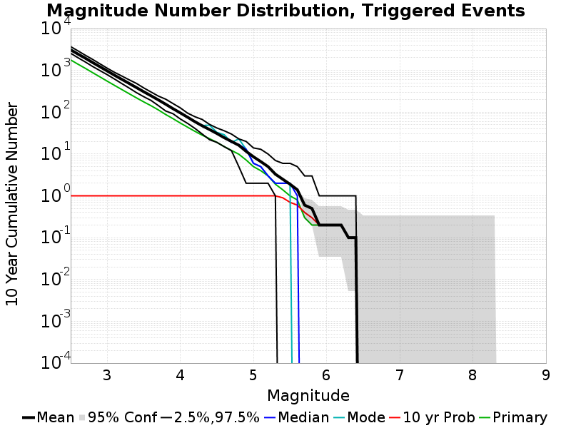
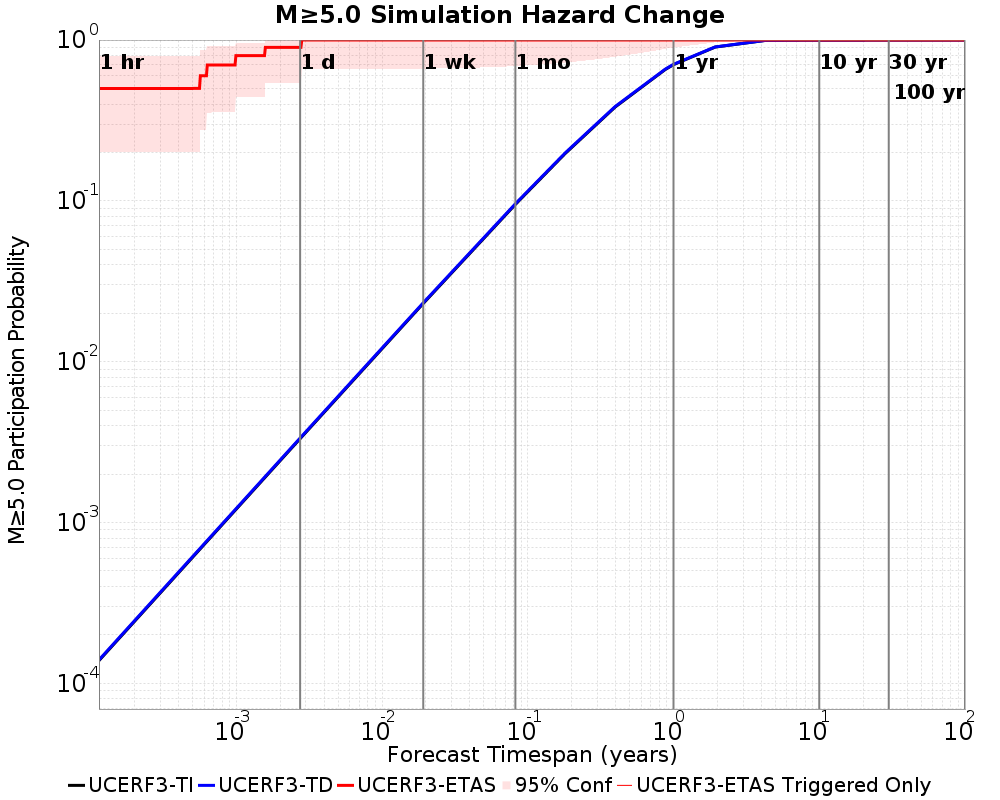
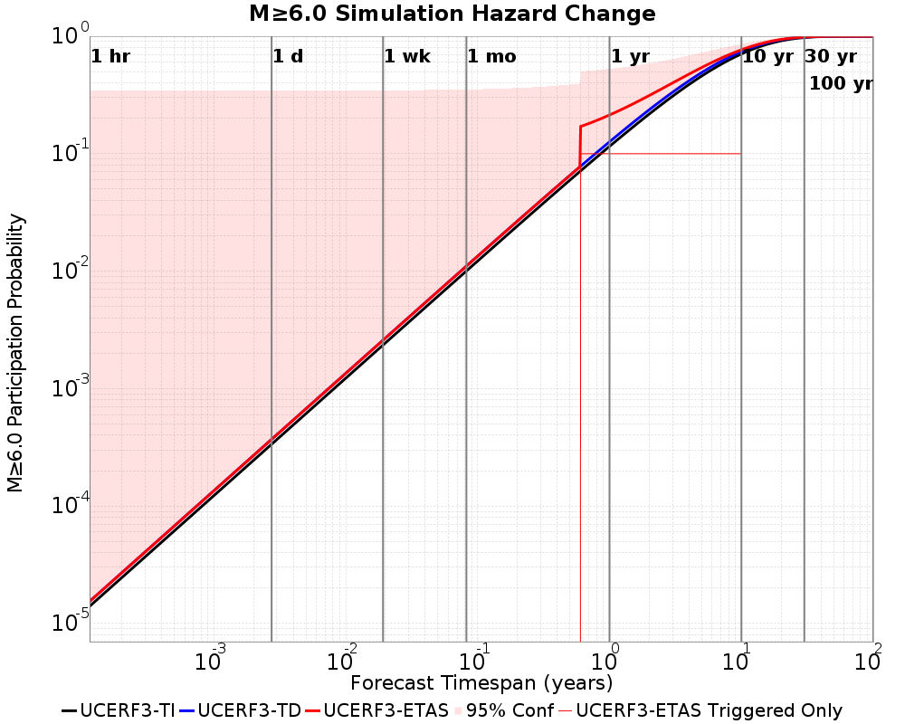
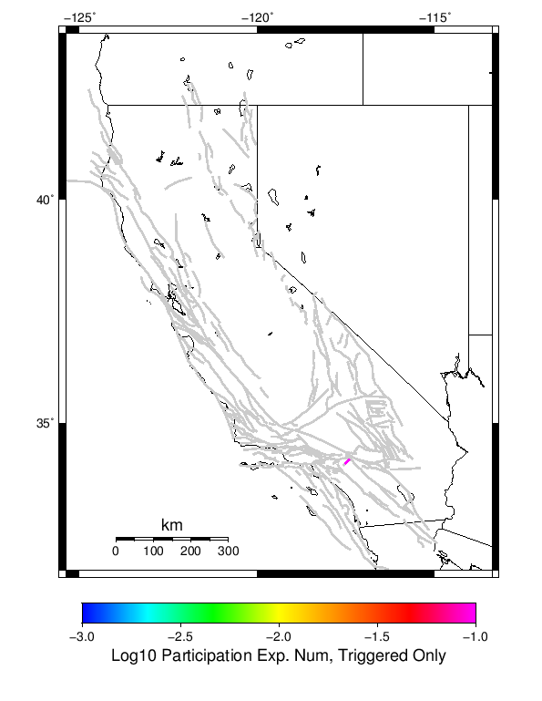
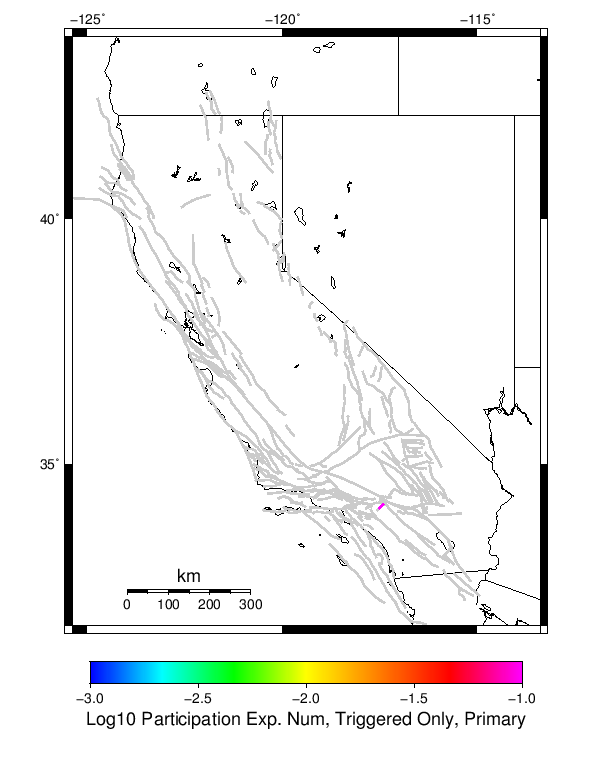
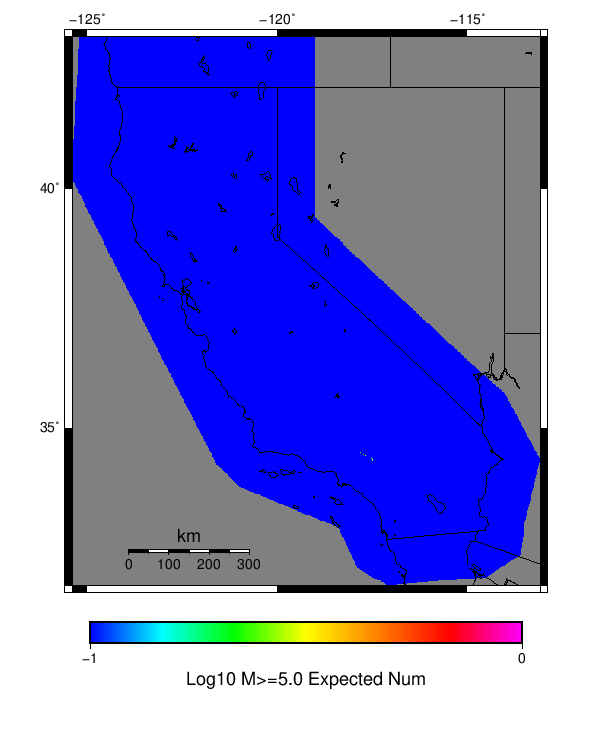

# Mojave M7 Results

|   | Mojave M7 |
|-----|-----|
| Num Simulations | 10 |
| Start Time | 2018/01/01 00:00:00 UTC |
| Start Time Epoch Milliseconds | 1514764800000 |
| Duration | 10 Years |
| Includes Spontaneous? | false |
| Historical Ruptures | *(none)* |

## Table Of Contents

* [Magnitude Number Distribution](#magnitude-number-distribution)
* [Hazard Change Over Time](#hazard-change-over-time)
  * [M≥5.0 Hazard Change Over Time](#m50-hazard-change-over-time)
  * [M≥6.0 Hazard Change Over Time](#m60-hazard-change-over-time)
* [Section Participation](#section-participation)
  * [Section Participation Plots](#section-participation-plots)
  * [Supra-Seismogenic Parent Sections Table](#supra-seismogenic-parent-sections-table)
* [Gridded Nucleation](#gridded-nucleation)

## Magnitude Number Distribution
*[(top)](#table-of-contents)*

**Legend**
* **Mean** (thick black line): mean expected number across all 10 catalogs
* **2.5%,97.5%** (thin black lines): expected number percentiles across all 10 catalogs
* **Median** (thin blue line): median expected number across all 10 catalogs
* **Mode** (thin cyan line): modal expected number across all 10 catalogs
* **10 yr Probability** (thin red line): 10 year probability calculated as the fraction of catalogs with at least 1 occurrence
* **95% Conf** (light red shaded region): binomial 95% confidence bounds on probability
* **Primary** (thin green line): mean expected number from primary triggered aftershocks only (no secondary, tertiary, etc...) across all 10 catalogs

| Mag | Mean | 2.5 %ile | 97.5 %ile | Median | Mode | 10 yr Probability | Primary Aftershocks Mean |
|-----|-----|-----|-----|-----|-----|-----|-----|
| **M≥2.5** | 3102.600 | 2572.000 | 3711.000 | 3049.000 | 3255.000 | 1.000 | 1781.100 |
| **M≥2.6** | 2461.900 | 2013.000 | 2935.000 | 2413.000 | 2515.000 | 1.000 | 1409.700 |
| **M≥2.7** | 1963.100 | 1593.000 | 2310.000 | 1916.000 | 2034.000 | 1.000 | 1122.600 |
| **M≥2.8** | 1547.000 | 1243.000 | 1836.000 | 1514.000 | 1514.000 | 1.000 | 884.600 |
| **M≥2.9** | 1225.400 | 991.000 | 1440.000 | 1227.000 | 1259.000 | 1.000 | 701.100 |
| **M≥3** | 971.300 | 791.000 | 1130.000 | 979.000 | 984.000 | 1.000 | 553.000 |
| **M≥3.1** | 766.500 | 621.000 | 900.000 | 761.000 | 783.000 | 1.000 | 438.800 |
| **M≥3.2** | 610.900 | 484.000 | 734.000 | 621.000 | 622.000 | 1.000 | 348.600 |
| **M≥3.3** | 487.900 | 379.000 | 596.000 | 491.000 | 491.000 | 1.000 | 276.900 |
| **M≥3.4** | 388.700 | 294.000 | 488.000 | 393.000 | 396.000 | 1.000 | 220.600 |
| **M≥3.5** | 308.400 | 235.000 | 381.000 | 306.000 | 317.000 | 1.000 | 176.500 |
| **M≥3.6** | 247.100 | 191.000 | 304.000 | 248.000 | 250.000 | 1.000 | 142.900 |
| **M≥3.7** | 196.900 | 144.000 | 243.000 | 194.000 | 197.000 | 1.000 | 113.400 |
| **M≥3.8** | 155.200 | 107.000 | 205.000 | 154.000 | 157.000 | 1.000 | 88.200 |
| **M≥3.9** | 121.500 | 92.000 | 161.000 | 119.000 | 122.000 | 1.000 | 70.100 |
| **M≥4** | 96.400 | 69.000 | 127.000 | 97.000 | 97.000 | 1.000 | 55.100 |
| **M≥4.1** | 75.800 | 54.000 | 95.000 | 76.000 | 77.000 | 1.000 | 43.800 |
| **M≥4.2** | 59.300 | 41.000 | 78.000 | 60.000 | 60.000 | 1.000 | 34.900 |
| **M≥4.3** | 47.300 | 30.000 | 67.000 | 46.000 | 48.000 | 1.000 | 28.200 |
| **M≥4.4** | 38.500 | 22.000 | 51.000 | 38.000 | 49.000 | 1.000 | 23.300 |
| **M≥4.5** | 31.000 | 19.000 | 42.000 | 31.000 | 33.000 | 1.000 | 19.000 |
| **M≥4.6** | 24.600 | 15.000 | 36.000 | 25.000 | 29.000 | 1.000 | 15.100 |
| **M≥4.7** | 20.000 | 12.000 | 30.000 | 19.000 | 19.000 | 1.000 | 12.200 |
| **M≥4.8** | 16.200 | 5.000 | 23.000 | 17.000 | 23.000 | 1.000 | 9.900 |
| **M≥4.9** | 11.600 | 2.000 | 20.000 | 13.000 | 13.000 | 1.000 | 7.200 |
| **M≥5** | 8.600 | 2.000 | 14.000 | 6.000 | 6.000 | 1.000 | 5.000 |
| **M≥5.1** | 6.600 | 2.000 | 13.000 | 5.000 | 5.000 | 1.000 | 4.000 |
| **M≥5.2** | 5.000 | 2.000 | 10.000 | 3.000 | 3.000 | 1.000 | 3.000 |
| **M≥5.3** | 3.300 | 1.000 | 7.000 | 2.000 | 2.000 | 1.000 | 1.900 |
| **M≥5.4** | 2.500 | 0.000 | 6.000 | 2.000 | 2.000 | 0.900 | 1.400 |
| **M≥5.5** | 1.900 | 0.000 | 6.000 | 2.000 | 2.000 | 0.700 | 1.000 |
| **M≥5.6** | 1.400 | 0.000 | 5.000 | 1.000 | 0.000 | 0.600 | 0.800 |
| **M≥5.7** | 0.600 | 0.000 | 3.000 | 0.000 | 0.000 | 0.400 | 0.300 |
| **M≥5.8** | 0.500 | 0.000 | 3.000 | 0.000 | 0.000 | 0.300 | 0.200 |
| **M≥5.9** | 0.200 | 0.000 | 1.000 | 0.000 | 0.000 | 0.200 | 0.200 |
| **M≥6** | 0.200 | 0.000 | 1.000 | 0.000 | 0.000 | 0.200 | 0.200 |
| **M≥6.1** | 0.200 | 0.000 | 1.000 | 0.000 | 0.000 | 0.200 | 0.200 |
| **M≥6.2** | 0.200 | 0.000 | 1.000 | 0.000 | 0.000 | 0.200 | 0.200 |
| **M≥6.3** | 0.100 | 0.000 | 1.000 | 0.000 | 0.000 | 0.100 | 0.100 |
| **M≥6.4** | 0.100 | 0.000 | 1.000 | 0.000 | 0.000 | 0.100 | 0.100 |
| **M≥6.5** | 0.000 | 0.000 | 0.000 | 0.000 | 0.000 | 0.000 | 0.000 |
| **M≥6.6** | 0.000 | 0.000 | 0.000 | 0.000 | 0.000 | 0.000 | 0.000 |
| **M≥6.7** | 0.000 | 0.000 | 0.000 | 0.000 | 0.000 | 0.000 | 0.000 |
| **M≥6.8** | 0.000 | 0.000 | 0.000 | 0.000 | 0.000 | 0.000 | 0.000 |
| **M≥6.9** | 0.000 | 0.000 | 0.000 | 0.000 | 0.000 | 0.000 | 0.000 |
| **M≥7** | 0.000 | 0.000 | 0.000 | 0.000 | 0.000 | 0.000 | 0.000 |
| **M≥7.1** | 0.000 | 0.000 | 0.000 | 0.000 | 0.000 | 0.000 | 0.000 |
| **M≥7.2** | 0.000 | 0.000 | 0.000 | 0.000 | 0.000 | 0.000 | 0.000 |
| **M≥7.3** | 0.000 | 0.000 | 0.000 | 0.000 | 0.000 | 0.000 | 0.000 |
| **M≥7.4** | 0.000 | 0.000 | 0.000 | 0.000 | 0.000 | 0.000 | 0.000 |
| **M≥7.5** | 0.000 | 0.000 | 0.000 | 0.000 | 0.000 | 0.000 | 0.000 |
| **M≥7.6** | 0.000 | 0.000 | 0.000 | 0.000 | 0.000 | 0.000 | 0.000 |
| **M≥7.7** | 0.000 | 0.000 | 0.000 | 0.000 | 0.000 | 0.000 | 0.000 |
| **M≥7.8** | 0.000 | 0.000 | 0.000 | 0.000 | 0.000 | 0.000 | 0.000 |
| **M≥7.9** | 0.000 | 0.000 | 0.000 | 0.000 | 0.000 | 0.000 | 0.000 |
| **M≥8** | 0.000 | 0.000 | 0.000 | 0.000 | 0.000 | 0.000 | 0.000 |
| **M≥8.1** | 0.000 | 0.000 | 0.000 | 0.000 | 0.000 | 0.000 | 0.000 |
| **M≥8.2** | 0.000 | 0.000 | 0.000 | 0.000 | 0.000 | 0.000 | 0.000 |
| **M≥8.3** | 0.000 | 0.000 | 0.000 | 0.000 | 0.000 | 0.000 | 0.000 |
| **M≥8.4** | 0.000 | 0.000 | 0.000 | 0.000 | 0.000 | 0.000 | 0.000 |
| **M≥8.5** | 0.000 | 0.000 | 0.000 | 0.000 | 0.000 | 0.000 | 0.000 |
| **M≥8.6** | 0.000 | 0.000 | 0.000 | 0.000 | 0.000 | 0.000 | 0.000 |
| **M≥8.7** | 0.000 | 0.000 | 0.000 | 0.000 | 0.000 | 0.000 | 0.000 |
| **M≥8.8** | 0.000 | 0.000 | 0.000 | 0.000 | 0.000 | 0.000 | 0.000 |
| **M≥8.9** | 0.000 | 0.000 | 0.000 | 0.000 | 0.000 | 0.000 | 0.000 |
| **M≥9** | 0.000 | 0.000 | 0.000 | 0.000 | 0.000 | 0.000 | 0.000 |

## Hazard Change Over Time
*[(top)](#table-of-contents)*

These plots show how the probability of ruptures of various magnitudes within 100km of any scenario rupture changes over time

### M≥5.0 Hazard Change Over Time
*[(top)](#table-of-contents)*

| Forecast Duration | UCERF3-ETAS [95% Conf] | UCERF3-ETAS Triggered Only | UCERF3-TD | UCERF3-TI |
|-----|-----|-----|-----|-----|
| 1 Hour | 0.500 [0.202 - 0.799] | 0.500 | 1.40E-4 | 1.39E-4 |
| 1 Day | 0.900 [0.543 - 0.995] | 0.900 | 3.35E-3 | 3.32E-3 |
| 1 Week | 1.000 [0.663 - 1.000] | 1.000 | 0.023 | 0.023 |
| 1 Month | 1.000 [0.688 - 1.000] | 1.000 | 0.096 | 0.095 |
| 1 Year | 1.000 [0.899 - 1.000] | 1.000 | 0.707 | 0.703 |
| 10 Years | 1.000 [1.000 - 1.000] | 1.000 | 1.000 | 1.000 |
| 30 Years | 1.000 [1.000 - 1.000] \* | \* | 1.000 | 1.000 |
| 100 Years | 1.000 [1.000 - 1.000] \* | \* | 1.000 | 1.000 |

\* *forecast duration is longer than simulation length, only ETAS ruptures from the first 10 years are included*
### M≥6.0 Hazard Change Over Time
*[(top)](#table-of-contents)*

| Forecast Duration | UCERF3-ETAS [95% Conf] | UCERF3-ETAS Triggered Only | UCERF3-TD | UCERF3-TI |
|-----|-----|-----|-----|-----|
| 1 Hour | 1.54E-5 [1.54E-5 - 0.345] | 0.000 | 1.54E-5 | 1.40E-5 |
| 1 Day | 3.69E-4 [3.69E-4 - 0.345] | 0.000 | 3.69E-4 | 3.36E-4 |
| 1 Week | 2.58E-3 [2.58E-3 - 0.346] | 0.000 | 2.58E-3 | 2.35E-3 |
| 1 Month | 0.011 [0.011 - 0.352] | 0.000 | 0.011 | 0.010 |
| 1 Year | 0.214 [0.131 - 0.527] | 0.100 | 0.126 | 0.115 |
| 10 Years | 0.767 [0.742 - 0.860] | 0.100 | 0.741 | 0.707 |
| 30 Years | 0.984 [0.983 - 0.991] \* | \* | 0.983 | 0.975 |
| 100 Years | 1.000 [1.000 - 1.000] \* | \* | 1.000 | 1.000 |

\* *forecast duration is longer than simulation length, only ETAS ruptures from the first 10 years are included*
## Section Participation
*[(top)](#table-of-contents)*

### Section Participation Plots
*[(top)](#table-of-contents)*

| Min Mag | Triggered Ruptures (no spontaneous) | Triggered Ruptures (primary aftershocks only) |
|-----|-----|-----|
| **All Supra. Seis.** |  |  |

### Supra-Seismogenic Parent Sections Table
*[(top)](#table-of-contents)*

| Parent Name | Triggered Mean Count | Triggered 10 Year Prob | Triggered Primary Mean Count |
|-----|-----|-----|-----|
| Fontana (Seismicity) | 0.1 | 0.1 | 0.1 |
## Gridded Nucleation
*[(top)](#table-of-contents)*

| Min Mag | Triggered Ruptures (no spontaneous) | Triggered Ruptures (primary aftershocks only) |
|-----|-----|-----|
| **M≥2.5** |  |  |
| **M≥5** |  |  |
| **M≥6** |  |  |
| **M≥7** |  |  |
