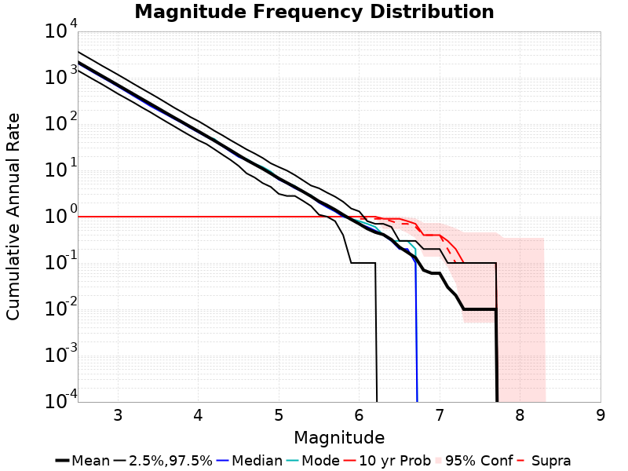

# Spontaneous Only Results

|   | Spontaneous Only |
|-----|-----|
| Num Simulations | 10 |
| Start Time | 2018/01/01 00:00:00 UTC |
| Start Time Epoch Milliseconds | 1514764800000 |
| Duration | 10 Years |
| Includes Spontaneous? | true |
| Trigger Ruptures | *(none)* |
| Historical Ruptures | *(none)* |

## Table Of Contents

* [Magnitude Frequency Distribution](#magnitude-frequency-distribution)
* [Section Participation](#section-participation)
  * [Section Participation Plots](#section-participation-plots)
  * [Supra-Seismogenic Parent Sections Table](#supra-seismogenic-parent-sections-table)
  * [M≥6.5 Parent Sections Table](#m65-parent-sections-table)
  * [M≥7 Parent Sections Table](#m7-parent-sections-table)
  * [M≥7.5 Parent Sections Table](#m75-parent-sections-table)
* [Gridded Nucleation](#gridded-nucleation)

## Magnitude Frequency Distribution
*[(top)](#table-of-contents)*

**Legend**
* **Mean** (thick black line): mean annual rate across all 10 catalogs
* **95% Conf** (light gray shaded region): binomial 95% confidence bounds on mean value
* **2.5%,97.5%** (thin black lines): annual rate percentiles across all 10 catalogs
* **Median** (thin blue line): median annual rate across all 10 catalogs
* **Mode** (thin cyan line): modal annual rate across all 10 catalogs (scaled to annualized value)
* **10 yr Probability** (thin red line): 10 year probability calculated as the fraction of catalogs with at least 1 occurrence

| Mag | Mean | 2.5 %ile | 97.5 %ile | Median | Mode | 10 yr Probability |
|-----|-----|-----|-----|-----|-----|-----|
| **M≥2.5** | 2180.36 | 1434.9 | 3652.4 | 2048.0 | 2173.7 | 1.0 |
| **M≥2.6** | 1732.95 | 1140.2 | 2897.7 | 1625.8 | 1729.1 | 1.0 |
| **M≥2.7** | 1376.68 | 906.9 | 2305.1 | 1285.3 | 1375.4 | 1.0 |
| **M≥2.8** | 1093.91 | 724.8 | 1823.5 | 1024.9 | 1098.3 | 1.0 |
| **M≥2.9** | 870.32 | 572.1 | 1459.2 | 817.3 | 868.9 | 1.0 |
| **M≥3** | 690.73 | 449.4 | 1163.3 | 646.6 | 690.9 | 1.0 |
| **M≥3.1** | 548.59 | 360.6 | 922.7 | 508.6 | 545.2 | 1.0 |
| **M≥3.2** | 435.63 | 288.6 | 728.0 | 399.6 | 435.6 | 1.0 |
| **M≥3.3** | 345.91 | 227.4 | 578.0 | 315.0 | 347.0 | 1.0 |
| **M≥3.4** | 274.81 | 181.8 | 460.9 | 246.6 | 275.2 | 1.0 |
| **M≥3.5** | 218.34 | 142.7 | 365.5 | 199.0 | 219.6 | 1.0 |
| **M≥3.6** | 173.0 | 112.5 | 287.4 | 160.8 | 170.9 | 1.0 |
| **M≥3.7** | 137.53 | 89.1 | 225.2 | 128.9 | 135.9 | 1.0 |
| **M≥3.8** | 109.84 | 70.3 | 180.1 | 104.3 | 109.6 | 1.0 |
| **M≥3.9** | 87.35 | 55.9 | 142.0 | 82.3 | 88.9 | 1.0 |
| **M≥4** | 69.63 | 44.6 | 115.6 | 65.8 | 70.9 | 1.0 |
| **M≥4.1** | 55.22 | 37.0 | 91.3 | 52.8 | 53.7 | 1.0 |
| **M≥4.2** | 43.81 | 28.5 | 71.3 | 42.5 | 47.5 | 1.0 |
| **M≥4.3** | 34.5 | 21.8 | 57.0 | 33.1 | 34.0 | 1.0 |
| **M≥4.4** | 27.14 | 16.8 | 44.8 | 25.3 | 27.8 | 1.0 |
| **M≥4.5** | 21.23 | 12.5 | 35.7 | 19.6 | 19.6 | 1.0 |
| **M≥4.6** | 16.72 | 8.6 | 28.3 | 16.4 | 17.7 | 1.0 |
| **M≥4.7** | 13.47 | 7.0 | 23.1 | 13.2 | 13.9 | 1.0 |
| **M≥4.8** | 10.83 | 5.3 | 18.5 | 10.7 | 11.8 | 1.0 |
| **M≥4.9** | 8.55 | 4.4 | 14.2 | 8.4 | 9.4 | 1.0 |
| **M≥5** | 6.71 | 3.1 | 11.8 | 6.3 | 6.6 | 1.0 |
| **M≥5.1** | 5.4 | 2.8 | 9.9 | 5.2 | 5.4 | 1.0 |
| **M≥5.2** | 4.37 | 2.8 | 7.9 | 4.1 | 4.6 | 1.0 |
| **M≥5.3** | 3.49 | 2.2 | 6.1 | 3.4 | 3.4 | 1.0 |
| **M≥5.4** | 2.76 | 1.7 | 4.7 | 2.7 | 2.9 | 1.0 |
| **M≥5.5** | 2.14 | 1.1 | 4.1 | 2.0 | 2.1 | 1.0 |
| **M≥5.6** | 1.76 | 1.0 | 3.3 | 1.6 | 1.6 | 1.0 |
| **M≥5.7** | 1.41 | 0.8 | 2.7 | 1.3 | 1.3 | 1.0 |
| **M≥5.8** | 1.1 | 0.4 | 2.1 | 1.0 | 1.0 | 1.0 |
| **M≥5.9** | 0.87 | 0.1 | 1.5 | 0.9 | 0.9 | 1.0 |
| **M≥6** | 0.7 | 0.1 | 1.3 | 0.7 | 0.8 | 1.0 |
| **M≥6.1** | 0.55 | 0.1 | 0.8 | 0.6 | 0.7 | 1.0 |
| **M≥6.2** | 0.46 | 0.1 | 0.7 | 0.5 | 0.6 | 1.0 |
| **M≥6.3** | 0.41 | 0.0 | 0.7 | 0.4 | 0.4 | 0.9 |
| **M≥6.4** | 0.32 | 0.0 | 0.6 | 0.3 | 0.3 | 0.9 |
| **M≥6.5** | 0.22 | 0.0 | 0.3 | 0.2 | 0.3 | 0.9 |
| **M≥6.6** | 0.17 | 0.0 | 0.3 | 0.2 | 0.3 | 0.8 |
| **M≥6.7** | 0.13 | 0.0 | 0.3 | 0.1 | 0.2 | 0.7 |
| **M≥6.8** | 0.07 | 0.0 | 0.2 | 0.0 | 0.0 | 0.4 |
| **M≥6.9** | 0.06 | 0.0 | 0.2 | 0.0 | 0.0 | 0.4 |
| **M≥7** | 0.06 | 0.0 | 0.2 | 0.0 | 0.0 | 0.4 |
| **M≥7.1** | 0.03 | 0.0 | 0.1 | 0.0 | 0.0 | 0.3 |
| **M≥7.2** | 0.02 | 0.0 | 0.1 | 0.0 | 0.0 | 0.2 |
| **M≥7.3** | 0.01 | 0.0 | 0.1 | 0.0 | 0.0 | 0.1 |
| **M≥7.4** | 0.01 | 0.0 | 0.1 | 0.0 | 0.0 | 0.1 |
| **M≥7.5** | 0.01 | 0.0 | 0.1 | 0.0 | 0.0 | 0.1 |
| **M≥7.6** | 0.01 | 0.0 | 0.1 | 0.0 | 0.0 | 0.1 |
| **M≥7.7** | 0.01 | 0.0 | 0.1 | 0.0 | 0.0 | 0.1 |
| **M≥7.8** | 0.0 | 0.0 | 0.0 | 0.0 | 0.0 | 0.0 |
| **M≥7.9** | 0.0 | 0.0 | 0.0 | 0.0 | 0.0 | 0.0 |
| **M≥8** | 0.0 | 0.0 | 0.0 | 0.0 | 0.0 | 0.0 |
| **M≥8.1** | 0.0 | 0.0 | 0.0 | 0.0 | 0.0 | 0.0 |
| **M≥8.2** | 0.0 | 0.0 | 0.0 | 0.0 | 0.0 | 0.0 |
| **M≥8.3** | 0.0 | 0.0 | 0.0 | 0.0 | 0.0 | 0.0 |
| **M≥8.4** | 0.0 | 0.0 | 0.0 | 0.0 | 0.0 | 0.0 |
| **M≥8.5** | 0.0 | 0.0 | 0.0 | 0.0 | 0.0 | 0.0 |
| **M≥8.6** | 0.0 | 0.0 | 0.0 | 0.0 | 0.0 | 0.0 |
| **M≥8.7** | 0.0 | 0.0 | 0.0 | 0.0 | 0.0 | 0.0 |
| **M≥8.8** | 0.0 | 0.0 | 0.0 | 0.0 | 0.0 | 0.0 |
| **M≥8.9** | 0.0 | 0.0 | 0.0 | 0.0 | 0.0 | 0.0 |
| **M≥9** | 0.0 | 0.0 | 0.0 | 0.0 | 0.0 | 0.0 |

## Section Participation
*[(top)](#table-of-contents)*

### Section Participation Plots
*[(top)](#table-of-contents)*

| Min Mag | Complete Catalog (including spontaneous) |
|-----|-----|
| **All Supra. Seis.** |  |
| **M≥6.5** |  |
| **M≥7** |  |
| **M≥7.5** |  |

### Supra-Seismogenic Parent Sections Table
*[(top)](#table-of-contents)*

*First 10 of 34 with matching ruptures shown*

| Parent Name | Total Mean Annual Rate | Total 10 Year Prob |
|-----|-----|-----|
| San Andreas (Creeping Section) 2011 CFM | 0.04 | 0.3 |
| San Andreas (Mojave S) | 0.03 | 0.3 |
| San Andreas (Parkfield) | 0.03 | 0.3 |
| Calaveras (Central) 2011 CFM | 0.02 | 0.2 |
| Green Valley 2011 CFM | 0.02 | 0.1 |
| Hunting Creek - Berryessa 2011 CFM | 0.02 | 0.1 |
| San Andreas (San Bernardino N) | 0.02 | 0.2 |
| Bartlett Springs 2011 CFM | 0.01 | 0.1 |
| Bear River fault zone | 0.01 | 0.1 |
| Big Lagoon - Bald Mtn 2011 CFM | 0.01 | 0.1 |

### M≥6.5 Parent Sections Table
*[(top)](#table-of-contents)*

*First 10 of 21 with matching ruptures shown*

| Parent Name | Total Mean Annual Rate | Total 10 Year Prob |
|-----|-----|-----|
| San Andreas (San Bernardino N) | 0.02 | 0.2 |
| Bartlett Springs 2011 CFM | 0.01 | 0.1 |
| Big Lagoon - Bald Mtn 2011 CFM | 0.01 | 0.1 |
| Blue Cut | 0.01 | 0.1 |
| Calaveras (Central) 2011 CFM | 0.01 | 0.1 |
| Calaveras (No) 2011 CFM | 0.01 | 0.1 |
| Cerro Prieto | 0.01 | 0.1 |
| Eaton Roughs 2011 CFM | 0.01 | 0.1 |
| Franklin 2011 CFM | 0.01 | 0.1 |
| Green Valley 2011 CFM | 0.01 | 0.1 |

### M≥7 Parent Sections Table
*[(top)](#table-of-contents)*

| Parent Name | Total Mean Annual Rate | Total 10 Year Prob |
|-----|-----|-----|
| Big Lagoon - Bald Mtn 2011 CFM | 0.01 | 0.1 |
| Blue Cut | 0.01 | 0.1 |
| Calaveras (Central) 2011 CFM | 0.01 | 0.1 |
| Calaveras (No) 2011 CFM | 0.01 | 0.1 |
| Franklin 2011 CFM | 0.01 | 0.1 |
| Hayward (So) extension 2011 CFM | 0.01 | 0.1 |
| San Andreas (Mojave S) | 0.01 | 0.1 |
| San Andreas (San Bernardino N) | 0.01 | 0.1 |
| Trinidad (alt1) | 0.01 | 0.1 |

### M≥7.5 Parent Sections Table
*[(top)](#table-of-contents)*

| Parent Name | Total Mean Annual Rate | Total 10 Year Prob |
|-----|-----|-----|
| Big Lagoon - Bald Mtn 2011 CFM | 0.01 | 0.1 |
## Gridded Nucleation
*[(top)](#table-of-contents)*

| Min Mag | Complete Catalog (including spontaneous) |
|-----|-----|
| **M≥2.5** |  |
| **M≥5** |  |
| **M≥6** |  |
| **M≥7** |  |
