# Parent Section Magnitude-Probability Distributions

## Table Of Contents

* [Airport Lake](#airport-lake)
* [Almanor 2011 CFM](#almanor-2011-cfm)
* [Anacapa-Dume alt 1](#anacapa-dume-alt-1)
* [Anaheim](#anaheim)
* [Antelope Valley 2011](#antelope-valley-2011)
* [Ash Hill](#ash-hill)
* [Baker](#baker)
* [Bartlett Springs 2011 CFM](#bartlett-springs-2011-cfm)
* [Battle Creek 2011 CFM](#battle-creek-2011-cfm)
* [Bear River fault zone](#bear-river-fault-zone)
* [Bennett Valley 2011 CFM](#bennett-valley-2011-cfm)
* [Bicycle Lake](#bicycle-lake)
* [Big Lagoon - Bald Mtn 2011 CFM](#big-lagoon---bald-mtn-2011-cfm)
* [Big Pine (Central)](#big-pine-central)
* [Big Pine (East)](#big-pine-east)
* [Big Pine (West)](#big-pine-west)
* [Blackwater](#blackwater)
* [Blue Cut](#blue-cut)
* [Brawley (Seismic Zone) alt 1](#brawley-seismic-zone-alt-1)
* [Breckenridge 2011](#breckenridge-2011)
* [Bullion Mountains](#bullion-mountains)
* [Burnt Mtn](#burnt-mtn)
* [Butano 2011 CFM](#butano-2011-cfm)
* [Cady](#cady)
* [Calaveras (Central) 2011 CFM](#calaveras-central-2011-cfm)
* [Calaveras (No) 2011 CFM](#calaveras-no-2011-cfm)
* [Calaveras (So) - Paicines extension 2011 CFM](#calaveras-so---paicines-extension-2011-cfm)
* [Calaveras (So) 2011 CFM](#calaveras-so-2011-cfm)
* [Calico-Hidalgo](#calico-hidalgo)
* [Camp Rock 2011](#camp-rock-2011)
* [Canada David (Detachment)](#canada-david-detachment)
* [Carlsbad](#carlsbad)
* [Carson Range (Genoa)](#carson-range-genoa)
* [Casmalia 2011 CFM](#casmalia-2011-cfm)
* [Cedar Mtn-Mahogany Mtn](#cedar-mtn-mahogany-mtn)
* [Cerro Prieto](#cerro-prieto)
* [Channel Islands Thrust](#channel-islands-thrust)
* [Channel Islands Western Deep Ramp](#channel-islands-western-deep-ramp)
* [Chino alt 1](#chino-alt-1)
* [Clamshell-Sawpit](#clamshell-sawpit)
* [Clayton](#clayton)
* [Cleghorn](#cleghorn)
* [Cleghorn Lake](#cleghorn-lake)
* [Cleghorn Pass](#cleghorn-pass)
* [Collayami 2011 CFM](#collayami-2011-cfm)
* [Compton](#compton)
* [Concord 2011 CFM](#concord-2011-cfm)
* [Contra Costa (Lafayette) 2011 CFM](#contra-costa-lafayette-2011-cfm)
* [Contra Costa Shear Zone (connector) 2011 CFM](#contra-costa-shear-zone-connector-2011-cfm)
* [Coronado Bank alt1](#coronado-bank-alt1)
* [Coyote Canyon](#coyote-canyon)
* [Coyote Lake](#coyote-lake)
* [Cucamonga](#cucamonga)
* [Davis Creek](#davis-creek)
* [Death Valley (Black Mtns Frontal)](#death-valley-black-mtns-frontal)
* [Death Valley (Fish Lake Valley)](#death-valley-fish-lake-valley)
* [Death Valley (No)](#death-valley-no)
* [Death Valley (So)](#death-valley-so)
* [Deep Springs](#deep-springs)
* [Del Valle](#del-valle)
* [Dog Valley](#dog-valley)
* [Dry Mountain](#dry-mountain)
* [Earthquake Valley](#earthquake-valley)
* [Earthquake Valley (No  Extension)](#earthquake-valley-no--extension)
* [Earthquake Valley (So Extension)](#earthquake-valley-so-extension)
* [East Huasna 2011 CFM](#east-huasna-2011-cfm)
* [Eaton Roughs 2011 CFM](#eaton-roughs-2011-cfm)
* [Elmore Ranch](#elmore-ranch)
* [Elsinore (Coyote Mountains)](#elsinore-coyote-mountains)
* [Elsinore (Glen Ivy) rev](#elsinore-glen-ivy-rev)
* [Elsinore (Julian)](#elsinore-julian)
* [Elsinore (Stepovers Combined)](#elsinore-stepovers-combined)
* [Elsinore (Temecula) rev](#elsinore-temecula-rev)
* [Elysian Park (Lower CFM)](#elysian-park-lower-cfm)
* [Elysian Park (Upper)](#elysian-park-upper)
* [Emerson-Copper Mtn 2011](#emerson-copper-mtn-2011)
* [Eureka Peak](#eureka-peak)
* [Fickle Hill (alt1)](#fickle-hill-alt1)
* [Fish Slough 2011 CFM](#fish-slough-2011-cfm)
* [Fitzhugh Creek](#fitzhugh-creek)
* [Fontana (Seismicity)](#fontana-seismicity)
* [Franklin 2011 CFM](#franklin-2011-cfm)
* [Garberville - Briceland 2011 CFM](#garberville---briceland-2011-cfm)
* [Garlic Springs](#garlic-springs)
* [Garlock (Central)](#garlock-central)
* [Garlock (East)](#garlock-east)
* [Garlock (West)](#garlock-west)
* [Gillem - Big Crack 2011 CFM](#gillem---big-crack-2011-cfm)
* [Goldstone Lake](#goldstone-lake)
* [Goose Lake 2011 CFM](#goose-lake-2011-cfm)
* [Gravel Hills-Harper Lk](#gravel-hills-harper-lk)
* [Great Valley 01](#great-valley-01)
* [Great Valley 02](#great-valley-02)
* [Great Valley 03 Mysterious Ridge](#great-valley-03-mysterious-ridge)
* [Great Valley 03a Dunnigan Hills](#great-valley-03a-dunnigan-hills)
* [Great Valley 04a Trout Creek](#great-valley-04a-trout-creek)
* [Great Valley 04b Gordon Valley](#great-valley-04b-gordon-valley)
* [Great Valley 05 Pittsburg - Kirby Hills alt1](#great-valley-05-pittsburg---kirby-hills-alt1)
* [Great Valley 06 (Midland) 2011 CFM alt1](#great-valley-06-midland-2011-cfm-alt1)
* [Great Valley 07 (Orestimba)](#great-valley-07-orestimba)
* [Great Valley 08 (Quinto)](#great-valley-08-quinto)
* [Great Valley 09 (Laguna Seca)](#great-valley-09-laguna-seca)
* [Great Valley 10 (Panoche)](#great-valley-10-panoche)
* [Great Valley 11](#great-valley-11)
* [Great Valley 12](#great-valley-12)
* [Great Valley 13 (Coalinga)](#great-valley-13-coalinga)
* [Great Valley 14 (Kettleman Hills)](#great-valley-14-kettleman-hills)
* [Green Valley 2011 CFM](#green-valley-2011-cfm)
* [Greenville (No) 2011 CFM](#greenville-no-2011-cfm)
* [Greenville (So) 2011 CFM](#greenville-so-2011-cfm)
* [Hartley Springs 2011 CFM](#hartley-springs-2011-cfm)
* [Hat Creek-McArthur-Mayfield](#hat-creek-mcarthur-mayfield)
* [Hayward (No) 2011 CFM](#hayward-no-2011-cfm)
* [Hayward (So) 2011 CFM](#hayward-so-2011-cfm)
* [Hayward (So) extension 2011 CFM](#hayward-so-extension-2011-cfm)
* [Hector Mine](#hector-mine)
* [Helendale-So Lockhart](#helendale-so-lockhart)
* [Hilton Creek 2011 CFM](#hilton-creek-2011-cfm)
* [Hollywood](#hollywood)
* [Holser alt 1](#holser-alt-1)
* [Homestead Valley 2011](#homestead-valley-2011)
* [Honey Lake 2011 CFM](#honey-lake-2011-cfm)
* [Hosgri](#hosgri)
* [Hosgri (Extension)](#hosgri-extension)
* [Hunter Mountain-Saline Valley](#hunter-mountain-saline-valley)
* [Hunting Creek - Bartlett Springs connector 2011](#hunting-creek---bartlett-springs-connector-2011)
* [Hunting Creek - Berryessa 2011 CFM](#hunting-creek---berryessa-2011-cfm)
* [Imperial](#imperial)
* [Incline Village 2011 CFM](#incline-village-2011-cfm)
* [Independence rev 2011](#independence-rev-2011)
* [Jess Valley](#jess-valley)
* [Johnson Valley (No) 2011 rev](#johnson-valley-no-2011-rev)
* [Joshua Tree (Seismicity)](#joshua-tree-seismicity)
* [Keddie Ridge 2011 CFM](#keddie-ridge-2011-cfm)
* [Kern Canyon (Lake Isabella) 2011](#kern-canyon-lake-isabella-2011)
* [Kern Canyon (North Kern) 2011](#kern-canyon-north-kern-2011)
* [Kern Canyon (South Kern) 2011](#kern-canyon-south-kern-2011)
* [Kickapoo](#kickapoo)
* [King Range 2011 CFM](#king-range-2011-cfm)
* [La Panza 2011](#la-panza-2011)
* [Laguna Salada](#laguna-salada)
* [Lake Isabella (Seismicity)](#lake-isabella-seismicity)
* [Las Positas](#las-positas)
* [Last Chance](#last-chance)
* [Lenwood-Lockhart-Old Woman Springs](#lenwood-lockhart-old-woman-springs)
* [Likely 2011 CFM](#likely-2011-cfm)
* [Lions Head 2011 CFM](#lions-head-2011-cfm)
* [Little Lake](#little-lake)
* [Little Salmon (Offshore)](#little-salmon-offshore)
* [Little Salmon (Onshore)](#little-salmon-onshore)
* [Los Alamos 2011 CFM](#los-alamos-2011-cfm)
* [Los Alamos extension](#los-alamos-extension)
* [Los Medanos - Roe Island](#los-medanos---roe-island)
* [Los Osos 2011](#los-osos-2011)
* [Lost Hills](#lost-hills)
* [Ludlow](#ludlow)
* [Maacama 2011 CFM](#maacama-2011-cfm)
* [Mad River (alt1)](#mad-river-alt1)
* [Malibu Coast (Extension) alt 1](#malibu-coast-extension-alt-1)
* [Malibu Coast alt 1](#malibu-coast-alt-1)
* [Manix-Afton Hills](#manix-afton-hills)
* [McKinleyville (alt1)](#mckinleyville-alt1)
* [McLean Lake](#mclean-lake)
* [Mendocino](#mendocino)
* [Mission (connected) 2011 CFM](#mission-connected-2011-cfm)
* [Mission Creek](#mission-creek)
* [Mission Hills 2011](#mission-hills-2011)
* [Mission Ridge-Arroyo Parida-Santa Ana](#mission-ridge-arroyo-parida-santa-ana)
* [Mohawk Valley 2011 CFM](#mohawk-valley-2011-cfm)
* [Mono Lake 2011 CFM](#mono-lake-2011-cfm)
* [Monte Vista - Shannon 2011 CFM](#monte-vista---shannon-2011-cfm)
* [Monterey Bay-Tularcitos](#monterey-bay-tularcitos)
* [Morales (East)](#morales-east)
* [Morales (West)](#morales-west)
* [Mount Diablo Thrust North CFM](#mount-diablo-thrust-north-cfm)
* [Mount Diablo Thrust South](#mount-diablo-thrust-south)
* [Nelson Lake](#nelson-lake)
* [Newport-Inglewood (Offshore)](#newport-inglewood-offshore)
* [Newport-Inglewood alt 1](#newport-inglewood-alt-1)
* [North Frontal  (East)](#north-frontal--east)
* [North Frontal  (West)](#north-frontal--west)
* [North Salt Lake](#north-salt-lake)
* [North Tahoe 2011 CFM](#north-tahoe-2011-cfm)
* [Northridge](#northridge)
* [Northridge Hills](#northridge-hills)
* [Oak Ridge (Onshore)](#oak-ridge-onshore)
* [Oceanic - West Huasna](#oceanic---west-huasna)
* [Oceanside alt1](#oceanside-alt1)
* [Ortigalita (North)](#ortigalita-north)
* [Ortigalita (South)](#ortigalita-south)
* [Owens Valley](#owens-valley)
* [Owens Valley Keough Hot Springs](#owens-valley-keough-hot-springs)
* [Owl Lake](#owl-lake)
* [Ozena](#ozena)
* [Palos Verdes](#palos-verdes)
* [Panamint Valley](#panamint-valley)
* [Paradise](#paradise)
* [Peralta Hills](#peralta-hills)
* [Pilarcitos 2011 CFM](#pilarcitos-2011-cfm)
* [Pine Mtn](#pine-mtn)
* [Pinto Mtn](#pinto-mtn)
* [Pisgah-Bullion Mtn-Mesquite Lk](#pisgah-bullion-mtn-mesquite-lk)
* [Pitas Point (Lower West)](#pitas-point-lower-west)
* [Pitas Point (Lower)-Montalvo](#pitas-point-lower-montalvo)
* [Pittville 2011 CFM](#pittville-2011-cfm)
* [Pleito](#pleito)
* [Point Reyes 2011 CFM](#point-reyes-2011-cfm)
* [Point Reyes 2011 connector](#point-reyes-2011-connector)
* [Polaris 2011 CFM](#polaris-2011-cfm)
* [Puente Hills](#puente-hills)
* [Quien Sabe 2011 CFM](#quien-sabe-2011-cfm)
* [Raymond](#raymond)
* [Red Mountain](#red-mountain)
* [Red Pass](#red-pass)
* [Redondo Canyon alt 1](#redondo-canyon-alt-1)
* [Reliz 2011 CFM](#reliz-2011-cfm)
* [Richfield](#richfield)
* [Rinconada 2011 CFM](#rinconada-2011-cfm)
* [Robinson Creek](#robinson-creek)
* [Rocky Ledge 2011 CFM](#rocky-ledge-2011-cfm)
* [Rodgers Creek - Healdsburg 2011 CFM](#rodgers-creek---healdsburg-2011-cfm)
* [Rose Canyon](#rose-canyon)
* [Round Valley](#round-valley)
* [Russ 2011 CFM](#russ-2011-cfm)
* [San Andreas (Big Bend)](#san-andreas-big-bend)
* [San Andreas (Carrizo) rev](#san-andreas-carrizo-rev)
* [San Andreas (Cholame) rev](#san-andreas-cholame-rev)
* [San Andreas (Coachella) rev](#san-andreas-coachella-rev)
* [San Andreas (Creeping Section) 2011 CFM](#san-andreas-creeping-section-2011-cfm)
* [San Andreas (Mojave N)](#san-andreas-mojave-n)
* [San Andreas (Mojave S)](#san-andreas-mojave-s)
* [San Andreas (North Branch Mill Creek)](#san-andreas-north-branch-mill-creek)
* [San Andreas (North Coast) 2011 CFM](#san-andreas-north-coast-2011-cfm)
* [San Andreas (Offshore) 2011 CFM](#san-andreas-offshore-2011-cfm)
* [San Andreas (Parkfield)](#san-andreas-parkfield)
* [San Andreas (Peninsula) 2011 CFM](#san-andreas-peninsula-2011-cfm)
* [San Andreas (San Bernardino N)](#san-andreas-san-bernardino-n)
* [San Andreas (San Bernardino S)](#san-andreas-san-bernardino-s)
* [San Andreas (San Gorgonio Pass-Garnet HIll)](#san-andreas-san-gorgonio-pass-garnet-hill)
* [San Andreas (Santa Cruz Mts) 2011 CFM](#san-andreas-santa-cruz-mts-2011-cfm)
* [San Cayetano](#san-cayetano)
* [San Clemente](#san-clemente)
* [San Diego Trough north alt1](#san-diego-trough-north-alt1)
* [San Diego Trough south](#san-diego-trough-south)
* [San Gabriel](#san-gabriel)
* [San Gabriel (Extension)](#san-gabriel-extension)
* [San Gorgonio Pass](#san-gorgonio-pass)
* [San Gregorio (North) 2011 CFM](#san-gregorio-north-2011-cfm)
* [San Gregorio (South) 2011 CFM](#san-gregorio-south-2011-cfm)
* [San Jacinto (Anza) rev](#san-jacinto-anza-rev)
* [San Jacinto (Borrego)](#san-jacinto-borrego)
* [San Jacinto (Clark) rev](#san-jacinto-clark-rev)
* [San Jacinto (Coyote Creek)](#san-jacinto-coyote-creek)
* [San Jacinto (Lytle Creek connector)](#san-jacinto-lytle-creek-connector)
* [San Jacinto (San Bernardino)](#san-jacinto-san-bernardino)
* [San Jacinto (San Jacinto Valley) rev](#san-jacinto-san-jacinto-valley-rev)
* [San Jacinto (Stepovers Combined)](#san-jacinto-stepovers-combined)
* [San Jacinto (Superstition Mtn)](#san-jacinto-superstition-mtn)
* [San Joaquin Hills](#san-joaquin-hills)
* [San Jose](#san-jose)
* [San Juan](#san-juan)
* [San Luis Range - Oceano 2011 CFM](#san-luis-range---oceano-2011-cfm)
* [San Luis Range - Pecho 2011 CFM](#san-luis-range---pecho-2011-cfm)
* [San Luis Range 2011 CFM](#san-luis-range-2011-cfm)
* [San Pedro Basin](#san-pedro-basin)
* [San Pedro Escarpment](#san-pedro-escarpment)
* [San Vicente](#san-vicente)
* [Santa Cruz Catalina Ridge alt1](#santa-cruz-catalina-ridge-alt1)
* [Santa Cruz Island](#santa-cruz-island)
* [Santa Monica Bay](#santa-monica-bay)
* [Santa Monica alt 1](#santa-monica-alt-1)
* [Santa Rosa Island](#santa-rosa-island)
* [Santa Susana East (connector)](#santa-susana-east-connector)
* [Santa Susana alt 1](#santa-susana-alt-1)
* [Santa Ynez (East)](#santa-ynez-east)
* [Santa Ynez (West)](#santa-ynez-west)
* [Santa Ynez River](#santa-ynez-river)
* [Sargent 2011 CFM](#sargent-2011-cfm)
* [Scodie Lineament](#scodie-lineament)
* [Sheephole](#sheephole)
* [Shoreline](#shoreline)
* [Sierra Madre](#sierra-madre)
* [Sierra Madre (San Fernando)](#sierra-madre-san-fernando)
* [Sierra Nevada  (No Extension)](#sierra-nevada--no-extension)
* [Silver Creek 2011 CFM](#silver-creek-2011-cfm)
* [Simi-Santa Rosa](#simi-santa-rosa)
* [Sisar](#sisar)
* [Skinner Flat 2011 CFM](#skinner-flat-2011-cfm)
* [So Sierra Nevada](#so-sierra-nevada)
* [South Cuyama](#south-cuyama)
* [South Klamath Lake East](#south-klamath-lake-east)
* [South Klamath Lake West](#south-klamath-lake-west)
* [Superstition Hills](#superstition-hills)
* [Surprise Valley 2011 CFM](#surprise-valley-2011-cfm)
* [Swain Ravine - Spenceville](#swain-ravine---spenceville)
* [Table Bluff](#table-bluff)
* [Tank Canyon](#tank-canyon)
* [Thirty Mile Bank](#thirty-mile-bank)
* [Tin Mountain](#tin-mountain)
* [Towne Pass](#towne-pass)
* [Trinidad (alt1)](#trinidad-alt1)
* [Ventura-Pitas Point](#ventura-pitas-point)
* [Verdugo](#verdugo)
* [Walker Spring 2011 CFM](#walker-spring-2011-cfm)
* [West Napa 2011 CFM](#west-napa-2011-cfm)
* [West Tahoe](#west-tahoe)
* [White Mountains](#white-mountains)
* [White Wolf](#white-wolf)
* [White Wolf (Extension)](#white-wolf-extension)
* [Whittier alt 1](#whittier-alt-1)
* [Wight Way 2011 CFM](#wight-way-2011-cfm)
* [Yorba Linda](#yorba-linda)
* [Zayante-Vergeles 2011 CFM](#zayante-vergeles-2011-cfm)

## Airport Lake
*[(top)](#table-of-contents)*

| 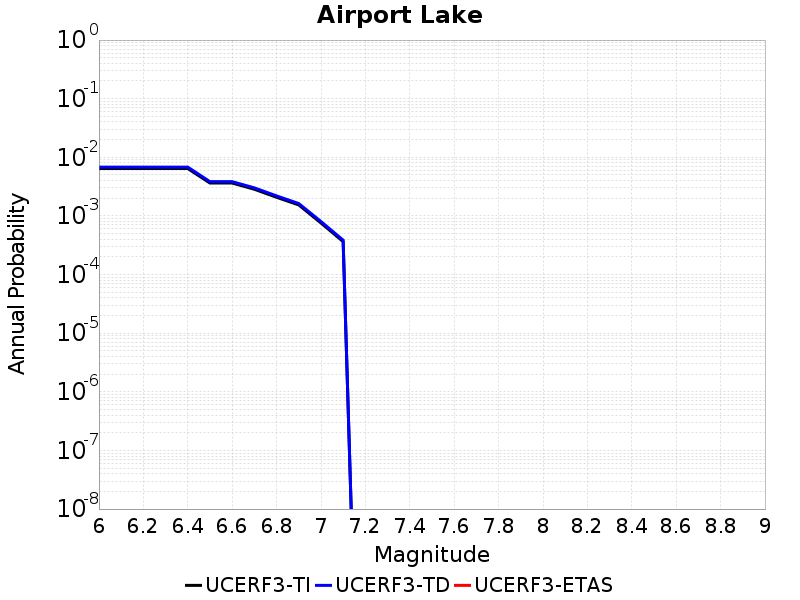 |
|-----|

| Magnitude | UCERF3-TI Prob | UCERF3-TD Prob | UCERF3-ETAS Prob |
|-----|-----|-----|-----|
| 6.0 | 0.0064425888 | 0.006812736 | 0.0 |
| 6.1 | 0.0064425888 | 0.006812736 | 0.0 |
| 6.2 | 0.0064425888 | 0.006812736 | 0.0 |
| 6.3 | 0.0064425888 | 0.006812736 | 0.0 |
| 6.4 | 0.0064425888 | 0.006812736 | 0.0 |
| 6.5 | 0.003641826 | 0.0038442856 | 0.0 |
| 6.6 | 0.003641826 | 0.0038442856 | 0.0 |
| 6.7 | 0.0028538927 | 0.003013194 | 0.0 |
| 6.8 | 0.0020823893 | 0.0021980556 | 0.0 |
| 6.9 | 0.001541707 | 0.0016275172 | 0.0 |
| 7.0 | 7.594696E-4 | 8.032728E-4 | 0.0 |
| 7.1 | 3.6493264E-4 | 3.8635108E-4 | 0.0 |

## Almanor 2011 CFM
*[(top)](#table-of-contents)*

|  |
|-----|

| Magnitude | UCERF3-TI Prob | UCERF3-TD Prob | UCERF3-ETAS Prob |
|-----|-----|-----|-----|
| 6.0 | 0.031571172 | 0.04244403 | 0.0 |
| 6.1 | 0.022894967 | 0.030653518 | 0.0 |
| 6.2 | 0.022894967 | 0.030653518 | 0.0 |
| 6.3 | 0.015287281 | 0.020393852 | 0.0 |
| 6.4 | 0.010646289 | 0.014197788 | 0.0 |
| 6.5 | 0.008702018 | 0.011610945 | 0.0 |
| 6.6 | 0.0076644225 | 0.010231413 | 0.0 |
| 6.7 | 5.1910203E-4 | 6.049024E-4 | 0.0 |
| 6.8 | 3.06049E-4 | 3.5671724E-4 | 0.0 |

## Anacapa-Dume alt 1
*[(top)](#table-of-contents)*

| 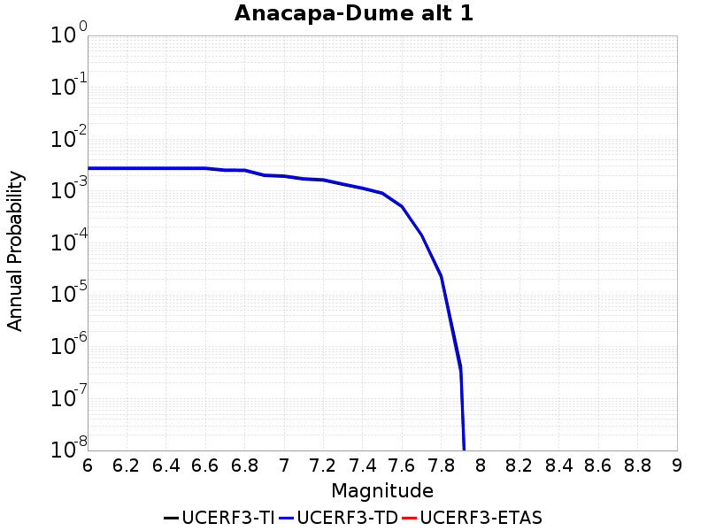 |
|-----|

| Magnitude | UCERF3-TI Prob | UCERF3-TD Prob | UCERF3-ETAS Prob |
|-----|-----|-----|-----|
| 6.0 | 0.002702944 | 0.0027956602 | 0.0 |
| 6.1 | 0.002702944 | 0.0027956602 | 0.0 |
| 6.2 | 0.002702944 | 0.0027956602 | 0.0 |
| 6.3 | 0.002702944 | 0.0027956602 | 0.0 |
| 6.4 | 0.002702944 | 0.0027956602 | 0.0 |
| 6.5 | 0.002702944 | 0.0027956602 | 0.0 |
| 6.6 | 0.002702944 | 0.0027956602 | 0.0 |
| 6.7 | 0.0024854892 | 0.0025715916 | 0.0 |
| 6.8 | 0.002477193 | 0.0025630323 | 0.0 |
| 6.9 | 0.001980861 | 0.0020513488 | 0.0 |
| 7.0 | 0.0019116632 | 0.0019799236 | 0.0 |
| 7.1 | 0.0016888938 | 0.0017502415 | 0.0 |
| 7.2 | 0.001612894 | 0.0016716834 | 0.0 |
| 7.3 | 0.0013350984 | 0.0013796359 | 0.0 |
| 7.4 | 0.0011175112 | 0.0011522857 | 0.0 |
| 7.5 | 8.990063E-4 | 9.2592643E-4 | 0.0 |
| 7.6 | 4.9774844E-4 | 5.122016E-4 | 0.0 |
| 7.7 | 1.4205484E-4 | 1.4172084E-4 | 0.0 |
| 7.8 | 2.348947E-5 | 2.199023E-5 | 0.0 |
| 7.9 | 4.1781706E-7 | 3.2131297E-7 | 0.0 |

## Anaheim
*[(top)](#table-of-contents)*

| 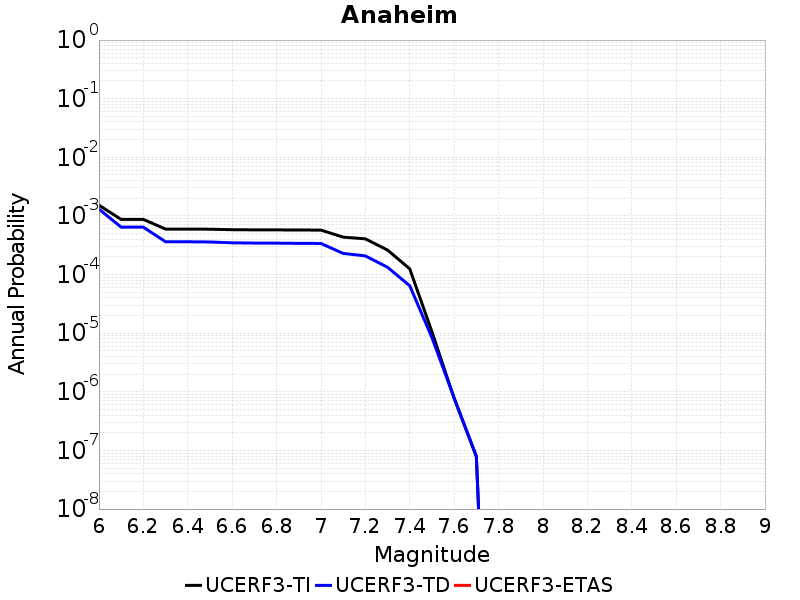 |
|-----|

| Magnitude | UCERF3-TI Prob | UCERF3-TD Prob | UCERF3-ETAS Prob |
|-----|-----|-----|-----|
| 6.0 | 0.0015253217 | 0.0013096005 | 0.0 |
| 6.1 | 8.7255245E-4 | 6.4305577E-4 | 0.0 |
| 6.2 | 8.7255245E-4 | 6.4305577E-4 | 0.0 |
| 6.3 | 5.96957E-4 | 3.6260858E-4 | 0.0 |
| 6.4 | 5.96957E-4 | 3.6260858E-4 | 0.0 |
| 6.5 | 5.938936E-4 | 3.5951496E-4 | 0.0 |
| 6.6 | 5.8243104E-4 | 3.479299E-4 | 0.0 |
| 6.7 | 5.7892315E-4 | 3.4439343E-4 | 0.0 |
| 6.8 | 5.77846E-4 | 3.433087E-4 | 0.0 |
| 6.9 | 5.750759E-4 | 3.405223E-4 | 0.0 |
| 7.0 | 5.734383E-4 | 3.39172E-4 | 0.0 |
| 7.1 | 4.3480762E-4 | 2.2942101E-4 | 0.0 |
| 7.2 | 4.066187E-4 | 2.08206E-4 | 0.0 |
| 7.3 | 2.6174777E-4 | 1.332E-4 | 0.0 |
| 7.4 | 1.2526344E-4 | 6.442585E-5 | 0.0 |
| 7.5 | 1.0573345E-5 | 8.407093E-6 | 0.0 |
| 7.6 | 7.759697E-7 | 7.869531E-7 | 0.0 |
| 7.7 | 7.8754645E-8 | 7.999483E-8 | 0.0 |

## Antelope Valley 2011
*[(top)](#table-of-contents)*

|  |
|-----|

| Magnitude | UCERF3-TI Prob | UCERF3-TD Prob | UCERF3-ETAS Prob |
|-----|-----|-----|-----|
| 6.0 | 0.016377583 | 0.019067846 | 0.0 |
| 6.1 | 0.016377583 | 0.019067846 | 0.0 |
| 6.2 | 0.016377583 | 0.019067846 | 0.0 |
| 6.3 | 0.016377583 | 0.019067846 | 0.0 |
| 6.4 | 0.016377583 | 0.019067846 | 0.0 |
| 6.5 | 0.009365888 | 0.010862338 | 0.0 |
| 6.6 | 0.009365888 | 0.010862338 | 0.0 |
| 6.7 | 0.007054463 | 0.008182052 | 0.0 |
| 6.8 | 0.005135455 | 0.005966176 | 0.0 |
| 6.9 | 0.0037878908 | 0.004404156 | 0.0 |

## Ash Hill
*[(top)](#table-of-contents)*

| 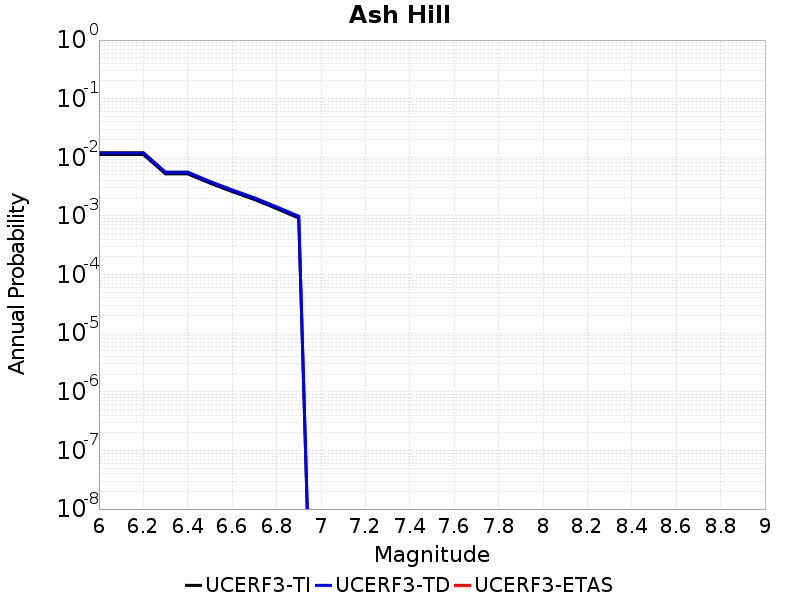 |
|-----|

| Magnitude | UCERF3-TI Prob | UCERF3-TD Prob | UCERF3-ETAS Prob |
|-----|-----|-----|-----|
| 6.0 | 0.011179381 | 0.012028781 | 0.0 |
| 6.1 | 0.011179381 | 0.012028781 | 0.0 |
| 6.2 | 0.011179381 | 0.012028781 | 0.0 |
| 6.3 | 0.005217545 | 0.005589177 | 0.0 |
| 6.4 | 0.005217545 | 0.005589177 | 0.0 |
| 6.5 | 0.0036259557 | 0.003881284 | 0.0 |
| 6.6 | 0.0026013597 | 0.0027846089 | 0.0 |
| 6.7 | 0.0019095168 | 0.002044821 | 0.0 |
| 6.8 | 0.0013348613 | 0.0014306979 | 0.0 |
| 6.9 | 9.223483E-4 | 9.890103E-4 | 0.0 |

## Baker
*[(top)](#table-of-contents)*

|  |
|-----|

| Magnitude | UCERF3-TI Prob | UCERF3-TD Prob | UCERF3-ETAS Prob |
|-----|-----|-----|-----|
| 6.0 | 0.0029674405 | 0.0030395687 | 0.0 |
| 6.1 | 0.0029674405 | 0.0030395687 | 0.0 |
| 6.2 | 0.0029674405 | 0.0030395687 | 0.0 |
| 6.3 | 0.0017201907 | 0.0017635729 | 0.0 |
| 6.4 | 0.0017201907 | 0.0017635729 | 0.0 |
| 6.5 | 0.001450662 | 0.00148865 | 0.0 |
| 6.6 | 0.0012079047 | 0.0012412174 | 0.0 |
| 6.7 | 0.0010623431 | 0.0010930082 | 0.0 |
| 6.8 | 9.57371E-4 | 9.861854E-4 | 0.0 |
| 6.9 | 8.5069967E-4 | 8.776049E-4 | 0.0 |
| 7.0 | 6.289736E-4 | 6.522173E-4 | 0.0 |
| 7.1 | 5.4896745E-4 | 5.710329E-4 | 0.0 |
| 7.2 | 5.251676E-4 | 5.468451E-4 | 0.0 |
| 7.3 | 4.8825322E-4 | 5.0930365E-4 | 0.0 |
| 7.4 | 4.596785E-4 | 4.801017E-4 | 0.0 |
| 7.5 | 4.3259145E-4 | 4.523076E-4 | 0.0 |
| 7.6 | 3.9407116E-4 | 4.126746E-4 | 0.0 |
| 7.7 | 3.405918E-4 | 3.5731978E-4 | 0.0 |
| 7.8 | 1.8045233E-4 | 1.9023403E-4 | 0.0 |
| 7.9 | 1.3353102E-6 | 1.3923685E-6 | 0.0 |

## Bartlett Springs 2011 CFM
*[(top)](#table-of-contents)*

|  |
|-----|

| Magnitude | UCERF3-TI Prob | UCERF3-TD Prob | UCERF3-ETAS Prob |
|-----|-----|-----|-----|
| 6.0 | 0.031998757 | 0.041082148 | 0.1 |
| 6.1 | 0.031973712 | 0.04105096 | 0.1 |
| 6.2 | 0.03195787 | 0.0410313 | 0.1 |
| 6.3 | 0.031930014 | 0.040996294 | 0.1 |
| 6.4 | 0.026858058 | 0.034393933 | 0.1 |
| 6.5 | 0.026794989 | 0.034314882 | 0.1 |
| 6.6 | 0.025795965 | 0.033006534 | 0.0 |
| 6.7 | 0.025208864 | 0.03226393 | 0.0 |
| 6.8 | 0.023553653 | 0.030108295 | 0.0 |
| 6.9 | 0.021390721 | 0.02731722 | 0.0 |
| 7.0 | 0.018568378 | 0.023660883 | 0.0 |
| 7.1 | 0.017270854 | 0.021973776 | 0.0 |
| 7.2 | 0.014822568 | 0.018768644 | 0.0 |
| 7.3 | 0.01366893 | 0.017245917 | 0.0 |
| 7.4 | 0.012310251 | 0.015483573 | 0.0 |
| 7.5 | 0.011305175 | 0.014181473 | 0.0 |
| 7.6 | 0.0072241887 | 0.009000417 | 0.0 |
| 7.7 | 0.0022130446 | 0.00268387 | 0.0 |
| 7.8 | 3.2059604E-4 | 3.671226E-4 | 0.0 |

## Battle Creek 2011 CFM
*[(top)](#table-of-contents)*

| 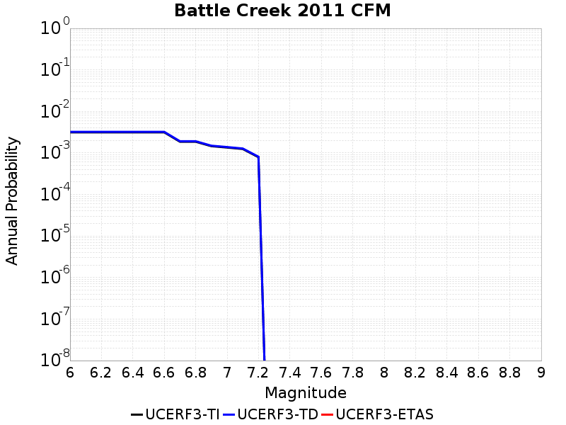 |
|-----|

| Magnitude | UCERF3-TI Prob | UCERF3-TD Prob | UCERF3-ETAS Prob |
|-----|-----|-----|-----|
| 6.0 | 0.0031370334 | 0.003223969 | 0.0 |
| 6.1 | 0.0031370334 | 0.003223969 | 0.0 |
| 6.2 | 0.0031370334 | 0.003223969 | 0.0 |
| 6.3 | 0.0031370334 | 0.003223969 | 0.0 |
| 6.4 | 0.0031370334 | 0.003223969 | 0.0 |
| 6.5 | 0.0031370334 | 0.003223969 | 0.0 |
| 6.6 | 0.0031370334 | 0.003223969 | 0.0 |
| 6.7 | 0.0018646746 | 0.0019157592 | 0.0 |
| 6.8 | 0.0018646746 | 0.0019157592 | 0.0 |
| 6.9 | 0.0014562025 | 0.0014959867 | 0.0 |
| 7.0 | 0.0013506714 | 0.0013876158 | 0.0 |
| 7.1 | 0.0012455335 | 0.0012796684 | 0.0 |
| 7.2 | 7.8970374E-4 | 8.1138476E-4 | 0.0 |

## Bear River fault zone
*[(top)](#table-of-contents)*

|  |
|-----|

| Magnitude | UCERF3-TI Prob | UCERF3-TD Prob | UCERF3-ETAS Prob |
|-----|-----|-----|-----|
| 6.0 | 0.012328116 | 0.013970024 | 0.1 |
| 6.1 | 0.012328116 | 0.013970024 | 0.1 |
| 6.2 | 0.008300122 | 0.009370045 | 0.1 |
| 6.3 | 0.008300122 | 0.009370045 | 0.1 |
| 6.4 | 0.0067744725 | 0.0076530976 | 0.0 |
| 6.5 | 0.0064955144 | 0.0073440894 | 0.0 |
| 6.6 | 0.006067064 | 0.006870217 | 0.0 |
| 6.7 | 0.0055507803 | 0.0063004866 | 0.0 |
| 6.8 | 0.004765337 | 0.005435654 | 0.0 |
| 6.9 | 0.004001915 | 0.00459875 | 0.0 |
| 7.0 | 0.0029861939 | 0.0034860587 | 0.0 |
| 7.1 | 0.002900493 | 0.0033866316 | 0.0 |
| 7.2 | 0.0020908823 | 0.0024323578 | 0.0 |
| 7.3 | 0.0010938413 | 0.0012702446 | 0.0 |

## Bennett Valley 2011 CFM
*[(top)](#table-of-contents)*

| 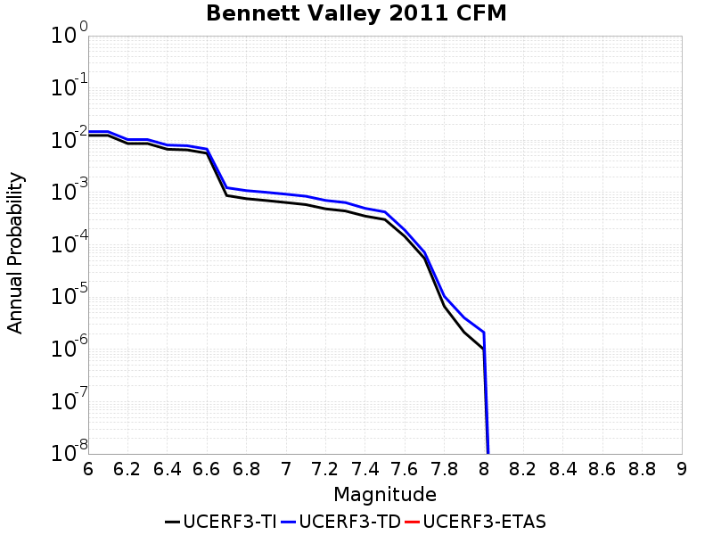 |
|-----|

| Magnitude | UCERF3-TI Prob | UCERF3-TD Prob | UCERF3-ETAS Prob |
|-----|-----|-----|-----|
| 6.0 | 0.012390262 | 0.014620379 | 0.0 |
| 6.1 | 0.012390262 | 0.014620379 | 0.0 |
| 6.2 | 0.008653872 | 0.010302049 | 0.0 |
| 6.3 | 0.008653872 | 0.010302049 | 0.0 |
| 6.4 | 0.0067301663 | 0.008088393 | 0.0 |
| 6.5 | 0.006543907 | 0.0078646755 | 0.0 |
| 6.6 | 0.005643701 | 0.006779746 | 0.0 |
| 6.7 | 8.76385E-4 | 0.0012353408 | 0.0 |
| 6.8 | 7.620303E-4 | 0.0010875899 | 0.0 |
| 6.9 | 7.037667E-4 | 0.0010105721 | 0.0 |
| 7.0 | 6.440897E-4 | 9.293724E-4 | 0.0 |
| 7.1 | 5.875135E-4 | 8.497736E-4 | 0.0 |
| 7.2 | 4.878418E-4 | 7.066874E-4 | 0.0 |
| 7.3 | 4.436259E-4 | 6.429485E-4 | 0.0 |
| 7.4 | 3.5409955E-4 | 4.9843686E-4 | 0.0 |
| 7.5 | 3.0399146E-4 | 4.2532684E-4 | 0.0 |
| 7.6 | 1.447063E-4 | 1.9140042E-4 | 0.0 |
| 7.7 | 5.4947162E-5 | 7.157088E-5 | 0.0 |
| 7.8 | 6.6340967E-6 | 1.0346938E-5 | 0.0 |
| 7.9 | 2.1267379E-6 | 4.0290524E-6 | 0.0 |
| 8.0 | 9.979741E-7 | 2.114729E-6 | 0.0 |

## Bicycle Lake
*[(top)](#table-of-contents)*

| 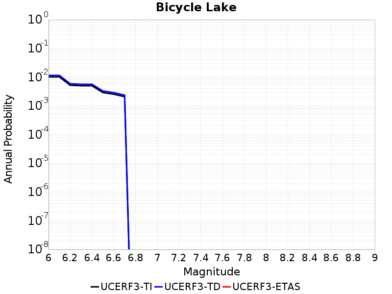 |
|-----|

| Magnitude | UCERF3-TI Prob | UCERF3-TD Prob | UCERF3-ETAS Prob |
|-----|-----|-----|-----|
| 6.0 | 0.01018633 | 0.011463366 | 0.0 |
| 6.1 | 0.01018633 | 0.011463366 | 0.0 |
| 6.2 | 0.0052028033 | 0.005853805 | 0.0 |
| 6.3 | 0.0049911533 | 0.0056168474 | 0.0 |
| 6.4 | 0.0049911533 | 0.0056168474 | 0.0 |
| 6.5 | 0.0028957394 | 0.003272821 | 0.0 |
| 6.6 | 0.002540112 | 0.0028715462 | 0.0 |
| 6.7 | 0.0020803404 | 0.0023531066 | 0.0 |

## Big Lagoon - Bald Mtn 2011 CFM
*[(top)](#table-of-contents)*

| 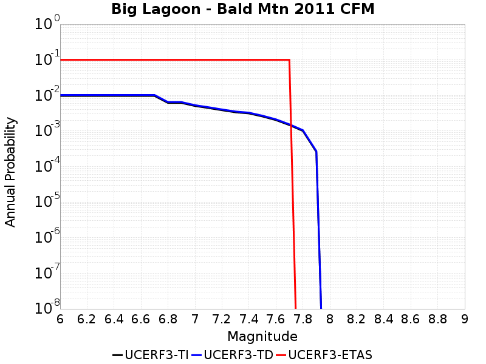 |
|-----|

| Magnitude | UCERF3-TI Prob | UCERF3-TD Prob | UCERF3-ETAS Prob |
|-----|-----|-----|-----|
| 6.0 | 0.009709897 | 0.010301657 | 0.1 |
| 6.1 | 0.009709897 | 0.010301657 | 0.1 |
| 6.2 | 0.009709897 | 0.010301657 | 0.1 |
| 6.3 | 0.009709897 | 0.010301657 | 0.1 |
| 6.4 | 0.009709897 | 0.010301657 | 0.1 |
| 6.5 | 0.009709897 | 0.010301657 | 0.1 |
| 6.6 | 0.009709897 | 0.010301657 | 0.1 |
| 6.7 | 0.009709897 | 0.010301657 | 0.1 |
| 6.8 | 0.006164385 | 0.0064978427 | 0.1 |
| 6.9 | 0.006164385 | 0.0064978427 | 0.1 |
| 7.0 | 0.005058831 | 0.005323827 | 0.1 |
| 7.1 | 0.0044375416 | 0.004666842 | 0.1 |
| 7.2 | 0.0038428132 | 0.0040393765 | 0.1 |
| 7.3 | 0.0033671674 | 0.0035361343 | 0.1 |
| 7.4 | 0.0031237002 | 0.0032795728 | 0.1 |
| 7.5 | 0.0025687215 | 0.0026959633 | 0.1 |
| 7.6 | 0.0020319829 | 0.0021302155 | 0.1 |
| 7.7 | 0.00147086 | 0.0015410855 | 0.1 |
| 7.8 | 0.0010072939 | 0.0010560644 | 0.0 |
| 7.9 | 2.5870028E-4 | 2.7213202E-4 | 0.0 |

## Big Pine (Central)
*[(top)](#table-of-contents)*

|  |
|-----|

| Magnitude | UCERF3-TI Prob | UCERF3-TD Prob | UCERF3-ETAS Prob |
|-----|-----|-----|-----|
| 6.0 | 0.006608314 | 0.0073940447 | 0.0 |
| 6.1 | 0.0043435963 | 0.004936725 | 0.0 |
| 6.2 | 0.003606286 | 0.004135403 | 0.0 |
| 6.3 | 0.0014226272 | 0.0017720442 | 0.0 |
| 6.4 | 0.0014149669 | 0.001763869 | 0.0 |
| 6.5 | 0.0014063664 | 0.0017546797 | 0.0 |
| 6.6 | 0.0013917267 | 0.0017390749 | 0.0 |
| 6.7 | 0.0013769877 | 0.0017234714 | 0.0 |
| 6.8 | 0.0011361669 | 0.0014752812 | 0.0 |
| 6.9 | 7.5169955E-4 | 0.0010663152 | 0.0 |
| 7.0 | 5.2547833E-4 | 7.997357E-4 | 0.0 |
| 7.1 | 4.6673836E-4 | 7.352564E-4 | 0.0 |
| 7.2 | 2.7208295E-4 | 5.175388E-4 | 0.0 |
| 7.3 | 2.2968883E-4 | 4.713565E-4 | 0.0 |
| 7.4 | 1.8850817E-4 | 4.2678535E-4 | 0.0 |
| 7.5 | 1.778184E-4 | 4.1394215E-4 | 0.0 |
| 7.6 | 1.6397667E-4 | 3.946484E-4 | 0.0 |
| 7.7 | 9.377503E-5 | 2.586417E-4 | 0.0 |
| 7.8 | 2.5687666E-5 | 6.11183E-5 | 0.0 |
| 7.9 | 1.920481E-6 | 2.1141536E-6 | 0.0 |

## Big Pine (East)
*[(top)](#table-of-contents)*

| 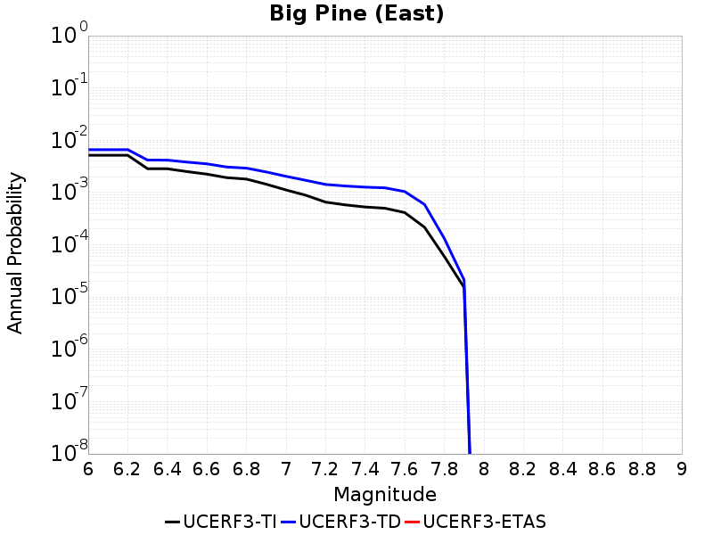 |
|-----|

| Magnitude | UCERF3-TI Prob | UCERF3-TD Prob | UCERF3-ETAS Prob |
|-----|-----|-----|-----|
| 6.0 | 0.0051611643 | 0.006620253 | 0.0 |
| 6.1 | 0.0051611643 | 0.006620253 | 0.0 |
| 6.2 | 0.0051611643 | 0.006620253 | 0.0 |
| 6.3 | 0.0028551589 | 0.0041784695 | 0.0 |
| 6.4 | 0.0028475097 | 0.004170314 | 0.0 |
| 6.5 | 0.0025153751 | 0.0038197078 | 0.0 |
| 6.6 | 0.0022488134 | 0.0035390698 | 0.0 |
| 6.7 | 0.0019270873 | 0.0030807122 | 0.0 |
| 6.8 | 0.0018074579 | 0.0029293783 | 0.0 |
| 6.9 | 0.0014436257 | 0.0024764063 | 0.0 |
| 7.0 | 0.0011197845 | 0.0020427795 | 0.0 |
| 7.1 | 8.87599E-4 | 0.0017127488 | 0.0 |
| 7.2 | 6.551642E-4 | 0.0014278922 | 0.0 |
| 7.3 | 5.802127E-4 | 0.0013335736 | 0.0 |
| 7.4 | 5.288041E-4 | 0.0012685689 | 0.0 |
| 7.5 | 5.007165E-4 | 0.0012294585 | 0.0 |
| 7.6 | 4.1366243E-4 | 0.0010439792 | 0.0 |
| 7.7 | 2.1681961E-4 | 5.9119944E-4 | 0.0 |
| 7.8 | 5.9829777E-5 | 1.3233261E-4 | 0.0 |
| 7.9 | 1.5252632E-5 | 2.1243073E-5 | 0.0 |

## Big Pine (West)
*[(top)](#table-of-contents)*

|  |
|-----|

| Magnitude | UCERF3-TI Prob | UCERF3-TD Prob | UCERF3-ETAS Prob |
|-----|-----|-----|-----|
| 6.0 | 3.5635266E-4 | 3.5900204E-4 | 0.0 |
| 6.1 | 3.5635266E-4 | 3.5900204E-4 | 0.0 |
| 6.2 | 3.5635266E-4 | 3.5900204E-4 | 0.0 |
| 6.3 | 2.2056856E-4 | 2.2257889E-4 | 0.0 |
| 6.4 | 2.2056856E-4 | 2.2257889E-4 | 0.0 |
| 6.5 | 1.6454936E-4 | 1.6633647E-4 | 0.0 |
| 6.6 | 1.6454936E-4 | 1.6633647E-4 | 0.0 |
| 6.7 | 1.6454936E-4 | 1.6633647E-4 | 0.0 |
| 6.8 | 1.6454936E-4 | 1.6633647E-4 | 0.0 |
| 6.9 | 1.5862122E-4 | 1.6036486E-4 | 0.0 |
| 7.0 | 1.2351504E-4 | 1.2491558E-4 | 0.0 |
| 7.1 | 8.5159016E-5 | 8.61562E-5 | 0.0 |
| 7.2 | 6.0127335E-5 | 6.0816335E-5 | 0.0 |
| 7.3 | 4.0582654E-5 | 4.1019677E-5 | 0.0 |
| 7.4 | 2.405375E-5 | 2.4271985E-5 | 0.0 |
| 7.5 | 1.2230132E-5 | 1.2317464E-5 | 0.0 |
| 7.6 | 8.713663E-6 | 8.774228E-6 | 0.0 |
| 7.7 | 3.8644166E-6 | 3.8892063E-6 | 0.0 |
| 7.8 | 6.360267E-7 | 6.402262E-7 | 0.0 |

## Blackwater
*[(top)](#table-of-contents)*

| 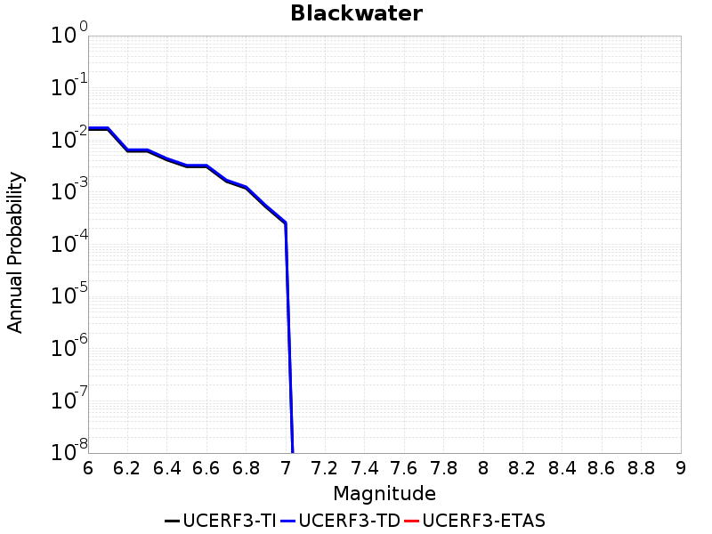 |
|-----|

| Magnitude | UCERF3-TI Prob | UCERF3-TD Prob | UCERF3-ETAS Prob |
|-----|-----|-----|-----|
| 6.0 | 0.015895851 | 0.017121818 | 0.0 |
| 6.1 | 0.015895851 | 0.017121818 | 0.0 |
| 6.2 | 0.006090366 | 0.006520712 | 0.0 |
| 6.3 | 0.006090366 | 0.006520712 | 0.0 |
| 6.4 | 0.0041288356 | 0.0044122813 | 0.0 |
| 6.5 | 0.0030650778 | 0.0032725176 | 0.0 |
| 6.6 | 0.0030650778 | 0.0032725176 | 0.0 |
| 6.7 | 0.0016013865 | 0.0017096669 | 0.0 |
| 6.8 | 0.001184915 | 0.0012656776 | 0.0 |
| 6.9 | 5.191674E-4 | 5.553773E-4 | 0.0 |
| 7.0 | 2.4722028E-4 | 2.6463892E-4 | 0.0 |

## Blue Cut
*[(top)](#table-of-contents)*

|  |
|-----|

| Magnitude | UCERF3-TI Prob | UCERF3-TD Prob | UCERF3-ETAS Prob |
|-----|-----|-----|-----|
| 6.0 | 0.011015458 | 0.011782538 | 0.1 |
| 6.1 | 0.011015458 | 0.011782538 | 0.1 |
| 6.2 | 0.011015458 | 0.011782538 | 0.1 |
| 6.3 | 0.0060417196 | 0.006422299 | 0.1 |
| 6.4 | 0.0060417196 | 0.006422299 | 0.1 |
| 6.5 | 0.0046494175 | 0.004932994 | 0.1 |
| 6.6 | 0.0038253788 | 0.0040549305 | 0.1 |
| 6.7 | 0.0032701963 | 0.0034651938 | 0.1 |
| 6.8 | 0.002877895 | 0.0030493408 | 0.1 |
| 6.9 | 0.0024899957 | 0.0026386904 | 0.1 |
| 7.0 | 0.0020241356 | 0.002146056 | 0.1 |
| 7.1 | 0.001478599 | 0.0015689074 | 0.0 |

## Brawley (Seismic Zone) alt 1
*[(top)](#table-of-contents)*

|  |
|-----|

| Magnitude | UCERF3-TI Prob | UCERF3-TD Prob | UCERF3-ETAS Prob |
|-----|-----|-----|-----|
| 6.0 | 0.11088423 | 0.21067202 | 0.0 |
| 6.1 | 0.11088423 | 0.21067202 | 0.0 |
| 6.2 | 0.10837428 | 0.20714828 | 0.0 |
| 6.3 | 0.107082725 | 0.20504212 | 0.0 |
| 6.4 | 0.093263686 | 0.18180552 | 0.0 |
| 6.5 | 0.086755216 | 0.17168455 | 0.0 |
| 6.6 | 0.07970774 | 0.16118577 | 0.0 |
| 6.7 | 0.07174956 | 0.14942598 | 0.0 |
| 6.8 | 0.06264243 | 0.13622437 | 0.0 |
| 6.9 | 0.05173543 | 0.12330379 | 0.0 |
| 7.0 | 0.039192066 | 0.106029525 | 0.0 |
| 7.1 | 0.038443442 | 0.104609124 | 0.0 |
| 7.2 | 0.034803 | 0.096313715 | 0.0 |
| 7.3 | 0.03284188 | 0.09025036 | 0.0 |
| 7.4 | 0.023241805 | 0.06142933 | 0.0 |
| 7.5 | 0.01775316 | 0.046270162 | 0.0 |
| 7.6 | 0.013464959 | 0.03514772 | 0.0 |
| 7.7 | 0.008982267 | 0.024693815 | 0.0 |
| 7.8 | 0.0067227143 | 0.019909872 | 0.0 |
| 7.9 | 0.005308505 | 0.014561535 | 0.0 |
| 8.0 | 0.0045035016 | 0.011838445 | 0.0 |
| 8.1 | 0.0020520731 | 0.0038291025 | 0.0 |
| 8.2 | 8.9191867E-4 | 0.0011966742 | 0.0 |
| 8.3 | 1.5834332E-5 | 8.66161E-6 | 0.0 |

## Breckenridge 2011
*[(top)](#table-of-contents)*

|  |
|-----|

| Magnitude | UCERF3-TI Prob | UCERF3-TD Prob | UCERF3-ETAS Prob |
|-----|-----|-----|-----|
| 6.0 | 5.9937296E-4 | 3.5137526E-4 | 0.0 |
| 6.1 | 5.9937296E-4 | 3.5137526E-4 | 0.0 |
| 6.2 | 5.9937296E-4 | 3.5137526E-4 | 0.0 |
| 6.3 | 5.55348E-4 | 3.0695755E-4 | 0.0 |
| 6.4 | 5.55348E-4 | 3.0695755E-4 | 0.0 |
| 6.5 | 5.55348E-4 | 3.0695755E-4 | 0.0 |
| 6.6 | 5.55348E-4 | 3.0695755E-4 | 0.0 |
| 6.7 | 4.9150345E-4 | 2.5833983E-4 | 0.0 |
| 6.8 | 4.4636242E-4 | 2.2485357E-4 | 0.0 |
| 6.9 | 4.035606E-4 | 2.0034995E-4 | 0.0 |
| 7.0 | 3.55651E-4 | 1.7454539E-4 | 0.0 |
| 7.1 | 2.9182562E-4 | 1.5076599E-4 | 0.0 |
| 7.2 | 2.004543E-4 | 1.0674767E-4 | 0.0 |
| 7.3 | 1.3776887E-4 | 8.591782E-5 | 0.0 |
| 7.4 | 9.350559E-5 | 6.6373344E-5 | 0.0 |
| 7.5 | 7.0692695E-5 | 4.8952526E-5 | 0.0 |
| 7.6 | 1.3421517E-5 | 9.050904E-6 | 0.0 |

## Bullion Mountains
*[(top)](#table-of-contents)*

|  |
|-----|

| Magnitude | UCERF3-TI Prob | UCERF3-TD Prob | UCERF3-ETAS Prob |
|-----|-----|-----|-----|
| 6.0 | 0.008531413 | 0.007631964 | 0.0 |
| 6.1 | 0.008531413 | 0.007631964 | 0.0 |
| 6.2 | 0.008531413 | 0.007631964 | 0.0 |
| 6.3 | 0.0062661595 | 0.005129003 | 0.0 |
| 6.4 | 0.0062661595 | 0.005129003 | 0.0 |
| 6.5 | 0.005331118 | 0.004099936 | 0.0 |
| 6.6 | 0.00499945 | 0.0037354343 | 0.0 |
| 6.7 | 0.004479495 | 0.0031882727 | 0.0 |
| 6.8 | 0.0027033675 | 0.0013348012 | 0.0 |
| 6.9 | 0.0023610266 | 0.0012210419 | 0.0 |
| 7.0 | 0.0017889962 | 8.794444E-4 | 0.0 |

## Burnt Mtn
*[(top)](#table-of-contents)*

| 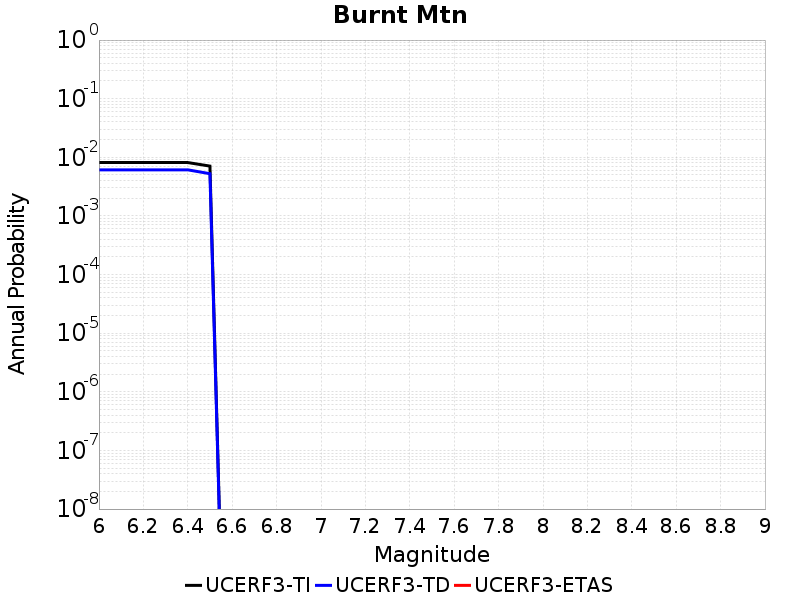 |
|-----|

| Magnitude | UCERF3-TI Prob | UCERF3-TD Prob | UCERF3-ETAS Prob |
|-----|-----|-----|-----|
| 6.0 | 0.008144741 | 0.006118891 | 0.0 |
| 6.1 | 0.008144741 | 0.006118891 | 0.0 |
| 6.2 | 0.008144741 | 0.006118891 | 0.0 |
| 6.3 | 0.008144741 | 0.006118891 | 0.0 |
| 6.4 | 0.008144741 | 0.006118891 | 0.0 |
| 6.5 | 0.0070811296 | 0.005253069 | 0.0 |

## Butano 2011 CFM
*[(top)](#table-of-contents)*

|  |
|-----|

| Magnitude | UCERF3-TI Prob | UCERF3-TD Prob | UCERF3-ETAS Prob |
|-----|-----|-----|-----|
| 6.0 | 0.004976464 | 0.0032234902 | 0.0 |
| 6.1 | 0.004976464 | 0.0032234902 | 0.0 |
| 6.2 | 0.0043551093 | 0.0025749684 | 0.0 |
| 6.3 | 0.0043551093 | 0.0025749684 | 0.0 |
| 6.4 | 0.0040451903 | 0.0022512947 | 0.0 |
| 6.5 | 0.0039959005 | 0.0021990354 | 0.0 |
| 6.6 | 0.003918452 | 0.002118364 | 0.0 |
| 6.7 | 0.003381786 | 0.0015665872 | 0.0 |
| 6.8 | 0.0032761577 | 0.0014555828 | 0.0 |
| 6.9 | 0.0031760489 | 0.0013548874 | 0.0 |
| 7.0 | 0.0029001853 | 0.0011037741 | 0.0 |
| 7.1 | 0.0020217493 | 8.2290615E-4 | 0.0 |
| 7.2 | 0.0019307317 | 7.6135114E-4 | 0.0 |
| 7.3 | 0.0018390282 | 7.137877E-4 | 0.0 |
| 7.4 | 0.0017574639 | 6.815478E-4 | 0.0 |
| 7.5 | 0.001589997 | 6.2495965E-4 | 0.0 |
| 7.6 | 0.0011566412 | 4.5560274E-4 | 0.0 |
| 7.7 | 9.137166E-4 | 3.56277E-4 | 0.0 |
| 7.8 | 5.9877743E-4 | 3.182924E-4 | 0.0 |
| 7.9 | 3.1904536E-4 | 2.886586E-4 | 0.0 |
| 8.0 | 2.4270554E-4 | 2.687005E-4 | 0.0 |
| 8.1 | 1.4830762E-4 | 1.5849173E-4 | 0.0 |
| 8.2 | 2.9145367E-5 | 2.1464322E-5 | 0.0 |
| 8.3 | 5.4115542E-8 | 2.9617862E-8 | 0.0 |

## Cady
*[(top)](#table-of-contents)*

|  |
|-----|

| Magnitude | UCERF3-TI Prob | UCERF3-TD Prob | UCERF3-ETAS Prob |
|-----|-----|-----|-----|
| 6.0 | 0.010326075 | 0.011339046 | 0.0 |
| 6.1 | 0.010326075 | 0.011339046 | 0.0 |
| 6.2 | 0.010326075 | 0.011339046 | 0.0 |
| 6.3 | 0.0057841022 | 0.0063305898 | 0.0 |
| 6.4 | 0.0057841022 | 0.0063305898 | 0.0 |
| 6.5 | 0.0031794512 | 0.0034733072 | 0.0 |
| 6.6 | 0.0030307577 | 0.0033141 | 0.0 |
| 6.7 | 0.0025454918 | 0.0027813287 | 0.0 |
| 6.8 | 9.2776294E-4 | 0.0010109205 | 0.0 |
| 6.9 | 3.9363815E-4 | 4.3242372E-4 | 0.0 |
| 7.0 | 3.577705E-4 | 3.930706E-4 | 0.0 |

## Calaveras (Central) 2011 CFM
*[(top)](#table-of-contents)*

| 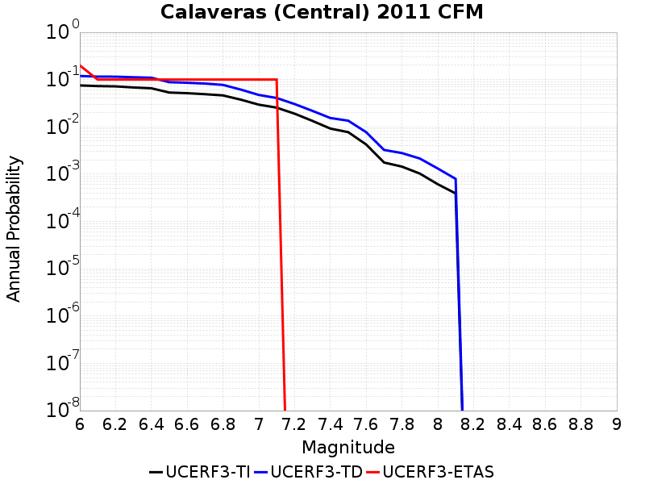 |
|-----|

| Magnitude | UCERF3-TI Prob | UCERF3-TD Prob | UCERF3-ETAS Prob |
|-----|-----|-----|-----|
| 6.0 | 0.07534136 | 0.119294874 | 0.2 |
| 6.1 | 0.07297657 | 0.11557423 | 0.1 |
| 6.2 | 0.07190444 | 0.11524175 | 0.1 |
| 6.3 | 0.0681982 | 0.11219621 | 0.1 |
| 6.4 | 0.06555412 | 0.10952238 | 0.1 |
| 6.5 | 0.053311124 | 0.08826637 | 0.1 |
| 6.6 | 0.05162293 | 0.0858578 | 0.1 |
| 6.7 | 0.049159497 | 0.08236976 | 0.1 |
| 6.8 | 0.046324775 | 0.07730161 | 0.1 |
| 6.9 | 0.037642512 | 0.061468694 | 0.1 |
| 7.0 | 0.02953797 | 0.04740067 | 0.1 |
| 7.1 | 0.0255274 | 0.040849864 | 0.1 |
| 7.2 | 0.01905776 | 0.03044263 | 0.0 |
| 7.3 | 0.013396223 | 0.021826766 | 0.0 |
| 7.4 | 0.009217911 | 0.0154140955 | 0.0 |
| 7.5 | 0.0077359667 | 0.013524212 | 0.0 |
| 7.6 | 0.004252361 | 0.0077402354 | 0.0 |
| 7.7 | 0.0017651088 | 0.003256662 | 0.0 |
| 7.8 | 0.0014454306 | 0.0027952236 | 0.0 |
| 7.9 | 0.0010292825 | 0.0021427097 | 0.0 |
| 8.0 | 6.1381224E-4 | 0.0013200407 | 0.0 |
| 8.1 | 3.9185135E-4 | 7.962337E-4 | 0.0 |

## Calaveras (No) 2011 CFM
*[(top)](#table-of-contents)*

| 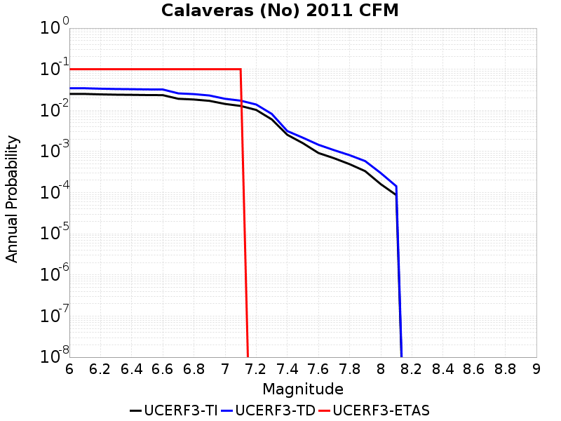 |
|-----|

| Magnitude | UCERF3-TI Prob | UCERF3-TD Prob | UCERF3-ETAS Prob |
|-----|-----|-----|-----|
| 6.0 | 0.02508881 | 0.034495004 | 0.1 |
| 6.1 | 0.02508881 | 0.034495004 | 0.1 |
| 6.2 | 0.024502134 | 0.033659488 | 0.1 |
| 6.3 | 0.024082264 | 0.033073913 | 0.1 |
| 6.4 | 0.02385771 | 0.032753944 | 0.1 |
| 6.5 | 0.023574775 | 0.032353267 | 0.1 |
| 6.6 | 0.023457756 | 0.03217935 | 0.1 |
| 6.7 | 0.019126613 | 0.02588249 | 0.1 |
| 6.8 | 0.018365284 | 0.024861086 | 0.1 |
| 6.9 | 0.017044188 | 0.022996463 | 0.1 |
| 7.0 | 0.01434065 | 0.019126574 | 0.1 |
| 7.1 | 0.0128157 | 0.01722449 | 0.1 |
| 7.2 | 0.01025145 | 0.013885421 | 0.0 |
| 7.3 | 0.0060364045 | 0.0082128 | 0.0 |
| 7.4 | 0.0025458818 | 0.0031392826 | 0.0 |
| 7.5 | 0.0015938957 | 0.0021638998 | 0.0 |
| 7.6 | 9.205016E-4 | 0.0014580957 | 0.0 |
| 7.7 | 6.8715087E-4 | 0.0010798577 | 0.0 |
| 7.8 | 4.926005E-4 | 8.146749E-4 | 0.0 |
| 7.9 | 3.3327343E-4 | 5.851827E-4 | 0.0 |
| 8.0 | 1.6111376E-4 | 2.9971087E-4 | 0.0 |
| 8.1 | 8.726824E-5 | 1.431628E-4 | 0.0 |

## Calaveras (So) - Paicines extension 2011 CFM
*[(top)](#table-of-contents)*

|  |
|-----|

| Magnitude | UCERF3-TI Prob | UCERF3-TD Prob | UCERF3-ETAS Prob |
|-----|-----|-----|-----|
| 6.0 | 0.076174594 | 0.13766316 | 0.1 |
| 6.1 | 0.075409345 | 0.1363356 | 0.1 |
| 6.2 | 0.064337276 | 0.11643437 | 0.1 |
| 6.3 | 0.058367174 | 0.10554407 | 0.1 |
| 6.4 | 0.0544031 | 0.098365255 | 0.0 |
| 6.5 | 0.04933773 | 0.08926596 | 0.0 |
| 6.6 | 0.04116161 | 0.07402664 | 0.0 |
| 6.7 | 0.039962657 | 0.07188125 | 0.0 |
| 6.8 | 0.03569247 | 0.063021116 | 0.0 |
| 6.9 | 0.029811295 | 0.0507882 | 0.0 |
| 7.0 | 0.025684336 | 0.043125182 | 0.0 |
| 7.1 | 0.022105146 | 0.036138177 | 0.0 |
| 7.2 | 0.017841442 | 0.028553555 | 0.0 |
| 7.3 | 0.013325208 | 0.02087604 | 0.0 |
| 7.4 | 0.009349857 | 0.0146875875 | 0.0 |
| 7.5 | 0.008104719 | 0.013305994 | 0.0 |
| 7.6 | 0.0057804612 | 0.009919594 | 0.0 |
| 7.7 | 0.0032371588 | 0.0054055643 | 0.0 |
| 7.8 | 0.0027645302 | 0.004883742 | 0.0 |
| 7.9 | 0.0017534926 | 0.0038092711 | 0.0 |
| 8.0 | 0.0010571606 | 0.002272358 | 0.0 |
| 8.1 | 6.366953E-4 | 0.001226864 | 0.0 |

## Calaveras (So) 2011 CFM
*[(top)](#table-of-contents)*

|  |
|-----|

| Magnitude | UCERF3-TI Prob | UCERF3-TD Prob | UCERF3-ETAS Prob |
|-----|-----|-----|-----|
| 6.0 | 0.079865426 | 0.14351042 | 0.0 |
| 6.1 | 0.06843361 | 0.12317612 | 0.0 |
| 6.2 | 0.058084648 | 0.104193866 | 0.0 |
| 6.3 | 0.044339992 | 0.07854721 | 0.0 |
| 6.4 | 0.04343345 | 0.077164516 | 0.0 |
| 6.5 | 0.042916555 | 0.07634087 | 0.0 |
| 6.6 | 0.04185927 | 0.07463615 | 0.0 |
| 6.7 | 0.040946912 | 0.0730841 | 0.0 |
| 6.8 | 0.036469642 | 0.06397812 | 0.0 |
| 6.9 | 0.02947844 | 0.04989188 | 0.0 |
| 7.0 | 0.025115121 | 0.041929025 | 0.0 |
| 7.1 | 0.022186412 | 0.036910824 | 0.0 |
| 7.2 | 0.016668037 | 0.027599674 | 0.0 |
| 7.3 | 0.012319452 | 0.020294504 | 0.0 |
| 7.4 | 0.008312687 | 0.014079157 | 0.0 |
| 7.5 | 0.007182234 | 0.012768699 | 0.0 |
| 7.6 | 0.004590199 | 0.00849219 | 0.0 |
| 7.7 | 0.0021033096 | 0.0040053623 | 0.0 |
| 7.8 | 0.0017793609 | 0.0035272865 | 0.0 |
| 7.9 | 0.0012901047 | 0.0027332748 | 0.0 |
| 8.0 | 7.944594E-4 | 0.0016973694 | 0.0 |
| 8.1 | 5.271009E-4 | 0.0010563878 | 0.0 |

## Calico-Hidalgo
*[(top)](#table-of-contents)*

| 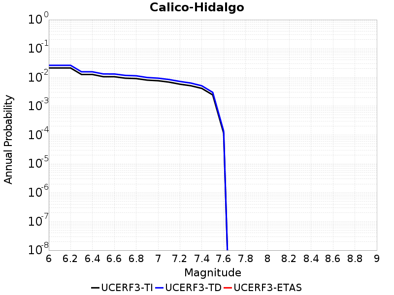 |
|-----|

| Magnitude | UCERF3-TI Prob | UCERF3-TD Prob | UCERF3-ETAS Prob |
|-----|-----|-----|-----|
| 6.0 | 0.02111873 | 0.02610451 | 0.0 |
| 6.1 | 0.02111873 | 0.02610451 | 0.0 |
| 6.2 | 0.02111873 | 0.02610451 | 0.0 |
| 6.3 | 0.01257003 | 0.015557641 | 0.0 |
| 6.4 | 0.01257003 | 0.015557641 | 0.0 |
| 6.5 | 0.010529719 | 0.013104743 | 0.0 |
| 6.6 | 0.010520565 | 0.01309494 | 0.0 |
| 6.7 | 0.009347493 | 0.011676256 | 0.0 |
| 6.8 | 0.009068459 | 0.011317742 | 0.0 |
| 6.9 | 0.008018291 | 0.009870324 | 0.0 |
| 7.0 | 0.0076319184 | 0.009357339 | 0.0 |
| 7.1 | 0.0068324856 | 0.008411932 | 0.0 |
| 7.2 | 0.0057893298 | 0.0072040837 | 0.0 |
| 7.3 | 0.0051047057 | 0.0063291756 | 0.0 |
| 7.4 | 0.0041356985 | 0.0050932984 | 0.0 |
| 7.5 | 0.0024557032 | 0.0030065663 | 0.0 |
| 7.6 | 1.1539775E-4 | 1.3581177E-4 | 0.0 |

## Camp Rock 2011
*[(top)](#table-of-contents)*

| 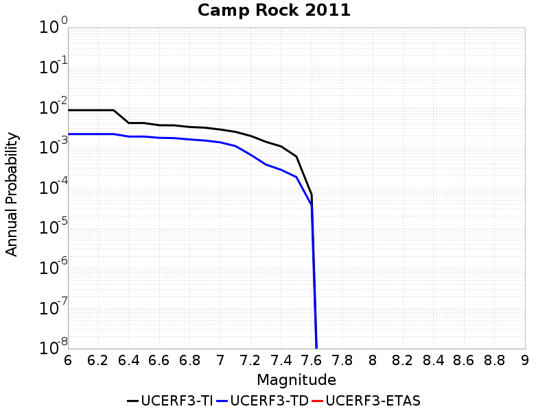 |
|-----|

| Magnitude | UCERF3-TI Prob | UCERF3-TD Prob | UCERF3-ETAS Prob |
|-----|-----|-----|-----|
| 6.0 | 0.008681616 | 0.0022130571 | 0.0 |
| 6.1 | 0.008681616 | 0.0022130571 | 0.0 |
| 6.2 | 0.008681616 | 0.0022130571 | 0.0 |
| 6.3 | 0.008681616 | 0.0022130571 | 0.0 |
| 6.4 | 0.0041566887 | 0.0019174322 | 0.0 |
| 6.5 | 0.0041566887 | 0.0019174322 | 0.0 |
| 6.6 | 0.0036712566 | 0.0017832752 | 0.0 |
| 6.7 | 0.0036392517 | 0.0017509891 | 0.0 |
| 6.8 | 0.0033202237 | 0.0016237622 | 0.0 |
| 6.9 | 0.003184194 | 0.0015275581 | 0.0 |
| 7.0 | 0.0028730053 | 0.0013760214 | 0.0 |
| 7.1 | 0.0025093083 | 0.0011116791 | 0.0 |
| 7.2 | 0.0019903728 | 6.737819E-4 | 0.0 |
| 7.3 | 0.0014165172 | 3.8434597E-4 | 0.0 |
| 7.4 | 0.0010895962 | 2.8426707E-4 | 0.0 |
| 7.5 | 6.093505E-4 | 1.8752349E-4 | 0.0 |
| 7.6 | 6.863536E-5 | 3.6999085E-5 | 0.0 |

## Canada David (Detachment)
*[(top)](#table-of-contents)*

| 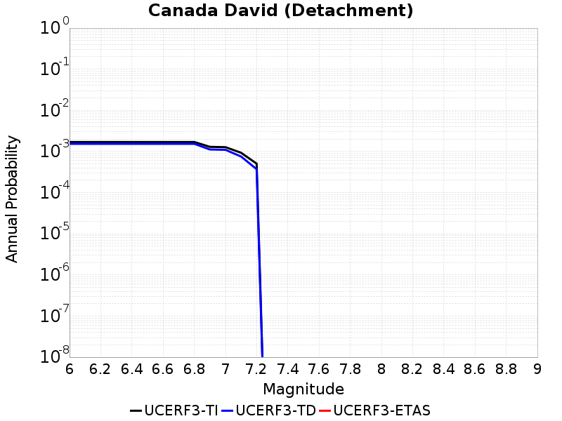 |
|-----|

| Magnitude | UCERF3-TI Prob | UCERF3-TD Prob | UCERF3-ETAS Prob |
|-----|-----|-----|-----|
| 6.0 | 0.001706678 | 0.0015390232 | 0.0 |
| 6.1 | 0.001706678 | 0.0015390232 | 0.0 |
| 6.2 | 0.001706678 | 0.0015390232 | 0.0 |
| 6.3 | 0.001706678 | 0.0015390232 | 0.0 |
| 6.4 | 0.001706678 | 0.0015390232 | 0.0 |
| 6.5 | 0.001706678 | 0.0015390232 | 0.0 |
| 6.6 | 0.001706678 | 0.0015390232 | 0.0 |
| 6.7 | 0.001706678 | 0.0015390232 | 0.0 |
| 6.8 | 0.001706678 | 0.0015390232 | 0.0 |
| 6.9 | 0.0012991455 | 0.0011215593 | 0.0 |
| 7.0 | 0.0012766428 | 0.0010996435 | 0.0 |
| 7.1 | 9.329135E-4 | 7.555899E-4 | 0.0 |
| 7.2 | 5.072095E-4 | 3.7175373E-4 | 0.0 |

## Carlsbad
*[(top)](#table-of-contents)*

| 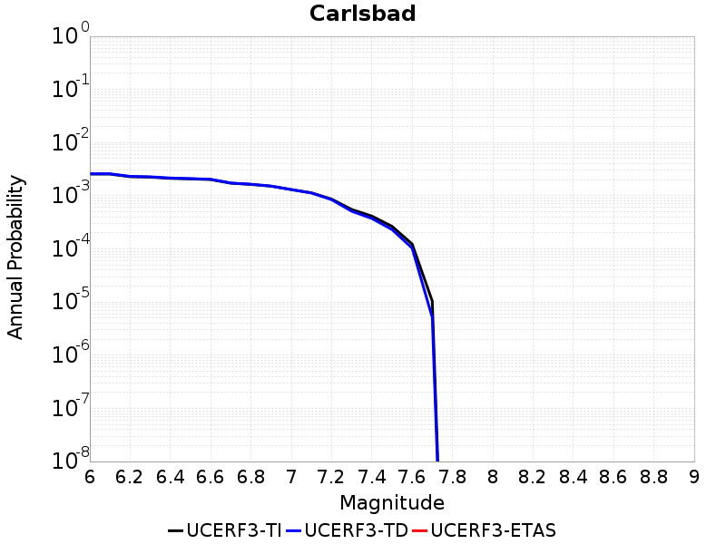 |
|-----|

| Magnitude | UCERF3-TI Prob | UCERF3-TD Prob | UCERF3-ETAS Prob |
|-----|-----|-----|-----|
| 6.0 | 0.002555496 | 0.0025976447 | 0.0 |
| 6.1 | 0.002555496 | 0.0025976447 | 0.0 |
| 6.2 | 0.00228389 | 0.0023205297 | 0.0 |
| 6.3 | 0.0022426634 | 0.002277979 | 0.0 |
| 6.4 | 0.0021284607 | 0.0021606865 | 0.0 |
| 6.5 | 0.002078621 | 0.0021092778 | 0.0 |
| 6.6 | 0.0020176715 | 0.0020460899 | 0.0 |
| 6.7 | 0.001725281 | 0.0017414858 | 0.0 |
| 6.8 | 0.0016354966 | 0.0016498916 | 0.0 |
| 6.9 | 0.0015149876 | 0.0015250936 | 0.0 |
| 7.0 | 0.0013073172 | 0.0013087844 | 0.0 |
| 7.1 | 0.0011361635 | 0.0011298634 | 0.0 |
| 7.2 | 8.672715E-4 | 8.4518344E-4 | 0.0 |
| 7.3 | 5.527277E-4 | 5.1186094E-4 | 0.0 |
| 7.4 | 4.150792E-4 | 3.7408737E-4 | 0.0 |
| 7.5 | 2.6630386E-4 | 2.3200431E-4 | 0.0 |
| 7.6 | 1.237771E-4 | 1.03784805E-4 | 0.0 |
| 7.7 | 1.0431565E-5 | 5.1395723E-6 | 0.0 |

## Carson Range (Genoa)
*[(top)](#table-of-contents)*

|  |
|-----|

| Magnitude | UCERF3-TI Prob | UCERF3-TD Prob | UCERF3-ETAS Prob |
|-----|-----|-----|-----|
| 6.0 | 0.02130354 | 0.025811708 | 0.1 |
| 6.1 | 0.02130354 | 0.025811708 | 0.1 |
| 6.2 | 0.02130354 | 0.025811708 | 0.1 |
| 6.3 | 0.02130354 | 0.025811708 | 0.1 |
| 6.4 | 0.02130354 | 0.025811708 | 0.1 |
| 6.5 | 0.0133088045 | 0.016019393 | 0.0 |
| 6.6 | 0.0133088045 | 0.016019393 | 0.0 |
| 6.7 | 0.010365757 | 0.012467615 | 0.0 |
| 6.8 | 0.0076840227 | 0.009248264 | 0.0 |
| 6.9 | 0.005549967 | 0.0066945883 | 0.0 |
| 7.0 | 0.0039914316 | 0.0048203864 | 0.0 |

## Casmalia 2011 CFM
*[(top)](#table-of-contents)*

| 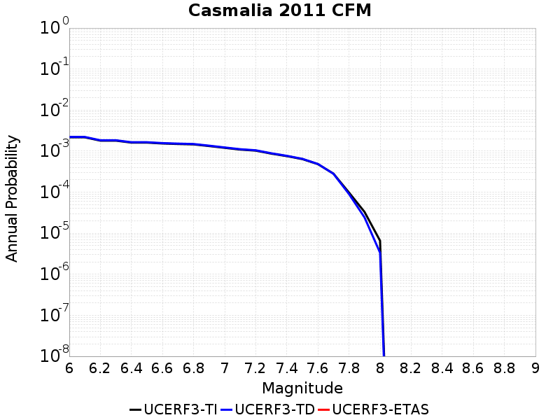 |
|-----|

| Magnitude | UCERF3-TI Prob | UCERF3-TD Prob | UCERF3-ETAS Prob |
|-----|-----|-----|-----|
| 6.0 | 0.0021737402 | 0.0022208767 | 0.0 |
| 6.1 | 0.0021737402 | 0.0022208767 | 0.0 |
| 6.2 | 0.001802353 | 0.0018431649 | 0.0 |
| 6.3 | 0.001802353 | 0.0018431649 | 0.0 |
| 6.4 | 0.0016140083 | 0.0016516199 | 0.0 |
| 6.5 | 0.0016140083 | 0.0016516199 | 0.0 |
| 6.6 | 0.0015359579 | 0.0015721123 | 0.0 |
| 6.7 | 0.0014930099 | 0.0015283058 | 0.0 |
| 6.8 | 0.001459926 | 0.0014945131 | 0.0 |
| 6.9 | 0.0013302186 | 0.0013613544 | 0.0 |
| 7.0 | 0.0012036557 | 0.0012313443 | 0.0 |
| 7.1 | 0.0010916302 | 0.0011163604 | 0.0 |
| 7.2 | 0.0010281504 | 0.0010511148 | 0.0 |
| 7.3 | 8.7045657E-4 | 8.8863255E-4 | 0.0 |
| 7.4 | 7.55832E-4 | 7.70417E-4 | 0.0 |
| 7.5 | 6.399603E-4 | 6.506792E-4 | 0.0 |
| 7.6 | 4.828555E-4 | 4.8804661E-4 | 0.0 |
| 7.7 | 2.8364395E-4 | 2.8111206E-4 | 0.0 |
| 7.8 | 9.822522E-5 | 9.033802E-5 | 0.0 |
| 7.9 | 3.309513E-5 | 2.4299323E-5 | 0.0 |
| 8.0 | 6.56134E-6 | 3.3386816E-6 | 0.0 |

## Cedar Mtn-Mahogany Mtn
*[(top)](#table-of-contents)*

| 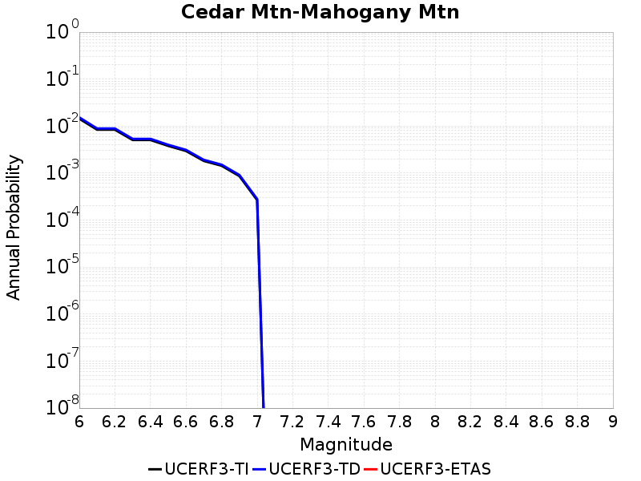 |
|-----|

| Magnitude | UCERF3-TI Prob | UCERF3-TD Prob | UCERF3-ETAS Prob |
|-----|-----|-----|-----|
| 6.0 | 0.0143825635 | 0.015317763 | 0.0 |
| 6.1 | 0.008397939 | 0.008901436 | 0.0 |
| 6.2 | 0.008397939 | 0.008901436 | 0.0 |
| 6.3 | 0.0050724675 | 0.005358892 | 0.0 |
| 6.4 | 0.0050724675 | 0.005358892 | 0.0 |
| 6.5 | 0.0037966494 | 0.00400519 | 0.0 |
| 6.6 | 0.0029588798 | 0.0031185572 | 0.0 |
| 6.7 | 0.0018169804 | 0.0019134904 | 0.0 |
| 6.8 | 0.0014357162 | 0.0015120613 | 0.0 |
| 6.9 | 8.654827E-4 | 9.120676E-4 | 0.0 |
| 7.0 | 2.6618753E-4 | 2.810129E-4 | 0.0 |

## Cerro Prieto
*[(top)](#table-of-contents)*

| 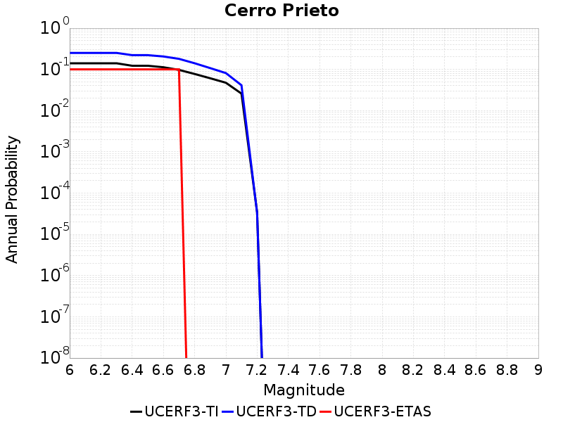 |
|-----|

| Magnitude | UCERF3-TI Prob | UCERF3-TD Prob | UCERF3-ETAS Prob |
|-----|-----|-----|-----|
| 6.0 | 0.14089979 | 0.2513076 | 0.1 |
| 6.1 | 0.14089979 | 0.2513076 | 0.1 |
| 6.2 | 0.14089979 | 0.2513076 | 0.1 |
| 6.3 | 0.14089979 | 0.2513076 | 0.1 |
| 6.4 | 0.12270685 | 0.22174765 | 0.1 |
| 6.5 | 0.12270685 | 0.22174765 | 0.1 |
| 6.6 | 0.11286586 | 0.20595059 | 0.1 |
| 6.7 | 0.09732539 | 0.18031098 | 0.1 |
| 6.8 | 0.07758363 | 0.14106736 | 0.0 |
| 6.9 | 0.060947374 | 0.107460804 | 0.0 |
| 7.0 | 0.04750344 | 0.08148147 | 0.0 |
| 7.1 | 0.025903556 | 0.04132776 | 0.0 |
| 7.2 | 3.414778E-5 | 3.3136555E-5 | 0.0 |

## Channel Islands Thrust
*[(top)](#table-of-contents)*

|  |
|-----|

| Magnitude | UCERF3-TI Prob | UCERF3-TD Prob | UCERF3-ETAS Prob |
|-----|-----|-----|-----|
| 6.0 | 0.011494373 | 0.012492395 | 0.0 |
| 6.1 | 0.011494373 | 0.012492395 | 0.0 |
| 6.2 | 0.011494373 | 0.012492395 | 0.0 |
| 6.3 | 0.011494373 | 0.012492395 | 0.0 |
| 6.4 | 0.011494373 | 0.012492395 | 0.0 |
| 6.5 | 0.011494373 | 0.012492395 | 0.0 |
| 6.6 | 0.011494373 | 0.012492395 | 0.0 |
| 6.7 | 0.005516363 | 0.0059160665 | 0.0 |
| 6.8 | 0.0053323656 | 0.0057176026 | 0.0 |
| 6.9 | 0.0047108172 | 0.0050449814 | 0.0 |
| 7.0 | 0.004505487 | 0.004824463 | 0.0 |
| 7.1 | 0.004368766 | 0.0046782903 | 0.0 |
| 7.2 | 0.00310772 | 0.003316793 | 0.0 |
| 7.3 | 0.0025417898 | 0.0027108262 | 0.0 |
| 7.4 | 0.002024039 | 0.0021573214 | 0.0 |
| 7.5 | 7.036218E-4 | 7.4421713E-4 | 0.0 |
| 7.6 | 3.1605794E-4 | 3.3125404E-4 | 0.0 |
| 7.7 | 1.1567579E-4 | 1.17883785E-4 | 0.0 |
| 7.8 | 1.1277344E-5 | 8.063214E-6 | 0.0 |

## Channel Islands Western Deep Ramp
*[(top)](#table-of-contents)*

| 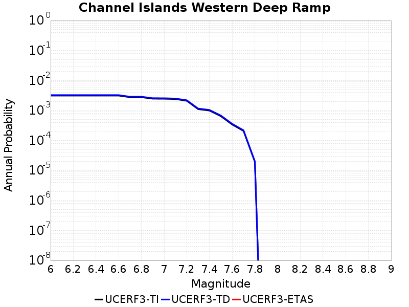 |
|-----|

| Magnitude | UCERF3-TI Prob | UCERF3-TD Prob | UCERF3-ETAS Prob |
|-----|-----|-----|-----|
| 6.0 | 0.0031369338 | 0.003257556 | 0.0 |
| 6.1 | 0.0031369338 | 0.003257556 | 0.0 |
| 6.2 | 0.0031369338 | 0.003257556 | 0.0 |
| 6.3 | 0.0031369338 | 0.003257556 | 0.0 |
| 6.4 | 0.0031369338 | 0.003257556 | 0.0 |
| 6.5 | 0.0031369338 | 0.003257556 | 0.0 |
| 6.6 | 0.0031369338 | 0.003257556 | 0.0 |
| 6.7 | 0.0027685766 | 0.0028780915 | 0.0 |
| 6.8 | 0.0027685766 | 0.0028780915 | 0.0 |
| 6.9 | 0.0024724922 | 0.0025733113 | 0.0 |
| 7.0 | 0.002460954 | 0.0025613676 | 0.0 |
| 7.1 | 0.002403158 | 0.0025015029 | 0.0 |
| 7.2 | 0.002107878 | 0.0021948004 | 0.0 |
| 7.3 | 0.0011072971 | 0.0011621931 | 0.0 |
| 7.4 | 9.93607E-4 | 0.0010432634 | 0.0 |
| 7.5 | 6.4724847E-4 | 6.7975855E-4 | 0.0 |
| 7.6 | 3.4139853E-4 | 3.590796E-4 | 0.0 |
| 7.7 | 2.0796029E-4 | 2.1864749E-4 | 0.0 |
| 7.8 | 1.933891E-5 | 2.0127789E-5 | 0.0 |

## Chino alt 1
*[(top)](#table-of-contents)*

|  |
|-----|

| Magnitude | UCERF3-TI Prob | UCERF3-TD Prob | UCERF3-ETAS Prob |
|-----|-----|-----|-----|
| 6.0 | 0.020348595 | 0.025183307 | 0.0 |
| 6.1 | 0.011158722 | 0.013877067 | 0.0 |
| 6.2 | 0.011158722 | 0.013877067 | 0.0 |
| 6.3 | 0.007429048 | 0.009385828 | 0.0 |
| 6.4 | 0.007429048 | 0.009385828 | 0.0 |
| 6.5 | 0.0067696036 | 0.008604813 | 0.0 |
| 6.6 | 0.004929154 | 0.006223392 | 0.0 |
| 6.7 | 0.004328829 | 0.0053849244 | 0.0 |
| 6.8 | 0.0018171056 | 0.0019730867 | 0.0 |
| 6.9 | 0.0011809369 | 0.0011174991 | 0.0 |
| 7.0 | 9.316847E-4 | 8.021692E-4 | 0.0 |
| 7.1 | 9.0308854E-4 | 7.6600135E-4 | 0.0 |
| 7.2 | 8.34944E-4 | 7.057734E-4 | 0.0 |
| 7.3 | 6.9482654E-4 | 5.832118E-4 | 0.0 |
| 7.4 | 5.81254E-4 | 4.8017688E-4 | 0.0 |
| 7.5 | 4.879637E-4 | 3.9651824E-4 | 0.0 |
| 7.6 | 4.4455516E-4 | 3.5790724E-4 | 0.0 |
| 7.7 | 1.13761744E-4 | 7.374189E-5 | 0.0 |

## Clamshell-Sawpit
*[(top)](#table-of-contents)*

| 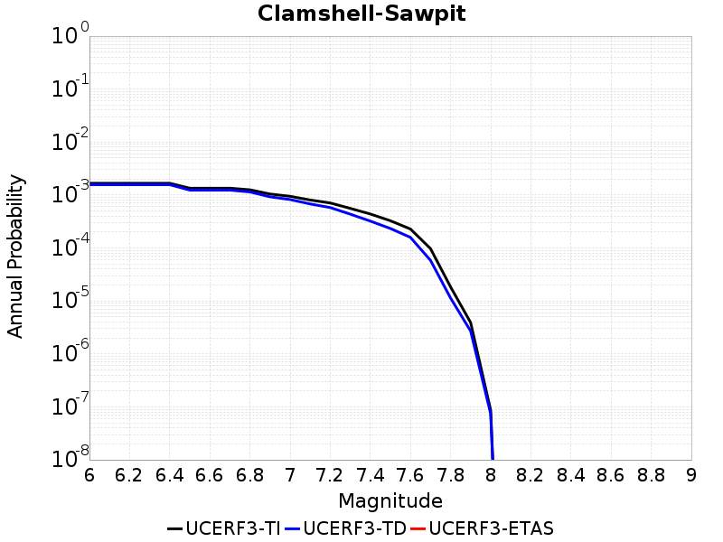 |
|-----|

| Magnitude | UCERF3-TI Prob | UCERF3-TD Prob | UCERF3-ETAS Prob |
|-----|-----|-----|-----|
| 6.0 | 0.0016698855 | 0.0015694683 | 0.0 |
| 6.1 | 0.0016698855 | 0.0015694683 | 0.0 |
| 6.2 | 0.0016698855 | 0.0015694683 | 0.0 |
| 6.3 | 0.0016698855 | 0.0015694683 | 0.0 |
| 6.4 | 0.0016698855 | 0.0015694683 | 0.0 |
| 6.5 | 0.0013485716 | 0.0012401985 | 0.0 |
| 6.6 | 0.0013485716 | 0.0012401985 | 0.0 |
| 6.7 | 0.0013485716 | 0.0012401985 | 0.0 |
| 6.8 | 0.0012566525 | 0.001144836 | 0.0 |
| 6.9 | 0.0010468846 | 9.263533E-4 | 0.0 |
| 7.0 | 9.4746763E-4 | 8.233159E-4 | 0.0 |
| 7.1 | 8.0695155E-4 | 6.797879E-4 | 0.0 |
| 7.2 | 7.097964E-4 | 5.807872E-4 | 0.0 |
| 7.3 | 5.6074356E-4 | 4.3645207E-4 | 0.0 |
| 7.4 | 4.390833E-4 | 3.2259958E-4 | 0.0 |
| 7.5 | 3.275214E-4 | 2.3381649E-4 | 0.0 |
| 7.6 | 2.2863125E-4 | 1.5888302E-4 | 0.0 |
| 7.7 | 9.7593016E-5 | 5.8560923E-5 | 0.0 |
| 7.8 | 1.8459947E-5 | 1.13738E-5 | 0.0 |
| 7.9 | 3.915966E-6 | 2.7067426E-6 | 0.0 |
| 8.0 | 8.6376616E-8 | 7.397867E-8 | 0.0 |

## Clayton
*[(top)](#table-of-contents)*

| 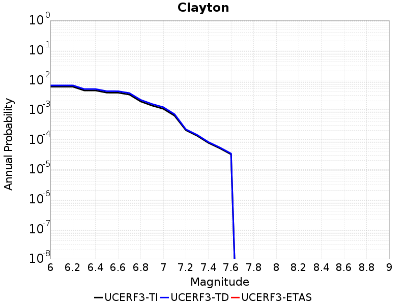 |
|-----|

| Magnitude | UCERF3-TI Prob | UCERF3-TD Prob | UCERF3-ETAS Prob |
|-----|-----|-----|-----|
| 6.0 | 0.005937509 | 0.006582693 | 0.0 |
| 6.1 | 0.005937509 | 0.006582693 | 0.0 |
| 6.2 | 0.005937509 | 0.006582693 | 0.0 |
| 6.3 | 0.0044454746 | 0.00495697 | 0.0 |
| 6.4 | 0.0044454746 | 0.00495697 | 0.0 |
| 6.5 | 0.003748503 | 0.004203277 | 0.0 |
| 6.6 | 0.0037373714 | 0.0041908305 | 0.0 |
| 6.7 | 0.0032311971 | 0.0036299424 | 0.0 |
| 6.8 | 0.0018984007 | 0.002145366 | 0.0 |
| 6.9 | 0.0013816995 | 0.0015618791 | 0.0 |
| 7.0 | 0.0010797448 | 0.0012190636 | 0.0 |
| 7.1 | 6.3177146E-4 | 7.079666E-4 | 0.0 |
| 7.2 | 2.063012E-4 | 2.2020341E-4 | 0.0 |
| 7.3 | 1.3401502E-4 | 1.4318014E-4 | 0.0 |
| 7.4 | 7.734126E-5 | 8.2455226E-5 | 0.0 |
| 7.5 | 5.1117782E-5 | 5.4448665E-5 | 0.0 |
| 7.6 | 3.196103E-5 | 3.402794E-5 | 0.0 |

## Cleghorn
*[(top)](#table-of-contents)*

|  |
|-----|

| Magnitude | UCERF3-TI Prob | UCERF3-TD Prob | UCERF3-ETAS Prob |
|-----|-----|-----|-----|
| 6.0 | 0.004127522 | 0.005092698 | 0.0 |
| 6.1 | 0.004127522 | 0.005092698 | 0.0 |
| 6.2 | 0.004127522 | 0.005092698 | 0.0 |
| 6.3 | 0.004127522 | 0.005092698 | 0.0 |
| 6.4 | 0.0022643462 | 0.003149028 | 0.0 |
| 6.5 | 0.0022643462 | 0.003149028 | 0.0 |
| 6.6 | 0.002105855 | 0.002983886 | 0.0 |
| 6.7 | 0.0017533366 | 0.0026163713 | 0.0 |
| 6.8 | 0.0017153495 | 0.0025757602 | 0.0 |
| 6.9 | 0.00158057 | 0.0024207365 | 0.0 |
| 7.0 | 0.001473467 | 0.0022545394 | 0.0 |
| 7.1 | 0.0013537793 | 0.002096213 | 0.0 |
| 7.2 | 0.0012122744 | 0.0018939818 | 0.0 |
| 7.3 | 0.001072701 | 0.0016654674 | 0.0 |
| 7.4 | 9.4169343E-4 | 0.001453558 | 0.0 |
| 7.5 | 7.658682E-4 | 0.0012453748 | 0.0 |
| 7.6 | 5.114327E-4 | 9.724366E-4 | 0.0 |
| 7.7 | 3.8309532E-4 | 8.3114766E-4 | 0.0 |
| 7.8 | 3.3567028E-4 | 7.76483E-4 | 0.0 |
| 7.9 | 1.8231584E-4 | 3.8665932E-4 | 0.0 |
| 8.0 | 3.5050467E-5 | 3.0547606E-5 | 0.0 |
| 8.1 | 1.6689133E-5 | 7.0061674E-6 | 0.0 |
| 8.2 | 6.3599036E-6 | 2.01439E-6 | 0.0 |

## Cleghorn Lake
*[(top)](#table-of-contents)*

|  |
|-----|

| Magnitude | UCERF3-TI Prob | UCERF3-TD Prob | UCERF3-ETAS Prob |
|-----|-----|-----|-----|
| 6.0 | 0.008038137 | 0.008722884 | 0.1 |
| 6.1 | 0.008038137 | 0.008722884 | 0.1 |
| 6.2 | 0.0065657445 | 0.007112507 | 0.0 |
| 6.3 | 0.0065657445 | 0.007112507 | 0.0 |
| 6.4 | 0.004901982 | 0.0052926196 | 0.0 |
| 6.5 | 0.004876298 | 0.00526535 | 0.0 |
| 6.6 | 0.0040636472 | 0.0043957275 | 0.0 |
| 6.7 | 0.001205052 | 0.0012736013 | 0.0 |
| 6.8 | 0.0010890438 | 0.0011498855 | 0.0 |
| 6.9 | 9.788794E-4 | 0.0010325707 | 0.0 |
| 7.0 | 8.010151E-4 | 8.4461115E-4 | 0.0 |
| 7.1 | 5.6886784E-4 | 5.9942075E-4 | 0.0 |
| 7.2 | 3.1650066E-4 | 3.330474E-4 | 0.0 |

## Cleghorn Pass
*[(top)](#table-of-contents)*

|  |
|-----|

| Magnitude | UCERF3-TI Prob | UCERF3-TD Prob | UCERF3-ETAS Prob |
|-----|-----|-----|-----|
| 6.0 | 0.0054756533 | 0.0057470747 | 0.0 |
| 6.1 | 0.0054756533 | 0.0057470747 | 0.0 |
| 6.2 | 0.0010975406 | 0.0011514104 | 0.0 |
| 6.3 | 0.0010975406 | 0.0011514104 | 0.0 |
| 6.4 | 9.001937E-4 | 9.444048E-4 | 0.0 |

## Collayami 2011 CFM
*[(top)](#table-of-contents)*

|  |
|-----|

| Magnitude | UCERF3-TI Prob | UCERF3-TD Prob | UCERF3-ETAS Prob |
|-----|-----|-----|-----|
| 6.0 | 0.016109297 | 0.018061295 | 0.0 |
| 6.1 | 0.00889298 | 0.009940042 | 0.0 |
| 6.2 | 0.00889298 | 0.009940042 | 0.0 |
| 6.3 | 0.0047065257 | 0.005255289 | 0.0 |
| 6.4 | 0.0029162897 | 0.003257508 | 0.0 |
| 6.5 | 0.0018405546 | 0.0020585663 | 0.0 |
| 6.6 | 0.001284103 | 0.0014369063 | 0.0 |

## Compton
*[(top)](#table-of-contents)*

|  |
|-----|

| Magnitude | UCERF3-TI Prob | UCERF3-TD Prob | UCERF3-ETAS Prob |
|-----|-----|-----|-----|
| 6.0 | 0.0055183303 | 0.003305139 | 0.0 |
| 6.1 | 0.0055183303 | 0.003305139 | 0.0 |
| 6.2 | 0.0055183303 | 0.003305139 | 0.0 |
| 6.3 | 0.0055183303 | 0.003305139 | 0.0 |
| 6.4 | 0.0055183303 | 0.003305139 | 0.0 |
| 6.5 | 0.0055183303 | 0.003305139 | 0.0 |
| 6.6 | 0.0055183303 | 0.003305139 | 0.0 |
| 6.7 | 0.0055183303 | 0.003305139 | 0.0 |
| 6.8 | 0.0055183303 | 0.003305139 | 0.0 |
| 6.9 | 0.0055183303 | 0.003305139 | 0.0 |
| 7.0 | 0.0039954064 | 0.0022205734 | 0.0 |
| 7.1 | 0.0037311043 | 0.0020186058 | 0.0 |
| 7.2 | 0.0033177056 | 0.0017205648 | 0.0 |
| 7.3 | 0.002344655 | 0.0012733918 | 0.0 |
| 7.4 | 0.0015575165 | 9.047477E-4 | 0.0 |
| 7.5 | 0.0012573242 | 7.5270724E-4 | 0.0 |
| 7.6 | 9.795959E-4 | 5.907812E-4 | 0.0 |
| 7.7 | 3.4769322E-4 | 1.8552726E-4 | 0.0 |
| 7.8 | 3.6809684E-5 | 2.1524485E-5 | 0.0 |
| 7.9 | 3.872125E-6 | 2.0871348E-6 | 0.0 |

## Concord 2011 CFM
*[(top)](#table-of-contents)*

| 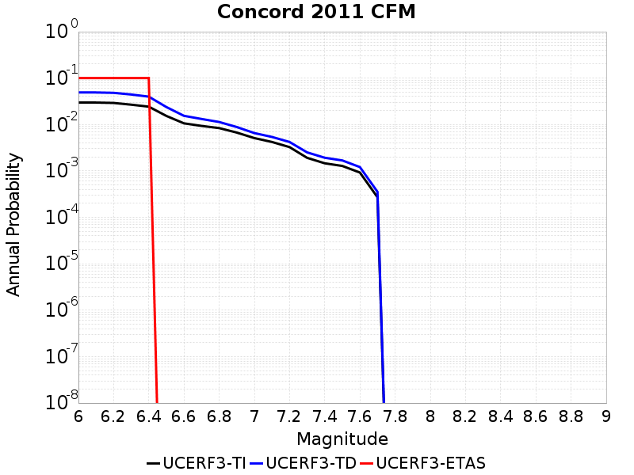 |
|-----|

| Magnitude | UCERF3-TI Prob | UCERF3-TD Prob | UCERF3-ETAS Prob |
|-----|-----|-----|-----|
| 6.0 | 0.029742775 | 0.049080413 | 0.1 |
| 6.1 | 0.029742775 | 0.049080413 | 0.1 |
| 6.2 | 0.029197963 | 0.04820032 | 0.1 |
| 6.3 | 0.026785625 | 0.044385448 | 0.1 |
| 6.4 | 0.024287801 | 0.039917506 | 0.1 |
| 6.5 | 0.015325619 | 0.023809223 | 0.0 |
| 6.6 | 0.010610655 | 0.0154100815 | 0.0 |
| 6.7 | 0.009340706 | 0.013173768 | 0.0 |
| 6.8 | 0.008384023 | 0.011342962 | 0.0 |
| 6.9 | 0.006716994 | 0.008839453 | 0.0 |
| 7.0 | 0.005106334 | 0.0065511395 | 0.0 |
| 7.1 | 0.004211805 | 0.0054047583 | 0.0 |
| 7.2 | 0.0032649285 | 0.004211523 | 0.0 |
| 7.3 | 0.0019163118 | 0.0025118086 | 0.0 |
| 7.4 | 0.0014622464 | 0.0019259624 | 0.0 |
| 7.5 | 0.0012816609 | 0.0016846056 | 0.0 |
| 7.6 | 9.2382677E-4 | 0.0012118571 | 0.0 |
| 7.7 | 2.708347E-4 | 3.5457898E-4 | 0.0 |

## Contra Costa (Lafayette) 2011 CFM
*[(top)](#table-of-contents)*

| 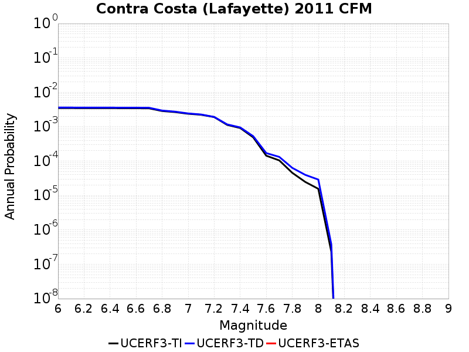 |
|-----|

| Magnitude | UCERF3-TI Prob | UCERF3-TD Prob | UCERF3-ETAS Prob |
|-----|-----|-----|-----|
| 6.0 | 0.0034666911 | 0.0036042363 | 0.0 |
| 6.1 | 0.0034666911 | 0.0036042363 | 0.0 |
| 6.2 | 0.003451089 | 0.0035878208 | 0.0 |
| 6.3 | 0.003451089 | 0.0035878208 | 0.0 |
| 6.4 | 0.003451089 | 0.0035878208 | 0.0 |
| 6.5 | 0.0034412253 | 0.0035771963 | 0.0 |
| 6.6 | 0.0034376972 | 0.0035733206 | 0.0 |
| 6.7 | 0.0034155648 | 0.0035494193 | 0.0 |
| 6.8 | 0.0028512797 | 0.0029479242 | 0.0 |
| 6.9 | 0.002653593 | 0.0027349524 | 0.0 |
| 7.0 | 0.0023726553 | 0.002429895 | 0.0 |
| 7.1 | 0.002221126 | 0.002263072 | 0.0 |
| 7.2 | 0.0019048514 | 0.0019205115 | 0.0 |
| 7.3 | 0.0011261696 | 0.001165695 | 0.0 |
| 7.4 | 9.144157E-4 | 9.521775E-4 | 0.0 |
| 7.5 | 4.897262E-4 | 5.288611E-4 | 0.0 |
| 7.6 | 1.4333417E-4 | 1.7085132E-4 | 0.0 |
| 7.7 | 1.0465423E-4 | 1.3230268E-4 | 0.0 |
| 7.8 | 4.560507E-5 | 6.3484054E-5 | 0.0 |
| 7.9 | 2.4733554E-5 | 3.9713013E-5 | 0.0 |
| 8.0 | 1.5609829E-5 | 2.8991795E-5 | 0.0 |
| 8.1 | 2.312143E-7 | 3.8065048E-7 | 0.0 |

## Contra Costa Shear Zone (connector) 2011 CFM
*[(top)](#table-of-contents)*

|  |
|-----|

| Magnitude | UCERF3-TI Prob | UCERF3-TD Prob | UCERF3-ETAS Prob |
|-----|-----|-----|-----|
| 6.0 | 0.006857436 | 0.007289998 | 0.0 |
| 6.1 | 0.006857436 | 0.007289998 | 0.0 |
| 6.2 | 0.006857436 | 0.007289998 | 0.0 |
| 6.3 | 0.004848858 | 0.0051032132 | 0.0 |
| 6.4 | 0.004848858 | 0.0051032132 | 0.0 |
| 6.5 | 0.0044215517 | 0.0046432843 | 0.0 |
| 6.6 | 0.0043745036 | 0.004591813 | 0.0 |
| 6.7 | 0.0038452526 | 0.004024556 | 0.0 |
| 6.8 | 0.0031283877 | 0.0032543498 | 0.0 |
| 6.9 | 0.0028684495 | 0.0029697893 | 0.0 |
| 7.0 | 0.0025492862 | 0.002621843 | 0.0 |
| 7.1 | 0.0022723526 | 0.0023120246 | 0.0 |
| 7.2 | 0.0019624906 | 0.0019748528 | 0.0 |
| 7.3 | 0.0012087635 | 0.0012412788 | 0.0 |
| 7.4 | 9.584976E-4 | 9.959363E-4 | 0.0 |
| 7.5 | 5.133313E-4 | 5.50876E-4 | 0.0 |
| 7.6 | 1.6488635E-4 | 1.9074224E-4 | 0.0 |
| 7.7 | 1.1544255E-4 | 1.4191317E-4 | 0.0 |
| 7.8 | 5.4835844E-5 | 7.419496E-5 | 0.0 |
| 7.9 | 3.1459633E-5 | 4.777497E-5 | 0.0 |
| 8.0 | 1.842444E-5 | 3.3706572E-5 | 0.0 |
| 8.1 | 1.8386814E-7 | 3.2090057E-7 | 0.0 |

## Coronado Bank alt1
*[(top)](#table-of-contents)*

|  |
|-----|

| Magnitude | UCERF3-TI Prob | UCERF3-TD Prob | UCERF3-ETAS Prob |
|-----|-----|-----|-----|
| 6.0 | 0.03854755 | 0.047785167 | 0.0 |
| 6.1 | 0.021578677 | 0.025955264 | 0.0 |
| 6.2 | 0.021578677 | 0.025955264 | 0.0 |
| 6.3 | 0.016452603 | 0.019450672 | 0.0 |
| 6.4 | 0.015469253 | 0.018237615 | 0.0 |
| 6.5 | 0.012709012 | 0.014872609 | 0.0 |
| 6.6 | 0.011061605 | 0.0128915645 | 0.0 |
| 6.7 | 0.0096509475 | 0.011208226 | 0.0 |
| 6.8 | 0.008242928 | 0.009550871 | 0.0 |
| 6.9 | 0.006771452 | 0.0078343265 | 0.0 |
| 7.0 | 0.0057099373 | 0.0066059395 | 0.0 |
| 7.1 | 0.0045636636 | 0.0052821767 | 0.0 |
| 7.2 | 4.1869894E-4 | 4.343169E-4 | 0.0 |
| 7.3 | 1.9457124E-4 | 1.9291737E-4 | 0.0 |
| 7.4 | 1.0725793E-4 | 1.0258158E-4 | 0.0 |
| 7.5 | 3.5717923E-5 | 3.2741707E-5 | 0.0 |
| 7.6 | 3.181591E-6 | 2.885991E-6 | 0.0 |

## Coyote Canyon
*[(top)](#table-of-contents)*

| 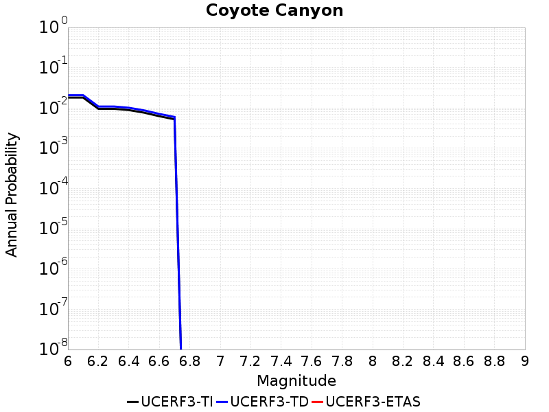 |
|-----|

| Magnitude | UCERF3-TI Prob | UCERF3-TD Prob | UCERF3-ETAS Prob |
|-----|-----|-----|-----|
| 6.0 | 0.018143194 | 0.02083677 | 0.0 |
| 6.1 | 0.018143194 | 0.02083677 | 0.0 |
| 6.2 | 0.0095647145 | 0.010923379 | 0.0 |
| 6.3 | 0.0095647145 | 0.010923379 | 0.0 |
| 6.4 | 0.008894307 | 0.010152798 | 0.0 |
| 6.5 | 0.007664232 | 0.008744076 | 0.0 |
| 6.6 | 0.0062511545 | 0.007134535 | 0.0 |
| 6.7 | 0.005253921 | 0.006000497 | 0.0 |

## Coyote Lake
*[(top)](#table-of-contents)*

|  |
|-----|

| Magnitude | UCERF3-TI Prob | UCERF3-TD Prob | UCERF3-ETAS Prob |
|-----|-----|-----|-----|
| 6.0 | 0.010280091 | 0.011259011 | 0.0 |
| 6.1 | 0.010280091 | 0.011259011 | 0.0 |
| 6.2 | 0.010280091 | 0.011259011 | 0.0 |
| 6.3 | 0.007974784 | 0.008736323 | 0.0 |
| 6.4 | 0.007974784 | 0.008736323 | 0.0 |
| 6.5 | 0.0073766913 | 0.008083539 | 0.0 |
| 6.6 | 0.0070034964 | 0.0076767835 | 0.0 |
| 6.7 | 0.006774798 | 0.007423387 | 0.0 |
| 6.8 | 0.0029673933 | 0.0032426675 | 0.0 |
| 6.9 | 0.002285778 | 0.0024985245 | 0.0 |

## Cucamonga
*[(top)](#table-of-contents)*

| 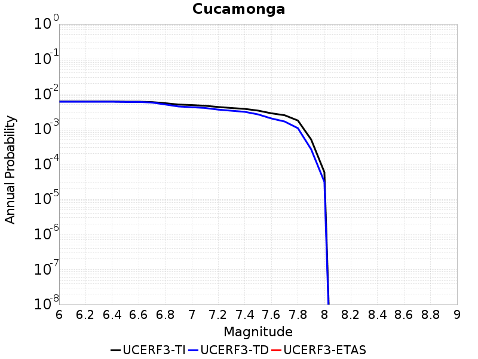 |
|-----|

| Magnitude | UCERF3-TI Prob | UCERF3-TD Prob | UCERF3-ETAS Prob |
|-----|-----|-----|-----|
| 6.0 | 0.0061632637 | 0.0060789837 | 0.0 |
| 6.1 | 0.0061632637 | 0.0060789837 | 0.0 |
| 6.2 | 0.0061632637 | 0.0060789837 | 0.0 |
| 6.3 | 0.0061632637 | 0.0060789837 | 0.0 |
| 6.4 | 0.0061632637 | 0.0060789837 | 0.0 |
| 6.5 | 0.006085745 | 0.0059955628 | 0.0 |
| 6.6 | 0.006085745 | 0.0059955628 | 0.0 |
| 6.7 | 0.005929234 | 0.0057570687 | 0.0 |
| 6.8 | 0.00550732 | 0.005069968 | 0.0 |
| 6.9 | 0.005043391 | 0.0044459873 | 0.0 |
| 7.0 | 0.0048831734 | 0.004242705 | 0.0 |
| 7.1 | 0.0046572937 | 0.0040325616 | 0.0 |
| 7.2 | 0.0042960253 | 0.0036146783 | 0.0 |
| 7.3 | 0.004018998 | 0.0033610698 | 0.0 |
| 7.4 | 0.0037891332 | 0.0031255076 | 0.0 |
| 7.5 | 0.0033915674 | 0.002643081 | 0.0 |
| 7.6 | 0.0028394572 | 0.0020244678 | 0.0 |
| 7.7 | 0.002501296 | 0.0016569933 | 0.0 |
| 7.8 | 0.0017694668 | 0.0010698214 | 0.0 |
| 7.9 | 5.086407E-4 | 2.6737765E-4 | 0.0 |
| 8.0 | 5.916129E-5 | 3.140915E-5 | 0.0 |

## Davis Creek
*[(top)](#table-of-contents)*

|  |
|-----|

| Magnitude | UCERF3-TI Prob | UCERF3-TD Prob | UCERF3-ETAS Prob |
|-----|-----|-----|-----|
| 6.0 | 0.01209173 | 0.013175357 | 0.0 |
| 6.1 | 0.0054158745 | 0.0058852476 | 0.0 |
| 6.2 | 0.0054158745 | 0.0058852476 | 0.0 |
| 6.3 | 0.0026743996 | 0.0028997413 | 0.0 |
| 6.4 | 0.0013028418 | 0.0014093693 | 0.0 |
| 6.5 | 0.0012956132 | 0.0014020413 | 0.0 |
| 6.6 | 1.081377E-4 | 1.0964741E-4 | 0.0 |
| 6.7 | 9.1540656E-5 | 9.2812246E-5 | 0.0 |
| 6.8 | 6.4284E-5 | 6.511393E-5 | 0.0 |
| 6.9 | 3.3393713E-5 | 3.383807E-5 | 0.0 |
| 7.0 | 3.3631998E-6 | 3.409512E-6 | 0.0 |

## Death Valley (Black Mtns Frontal)
*[(top)](#table-of-contents)*

|  |
|-----|

| Magnitude | UCERF3-TI Prob | UCERF3-TD Prob | UCERF3-ETAS Prob |
|-----|-----|-----|-----|
| 6.0 | 0.00867977 | 0.009683641 | 0.0 |
| 6.1 | 0.00867977 | 0.009683641 | 0.0 |
| 6.2 | 0.00867977 | 0.009683641 | 0.0 |
| 6.3 | 0.00867977 | 0.009683641 | 0.0 |
| 6.4 | 0.008063202 | 0.008995756 | 0.0 |
| 6.5 | 0.008063202 | 0.008995756 | 0.0 |
| 6.6 | 0.00781795 | 0.008722445 | 0.0 |
| 6.7 | 0.007607299 | 0.008488304 | 0.0 |
| 6.8 | 0.007386771 | 0.008243332 | 0.0 |
| 6.9 | 0.0071645193 | 0.007996496 | 0.0 |
| 7.0 | 0.007063476 | 0.007884584 | 0.0 |
| 7.1 | 0.0069668638 | 0.0077776355 | 0.0 |
| 7.2 | 0.006825765 | 0.0076215565 | 0.0 |
| 7.3 | 0.006720101 | 0.0075047715 | 0.0 |
| 7.4 | 0.0066405144 | 0.0074168188 | 0.0 |
| 7.5 | 0.006512506 | 0.007276209 | 0.0 |
| 7.6 | 0.0058794282 | 0.0065703345 | 0.0 |
| 7.7 | 0.004783291 | 0.005345265 | 0.0 |
| 7.8 | 1.8045233E-4 | 1.9023403E-4 | 0.0 |
| 7.9 | 1.3353102E-6 | 1.3923685E-6 | 0.0 |

## Death Valley (Fish Lake Valley)
*[(top)](#table-of-contents)*

| 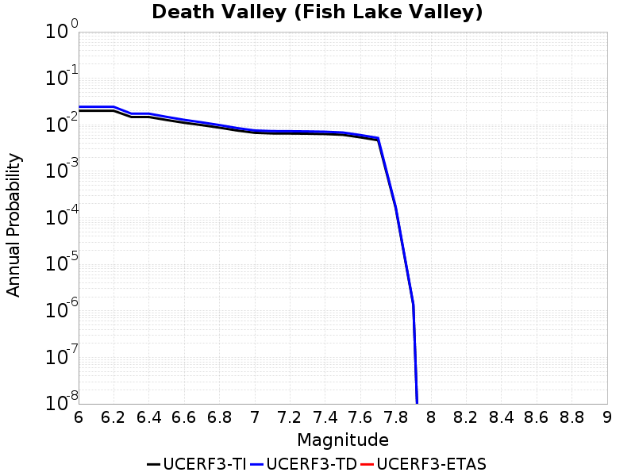 |
|-----|

| Magnitude | UCERF3-TI Prob | UCERF3-TD Prob | UCERF3-ETAS Prob |
|-----|-----|-----|-----|
| 6.0 | 0.02000288 | 0.024332903 | 0.0 |
| 6.1 | 0.02000288 | 0.024332903 | 0.0 |
| 6.2 | 0.02000288 | 0.024332903 | 0.0 |
| 6.3 | 0.014687235 | 0.017358176 | 0.0 |
| 6.4 | 0.014687235 | 0.017358176 | 0.0 |
| 6.5 | 0.012676105 | 0.014795002 | 0.0 |
| 6.6 | 0.011051672 | 0.012767385 | 0.0 |
| 6.7 | 0.009844234 | 0.01128595 | 0.0 |
| 6.8 | 0.008671708 | 0.009861947 | 0.0 |
| 6.9 | 0.007540013 | 0.008504841 | 0.0 |
| 7.0 | 0.006729651 | 0.007547972 | 0.0 |
| 7.1 | 0.006524288 | 0.0073102294 | 0.0 |
| 7.2 | 0.006495651 | 0.007277882 | 0.0 |
| 7.3 | 0.0064328653 | 0.0072075943 | 0.0 |
| 7.4 | 0.006325751 | 0.007087587 | 0.0 |
| 7.5 | 0.0060904534 | 0.0068275803 | 0.0 |
| 7.6 | 0.0053701443 | 0.0060168006 | 0.0 |
| 7.7 | 0.0046527605 | 0.005210066 | 0.0 |
| 7.8 | 1.6215823E-4 | 1.7127219E-4 | 0.0 |
| 7.9 | 1.3353102E-6 | 1.3923685E-6 | 0.0 |

## Death Valley (No)
*[(top)](#table-of-contents)*

|  |
|-----|

| Magnitude | UCERF3-TI Prob | UCERF3-TD Prob | UCERF3-ETAS Prob |
|-----|-----|-----|-----|
| 6.0 | 0.010420183 | 0.011657817 | 0.0 |
| 6.1 | 0.010420183 | 0.011657817 | 0.0 |
| 6.2 | 0.010420183 | 0.011657817 | 0.0 |
| 6.3 | 0.009891188 | 0.01105857 | 0.0 |
| 6.4 | 0.009891188 | 0.01105857 | 0.0 |
| 6.5 | 0.009537951 | 0.010658625 | 0.0 |
| 6.6 | 0.009241969 | 0.010323431 | 0.0 |
| 6.7 | 0.008844362 | 0.00987592 | 0.0 |
| 6.8 | 0.008595915 | 0.009601908 | 0.0 |
| 6.9 | 0.008393973 | 0.009382481 | 0.0 |
| 7.0 | 0.008259195 | 0.009236811 | 0.0 |
| 7.1 | 0.008108052 | 0.009070487 | 0.0 |
| 7.2 | 0.007963934 | 0.008908907 | 0.0 |
| 7.3 | 0.0075665074 | 0.008460425 | 0.0 |
| 7.4 | 0.0073391674 | 0.008204885 | 0.0 |
| 7.5 | 0.007021119 | 0.007852457 | 0.0 |
| 7.6 | 0.005868405 | 0.006559026 | 0.0 |
| 7.7 | 0.004783291 | 0.005345265 | 0.0 |
| 7.8 | 1.8045233E-4 | 1.9023403E-4 | 0.0 |
| 7.9 | 1.3353102E-6 | 1.3923685E-6 | 0.0 |

## Death Valley (So)
*[(top)](#table-of-contents)*

|  |
|-----|

| Magnitude | UCERF3-TI Prob | UCERF3-TD Prob | UCERF3-ETAS Prob |
|-----|-----|-----|-----|
| 6.0 | 0.010734817 | 0.013254812 | 0.0 |
| 6.1 | 0.010734817 | 0.013254812 | 0.0 |
| 6.2 | 0.010734817 | 0.013254812 | 0.0 |
| 6.3 | 0.010505628 | 0.012997704 | 0.0 |
| 6.4 | 0.010505628 | 0.012997704 | 0.0 |
| 6.5 | 0.010362327 | 0.012837846 | 0.0 |
| 6.6 | 0.009832645 | 0.012067893 | 0.0 |
| 6.7 | 0.009669261 | 0.011862269 | 0.0 |
| 6.8 | 0.009260561 | 0.011293224 | 0.0 |
| 6.9 | 0.006830362 | 0.007941356 | 0.0 |
| 7.0 | 0.0059864987 | 0.006830555 | 0.0 |
| 7.1 | 0.0050568148 | 0.005646333 | 0.0 |
| 7.2 | 0.0048062233 | 0.0053467187 | 0.0 |
| 7.3 | 0.0045833546 | 0.00509908 | 0.0 |
| 7.4 | 0.004533812 | 0.005046685 | 0.0 |
| 7.5 | 0.004483909 | 0.004993581 | 0.0 |
| 7.6 | 0.0043313587 | 0.0048271236 | 0.0 |
| 7.7 | 0.00389112 | 0.004340076 | 0.0 |
| 7.8 | 1.8045233E-4 | 1.9023403E-4 | 0.0 |
| 7.9 | 1.3353102E-6 | 1.3923685E-6 | 0.0 |

## Deep Springs
*[(top)](#table-of-contents)*

| 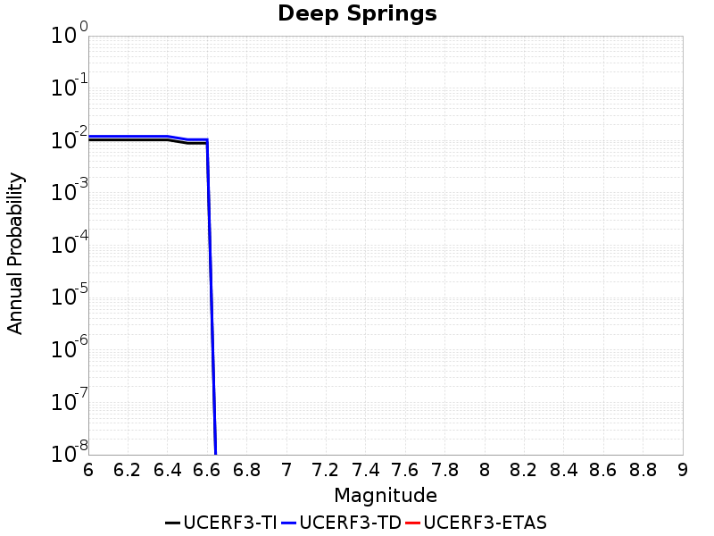 |
|-----|

| Magnitude | UCERF3-TI Prob | UCERF3-TD Prob | UCERF3-ETAS Prob |
|-----|-----|-----|-----|
| 6.0 | 0.010283757 | 0.012021548 | 0.0 |
| 6.1 | 0.010283757 | 0.012021548 | 0.0 |
| 6.2 | 0.010283757 | 0.012021548 | 0.0 |
| 6.3 | 0.010283757 | 0.012021548 | 0.0 |
| 6.4 | 0.010283757 | 0.012021548 | 0.0 |
| 6.5 | 0.008929676 | 0.010443925 | 0.0 |
| 6.6 | 0.008929676 | 0.010443925 | 0.0 |

## Del Valle
*[(top)](#table-of-contents)*

| 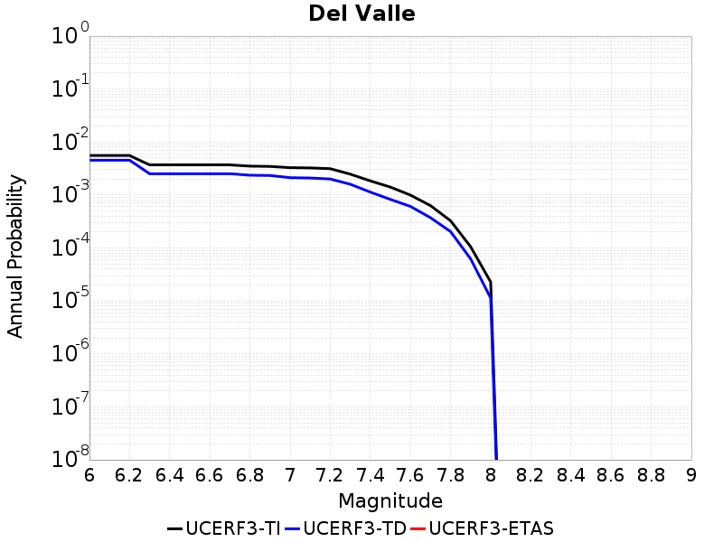 |
|-----|

| Magnitude | UCERF3-TI Prob | UCERF3-TD Prob | UCERF3-ETAS Prob |
|-----|-----|-----|-----|
| 6.0 | 0.0055759475 | 0.0045581064 | 0.0 |
| 6.1 | 0.0055759475 | 0.0045581064 | 0.0 |
| 6.2 | 0.0055759475 | 0.0045581064 | 0.0 |
| 6.3 | 0.0037131102 | 0.0025290698 | 0.0 |
| 6.4 | 0.0037131102 | 0.0025290698 | 0.0 |
| 6.5 | 0.0037131102 | 0.0025290698 | 0.0 |
| 6.6 | 0.0037131102 | 0.0025290698 | 0.0 |
| 6.7 | 0.003709649 | 0.0025277212 | 0.0 |
| 6.8 | 0.0035189227 | 0.002369902 | 0.0 |
| 6.9 | 0.003474293 | 0.0023405398 | 0.0 |
| 7.0 | 0.0032912986 | 0.0021306172 | 0.0 |
| 7.1 | 0.0032552136 | 0.0020969496 | 0.0 |
| 7.2 | 0.0031472554 | 0.0020117462 | 0.0 |
| 7.3 | 0.00248537 | 0.0016005327 | 0.0 |
| 7.4 | 0.0018519156 | 0.0011384329 | 0.0 |
| 7.5 | 0.0014147845 | 8.279859E-4 | 0.0 |
| 7.6 | 9.988978E-4 | 6.107069E-4 | 0.0 |
| 7.7 | 6.322281E-4 | 3.735326E-4 | 0.0 |
| 7.8 | 3.272304E-4 | 2.0454335E-4 | 0.0 |
| 7.9 | 1.0587843E-4 | 6.2434105E-5 | 0.0 |
| 8.0 | 2.2825214E-5 | 1.1361816E-5 | 0.0 |

## Dog Valley
*[(top)](#table-of-contents)*

|  |
|-----|

| Magnitude | UCERF3-TI Prob | UCERF3-TD Prob | UCERF3-ETAS Prob |
|-----|-----|-----|-----|
| 6.0 | 0.0041394117 | 0.0043091457 | 0.0 |
| 6.1 | 0.0041394117 | 0.0043091457 | 0.0 |
| 6.2 | 0.0041394117 | 0.0043091457 | 0.0 |
| 6.3 | 0.0041394117 | 0.0043091457 | 0.0 |
| 6.4 | 0.0023255737 | 0.002409459 | 0.0 |
| 6.5 | 0.0023255737 | 0.002409459 | 0.0 |
| 6.6 | 0.0021236122 | 0.0021982966 | 0.0 |
| 6.7 | 0.0021236122 | 0.0021982966 | 0.0 |
| 6.8 | 8.4282714E-4 | 8.606231E-4 | 0.0 |
| 6.9 | 7.2776515E-4 | 7.4330496E-4 | 0.0 |
| 7.0 | 6.060955E-4 | 6.1905285E-4 | 0.0 |
| 7.1 | 4.1068246E-4 | 4.1972872E-4 | 0.0 |

## Dry Mountain
*[(top)](#table-of-contents)*

|  |
|-----|

| Magnitude | UCERF3-TI Prob | UCERF3-TD Prob | UCERF3-ETAS Prob |
|-----|-----|-----|-----|
| 6.0 | 0.0032417132 | 0.003354859 | 0.0 |
| 6.1 | 0.0032417132 | 0.003354859 | 0.0 |
| 6.2 | 0.0032417132 | 0.003354859 | 0.0 |
| 6.3 | 0.0032417132 | 0.003354859 | 0.0 |
| 6.4 | 0.0032417132 | 0.003354859 | 0.0 |
| 6.5 | 0.0014874774 | 0.0015396021 | 0.0 |
| 6.6 | 0.0014874774 | 0.0015396021 | 0.0 |
| 6.7 | 0.0013249806 | 0.0013714634 | 0.0 |

## Earthquake Valley
*[(top)](#table-of-contents)*

| 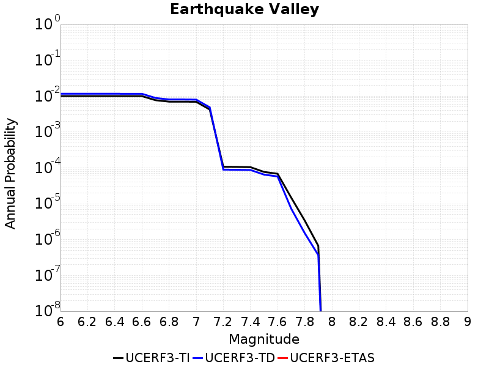 |
|-----|

| Magnitude | UCERF3-TI Prob | UCERF3-TD Prob | UCERF3-ETAS Prob |
|-----|-----|-----|-----|
| 6.0 | 0.010080142 | 0.011707486 | 0.0 |
| 6.1 | 0.010080142 | 0.011707486 | 0.0 |
| 6.2 | 0.010080142 | 0.011707486 | 0.0 |
| 6.3 | 0.010080142 | 0.011707486 | 0.0 |
| 6.4 | 0.010080142 | 0.011707486 | 0.0 |
| 6.5 | 0.010066078 | 0.011691313 | 0.0 |
| 6.6 | 0.010066078 | 0.011691313 | 0.0 |
| 6.7 | 0.007757689 | 0.008933275 | 0.0 |
| 6.8 | 0.0070558446 | 0.008111153 | 0.0 |
| 6.9 | 0.0070558446 | 0.008111153 | 0.0 |
| 7.0 | 0.006984891 | 0.008030292 | 0.0 |
| 7.1 | 0.0042599645 | 0.0049005174 | 0.0 |
| 7.2 | 1.07815904E-4 | 8.974858E-5 | 0.0 |
| 7.3 | 1.0676406E-4 | 8.878721E-5 | 0.0 |
| 7.4 | 1.05244326E-4 | 8.765499E-5 | 0.0 |
| 7.5 | 7.747146E-5 | 6.5264256E-5 | 0.0 |
| 7.6 | 6.8799505E-5 | 5.78276E-5 | 0.0 |
| 7.7 | 1.4928154E-5 | 7.359889E-6 | 0.0 |
| 7.8 | 3.4058282E-6 | 1.516865E-6 | 0.0 |
| 7.9 | 6.7301295E-7 | 3.7092286E-7 | 0.0 |

## Earthquake Valley (No  Extension)
*[(top)](#table-of-contents)*

|  |
|-----|

| Magnitude | UCERF3-TI Prob | UCERF3-TD Prob | UCERF3-ETAS Prob |
|-----|-----|-----|-----|
| 6.0 | 0.011341401 | 0.013056478 | 0.0 |
| 6.1 | 0.011341401 | 0.013056478 | 0.0 |
| 6.2 | 0.011341401 | 0.013056478 | 0.0 |
| 6.3 | 0.011341401 | 0.013056478 | 0.0 |
| 6.4 | 0.011341401 | 0.013056478 | 0.0 |
| 6.5 | 0.011341401 | 0.013056478 | 0.0 |
| 6.6 | 0.008298361 | 0.009526345 | 0.0 |
| 6.7 | 0.008298361 | 0.009526345 | 0.0 |
| 6.8 | 0.007959441 | 0.009137039 | 0.0 |
| 6.9 | 0.007089207 | 0.00814163 | 0.0 |
| 7.0 | 0.007017471 | 0.00805999 | 0.0 |
| 7.1 | 0.004291756 | 0.004929422 | 0.0 |
| 7.2 | 1.3829772E-4 | 1.1735091E-4 | 0.0 |
| 7.3 | 1.3466639E-4 | 1.14199516E-4 | 0.0 |
| 7.4 | 1.1831349E-4 | 9.936731E-5 | 0.0 |
| 7.5 | 8.115482E-5 | 6.8128626E-5 | 0.0 |
| 7.6 | 7.0170565E-5 | 5.8684785E-5 | 0.0 |
| 7.7 | 1.550704E-5 | 7.5734356E-6 | 0.0 |
| 7.8 | 3.8815665E-6 | 1.6866258E-6 | 0.0 |
| 7.9 | 8.0216864E-7 | 4.3920903E-7 | 0.0 |

## Earthquake Valley (So Extension)
*[(top)](#table-of-contents)*

|  |
|-----|

| Magnitude | UCERF3-TI Prob | UCERF3-TD Prob | UCERF3-ETAS Prob |
|-----|-----|-----|-----|
| 6.0 | 0.01563203 | 0.019167548 | 0.0 |
| 6.1 | 0.01563203 | 0.019167548 | 0.0 |
| 6.2 | 0.01563203 | 0.019167548 | 0.0 |
| 6.3 | 0.008207959 | 0.009573869 | 0.0 |
| 6.4 | 0.008207959 | 0.009573869 | 0.0 |
| 6.5 | 0.008207959 | 0.009573869 | 0.0 |
| 6.6 | 0.008207959 | 0.009573869 | 0.0 |
| 6.7 | 0.0059115817 | 0.006828641 | 0.0 |
| 6.8 | 0.0052300454 | 0.006029337 | 0.0 |
| 6.9 | 0.0052300454 | 0.006029337 | 0.0 |
| 7.0 | 0.0052300454 | 0.006029337 | 0.0 |
| 7.1 | 0.0042384774 | 0.004883246 | 0.0 |
| 7.2 | 8.733451E-5 | 7.359563E-5 | 0.0 |
| 7.3 | 8.6780245E-5 | 7.306525E-5 | 0.0 |
| 7.4 | 8.645182E-5 | 7.277676E-5 | 0.0 |
| 7.5 | 6.1383886E-5 | 5.245978E-5 | 0.0 |
| 7.6 | 5.63135E-5 | 4.8147147E-5 | 0.0 |
| 7.7 | 1.1388902E-5 | 5.8096134E-6 | 0.0 |
| 7.8 | 1.365494E-6 | 6.221459E-7 | 0.0 |

## East Huasna 2011 CFM
*[(top)](#table-of-contents)*

| 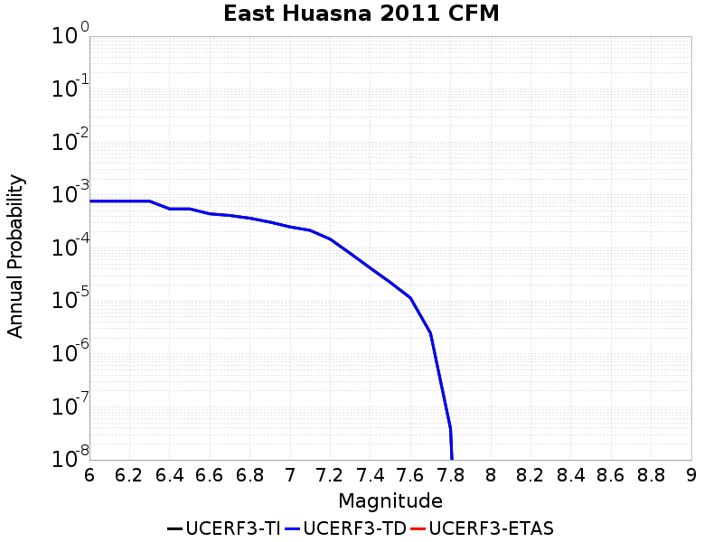 |
|-----|

| Magnitude | UCERF3-TI Prob | UCERF3-TD Prob | UCERF3-ETAS Prob |
|-----|-----|-----|-----|
| 6.0 | 7.645637E-4 | 7.6750596E-4 | 0.0 |
| 6.1 | 7.645637E-4 | 7.6750596E-4 | 0.0 |
| 6.2 | 7.645637E-4 | 7.6750596E-4 | 0.0 |
| 6.3 | 7.645637E-4 | 7.6750596E-4 | 0.0 |
| 6.4 | 5.4711284E-4 | 5.4912234E-4 | 0.0 |
| 6.5 | 5.4711284E-4 | 5.4912234E-4 | 0.0 |
| 6.6 | 4.414933E-4 | 4.4305343E-4 | 0.0 |
| 6.7 | 4.108819E-4 | 4.1222593E-4 | 0.0 |
| 6.8 | 3.6487455E-4 | 3.6601792E-4 | 0.0 |
| 6.9 | 3.0778843E-4 | 3.0859318E-4 | 0.0 |
| 7.0 | 2.5010316E-4 | 2.505732E-4 | 0.0 |
| 7.1 | 2.1524953E-4 | 2.1545072E-4 | 0.0 |
| 7.2 | 1.4726835E-4 | 1.4691676E-4 | 0.0 |
| 7.3 | 7.962996E-5 | 7.864816E-5 | 0.0 |
| 7.4 | 4.161893E-5 | 4.2039424E-5 | 0.0 |
| 7.5 | 2.2287857E-5 | 2.2539514E-5 | 0.0 |
| 7.6 | 1.1378794E-5 | 1.1507832E-5 | 0.0 |
| 7.7 | 2.462619E-6 | 2.4872347E-6 | 0.0 |
| 7.8 | 3.861218E-8 | 3.8950034E-8 | 0.0 |

## Eaton Roughs 2011 CFM
*[(top)](#table-of-contents)*

|  |
|-----|

| Magnitude | UCERF3-TI Prob | UCERF3-TD Prob | UCERF3-ETAS Prob |
|-----|-----|-----|-----|
| 6.0 | 0.03488314 | 0.045034047 | 0.1 |
| 6.1 | 0.03488314 | 0.045034047 | 0.1 |
| 6.2 | 0.03488314 | 0.045034047 | 0.1 |
| 6.3 | 0.03488314 | 0.045034047 | 0.1 |
| 6.4 | 0.023630321 | 0.02934907 | 0.1 |
| 6.5 | 0.023630321 | 0.02934907 | 0.1 |
| 6.6 | 0.016672665 | 0.019738393 | 0.1 |
| 6.7 | 0.012525126 | 0.014372574 | 0.0 |
| 6.8 | 0.011318169 | 0.012910957 | 0.0 |
| 6.9 | 0.010743194 | 0.012236205 | 0.0 |
| 7.0 | 0.010435291 | 0.011879844 | 0.0 |
| 7.1 | 0.009464677 | 0.010765354 | 0.0 |
| 7.2 | 0.009103506 | 0.010363374 | 0.0 |
| 7.3 | 0.008172729 | 0.009345564 | 0.0 |
| 7.4 | 0.007515317 | 0.008610551 | 0.0 |
| 7.5 | 0.00693033 | 0.00796296 | 0.0 |
| 7.6 | 0.005567309 | 0.0064328276 | 0.0 |
| 7.7 | 0.0030941102 | 0.003563952 | 0.0 |
| 7.8 | 0.001127572 | 0.0012139197 | 0.0 |
| 7.9 | 2.5870028E-4 | 2.7213202E-4 | 0.0 |

## Elmore Ranch
*[(top)](#table-of-contents)*

|  |
|-----|

| Magnitude | UCERF3-TI Prob | UCERF3-TD Prob | UCERF3-ETAS Prob |
|-----|-----|-----|-----|
| 6.0 | 0.046385348 | 0.045684878 | 0.0 |
| 6.1 | 0.019789828 | 0.021540025 | 0.0 |
| 6.2 | 0.019789828 | 0.021540025 | 0.0 |
| 6.3 | 0.017173318 | 0.019018702 | 0.0 |
| 6.4 | 0.01303681 | 0.014340184 | 0.0 |
| 6.5 | 0.01303681 | 0.014340184 | 0.0 |

## Elsinore (Coyote Mountains)
*[(top)](#table-of-contents)*

|  |
|-----|

| Magnitude | UCERF3-TI Prob | UCERF3-TD Prob | UCERF3-ETAS Prob |
|-----|-----|-----|-----|
| 6.0 | 0.021703249 | 0.025043506 | 0.0 |
| 6.1 | 0.021703249 | 0.025043506 | 0.0 |
| 6.2 | 0.012142851 | 0.012779835 | 0.0 |
| 6.3 | 0.012142851 | 0.012779835 | 0.0 |
| 6.4 | 0.0087768035 | 0.008589688 | 0.0 |
| 6.5 | 0.0087768035 | 0.008589688 | 0.0 |
| 6.6 | 0.0061957375 | 0.00546575 | 0.0 |
| 6.7 | 0.0047622547 | 0.0037399514 | 0.0 |
| 6.8 | 0.0041159308 | 0.0029747072 | 0.0 |
| 6.9 | 0.004046161 | 0.0028987941 | 0.0 |
| 7.0 | 0.003997127 | 0.0028451825 | 0.0 |
| 7.1 | 0.003878636 | 0.002720094 | 0.0 |
| 7.2 | 0.00371249 | 0.0025466671 | 0.0 |
| 7.3 | 0.0036933604 | 0.0025303822 | 0.0 |
| 7.4 | 0.0036726352 | 0.002511581 | 0.0 |
| 7.5 | 0.0035994058 | 0.0024573214 | 0.0 |
| 7.6 | 0.0033035777 | 0.0022355677 | 0.0 |
| 7.7 | 0.0020436216 | 0.0011645166 | 0.0 |
| 7.8 | 1.0876673E-4 | 4.39304E-5 | 0.0 |
| 7.9 | 2.3464577E-6 | 1.1789703E-6 | 0.0 |

## Elsinore (Glen Ivy) rev
*[(top)](#table-of-contents)*

|  |
|-----|

| Magnitude | UCERF3-TI Prob | UCERF3-TD Prob | UCERF3-ETAS Prob |
|-----|-----|-----|-----|
| 6.0 | 0.081081145 | 0.1392022 | 0.1 |
| 6.1 | 0.081081145 | 0.1392022 | 0.1 |
| 6.2 | 0.081081145 | 0.1392022 | 0.1 |
| 6.3 | 0.0513964 | 0.08669859 | 0.1 |
| 6.4 | 0.0513964 | 0.08669859 | 0.1 |
| 6.5 | 0.01892915 | 0.023595236 | 0.0 |
| 6.6 | 0.012986525 | 0.013474462 | 0.0 |
| 6.7 | 0.011511663 | 0.011387887 | 0.0 |
| 6.8 | 0.008652439 | 0.0074650464 | 0.0 |
| 6.9 | 0.007818509 | 0.0063840467 | 0.0 |
| 7.0 | 0.007465612 | 0.0059308694 | 0.0 |
| 7.1 | 0.006897931 | 0.005309407 | 0.0 |
| 7.2 | 0.006032603 | 0.0044094687 | 0.0 |
| 7.3 | 0.005282581 | 0.0037547532 | 0.0 |
| 7.4 | 0.004726996 | 0.0032961257 | 0.0 |
| 7.5 | 0.0039949706 | 0.0027122237 | 0.0 |
| 7.6 | 0.0036406964 | 0.0024330986 | 0.0 |
| 7.7 | 0.0021701038 | 0.0012088546 | 0.0 |
| 7.8 | 1.1839878E-4 | 4.8602855E-5 | 0.0 |
| 7.9 | 3.4838679E-6 | 1.7881166E-6 | 0.0 |

## Elsinore (Julian)
*[(top)](#table-of-contents)*

|  |
|-----|

| Magnitude | UCERF3-TI Prob | UCERF3-TD Prob | UCERF3-ETAS Prob |
|-----|-----|-----|-----|
| 6.0 | 0.006091637 | 0.004586798 | 0.0 |
| 6.1 | 0.006091637 | 0.004586798 | 0.0 |
| 6.2 | 0.006091637 | 0.004586798 | 0.0 |
| 6.3 | 0.006091637 | 0.004586798 | 0.0 |
| 6.4 | 0.006091637 | 0.004586798 | 0.0 |
| 6.5 | 0.006091637 | 0.004586798 | 0.0 |
| 6.6 | 0.0060607214 | 0.0045517064 | 0.0 |
| 6.7 | 0.0060607214 | 0.0045517064 | 0.0 |
| 6.8 | 0.0059528816 | 0.0044391835 | 0.0 |
| 6.9 | 0.005879169 | 0.0043602316 | 0.0 |
| 7.0 | 0.0057843104 | 0.0042654 | 0.0 |
| 7.1 | 0.005622267 | 0.004102566 | 0.0 |
| 7.2 | 0.0053745564 | 0.0038540077 | 0.0 |
| 7.3 | 0.005008285 | 0.003578392 | 0.0 |
| 7.4 | 0.0047600917 | 0.0033711253 | 0.0 |
| 7.5 | 0.0041598766 | 0.0028538613 | 0.0 |
| 7.6 | 0.0036227088 | 0.0024201062 | 0.0 |
| 7.7 | 0.0021660565 | 0.0012063129 | 0.0 |
| 7.8 | 1.17902506E-4 | 4.832941E-5 | 0.0 |
| 7.9 | 3.4838679E-6 | 1.7881166E-6 | 0.0 |

## Elsinore (Stepovers Combined)
*[(top)](#table-of-contents)*

|  |
|-----|

| Magnitude | UCERF3-TI Prob | UCERF3-TD Prob | UCERF3-ETAS Prob |
|-----|-----|-----|-----|
| 6.0 | 0.011126885 | 0.010198422 | 0.0 |
| 6.1 | 0.011126885 | 0.010198422 | 0.0 |
| 6.2 | 0.011126885 | 0.010198422 | 0.0 |
| 6.3 | 0.010253254 | 0.009156805 | 0.0 |
| 6.4 | 0.010253254 | 0.009156805 | 0.0 |
| 6.5 | 0.010253254 | 0.009156805 | 0.0 |
| 6.6 | 0.00996252 | 0.008776534 | 0.0 |
| 6.7 | 0.009145746 | 0.0076053264 | 0.0 |
| 6.8 | 0.008816543 | 0.0071207657 | 0.0 |
| 6.9 | 0.008315775 | 0.006641112 | 0.0 |
| 7.0 | 0.006923327 | 0.005412459 | 0.0 |
| 7.1 | 0.0066905143 | 0.0051509617 | 0.0 |
| 7.2 | 0.0060604266 | 0.00447642 | 0.0 |
| 7.3 | 0.005208723 | 0.0037353158 | 0.0 |
| 7.4 | 0.00474572 | 0.00332603 | 0.0 |
| 7.5 | 0.0040983222 | 0.0027936546 | 0.0 |
| 7.6 | 0.003634129 | 0.0024279337 | 0.0 |
| 7.7 | 0.0021691616 | 0.0012082336 | 0.0 |
| 7.8 | 1.1839878E-4 | 4.8602855E-5 | 0.0 |
| 7.9 | 3.4838679E-6 | 1.7881166E-6 | 0.0 |

## Elsinore (Temecula) rev
*[(top)](#table-of-contents)*

|  |
|-----|

| Magnitude | UCERF3-TI Prob | UCERF3-TD Prob | UCERF3-ETAS Prob |
|-----|-----|-----|-----|
| 6.0 | 0.015282745 | 0.011621607 | 0.0 |
| 6.1 | 0.015282745 | 0.011621607 | 0.0 |
| 6.2 | 0.015282745 | 0.011621607 | 0.0 |
| 6.3 | 0.012044783 | 0.00950744 | 0.0 |
| 6.4 | 0.012044783 | 0.00950744 | 0.0 |
| 6.5 | 0.009523412 | 0.007621764 | 0.0 |
| 6.6 | 0.009463696 | 0.0075507294 | 0.0 |
| 6.7 | 0.00909636 | 0.0072485562 | 0.0 |
| 6.8 | 0.009046922 | 0.007209442 | 0.0 |
| 6.9 | 0.008522186 | 0.0067165624 | 0.0 |
| 7.0 | 0.0072331014 | 0.0056355814 | 0.0 |
| 7.1 | 0.0069702556 | 0.0053530307 | 0.0 |
| 7.2 | 0.0063146 | 0.0046645654 | 0.0 |
| 7.3 | 0.005466277 | 0.003927618 | 0.0 |
| 7.4 | 0.005009353 | 0.0035215544 | 0.0 |
| 7.5 | 0.004277392 | 0.0029250178 | 0.0 |
| 7.6 | 0.0036328835 | 0.0024271226 | 0.0 |
| 7.7 | 0.0021680726 | 0.0012075328 | 0.0 |
| 7.8 | 1.1839878E-4 | 4.8602855E-5 | 0.0 |
| 7.9 | 3.4838679E-6 | 1.7881166E-6 | 0.0 |

## Elysian Park (Lower CFM)
*[(top)](#table-of-contents)*

| 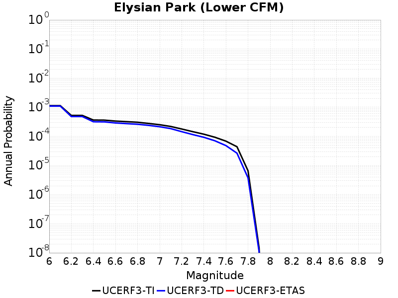 |
|-----|

| Magnitude | UCERF3-TI Prob | UCERF3-TD Prob | UCERF3-ETAS Prob |
|-----|-----|-----|-----|
| 6.0 | 0.0011351013 | 0.0010969256 | 0.0 |
| 6.1 | 0.0011351013 | 0.0010969256 | 0.0 |
| 6.2 | 5.2327604E-4 | 4.7892577E-4 | 0.0 |
| 6.3 | 5.2327604E-4 | 4.7892577E-4 | 0.0 |
| 6.4 | 3.6312963E-4 | 3.1753772E-4 | 0.0 |
| 6.5 | 3.600655E-4 | 3.1444395E-4 | 0.0 |
| 6.6 | 3.349229E-4 | 2.89094E-4 | 0.0 |
| 6.7 | 3.2025913E-4 | 2.7432267E-4 | 0.0 |
| 6.8 | 3.0508233E-4 | 2.6073685E-4 | 0.0 |
| 6.9 | 2.7769682E-4 | 2.3868341E-4 | 0.0 |
| 7.0 | 2.5119373E-4 | 2.1429139E-4 | 0.0 |
| 7.1 | 2.1877629E-4 | 1.8474589E-4 | 0.0 |
| 7.2 | 1.787505E-4 | 1.448965E-4 | 0.0 |
| 7.3 | 1.4489799E-4 | 1.1511752E-4 | 0.0 |
| 7.4 | 1.18733085E-4 | 9.292722E-5 | 0.0 |
| 7.5 | 9.326255E-5 | 7.052976E-5 | 0.0 |
| 7.6 | 6.8479676E-5 | 4.816413E-5 | 0.0 |
| 7.7 | 4.4037708E-5 | 2.6474116E-5 | 0.0 |
| 7.8 | 6.5699946E-6 | 3.7551533E-6 | 0.0 |
| 7.9 | 1.4779177E-8 | 1.1147155E-8 | 0.0 |

## Elysian Park (Upper)
*[(top)](#table-of-contents)*

| 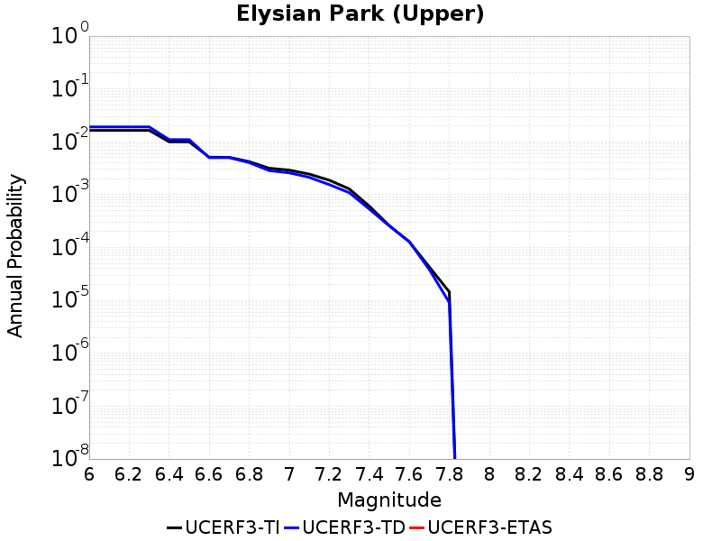 |
|-----|

| Magnitude | UCERF3-TI Prob | UCERF3-TD Prob | UCERF3-ETAS Prob |
|-----|-----|-----|-----|
| 6.0 | 0.016495159 | 0.019149391 | 0.0 |
| 6.1 | 0.016495159 | 0.019149391 | 0.0 |
| 6.2 | 0.016495159 | 0.019149391 | 0.0 |
| 6.3 | 0.016495159 | 0.019149391 | 0.0 |
| 6.4 | 0.010006315 | 0.011001605 | 0.0 |
| 6.5 | 0.010006315 | 0.011001605 | 0.0 |
| 6.6 | 0.005107356 | 0.0050259302 | 0.0 |
| 6.7 | 0.0051012407 | 0.005019481 | 0.0 |
| 6.8 | 0.004218856 | 0.0040437197 | 0.0 |
| 6.9 | 0.0031688702 | 0.0028533537 | 0.0 |
| 7.0 | 0.0029175316 | 0.0025940933 | 0.0 |
| 7.1 | 0.002454537 | 0.002128395 | 0.0 |
| 7.2 | 0.0018799726 | 0.0015510706 | 0.0 |
| 7.3 | 0.0012885736 | 0.0010917056 | 0.0 |
| 7.4 | 6.071448E-4 | 5.3550454E-4 | 0.0 |
| 7.5 | 2.605767E-4 | 2.5632972E-4 | 0.0 |
| 7.6 | 1.2870505E-4 | 1.2914301E-4 | 0.0 |
| 7.7 | 4.2948723E-5 | 3.8465478E-5 | 0.0 |
| 7.8 | 1.45156055E-5 | 9.11247E-6 | 0.0 |

## Emerson-Copper Mtn 2011
*[(top)](#table-of-contents)*

| 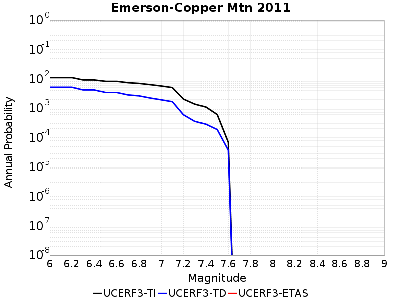 |
|-----|

| Magnitude | UCERF3-TI Prob | UCERF3-TD Prob | UCERF3-ETAS Prob |
|-----|-----|-----|-----|
| 6.0 | 0.011085749 | 0.005179959 | 0.0 |
| 6.1 | 0.011085749 | 0.005179959 | 0.0 |
| 6.2 | 0.011085749 | 0.005179959 | 0.0 |
| 6.3 | 0.00921966 | 0.004204934 | 0.0 |
| 6.4 | 0.00921966 | 0.004204934 | 0.0 |
| 6.5 | 0.008255237 | 0.0034335544 | 0.0 |
| 6.6 | 0.008255237 | 0.0034335544 | 0.0 |
| 6.7 | 0.007425902 | 0.0028445858 | 0.0 |
| 6.8 | 0.007014576 | 0.0026384017 | 0.0 |
| 6.9 | 0.0063639707 | 0.0022306181 | 0.0 |
| 7.0 | 0.005728345 | 0.0019337406 | 0.0 |
| 7.1 | 0.0050622504 | 0.0016699547 | 0.0 |
| 7.2 | 0.00205035 | 5.989827E-4 | 0.0 |
| 7.3 | 0.0013878393 | 3.5972396E-4 | 0.0 |
| 7.4 | 0.0010895962 | 2.8426707E-4 | 0.0 |
| 7.5 | 6.093505E-4 | 1.8752349E-4 | 0.0 |
| 7.6 | 6.863536E-5 | 3.6999085E-5 | 0.0 |

## Eureka Peak
*[(top)](#table-of-contents)*

|  |
|-----|

| Magnitude | UCERF3-TI Prob | UCERF3-TD Prob | UCERF3-ETAS Prob |
|-----|-----|-----|-----|
| 6.0 | 0.016532637 | 0.0048793973 | 0.0 |
| 6.1 | 0.016532637 | 0.0048793973 | 0.0 |
| 6.2 | 0.016532637 | 0.0048793973 | 0.0 |
| 6.3 | 0.0141644105 | 0.004186105 | 0.0 |
| 6.4 | 0.0141644105 | 0.004186105 | 0.0 |
| 6.5 | 5.0812232E-5 | 9.630133E-5 | 0.0 |
| 6.6 | 4.8783666E-5 | 9.478484E-5 | 0.0 |
| 6.7 | 4.8783666E-5 | 9.478484E-5 | 0.0 |
| 6.8 | 4.482784E-5 | 9.319018E-5 | 0.0 |
| 6.9 | 4.0436134E-5 | 9.015905E-5 | 0.0 |
| 7.0 | 3.5991467E-5 | 8.484148E-5 | 0.0 |
| 7.1 | 3.0572617E-5 | 7.638786E-5 | 0.0 |
| 7.2 | 2.6806558E-5 | 6.929192E-5 | 0.0 |
| 7.3 | 2.371039E-5 | 6.0031005E-5 | 0.0 |
| 7.4 | 1.55591E-5 | 3.5532365E-5 | 0.0 |
| 7.5 | 2.2134857E-6 | 4.2740985E-6 | 0.0 |

## Fickle Hill (alt1)
*[(top)](#table-of-contents)*

| 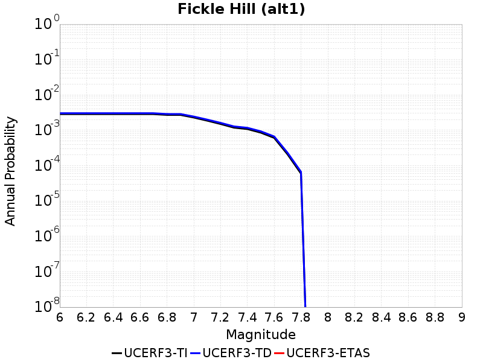 |
|-----|

| Magnitude | UCERF3-TI Prob | UCERF3-TD Prob | UCERF3-ETAS Prob |
|-----|-----|-----|-----|
| 6.0 | 0.0028614972 | 0.0030341332 | 0.0 |
| 6.1 | 0.0028614972 | 0.0030341332 | 0.0 |
| 6.2 | 0.0028614972 | 0.0030341332 | 0.0 |
| 6.3 | 0.0028614972 | 0.0030341332 | 0.0 |
| 6.4 | 0.0028614972 | 0.0030341332 | 0.0 |
| 6.5 | 0.0028614972 | 0.0030341332 | 0.0 |
| 6.6 | 0.0028614972 | 0.0030341332 | 0.0 |
| 6.7 | 0.0028614972 | 0.0030341332 | 0.0 |
| 6.8 | 0.0027204256 | 0.0028878546 | 0.0 |
| 6.9 | 0.0027193436 | 0.0028867212 | 0.0 |
| 7.0 | 0.0022948137 | 0.0024470205 | 0.0 |
| 7.1 | 0.0018720542 | 0.0020043722 | 0.0 |
| 7.2 | 0.0015058735 | 0.0016223019 | 0.0 |
| 7.3 | 0.0011863695 | 0.001285566 | 0.0 |
| 7.4 | 0.0010829868 | 0.0011762385 | 0.0 |
| 7.5 | 8.580116E-4 | 9.3549525E-4 | 0.0 |
| 7.6 | 6.09725E-4 | 6.6852634E-4 | 0.0 |
| 7.7 | 2.0801972E-4 | 2.3071018E-4 | 0.0 |
| 7.8 | 5.9636226E-5 | 6.698009E-5 | 0.0 |

## Fish Slough 2011 CFM
*[(top)](#table-of-contents)*

| 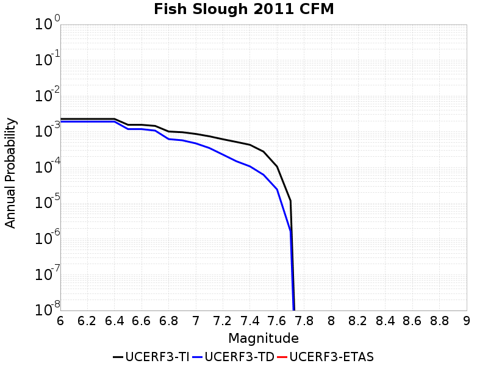 |
|-----|

| Magnitude | UCERF3-TI Prob | UCERF3-TD Prob | UCERF3-ETAS Prob |
|-----|-----|-----|-----|
| 6.0 | 0.0022739628 | 0.0019158938 | 0.0 |
| 6.1 | 0.0022739628 | 0.0019158938 | 0.0 |
| 6.2 | 0.0022739628 | 0.0019158938 | 0.0 |
| 6.3 | 0.0022739628 | 0.0019158938 | 0.0 |
| 6.4 | 0.0022739628 | 0.0019158938 | 0.0 |
| 6.5 | 0.0015598187 | 0.0011830067 | 0.0 |
| 6.6 | 0.0015598187 | 0.0011830067 | 0.0 |
| 6.7 | 0.0014542221 | 0.0010745198 | 0.0 |
| 6.8 | 0.0010126247 | 6.211743E-4 | 0.0 |
| 6.9 | 9.6835295E-4 | 5.7537464E-4 | 0.0 |
| 7.0 | 8.6756604E-4 | 4.7251635E-4 | 0.0 |
| 7.1 | 7.44888E-4 | 3.5066807E-4 | 0.0 |
| 7.2 | 6.160596E-4 | 2.2929488E-4 | 0.0 |
| 7.3 | 5.173762E-4 | 1.4928529E-4 | 0.0 |
| 7.4 | 4.305122E-4 | 1.07437205E-4 | 0.0 |
| 7.5 | 2.778049E-4 | 6.261831E-5 | 0.0 |
| 7.6 | 1.0631039E-4 | 2.4438292E-5 | 0.0 |
| 7.7 | 1.1740749E-5 | 1.6322824E-6 | 0.0 |

## Fitzhugh Creek
*[(top)](#table-of-contents)*

| 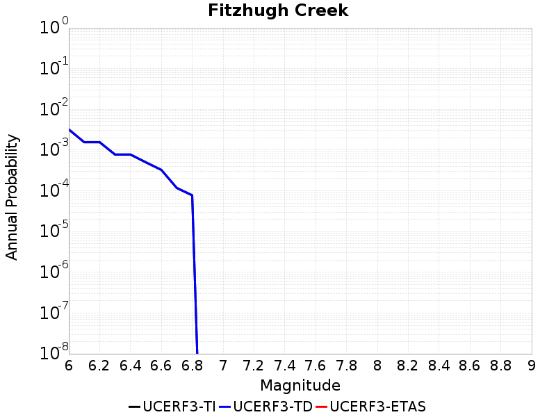 |
|-----|

| Magnitude | UCERF3-TI Prob | UCERF3-TD Prob | UCERF3-ETAS Prob |
|-----|-----|-----|-----|
| 6.0 | 0.0031825465 | 0.0032350663 | 0.0 |
| 6.1 | 0.001550684 | 0.0015752186 | 0.0 |
| 6.2 | 0.001550684 | 0.0015752186 | 0.0 |
| 6.3 | 7.70965E-4 | 7.829296E-4 | 0.0 |
| 6.4 | 7.70965E-4 | 7.829296E-4 | 0.0 |
| 6.5 | 4.964952E-4 | 5.0416373E-4 | 0.0 |
| 6.6 | 3.2405215E-4 | 3.290725E-4 | 0.0 |
| 6.7 | 1.1675821E-4 | 1.186028E-4 | 0.0 |
| 6.8 | 7.714316E-5 | 7.836691E-5 | 0.0 |

## Fontana (Seismicity)
*[(top)](#table-of-contents)*

|  |
|-----|

| Magnitude | UCERF3-TI Prob | UCERF3-TD Prob | UCERF3-ETAS Prob |
|-----|-----|-----|-----|
| 6.0 | 0.003738865 | 0.0039350805 | 0.0 |
| 6.1 | 0.003738865 | 0.0039350805 | 0.0 |
| 6.2 | 0.003738865 | 0.0039350805 | 0.0 |
| 6.3 | 0.003738865 | 0.0039350805 | 0.0 |
| 6.4 | 0.003738865 | 0.0039350805 | 0.0 |
| 6.5 | 0.002741426 | 0.002885342 | 0.0 |
| 6.6 | 0.002741426 | 0.002885342 | 0.0 |

## Franklin 2011 CFM
*[(top)](#table-of-contents)*

|  |
|-----|

| Magnitude | UCERF3-TI Prob | UCERF3-TD Prob | UCERF3-ETAS Prob |
|-----|-----|-----|-----|
| 6.0 | 0.009583955 | 0.010472497 | 0.1 |
| 6.1 | 0.009583955 | 0.010472497 | 0.1 |
| 6.2 | 0.009583955 | 0.010472497 | 0.1 |
| 6.3 | 0.007181826 | 0.007857696 | 0.1 |
| 6.4 | 0.007181826 | 0.007857696 | 0.1 |
| 6.5 | 0.0058835056 | 0.0064405096 | 0.1 |
| 6.6 | 0.005626298 | 0.0061598504 | 0.1 |
| 6.7 | 0.005570874 | 0.006098602 | 0.1 |
| 6.8 | 0.0049154665 | 0.0053686127 | 0.1 |
| 6.9 | 0.0045293528 | 0.0049398355 | 0.1 |
| 7.0 | 0.004204433 | 0.00457348 | 0.1 |
| 7.1 | 0.0038210868 | 0.004130861 | 0.1 |
| 7.2 | 0.002696611 | 0.0028347538 | 0.0 |
| 7.3 | 0.0018361164 | 0.001972229 | 0.0 |
| 7.4 | 0.001342686 | 0.0014640768 | 0.0 |
| 7.5 | 7.115741E-4 | 8.047279E-4 | 0.0 |
| 7.6 | 2.780275E-4 | 3.478058E-4 | 0.0 |
| 7.7 | 2.190805E-4 | 2.849571E-4 | 0.0 |
| 7.8 | 1.17846146E-4 | 1.5952568E-4 | 0.0 |
| 7.9 | 7.601527E-5 | 1.1041265E-4 | 0.0 |
| 8.0 | 2.7585504E-5 | 5.192442E-5 | 0.0 |
| 8.1 | 1.3850448E-6 | 2.4453655E-6 | 0.0 |

## Garberville - Briceland 2011 CFM
*[(top)](#table-of-contents)*

|  |
|-----|

| Magnitude | UCERF3-TI Prob | UCERF3-TD Prob | UCERF3-ETAS Prob |
|-----|-----|-----|-----|
| 6.0 | 0.024938442 | 0.033067618 | 0.0 |
| 6.1 | 0.024938442 | 0.033067618 | 0.0 |
| 6.2 | 0.024938442 | 0.033067618 | 0.0 |
| 6.3 | 0.024938442 | 0.033067618 | 0.0 |
| 6.4 | 0.024938442 | 0.033067618 | 0.0 |
| 6.5 | 0.024938442 | 0.033067618 | 0.0 |
| 6.6 | 0.024938442 | 0.033067618 | 0.0 |
| 6.7 | 0.018072363 | 0.02385026 | 0.0 |
| 6.8 | 0.014255894 | 0.018721592 | 0.0 |
| 6.9 | 0.014219119 | 0.01867953 | 0.0 |
| 7.0 | 0.009877323 | 0.012812242 | 0.0 |
| 7.1 | 0.002900493 | 0.0033866316 | 0.0 |
| 7.2 | 0.0020908823 | 0.0024323578 | 0.0 |
| 7.3 | 0.0010938413 | 0.0012702446 | 0.0 |

## Garlic Springs
*[(top)](#table-of-contents)*

|  |
|-----|

| Magnitude | UCERF3-TI Prob | UCERF3-TD Prob | UCERF3-ETAS Prob |
|-----|-----|-----|-----|
| 6.0 | 0.008707083 | 0.009750196 | 0.0 |
| 6.1 | 0.005127866 | 0.0057104467 | 0.0 |
| 6.2 | 0.005127866 | 0.0057104467 | 0.0 |
| 6.3 | 0.0022499003 | 0.0024897328 | 0.0 |
| 6.4 | 0.0022499003 | 0.0024897328 | 0.0 |
| 6.5 | 0.0022499003 | 0.0024897328 | 0.0 |
| 6.6 | 0.0022418506 | 0.0024808259 | 0.0 |
| 6.7 | 0.0020120554 | 0.0022261024 | 0.0 |

## Garlock (Central)
*[(top)](#table-of-contents)*

| 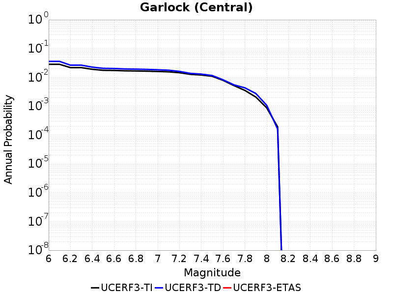 |
|-----|

| Magnitude | UCERF3-TI Prob | UCERF3-TD Prob | UCERF3-ETAS Prob |
|-----|-----|-----|-----|
| 6.0 | 0.028357591 | 0.03581733 | 0.0 |
| 6.1 | 0.028357591 | 0.03581733 | 0.0 |
| 6.2 | 0.021759989 | 0.02644758 | 0.0 |
| 6.3 | 0.021759989 | 0.02644758 | 0.0 |
| 6.4 | 0.019048655 | 0.022618374 | 0.0 |
| 6.5 | 0.017543508 | 0.020536564 | 0.0 |
| 6.6 | 0.017365133 | 0.02025836 | 0.0 |
| 6.7 | 0.016856372 | 0.01955296 | 0.0 |
| 6.8 | 0.016654192 | 0.019260533 | 0.0 |
| 6.9 | 0.01638118 | 0.018854251 | 0.0 |
| 7.0 | 0.015996104 | 0.018294977 | 0.0 |
| 7.1 | 0.01556781 | 0.017665435 | 0.0 |
| 7.2 | 0.014481937 | 0.01607357 | 0.0 |
| 7.3 | 0.012712469 | 0.013729736 | 0.0 |
| 7.4 | 0.012045753 | 0.012953774 | 0.0 |
| 7.5 | 0.010886264 | 0.011557595 | 0.0 |
| 7.6 | 0.007854558 | 0.008218251 | 0.0 |
| 7.7 | 0.00517007 | 0.0054746694 | 0.0 |
| 7.8 | 0.0035191406 | 0.0043214257 | 0.0 |
| 7.9 | 0.002072189 | 0.0027563716 | 0.0 |
| 8.0 | 8.7254314E-4 | 0.0010694413 | 0.0 |
| 8.1 | 1.9165053E-4 | 1.6156044E-4 | 0.0 |

## Garlock (East)
*[(top)](#table-of-contents)*

| 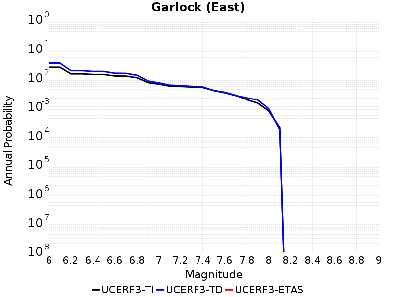 |
|-----|

| Magnitude | UCERF3-TI Prob | UCERF3-TD Prob | UCERF3-ETAS Prob |
|-----|-----|-----|-----|
| 6.0 | 0.023254504 | 0.03220755 | 0.0 |
| 6.1 | 0.023254504 | 0.03220755 | 0.0 |
| 6.2 | 0.01382215 | 0.017774666 | 0.0 |
| 6.3 | 0.01382215 | 0.017774666 | 0.0 |
| 6.4 | 0.013121112 | 0.016665064 | 0.0 |
| 6.5 | 0.013121112 | 0.016665064 | 0.0 |
| 6.6 | 0.011653901 | 0.014509324 | 0.0 |
| 6.7 | 0.011538187 | 0.014339806 | 0.0 |
| 6.8 | 0.010138147 | 0.012334149 | 0.0 |
| 6.9 | 0.0069254204 | 0.007850974 | 0.0 |
| 7.0 | 0.0061178906 | 0.006770485 | 0.0 |
| 7.1 | 0.005237907 | 0.005629829 | 0.0 |
| 7.2 | 0.0050842804 | 0.005420947 | 0.0 |
| 7.3 | 0.0048639905 | 0.005134125 | 0.0 |
| 7.4 | 0.004697283 | 0.004899153 | 0.0 |
| 7.5 | 0.003688092 | 0.003653497 | 0.0 |
| 7.6 | 0.0031863707 | 0.003068336 | 0.0 |
| 7.7 | 0.0024999576 | 0.00244632 | 0.0 |
| 7.8 | 0.0017740062 | 0.0020448554 | 0.0 |
| 7.9 | 0.0013519945 | 0.0017333813 | 0.0 |
| 8.0 | 7.1686733E-4 | 8.614542E-4 | 0.0 |
| 8.1 | 1.9165053E-4 | 1.6156044E-4 | 0.0 |

## Garlock (West)
*[(top)](#table-of-contents)*

|  |
|-----|

| Magnitude | UCERF3-TI Prob | UCERF3-TD Prob | UCERF3-ETAS Prob |
|-----|-----|-----|-----|
| 6.0 | 0.013053683 | 0.01294198 | 0.0 |
| 6.1 | 0.013000126 | 0.012891111 | 0.0 |
| 6.2 | 0.012932341 | 0.012830302 | 0.0 |
| 6.3 | 0.012822957 | 0.012737482 | 0.0 |
| 6.4 | 0.012051838 | 0.011903567 | 0.0 |
| 6.5 | 0.011791403 | 0.011808938 | 0.0 |
| 6.6 | 0.011062649 | 0.011181384 | 0.0 |
| 6.7 | 0.010230771 | 0.010471021 | 0.0 |
| 6.8 | 0.009733009 | 0.010218083 | 0.0 |
| 6.9 | 0.0091206245 | 0.009729742 | 0.0 |
| 7.0 | 0.008724891 | 0.009350094 | 0.0 |
| 7.1 | 0.008488664 | 0.009094045 | 0.0 |
| 7.2 | 0.008200042 | 0.008809571 | 0.0 |
| 7.3 | 0.00782677 | 0.008527627 | 0.0 |
| 7.4 | 0.0077382675 | 0.008443095 | 0.0 |
| 7.5 | 0.0075422134 | 0.008232686 | 0.0 |
| 7.6 | 0.006634211 | 0.0072050025 | 0.0 |
| 7.7 | 0.0053750467 | 0.005873274 | 0.0 |
| 7.8 | 0.003661789 | 0.0045625754 | 0.0 |
| 7.9 | 0.0021165414 | 0.0028055245 | 0.0 |
| 8.0 | 8.7254314E-4 | 0.0010694413 | 0.0 |
| 8.1 | 1.9165053E-4 | 1.6156044E-4 | 0.0 |

## Gillem - Big Crack 2011 CFM
*[(top)](#table-of-contents)*

| 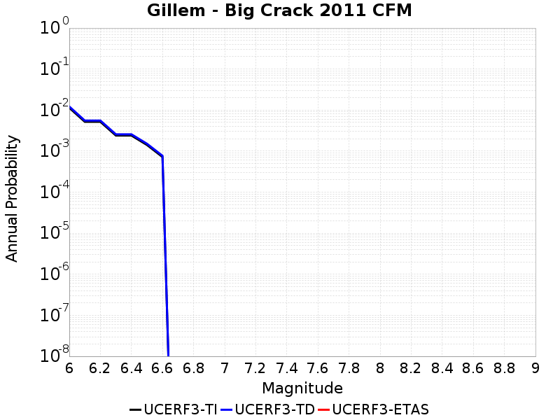 |
|-----|

| Magnitude | UCERF3-TI Prob | UCERF3-TD Prob | UCERF3-ETAS Prob |
|-----|-----|-----|-----|
| 6.0 | 0.011397537 | 0.012241199 | 0.0 |
| 6.1 | 0.0052005537 | 0.0055715577 | 0.0 |
| 6.2 | 0.0052005537 | 0.0055715577 | 0.0 |
| 6.3 | 0.0024039985 | 0.002574255 | 0.0 |
| 6.4 | 0.0024039985 | 0.002574255 | 0.0 |
| 6.5 | 0.0014165393 | 0.0015169563 | 0.0 |
| 6.6 | 7.2075747E-4 | 7.7257294E-4 | 0.0 |

## Goldstone Lake
*[(top)](#table-of-contents)*

| 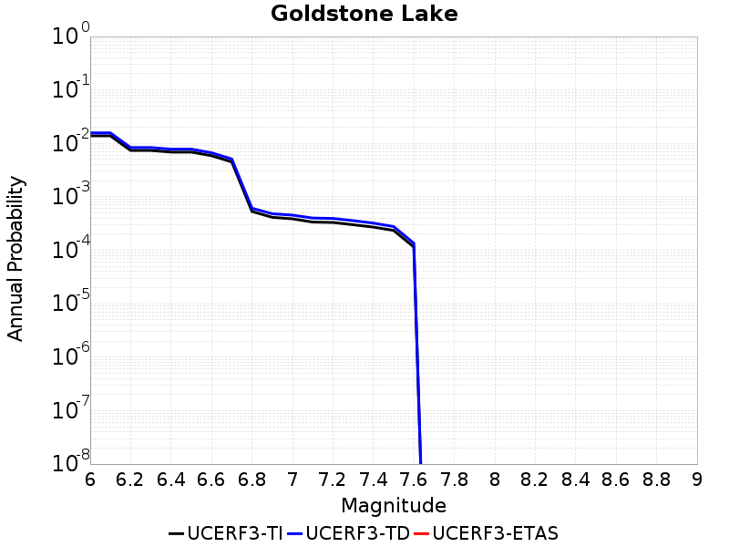 |
|-----|

| Magnitude | UCERF3-TI Prob | UCERF3-TD Prob | UCERF3-ETAS Prob |
|-----|-----|-----|-----|
| 6.0 | 0.013842222 | 0.01572348 | 0.0 |
| 6.1 | 0.013842222 | 0.01572348 | 0.0 |
| 6.2 | 0.007380498 | 0.008362365 | 0.0 |
| 6.3 | 0.007380498 | 0.008362365 | 0.0 |
| 6.4 | 0.006884126 | 0.0078000776 | 0.0 |
| 6.5 | 0.006884126 | 0.0078000776 | 0.0 |
| 6.6 | 0.0058935313 | 0.00668587 | 0.0 |
| 6.7 | 0.0045039062 | 0.0051154653 | 0.0 |
| 6.8 | 5.3288206E-4 | 6.11861E-4 | 0.0 |
| 6.9 | 4.140076E-4 | 4.8309084E-4 | 0.0 |
| 7.0 | 3.8804344E-4 | 4.5515472E-4 | 0.0 |
| 7.1 | 3.375881E-4 | 4.011586E-4 | 0.0 |
| 7.2 | 3.3162883E-4 | 3.9475138E-4 | 0.0 |
| 7.3 | 3.0100282E-4 | 3.590684E-4 | 0.0 |
| 7.4 | 2.7179506E-4 | 3.2247807E-4 | 0.0 |
| 7.5 | 2.3545188E-4 | 2.784452E-4 | 0.0 |
| 7.6 | 1.1539775E-4 | 1.3581177E-4 | 0.0 |

## Goose Lake 2011 CFM
*[(top)](#table-of-contents)*

| 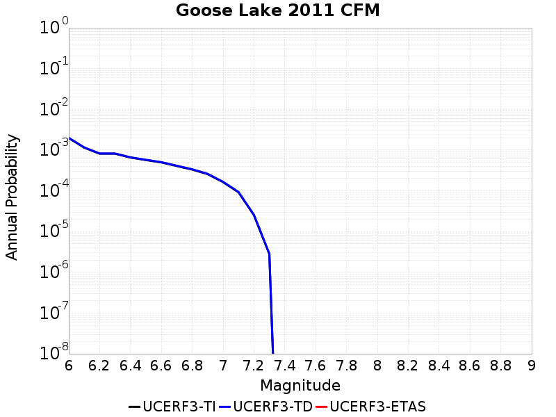 |
|-----|

| Magnitude | UCERF3-TI Prob | UCERF3-TD Prob | UCERF3-ETAS Prob |
|-----|-----|-----|-----|
| 6.0 | 0.001970914 | 0.0019927013 | 0.0 |
| 6.1 | 0.0011491019 | 0.0011626781 | 0.0 |
| 6.2 | 8.1494235E-4 | 8.2537904E-4 | 0.0 |
| 6.3 | 8.1494235E-4 | 8.2537904E-4 | 0.0 |
| 6.4 | 6.553905E-4 | 6.6437235E-4 | 0.0 |
| 6.5 | 5.6915404E-4 | 5.773328E-4 | 0.0 |
| 6.6 | 4.980042E-4 | 5.054686E-4 | 0.0 |
| 6.7 | 4.0640513E-4 | 4.128895E-4 | 0.0 |
| 6.8 | 3.323974E-4 | 3.3793531E-4 | 0.0 |
| 6.9 | 2.569914E-4 | 2.6153625E-4 | 0.0 |
| 7.0 | 1.6331839E-4 | 1.6642106E-4 | 0.0 |
| 7.1 | 9.22479E-5 | 9.402282E-5 | 0.0 |
| 7.2 | 2.537988E-5 | 2.5772762E-5 | 0.0 |
| 7.3 | 2.8130391E-6 | 2.856731E-6 | 0.0 |

## Gravel Hills-Harper Lk
*[(top)](#table-of-contents)*

|  |
|-----|

| Magnitude | UCERF3-TI Prob | UCERF3-TD Prob | UCERF3-ETAS Prob |
|-----|-----|-----|-----|
| 6.0 | 0.015880952 | 0.016285354 | 0.0 |
| 6.1 | 0.015880952 | 0.016285354 | 0.0 |
| 6.2 | 0.007871548 | 0.0070829988 | 0.0 |
| 6.3 | 0.007871548 | 0.0070829988 | 0.0 |
| 6.4 | 0.0065179965 | 0.0055571524 | 0.0 |
| 6.5 | 0.0057720304 | 0.0047242735 | 0.0 |
| 6.6 | 0.0050424994 | 0.0039186887 | 0.0 |
| 6.7 | 0.004672008 | 0.0035123914 | 0.0 |
| 6.8 | 0.0038943281 | 0.0026635476 | 0.0 |
| 6.9 | 0.0033031502 | 0.0020348376 | 0.0 |
| 7.0 | 0.0026700313 | 0.0013572979 | 0.0 |
| 7.1 | 0.002313479 | 0.0010930899 | 0.0 |
| 7.2 | 0.0018264982 | 6.57067E-4 | 0.0 |
| 7.3 | 0.0013357349 | 3.705987E-4 | 0.0 |
| 7.4 | 0.0010622547 | 2.7609346E-4 | 0.0 |
| 7.5 | 6.093505E-4 | 1.8752349E-4 | 0.0 |
| 7.6 | 6.863536E-5 | 3.6999085E-5 | 0.0 |

## Great Valley 01
*[(top)](#table-of-contents)*

|  |
|-----|

| Magnitude | UCERF3-TI Prob | UCERF3-TD Prob | UCERF3-ETAS Prob |
|-----|-----|-----|-----|
| 6.0 | 0.0017411702 | 0.0017600879 | 0.0 |
| 6.1 | 9.345838E-4 | 9.449536E-4 | 0.0 |
| 6.2 | 9.345838E-4 | 9.449536E-4 | 0.0 |
| 6.3 | 6.069944E-4 | 6.141169E-4 | 0.0 |
| 6.4 | 4.5755E-4 | 4.6327425E-4 | 0.0 |
| 6.5 | 3.52316E-4 | 3.570624E-4 | 0.0 |
| 6.6 | 2.7406693E-4 | 2.7809702E-4 | 0.0 |
| 6.7 | 2.160204E-4 | 2.1953764E-4 | 0.0 |
| 6.8 | 1.6546051E-4 | 1.6850549E-4 | 0.0 |
| 6.9 | 1.3190156E-4 | 1.3460215E-4 | 0.0 |
| 7.0 | 1.0783524E-4 | 1.1022791E-4 | 0.0 |
| 7.1 | 8.322964E-5 | 8.522668E-5 | 0.0 |
| 7.2 | 5.3696727E-5 | 5.5115717E-5 | 0.0 |
| 7.3 | 3.4339595E-5 | 3.532439E-5 | 0.0 |
| 7.4 | 1.6238733E-5 | 1.6727368E-5 | 0.0 |

## Great Valley 02
*[(top)](#table-of-contents)*

|  |
|-----|

| Magnitude | UCERF3-TI Prob | UCERF3-TD Prob | UCERF3-ETAS Prob |
|-----|-----|-----|-----|
| 6.0 | 0.0011599615 | 0.0011896173 | 0.0 |
| 6.1 | 0.0011599615 | 0.0011896173 | 0.0 |
| 6.2 | 8.2344277E-4 | 8.484476E-4 | 0.0 |
| 6.3 | 7.745686E-4 | 7.9894636E-4 | 0.0 |
| 6.4 | 7.441537E-4 | 7.682603E-4 | 0.0 |
| 6.5 | 6.639096E-4 | 6.8677205E-4 | 0.0 |
| 6.6 | 6.1850325E-4 | 6.407941E-4 | 0.0 |
| 6.7 | 5.5037E-4 | 5.711386E-4 | 0.0 |
| 6.8 | 4.688774E-4 | 4.878322E-4 | 0.0 |
| 6.9 | 3.934392E-4 | 4.104303E-4 | 0.0 |
| 7.0 | 3.083136E-4 | 3.2215135E-4 | 0.0 |
| 7.1 | 2.2984203E-4 | 2.4076286E-4 | 0.0 |
| 7.2 | 1.5807994E-4 | 1.659414E-4 | 0.0 |
| 7.3 | 9.757392E-5 | 1.0262681E-4 | 0.0 |
| 7.4 | 1.6238733E-5 | 1.6727368E-5 | 0.0 |

## Great Valley 03 Mysterious Ridge
*[(top)](#table-of-contents)*

|  |
|-----|

| Magnitude | UCERF3-TI Prob | UCERF3-TD Prob | UCERF3-ETAS Prob |
|-----|-----|-----|-----|
| 6.0 | 0.016139153 | 0.018616391 | 0.0 |
| 6.1 | 0.016139153 | 0.018616391 | 0.0 |
| 6.2 | 0.016139153 | 0.018616391 | 0.0 |
| 6.3 | 0.010933585 | 0.012354097 | 0.0 |
| 6.4 | 0.010933585 | 0.012354097 | 0.0 |
| 6.5 | 0.010066401 | 0.011342193 | 0.0 |
| 6.6 | 0.010056281 | 0.011331837 | 0.0 |
| 6.7 | 0.008688197 | 0.009750803 | 0.0 |
| 6.8 | 0.007417957 | 0.008303506 | 0.0 |
| 6.9 | 0.006485529 | 0.0072484035 | 0.0 |
| 7.0 | 0.00456803 | 0.00509081 | 0.0 |
| 7.1 | 0.0031813353 | 0.0035453162 | 0.0 |
| 7.2 | 0.0015325027 | 0.0017050814 | 0.0 |
| 7.3 | 3.7763783E-4 | 4.1736738E-4 | 0.0 |
| 7.4 | 1.6238733E-5 | 1.6727368E-5 | 0.0 |

## Great Valley 03a Dunnigan Hills
*[(top)](#table-of-contents)*

|  |
|-----|

| Magnitude | UCERF3-TI Prob | UCERF3-TD Prob | UCERF3-ETAS Prob |
|-----|-----|-----|-----|
| 6.0 | 0.008619824 | 0.009402585 | 0.0 |
| 6.1 | 0.004186971 | 0.0045633772 | 0.0 |
| 6.2 | 0.0017103611 | 0.0018647071 | 0.0 |
| 6.3 | 0.0010085925 | 0.0010998244 | 0.0 |
| 6.4 | 6.8552926E-4 | 7.475227E-4 | 0.0 |

## Great Valley 04a Trout Creek
*[(top)](#table-of-contents)*

| 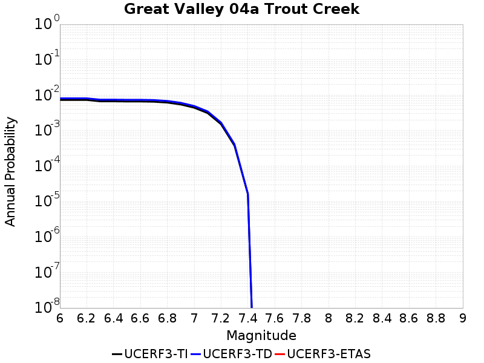 |
|-----|

| Magnitude | UCERF3-TI Prob | UCERF3-TD Prob | UCERF3-ETAS Prob |
|-----|-----|-----|-----|
| 6.0 | 0.007324295 | 0.008160271 | 0.0 |
| 6.1 | 0.007324295 | 0.008160271 | 0.0 |
| 6.2 | 0.007324295 | 0.008160271 | 0.0 |
| 6.3 | 0.0066995937 | 0.007466622 | 0.0 |
| 6.4 | 0.0066995937 | 0.007466622 | 0.0 |
| 6.5 | 0.00663712 | 0.007397585 | 0.0 |
| 6.6 | 0.00663712 | 0.007397585 | 0.0 |
| 6.7 | 0.006531183 | 0.007280771 | 0.0 |
| 6.8 | 0.0061752927 | 0.006887132 | 0.0 |
| 6.9 | 0.005463991 | 0.0060960236 | 0.0 |
| 7.0 | 0.0044380166 | 0.004956779 | 0.0 |
| 7.1 | 0.0031293905 | 0.0034922073 | 0.0 |
| 7.2 | 0.0015184027 | 0.0016907202 | 0.0 |
| 7.3 | 3.766272E-4 | 4.1633783E-4 | 0.0 |
| 7.4 | 1.6238733E-5 | 1.6727368E-5 | 0.0 |

## Great Valley 04b Gordon Valley
*[(top)](#table-of-contents)*

| 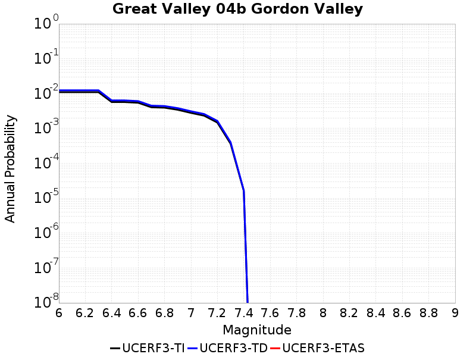 |
|-----|

| Magnitude | UCERF3-TI Prob | UCERF3-TD Prob | UCERF3-ETAS Prob |
|-----|-----|-----|-----|
| 6.0 | 0.010991322 | 0.012436453 | 0.0 |
| 6.1 | 0.010991322 | 0.012436453 | 0.0 |
| 6.2 | 0.010991322 | 0.012436453 | 0.0 |
| 6.3 | 0.010991322 | 0.012436453 | 0.0 |
| 6.4 | 0.005717147 | 0.006367942 | 0.0 |
| 6.5 | 0.005717147 | 0.006367942 | 0.0 |
| 6.6 | 0.0054730466 | 0.0060932217 | 0.0 |
| 6.7 | 0.004056071 | 0.0045128483 | 0.0 |
| 6.8 | 0.0039499826 | 0.004395958 | 0.0 |
| 6.9 | 0.0034400085 | 0.0038280967 | 0.0 |
| 7.0 | 0.0027981328 | 0.0031163741 | 0.0 |
| 7.1 | 0.0023289204 | 0.002595625 | 0.0 |
| 7.2 | 0.0014773258 | 0.0016479655 | 0.0 |
| 7.3 | 3.6563876E-4 | 4.0507765E-4 | 0.0 |
| 7.4 | 1.6238733E-5 | 1.6727368E-5 | 0.0 |

## Great Valley 05 Pittsburg - Kirby Hills alt1
*[(top)](#table-of-contents)*

| 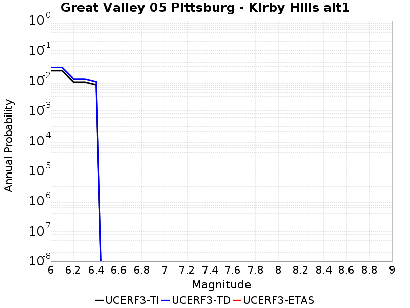 |
|-----|

| Magnitude | UCERF3-TI Prob | UCERF3-TD Prob | UCERF3-ETAS Prob |
|-----|-----|-----|-----|
| 6.0 | 0.021611776 | 0.027526336 | 0.0 |
| 6.1 | 0.021611776 | 0.027526336 | 0.0 |
| 6.2 | 0.009013915 | 0.011502788 | 0.0 |
| 6.3 | 0.009013915 | 0.011502788 | 0.0 |
| 6.4 | 0.0072933645 | 0.0093119815 | 0.0 |

## Great Valley 06 (Midland) 2011 CFM alt1
*[(top)](#table-of-contents)*

|  |
|-----|

| Magnitude | UCERF3-TI Prob | UCERF3-TD Prob | UCERF3-ETAS Prob |
|-----|-----|-----|-----|
| 6.0 | 0.0066113044 | 0.006869376 | 0.0 |
| 6.1 | 0.0066113044 | 0.006869376 | 0.0 |
| 6.2 | 0.0066113044 | 0.006869376 | 0.0 |
| 6.3 | 0.0066113044 | 0.006869376 | 0.0 |
| 6.4 | 0.0066113044 | 0.006869376 | 0.0 |
| 6.5 | 0.0066113044 | 0.006869376 | 0.0 |
| 6.6 | 0.0029996498 | 0.0031097834 | 0.0 |
| 6.7 | 0.0029996498 | 0.0031097834 | 0.0 |
| 6.8 | 0.0017451472 | 0.0018081163 | 0.0 |
| 6.9 | 0.0010613267 | 0.0010995236 | 0.0 |
| 7.0 | 6.480942E-4 | 6.7156303E-4 | 0.0 |
| 7.1 | 3.490376E-4 | 3.618914E-4 | 0.0 |
| 7.2 | 2.0598859E-4 | 2.1362468E-4 | 0.0 |

## Great Valley 07 (Orestimba)
*[(top)](#table-of-contents)*

| 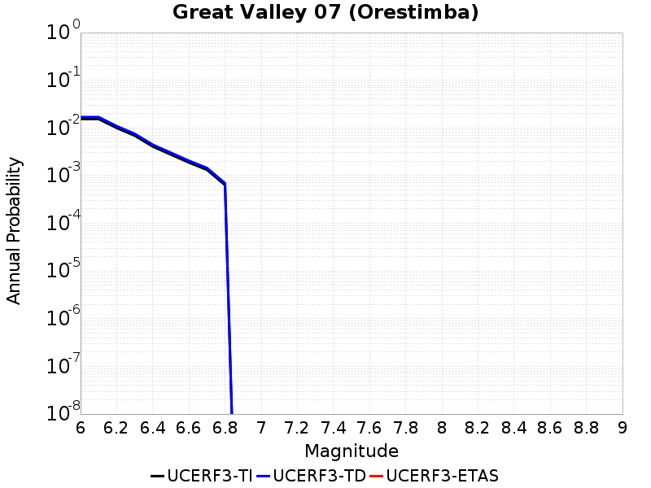 |
|-----|

| Magnitude | UCERF3-TI Prob | UCERF3-TD Prob | UCERF3-ETAS Prob |
|-----|-----|-----|-----|
| 6.0 | 0.015371585 | 0.016936978 | 0.0 |
| 6.1 | 0.015371585 | 0.016936978 | 0.0 |
| 6.2 | 0.00998465 | 0.010971011 | 0.0 |
| 6.3 | 0.006888649 | 0.0075558014 | 0.0 |
| 6.4 | 0.004071363 | 0.0044590984 | 0.0 |
| 6.5 | 0.0027656353 | 0.003028245 | 0.0 |
| 6.6 | 0.0018768552 | 0.002056247 | 0.0 |
| 6.7 | 0.0013224703 | 0.00144999 | 0.0 |
| 6.8 | 6.3198735E-4 | 6.938434E-4 | 0.0 |

## Great Valley 08 (Quinto)
*[(top)](#table-of-contents)*

|  |
|-----|

| Magnitude | UCERF3-TI Prob | UCERF3-TD Prob | UCERF3-ETAS Prob |
|-----|-----|-----|-----|
| 6.0 | 0.004029296 | 0.0042961305 | 0.0 |
| 6.1 | 0.004029296 | 0.0042961305 | 0.0 |
| 6.2 | 0.004029296 | 0.0042961305 | 0.0 |
| 6.3 | 0.0028001624 | 0.002995092 | 0.0 |
| 6.4 | 0.0028001624 | 0.002995092 | 0.0 |
| 6.5 | 0.0019049325 | 0.002053498 | 0.0 |
| 6.6 | 0.0018841444 | 0.0020312208 | 0.0 |
| 6.7 | 0.0012942884 | 0.0013997988 | 0.0 |
| 6.8 | 2.457859E-4 | 2.7064056E-4 | 0.0 |
| 6.9 | 2.0653724E-4 | 2.2776684E-4 | 0.0 |
| 7.0 | 1.4102564E-4 | 1.5593343E-4 | 0.0 |
| 7.1 | 7.737054E-5 | 8.5831496E-5 | 0.0 |

## Great Valley 09 (Laguna Seca)
*[(top)](#table-of-contents)*

|  |
|-----|

| Magnitude | UCERF3-TI Prob | UCERF3-TD Prob | UCERF3-ETAS Prob |
|-----|-----|-----|-----|
| 6.0 | 0.02796312 | 0.036002155 | 0.0 |
| 6.1 | 0.023502063 | 0.029828332 | 0.0 |
| 6.2 | 0.014779986 | 0.017908242 | 0.0 |
| 6.3 | 0.012289686 | 0.014572473 | 0.0 |
| 6.4 | 0.009963818 | 0.011448534 | 0.0 |
| 6.5 | 0.007901512 | 0.00871 | 0.0 |
| 6.6 | 0.005715413 | 0.0058388594 | 0.0 |
| 6.7 | 0.004754993 | 0.0046874518 | 0.0 |
| 6.8 | 0.0040541845 | 0.0038741538 | 0.0 |
| 6.9 | 0.002906867 | 0.0025481787 | 0.0 |
| 7.0 | 0.0013982799 | 7.9200754E-4 | 0.0 |
| 7.1 | 0.0010404752 | 3.8776692E-4 | 0.0 |
| 7.2 | 0.0010404752 | 3.8776692E-4 | 0.0 |
| 7.3 | 8.9120766E-4 | 3.4226786E-4 | 0.0 |
| 7.4 | 7.200583E-4 | 3.1602077E-4 | 0.0 |
| 7.5 | 7.200583E-4 | 3.1602077E-4 | 0.0 |

## Great Valley 10 (Panoche)
*[(top)](#table-of-contents)*

| 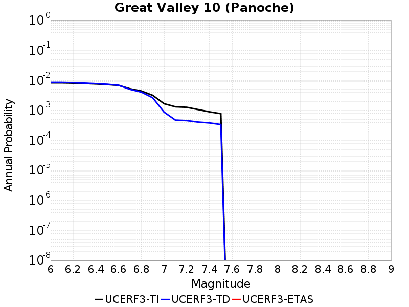 |
|-----|

| Magnitude | UCERF3-TI Prob | UCERF3-TD Prob | UCERF3-ETAS Prob |
|-----|-----|-----|-----|
| 6.0 | 0.008321454 | 0.008597183 | 0.0 |
| 6.1 | 0.008321454 | 0.008597183 | 0.0 |
| 6.2 | 0.008147354 | 0.008402402 | 0.0 |
| 6.3 | 0.007932622 | 0.008156999 | 0.0 |
| 6.4 | 0.007651695 | 0.007834427 | 0.0 |
| 6.5 | 0.0073212404 | 0.0074501387 | 0.0 |
| 6.6 | 0.006862442 | 0.0069153686 | 0.0 |
| 6.7 | 0.0052955584 | 0.005063634 | 0.0 |
| 6.8 | 0.0044554602 | 0.004092521 | 0.0 |
| 6.9 | 0.003202101 | 0.002648749 | 0.0 |
| 7.0 | 0.0016845023 | 8.823031E-4 | 0.0 |
| 7.1 | 0.0013268003 | 4.78099E-4 | 0.0 |
| 7.2 | 0.0012764678 | 4.600091E-4 | 0.0 |
| 7.3 | 0.0010721954 | 4.1069477E-4 | 0.0 |
| 7.4 | 9.0107694E-4 | 3.8444946E-4 | 0.0 |
| 7.5 | 7.825126E-4 | 3.4062008E-4 | 0.0 |

## Great Valley 11
*[(top)](#table-of-contents)*

| 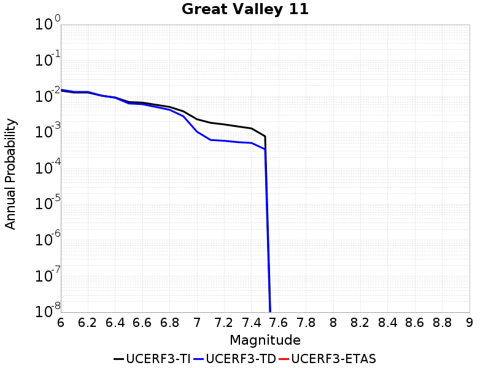 |
|-----|

| Magnitude | UCERF3-TI Prob | UCERF3-TD Prob | UCERF3-ETAS Prob |
|-----|-----|-----|-----|
| 6.0 | 0.0145552 | 0.015424534 | 0.0 |
| 6.1 | 0.012873529 | 0.013409139 | 0.0 |
| 6.2 | 0.012873529 | 0.013409139 | 0.0 |
| 6.3 | 0.01051472 | 0.010573127 | 0.0 |
| 6.4 | 0.009376635 | 0.009222788 | 0.0 |
| 6.5 | 0.007009294 | 0.006398238 | 0.0 |
| 6.6 | 0.006733784 | 0.00609329 | 0.0 |
| 6.7 | 0.005864462 | 0.005098205 | 0.0 |
| 6.8 | 0.005117994 | 0.0042588604 | 0.0 |
| 6.9 | 0.0038654688 | 0.0028153295 | 0.0 |
| 7.0 | 0.0023259693 | 0.0010465299 | 0.0 |
| 7.1 | 0.0018530512 | 6.1685796E-4 | 0.0 |
| 7.2 | 0.0016704041 | 5.85612E-4 | 0.0 |
| 7.3 | 0.0014662122 | 5.363039E-4 | 0.0 |
| 7.4 | 0.0012951613 | 5.1006186E-4 | 0.0 |
| 7.5 | 7.825126E-4 | 3.4062008E-4 | 0.0 |

## Great Valley 12
*[(top)](#table-of-contents)*

|  |
|-----|

| Magnitude | UCERF3-TI Prob | UCERF3-TD Prob | UCERF3-ETAS Prob |
|-----|-----|-----|-----|
| 6.0 | 0.004558956 | 0.00289012 | 0.0 |
| 6.1 | 0.004558956 | 0.00289012 | 0.0 |
| 6.2 | 0.0044249278 | 0.002747468 | 0.0 |
| 6.3 | 0.004262705 | 0.002574869 | 0.0 |
| 6.4 | 0.0041551464 | 0.0024563207 | 0.0 |
| 6.5 | 0.0040985704 | 0.0023939107 | 0.0 |
| 6.6 | 0.003910033 | 0.0021876297 | 0.0 |
| 6.7 | 0.0037133251 | 0.0019680061 | 0.0 |
| 6.8 | 0.0033216903 | 0.00153431 | 0.0 |
| 6.9 | 0.003078753 | 0.0013980105 | 0.0 |
| 7.0 | 0.0027741324 | 0.0011430662 | 0.0 |
| 7.1 | 0.0022563424 | 7.132142E-4 | 0.0 |
| 7.2 | 0.0020737692 | 6.819713E-4 | 0.0 |
| 7.3 | 0.0018696598 | 6.326679E-4 | 0.0 |
| 7.4 | 0.0012951613 | 5.1006186E-4 | 0.0 |
| 7.5 | 7.825126E-4 | 3.4062008E-4 | 0.0 |

## Great Valley 13 (Coalinga)
*[(top)](#table-of-contents)*

|  |
|-----|

| Magnitude | UCERF3-TI Prob | UCERF3-TD Prob | UCERF3-ETAS Prob |
|-----|-----|-----|-----|
| 6.0 | 0.006537495 | 9.493941E-4 | 0.0 |
| 6.1 | 0.006537495 | 9.493941E-4 | 0.0 |
| 6.2 | 0.006537495 | 9.493941E-4 | 0.0 |
| 6.3 | 0.006537495 | 9.493941E-4 | 0.0 |
| 6.4 | 0.006537495 | 9.493941E-4 | 0.0 |
| 6.5 | 0.006537495 | 9.493941E-4 | 0.0 |
| 6.6 | 0.006537495 | 9.493941E-4 | 0.0 |
| 6.7 | 0.006537495 | 9.493941E-4 | 0.0 |
| 6.8 | 0.005578173 | 9.493941E-4 | 0.0 |
| 6.9 | 0.005456226 | 9.47282E-4 | 0.0 |
| 7.0 | 0.0032976097 | 9.446221E-4 | 0.0 |
| 7.1 | 0.0031372732 | 9.1887405E-4 | 0.0 |
| 7.2 | 0.002954861 | 8.8763755E-4 | 0.0 |
| 7.3 | 0.0025447358 | 7.665132E-4 | 0.0 |
| 7.4 | 0.0012951613 | 5.1006186E-4 | 0.0 |
| 7.5 | 7.825126E-4 | 3.4062008E-4 | 0.0 |

## Great Valley 14 (Kettleman Hills)
*[(top)](#table-of-contents)*

|  |
|-----|

| Magnitude | UCERF3-TI Prob | UCERF3-TD Prob | UCERF3-ETAS Prob |
|-----|-----|-----|-----|
| 6.0 | 0.0032328626 | 0.001498003 | 0.0 |
| 6.1 | 0.0032328626 | 0.001498003 | 0.0 |
| 6.2 | 0.0032328626 | 0.001498003 | 0.0 |
| 6.3 | 0.0032328626 | 0.001498003 | 0.0 |
| 6.4 | 0.0032328626 | 0.001498003 | 0.0 |
| 6.5 | 0.0032328626 | 0.001498003 | 0.0 |
| 6.6 | 0.0032328626 | 0.001498003 | 0.0 |
| 6.7 | 0.0032328626 | 0.001498003 | 0.0 |
| 6.8 | 0.0032328626 | 0.001498003 | 0.0 |
| 6.9 | 0.0032328626 | 0.001498003 | 0.0 |
| 7.0 | 0.0032328626 | 0.001498003 | 0.0 |
| 7.1 | 0.0025801011 | 8.1211026E-4 | 0.0 |
| 7.2 | 0.0025801011 | 8.1211026E-4 | 0.0 |
| 7.3 | 0.0023738695 | 7.402773E-4 | 0.0 |
| 7.4 | 0.0012951613 | 5.1006186E-4 | 0.0 |
| 7.5 | 7.825126E-4 | 3.4062008E-4 | 0.0 |

## Green Valley 2011 CFM
*[(top)](#table-of-contents)*

|  |
|-----|

| Magnitude | UCERF3-TI Prob | UCERF3-TD Prob | UCERF3-ETAS Prob |
|-----|-----|-----|-----|
| 6.0 | 0.050659515 | 0.08519561 | 0.1 |
| 6.1 | 0.050279044 | 0.08448344 | 0.1 |
| 6.2 | 0.04934063 | 0.08279454 | 0.1 |
| 6.3 | 0.047246475 | 0.078934 | 0.1 |
| 6.4 | 0.04284265 | 0.07132471 | 0.1 |
| 6.5 | 0.030579966 | 0.049902096 | 0.1 |
| 6.6 | 0.023391623 | 0.037477802 | 0.1 |
| 6.7 | 0.020046256 | 0.03184443 | 0.1 |
| 6.8 | 0.011560607 | 0.016115192 | 0.1 |
| 6.9 | 0.009374191 | 0.012632879 | 0.0 |
| 7.0 | 0.007673672 | 0.010141408 | 0.0 |
| 7.1 | 0.006449148 | 0.008451625 | 0.0 |
| 7.2 | 0.0055074887 | 0.0072205486 | 0.0 |
| 7.3 | 0.004164653 | 0.0054722736 | 0.0 |
| 7.4 | 0.0035195686 | 0.0046390616 | 0.0 |
| 7.5 | 0.002969134 | 0.0039049077 | 0.0 |
| 7.6 | 0.002347194 | 0.0030844978 | 0.0 |
| 7.7 | 5.672055E-4 | 7.334595E-4 | 0.0 |
| 7.8 | 2.5762274E-5 | 3.2202173E-5 | 0.0 |

## Greenville (No) 2011 CFM
*[(top)](#table-of-contents)*

| 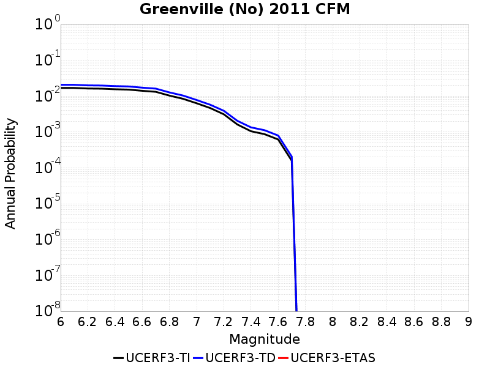 |
|-----|

| Magnitude | UCERF3-TI Prob | UCERF3-TD Prob | UCERF3-ETAS Prob |
|-----|-----|-----|-----|
| 6.0 | 0.017003356 | 0.020797083 | 0.0 |
| 6.1 | 0.017003356 | 0.020797083 | 0.0 |
| 6.2 | 0.01640377 | 0.020064184 | 0.0 |
| 6.3 | 0.016232004 | 0.01985444 | 0.0 |
| 6.4 | 0.015649348 | 0.019143423 | 0.0 |
| 6.5 | 0.01529447 | 0.018712062 | 0.0 |
| 6.6 | 0.014167317 | 0.017336072 | 0.0 |
| 6.7 | 0.013277191 | 0.016299982 | 0.0 |
| 6.8 | 0.0104120495 | 0.012782131 | 0.0 |
| 6.9 | 0.008480361 | 0.010451959 | 0.0 |
| 7.0 | 0.0063729626 | 0.007847079 | 0.0 |
| 7.1 | 0.004683256 | 0.0057926863 | 0.0 |
| 7.2 | 0.0031400328 | 0.0039289836 | 0.0 |
| 7.3 | 0.0016271701 | 0.0020580466 | 0.0 |
| 7.4 | 0.0010562785 | 0.0013540643 | 0.0 |
| 7.5 | 8.743095E-4 | 0.0011271952 | 0.0 |
| 7.6 | 6.2258187E-4 | 8.0110424E-4 | 0.0 |
| 7.7 | 1.5894524E-4 | 2.0668919E-4 | 0.0 |

## Greenville (So) 2011 CFM
*[(top)](#table-of-contents)*

| 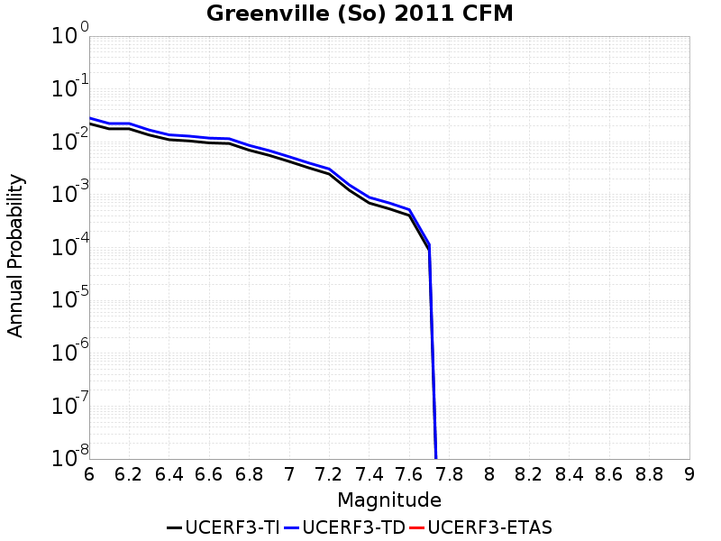 |
|-----|

| Magnitude | UCERF3-TI Prob | UCERF3-TD Prob | UCERF3-ETAS Prob |
|-----|-----|-----|-----|
| 6.0 | 0.022083808 | 0.028253028 | 0.0 |
| 6.1 | 0.01760369 | 0.022237614 | 0.0 |
| 6.2 | 0.01760369 | 0.022237614 | 0.0 |
| 6.3 | 0.013452509 | 0.01673864 | 0.0 |
| 6.4 | 0.01097266 | 0.01354229 | 0.0 |
| 6.5 | 0.010397541 | 0.012822329 | 0.0 |
| 6.6 | 0.009552629 | 0.011772682 | 0.0 |
| 6.7 | 0.009288026 | 0.011449086 | 0.0 |
| 6.8 | 0.0069538904 | 0.0085521145 | 0.0 |
| 6.9 | 0.005551645 | 0.0068197534 | 0.0 |
| 7.0 | 0.004247444 | 0.0052201897 | 0.0 |
| 7.1 | 0.0032021382 | 0.0039578388 | 0.0 |
| 7.2 | 0.0024564038 | 0.0030689794 | 0.0 |
| 7.3 | 0.0012132627 | 0.0015311423 | 0.0 |
| 7.4 | 6.9446466E-4 | 8.895845E-4 | 0.0 |
| 7.5 | 5.405776E-4 | 6.965603E-4 | 0.0 |
| 7.6 | 4.050734E-4 | 5.2122754E-4 | 0.0 |
| 7.7 | 8.8322755E-5 | 1.1433292E-4 | 0.0 |

## Hartley Springs 2011 CFM
*[(top)](#table-of-contents)*

|  |
|-----|

| Magnitude | UCERF3-TI Prob | UCERF3-TD Prob | UCERF3-ETAS Prob |
|-----|-----|-----|-----|
| 6.0 | 0.007460968 | 0.0075091333 | 0.0 |
| 6.1 | 0.007460968 | 0.0075091333 | 0.0 |
| 6.2 | 0.007460968 | 0.0075091333 | 0.0 |
| 6.3 | 0.007460968 | 0.0075091333 | 0.0 |
| 6.4 | 0.007460968 | 0.0075091333 | 0.0 |
| 6.5 | 0.0063870098 | 0.006317449 | 0.0 |
| 6.6 | 0.0063870098 | 0.006317449 | 0.0 |
| 6.7 | 0.0011098806 | 4.599593E-4 | 0.0 |
| 6.8 | 0.0010457177 | 4.4059774E-4 | 0.0 |
| 6.9 | 0.0010457177 | 4.4059774E-4 | 0.0 |
| 7.0 | 9.5789164E-4 | 4.2625362E-4 | 0.0 |
| 7.1 | 7.874823E-4 | 3.7190283E-4 | 0.0 |
| 7.2 | 7.0369354E-4 | 3.3107292E-4 | 0.0 |
| 7.3 | 4.121267E-4 | 2.105891E-4 | 0.0 |

## Hat Creek-McArthur-Mayfield
*[(top)](#table-of-contents)*

|  |
|-----|

| Magnitude | UCERF3-TI Prob | UCERF3-TD Prob | UCERF3-ETAS Prob |
|-----|-----|-----|-----|
| 6.0 | 0.02048922 | 0.022260109 | 0.0 |
| 6.1 | 0.01298276 | 0.014017856 | 0.0 |
| 6.2 | 0.01298276 | 0.014017856 | 0.0 |
| 6.3 | 0.008636732 | 0.00928551 | 0.0 |
| 6.4 | 0.008636732 | 0.00928551 | 0.0 |
| 6.5 | 0.006964916 | 0.007476342 | 0.0 |
| 6.6 | 0.005794574 | 0.00621402 | 0.0 |
| 6.7 | 0.0036562826 | 0.003915624 | 0.0 |
| 6.8 | 0.0030947074 | 0.003313579 | 0.0 |
| 6.9 | 0.002152571 | 0.002303863 | 0.0 |
| 7.0 | 0.0013824535 | 0.0014783853 | 0.0 |
| 7.1 | 6.7770475E-4 | 7.2499545E-4 | 0.0 |
| 7.2 | 2.5919956E-4 | 2.777286E-4 | 0.0 |

## Hayward (No) 2011 CFM
*[(top)](#table-of-contents)*

|  |
|-----|

| Magnitude | UCERF3-TI Prob | UCERF3-TD Prob | UCERF3-ETAS Prob |
|-----|-----|-----|-----|
| 6.0 | 0.047403704 | 0.08572448 | 0.0 |
| 6.1 | 0.046153355 | 0.08362328 | 0.0 |
| 6.2 | 0.0459107 | 0.08324882 | 0.0 |
| 6.3 | 0.04504866 | 0.0817458 | 0.0 |
| 6.4 | 0.043514993 | 0.07904797 | 0.0 |
| 6.5 | 0.04164765 | 0.07588693 | 0.0 |
| 6.6 | 0.04082218 | 0.07448301 | 0.0 |
| 6.7 | 0.039771806 | 0.072763786 | 0.0 |
| 6.8 | 0.037518036 | 0.06870154 | 0.0 |
| 6.9 | 0.033137884 | 0.060687296 | 0.0 |
| 7.0 | 0.027709642 | 0.050485153 | 0.0 |
| 7.1 | 0.022854926 | 0.041401967 | 0.0 |
| 7.2 | 0.017051157 | 0.031003665 | 0.0 |
| 7.3 | 0.0127141625 | 0.023140771 | 0.0 |
| 7.4 | 0.009777189 | 0.017770572 | 0.0 |
| 7.5 | 0.00657237 | 0.011816646 | 0.0 |
| 7.6 | 0.0024319198 | 0.004389535 | 0.0 |
| 7.7 | 2.0034213E-4 | 3.7330596E-4 | 0.0 |
| 7.8 | 1.3376492E-4 | 2.814358E-4 | 0.0 |
| 7.9 | 8.943657E-5 | 1.9495958E-4 | 0.0 |
| 8.0 | 6.161523E-5 | 1.429795E-4 | 0.0 |
| 8.1 | 2.6811784E-5 | 5.806589E-5 | 0.0 |

## Hayward (So) 2011 CFM
*[(top)](#table-of-contents)*

|  |
|-----|

| Magnitude | UCERF3-TI Prob | UCERF3-TD Prob | UCERF3-ETAS Prob |
|-----|-----|-----|-----|
| 6.0 | 0.090090066 | 0.16551688 | 0.0 |
| 6.1 | 0.090090066 | 0.16551688 | 0.0 |
| 6.2 | 0.090090066 | 0.16551688 | 0.0 |
| 6.3 | 0.08643075 | 0.15947199 | 0.0 |
| 6.4 | 0.081704415 | 0.15138209 | 0.0 |
| 6.5 | 0.078181036 | 0.14568254 | 0.0 |
| 6.6 | 0.07067384 | 0.13280694 | 0.0 |
| 6.7 | 0.058094822 | 0.11171208 | 0.0 |
| 6.8 | 0.047804173 | 0.09171213 | 0.0 |
| 6.9 | 0.028553981 | 0.053644575 | 0.0 |
| 7.0 | 0.022015138 | 0.04157528 | 0.0 |
| 7.1 | 0.017101998 | 0.032035783 | 0.0 |
| 7.2 | 0.015458403 | 0.029057225 | 0.0 |
| 7.3 | 0.012733313 | 0.023532532 | 0.0 |
| 7.4 | 0.009866194 | 0.017998368 | 0.0 |
| 7.5 | 0.006648007 | 0.0120266965 | 0.0 |
| 7.6 | 0.0025092314 | 0.004601165 | 0.0 |
| 7.7 | 3.1739488E-4 | 6.298237E-4 | 0.0 |
| 7.8 | 2.3760769E-4 | 5.120638E-4 | 0.0 |
| 7.9 | 1.7226185E-4 | 3.8473587E-4 | 0.0 |
| 8.0 | 1.2245761E-4 | 2.8343403E-4 | 0.0 |
| 8.1 | 6.199812E-5 | 1.3452797E-4 | 0.0 |

## Hayward (So) extension 2011 CFM
*[(top)](#table-of-contents)*

| 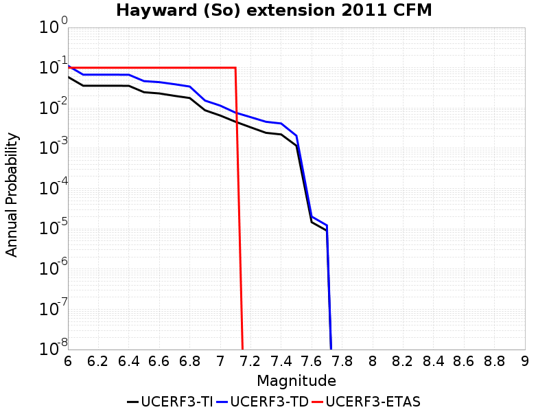 |
|-----|

| Magnitude | UCERF3-TI Prob | UCERF3-TD Prob | UCERF3-ETAS Prob |
|-----|-----|-----|-----|
| 6.0 | 0.0593305 | 0.1123638 | 0.1 |
| 6.1 | 0.035825435 | 0.06739893 | 0.1 |
| 6.2 | 0.035825435 | 0.06739893 | 0.1 |
| 6.3 | 0.035720866 | 0.067248136 | 0.1 |
| 6.4 | 0.03562429 | 0.06709252 | 0.1 |
| 6.5 | 0.02466527 | 0.046542645 | 0.1 |
| 6.6 | 0.02303517 | 0.04394459 | 0.1 |
| 6.7 | 0.020065336 | 0.03900482 | 0.1 |
| 6.8 | 0.017698295 | 0.034127556 | 0.1 |
| 6.9 | 0.008793819 | 0.015305657 | 0.1 |
| 7.0 | 0.0065061417 | 0.011463846 | 0.1 |
| 7.1 | 0.0045560603 | 0.0076780375 | 0.1 |
| 7.2 | 0.0033101442 | 0.0059265266 | 0.0 |
| 7.3 | 0.0024210536 | 0.0045509133 | 0.0 |
| 7.4 | 0.0022069993 | 0.0041281027 | 0.0 |
| 7.5 | 0.0011570391 | 0.0020492054 | 0.0 |
| 7.6 | 1.4585107E-5 | 2.0115554E-5 | 0.0 |
| 7.7 | 8.970877E-6 | 1.2165318E-5 | 0.0 |

## Hector Mine
*[(top)](#table-of-contents)*

|  |
|-----|

| Magnitude | UCERF3-TI Prob | UCERF3-TD Prob | UCERF3-ETAS Prob |
|-----|-----|-----|-----|
| 6.0 | 0.009741086 | 0.0014554778 | 0.0 |
| 6.1 | 0.009741086 | 0.0014554778 | 0.0 |
| 6.2 | 0.009741086 | 0.0014554778 | 0.0 |
| 6.3 | 0.009741086 | 0.0014554778 | 0.0 |
| 6.4 | 0.0056651547 | 0.0014554778 | 0.0 |
| 6.5 | 0.0056651547 | 0.0014554778 | 0.0 |
| 6.6 | 0.0055835294 | 0.0014554778 | 0.0 |
| 6.7 | 0.0041039353 | 0.0014424653 | 0.0 |
| 6.8 | 0.0039412836 | 0.001422696 | 0.0 |
| 6.9 | 0.0033718573 | 0.0013089114 | 0.0 |
| 7.0 | 0.0026034506 | 9.666685E-4 | 0.0 |
| 7.1 | 6.779636E-4 | 8.10017E-5 | 0.0 |
| 7.2 | 4.3782333E-4 | 5.057753E-5 | 0.0 |
| 7.3 | 1.6331344E-4 | 2.5120991E-5 | 0.0 |

## Helendale-So Lockhart
*[(top)](#table-of-contents)*

| 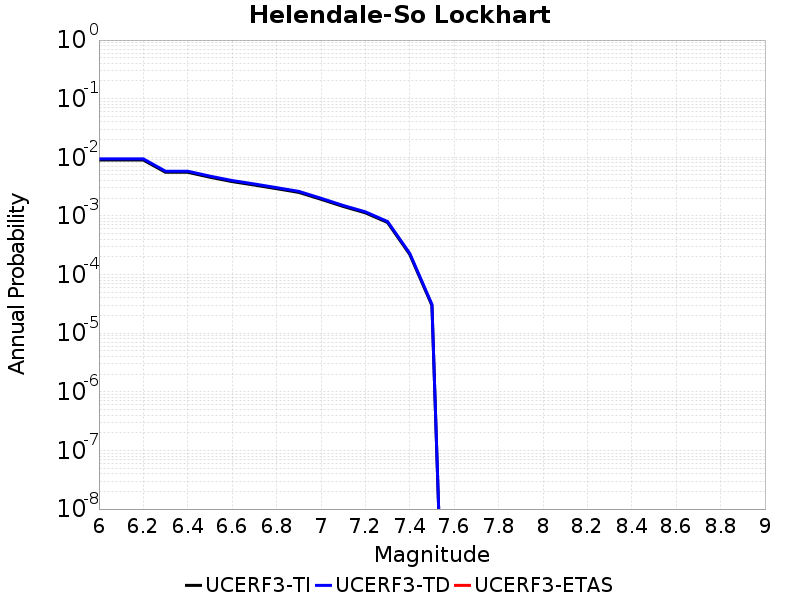 |
|-----|

| Magnitude | UCERF3-TI Prob | UCERF3-TD Prob | UCERF3-ETAS Prob |
|-----|-----|-----|-----|
| 6.0 | 0.008984311 | 0.0093995435 | 0.0 |
| 6.1 | 0.008984311 | 0.0093995435 | 0.0 |
| 6.2 | 0.008984311 | 0.0093995435 | 0.0 |
| 6.3 | 0.0055515557 | 0.005791154 | 0.0 |
| 6.4 | 0.0055515557 | 0.005791154 | 0.0 |
| 6.5 | 0.0045760344 | 0.0047714855 | 0.0 |
| 6.6 | 0.003852198 | 0.0040160846 | 0.0 |
| 6.7 | 0.0033650869 | 0.0035081557 | 0.0 |
| 6.8 | 0.0029177975 | 0.0030392518 | 0.0 |
| 6.9 | 0.002521806 | 0.0026250123 | 0.0 |
| 7.0 | 0.0019255003 | 0.0020035435 | 0.0 |
| 7.1 | 0.0014525814 | 0.0015103082 | 0.0 |
| 7.2 | 0.0011301794 | 0.0011749504 | 0.0 |
| 7.3 | 7.731704E-4 | 8.040579E-4 | 0.0 |
| 7.4 | 2.2080299E-4 | 2.3003039E-4 | 0.0 |
| 7.5 | 2.9711247E-5 | 3.0987787E-5 | 0.0 |

## Hilton Creek 2011 CFM
*[(top)](#table-of-contents)*

|  |
|-----|

| Magnitude | UCERF3-TI Prob | UCERF3-TD Prob | UCERF3-ETAS Prob |
|-----|-----|-----|-----|
| 6.0 | 0.012920785 | 0.0023131622 | 0.0 |
| 6.1 | 0.012920785 | 0.0023131622 | 0.0 |
| 6.2 | 0.012920785 | 0.0023131622 | 0.0 |
| 6.3 | 0.012920785 | 0.0023131622 | 0.0 |
| 6.4 | 0.012920785 | 0.0023131622 | 0.0 |
| 6.5 | 0.011395155 | 0.002150837 | 0.0 |
| 6.6 | 0.011395155 | 0.002150837 | 0.0 |
| 6.7 | 0.0100703845 | 0.0020834072 | 0.0 |
| 6.8 | 0.009954433 | 0.0020280264 | 0.0 |
| 6.9 | 0.0033758266 | 0.0016784961 | 0.0 |
| 7.0 | 0.002807605 | 0.0014483993 | 0.0 |
| 7.1 | 0.0023022245 | 0.0012245666 | 0.0 |
| 7.2 | 0.0013221119 | 5.80867E-4 | 0.0 |
| 7.3 | 4.121267E-4 | 2.105891E-4 | 0.0 |

## Hollywood
*[(top)](#table-of-contents)*

|  |
|-----|

| Magnitude | UCERF3-TI Prob | UCERF3-TD Prob | UCERF3-ETAS Prob |
|-----|-----|-----|-----|
| 6.0 | 0.0064745755 | 0.006543307 | 0.0 |
| 6.1 | 0.0064745755 | 0.006543307 | 0.0 |
| 6.2 | 0.0064745755 | 0.006543307 | 0.0 |
| 6.3 | 0.0064745755 | 0.006543307 | 0.0 |
| 6.4 | 0.0064653796 | 0.006533267 | 0.0 |
| 6.5 | 0.0058488925 | 0.005882116 | 0.0 |
| 6.6 | 0.005844661 | 0.0058775106 | 0.0 |
| 6.7 | 0.0058422405 | 0.005874788 | 0.0 |
| 6.8 | 0.005335517 | 0.0053122975 | 0.0 |
| 6.9 | 0.0048161 | 0.004737581 | 0.0 |
| 7.0 | 0.004412184 | 0.004295419 | 0.0 |
| 7.1 | 0.0034605677 | 0.0032619454 | 0.0 |
| 7.2 | 0.0028912104 | 0.0026591395 | 0.0 |
| 7.3 | 0.0022442779 | 0.0020615784 | 0.0 |
| 7.4 | 0.0014886294 | 0.0014066183 | 0.0 |
| 7.5 | 0.0010392254 | 9.881407E-4 | 0.0 |
| 7.6 | 7.0159987E-4 | 6.360997E-4 | 0.0 |
| 7.7 | 4.0083472E-4 | 3.2663514E-4 | 0.0 |
| 7.8 | 1.907578E-4 | 1.2726386E-4 | 0.0 |
| 7.9 | 3.9145907E-5 | 2.7955464E-5 | 0.0 |

## Holser alt 1
*[(top)](#table-of-contents)*

| 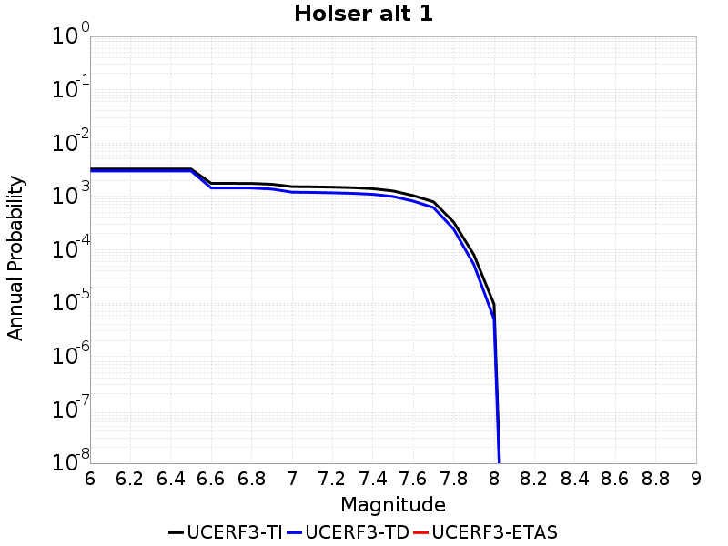 |
|-----|

| Magnitude | UCERF3-TI Prob | UCERF3-TD Prob | UCERF3-ETAS Prob |
|-----|-----|-----|-----|
| 6.0 | 0.0032686873 | 0.0030153936 | 0.0 |
| 6.1 | 0.0032686873 | 0.0030153936 | 0.0 |
| 6.2 | 0.0032686873 | 0.0030153936 | 0.0 |
| 6.3 | 0.0032686873 | 0.0030153936 | 0.0 |
| 6.4 | 0.0032686873 | 0.0030153936 | 0.0 |
| 6.5 | 0.0032686873 | 0.0030153936 | 0.0 |
| 6.6 | 0.0017599097 | 0.0014431892 | 0.0 |
| 6.7 | 0.0017599097 | 0.0014431892 | 0.0 |
| 6.8 | 0.0017550698 | 0.0014381888 | 0.0 |
| 6.9 | 0.0016960226 | 0.0013768441 | 0.0 |
| 7.0 | 0.0015295728 | 0.0012038854 | 0.0 |
| 7.1 | 0.0015166114 | 0.0011913097 | 0.0 |
| 7.2 | 0.0014950791 | 0.0011704253 | 0.0 |
| 7.3 | 0.0014629456 | 0.0011432999 | 0.0 |
| 7.4 | 0.0013993206 | 0.0010984542 | 0.0 |
| 7.5 | 0.0012694797 | 9.997571E-4 | 0.0 |
| 7.6 | 0.0010385747 | 8.1948494E-4 | 0.0 |
| 7.7 | 7.943385E-4 | 6.197508E-4 | 0.0 |
| 7.8 | 3.31224E-4 | 2.4420454E-4 | 0.0 |
| 7.9 | 8.066186E-5 | 5.3064126E-5 | 0.0 |
| 8.0 | 9.552709E-6 | 5.0301323E-6 | 0.0 |

## Homestead Valley 2011
*[(top)](#table-of-contents)*

| 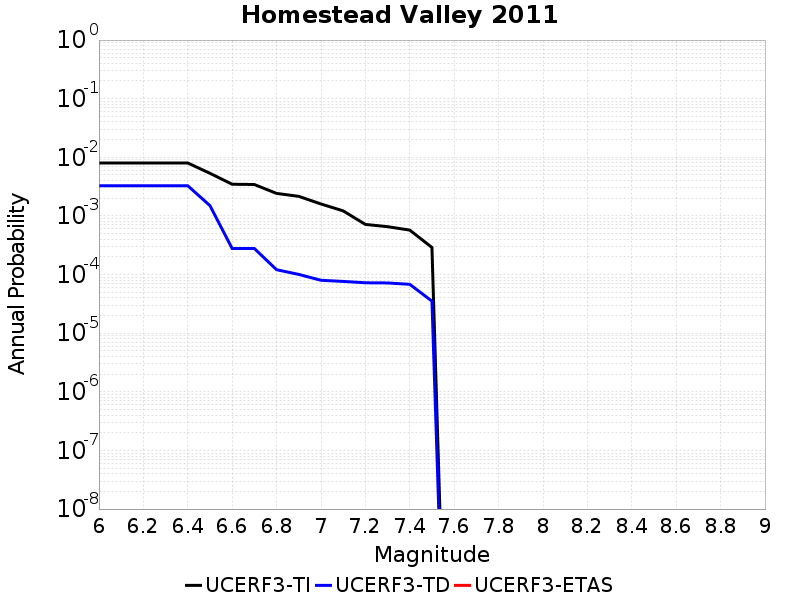 |
|-----|

| Magnitude | UCERF3-TI Prob | UCERF3-TD Prob | UCERF3-ETAS Prob |
|-----|-----|-----|-----|
| 6.0 | 0.008002302 | 0.003274405 | 0.0 |
| 6.1 | 0.008002302 | 0.003274405 | 0.0 |
| 6.2 | 0.008002302 | 0.003274405 | 0.0 |
| 6.3 | 0.008002302 | 0.003274405 | 0.0 |
| 6.4 | 0.008002302 | 0.003274405 | 0.0 |
| 6.5 | 0.005341973 | 0.0015004516 | 0.0 |
| 6.6 | 0.003471502 | 2.7839973E-4 | 0.0 |
| 6.7 | 0.0034354846 | 2.7839973E-4 | 0.0 |
| 6.8 | 0.0024224254 | 1.2098968E-4 | 0.0 |
| 6.9 | 0.0021593515 | 1.00582205E-4 | 0.0 |
| 7.0 | 0.0015992324 | 7.9899044E-5 | 0.0 |
| 7.1 | 0.00122068 | 7.637149E-5 | 0.0 |
| 7.2 | 7.174166E-4 | 7.240669E-5 | 0.0 |
| 7.3 | 6.558388E-4 | 7.191112E-5 | 0.0 |
| 7.4 | 5.734978E-4 | 6.8164496E-5 | 0.0 |
| 7.5 | 2.899098E-4 | 3.5228746E-5 | 0.0 |

## Honey Lake 2011 CFM
*[(top)](#table-of-contents)*

| 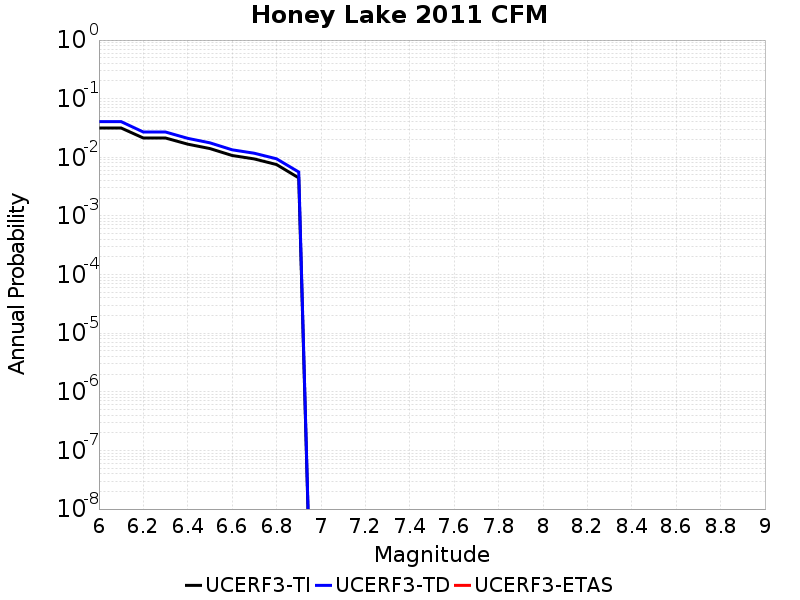 |
|-----|

| Magnitude | UCERF3-TI Prob | UCERF3-TD Prob | UCERF3-ETAS Prob |
|-----|-----|-----|-----|
| 6.0 | 0.03160919 | 0.04058505 | 0.0 |
| 6.1 | 0.03160919 | 0.04058505 | 0.0 |
| 6.2 | 0.021337535 | 0.027002322 | 0.0 |
| 6.3 | 0.021337535 | 0.027002322 | 0.0 |
| 6.4 | 0.016760793 | 0.021063317 | 0.0 |
| 6.5 | 0.014095354 | 0.017656162 | 0.0 |
| 6.6 | 0.010739161 | 0.0134256445 | 0.0 |
| 6.7 | 0.009379748 | 0.011730247 | 0.0 |
| 6.8 | 0.007524277 | 0.009425104 | 0.0 |
| 6.9 | 0.0044589094 | 0.005612573 | 0.0 |

## Hosgri
*[(top)](#table-of-contents)*

| 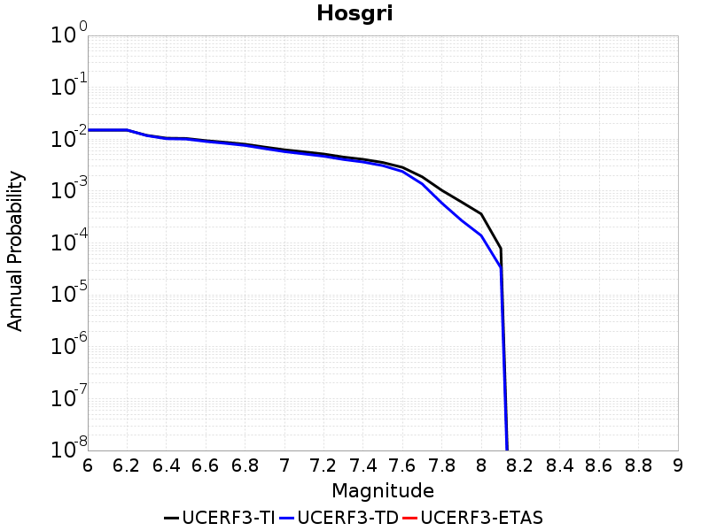 |
|-----|

| Magnitude | UCERF3-TI Prob | UCERF3-TD Prob | UCERF3-ETAS Prob |
|-----|-----|-----|-----|
| 6.0 | 0.01493574 | 0.015068998 | 0.0 |
| 6.1 | 0.01493574 | 0.015068998 | 0.0 |
| 6.2 | 0.01493574 | 0.015068998 | 0.0 |
| 6.3 | 0.011885363 | 0.011730648 | 0.0 |
| 6.4 | 0.010482626 | 0.010211611 | 0.0 |
| 6.5 | 0.010342481 | 0.0100631695 | 0.0 |
| 6.6 | 0.009398366 | 0.009055731 | 0.0 |
| 6.7 | 0.008707017 | 0.008324028 | 0.0 |
| 6.8 | 0.008003947 | 0.0075849616 | 0.0 |
| 6.9 | 0.007053386 | 0.0065887263 | 0.0 |
| 7.0 | 0.006257884 | 0.0057626893 | 0.0 |
| 7.1 | 0.0057090693 | 0.0052058394 | 0.0 |
| 7.2 | 0.00518453 | 0.00469343 | 0.0 |
| 7.3 | 0.00452975 | 0.0040670126 | 0.0 |
| 7.4 | 0.004096119 | 0.003636161 | 0.0 |
| 7.5 | 0.0035616932 | 0.0030961602 | 0.0 |
| 7.6 | 0.002867472 | 0.0023866198 | 0.0 |
| 7.7 | 0.0018842196 | 0.0013760038 | 0.0 |
| 7.8 | 0.0010353916 | 5.8744557E-4 | 0.0 |
| 7.9 | 6.1649614E-4 | 2.72441E-4 | 0.0 |
| 8.0 | 3.6325134E-4 | 1.3911437E-4 | 0.0 |
| 8.1 | 7.843835E-5 | 3.3389373E-5 | 0.0 |

## Hosgri (Extension)
*[(top)](#table-of-contents)*

| 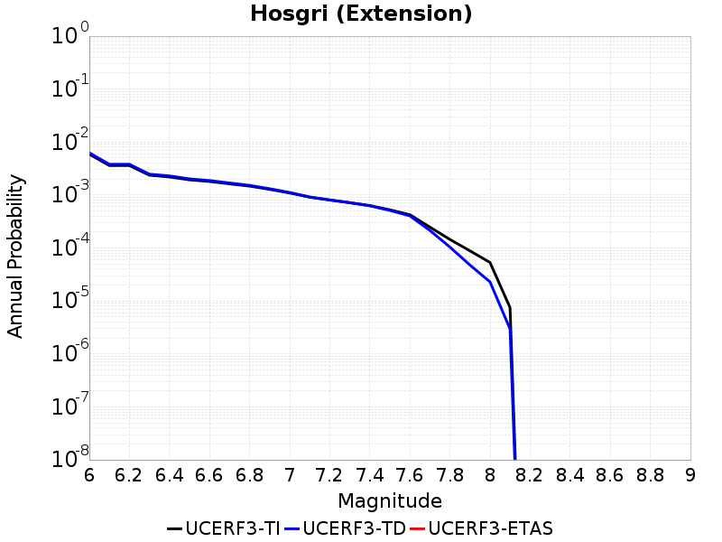 |
|-----|

| Magnitude | UCERF3-TI Prob | UCERF3-TD Prob | UCERF3-ETAS Prob |
|-----|-----|-----|-----|
| 6.0 | 0.005914725 | 0.0062822346 | 0.0 |
| 6.1 | 0.0036120464 | 0.003811693 | 0.0 |
| 6.2 | 0.0036120464 | 0.003811693 | 0.0 |
| 6.3 | 0.0023705168 | 0.002483178 | 0.0 |
| 6.4 | 0.002198526 | 0.0022998222 | 0.0 |
| 6.5 | 0.0019377962 | 0.0020224894 | 0.0 |
| 6.6 | 0.0018040152 | 0.0018790849 | 0.0 |
| 6.7 | 0.001628441 | 0.0016908117 | 0.0 |
| 6.8 | 0.0014750857 | 0.0015263015 | 0.0 |
| 6.9 | 0.0012797028 | 0.0013168824 | 0.0 |
| 7.0 | 0.0010955755 | 0.0011197971 | 0.0 |
| 7.1 | 9.097813E-4 | 9.2121883E-4 | 0.0 |
| 7.2 | 8.0617814E-4 | 8.1059366E-4 | 0.0 |
| 7.3 | 7.185085E-4 | 7.1697746E-4 | 0.0 |
| 7.4 | 6.335037E-4 | 6.261761E-4 | 0.0 |
| 7.5 | 5.2692357E-4 | 5.125076E-4 | 0.0 |
| 7.6 | 4.2546875E-4 | 4.0429586E-4 | 0.0 |
| 7.7 | 2.482253E-4 | 2.14819E-4 | 0.0 |
| 7.8 | 1.4519131E-4 | 1.0398739E-4 | 0.0 |
| 7.9 | 8.842879E-5 | 4.7686695E-5 | 0.0 |
| 8.0 | 5.335374E-5 | 2.2947566E-5 | 0.0 |
| 8.1 | 7.4986247E-6 | 2.9585976E-6 | 0.0 |

## Hunter Mountain-Saline Valley
*[(top)](#table-of-contents)*

|  |
|-----|

| Magnitude | UCERF3-TI Prob | UCERF3-TD Prob | UCERF3-ETAS Prob |
|-----|-----|-----|-----|
| 6.0 | 0.023260195 | 0.028013024 | 0.0 |
| 6.1 | 0.023260195 | 0.028013024 | 0.0 |
| 6.2 | 0.020330196 | 0.024206055 | 0.0 |
| 6.3 | 0.020330196 | 0.024206055 | 0.0 |
| 6.4 | 0.016718714 | 0.019562434 | 0.0 |
| 6.5 | 0.016718714 | 0.019562434 | 0.0 |
| 6.6 | 0.015175272 | 0.017636573 | 0.0 |
| 6.7 | 0.014414776 | 0.016696377 | 0.0 |
| 6.8 | 0.01213047 | 0.013887389 | 0.0 |
| 6.9 | 0.010738871 | 0.012192347 | 0.0 |
| 7.0 | 0.009070295 | 0.010164445 | 0.0 |
| 7.1 | 0.007696735 | 0.008517357 | 0.0 |
| 7.2 | 0.0073716943 | 0.008133385 | 0.0 |
| 7.3 | 0.007138774 | 0.007861466 | 0.0 |
| 7.4 | 0.006661878 | 0.0073121125 | 0.0 |
| 7.5 | 0.006032217 | 0.006635768 | 0.0 |
| 7.6 | 0.0015629337 | 0.0017294228 | 0.0 |

## Hunting Creek - Bartlett Springs connector 2011
*[(top)](#table-of-contents)*

|  |
|-----|

| Magnitude | UCERF3-TI Prob | UCERF3-TD Prob | UCERF3-ETAS Prob |
|-----|-----|-----|-----|
| 6.0 | 0.025447546 | 0.03465734 | 0.1 |
| 6.1 | 0.025447546 | 0.03465734 | 0.1 |
| 6.2 | 0.02306703 | 0.031213835 | 0.1 |
| 6.3 | 0.02306703 | 0.031213835 | 0.1 |
| 6.4 | 0.02065605 | 0.027738653 | 0.1 |
| 6.5 | 0.019649856 | 0.026306171 | 0.1 |
| 6.6 | 0.018884527 | 0.025226137 | 0.1 |
| 6.7 | 0.017441148 | 0.02320529 | 0.1 |
| 6.8 | 0.015352124 | 0.02029032 | 0.1 |
| 6.9 | 0.014816469 | 0.019478856 | 0.0 |
| 7.0 | 0.013833242 | 0.018079909 | 0.0 |
| 7.1 | 0.012733897 | 0.01652145 | 0.0 |
| 7.2 | 0.011907627 | 0.015400092 | 0.0 |
| 7.3 | 0.011030397 | 0.014230122 | 0.0 |
| 7.4 | 0.009753612 | 0.012569574 | 0.0 |
| 7.5 | 0.008959615 | 0.011521867 | 0.0 |
| 7.6 | 0.0055435603 | 0.0071155927 | 0.0 |
| 7.7 | 0.0017132863 | 0.002126476 | 0.0 |
| 7.8 | 2.705359E-4 | 3.1112297E-4 | 0.0 |

## Hunting Creek - Berryessa 2011 CFM
*[(top)](#table-of-contents)*

| 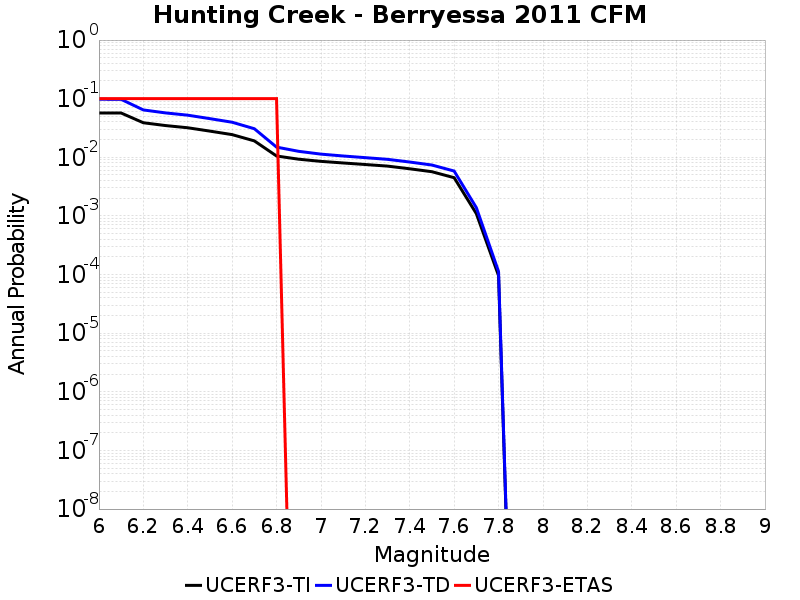 |
|-----|

| Magnitude | UCERF3-TI Prob | UCERF3-TD Prob | UCERF3-ETAS Prob |
|-----|-----|-----|-----|
| 6.0 | 0.057117578 | 0.09766134 | 0.1 |
| 6.1 | 0.056962132 | 0.097420715 | 0.1 |
| 6.2 | 0.038862433 | 0.06430467 | 0.1 |
| 6.3 | 0.034799766 | 0.057201907 | 0.1 |
| 6.4 | 0.03191742 | 0.052307587 | 0.1 |
| 6.5 | 0.027970633 | 0.045659687 | 0.1 |
| 6.6 | 0.02437869 | 0.039650463 | 0.1 |
| 6.7 | 0.019057442 | 0.030730393 | 0.1 |
| 6.8 | 0.010532344 | 0.014927732 | 0.1 |
| 6.9 | 0.009281595 | 0.012644845 | 0.0 |
| 7.0 | 0.008528882 | 0.011332557 | 0.0 |
| 7.1 | 0.00800848 | 0.010532711 | 0.0 |
| 7.2 | 0.0075360634 | 0.00986759 | 0.0 |
| 7.3 | 0.0070790765 | 0.009233634 | 0.0 |
| 7.4 | 0.0063729943 | 0.008305505 | 0.0 |
| 7.5 | 0.0056782532 | 0.007383696 | 0.0 |
| 7.6 | 0.00448937 | 0.0058290754 | 0.0 |
| 7.7 | 0.0010948193 | 0.0013843718 | 0.0 |
| 7.8 | 9.615166E-5 | 1.12930415E-4 | 0.0 |

## Imperial
*[(top)](#table-of-contents)*

| 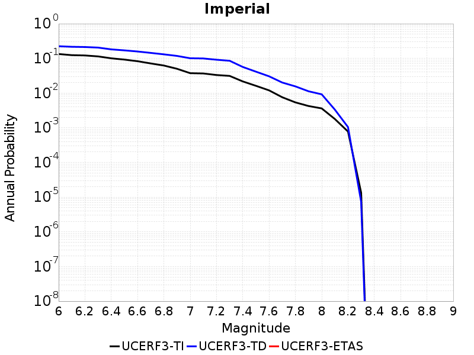 |
|-----|

| Magnitude | UCERF3-TI Prob | UCERF3-TD Prob | UCERF3-ETAS Prob |
|-----|-----|-----|-----|
| 6.0 | 0.13367249 | 0.22422445 | 0.0 |
| 6.1 | 0.123940155 | 0.21604578 | 0.0 |
| 6.2 | 0.12148927 | 0.21258828 | 0.0 |
| 6.3 | 0.11405133 | 0.2048073 | 0.0 |
| 6.4 | 0.100537635 | 0.18194368 | 0.0 |
| 6.5 | 0.0922623 | 0.17031501 | 0.0 |
| 6.6 | 0.08291132 | 0.15799904 | 0.0 |
| 6.7 | 0.07153955 | 0.14399047 | 0.0 |
| 6.8 | 0.06225166 | 0.13080983 | 0.0 |
| 6.9 | 0.05014893 | 0.11782751 | 0.0 |
| 7.0 | 0.037471764 | 0.100917764 | 0.0 |
| 7.1 | 0.03675245 | 0.09957016 | 0.0 |
| 7.2 | 0.033177625 | 0.09141284 | 0.0 |
| 7.3 | 0.031268585 | 0.08550594 | 0.0 |
| 7.4 | 0.02167372 | 0.05660124 | 0.0 |
| 7.5 | 0.016201803 | 0.04144488 | 0.0 |
| 7.6 | 0.011967761 | 0.030432042 | 0.0 |
| 7.7 | 0.007582182 | 0.020130578 | 0.0 |
| 7.8 | 0.0053875 | 0.01559196 | 0.0 |
| 7.9 | 0.004237258 | 0.011269196 | 0.0 |
| 8.0 | 0.0036135751 | 0.009198093 | 0.0 |
| 8.1 | 0.0017874148 | 0.0033345928 | 0.0 |
| 8.2 | 7.775182E-4 | 0.001045809 | 0.0 |
| 8.3 | 1.344007E-5 | 7.2896523E-6 | 0.0 |

## Incline Village 2011 CFM
*[(top)](#table-of-contents)*

|  |
|-----|

| Magnitude | UCERF3-TI Prob | UCERF3-TD Prob | UCERF3-ETAS Prob |
|-----|-----|-----|-----|
| 6.0 | 0.0034025894 | 5.3855666E-4 | 0.0 |
| 6.1 | 0.0034025894 | 5.3855666E-4 | 0.0 |
| 6.2 | 0.0034025894 | 5.3855666E-4 | 0.0 |
| 6.3 | 0.0034025894 | 5.3855666E-4 | 0.0 |
| 6.4 | 0.0024146605 | 5.30538E-4 | 0.0 |
| 6.5 | 0.0024146605 | 5.30538E-4 | 0.0 |
| 6.6 | 0.001279959 | 5.2557135E-4 | 0.0 |
| 6.7 | 9.6541987E-4 | 3.1788019E-4 | 0.0 |

## Independence rev 2011
*[(top)](#table-of-contents)*

|  |
|-----|

| Magnitude | UCERF3-TI Prob | UCERF3-TD Prob | UCERF3-ETAS Prob |
|-----|-----|-----|-----|
| 6.0 | 0.0023047708 | 0.002254397 | 0.0 |
| 6.1 | 0.0023047708 | 0.002254397 | 0.0 |
| 6.2 | 0.0023047708 | 0.002254397 | 0.0 |
| 6.3 | 0.0023047708 | 0.002254397 | 0.0 |
| 6.4 | 0.0023047708 | 0.002254397 | 0.0 |
| 6.5 | 0.0023047708 | 0.002254397 | 0.0 |
| 6.6 | 0.0013889399 | 0.0013197855 | 0.0 |
| 6.7 | 0.0013889399 | 0.0013197855 | 0.0 |
| 6.8 | 0.0010282523 | 9.551326E-4 | 0.0 |
| 6.9 | 9.798837E-4 | 9.086191E-4 | 0.0 |
| 7.0 | 7.8474457E-4 | 7.220171E-4 | 0.0 |
| 7.1 | 6.636695E-4 | 6.0607365E-4 | 0.0 |
| 7.2 | 5.4339116E-4 | 4.9059384E-4 | 0.0 |
| 7.3 | 4.144738E-4 | 3.7723096E-4 | 0.0 |
| 7.4 | 2.8116882E-4 | 2.6174588E-4 | 0.0 |
| 7.5 | 2.0270412E-4 | 1.9204635E-4 | 0.0 |
| 7.6 | 1.2599962E-4 | 1.2234594E-4 | 0.0 |
| 7.7 | 3.5636294E-5 | 3.5779092E-5 | 0.0 |

## Jess Valley
*[(top)](#table-of-contents)*

| 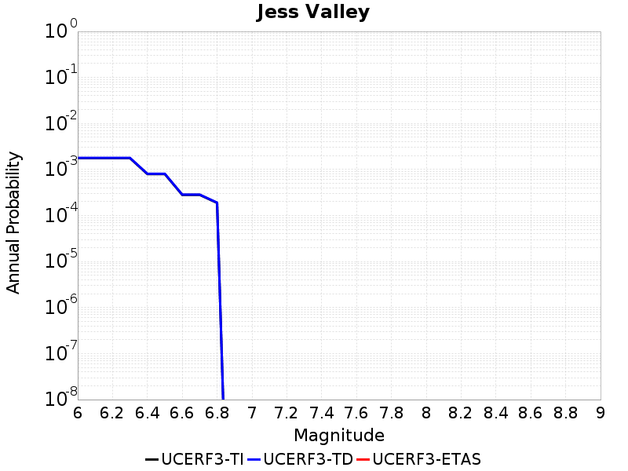 |
|-----|

| Magnitude | UCERF3-TI Prob | UCERF3-TD Prob | UCERF3-ETAS Prob |
|-----|-----|-----|-----|
| 6.0 | 0.001765276 | 0.0017902832 | 0.0 |
| 6.1 | 0.001765276 | 0.0017902832 | 0.0 |
| 6.2 | 0.001765276 | 0.0017902832 | 0.0 |
| 6.3 | 0.001765276 | 0.0017902832 | 0.0 |
| 6.4 | 7.975819E-4 | 8.0855686E-4 | 0.0 |
| 6.5 | 7.975819E-4 | 8.0855686E-4 | 0.0 |
| 6.6 | 2.8153812E-4 | 2.854589E-4 | 0.0 |
| 6.7 | 2.8153812E-4 | 2.854589E-4 | 0.0 |
| 6.8 | 1.8812988E-4 | 1.9075298E-4 | 0.0 |

## Johnson Valley (No) 2011 rev
*[(top)](#table-of-contents)*

| 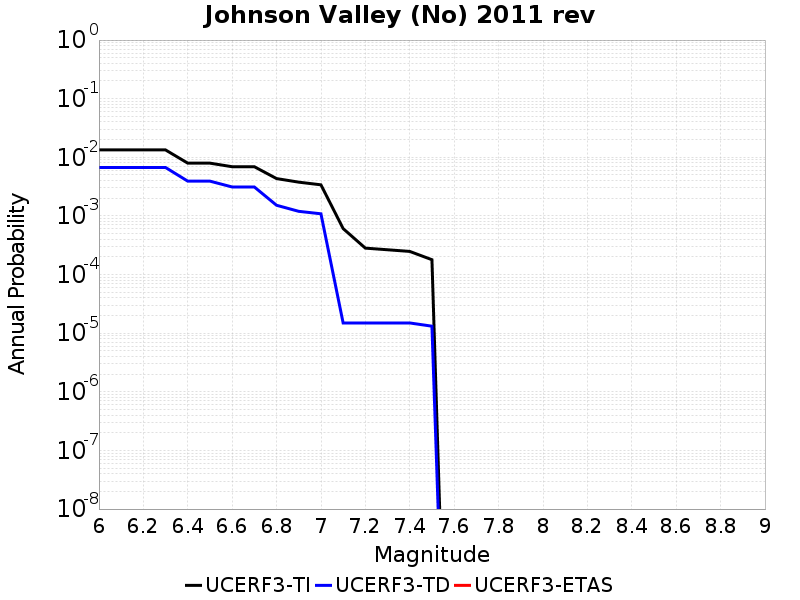 |
|-----|

| Magnitude | UCERF3-TI Prob | UCERF3-TD Prob | UCERF3-ETAS Prob |
|-----|-----|-----|-----|
| 6.0 | 0.013360229 | 0.006704592 | 0.0 |
| 6.1 | 0.013360229 | 0.006704592 | 0.0 |
| 6.2 | 0.013360229 | 0.006704592 | 0.0 |
| 6.3 | 0.013360229 | 0.006704592 | 0.0 |
| 6.4 | 0.007949836 | 0.003921396 | 0.0 |
| 6.5 | 0.007949836 | 0.003921396 | 0.0 |
| 6.6 | 0.0069102696 | 0.0031187434 | 0.0 |
| 6.7 | 0.0069102696 | 0.0031187434 | 0.0 |
| 6.8 | 0.0043374705 | 0.0015208855 | 0.0 |
| 6.9 | 0.0037684843 | 0.001198152 | 0.0 |
| 7.0 | 0.003393671 | 0.0010874174 | 0.0 |
| 7.1 | 6.083339E-4 | 1.4953297E-5 | 0.0 |
| 7.2 | 2.8244875E-4 | 1.4953297E-5 | 0.0 |
| 7.3 | 2.6486625E-4 | 1.4953296E-5 | 0.0 |
| 7.4 | 2.4817587E-4 | 1.4943985E-5 | 0.0 |
| 7.5 | 1.7925001E-4 | 1.3168036E-5 | 0.0 |

## Joshua Tree (Seismicity)
*[(top)](#table-of-contents)*

| 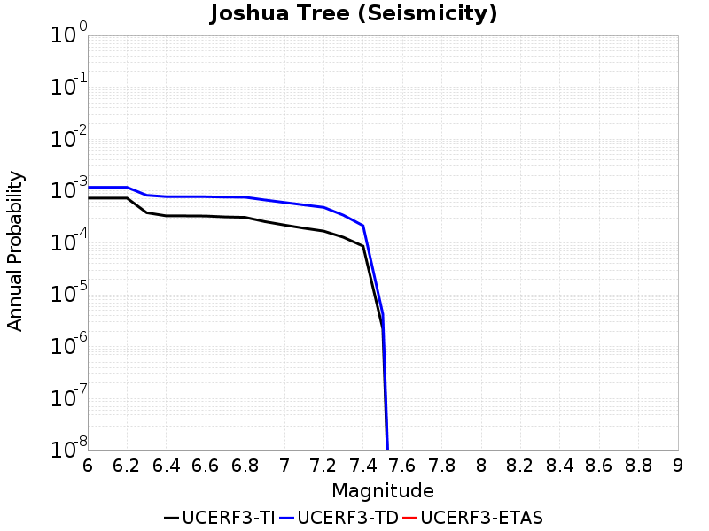 |
|-----|

| Magnitude | UCERF3-TI Prob | UCERF3-TD Prob | UCERF3-ETAS Prob |
|-----|-----|-----|-----|
| 6.0 | 7.315679E-4 | 0.001182588 | 0.0 |
| 6.1 | 7.315679E-4 | 0.001182588 | 0.0 |
| 6.2 | 7.315679E-4 | 0.001182588 | 0.0 |
| 6.3 | 3.8252992E-4 | 8.3020644E-4 | 0.0 |
| 6.4 | 3.3297754E-4 | 7.802879E-4 | 0.0 |
| 6.5 | 3.3297754E-4 | 7.802879E-4 | 0.0 |
| 6.6 | 3.3094952E-4 | 7.787724E-4 | 0.0 |
| 6.7 | 3.179704E-4 | 7.6557876E-4 | 0.0 |
| 6.8 | 3.1222968E-4 | 7.610474E-4 | 0.0 |
| 6.9 | 2.5805813E-4 | 6.74981E-4 | 0.0 |
| 7.0 | 2.2175396E-4 | 6.041383E-4 | 0.0 |
| 7.1 | 1.9246078E-4 | 5.409526E-4 | 0.0 |
| 7.2 | 1.6942917E-4 | 4.862591E-4 | 0.0 |
| 7.3 | 1.2863107E-4 | 3.4258649E-4 | 0.0 |
| 7.4 | 8.689934E-5 | 2.1539973E-4 | 0.0 |
| 7.5 | 2.2134857E-6 | 4.2740985E-6 | 0.0 |

## Keddie Ridge 2011 CFM
*[(top)](#table-of-contents)*

|  |
|-----|

| Magnitude | UCERF3-TI Prob | UCERF3-TD Prob | UCERF3-ETAS Prob |
|-----|-----|-----|-----|
| 6.0 | 0.011719079 | 0.013050363 | 0.0 |
| 6.1 | 0.011719079 | 0.013050363 | 0.0 |
| 6.2 | 0.0071619535 | 0.007956648 | 0.0 |
| 6.3 | 0.005051381 | 0.0055979313 | 0.0 |
| 6.4 | 0.003778399 | 0.0041759387 | 0.0 |
| 6.5 | 0.0031171376 | 0.0034415405 | 0.0 |
| 6.6 | 0.002102474 | 0.0023211578 | 0.0 |
| 6.7 | 8.2575605E-4 | 9.27976E-4 | 0.0 |
| 6.8 | 3.921875E-4 | 4.4747177E-4 | 0.0 |

## Kern Canyon (Lake Isabella) 2011
*[(top)](#table-of-contents)*

|  |
|-----|

| Magnitude | UCERF3-TI Prob | UCERF3-TD Prob | UCERF3-ETAS Prob |
|-----|-----|-----|-----|
| 6.0 | 0.0022092736 | 0.002085534 | 0.0 |
| 6.1 | 0.0022092736 | 0.002085534 | 0.0 |
| 6.2 | 0.0022092736 | 0.002085534 | 0.0 |
| 6.3 | 0.0022092736 | 0.002085534 | 0.0 |
| 6.4 | 0.0022092736 | 0.002085534 | 0.0 |
| 6.5 | 0.0014525123 | 0.0013126401 | 0.0 |
| 6.6 | 0.001159433 | 0.001013653 | 0.0 |
| 6.7 | 0.0011282542 | 9.820577E-4 | 0.0 |
| 6.8 | 9.745194E-4 | 8.2550145E-4 | 0.0 |
| 6.9 | 8.248681E-4 | 6.8128825E-4 | 0.0 |
| 7.0 | 7.18375E-4 | 5.8462407E-4 | 0.0 |
| 7.1 | 5.6947145E-4 | 4.5705138E-4 | 0.0 |
| 7.2 | 3.9792358E-4 | 3.0779696E-4 | 0.0 |
| 7.3 | 2.778954E-4 | 2.2858314E-4 | 0.0 |
| 7.4 | 1.8232666E-4 | 1.5682566E-4 | 0.0 |
| 7.5 | 9.5571064E-5 | 7.430166E-5 | 0.0 |
| 7.6 | 1.3421517E-5 | 9.050904E-6 | 0.0 |

## Kern Canyon (North Kern) 2011
*[(top)](#table-of-contents)*

|  |
|-----|

| Magnitude | UCERF3-TI Prob | UCERF3-TD Prob | UCERF3-ETAS Prob |
|-----|-----|-----|-----|
| 6.0 | 0.0034516277 | 0.0035196727 | 0.0 |
| 6.1 | 0.0034516277 | 0.0035196727 | 0.0 |
| 6.2 | 0.0034516277 | 0.0035196727 | 0.0 |
| 6.3 | 0.0034516277 | 0.0035196727 | 0.0 |
| 6.4 | 0.0034516277 | 0.0035196727 | 0.0 |
| 6.5 | 0.0016767744 | 0.0016977751 | 0.0 |
| 6.6 | 0.0016767744 | 0.0016977751 | 0.0 |
| 6.7 | 0.0011424901 | 0.0011507655 | 0.0 |
| 6.8 | 9.024858E-4 | 9.055268E-4 | 0.0 |
| 6.9 | 7.146078E-4 | 7.138612E-4 | 0.0 |
| 7.0 | 5.981946E-4 | 5.952639E-4 | 0.0 |
| 7.1 | 4.901085E-4 | 4.8518824E-4 | 0.0 |
| 7.2 | 3.5777962E-4 | 3.504715E-4 | 0.0 |
| 7.3 | 2.6660739E-4 | 2.5763919E-4 | 0.0 |
| 7.4 | 1.826053E-4 | 1.7211592E-4 | 0.0 |
| 7.5 | 8.8811925E-5 | 7.694167E-5 | 0.0 |
| 7.6 | 1.3421517E-5 | 9.050904E-6 | 0.0 |

## Kern Canyon (South Kern) 2011
*[(top)](#table-of-contents)*

| 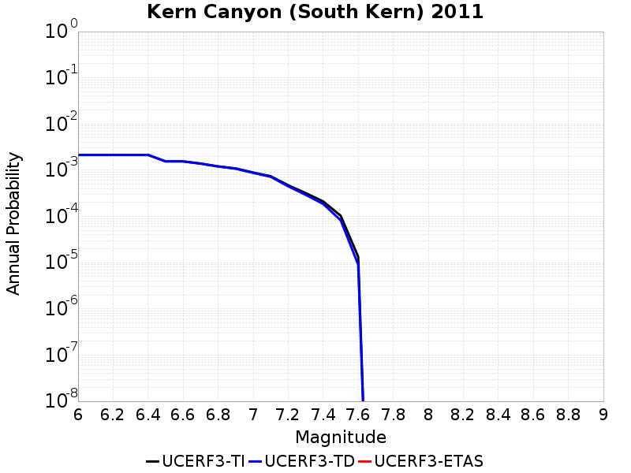 |
|-----|

| Magnitude | UCERF3-TI Prob | UCERF3-TD Prob | UCERF3-ETAS Prob |
|-----|-----|-----|-----|
| 6.0 | 0.0021396813 | 0.002143835 | 0.0 |
| 6.1 | 0.0021396813 | 0.002143835 | 0.0 |
| 6.2 | 0.0021396813 | 0.002143835 | 0.0 |
| 6.3 | 0.0021396813 | 0.002143835 | 0.0 |
| 6.4 | 0.0021396813 | 0.002143835 | 0.0 |
| 6.5 | 0.0015563103 | 0.001549858 | 0.0 |
| 6.6 | 0.0015563103 | 0.001549858 | 0.0 |
| 6.7 | 0.0013951553 | 0.0013857973 | 0.0 |
| 6.8 | 0.001214175 | 0.0012016447 | 0.0 |
| 6.9 | 0.0010937268 | 0.0010791135 | 0.0 |
| 7.0 | 8.935372E-4 | 8.7536284E-4 | 0.0 |
| 7.1 | 7.414721E-4 | 7.20478E-4 | 0.0 |
| 7.2 | 4.7460053E-4 | 4.487337E-4 | 0.0 |
| 7.3 | 3.2054266E-4 | 2.9356044E-4 | 0.0 |
| 7.4 | 2.1129279E-4 | 1.8636117E-4 | 0.0 |
| 7.5 | 1.0367952E-4 | 8.257285E-5 | 0.0 |
| 7.6 | 1.3421517E-5 | 9.050904E-6 | 0.0 |

## Kickapoo
*[(top)](#table-of-contents)*

|  |
|-----|

| Magnitude | UCERF3-TI Prob | UCERF3-TD Prob | UCERF3-ETAS Prob |
|-----|-----|-----|-----|
| 6.0 | 0.0023250172 | 2.3687713E-5 | 0.0 |
| 6.1 | 0.0023250172 | 2.3687713E-5 | 0.0 |
| 6.2 | 0.0023250172 | 2.3687713E-5 | 0.0 |
| 6.3 | 0.0023250172 | 2.3687713E-5 | 0.0 |
| 6.4 | 0.0023250172 | 2.3687713E-5 | 0.0 |
| 6.5 | 0.0023250172 | 2.3687713E-5 | 0.0 |
| 6.6 | 0.0022081244 | 2.3687713E-5 | 0.0 |
| 6.7 | 0.0022081244 | 2.3687713E-5 | 0.0 |
| 6.8 | 0.0012099637 | 2.3687713E-5 | 0.0 |
| 6.9 | 0.0011530985 | 2.3687713E-5 | 0.0 |
| 7.0 | 9.5034856E-4 | 2.3687713E-5 | 0.0 |
| 7.1 | 6.866045E-4 | 2.3687713E-5 | 0.0 |
| 7.2 | 3.5790002E-4 | 2.3687244E-5 | 0.0 |
| 7.3 | 3.354475E-4 | 2.3678886E-5 | 0.0 |
| 7.4 | 3.0705697E-4 | 2.3147459E-5 | 0.0 |
| 7.5 | 1.7925001E-4 | 1.3168036E-5 | 0.0 |

## King Range 2011 CFM
*[(top)](#table-of-contents)*

| 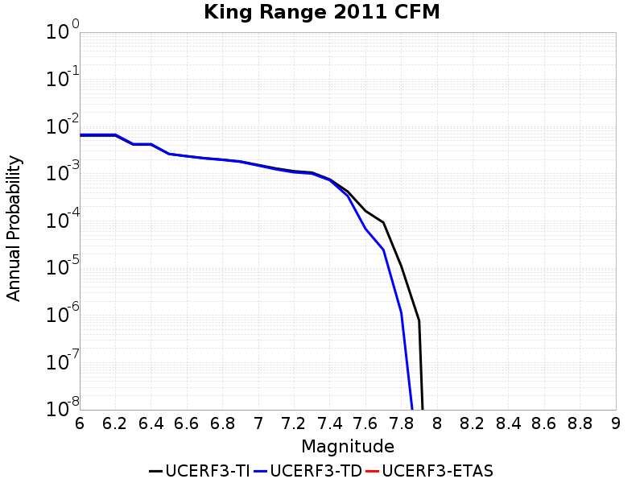 |
|-----|

| Magnitude | UCERF3-TI Prob | UCERF3-TD Prob | UCERF3-ETAS Prob |
|-----|-----|-----|-----|
| 6.0 | 0.0064817313 | 0.0067635574 | 0.0 |
| 6.1 | 0.0064817313 | 0.0067635574 | 0.0 |
| 6.2 | 0.0064817313 | 0.0067635574 | 0.0 |
| 6.3 | 0.004159618 | 0.004267735 | 0.0 |
| 6.4 | 0.004159618 | 0.004267735 | 0.0 |
| 6.5 | 0.0026327274 | 0.0026392085 | 0.0 |
| 6.6 | 0.0023644536 | 0.002356597 | 0.0 |
| 6.7 | 0.0021445542 | 0.0021266025 | 0.0 |
| 6.8 | 0.0019975523 | 0.001976071 | 0.0 |
| 6.9 | 0.0018245836 | 0.0017973597 | 0.0 |
| 7.0 | 0.0015365666 | 0.0014972555 | 0.0 |
| 7.1 | 0.0012958117 | 0.0012436592 | 0.0 |
| 7.2 | 0.0011368633 | 0.0010763792 | 0.0 |
| 7.3 | 0.0010627571 | 0.0010111737 | 0.0 |
| 7.4 | 7.603208E-4 | 7.3237804E-4 | 0.0 |
| 7.5 | 4.2091825E-4 | 3.3896422E-4 | 0.0 |
| 7.6 | 1.6298964E-4 | 6.796903E-5 | 0.0 |
| 7.7 | 9.2598115E-5 | 2.4495599E-5 | 0.0 |
| 7.8 | 1.0975983E-5 | 1.1354832E-6 | 0.0 |
| 7.9 | 7.7135354E-7 | 4.997739E-10 | 0.0 |

## La Panza 2011
*[(top)](#table-of-contents)*

|  |
|-----|

| Magnitude | UCERF3-TI Prob | UCERF3-TD Prob | UCERF3-ETAS Prob |
|-----|-----|-----|-----|
| 6.0 | 0.0024366176 | 0.0024578988 | 0.0 |
| 6.1 | 0.0024366176 | 0.0024578988 | 0.0 |
| 6.2 | 0.0024366176 | 0.0024578988 | 0.0 |
| 6.3 | 0.0024366176 | 0.0024578988 | 0.0 |
| 6.4 | 0.0024366176 | 0.0024578988 | 0.0 |
| 6.5 | 0.0012959775 | 0.0013032538 | 0.0 |
| 6.6 | 0.0012959775 | 0.0013032538 | 0.0 |
| 6.7 | 7.880303E-4 | 7.893633E-4 | 0.0 |
| 6.8 | 7.232384E-4 | 7.2361075E-4 | 0.0 |
| 6.9 | 5.126059E-4 | 5.10416E-4 | 0.0 |
| 7.0 | 3.5369597E-4 | 3.4947743E-4 | 0.0 |
| 7.1 | 1.825031E-4 | 1.7616307E-4 | 0.0 |
| 7.2 | 1.3089878E-4 | 1.2378127E-4 | 0.0 |
| 7.3 | 5.3007258E-5 | 4.4556295E-5 | 0.0 |
| 7.4 | 1.8265595E-5 | 9.948574E-6 | 0.0 |
| 7.5 | 1.3526024E-5 | 5.21239E-6 | 0.0 |
| 7.6 | 9.922603E-6 | 2.6533592E-6 | 0.0 |
| 7.7 | 6.143408E-6 | 6.1117964E-7 | 0.0 |
| 7.8 | 2.8641189E-6 | 9.569301E-8 | 0.0 |
| 7.9 | 1.3086925E-6 | 3.1387696E-8 | 0.0 |

## Laguna Salada
*[(top)](#table-of-contents)*

| 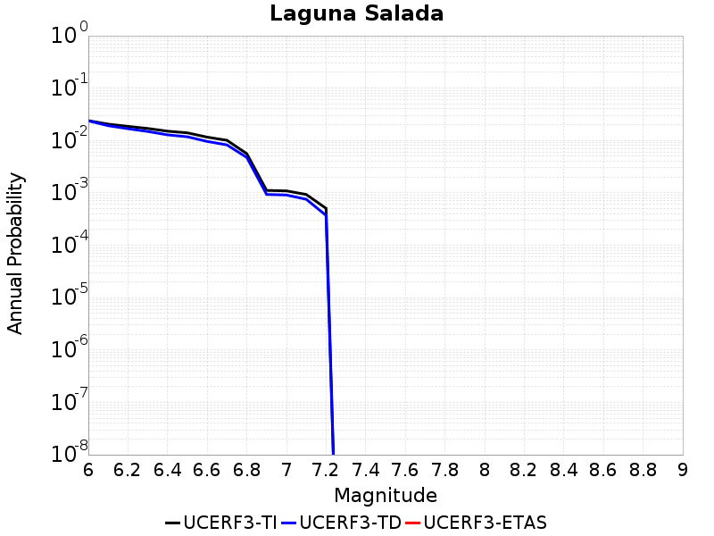 |
|-----|

| Magnitude | UCERF3-TI Prob | UCERF3-TD Prob | UCERF3-ETAS Prob |
|-----|-----|-----|-----|
| 6.0 | 0.02395408 | 0.023820724 | 0.0 |
| 6.1 | 0.020565065 | 0.01919356 | 0.0 |
| 6.2 | 0.018644003 | 0.016816884 | 0.0 |
| 6.3 | 0.016999546 | 0.014891737 | 0.0 |
| 6.4 | 0.015085992 | 0.012836519 | 0.0 |
| 6.5 | 0.014028233 | 0.011792078 | 0.0 |
| 6.6 | 0.011603311 | 0.009609108 | 0.0 |
| 6.7 | 0.010101665 | 0.008244718 | 0.0 |
| 6.8 | 0.0056027942 | 0.0047483803 | 0.0 |
| 6.9 | 0.0011152053 | 9.334797E-4 | 0.0 |
| 7.0 | 0.0010926984 | 9.115599E-4 | 0.0 |
| 7.1 | 9.329135E-4 | 7.555899E-4 | 0.0 |
| 7.2 | 5.072095E-4 | 3.7175373E-4 | 0.0 |

## Lake Isabella (Seismicity)
*[(top)](#table-of-contents)*

| 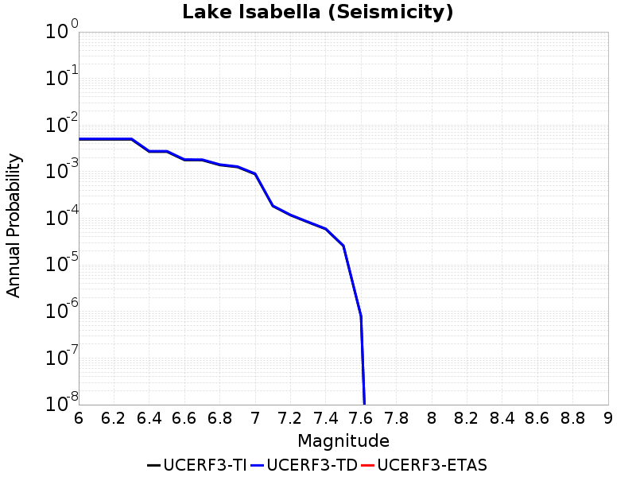 |
|-----|

| Magnitude | UCERF3-TI Prob | UCERF3-TD Prob | UCERF3-ETAS Prob |
|-----|-----|-----|-----|
| 6.0 | 0.004909227 | 0.0050698617 | 0.0 |
| 6.1 | 0.004909227 | 0.0050698617 | 0.0 |
| 6.2 | 0.004909227 | 0.0050698617 | 0.0 |
| 6.3 | 0.004909227 | 0.0050698617 | 0.0 |
| 6.4 | 0.0026805066 | 0.002761192 | 0.0 |
| 6.5 | 0.0026805066 | 0.002761192 | 0.0 |
| 6.6 | 0.0017730123 | 0.001823581 | 0.0 |
| 6.7 | 0.0017662736 | 0.0018167418 | 0.0 |
| 6.8 | 0.0013860512 | 0.0014251142 | 0.0 |
| 6.9 | 0.0012546359 | 0.0012899989 | 0.0 |
| 7.0 | 8.84198E-4 | 9.088742E-4 | 0.0 |
| 7.1 | 1.8268047E-4 | 1.8629884E-4 | 0.0 |
| 7.2 | 1.1646151E-4 | 1.1867848E-4 | 0.0 |
| 7.3 | 8.2232174E-5 | 8.378348E-5 | 0.0 |
| 7.4 | 5.8524372E-5 | 5.9635335E-5 | 0.0 |
| 7.5 | 2.5489873E-5 | 2.5973017E-5 | 0.0 |
| 7.6 | 7.8509987E-7 | 7.9911575E-7 | 0.0 |

## Las Positas
*[(top)](#table-of-contents)*

| 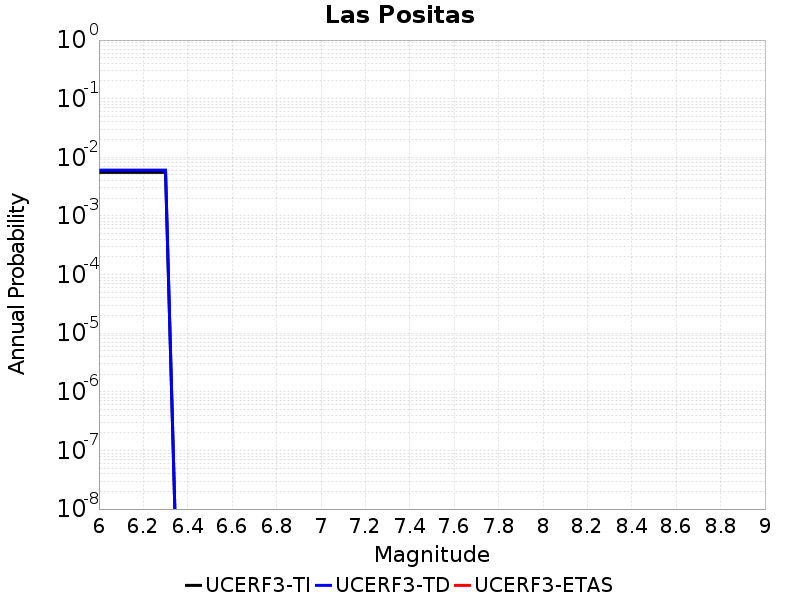 |
|-----|

| Magnitude | UCERF3-TI Prob | UCERF3-TD Prob | UCERF3-ETAS Prob |
|-----|-----|-----|-----|
| 6.0 | 0.005546526 | 0.0060425675 | 0.0 |
| 6.1 | 0.005546526 | 0.0060425675 | 0.0 |
| 6.2 | 0.005546526 | 0.0060425675 | 0.0 |
| 6.3 | 0.005546526 | 0.0060425675 | 0.0 |

## Last Chance
*[(top)](#table-of-contents)*

|  |
|-----|

| Magnitude | UCERF3-TI Prob | UCERF3-TD Prob | UCERF3-ETAS Prob |
|-----|-----|-----|-----|
| 6.0 | 0.0016887904 | 0.001722991 | 0.0 |
| 6.1 | 0.0016887904 | 0.001722991 | 0.0 |
| 6.2 | 0.0016887904 | 0.001722991 | 0.0 |
| 6.3 | 0.0016887904 | 0.001722991 | 0.0 |
| 6.4 | 0.0016887904 | 0.001722991 | 0.0 |
| 6.5 | 0.0016887904 | 0.001722991 | 0.0 |
| 6.6 | 0.0016887904 | 0.001722991 | 0.0 |
| 6.7 | 0.0010242239 | 0.0010451938 | 0.0 |
| 6.8 | 9.643483E-4 | 9.842364E-4 | 0.0 |
| 6.9 | 8.4930024E-4 | 8.669328E-4 | 0.0 |
| 7.0 | 6.060955E-4 | 6.1905285E-4 | 0.0 |
| 7.1 | 4.1068246E-4 | 4.1972872E-4 | 0.0 |

## Lenwood-Lockhart-Old Woman Springs
*[(top)](#table-of-contents)*

| 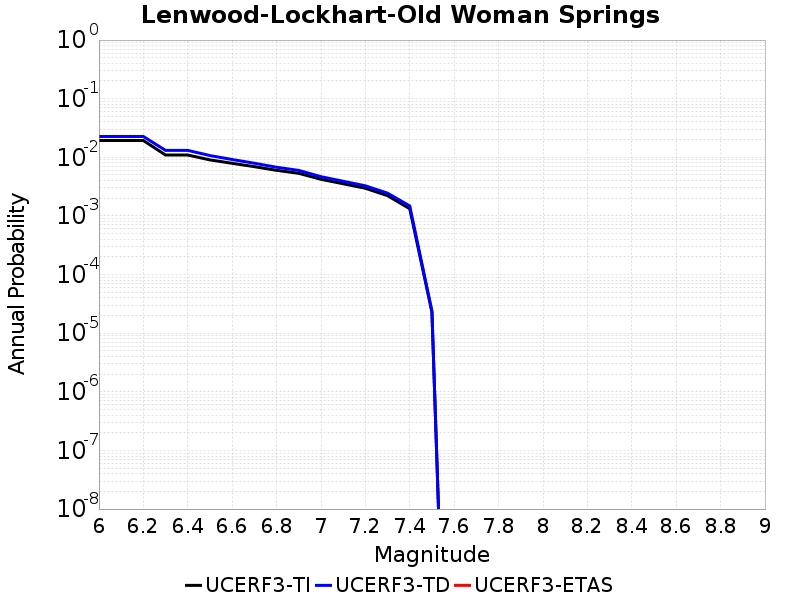 |
|-----|

| Magnitude | UCERF3-TI Prob | UCERF3-TD Prob | UCERF3-ETAS Prob |
|-----|-----|-----|-----|
| 6.0 | 0.019349206 | 0.022672644 | 0.0 |
| 6.1 | 0.019349206 | 0.022672644 | 0.0 |
| 6.2 | 0.019349206 | 0.022672644 | 0.0 |
| 6.3 | 0.010939079 | 0.013131529 | 0.0 |
| 6.4 | 0.010939079 | 0.013131529 | 0.0 |
| 6.5 | 0.009036654 | 0.01071359 | 0.0 |
| 6.6 | 0.007902439 | 0.009173102 | 0.0 |
| 6.7 | 0.006928845 | 0.0079238415 | 0.0 |
| 6.8 | 0.00599574 | 0.0067677917 | 0.0 |
| 6.9 | 0.0053360825 | 0.0059819175 | 0.0 |
| 7.0 | 0.0042199334 | 0.0046729534 | 0.0 |
| 7.1 | 0.003541148 | 0.0039067212 | 0.0 |
| 7.2 | 0.002964219 | 0.003265503 | 0.0 |
| 7.3 | 0.00221688 | 0.0024473646 | 0.0 |
| 7.4 | 0.001326967 | 0.0014821942 | 0.0 |
| 7.5 | 2.2805343E-5 | 2.3797458E-5 | 0.0 |

## Likely 2011 CFM
*[(top)](#table-of-contents)*

|  |
|-----|

| Magnitude | UCERF3-TI Prob | UCERF3-TD Prob | UCERF3-ETAS Prob |
|-----|-----|-----|-----|
| 6.0 | 0.013122803 | 0.014038003 | 0.0 |
| 6.1 | 0.013122803 | 0.014038003 | 0.0 |
| 6.2 | 0.008508399 | 0.009067152 | 0.0 |
| 6.3 | 0.0062136655 | 0.0066074952 | 0.0 |
| 6.4 | 0.004785171 | 0.005081093 | 0.0 |
| 6.5 | 0.0039988225 | 0.004242381 | 0.0 |
| 6.6 | 0.003379844 | 0.0035838045 | 0.0 |
| 6.7 | 0.002400498 | 0.0025436736 | 0.0 |
| 6.8 | 0.0017097679 | 0.0018117221 | 0.0 |
| 6.9 | 0.0012145005 | 0.001287503 | 0.0 |
| 7.0 | 6.3183554E-4 | 6.7059713E-4 | 0.0 |

## Lions Head 2011 CFM
*[(top)](#table-of-contents)*

|  |
|-----|

| Magnitude | UCERF3-TI Prob | UCERF3-TD Prob | UCERF3-ETAS Prob |
|-----|-----|-----|-----|
| 6.0 | 4.637269E-4 | 4.6379652E-4 | 0.0 |
| 6.1 | 4.637269E-4 | 4.6379652E-4 | 0.0 |
| 6.2 | 2.9964533E-4 | 2.992172E-4 | 0.0 |
| 6.3 | 2.9964533E-4 | 2.992172E-4 | 0.0 |
| 6.4 | 2.1826927E-4 | 2.1760447E-4 | 0.0 |
| 6.5 | 2.1826927E-4 | 2.1760447E-4 | 0.0 |
| 6.6 | 1.9250068E-4 | 1.9176361E-4 | 0.0 |
| 6.7 | 1.736558E-4 | 1.7286811E-4 | 0.0 |
| 6.8 | 1.5487912E-4 | 1.5404368E-4 | 0.0 |
| 6.9 | 1.4741877E-4 | 1.4655846E-4 | 0.0 |
| 7.0 | 1.3458285E-4 | 1.3367526E-4 | 0.0 |
| 7.1 | 1.1832791E-4 | 1.1734095E-4 | 0.0 |
| 7.2 | 1.0271065E-4 | 1.0164715E-4 | 0.0 |
| 7.3 | 8.4010215E-5 | 8.282684E-5 | 0.0 |
| 7.4 | 6.807737E-5 | 6.677361E-5 | 0.0 |
| 7.5 | 4.9102036E-5 | 4.7622914E-5 | 0.0 |
| 7.6 | 3.4625533E-5 | 3.298629E-5 | 0.0 |
| 7.7 | 2.040208E-5 | 1.8560071E-5 | 0.0 |
| 7.8 | 1.0361853E-5 | 8.356453E-6 | 0.0 |
| 7.9 | 5.0705553E-6 | 3.3428446E-6 | 0.0 |
| 8.0 | 2.0035359E-6 | 9.842855E-7 | 0.0 |

## Little Lake
*[(top)](#table-of-contents)*

| 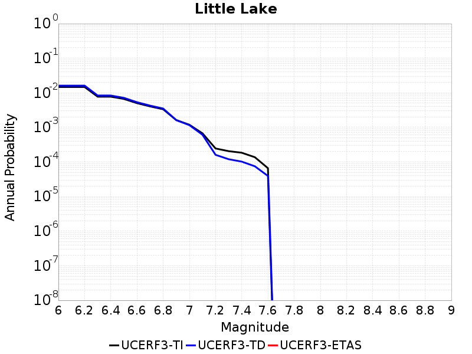 |
|-----|

| Magnitude | UCERF3-TI Prob | UCERF3-TD Prob | UCERF3-ETAS Prob |
|-----|-----|-----|-----|
| 6.0 | 0.014722223 | 0.016147641 | 0.0 |
| 6.1 | 0.014722223 | 0.016147641 | 0.0 |
| 6.2 | 0.014722223 | 0.016147641 | 0.0 |
| 6.3 | 0.007737305 | 0.008350742 | 0.0 |
| 6.4 | 0.007737305 | 0.008350742 | 0.0 |
| 6.5 | 0.006655392 | 0.0071528167 | 0.0 |
| 6.6 | 0.005028777 | 0.0053511565 | 0.0 |
| 6.7 | 0.004044977 | 0.0042670923 | 0.0 |
| 6.8 | 0.003346101 | 0.0035068037 | 0.0 |
| 6.9 | 0.0016310095 | 0.0016216609 | 0.0 |
| 7.0 | 0.0011944914 | 0.0011615156 | 0.0 |
| 7.1 | 6.7480316E-4 | 6.1387866E-4 | 0.0 |
| 7.2 | 2.460357E-4 | 1.6107257E-4 | 0.0 |
| 7.3 | 2.0572392E-4 | 1.2029172E-4 | 0.0 |
| 7.4 | 1.8506673E-4 | 1.02473015E-4 | 0.0 |
| 7.5 | 1.3750336E-4 | 7.511196E-5 | 0.0 |
| 7.6 | 6.626006E-5 | 3.9451006E-5 | 0.0 |

## Little Salmon (Offshore)
*[(top)](#table-of-contents)*

| 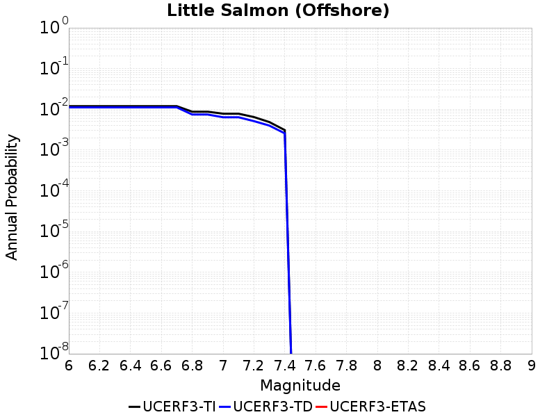 |
|-----|

| Magnitude | UCERF3-TI Prob | UCERF3-TD Prob | UCERF3-ETAS Prob |
|-----|-----|-----|-----|
| 6.0 | 0.011956319 | 0.011188891 | 0.0 |
| 6.1 | 0.011956319 | 0.011188891 | 0.0 |
| 6.2 | 0.011956319 | 0.011188891 | 0.0 |
| 6.3 | 0.011956319 | 0.011188891 | 0.0 |
| 6.4 | 0.011956319 | 0.011188891 | 0.0 |
| 6.5 | 0.011956319 | 0.011188891 | 0.0 |
| 6.6 | 0.011956319 | 0.011188891 | 0.0 |
| 6.7 | 0.011956319 | 0.011188891 | 0.0 |
| 6.8 | 0.008747822 | 0.0074559776 | 0.0 |
| 6.9 | 0.008747822 | 0.0074559776 | 0.0 |
| 7.0 | 0.00782284 | 0.006393931 | 0.0 |
| 7.1 | 0.00782284 | 0.006393931 | 0.0 |
| 7.2 | 0.006464922 | 0.005134127 | 0.0 |
| 7.3 | 0.004872023 | 0.0039938693 | 0.0 |
| 7.4 | 0.0030954275 | 0.0025723972 | 0.0 |

## Little Salmon (Onshore)
*[(top)](#table-of-contents)*

|  |
|-----|

| Magnitude | UCERF3-TI Prob | UCERF3-TD Prob | UCERF3-ETAS Prob |
|-----|-----|-----|-----|
| 6.0 | 0.021463778 | 0.026676644 | 0.0 |
| 6.1 | 0.021463778 | 0.026676644 | 0.0 |
| 6.2 | 0.021463778 | 0.026676644 | 0.0 |
| 6.3 | 0.021463778 | 0.026676644 | 0.0 |
| 6.4 | 0.021463778 | 0.026676644 | 0.0 |
| 6.5 | 0.021463778 | 0.026676644 | 0.0 |
| 6.6 | 0.021463778 | 0.026676644 | 0.0 |
| 6.7 | 0.021463778 | 0.026676644 | 0.0 |
| 6.8 | 0.01789616 | 0.021148004 | 0.0 |
| 6.9 | 0.01789616 | 0.021148004 | 0.0 |
| 7.0 | 0.009560696 | 0.00894234 | 0.0 |
| 7.1 | 0.008408628 | 0.0073560597 | 0.0 |
| 7.2 | 0.0077284635 | 0.006519947 | 0.0 |
| 7.3 | 0.004872023 | 0.0039938693 | 0.0 |
| 7.4 | 0.0030954275 | 0.0025723972 | 0.0 |

## Los Alamos 2011 CFM
*[(top)](#table-of-contents)*

| 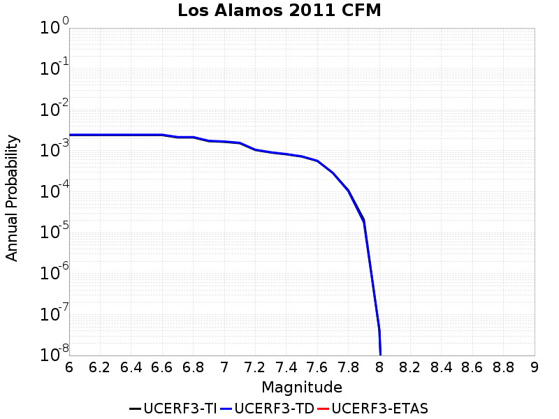 |
|-----|

| Magnitude | UCERF3-TI Prob | UCERF3-TD Prob | UCERF3-ETAS Prob |
|-----|-----|-----|-----|
| 6.0 | 0.0024121467 | 0.0024755998 | 0.0 |
| 6.1 | 0.0024121467 | 0.0024755998 | 0.0 |
| 6.2 | 0.0024121467 | 0.0024755998 | 0.0 |
| 6.3 | 0.0024121467 | 0.0024755998 | 0.0 |
| 6.4 | 0.0024121467 | 0.0024755998 | 0.0 |
| 6.5 | 0.0024121467 | 0.0024755998 | 0.0 |
| 6.6 | 0.0024121467 | 0.0024755998 | 0.0 |
| 6.7 | 0.0021174205 | 0.0021709458 | 0.0 |
| 6.8 | 0.0021174205 | 0.0021709458 | 0.0 |
| 6.9 | 0.0017170844 | 0.0017578531 | 0.0 |
| 7.0 | 0.0016520657 | 0.0016911228 | 0.0 |
| 7.1 | 0.001531794 | 0.0015674401 | 0.0 |
| 7.2 | 0.0010441064 | 0.0010642894 | 0.0 |
| 7.3 | 9.0563187E-4 | 9.2163647E-4 | 0.0 |
| 7.4 | 8.198299E-4 | 8.332664E-4 | 0.0 |
| 7.5 | 7.2194956E-4 | 7.3213445E-4 | 0.0 |
| 7.6 | 5.656504E-4 | 5.701119E-4 | 0.0 |
| 7.7 | 2.8927872E-4 | 2.8688853E-4 | 0.0 |
| 7.8 | 1.0804277E-4 | 1.03135586E-4 | 0.0 |
| 7.9 | 2.0777963E-5 | 1.790199E-5 | 0.0 |
| 8.0 | 4.1119034E-8 | 4.29505E-8 | 0.0 |

## Los Alamos extension
*[(top)](#table-of-contents)*

| 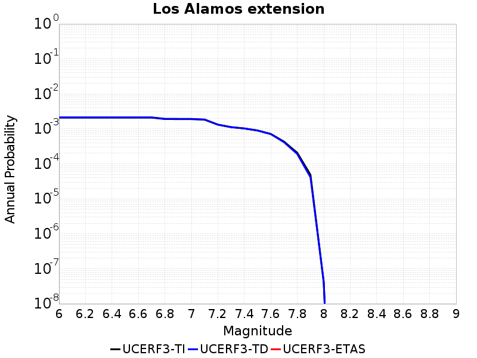 |
|-----|

| Magnitude | UCERF3-TI Prob | UCERF3-TD Prob | UCERF3-ETAS Prob |
|-----|-----|-----|-----|
| 6.0 | 0.0020925992 | 0.0021290726 | 0.0 |
| 6.1 | 0.0020925992 | 0.0021290726 | 0.0 |
| 6.2 | 0.0020925992 | 0.0021290726 | 0.0 |
| 6.3 | 0.0020925992 | 0.0021290726 | 0.0 |
| 6.4 | 0.0020925992 | 0.0021290726 | 0.0 |
| 6.5 | 0.0020925992 | 0.0021290726 | 0.0 |
| 6.6 | 0.0020925992 | 0.0021290726 | 0.0 |
| 6.7 | 0.0020925992 | 0.0021290726 | 0.0 |
| 6.8 | 0.0019071194 | 0.0019378533 | 0.0 |
| 6.9 | 0.0018999127 | 0.0019304138 | 0.0 |
| 7.0 | 0.0018932576 | 0.0019235215 | 0.0 |
| 7.1 | 0.0018246764 | 0.0018527512 | 0.0 |
| 7.2 | 0.0013142825 | 0.0013257809 | 0.0 |
| 7.3 | 0.0011159834 | 0.0011207473 | 0.0 |
| 7.4 | 0.0010253121 | 0.0010270145 | 0.0 |
| 7.5 | 8.9731114E-4 | 8.940689E-4 | 0.0 |
| 7.6 | 7.1551115E-4 | 7.0566667E-4 | 0.0 |
| 7.7 | 4.315576E-4 | 4.1489388E-4 | 0.0 |
| 7.8 | 2.071707E-4 | 1.9146281E-4 | 0.0 |
| 7.9 | 4.8485912E-5 | 4.1137933E-5 | 0.0 |
| 8.0 | 4.1119034E-8 | 4.29505E-8 | 0.0 |

## Los Medanos - Roe Island
*[(top)](#table-of-contents)*

|  |
|-----|

| Magnitude | UCERF3-TI Prob | UCERF3-TD Prob | UCERF3-ETAS Prob |
|-----|-----|-----|-----|
| 6.0 | 4.730149E-4 | 5.107457E-4 | 0.0 |
| 6.1 | 4.730149E-4 | 5.107457E-4 | 0.0 |
| 6.2 | 4.730149E-4 | 5.107457E-4 | 0.0 |
| 6.3 | 4.730149E-4 | 5.107457E-4 | 0.0 |
| 6.4 | 4.730149E-4 | 5.107457E-4 | 0.0 |
| 6.5 | 4.730149E-4 | 5.107457E-4 | 0.0 |
| 6.6 | 4.730149E-4 | 5.107457E-4 | 0.0 |
| 6.7 | 4.6869842E-4 | 5.0639996E-4 | 0.0 |
| 6.8 | 4.4672855E-4 | 4.811048E-4 | 0.0 |
| 6.9 | 4.165983E-4 | 4.4811182E-4 | 0.0 |
| 7.0 | 3.598806E-4 | 3.8570497E-4 | 0.0 |
| 7.1 | 2.9077442E-4 | 3.1121168E-4 | 0.0 |
| 7.2 | 2.1282726E-4 | 2.2719166E-4 | 0.0 |
| 7.3 | 1.3948113E-4 | 1.4902487E-4 | 0.0 |
| 7.4 | 8.270864E-5 | 8.8193694E-5 | 0.0 |
| 7.5 | 5.5702203E-5 | 5.9348644E-5 | 0.0 |
| 7.6 | 3.381751E-5 | 3.6009682E-5 | 0.0 |
| 7.7 | 6.2525356E-7 | 6.731086E-7 | 0.0 |

## Los Osos 2011
*[(top)](#table-of-contents)*

|  |
|-----|

| Magnitude | UCERF3-TI Prob | UCERF3-TD Prob | UCERF3-ETAS Prob |
|-----|-----|-----|-----|
| 6.0 | 0.002546817 | 0.002595363 | 0.0 |
| 6.1 | 0.002546817 | 0.002595363 | 0.0 |
| 6.2 | 0.002546817 | 0.002595363 | 0.0 |
| 6.3 | 0.002546817 | 0.002595363 | 0.0 |
| 6.4 | 0.002546817 | 0.002595363 | 0.0 |
| 6.5 | 0.0016539496 | 0.0016799285 | 0.0 |
| 6.6 | 0.0016174077 | 0.0016422821 | 0.0 |
| 6.7 | 0.0013617266 | 0.0013808353 | 0.0 |
| 6.8 | 0.0012921972 | 0.0013094539 | 0.0 |
| 6.9 | 0.0011147653 | 0.001127796 | 0.0 |
| 7.0 | 0.0010056482 | 0.0010162545 | 0.0 |
| 7.1 | 8.529247E-4 | 8.6024083E-4 | 0.0 |
| 7.2 | 7.535026E-4 | 7.587132E-4 | 0.0 |
| 7.3 | 6.267076E-4 | 6.2920654E-4 | 0.0 |
| 7.4 | 5.064076E-4 | 5.0620054E-4 | 0.0 |
| 7.5 | 3.7430652E-4 | 3.7089834E-4 | 0.0 |
| 7.6 | 2.37571E-4 | 2.304059E-4 | 0.0 |
| 7.7 | 1.1047449E-4 | 9.925758E-5 | 0.0 |
| 7.8 | 5.1517753E-5 | 3.8272767E-5 | 0.0 |
| 7.9 | 2.8384275E-5 | 1.6488433E-5 | 0.0 |
| 8.0 | 9.481861E-6 | 4.3321E-6 | 0.0 |

## Lost Hills
*[(top)](#table-of-contents)*

| 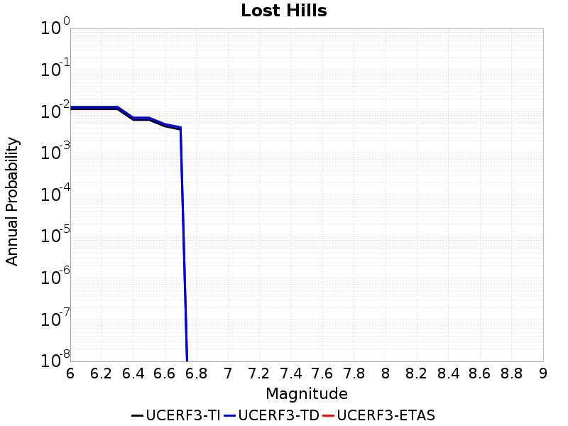 |
|-----|

| Magnitude | UCERF3-TI Prob | UCERF3-TD Prob | UCERF3-ETAS Prob |
|-----|-----|-----|-----|
| 6.0 | 0.011586686 | 0.013016312 | 0.0 |
| 6.1 | 0.011586686 | 0.013016312 | 0.0 |
| 6.2 | 0.011586686 | 0.013016312 | 0.0 |
| 6.3 | 0.011586686 | 0.013016312 | 0.0 |
| 6.4 | 0.006391279 | 0.0071661286 | 0.0 |
| 6.5 | 0.006391279 | 0.0071661286 | 0.0 |
| 6.6 | 0.0044683935 | 0.0050167954 | 0.0 |
| 6.7 | 0.0037527776 | 0.0042149695 | 0.0 |

## Ludlow
*[(top)](#table-of-contents)*

| 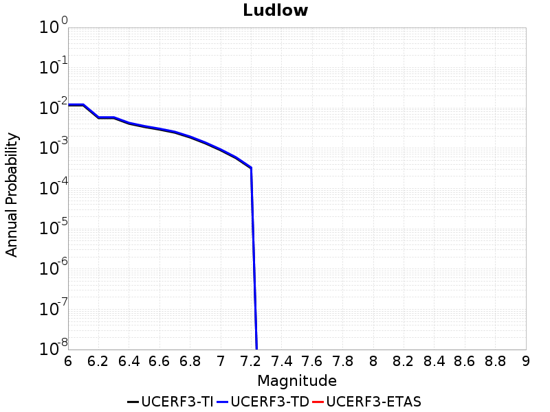 |
|-----|

| Magnitude | UCERF3-TI Prob | UCERF3-TD Prob | UCERF3-ETAS Prob |
|-----|-----|-----|-----|
| 6.0 | 0.011624013 | 0.012265936 | 0.0 |
| 6.1 | 0.011624013 | 0.012265936 | 0.0 |
| 6.2 | 0.00560974 | 0.005910024 | 0.0 |
| 6.3 | 0.00560974 | 0.005910024 | 0.0 |
| 6.4 | 0.0040691774 | 0.004286853 | 0.0 |
| 6.5 | 0.003385164 | 0.0035664267 | 0.0 |
| 6.6 | 0.0029084706 | 0.0030648683 | 0.0 |
| 6.7 | 0.0024420423 | 0.0025731325 | 0.0 |
| 6.8 | 0.0018550502 | 0.0019547732 | 0.0 |
| 6.9 | 0.0013207254 | 0.0013919603 | 0.0 |
| 7.0 | 8.9098496E-4 | 9.392684E-4 | 0.0 |
| 7.1 | 5.6886784E-4 | 5.9942075E-4 | 0.0 |
| 7.2 | 3.1650066E-4 | 3.330474E-4 | 0.0 |

## Maacama 2011 CFM
*[(top)](#table-of-contents)*

|  |
|-----|

| Magnitude | UCERF3-TI Prob | UCERF3-TD Prob | UCERF3-ETAS Prob |
|-----|-----|-----|-----|
| 6.0 | 0.06890667 | 0.12352092 | 0.0 |
| 6.1 | 0.06890667 | 0.12352092 | 0.0 |
| 6.2 | 0.06854413 | 0.122957185 | 0.0 |
| 6.3 | 0.060292065 | 0.10820821 | 0.0 |
| 6.4 | 0.06000784 | 0.10776656 | 0.0 |
| 6.5 | 0.055543028 | 0.0998768 | 0.0 |
| 6.6 | 0.053330887 | 0.09603894 | 0.0 |
| 6.7 | 0.049551267 | 0.08952914 | 0.0 |
| 6.8 | 0.045725387 | 0.082100175 | 0.0 |
| 6.9 | 0.04007554 | 0.07155667 | 0.0 |
| 7.0 | 0.035675827 | 0.06341942 | 0.0 |
| 7.1 | 0.030820016 | 0.05473459 | 0.0 |
| 7.2 | 0.026344774 | 0.0469419 | 0.0 |
| 7.3 | 0.0217219 | 0.038607754 | 0.0 |
| 7.4 | 0.015013801 | 0.026136532 | 0.0 |
| 7.5 | 5.890428E-4 | 7.769707E-4 | 0.0 |
| 7.6 | 1.3844819E-4 | 1.8033797E-4 | 0.0 |
| 7.7 | 5.0756928E-5 | 6.3894426E-5 | 0.0 |
| 7.8 | 3.2319003E-6 | 4.01013E-6 | 0.0 |

## Mad River (alt1)
*[(top)](#table-of-contents)*

| 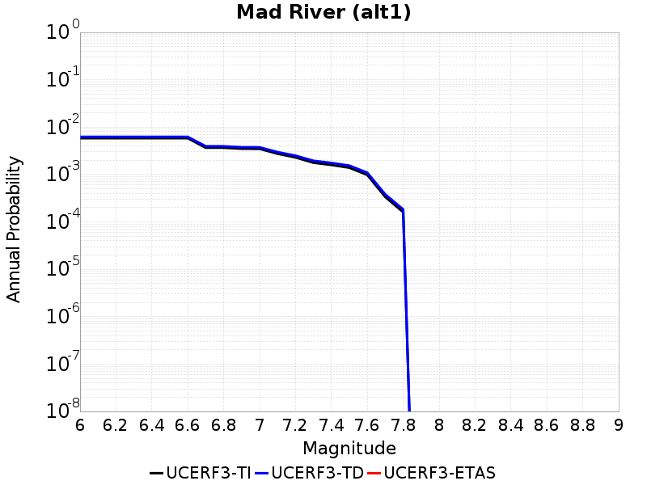 |
|-----|

| Magnitude | UCERF3-TI Prob | UCERF3-TD Prob | UCERF3-ETAS Prob |
|-----|-----|-----|-----|
| 6.0 | 0.0058556325 | 0.0062594432 | 0.0 |
| 6.1 | 0.0058556325 | 0.0062594432 | 0.0 |
| 6.2 | 0.0058556325 | 0.0062594432 | 0.0 |
| 6.3 | 0.0058556325 | 0.0062594432 | 0.0 |
| 6.4 | 0.0058556325 | 0.0062594432 | 0.0 |
| 6.5 | 0.0058556325 | 0.0062594432 | 0.0 |
| 6.6 | 0.0058556325 | 0.0062594432 | 0.0 |
| 6.7 | 0.0036752177 | 0.003957548 | 0.0 |
| 6.8 | 0.0036752177 | 0.003957548 | 0.0 |
| 6.9 | 0.003504168 | 0.0037766942 | 0.0 |
| 7.0 | 0.0034909705 | 0.003762586 | 0.0 |
| 7.1 | 0.0027504463 | 0.002983934 | 0.0 |
| 7.2 | 0.0022976769 | 0.0025091982 | 0.0 |
| 7.3 | 0.0017756595 | 0.0019543723 | 0.0 |
| 7.4 | 0.0015938769 | 0.0017603077 | 0.0 |
| 7.5 | 0.0013943089 | 0.0015463544 | 0.0 |
| 7.6 | 9.808034E-4 | 0.0010961975 | 0.0 |
| 7.7 | 3.370838E-4 | 3.824154E-4 | 0.0 |
| 7.8 | 1.6062055E-4 | 1.8384079E-4 | 0.0 |

## Malibu Coast (Extension) alt 1
*[(top)](#table-of-contents)*

|  |
|-----|

| Magnitude | UCERF3-TI Prob | UCERF3-TD Prob | UCERF3-ETAS Prob |
|-----|-----|-----|-----|
| 6.0 | 0.0046491115 | 0.0048534106 | 0.0 |
| 6.1 | 0.0037497976 | 0.003919101 | 0.0 |
| 6.2 | 0.0033193815 | 0.0034703736 | 0.0 |
| 6.3 | 0.00313433 | 0.0032772 | 0.0 |
| 6.4 | 0.0030272473 | 0.0031651119 | 0.0 |
| 6.5 | 0.0028537093 | 0.0029820942 | 0.0 |
| 6.6 | 0.0027212645 | 0.0028422582 | 0.0 |
| 6.7 | 0.002623077 | 0.0027385256 | 0.0 |
| 6.8 | 0.0023804565 | 0.0024783001 | 0.0 |
| 6.9 | 0.0022308815 | 0.0023187632 | 0.0 |
| 7.0 | 0.0020742472 | 0.0021512834 | 0.0 |
| 7.1 | 0.0019667868 | 0.0020373845 | 0.0 |
| 7.2 | 0.0017855153 | 0.0018448861 | 0.0 |
| 7.3 | 0.0014060794 | 0.0014379863 | 0.0 |
| 7.4 | 0.0011555878 | 0.00117226 | 0.0 |
| 7.5 | 6.280445E-4 | 6.369437E-4 | 0.0 |
| 7.6 | 3.4514067E-4 | 3.4819538E-4 | 0.0 |
| 7.7 | 1.3571928E-4 | 1.2699948E-4 | 0.0 |
| 7.8 | 1.4778497E-5 | 1.0562355E-5 | 0.0 |

## Malibu Coast alt 1
*[(top)](#table-of-contents)*

| 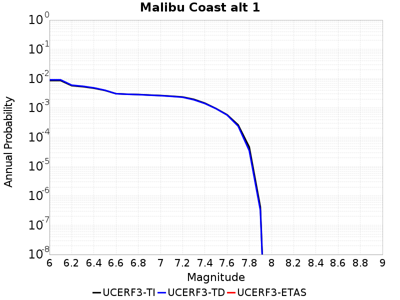 |
|-----|

| Magnitude | UCERF3-TI Prob | UCERF3-TD Prob | UCERF3-ETAS Prob |
|-----|-----|-----|-----|
| 6.0 | 0.0086101135 | 0.009134279 | 0.0 |
| 6.1 | 0.0086101135 | 0.009134279 | 0.0 |
| 6.2 | 0.0057677035 | 0.0060076807 | 0.0 |
| 6.3 | 0.0053125503 | 0.0055075586 | 0.0 |
| 6.4 | 0.0047205184 | 0.004859461 | 0.0 |
| 6.5 | 0.0039607463 | 0.0040321015 | 0.0 |
| 6.6 | 0.003068543 | 0.0030610834 | 0.0 |
| 6.7 | 0.0029520073 | 0.0029374033 | 0.0 |
| 6.8 | 0.0028769306 | 0.0028582553 | 0.0 |
| 6.9 | 0.0027603607 | 0.002733728 | 0.0 |
| 7.0 | 0.0026610855 | 0.0026285439 | 0.0 |
| 7.1 | 0.0025258875 | 0.0024843197 | 0.0 |
| 7.2 | 0.0023689792 | 0.0023167355 | 0.0 |
| 7.3 | 0.001977751 | 0.0019024642 | 0.0 |
| 7.4 | 0.0014642165 | 0.0014168216 | 0.0 |
| 7.5 | 9.5863023E-4 | 9.480534E-4 | 0.0 |
| 7.6 | 5.890623E-4 | 5.7344703E-4 | 0.0 |
| 7.7 | 2.642638E-4 | 2.4025259E-4 | 0.0 |
| 7.8 | 4.671434E-5 | 3.4912693E-5 | 0.0 |
| 7.9 | 4.1781706E-7 | 3.2131297E-7 | 0.0 |

## Manix-Afton Hills
*[(top)](#table-of-contents)*

|  |
|-----|

| Magnitude | UCERF3-TI Prob | UCERF3-TD Prob | UCERF3-ETAS Prob |
|-----|-----|-----|-----|
| 6.0 | 0.0071661277 | 0.007643232 | 0.0 |
| 6.1 | 0.0071661277 | 0.007643232 | 0.0 |
| 6.2 | 0.0071661277 | 0.007643232 | 0.0 |
| 6.3 | 0.005748908 | 0.0061314492 | 0.0 |
| 6.4 | 0.005748908 | 0.0061314492 | 0.0 |
| 6.5 | 0.0050947363 | 0.00543724 | 0.0 |
| 6.6 | 0.0045864056 | 0.0048973346 | 0.0 |
| 6.7 | 0.004581874 | 0.004892396 | 0.0 |
| 6.8 | 0.003593594 | 0.003841516 | 0.0 |
| 6.9 | 0.0025705635 | 0.0027452412 | 0.0 |
| 7.0 | 0.0017454025 | 0.0018705068 | 0.0 |
| 7.1 | 6.297835E-4 | 6.7436846E-4 | 0.0 |

## McKinleyville (alt1)
*[(top)](#table-of-contents)*

|  |
|-----|

| Magnitude | UCERF3-TI Prob | UCERF3-TD Prob | UCERF3-ETAS Prob |
|-----|-----|-----|-----|
| 6.0 | 0.005738032 | 0.006099429 | 0.0 |
| 6.1 | 0.005738032 | 0.006099429 | 0.0 |
| 6.2 | 0.005738032 | 0.006099429 | 0.0 |
| 6.3 | 0.005738032 | 0.006099429 | 0.0 |
| 6.4 | 0.005738032 | 0.006099429 | 0.0 |
| 6.5 | 0.005738032 | 0.006099429 | 0.0 |
| 6.6 | 0.005738032 | 0.006099429 | 0.0 |
| 6.7 | 0.003377227 | 0.0036008852 | 0.0 |
| 6.8 | 0.003377227 | 0.0036008852 | 0.0 |
| 6.9 | 0.0021054882 | 0.0022630317 | 0.0 |
| 7.0 | 0.0019699533 | 0.0021208893 | 0.0 |
| 7.1 | 0.0019159593 | 0.002064318 | 0.0 |
| 7.2 | 0.0015727748 | 0.0017043864 | 0.0 |
| 7.3 | 0.0012033667 | 0.0013122217 | 0.0 |
| 7.4 | 0.0010726595 | 0.0011730725 | 0.0 |
| 7.5 | 9.218261E-4 | 0.0010114614 | 0.0 |
| 7.6 | 6.7518733E-4 | 7.448786E-4 | 0.0 |
| 7.7 | 3.0291567E-4 | 3.3667422E-4 | 0.0 |
| 7.8 | 8.411359E-5 | 9.474791E-5 | 0.0 |

## McLean Lake
*[(top)](#table-of-contents)*

|  |
|-----|

| Magnitude | UCERF3-TI Prob | UCERF3-TD Prob | UCERF3-ETAS Prob |
|-----|-----|-----|-----|
| 6.0 | 0.009017491 | 0.009606195 | 0.0 |
| 6.1 | 0.0047176396 | 0.0049905106 | 0.0 |
| 6.2 | 0.0047176396 | 0.0049905106 | 0.0 |
| 6.3 | 0.0037797375 | 0.0039913435 | 0.0 |
| 6.4 | 0.0037797375 | 0.0039913435 | 0.0 |
| 6.5 | 0.0031600643 | 0.0033346498 | 0.0 |
| 6.6 | 0.0029170897 | 0.0030780556 | 0.0 |
| 6.7 | 0.0027340704 | 0.0028851028 | 0.0 |
| 6.8 | 0.0020970714 | 0.0022128872 | 0.0 |
| 6.9 | 3.5662777E-4 | 3.7234378E-4 | 0.0 |

## Mendocino
*[(top)](#table-of-contents)*

|  |
|-----|

| Magnitude | UCERF3-TI Prob | UCERF3-TD Prob | UCERF3-ETAS Prob |
|-----|-----|-----|-----|
| 6.0 | 0.25113493 | 0.4106544 | 0.1 |
| 6.1 | 0.19899574 | 0.32873952 | 0.1 |
| 6.2 | 0.19899574 | 0.32873952 | 0.1 |
| 6.3 | 0.1572094 | 0.25954586 | 0.1 |
| 6.4 | 0.13331394 | 0.21822593 | 0.1 |
| 6.5 | 0.11764851 | 0.19077629 | 0.1 |
| 6.6 | 0.10390546 | 0.16622435 | 0.1 |
| 6.7 | 0.063599944 | 0.089643225 | 0.0 |
| 6.8 | 0.057586733 | 0.07610365 | 0.0 |
| 6.9 | 0.050480947 | 0.0616281 | 0.0 |
| 7.0 | 0.04671385 | 0.054419637 | 0.0 |
| 7.1 | 0.042312626 | 0.046318125 | 0.0 |
| 7.2 | 0.040011603 | 0.042382423 | 0.0 |
| 7.3 | 0.035303112 | 0.03238621 | 0.0 |
| 7.4 | 0.02823963 | 0.019717874 | 0.0 |
| 7.5 | 0.020197518 | 0.0062746652 | 0.0 |
| 7.6 | 0.018819444 | 0.0050310874 | 0.0 |
| 7.7 | 0.016209139 | 0.002618974 | 0.0 |
| 7.8 | 0.011461443 | 0.0015794733 | 0.0 |
| 7.9 | 0.006573958 | 0.0011867314 | 0.0 |
| 8.0 | 0.0034144172 | 9.474467E-4 | 0.0 |
| 8.1 | 0.0016639848 | 7.901491E-4 | 0.0 |
| 8.2 | 0.0011052513 | 5.9710845E-4 | 0.0 |
| 8.3 | 3.9318635E-4 | 2.2335621E-4 | 0.0 |

## Mission (connected) 2011 CFM
*[(top)](#table-of-contents)*

|  |
|-----|

| Magnitude | UCERF3-TI Prob | UCERF3-TD Prob | UCERF3-ETAS Prob |
|-----|-----|-----|-----|
| 6.0 | 0.009728416 | 0.013830691 | 0.0 |
| 6.1 | 0.009098019 | 0.013132052 | 0.0 |
| 6.2 | 0.008565514 | 0.012537721 | 0.0 |
| 6.3 | 0.007915046 | 0.011732611 | 0.0 |
| 6.4 | 0.007504165 | 0.011019014 | 0.0 |
| 6.5 | 0.0067669353 | 0.009816711 | 0.0 |
| 6.6 | 0.005837737 | 0.008460233 | 0.0 |
| 6.7 | 0.004210367 | 0.006074127 | 0.0 |
| 6.8 | 0.0035606713 | 0.0052712136 | 0.0 |
| 6.9 | 0.0027365363 | 0.0040740273 | 0.0 |
| 7.0 | 0.0023246086 | 0.00347298 | 0.0 |
| 7.1 | 0.0021626868 | 0.0032398868 | 0.0 |
| 7.2 | 0.0011541754 | 0.0017478897 | 0.0 |
| 7.3 | 9.0555154E-4 | 0.0014233831 | 0.0 |
| 7.4 | 6.065701E-4 | 9.62013E-4 | 0.0 |
| 7.5 | 2.901265E-4 | 4.8661852E-4 | 0.0 |
| 7.6 | 2.3116439E-4 | 4.058562E-4 | 0.0 |
| 7.7 | 1.8986604E-4 | 3.323288E-4 | 0.0 |
| 7.8 | 1.6253842E-4 | 2.8549857E-4 | 0.0 |
| 7.9 | 9.410465E-5 | 1.9326199E-4 | 0.0 |
| 8.0 | 4.841707E-5 | 1.0164759E-4 | 0.0 |
| 8.1 | 3.0917407E-5 | 6.1074286E-5 | 0.0 |

## Mission Creek
*[(top)](#table-of-contents)*

| 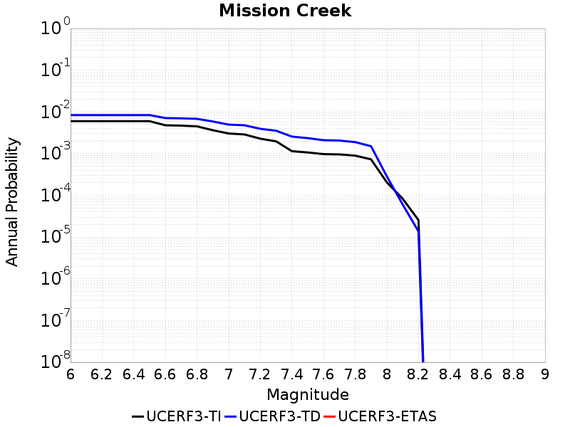 |
|-----|

| Magnitude | UCERF3-TI Prob | UCERF3-TD Prob | UCERF3-ETAS Prob |
|-----|-----|-----|-----|
| 6.0 | 0.006008218 | 0.008416521 | 0.0 |
| 6.1 | 0.006008218 | 0.008416521 | 0.0 |
| 6.2 | 0.006008218 | 0.008416521 | 0.0 |
| 6.3 | 0.006008218 | 0.008416521 | 0.0 |
| 6.4 | 0.006008218 | 0.008416521 | 0.0 |
| 6.5 | 0.006008218 | 0.008416521 | 0.0 |
| 6.6 | 0.004790339 | 0.0071343263 | 0.0 |
| 6.7 | 0.004695036 | 0.0070337034 | 0.0 |
| 6.8 | 0.0045155324 | 0.006838076 | 0.0 |
| 6.9 | 0.0036470229 | 0.0059075444 | 0.0 |
| 7.0 | 0.0030459496 | 0.0049766116 | 0.0 |
| 7.1 | 0.0028901845 | 0.004797514 | 0.0 |
| 7.2 | 0.0022852682 | 0.0039453306 | 0.0 |
| 7.3 | 0.0019750162 | 0.0035487253 | 0.0 |
| 7.4 | 0.0011463572 | 0.0025668924 | 0.0 |
| 7.5 | 0.0010700922 | 0.0023567325 | 0.0 |
| 7.6 | 9.770069E-4 | 0.0021039497 | 0.0 |
| 7.7 | 9.6024893E-4 | 0.002062733 | 0.0 |
| 7.8 | 8.967699E-4 | 0.00189379 | 0.0 |
| 7.9 | 7.3206134E-4 | 0.0015069108 | 0.0 |
| 8.0 | 2.0513899E-4 | 2.84897E-4 | 0.0 |
| 8.1 | 8.331492E-5 | 6.051418E-5 | 0.0 |
| 8.2 | 2.556876E-5 | 1.3673184E-5 | 0.0 |

## Mission Hills 2011
*[(top)](#table-of-contents)*

| 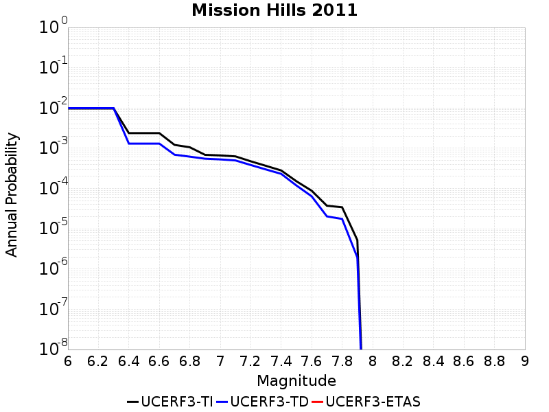 |
|-----|

| Magnitude | UCERF3-TI Prob | UCERF3-TD Prob | UCERF3-ETAS Prob |
|-----|-----|-----|-----|
| 6.0 | 0.009743992 | 0.009913387 | 0.0 |
| 6.1 | 0.009743992 | 0.009913387 | 0.0 |
| 6.2 | 0.009743992 | 0.009913387 | 0.0 |
| 6.3 | 0.009743992 | 0.009913387 | 0.0 |
| 6.4 | 0.002379829 | 0.0013092555 | 0.0 |
| 6.5 | 0.002379829 | 0.0013092555 | 0.0 |
| 6.6 | 0.002379829 | 0.0013092555 | 0.0 |
| 6.7 | 0.0012132917 | 6.924594E-4 | 0.0 |
| 6.8 | 0.0010600908 | 6.194479E-4 | 0.0 |
| 6.9 | 6.8780396E-4 | 5.501812E-4 | 0.0 |
| 7.0 | 6.6380535E-4 | 5.291933E-4 | 0.0 |
| 7.1 | 6.2928005E-4 | 4.9853115E-4 | 0.0 |
| 7.2 | 4.7501532E-4 | 3.8420432E-4 | 0.0 |
| 7.3 | 3.6624918E-4 | 2.974007E-4 | 0.0 |
| 7.4 | 2.8120633E-4 | 2.3162627E-4 | 0.0 |
| 7.5 | 1.5167553E-4 | 1.18989235E-4 | 0.0 |
| 7.6 | 8.8197085E-5 | 6.4141015E-5 | 0.0 |
| 7.7 | 3.7401285E-5 | 2.0327305E-5 | 0.0 |
| 7.8 | 3.424996E-5 | 1.7564675E-5 | 0.0 |
| 7.9 | 5.2330133E-6 | 1.9318818E-6 | 0.0 |

## Mission Ridge-Arroyo Parida-Santa Ana
*[(top)](#table-of-contents)*

|  |
|-----|

| Magnitude | UCERF3-TI Prob | UCERF3-TD Prob | UCERF3-ETAS Prob |
|-----|-----|-----|-----|
| 6.0 | 0.021518968 | 0.024330469 | 0.0 |
| 6.1 | 0.009028391 | 0.008742363 | 0.0 |
| 6.2 | 0.007600669 | 0.007097644 | 0.0 |
| 6.3 | 0.00704657 | 0.0064810226 | 0.0 |
| 6.4 | 0.006810953 | 0.00622048 | 0.0 |
| 6.5 | 0.006372592 | 0.0057384055 | 0.0 |
| 6.6 | 0.0059059616 | 0.0052275634 | 0.0 |
| 6.7 | 0.005652734 | 0.004944199 | 0.0 |
| 6.8 | 0.005550127 | 0.0048315115 | 0.0 |
| 6.9 | 0.005224364 | 0.0044644093 | 0.0 |
| 7.0 | 0.00496445 | 0.0041702637 | 0.0 |
| 7.1 | 0.004792784 | 0.0039768815 | 0.0 |
| 7.2 | 0.0039775306 | 0.0030832854 | 0.0 |
| 7.3 | 0.0037758215 | 0.0029093088 | 0.0 |
| 7.4 | 0.0033286542 | 0.0025573918 | 0.0 |
| 7.5 | 0.0028027708 | 0.0021237843 | 0.0 |
| 7.6 | 0.0021511333 | 0.0016062348 | 0.0 |
| 7.7 | 0.0013248142 | 9.5073855E-4 | 0.0 |
| 7.8 | 2.5359896E-4 | 1.8275523E-4 | 0.0 |
| 7.9 | 1.0682209E-5 | 6.603773E-6 | 0.0 |
| 8.0 | 2.3185949E-6 | 1.054597E-6 | 0.0 |

## Mohawk Valley 2011 CFM
*[(top)](#table-of-contents)*

| 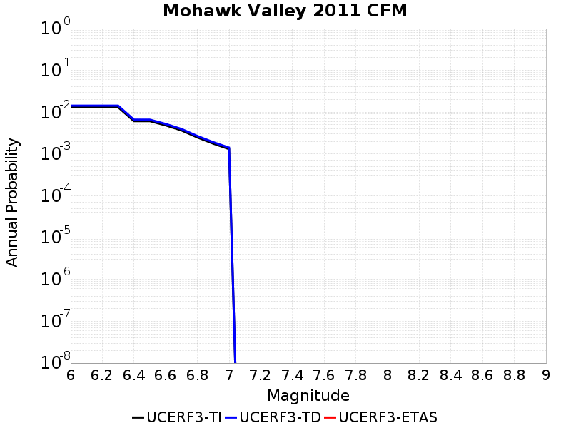 |
|-----|

| Magnitude | UCERF3-TI Prob | UCERF3-TD Prob | UCERF3-ETAS Prob |
|-----|-----|-----|-----|
| 6.0 | 0.013179175 | 0.0143199945 | 0.0 |
| 6.1 | 0.013179175 | 0.0143199945 | 0.0 |
| 6.2 | 0.013179175 | 0.0143199945 | 0.0 |
| 6.3 | 0.013179175 | 0.0143199945 | 0.0 |
| 6.4 | 0.0061447476 | 0.006633806 | 0.0 |
| 6.5 | 0.0061447476 | 0.006633806 | 0.0 |
| 6.6 | 0.0048627043 | 0.005245442 | 0.0 |
| 6.7 | 0.0036802588 | 0.0039680297 | 0.0 |
| 6.8 | 0.0025049183 | 0.002701424 | 0.0 |
| 6.9 | 0.0017810026 | 0.0019219551 | 0.0 |
| 7.0 | 0.0013177756 | 0.0014233281 | 0.0 |

## Mono Lake 2011 CFM
*[(top)](#table-of-contents)*

|  |
|-----|

| Magnitude | UCERF3-TI Prob | UCERF3-TD Prob | UCERF3-ETAS Prob |
|-----|-----|-----|-----|
| 6.0 | 0.010557966 | 0.0123917125 | 0.0 |
| 6.1 | 0.010557966 | 0.0123917125 | 0.0 |
| 6.2 | 0.010557966 | 0.0123917125 | 0.0 |
| 6.3 | 0.010557966 | 0.0123917125 | 0.0 |
| 6.4 | 0.009088841 | 0.010672822 | 0.0 |
| 6.5 | 0.009088841 | 0.010672822 | 0.0 |

## Monte Vista - Shannon 2011 CFM
*[(top)](#table-of-contents)*

|  |
|-----|

| Magnitude | UCERF3-TI Prob | UCERF3-TD Prob | UCERF3-ETAS Prob |
|-----|-----|-----|-----|
| 6.0 | 0.014456532 | 0.014283743 | 0.0 |
| 6.1 | 0.014456532 | 0.014283743 | 0.0 |
| 6.2 | 0.014456532 | 0.014283743 | 0.0 |
| 6.3 | 0.014456532 | 0.014283743 | 0.0 |
| 6.4 | 0.014456532 | 0.014283743 | 0.0 |
| 6.5 | 0.0093431985 | 0.0086384155 | 0.0 |
| 6.6 | 0.005022812 | 0.0038756174 | 0.0 |
| 6.7 | 0.0050113243 | 0.0038641673 | 0.0 |
| 6.8 | 0.0035873733 | 0.0023182486 | 0.0 |
| 6.9 | 0.003267423 | 0.0019758893 | 0.0 |
| 7.0 | 0.0028823826 | 0.0015740704 | 0.0 |
| 7.1 | 0.002022175 | 6.6451554E-4 | 0.0 |
| 7.2 | 0.0018148809 | 5.004786E-4 | 0.0 |
| 7.3 | 0.0016517661 | 3.996568E-4 | 0.0 |
| 7.4 | 0.0015489052 | 3.8060418E-4 | 0.0 |
| 7.5 | 0.0012235056 | 3.1195706E-4 | 0.0 |
| 7.6 | 0.0011018137 | 2.7308558E-4 | 0.0 |
| 7.7 | 8.878146E-4 | 2.2059922E-4 | 0.0 |
| 7.8 | 3.7722773E-4 | 1.9519482E-4 | 0.0 |
| 7.9 | 2.2741247E-4 | 1.7948853E-4 | 0.0 |
| 8.0 | 1.21660116E-4 | 1.6485454E-4 | 0.0 |
| 8.1 | 7.650368E-5 | 1.058232E-4 | 0.0 |
| 8.2 | 2.8662573E-6 | 2.6117543E-6 | 0.0 |

## Monterey Bay-Tularcitos
*[(top)](#table-of-contents)*

| 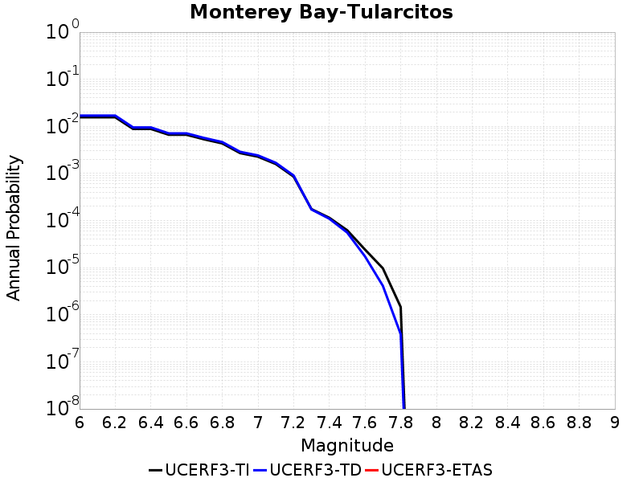 |
|-----|

| Magnitude | UCERF3-TI Prob | UCERF3-TD Prob | UCERF3-ETAS Prob |
|-----|-----|-----|-----|
| 6.0 | 0.015599402 | 0.01696409 | 0.0 |
| 6.1 | 0.015599402 | 0.01696409 | 0.0 |
| 6.2 | 0.015599402 | 0.01696409 | 0.0 |
| 6.3 | 0.0088303005 | 0.009513275 | 0.0 |
| 6.4 | 0.0088303005 | 0.009513275 | 0.0 |
| 6.5 | 0.0066292146 | 0.007114958 | 0.0 |
| 6.6 | 0.0066252467 | 0.0071108597 | 0.0 |
| 6.7 | 0.005287399 | 0.005660295 | 0.0 |
| 6.8 | 0.004347378 | 0.0046470864 | 0.0 |
| 6.9 | 0.0027063051 | 0.0028828196 | 0.0 |
| 7.0 | 0.0022720827 | 0.0024183767 | 0.0 |
| 7.1 | 0.001584897 | 0.0016834574 | 0.0 |
| 7.2 | 8.5658056E-4 | 9.034982E-4 | 0.0 |
| 7.3 | 1.7513991E-4 | 1.7175761E-4 | 0.0 |
| 7.4 | 1.1464794E-4 | 1.0945374E-4 | 0.0 |
| 7.5 | 6.2320854E-5 | 5.568063E-5 | 0.0 |
| 7.6 | 2.4189996E-5 | 1.7308643E-5 | 0.0 |
| 7.7 | 9.699204E-6 | 4.114272E-6 | 0.0 |
| 7.8 | 1.4589199E-6 | 3.869885E-7 | 0.0 |

## Morales (East)
*[(top)](#table-of-contents)*

|  |
|-----|

| Magnitude | UCERF3-TI Prob | UCERF3-TD Prob | UCERF3-ETAS Prob |
|-----|-----|-----|-----|
| 6.0 | 7.793892E-4 | 0.0010932469 | 0.0 |
| 6.1 | 7.793892E-4 | 0.0010932469 | 0.0 |
| 6.2 | 7.793892E-4 | 0.0010932469 | 0.0 |
| 6.3 | 7.793892E-4 | 0.0010932469 | 0.0 |
| 6.4 | 4.59006E-4 | 7.69398E-4 | 0.0 |
| 6.5 | 3.743203E-4 | 6.839698E-4 | 0.0 |
| 6.6 | 3.743203E-4 | 6.839698E-4 | 0.0 |
| 6.7 | 3.7347974E-4 | 6.826564E-4 | 0.0 |
| 6.8 | 3.6686313E-4 | 6.7312544E-4 | 0.0 |
| 6.9 | 3.6213463E-4 | 6.6541287E-4 | 0.0 |
| 7.0 | 3.283177E-4 | 6.061571E-4 | 0.0 |
| 7.1 | 2.9320567E-4 | 5.422809E-4 | 0.0 |
| 7.2 | 2.56187E-4 | 4.7232333E-4 | 0.0 |
| 7.3 | 2.242303E-4 | 4.0511528E-4 | 0.0 |
| 7.4 | 1.969191E-4 | 3.4531805E-4 | 0.0 |
| 7.5 | 5.532462E-5 | 4.9440325E-5 | 0.0 |
| 7.6 | 5.1970514E-5 | 4.393874E-5 | 0.0 |
| 7.7 | 3.3912722E-5 | 2.0414183E-5 | 0.0 |
| 7.8 | 1.1749043E-5 | 3.5253802E-6 | 0.0 |
| 7.9 | 4.4315284E-6 | 4.785731E-7 | 0.0 |
| 8.0 | 7.81209E-7 | 2.5421647E-8 | 0.0 |

## Morales (West)
*[(top)](#table-of-contents)*

|  |
|-----|

| Magnitude | UCERF3-TI Prob | UCERF3-TD Prob | UCERF3-ETAS Prob |
|-----|-----|-----|-----|
| 6.0 | 7.316453E-4 | 7.6819357E-4 | 0.0 |
| 6.1 | 7.316453E-4 | 7.6819357E-4 | 0.0 |
| 6.2 | 7.316453E-4 | 7.6819357E-4 | 0.0 |
| 6.3 | 7.316453E-4 | 7.6819357E-4 | 0.0 |
| 6.4 | 3.3933815E-4 | 3.7246497E-4 | 0.0 |
| 6.5 | 3.3933815E-4 | 3.7246497E-4 | 0.0 |
| 6.6 | 3.0288487E-4 | 3.3575986E-4 | 0.0 |
| 6.7 | 2.9953578E-4 | 3.3238588E-4 | 0.0 |
| 6.8 | 2.7647841E-4 | 3.041082E-4 | 0.0 |
| 6.9 | 2.516747E-4 | 2.7554433E-4 | 0.0 |
| 7.0 | 2.2572262E-4 | 2.4530033E-4 | 0.0 |
| 7.1 | 1.950692E-4 | 2.0589303E-4 | 0.0 |
| 7.2 | 1.6483181E-4 | 1.7050661E-4 | 0.0 |
| 7.3 | 1.18322445E-4 | 1.114973E-4 | 0.0 |
| 7.4 | 6.415427E-5 | 4.258869E-5 | 0.0 |
| 7.5 | 5.198549E-5 | 2.7709206E-5 | 0.0 |
| 7.6 | 4.2398857E-5 | 1.8241892E-5 | 0.0 |
| 7.7 | 2.7033753E-5 | 5.7980064E-6 | 0.0 |
| 7.8 | 1.3730719E-5 | 1.1321406E-6 | 0.0 |
| 7.9 | 6.4848123E-6 | 1.9605345E-7 | 0.0 |
| 8.0 | 3.1068191E-6 | 8.5392834E-8 | 0.0 |
| 8.1 | 6.56733E-7 | 3.909953E-8 | 0.0 |

## Mount Diablo Thrust North CFM
*[(top)](#table-of-contents)*

| 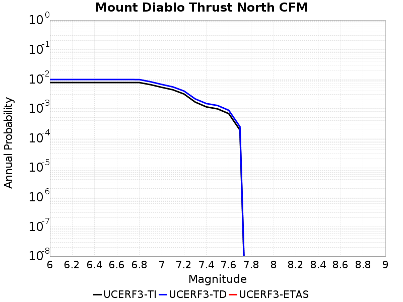 |
|-----|

| Magnitude | UCERF3-TI Prob | UCERF3-TD Prob | UCERF3-ETAS Prob |
|-----|-----|-----|-----|
| 6.0 | 0.007690818 | 0.009719443 | 0.0 |
| 6.1 | 0.007690818 | 0.009719443 | 0.0 |
| 6.2 | 0.007690818 | 0.009719443 | 0.0 |
| 6.3 | 0.007690818 | 0.009719443 | 0.0 |
| 6.4 | 0.007690818 | 0.009719443 | 0.0 |
| 6.5 | 0.007690818 | 0.009719443 | 0.0 |
| 6.6 | 0.007687649 | 0.009715888 | 0.0 |
| 6.7 | 0.007687649 | 0.009715888 | 0.0 |
| 6.8 | 0.007678074 | 0.009704934 | 0.0 |
| 6.9 | 0.006526142 | 0.008195838 | 0.0 |
| 7.0 | 0.005295345 | 0.0066444413 | 0.0 |
| 7.1 | 0.0043725655 | 0.005476298 | 0.0 |
| 7.2 | 0.0031387066 | 0.003969668 | 0.0 |
| 7.3 | 0.0016735174 | 0.002145989 | 0.0 |
| 7.4 | 0.0011494348 | 0.0014913279 | 0.0 |
| 7.5 | 9.841E-4 | 0.0012814172 | 0.0 |
| 7.6 | 6.787415E-4 | 8.815498E-4 | 0.0 |
| 7.7 | 1.8800174E-4 | 2.446867E-4 | 0.0 |

## Mount Diablo Thrust South
*[(top)](#table-of-contents)*

| 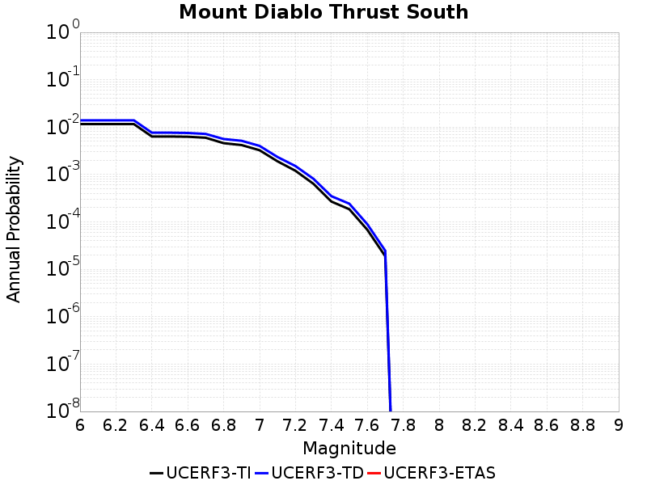 |
|-----|

| Magnitude | UCERF3-TI Prob | UCERF3-TD Prob | UCERF3-ETAS Prob |
|-----|-----|-----|-----|
| 6.0 | 0.011608457 | 0.013955084 | 0.0 |
| 6.1 | 0.011608457 | 0.013955084 | 0.0 |
| 6.2 | 0.011608457 | 0.013955084 | 0.0 |
| 6.3 | 0.011608457 | 0.013955084 | 0.0 |
| 6.4 | 0.0063603627 | 0.0076469406 | 0.0 |
| 6.5 | 0.0063603627 | 0.0076469406 | 0.0 |
| 6.6 | 0.006277225 | 0.0075460863 | 0.0 |
| 6.7 | 0.0059823063 | 0.0071959537 | 0.0 |
| 6.8 | 0.0045922096 | 0.005618941 | 0.0 |
| 6.9 | 0.004190082 | 0.0051572127 | 0.0 |
| 7.0 | 0.0032597475 | 0.004026796 | 0.0 |
| 7.1 | 0.0019019748 | 0.002346428 | 0.0 |
| 7.2 | 0.0012011749 | 0.00151071 | 0.0 |
| 7.3 | 6.384805E-4 | 8.148202E-4 | 0.0 |
| 7.4 | 2.6921128E-4 | 3.4979294E-4 | 0.0 |
| 7.5 | 1.8536777E-4 | 2.4261995E-4 | 0.0 |
| 7.6 | 6.8477246E-5 | 8.967975E-5 | 0.0 |
| 7.7 | 1.8884823E-5 | 2.4690815E-5 | 0.0 |

## Nelson Lake
*[(top)](#table-of-contents)*

| 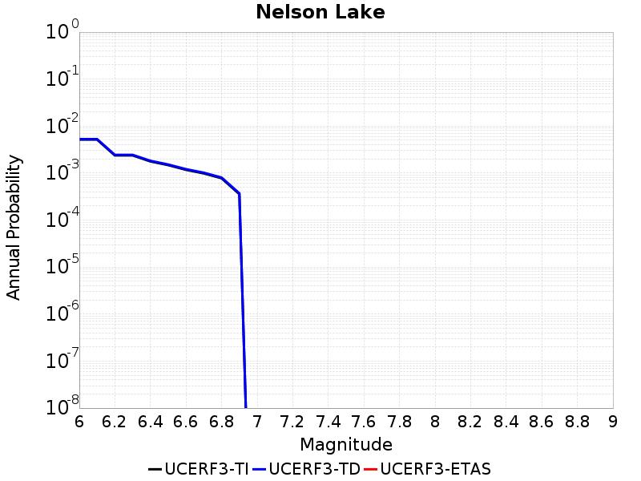 |
|-----|

| Magnitude | UCERF3-TI Prob | UCERF3-TD Prob | UCERF3-ETAS Prob |
|-----|-----|-----|-----|
| 6.0 | 0.0051593683 | 0.0053036483 | 0.0 |
| 6.1 | 0.0051593683 | 0.0053036483 | 0.0 |
| 6.2 | 0.0023763329 | 0.0024468463 | 0.0 |
| 6.3 | 0.0023763329 | 0.0024468463 | 0.0 |
| 6.4 | 0.001773841 | 0.0018292294 | 0.0 |
| 6.5 | 0.0014783246 | 0.0015261098 | 0.0 |
| 6.6 | 0.0011741214 | 0.0012141683 | 0.0 |
| 6.7 | 9.863076E-4 | 0.0010214095 | 0.0 |
| 6.8 | 7.75846E-4 | 8.0496265E-4 | 0.0 |
| 6.9 | 3.5662777E-4 | 3.7234378E-4 | 0.0 |

## Newport-Inglewood (Offshore)
*[(top)](#table-of-contents)*

| 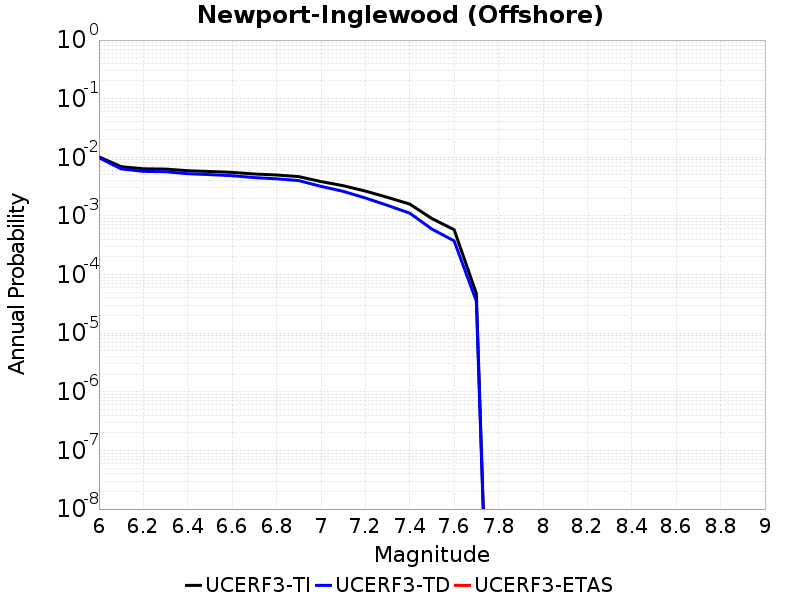 |
|-----|

| Magnitude | UCERF3-TI Prob | UCERF3-TD Prob | UCERF3-ETAS Prob |
|-----|-----|-----|-----|
| 6.0 | 0.010188672 | 0.009836853 | 0.0 |
| 6.1 | 0.006925544 | 0.006346004 | 0.0 |
| 6.2 | 0.006371971 | 0.0057540652 | 0.0 |
| 6.3 | 0.0062970007 | 0.0056726104 | 0.0 |
| 6.4 | 0.005904155 | 0.0052527953 | 0.0 |
| 6.5 | 0.005727576 | 0.0050629657 | 0.0 |
| 6.6 | 0.0055336943 | 0.004856565 | 0.0 |
| 6.7 | 0.0051929182 | 0.004504894 | 0.0 |
| 6.8 | 0.004994285 | 0.0042998507 | 0.0 |
| 6.9 | 0.004685402 | 0.0040060957 | 0.0 |
| 7.0 | 0.0038574322 | 0.0031974956 | 0.0 |
| 7.1 | 0.003281663 | 0.002630281 | 0.0 |
| 7.2 | 0.0026558342 | 0.0020249106 | 0.0 |
| 7.3 | 0.00207211 | 0.0015137463 | 0.0 |
| 7.4 | 0.0015937461 | 0.0011157404 | 0.0 |
| 7.5 | 9.01189E-4 | 5.960573E-4 | 0.0 |
| 7.6 | 5.8195676E-4 | 3.7528234E-4 | 0.0 |
| 7.7 | 4.7575148E-5 | 3.51191E-5 | 0.0 |

## Newport-Inglewood alt 1
*[(top)](#table-of-contents)*

| 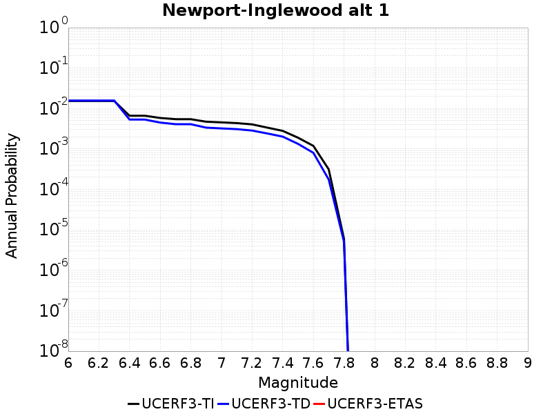 |
|-----|

| Magnitude | UCERF3-TI Prob | UCERF3-TD Prob | UCERF3-ETAS Prob |
|-----|-----|-----|-----|
| 6.0 | 0.015361829 | 0.01576033 | 0.0 |
| 6.1 | 0.015361829 | 0.01576033 | 0.0 |
| 6.2 | 0.015361829 | 0.01576033 | 0.0 |
| 6.3 | 0.015361829 | 0.01576033 | 0.0 |
| 6.4 | 0.0066356123 | 0.0053364267 | 0.0 |
| 6.5 | 0.0066356123 | 0.0053364267 | 0.0 |
| 6.6 | 0.005855706 | 0.0045011025 | 0.0 |
| 6.7 | 0.0054662596 | 0.0041055363 | 0.0 |
| 6.8 | 0.005451347 | 0.0040958663 | 0.0 |
| 6.9 | 0.004724967 | 0.0033730806 | 0.0 |
| 7.0 | 0.0045489795 | 0.00322874 | 0.0 |
| 7.1 | 0.004368907 | 0.0030955474 | 0.0 |
| 7.2 | 0.0040600533 | 0.0028579014 | 0.0 |
| 7.3 | 0.0033722918 | 0.0024177812 | 0.0 |
| 7.4 | 0.0028043943 | 0.0020216752 | 0.0 |
| 7.5 | 0.0019017943 | 0.0013389116 | 0.0 |
| 7.6 | 0.0011945361 | 8.050415E-4 | 0.0 |
| 7.7 | 3.1552566E-4 | 1.7711722E-4 | 0.0 |
| 7.8 | 6.05567E-6 | 5.10352E-6 | 0.0 |

## North Frontal  (East)
*[(top)](#table-of-contents)*

| 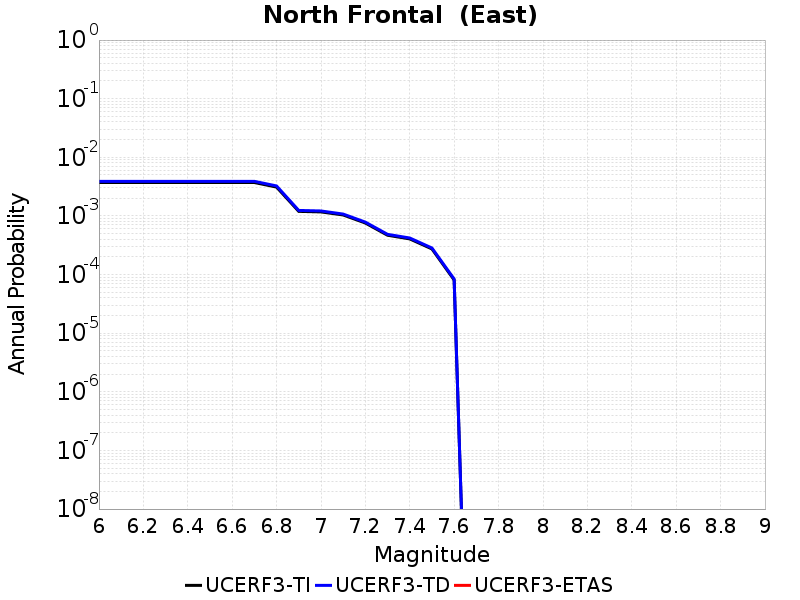 |
|-----|

| Magnitude | UCERF3-TI Prob | UCERF3-TD Prob | UCERF3-ETAS Prob |
|-----|-----|-----|-----|
| 6.0 | 0.0037164164 | 0.0038941153 | 0.0 |
| 6.1 | 0.0037164164 | 0.0038941153 | 0.0 |
| 6.2 | 0.0037164164 | 0.0038941153 | 0.0 |
| 6.3 | 0.0037164164 | 0.0038941153 | 0.0 |
| 6.4 | 0.0037164164 | 0.0038941153 | 0.0 |
| 6.5 | 0.0037164164 | 0.0038941153 | 0.0 |
| 6.6 | 0.0037164164 | 0.0038941153 | 0.0 |
| 6.7 | 0.0037164164 | 0.0038941153 | 0.0 |
| 6.8 | 0.0031045752 | 0.003249314 | 0.0 |
| 6.9 | 0.0011966228 | 0.001241918 | 0.0 |
| 7.0 | 0.0011716976 | 0.0012157148 | 0.0 |
| 7.1 | 0.0010389143 | 0.0010763396 | 0.0 |
| 7.2 | 7.575835E-4 | 7.844603E-4 | 0.0 |
| 7.3 | 4.6846745E-4 | 4.854255E-4 | 0.0 |
| 7.4 | 4.0566566E-4 | 4.203472E-4 | 0.0 |
| 7.5 | 2.7360884E-4 | 2.8377085E-4 | 0.0 |
| 7.6 | 8.08195E-5 | 8.39175E-5 | 0.0 |

## North Frontal  (West)
*[(top)](#table-of-contents)*

|  |
|-----|

| Magnitude | UCERF3-TI Prob | UCERF3-TD Prob | UCERF3-ETAS Prob |
|-----|-----|-----|-----|
| 6.0 | 0.0024658558 | 0.0025282465 | 0.0 |
| 6.1 | 0.0024658558 | 0.0025282465 | 0.0 |
| 6.2 | 0.0024658558 | 0.0025282465 | 0.0 |
| 6.3 | 0.0024658558 | 0.0025282465 | 0.0 |
| 6.4 | 0.0024658558 | 0.0025282465 | 0.0 |
| 6.5 | 0.0024658558 | 0.0025282465 | 0.0 |
| 6.6 | 0.0024658558 | 0.0025282465 | 0.0 |
| 6.7 | 0.0018445229 | 0.0018922248 | 0.0 |
| 6.8 | 0.0018445229 | 0.0018922248 | 0.0 |
| 6.9 | 0.0015864341 | 0.001627618 | 0.0 |
| 7.0 | 0.0013238228 | 0.0013584767 | 0.0 |
| 7.1 | 0.0011691054 | 0.0011996378 | 0.0 |
| 7.2 | 8.61971E-4 | 8.8243413E-4 | 0.0 |
| 7.3 | 5.344801E-4 | 5.4452114E-4 | 0.0 |
| 7.4 | 4.6451724E-4 | 4.7227807E-4 | 0.0 |
| 7.5 | 3.3053322E-4 | 3.3390234E-4 | 0.0 |
| 7.6 | 1.3089196E-4 | 1.270527E-4 | 0.0 |
| 7.7 | 1.7130013E-5 | 1.1925703E-5 | 0.0 |
| 7.8 | 4.5786537E-6 | 2.9619737E-6 | 0.0 |

## North Salt Lake
*[(top)](#table-of-contents)*

|  |
|-----|

| Magnitude | UCERF3-TI Prob | UCERF3-TD Prob | UCERF3-ETAS Prob |
|-----|-----|-----|-----|
| 6.0 | 9.646297E-4 | 0.0010194768 | 0.0 |
| 6.1 | 9.646297E-4 | 0.0010194768 | 0.0 |
| 6.2 | 9.646297E-4 | 0.0010194768 | 0.0 |
| 6.3 | 9.646297E-4 | 0.0010194768 | 0.0 |
| 6.4 | 9.28552E-4 | 9.832497E-4 | 0.0 |
| 6.5 | 3.0862886E-4 | 3.2846117E-4 | 0.0 |
| 6.6 | 3.0862886E-4 | 3.2846117E-4 | 0.0 |
| 6.7 | 3.0862886E-4 | 3.2846117E-4 | 0.0 |
| 6.8 | 2.4800675E-4 | 2.6412346E-4 | 0.0 |
| 6.9 | 1.8962687E-4 | 2.0203354E-4 | 0.0 |
| 7.0 | 1.2567634E-4 | 1.3404548E-4 | 0.0 |
| 7.1 | 4.46198E-5 | 4.7163285E-5 | 0.0 |
| 7.2 | 1.2915569E-5 | 1.3504072E-5 | 0.0 |
| 7.3 | 7.937579E-6 | 8.265336E-6 | 0.0 |
| 7.4 | 4.269242E-6 | 4.4061735E-6 | 0.0 |
| 7.5 | 2.8593363E-6 | 2.956439E-6 | 0.0 |
| 7.6 | 1.3990932E-7 | 1.4464949E-7 | 0.0 |

## North Tahoe 2011 CFM
*[(top)](#table-of-contents)*

|  |
|-----|

| Magnitude | UCERF3-TI Prob | UCERF3-TD Prob | UCERF3-ETAS Prob |
|-----|-----|-----|-----|
| 6.0 | 0.011157839 | 0.011506863 | 0.0 |
| 6.1 | 0.011157839 | 0.011506863 | 0.0 |
| 6.2 | 0.011157839 | 0.011506863 | 0.0 |
| 6.3 | 0.011157839 | 0.011506863 | 0.0 |
| 6.4 | 0.003831072 | 0.0033567653 | 0.0 |
| 6.5 | 0.003831072 | 0.0033567653 | 0.0 |
| 6.6 | 0.0035683226 | 0.0030653826 | 0.0 |
| 6.7 | 9.6541987E-4 | 3.1788019E-4 | 0.0 |

## Northridge
*[(top)](#table-of-contents)*

| 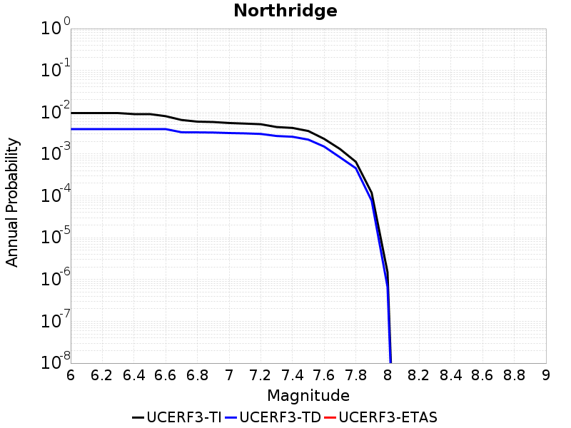 |
|-----|

| Magnitude | UCERF3-TI Prob | UCERF3-TD Prob | UCERF3-ETAS Prob |
|-----|-----|-----|-----|
| 6.0 | 0.009524435 | 0.00394216 | 0.0 |
| 6.1 | 0.009524435 | 0.00394216 | 0.0 |
| 6.2 | 0.009524435 | 0.00394216 | 0.0 |
| 6.3 | 0.009524435 | 0.00394216 | 0.0 |
| 6.4 | 0.009018354 | 0.00394216 | 0.0 |
| 6.5 | 0.009018354 | 0.00394216 | 0.0 |
| 6.6 | 0.008033488 | 0.00394216 | 0.0 |
| 6.7 | 0.0065210275 | 0.0033160727 | 0.0 |
| 6.8 | 0.005950495 | 0.0032999348 | 0.0 |
| 6.9 | 0.0058295266 | 0.0032670598 | 0.0 |
| 7.0 | 0.0055211177 | 0.0031781087 | 0.0 |
| 7.1 | 0.0053428668 | 0.0031204706 | 0.0 |
| 7.2 | 0.0051589934 | 0.0030247732 | 0.0 |
| 7.3 | 0.00442326 | 0.0026991714 | 0.0 |
| 7.4 | 0.0042096223 | 0.0025895291 | 0.0 |
| 7.5 | 0.0035533418 | 0.0022115682 | 0.0 |
| 7.6 | 0.0023048974 | 0.001508 | 0.0 |
| 7.7 | 0.0013190953 | 8.3474285E-4 | 0.0 |
| 7.8 | 6.524452E-4 | 4.576503E-4 | 0.0 |
| 7.9 | 1.1803136E-4 | 7.638885E-5 | 0.0 |
| 8.0 | 1.4951038E-6 | 6.619413E-7 | 0.0 |

## Northridge Hills
*[(top)](#table-of-contents)*

| 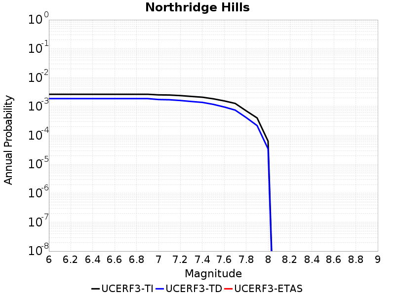 |
|-----|

| Magnitude | UCERF3-TI Prob | UCERF3-TD Prob | UCERF3-ETAS Prob |
|-----|-----|-----|-----|
| 6.0 | 0.0026554854 | 0.0018807373 | 0.0 |
| 6.1 | 0.0026554854 | 0.0018807373 | 0.0 |
| 6.2 | 0.0026554854 | 0.0018807373 | 0.0 |
| 6.3 | 0.0026554854 | 0.0018807373 | 0.0 |
| 6.4 | 0.0026554854 | 0.0018807373 | 0.0 |
| 6.5 | 0.0026554854 | 0.0018807373 | 0.0 |
| 6.6 | 0.0026554854 | 0.0018807373 | 0.0 |
| 6.7 | 0.0026554854 | 0.0018807373 | 0.0 |
| 6.8 | 0.0026554854 | 0.0018807373 | 0.0 |
| 6.9 | 0.002654592 | 0.001879808 | 0.0 |
| 7.0 | 0.0025280623 | 0.0017472147 | 0.0 |
| 7.1 | 0.0024967908 | 0.0017150826 | 0.0 |
| 7.2 | 0.0023869718 | 0.0016160443 | 0.0 |
| 7.3 | 0.0022359942 | 0.0014918954 | 0.0 |
| 7.4 | 0.002098492 | 0.0013907294 | 0.0 |
| 7.5 | 0.0018494357 | 0.0011883256 | 0.0 |
| 7.6 | 0.0015636457 | 9.631932E-4 | 0.0 |
| 7.7 | 0.001279793 | 7.516437E-4 | 0.0 |
| 7.8 | 7.1058323E-4 | 4.1647075E-4 | 0.0 |
| 7.9 | 4.0256142E-4 | 2.1897152E-4 | 0.0 |
| 8.0 | 6.3226486E-5 | 3.4372315E-5 | 0.0 |

## Oak Ridge (Onshore)
*[(top)](#table-of-contents)*

| 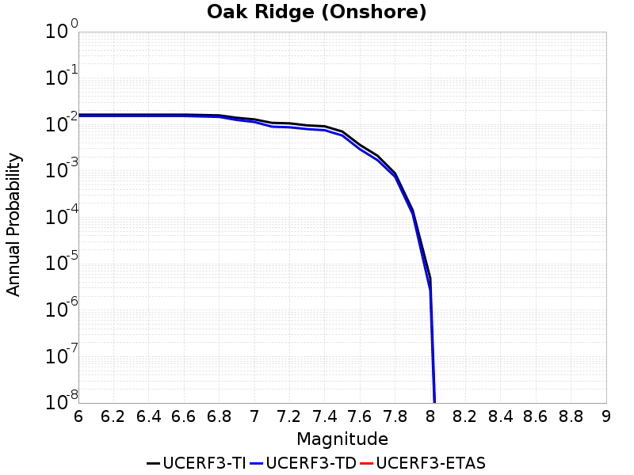 |
|-----|

| Magnitude | UCERF3-TI Prob | UCERF3-TD Prob | UCERF3-ETAS Prob |
|-----|-----|-----|-----|
| 6.0 | 0.01632816 | 0.015267436 | 0.0 |
| 6.1 | 0.01632816 | 0.015267436 | 0.0 |
| 6.2 | 0.01632816 | 0.015267436 | 0.0 |
| 6.3 | 0.01632816 | 0.015267436 | 0.0 |
| 6.4 | 0.01632816 | 0.015267436 | 0.0 |
| 6.5 | 0.01632816 | 0.015267436 | 0.0 |
| 6.6 | 0.01632816 | 0.015267436 | 0.0 |
| 6.7 | 0.016039822 | 0.014927914 | 0.0 |
| 6.8 | 0.015762992 | 0.014607186 | 0.0 |
| 6.9 | 0.0139789665 | 0.012539975 | 0.0 |
| 7.0 | 0.012905477 | 0.011325864 | 0.0 |
| 7.1 | 0.0108696 | 0.008999859 | 0.0 |
| 7.2 | 0.010608427 | 0.008718353 | 0.0 |
| 7.3 | 0.009587734 | 0.007980808 | 0.0 |
| 7.4 | 0.009157699 | 0.0075337654 | 0.0 |
| 7.5 | 0.007068595 | 0.005797918 | 0.0 |
| 7.6 | 0.0036401073 | 0.0029301064 | 0.0 |
| 7.7 | 0.0021278851 | 0.0017076642 | 0.0 |
| 7.8 | 8.8787393E-4 | 7.490667E-4 | 0.0 |
| 7.9 | 1.4197957E-4 | 1.1791252E-4 | 0.0 |
| 8.0 | 4.8861225E-6 | 2.6613618E-6 | 0.0 |

## Oceanic - West Huasna
*[(top)](#table-of-contents)*

|  |
|-----|

| Magnitude | UCERF3-TI Prob | UCERF3-TD Prob | UCERF3-ETAS Prob |
|-----|-----|-----|-----|
| 6.0 | 0.016536033 | 0.014455256 | 0.0 |
| 6.1 | 0.010978713 | 0.009117713 | 0.0 |
| 6.2 | 0.008414844 | 0.0069211237 | 0.0 |
| 6.3 | 0.0070501505 | 0.0058084507 | 0.0 |
| 6.4 | 0.006304447 | 0.0051976247 | 0.0 |
| 6.5 | 0.0059054173 | 0.004869007 | 0.0 |
| 6.6 | 0.0051267436 | 0.0042295414 | 0.0 |
| 6.7 | 0.004610224 | 0.0038052564 | 0.0 |
| 6.8 | 0.003994821 | 0.0033237373 | 0.0 |
| 6.9 | 0.0034038287 | 0.0028384577 | 0.0 |
| 7.0 | 0.0028451765 | 0.0023764072 | 0.0 |
| 7.1 | 0.002336181 | 0.0019517975 | 0.0 |
| 7.2 | 0.0014712457 | 0.0012628395 | 0.0 |
| 7.3 | 0.001076635 | 9.2105736E-4 | 0.0 |
| 7.4 | 8.8561967E-4 | 7.4871595E-4 | 0.0 |
| 7.5 | 7.1134215E-4 | 5.883766E-4 | 0.0 |
| 7.6 | 5.113757E-4 | 3.994013E-4 | 0.0 |
| 7.7 | 3.123022E-4 | 2.0800572E-4 | 0.0 |
| 7.8 | 1.522967E-4 | 7.906226E-5 | 0.0 |
| 7.9 | 6.2914136E-5 | 2.3724655E-5 | 0.0 |
| 8.0 | 1.7639674E-6 | 4.5763164E-7 | 0.0 |

## Oceanside alt1
*[(top)](#table-of-contents)*

| 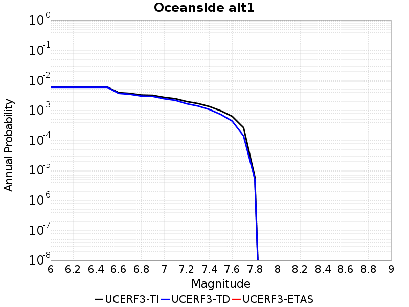 |
|-----|

| Magnitude | UCERF3-TI Prob | UCERF3-TD Prob | UCERF3-ETAS Prob |
|-----|-----|-----|-----|
| 6.0 | 0.0060435664 | 0.005941092 | 0.0 |
| 6.1 | 0.0060435664 | 0.005941092 | 0.0 |
| 6.2 | 0.0060435664 | 0.005941092 | 0.0 |
| 6.3 | 0.0060435664 | 0.005941092 | 0.0 |
| 6.4 | 0.0060435664 | 0.005941092 | 0.0 |
| 6.5 | 0.0060435664 | 0.005941092 | 0.0 |
| 6.6 | 0.0039378637 | 0.0037131968 | 0.0 |
| 6.7 | 0.0037000529 | 0.0034647991 | 0.0 |
| 6.8 | 0.0032743502 | 0.0030197913 | 0.0 |
| 6.9 | 0.003203268 | 0.0029453507 | 0.0 |
| 7.0 | 0.0027376404 | 0.0024594418 | 0.0 |
| 7.1 | 0.0024654015 | 0.0021764324 | 0.0 |
| 7.2 | 0.001980741 | 0.0016743843 | 0.0 |
| 7.3 | 0.0017025196 | 0.001405854 | 0.0 |
| 7.4 | 0.0013524436 | 0.001077493 | 0.0 |
| 7.5 | 9.7607676E-4 | 7.3648023E-4 | 0.0 |
| 7.6 | 6.3881604E-4 | 4.4398397E-4 | 0.0 |
| 7.7 | 2.6819948E-4 | 1.4255816E-4 | 0.0 |
| 7.8 | 6.05567E-6 | 5.10352E-6 | 0.0 |

## Ortigalita (North)
*[(top)](#table-of-contents)*

|  |
|-----|

| Magnitude | UCERF3-TI Prob | UCERF3-TD Prob | UCERF3-ETAS Prob |
|-----|-----|-----|-----|
| 6.0 | 0.039442103 | 0.05327619 | 0.0 |
| 6.1 | 0.023756953 | 0.030880818 | 0.0 |
| 6.2 | 0.023756953 | 0.030880818 | 0.0 |
| 6.3 | 0.017212452 | 0.021883287 | 0.0 |
| 6.4 | 0.014366428 | 0.018071616 | 0.0 |
| 6.5 | 0.014344421 | 0.018045947 | 0.0 |
| 6.6 | 0.011917574 | 0.0148591455 | 0.0 |
| 6.7 | 0.010315218 | 0.01290195 | 0.0 |
| 6.8 | 0.0034191788 | 0.0039543477 | 0.0 |
| 6.9 | 0.0029291727 | 0.0033815838 | 0.0 |
| 7.0 | 0.0020201886 | 0.0023337496 | 0.0 |
| 7.1 | 8.3544437E-4 | 9.6701476E-4 | 0.0 |

## Ortigalita (South)
*[(top)](#table-of-contents)*

|  |
|-----|

| Magnitude | UCERF3-TI Prob | UCERF3-TD Prob | UCERF3-ETAS Prob |
|-----|-----|-----|-----|
| 6.0 | 0.019243775 | 0.022297125 | 0.0 |
| 6.1 | 0.014143906 | 0.01627809 | 0.0 |
| 6.2 | 0.014143906 | 0.01627809 | 0.0 |
| 6.3 | 0.010663681 | 0.012237899 | 0.0 |
| 6.4 | 0.010663681 | 0.012237899 | 0.0 |
| 6.5 | 0.009234319 | 0.010597234 | 0.0 |
| 6.6 | 0.008454733 | 0.009703899 | 0.0 |
| 6.7 | 0.006786986 | 0.007804978 | 0.0 |
| 6.8 | 0.0054262993 | 0.0062263743 | 0.0 |
| 6.9 | 0.003978506 | 0.0045702434 | 0.0 |
| 7.0 | 0.0020432258 | 0.0023590468 | 0.0 |
| 7.1 | 8.3544437E-4 | 9.6701476E-4 | 0.0 |

## Owens Valley
*[(top)](#table-of-contents)*

|  |
|-----|

| Magnitude | UCERF3-TI Prob | UCERF3-TD Prob | UCERF3-ETAS Prob |
|-----|-----|-----|-----|
| 6.0 | 0.024929691 | 0.0018891684 | 0.0 |
| 6.1 | 0.024929691 | 0.0018891684 | 0.0 |
| 6.2 | 0.024929691 | 0.0018891684 | 0.0 |
| 6.3 | 0.020415364 | 0.0016401742 | 0.0 |
| 6.4 | 0.020415364 | 0.0016401742 | 0.0 |
| 6.5 | 0.017878477 | 0.0015434352 | 0.0 |
| 6.6 | 0.016111081 | 0.0014926337 | 0.0 |
| 6.7 | 0.014539397 | 0.0014594474 | 0.0 |
| 6.8 | 0.01308639 | 0.0011605076 | 0.0 |
| 6.9 | 0.011777153 | 8.3492434E-4 | 0.0 |
| 7.0 | 0.010831586 | 7.993183E-4 | 0.0 |
| 7.1 | 0.010097133 | 7.2001386E-4 | 0.0 |
| 7.2 | 0.009284316 | 6.486834E-4 | 0.0 |
| 7.3 | 0.0065626553 | 5.7723484E-4 | 0.0 |
| 7.4 | 0.003899234 | 4.4376103E-4 | 0.0 |
| 7.5 | 0.0012897621 | 3.150563E-4 | 0.0 |
| 7.6 | 5.9094845E-4 | 1.6597284E-4 | 0.0 |
| 7.7 | 2.5362454E-4 | 4.6418027E-5 | 0.0 |

## Owens Valley Keough Hot Springs
*[(top)](#table-of-contents)*

| 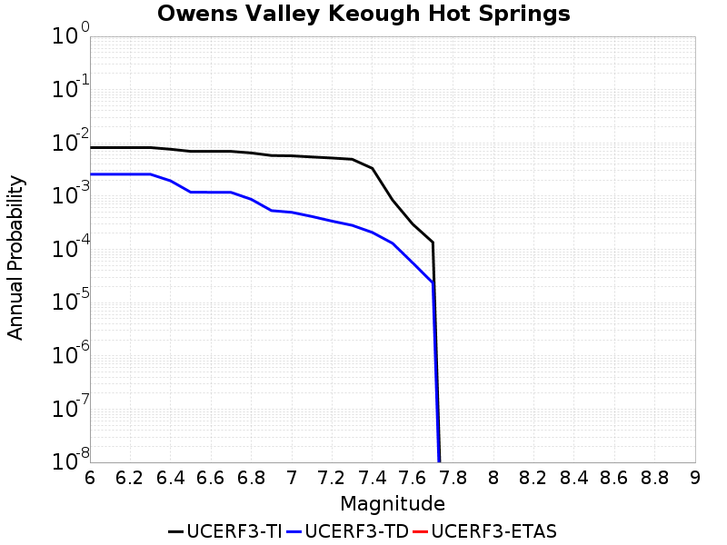 |
|-----|

| Magnitude | UCERF3-TI Prob | UCERF3-TD Prob | UCERF3-ETAS Prob |
|-----|-----|-----|-----|
| 6.0 | 0.008163051 | 0.0025735954 | 0.0 |
| 6.1 | 0.008163051 | 0.0025735954 | 0.0 |
| 6.2 | 0.008163051 | 0.0025735954 | 0.0 |
| 6.3 | 0.008163051 | 0.0025735954 | 0.0 |
| 6.4 | 0.007600839 | 0.0019369447 | 0.0 |
| 6.5 | 0.0069341804 | 0.0011828623 | 0.0 |
| 6.6 | 0.0069327964 | 0.0011813776 | 0.0 |
| 6.7 | 0.0069252094 | 0.0011757783 | 0.0 |
| 6.8 | 0.0064707273 | 8.7086903E-4 | 0.0 |
| 6.9 | 0.0057909233 | 5.346391E-4 | 0.0 |
| 7.0 | 0.0057160086 | 4.9697695E-4 | 0.0 |
| 7.1 | 0.005438545 | 4.1511565E-4 | 0.0 |
| 7.2 | 0.0051986156 | 3.395339E-4 | 0.0 |
| 7.3 | 0.0049267393 | 2.830723E-4 | 0.0 |
| 7.4 | 0.0033247585 | 2.0803914E-4 | 0.0 |
| 7.5 | 8.4455294E-4 | 1.3028408E-4 | 0.0 |
| 7.6 | 2.977E-4 | 5.5868168E-5 | 0.0 |
| 7.7 | 1.3559677E-4 | 2.3495248E-5 | 0.0 |

## Owl Lake
*[(top)](#table-of-contents)*

| 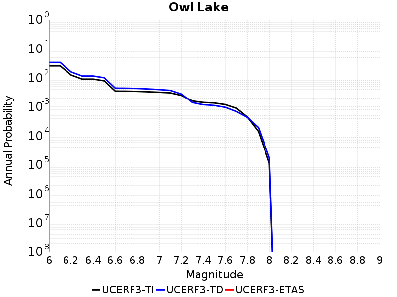 |
|-----|

| Magnitude | UCERF3-TI Prob | UCERF3-TD Prob | UCERF3-ETAS Prob |
|-----|-----|-----|-----|
| 6.0 | 0.02591553 | 0.03401528 | 0.0 |
| 6.1 | 0.02591553 | 0.03401528 | 0.0 |
| 6.2 | 0.012509781 | 0.016003951 | 0.0 |
| 6.3 | 0.009055373 | 0.011575022 | 0.0 |
| 6.4 | 0.009055373 | 0.011575022 | 0.0 |
| 6.5 | 0.0078909 | 0.010068941 | 0.0 |
| 6.6 | 0.0035039932 | 0.0044343886 | 0.0 |
| 6.7 | 0.003480947 | 0.0043994538 | 0.0 |
| 6.8 | 0.0034261728 | 0.004319797 | 0.0 |
| 6.9 | 0.0033148455 | 0.0041502374 | 0.0 |
| 7.0 | 0.0031956544 | 0.0039595054 | 0.0 |
| 7.1 | 0.0030441214 | 0.0037057973 | 0.0 |
| 7.2 | 0.0024867293 | 0.0027802463 | 0.0 |
| 7.3 | 0.0015899199 | 0.0014020696 | 0.0 |
| 7.4 | 0.0014215811 | 0.0011913277 | 0.0 |
| 7.5 | 0.001360437 | 0.0011185259 | 0.0 |
| 7.6 | 0.001199845 | 9.6647284E-4 | 0.0 |
| 7.7 | 8.962536E-4 | 6.9080986E-4 | 0.0 |
| 7.8 | 4.414008E-4 | 4.317767E-4 | 0.0 |
| 7.9 | 1.4174548E-4 | 1.9286333E-4 | 0.0 |
| 8.0 | 1.14768345E-5 | 1.746572E-5 | 0.0 |

## Ozena
*[(top)](#table-of-contents)*

| 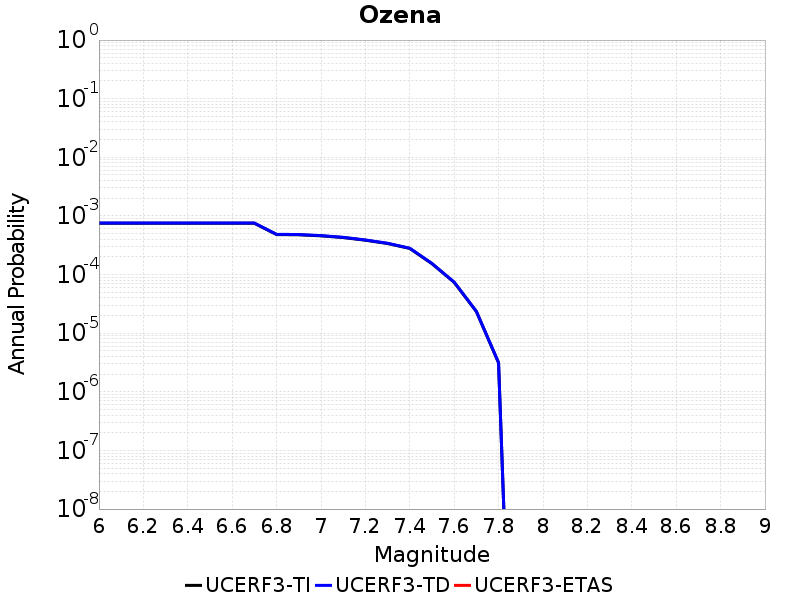 |
|-----|

| Magnitude | UCERF3-TI Prob | UCERF3-TD Prob | UCERF3-ETAS Prob |
|-----|-----|-----|-----|
| 6.0 | 7.4991904E-4 | 7.569769E-4 | 0.0 |
| 6.1 | 7.4991904E-4 | 7.569769E-4 | 0.0 |
| 6.2 | 7.4991904E-4 | 7.569769E-4 | 0.0 |
| 6.3 | 7.4991904E-4 | 7.569769E-4 | 0.0 |
| 6.4 | 7.4991904E-4 | 7.569769E-4 | 0.0 |
| 6.5 | 7.4991904E-4 | 7.569769E-4 | 0.0 |
| 6.6 | 7.4991904E-4 | 7.569769E-4 | 0.0 |
| 6.7 | 7.4991904E-4 | 7.569769E-4 | 0.0 |
| 6.8 | 4.811408E-4 | 4.8601485E-4 | 0.0 |
| 6.9 | 4.7687767E-4 | 4.8172538E-4 | 0.0 |
| 7.0 | 4.5737892E-4 | 4.6207558E-4 | 0.0 |
| 7.1 | 4.2774176E-4 | 4.3218376E-4 | 0.0 |
| 7.2 | 3.853716E-4 | 3.8936024E-4 | 0.0 |
| 7.3 | 3.3858258E-4 | 3.420847E-4 | 0.0 |
| 7.4 | 2.789462E-4 | 2.818154E-4 | 0.0 |
| 7.5 | 1.5335804E-4 | 1.5476807E-4 | 0.0 |
| 7.6 | 7.38399E-5 | 7.436326E-5 | 0.0 |
| 7.7 | 2.3457947E-5 | 2.361009E-5 | 0.0 |
| 7.8 | 3.1303573E-6 | 3.1520285E-6 | 0.0 |

## Palos Verdes
*[(top)](#table-of-contents)*

|  |
|-----|

| Magnitude | UCERF3-TI Prob | UCERF3-TD Prob | UCERF3-ETAS Prob |
|-----|-----|-----|-----|
| 6.0 | 0.031460393 | 0.038952433 | 0.0 |
| 6.1 | 0.031460393 | 0.038952433 | 0.0 |
| 6.2 | 0.031460393 | 0.038952433 | 0.0 |
| 6.3 | 0.021083709 | 0.025589077 | 0.0 |
| 6.4 | 0.021083709 | 0.025589077 | 0.0 |
| 6.5 | 0.015794903 | 0.018870205 | 0.0 |
| 6.6 | 0.015149189 | 0.018150147 | 0.0 |
| 6.7 | 0.011863477 | 0.014098996 | 0.0 |
| 6.8 | 0.011065915 | 0.013165689 | 0.0 |
| 6.9 | 0.009869894 | 0.011716356 | 0.0 |
| 7.0 | 0.008882134 | 0.010534819 | 0.0 |
| 7.1 | 0.008304977 | 0.009851984 | 0.0 |
| 7.2 | 0.007520827 | 0.008924588 | 0.0 |
| 7.3 | 0.0027555283 | 0.0032295715 | 0.0 |
| 7.4 | 4.3192226E-4 | 4.3857621E-4 | 0.0 |
| 7.5 | 3.4222414E-4 | 3.4777398E-4 | 0.0 |
| 7.6 | 1.8270731E-4 | 1.8581477E-4 | 0.0 |
| 7.7 | 6.2539824E-5 | 6.363564E-5 | 0.0 |
| 7.8 | 1.5885644E-5 | 1.6186408E-5 | 0.0 |

## Panamint Valley
*[(top)](#table-of-contents)*

|  |
|-----|

| Magnitude | UCERF3-TI Prob | UCERF3-TD Prob | UCERF3-ETAS Prob |
|-----|-----|-----|-----|
| 6.0 | 0.015640736 | 0.017530784 | 0.0 |
| 6.1 | 0.015640736 | 0.017530784 | 0.0 |
| 6.2 | 0.015640736 | 0.017530784 | 0.0 |
| 6.3 | 0.01479908 | 0.016567176 | 0.0 |
| 6.4 | 0.01479908 | 0.016567176 | 0.0 |
| 6.5 | 0.014230782 | 0.015914248 | 0.0 |
| 6.6 | 0.013544982 | 0.015105941 | 0.0 |
| 6.7 | 0.012701893 | 0.014124114 | 0.0 |
| 6.8 | 0.011539802 | 0.012887117 | 0.0 |
| 6.9 | 0.010331288 | 0.011525353 | 0.0 |
| 7.0 | 0.009531168 | 0.010637351 | 0.0 |
| 7.1 | 0.009176437 | 0.010228322 | 0.0 |
| 7.2 | 0.008511325 | 0.009396232 | 0.0 |
| 7.3 | 0.0075480095 | 0.008268351 | 0.0 |
| 7.4 | 0.0066837464 | 0.007330689 | 0.0 |
| 7.5 | 0.006054099 | 0.006654357 | 0.0 |
| 7.6 | 0.0015676835 | 0.0017335082 | 0.0 |

## Paradise
*[(top)](#table-of-contents)*

|  |
|-----|

| Magnitude | UCERF3-TI Prob | UCERF3-TD Prob | UCERF3-ETAS Prob |
|-----|-----|-----|-----|
| 6.0 | 0.0077192914 | 0.008668109 | 0.0 |
| 6.1 | 0.0077192914 | 0.008668109 | 0.0 |
| 6.2 | 0.0077192914 | 0.008668109 | 0.0 |
| 6.3 | 0.0054258266 | 0.006179286 | 0.0 |
| 6.4 | 0.0054258266 | 0.006179286 | 0.0 |
| 6.5 | 0.0048150513 | 0.005521609 | 0.0 |
| 6.6 | 0.0041158604 | 0.004764055 | 0.0 |
| 6.7 | 0.003753043 | 0.004373607 | 0.0 |
| 6.8 | 0.003487206 | 0.0040802127 | 0.0 |
| 6.9 | 0.0031477278 | 0.0037106457 | 0.0 |
| 7.0 | 0.0021547892 | 0.0026447305 | 0.0 |
| 7.1 | 0.0019638946 | 0.0024114917 | 0.0 |
| 7.2 | 0.0017759053 | 0.0021642884 | 0.0 |
| 7.3 | 0.0015607453 | 0.0018902627 | 0.0 |
| 7.4 | 0.0012540985 | 0.0015051572 | 0.0 |
| 7.5 | 6.6297496E-4 | 7.8865123E-4 | 0.0 |
| 7.6 | 1.1539775E-4 | 1.3581177E-4 | 0.0 |

## Peralta Hills
*[(top)](#table-of-contents)*

|  |
|-----|

| Magnitude | UCERF3-TI Prob | UCERF3-TD Prob | UCERF3-ETAS Prob |
|-----|-----|-----|-----|
| 6.0 | 0.0020250916 | 0.0019995656 | 0.0 |
| 6.1 | 0.0020250916 | 0.0019995656 | 0.0 |
| 6.2 | 0.0020250916 | 0.0019995656 | 0.0 |
| 6.3 | 0.0020250916 | 0.0019995656 | 0.0 |
| 6.4 | 0.0020250916 | 0.0019995656 | 0.0 |
| 6.5 | 8.1301836E-4 | 7.5047166E-4 | 0.0 |
| 6.6 | 8.1301836E-4 | 7.5047166E-4 | 0.0 |
| 6.7 | 7.833416E-4 | 7.195256E-4 | 0.0 |
| 6.8 | 7.6069974E-4 | 6.9577777E-4 | 0.0 |
| 6.9 | 5.93741E-4 | 5.1282527E-4 | 0.0 |
| 7.0 | 5.2010687E-4 | 4.320773E-4 | 0.0 |
| 7.1 | 5.05193E-4 | 4.157025E-4 | 0.0 |
| 7.2 | 4.8205635E-4 | 3.901468E-4 | 0.0 |
| 7.3 | 4.2561593E-4 | 3.3013217E-4 | 0.0 |
| 7.4 | 3.3296304E-4 | 2.4930673E-4 | 0.0 |
| 7.5 | 2.1021912E-4 | 1.4472142E-4 | 0.0 |
| 7.6 | 1.916332E-4 | 1.29169E-4 | 0.0 |
| 7.7 | 1.485248E-4 | 9.286124E-5 | 0.0 |

## Pilarcitos 2011 CFM
*[(top)](#table-of-contents)*

| 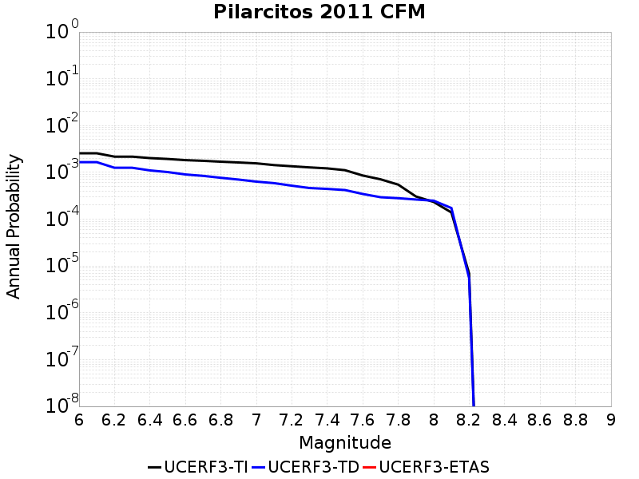 |
|-----|

| Magnitude | UCERF3-TI Prob | UCERF3-TD Prob | UCERF3-ETAS Prob |
|-----|-----|-----|-----|
| 6.0 | 0.0025613222 | 0.0016566504 | 0.0 |
| 6.1 | 0.0025613222 | 0.0016566504 | 0.0 |
| 6.2 | 0.002169499 | 0.0012547006 | 0.0 |
| 6.3 | 0.002169499 | 0.0012547006 | 0.0 |
| 6.4 | 0.0020208664 | 0.0011022516 | 0.0 |
| 6.5 | 0.001935883 | 0.0010154308 | 0.0 |
| 6.6 | 0.0018271249 | 9.033702E-4 | 0.0 |
| 6.7 | 0.0017677402 | 8.4277615E-4 | 0.0 |
| 6.8 | 0.0016918402 | 7.6630834E-4 | 0.0 |
| 6.9 | 0.001628688 | 7.019783E-4 | 0.0 |
| 7.0 | 0.0015610148 | 6.3496217E-4 | 0.0 |
| 7.1 | 0.001432384 | 5.8948185E-4 | 0.0 |
| 7.2 | 0.0013519078 | 5.1991164E-4 | 0.0 |
| 7.3 | 0.0012785323 | 4.6326857E-4 | 0.0 |
| 7.4 | 0.0012176048 | 4.4380783E-4 | 0.0 |
| 7.5 | 0.0011138449 | 4.1949327E-4 | 0.0 |
| 7.6 | 8.5773255E-4 | 3.4583954E-4 | 0.0 |
| 7.7 | 7.120345E-4 | 2.949094E-4 | 0.0 |
| 7.8 | 5.47777E-4 | 2.809607E-4 | 0.0 |
| 7.9 | 3.055336E-4 | 2.6323737E-4 | 0.0 |
| 8.0 | 2.3356717E-4 | 2.485638E-4 | 0.0 |
| 8.1 | 1.3926817E-4 | 1.7314147E-4 | 0.0 |
| 8.2 | 6.8869535E-6 | 5.5150012E-6 | 0.0 |

## Pine Mtn
*[(top)](#table-of-contents)*

|  |
|-----|

| Magnitude | UCERF3-TI Prob | UCERF3-TD Prob | UCERF3-ETAS Prob |
|-----|-----|-----|-----|
| 6.0 | 0.0035911554 | 0.003759195 | 0.0 |
| 6.1 | 0.0035911554 | 0.003759195 | 0.0 |
| 6.2 | 0.0035911554 | 0.003759195 | 0.0 |
| 6.3 | 0.0035911554 | 0.003759195 | 0.0 |
| 6.4 | 0.0035911554 | 0.003759195 | 0.0 |
| 6.5 | 0.0035911554 | 0.003759195 | 0.0 |
| 6.6 | 0.0035911554 | 0.003759195 | 0.0 |
| 6.7 | 0.0031709734 | 0.003328532 | 0.0 |
| 6.8 | 0.002945339 | 0.0030963488 | 0.0 |
| 6.9 | 0.0023981342 | 0.0025310172 | 0.0 |
| 7.0 | 0.0023388295 | 0.0024704665 | 0.0 |
| 7.1 | 0.0016703589 | 0.0017842873 | 0.0 |
| 7.2 | 0.0011504296 | 0.0012373882 | 0.0 |
| 7.3 | 7.1799144E-4 | 7.91014E-4 | 0.0 |
| 7.4 | 5.866275E-4 | 6.541774E-4 | 0.0 |
| 7.5 | 4.1899405E-4 | 4.8171374E-4 | 0.0 |
| 7.6 | 2.5539953E-4 | 3.1120042E-4 | 0.0 |
| 7.7 | 3.4617424E-5 | 3.5413857E-5 | 0.0 |
| 7.8 | 4.8189804E-6 | 4.949549E-6 | 0.0 |

## Pinto Mtn
*[(top)](#table-of-contents)*

|  |
|-----|

| Magnitude | UCERF3-TI Prob | UCERF3-TD Prob | UCERF3-ETAS Prob |
|-----|-----|-----|-----|
| 6.0 | 0.022796938 | 0.024610516 | 0.1 |
| 6.1 | 0.022796938 | 0.024610516 | 0.1 |
| 6.2 | 0.022796938 | 0.024610516 | 0.1 |
| 6.3 | 0.022796938 | 0.024610516 | 0.1 |
| 6.4 | 0.019274427 | 0.020403422 | 0.1 |
| 6.5 | 0.019274427 | 0.020403422 | 0.1 |
| 6.6 | 0.015636992 | 0.01610336 | 0.1 |
| 6.7 | 0.015458848 | 0.015903054 | 0.1 |
| 6.8 | 0.012867244 | 0.012920873 | 0.0 |
| 6.9 | 0.012089936 | 0.012060304 | 0.0 |
| 7.0 | 0.011320163 | 0.011247845 | 0.0 |
| 7.1 | 0.010722724 | 0.010618779 | 0.0 |
| 7.2 | 0.009859995 | 0.009852568 | 0.0 |
| 7.3 | 0.006934359 | 0.007710972 | 0.0 |
| 7.4 | 0.0049001034 | 0.0061343107 | 0.0 |
| 7.5 | 0.0037550807 | 0.0047333995 | 0.0 |
| 7.6 | 0.0017185259 | 0.0023359975 | 0.0 |
| 7.7 | 0.0013422335 | 0.0018376939 | 0.0 |

## Pisgah-Bullion Mtn-Mesquite Lk
*[(top)](#table-of-contents)*

| 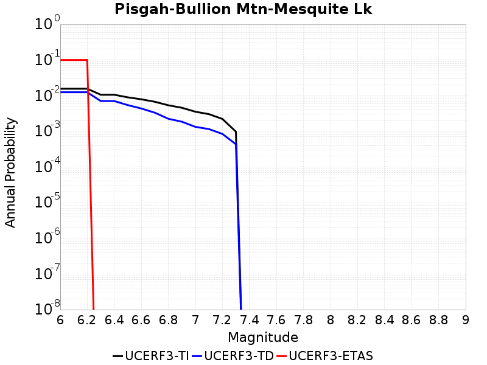 |
|-----|

| Magnitude | UCERF3-TI Prob | UCERF3-TD Prob | UCERF3-ETAS Prob |
|-----|-----|-----|-----|
| 6.0 | 0.015655609 | 0.0124838315 | 0.1 |
| 6.1 | 0.015655609 | 0.0124838315 | 0.1 |
| 6.2 | 0.015655609 | 0.0124838315 | 0.1 |
| 6.3 | 0.01063879 | 0.007081746 | 0.0 |
| 6.4 | 0.01063879 | 0.007081746 | 0.0 |
| 6.5 | 0.008994718 | 0.0054440415 | 0.0 |
| 6.6 | 0.007926274 | 0.0043740543 | 0.0 |
| 6.7 | 0.0067589693 | 0.0033357437 | 0.0 |
| 6.8 | 0.0053879567 | 0.0022551748 | 0.0 |
| 6.9 | 0.00458965 | 0.0018639106 | 0.0 |
| 7.0 | 0.0035539411 | 0.0013368137 | 0.0 |
| 7.1 | 0.0030410455 | 0.0011598656 | 0.0 |
| 7.2 | 0.0022297418 | 8.477423E-4 | 0.0 |
| 7.3 | 9.806695E-4 | 4.3476035E-4 | 0.0 |

## Pitas Point (Lower West)
*[(top)](#table-of-contents)*

|  |
|-----|

| Magnitude | UCERF3-TI Prob | UCERF3-TD Prob | UCERF3-ETAS Prob |
|-----|-----|-----|-----|
| 6.0 | 0.0042443196 | 0.0040871906 | 0.0 |
| 6.1 | 0.0042443196 | 0.0040871906 | 0.0 |
| 6.2 | 0.0042443196 | 0.0040871906 | 0.0 |
| 6.3 | 0.0042443196 | 0.0040871906 | 0.0 |
| 6.4 | 0.0042443196 | 0.0040871906 | 0.0 |
| 6.5 | 0.0042443196 | 0.0040871906 | 0.0 |
| 6.6 | 0.0042443196 | 0.0040871906 | 0.0 |
| 6.7 | 0.0042443196 | 0.0040871906 | 0.0 |
| 6.8 | 0.0042443196 | 0.0040871906 | 0.0 |
| 6.9 | 0.0042443196 | 0.0040871906 | 0.0 |
| 7.0 | 0.0042193993 | 0.0040609255 | 0.0 |
| 7.1 | 0.00408937 | 0.003923639 | 0.0 |
| 7.2 | 0.0040466557 | 0.0038780791 | 0.0 |
| 7.3 | 0.0038509427 | 0.0036682773 | 0.0 |
| 7.4 | 0.0036274698 | 0.0034297025 | 0.0 |
| 7.5 | 0.0034651754 | 0.0032576956 | 0.0 |
| 7.6 | 0.0029246826 | 0.0026817934 | 0.0 |
| 7.7 | 0.0023425296 | 0.0020812934 | 0.0 |
| 7.8 | 0.0013596788 | 0.0011374714 | 0.0 |
| 7.9 | 2.1109142E-4 | 1.6903976E-4 | 0.0 |
| 8.0 | 4.065434E-6 | 2.9632592E-6 | 0.0 |

## Pitas Point (Lower)-Montalvo
*[(top)](#table-of-contents)*

| 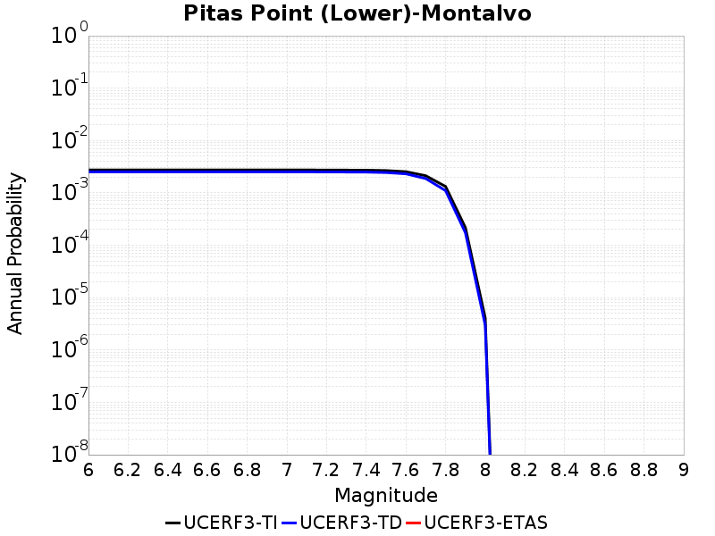 |
|-----|

| Magnitude | UCERF3-TI Prob | UCERF3-TD Prob | UCERF3-ETAS Prob |
|-----|-----|-----|-----|
| 6.0 | 0.0027379042 | 0.0025188387 | 0.0 |
| 6.1 | 0.0027379042 | 0.0025188387 | 0.0 |
| 6.2 | 0.0027379042 | 0.0025188387 | 0.0 |
| 6.3 | 0.0027379042 | 0.0025188387 | 0.0 |
| 6.4 | 0.0027379042 | 0.0025188387 | 0.0 |
| 6.5 | 0.0027379042 | 0.0025188387 | 0.0 |
| 6.6 | 0.0027379042 | 0.0025188387 | 0.0 |
| 6.7 | 0.0027379042 | 0.0025188387 | 0.0 |
| 6.8 | 0.0027379042 | 0.0025188387 | 0.0 |
| 6.9 | 0.0027379042 | 0.0025188387 | 0.0 |
| 7.0 | 0.0027379042 | 0.0025188387 | 0.0 |
| 7.1 | 0.0027379042 | 0.0025188387 | 0.0 |
| 7.2 | 0.0027334841 | 0.0025142366 | 0.0 |
| 7.3 | 0.002723483 | 0.0025037888 | 0.0 |
| 7.4 | 0.002715153 | 0.0024950556 | 0.0 |
| 7.5 | 0.0026693381 | 0.002447133 | 0.0 |
| 7.6 | 0.0025429246 | 0.0023144125 | 0.0 |
| 7.7 | 0.0021284167 | 0.0018794576 | 0.0 |
| 7.8 | 0.0013268272 | 0.0011050183 | 0.0 |
| 7.9 | 2.1744163E-4 | 1.7357148E-4 | 0.0 |
| 8.0 | 4.065434E-6 | 2.9632592E-6 | 0.0 |

## Pittville 2011 CFM
*[(top)](#table-of-contents)*

|  |
|-----|

| Magnitude | UCERF3-TI Prob | UCERF3-TD Prob | UCERF3-ETAS Prob |
|-----|-----|-----|-----|
| 6.0 | 0.012976485 | 0.014017642 | 0.1 |
| 6.1 | 0.0065219323 | 0.0070229317 | 0.0 |
| 6.2 | 0.0034395473 | 0.0036993357 | 0.0 |
| 6.3 | 0.0034395473 | 0.0036993357 | 0.0 |
| 6.4 | 0.0020531558 | 0.002208082 | 0.0 |
| 6.5 | 0.0012792832 | 0.0013763389 | 0.0 |
| 6.6 | 7.032437E-4 | 7.5737305E-4 | 0.0 |

## Pleito
*[(top)](#table-of-contents)*

|  |
|-----|

| Magnitude | UCERF3-TI Prob | UCERF3-TD Prob | UCERF3-ETAS Prob |
|-----|-----|-----|-----|
| 6.0 | 0.00870863 | 0.012687378 | 0.0 |
| 6.1 | 0.00870863 | 0.012687378 | 0.0 |
| 6.2 | 0.00870863 | 0.012687378 | 0.0 |
| 6.3 | 0.00870863 | 0.012687378 | 0.0 |
| 6.4 | 0.00870863 | 0.012687378 | 0.0 |
| 6.5 | 0.00870863 | 0.012687378 | 0.0 |
| 6.6 | 0.0051576863 | 0.008787291 | 0.0 |
| 6.7 | 0.0051576863 | 0.008787291 | 0.0 |
| 6.8 | 0.004321559 | 0.007887252 | 0.0 |
| 6.9 | 0.0042607468 | 0.0078207 | 0.0 |
| 7.0 | 0.0037367654 | 0.007195339 | 0.0 |
| 7.1 | 0.0037327618 | 0.0071903877 | 0.0 |
| 7.2 | 0.0036796255 | 0.007111995 | 0.0 |
| 7.3 | 0.0036566744 | 0.0070829922 | 0.0 |
| 7.4 | 0.0036391679 | 0.0070622074 | 0.0 |
| 7.5 | 0.0036195726 | 0.007040048 | 0.0 |
| 7.6 | 0.0036078666 | 0.0070191966 | 0.0 |
| 7.7 | 0.0033317201 | 0.006448605 | 0.0 |
| 7.8 | 0.0030563495 | 0.005875302 | 0.0 |
| 7.9 | 0.0019374699 | 0.0036304637 | 0.0 |
| 8.0 | 5.6878536E-4 | 6.632303E-4 | 0.0 |
| 8.1 | 1.4032227E-4 | 5.919686E-5 | 0.0 |
| 8.2 | 2.7637393E-6 | 1.3305836E-6 | 0.0 |

## Point Reyes 2011 CFM
*[(top)](#table-of-contents)*

|  |
|-----|

| Magnitude | UCERF3-TI Prob | UCERF3-TD Prob | UCERF3-ETAS Prob |
|-----|-----|-----|-----|
| 6.0 | 0.0046147075 | 0.0046671545 | 0.0 |
| 6.1 | 0.002359032 | 0.0023647547 | 0.0 |
| 6.2 | 0.002359032 | 0.0023647547 | 0.0 |
| 6.3 | 0.0013996155 | 0.0013865028 | 0.0 |
| 6.4 | 0.0013996155 | 0.0013865028 | 0.0 |
| 6.5 | 0.0010055936 | 9.85243E-4 | 0.0 |
| 6.6 | 7.6812494E-4 | 7.435573E-4 | 0.0 |
| 6.7 | 4.471909E-4 | 4.1704153E-4 | 0.0 |
| 6.8 | 3.4820763E-4 | 3.1639548E-4 | 0.0 |
| 6.9 | 2.2390042E-4 | 1.8998374E-4 | 0.0 |
| 7.0 | 1.3989564E-4 | 1.0470736E-4 | 0.0 |
| 7.1 | 1.014886E-4 | 6.5782806E-5 | 0.0 |
| 7.2 | 8.721343E-5 | 5.1795054E-5 | 0.0 |
| 7.3 | 8.089007E-5 | 4.6431483E-5 | 0.0 |
| 7.4 | 7.436013E-5 | 4.167162E-5 | 0.0 |
| 7.5 | 6.6317734E-5 | 3.6122732E-5 | 0.0 |
| 7.6 | 5.293224E-5 | 2.81677E-5 | 0.0 |
| 7.7 | 3.6996673E-5 | 2.0359188E-5 | 0.0 |
| 7.8 | 2.0199188E-5 | 1.3959589E-5 | 0.0 |
| 7.9 | 8.906207E-6 | 5.8813985E-6 | 0.0 |
| 8.0 | 5.307899E-6 | 3.4210814E-6 | 0.0 |
| 8.1 | 1.9755437E-6 | 1.731453E-6 | 0.0 |

## Point Reyes 2011 connector
*[(top)](#table-of-contents)*

| 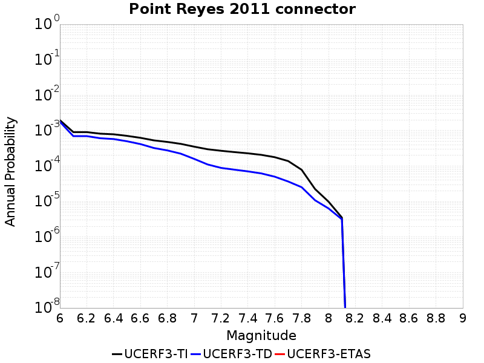 |
|-----|

| Magnitude | UCERF3-TI Prob | UCERF3-TD Prob | UCERF3-ETAS Prob |
|-----|-----|-----|-----|
| 6.0 | 0.0019752553 | 0.0017793293 | 0.0 |
| 6.1 | 9.1007963E-4 | 7.010265E-4 | 0.0 |
| 6.2 | 9.1007963E-4 | 7.010265E-4 | 0.0 |
| 6.3 | 8.2091097E-4 | 6.109498E-4 | 0.0 |
| 6.4 | 7.8959437E-4 | 5.793277E-4 | 0.0 |
| 6.5 | 7.126527E-4 | 5.0135877E-4 | 0.0 |
| 6.6 | 6.271311E-4 | 4.1799332E-4 | 0.0 |
| 6.7 | 5.3181144E-4 | 3.240174E-4 | 0.0 |
| 6.8 | 4.8056975E-4 | 2.7715106E-4 | 0.0 |
| 6.9 | 4.241537E-4 | 2.2436371E-4 | 0.0 |
| 7.0 | 3.5336064E-4 | 1.5977987E-4 | 0.0 |
| 7.1 | 2.9883112E-4 | 1.1135254E-4 | 0.0 |
| 7.2 | 2.7053748E-4 | 8.908511E-5 | 0.0 |
| 7.3 | 2.4833842E-4 | 7.93187E-5 | 0.0 |
| 7.4 | 2.2949366E-4 | 7.09766E-5 | 0.0 |
| 7.5 | 2.0765202E-4 | 6.2231535E-5 | 0.0 |
| 7.6 | 1.783743E-4 | 5.0275587E-5 | 0.0 |
| 7.7 | 1.3884505E-4 | 3.6804173E-5 | 0.0 |
| 7.8 | 7.8823476E-5 | 2.5433334E-5 | 0.0 |
| 7.9 | 2.2555607E-5 | 1.0895504E-5 | 0.0 |
| 8.0 | 9.992109E-6 | 6.4227784E-6 | 0.0 |
| 8.1 | 3.537326E-6 | 3.1625602E-6 | 0.0 |

## Polaris 2011 CFM
*[(top)](#table-of-contents)*

| 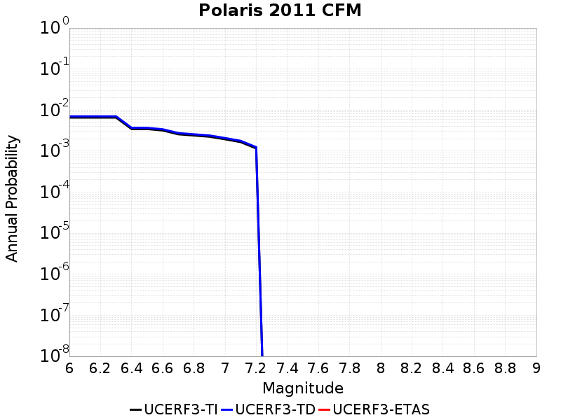 |
|-----|

| Magnitude | UCERF3-TI Prob | UCERF3-TD Prob | UCERF3-ETAS Prob |
|-----|-----|-----|-----|
| 6.0 | 0.0065689543 | 0.007062433 | 0.0 |
| 6.1 | 0.0065689543 | 0.007062433 | 0.0 |
| 6.2 | 0.0065689543 | 0.007062433 | 0.0 |
| 6.3 | 0.0065689543 | 0.007062433 | 0.0 |
| 6.4 | 0.0034602303 | 0.0036993735 | 0.0 |
| 6.5 | 0.0034602303 | 0.0036993735 | 0.0 |
| 6.6 | 0.0031927335 | 0.003413122 | 0.0 |
| 6.7 | 0.0025781945 | 0.0027590075 | 0.0 |
| 6.8 | 0.0024058819 | 0.0025759398 | 0.0 |
| 6.9 | 0.0022517592 | 0.0024118933 | 0.0 |
| 7.0 | 0.0019486571 | 0.002088623 | 0.0 |
| 7.1 | 0.0016649774 | 0.0017858049 | 0.0 |
| 7.2 | 0.0011658648 | 0.0012519691 | 0.0 |

## Puente Hills
*[(top)](#table-of-contents)*

|  |
|-----|

| Magnitude | UCERF3-TI Prob | UCERF3-TD Prob | UCERF3-ETAS Prob |
|-----|-----|-----|-----|
| 6.0 | 0.0062946146 | 0.0042093545 | 0.0 |
| 6.1 | 0.0062946146 | 0.0042093545 | 0.0 |
| 6.2 | 0.0062946146 | 0.0042093545 | 0.0 |
| 6.3 | 0.0062946146 | 0.0042093545 | 0.0 |
| 6.4 | 0.0062946146 | 0.0042093545 | 0.0 |
| 6.5 | 0.0062946146 | 0.0042093545 | 0.0 |
| 6.6 | 0.0053197746 | 0.0033262316 | 0.0 |
| 6.7 | 0.0053197746 | 0.0033262316 | 0.0 |
| 6.8 | 0.004496431 | 0.0026135053 | 0.0 |
| 6.9 | 0.0042001465 | 0.0025136475 | 0.0 |
| 7.0 | 0.0038505755 | 0.0022960403 | 0.0 |
| 7.1 | 0.0033682417 | 0.0019776826 | 0.0 |
| 7.2 | 0.002680074 | 0.0014486427 | 0.0 |
| 7.3 | 0.002047612 | 0.0010870548 | 0.0 |
| 7.4 | 0.001454435 | 7.0356205E-4 | 0.0 |
| 7.5 | 0.0010647819 | 4.5593356E-4 | 0.0 |
| 7.6 | 8.84509E-4 | 3.472955E-4 | 0.0 |
| 7.7 | 7.702751E-4 | 2.8018942E-4 | 0.0 |
| 7.8 | 9.617568E-5 | 3.7673482E-5 | 0.0 |

## Quien Sabe 2011 CFM
*[(top)](#table-of-contents)*

| 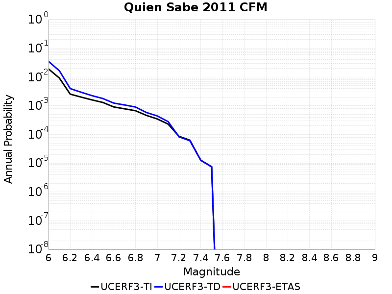 |
|-----|

| Magnitude | UCERF3-TI Prob | UCERF3-TD Prob | UCERF3-ETAS Prob |
|-----|-----|-----|-----|
| 6.0 | 0.019274272 | 0.03522186 | 0.0 |
| 6.1 | 0.009258169 | 0.0166279 | 0.0 |
| 6.2 | 0.0025464818 | 0.003979535 | 0.0 |
| 6.3 | 0.002011284 | 0.002971036 | 0.0 |
| 6.4 | 0.001604343 | 0.002259956 | 0.0 |
| 6.5 | 0.0013078486 | 0.0017901106 | 0.0 |
| 6.6 | 9.129886E-4 | 0.0012434447 | 0.0 |
| 6.7 | 7.853641E-4 | 0.001069118 | 0.0 |
| 6.8 | 6.741344E-4 | 9.062243E-4 | 0.0 |
| 6.9 | 4.6467435E-4 | 5.853605E-4 | 0.0 |
| 7.0 | 3.4896782E-4 | 4.4369078E-4 | 0.0 |
| 7.1 | 2.3062891E-4 | 2.8148206E-4 | 0.0 |
| 7.2 | 8.6722066E-5 | 8.307662E-5 | 0.0 |
| 7.3 | 6.3355765E-5 | 6.096152E-5 | 0.0 |
| 7.4 | 1.2623449E-5 | 1.2768132E-5 | 0.0 |
| 7.5 | 7.530801E-6 | 7.5579774E-6 | 0.0 |

## Raymond
*[(top)](#table-of-contents)*

|  |
|-----|

| Magnitude | UCERF3-TI Prob | UCERF3-TD Prob | UCERF3-ETAS Prob |
|-----|-----|-----|-----|
| 6.0 | 0.007877788 | 0.008207585 | 0.0 |
| 6.1 | 0.007877788 | 0.008207585 | 0.0 |
| 6.2 | 0.007877788 | 0.008207585 | 0.0 |
| 6.3 | 0.007877788 | 0.008207585 | 0.0 |
| 6.4 | 0.007248361 | 0.0075065373 | 0.0 |
| 6.5 | 0.007248361 | 0.0075065373 | 0.0 |
| 6.6 | 0.005485909 | 0.005545562 | 0.0 |
| 6.7 | 0.005485909 | 0.005545562 | 0.0 |
| 6.8 | 0.0052453685 | 0.0052891243 | 0.0 |
| 6.9 | 0.0040209293 | 0.003925511 | 0.0 |
| 7.0 | 0.0037173668 | 0.003594374 | 0.0 |
| 7.1 | 0.0029463451 | 0.0027567148 | 0.0 |
| 7.2 | 0.0025721465 | 0.0023548587 | 0.0 |
| 7.3 | 0.0022082955 | 0.0019797625 | 0.0 |
| 7.4 | 0.0018245826 | 0.0015833037 | 0.0 |
| 7.5 | 0.0014276401 | 0.0011974558 | 0.0 |
| 7.6 | 9.4849075E-4 | 7.501835E-4 | 0.0 |
| 7.7 | 5.5608735E-4 | 3.9709522E-4 | 0.0 |
| 7.8 | 3.6067693E-4 | 2.2399265E-4 | 0.0 |
| 7.9 | 3.8742884E-5 | 2.7645307E-5 | 0.0 |

## Red Mountain
*[(top)](#table-of-contents)*

|  |
|-----|

| Magnitude | UCERF3-TI Prob | UCERF3-TD Prob | UCERF3-ETAS Prob |
|-----|-----|-----|-----|
| 6.0 | 0.021580452 | 0.024499927 | 0.0 |
| 6.1 | 0.021580452 | 0.024499927 | 0.0 |
| 6.2 | 0.021580452 | 0.024499927 | 0.0 |
| 6.3 | 0.021580452 | 0.024499927 | 0.0 |
| 6.4 | 0.021580452 | 0.024499927 | 0.0 |
| 6.5 | 0.01632528 | 0.018259292 | 0.0 |
| 6.6 | 0.01632056 | 0.018253863 | 0.0 |
| 6.7 | 0.014641452 | 0.016267445 | 0.0 |
| 6.8 | 0.014613459 | 0.016235607 | 0.0 |
| 6.9 | 0.012562336 | 0.013823415 | 0.0 |
| 7.0 | 0.012179627 | 0.01337578 | 0.0 |
| 7.1 | 0.01157452 | 0.012669884 | 0.0 |
| 7.2 | 0.008590161 | 0.009169494 | 0.0 |
| 7.3 | 0.0076425658 | 0.008079131 | 0.0 |
| 7.4 | 0.0031951098 | 0.0028765816 | 0.0 |
| 7.5 | 0.003102299 | 0.002777618 | 0.0 |
| 7.6 | 0.0025913084 | 0.0022454818 | 0.0 |
| 7.7 | 0.0017523908 | 0.0014845739 | 0.0 |
| 7.8 | 6.170282E-4 | 5.2753E-4 | 0.0 |
| 7.9 | 1.1983275E-4 | 9.707042E-5 | 0.0 |

## Red Pass
*[(top)](#table-of-contents)*

|  |
|-----|

| Magnitude | UCERF3-TI Prob | UCERF3-TD Prob | UCERF3-ETAS Prob |
|-----|-----|-----|-----|
| 6.0 | 0.0042997985 | 0.0044522984 | 0.0 |
| 6.1 | 0.0019027026 | 0.001967783 | 0.0 |
| 6.2 | 0.0019027026 | 0.001967783 | 0.0 |
| 6.3 | 7.263199E-4 | 7.515518E-4 | 0.0 |
| 6.4 | 7.263199E-4 | 7.515518E-4 | 0.0 |
| 6.5 | 5.1522546E-4 | 5.3317024E-4 | 0.0 |

## Redondo Canyon alt 1
*[(top)](#table-of-contents)*

| 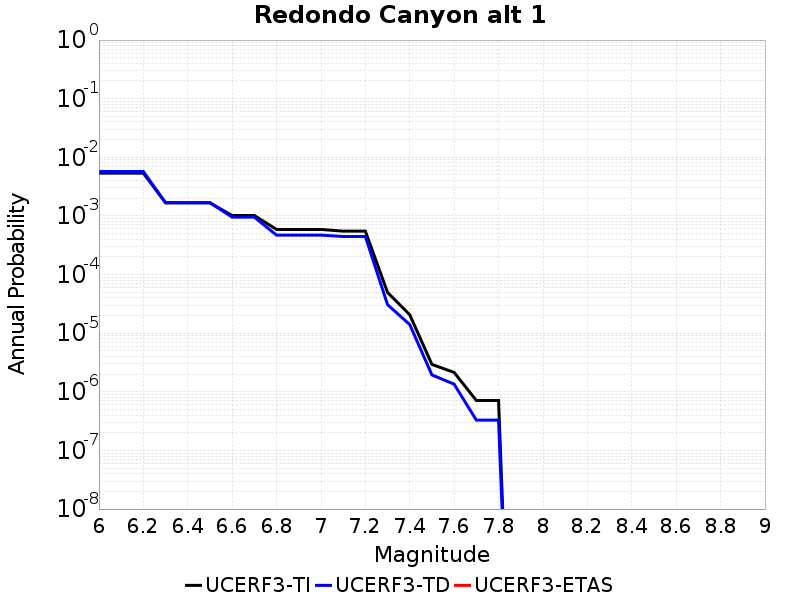 |
|-----|

| Magnitude | UCERF3-TI Prob | UCERF3-TD Prob | UCERF3-ETAS Prob |
|-----|-----|-----|-----|
| 6.0 | 0.0053840056 | 0.0057161106 | 0.0 |
| 6.1 | 0.0053840056 | 0.0057161106 | 0.0 |
| 6.2 | 0.0053840056 | 0.0057161106 | 0.0 |
| 6.3 | 0.001671074 | 0.0016851204 | 0.0 |
| 6.4 | 0.001671074 | 0.0016851204 | 0.0 |
| 6.5 | 0.001671074 | 0.0016851204 | 0.0 |
| 6.6 | 0.0010160941 | 9.524506E-4 | 0.0 |
| 6.7 | 0.0010160941 | 9.524506E-4 | 0.0 |
| 6.8 | 5.8830855E-4 | 4.703776E-4 | 0.0 |
| 6.9 | 5.8830855E-4 | 4.703776E-4 | 0.0 |
| 7.0 | 5.8830855E-4 | 4.703776E-4 | 0.0 |
| 7.1 | 5.500792E-4 | 4.4625744E-4 | 0.0 |
| 7.2 | 5.500792E-4 | 4.4625744E-4 | 0.0 |
| 7.3 | 4.9595343E-5 | 3.0677587E-5 | 0.0 |
| 7.4 | 2.062117E-5 | 1.4020054E-5 | 0.0 |
| 7.5 | 2.9289467E-6 | 1.9425102E-6 | 0.0 |
| 7.6 | 2.1426758E-6 | 1.3484762E-6 | 0.0 |
| 7.7 | 7.106588E-7 | 3.2860245E-7 | 0.0 |
| 7.8 | 7.106588E-7 | 3.2860245E-7 | 0.0 |

## Reliz 2011 CFM
*[(top)](#table-of-contents)*

| 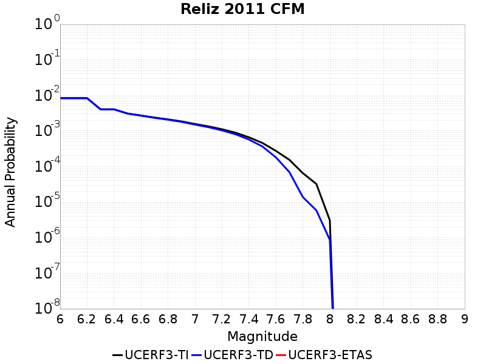 |
|-----|

| Magnitude | UCERF3-TI Prob | UCERF3-TD Prob | UCERF3-ETAS Prob |
|-----|-----|-----|-----|
| 6.0 | 0.008315164 | 0.008458688 | 0.0 |
| 6.1 | 0.008315164 | 0.008458688 | 0.0 |
| 6.2 | 0.008315164 | 0.008458688 | 0.0 |
| 6.3 | 0.0040577264 | 0.004061561 | 0.0 |
| 6.4 | 0.0040577264 | 0.004061561 | 0.0 |
| 6.5 | 0.00310811 | 0.0030868803 | 0.0 |
| 6.6 | 0.002727864 | 0.0026968974 | 0.0 |
| 6.7 | 0.002387038 | 0.0023467818 | 0.0 |
| 6.8 | 0.002124804 | 0.0020772305 | 0.0 |
| 6.9 | 0.0018637994 | 0.0018087366 | 0.0 |
| 7.0 | 0.0015776722 | 0.0015147221 | 0.0 |
| 7.1 | 0.0013484878 | 0.0012788723 | 0.0 |
| 7.2 | 0.0011203039 | 0.0010434139 | 0.0 |
| 7.3 | 8.967956E-4 | 8.130207E-4 | 0.0 |
| 7.4 | 6.6532596E-4 | 5.7561614E-4 | 0.0 |
| 7.5 | 4.6148215E-4 | 3.6716487E-4 | 0.0 |
| 7.6 | 2.760573E-4 | 1.8174209E-4 | 0.0 |
| 7.7 | 1.547672E-4 | 6.982796E-5 | 0.0 |
| 7.8 | 6.527006E-5 | 1.3852025E-5 | 0.0 |
| 7.9 | 3.2420594E-5 | 5.8661562E-6 | 0.0 |
| 8.0 | 3.090965E-6 | 8.710464E-7 | 0.0 |

## Richfield
*[(top)](#table-of-contents)*

| 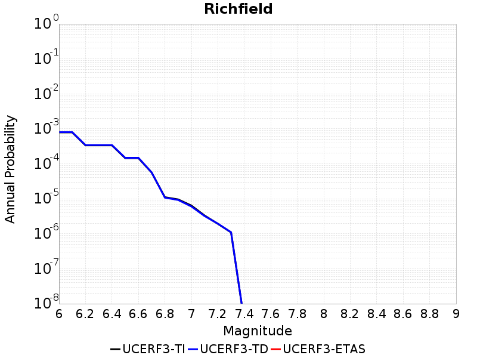 |
|-----|

| Magnitude | UCERF3-TI Prob | UCERF3-TD Prob | UCERF3-ETAS Prob |
|-----|-----|-----|-----|
| 6.0 | 7.910745E-4 | 8.0283574E-4 | 0.0 |
| 6.1 | 7.910745E-4 | 8.0283574E-4 | 0.0 |
| 6.2 | 3.3770915E-4 | 3.4418E-4 | 0.0 |
| 6.3 | 3.3770915E-4 | 3.4418E-4 | 0.0 |
| 6.4 | 3.3770915E-4 | 3.4418E-4 | 0.0 |
| 6.5 | 1.4585146E-4 | 1.4883044E-4 | 0.0 |
| 6.6 | 1.4585146E-4 | 1.4883044E-4 | 0.0 |
| 6.7 | 5.623283E-5 | 5.6752542E-5 | 0.0 |
| 6.8 | 1.1114952E-5 | 1.0782008E-5 | 0.0 |
| 6.9 | 9.607857E-6 | 9.261144E-6 | 0.0 |
| 7.0 | 6.4130086E-6 | 6.0385064E-6 | 0.0 |
| 7.1 | 3.3256335E-6 | 3.2116136E-6 | 0.0 |
| 7.2 | 1.9300805E-6 | 1.9491936E-6 | 0.0 |
| 7.3 | 1.0943911E-6 | 1.1060866E-6 | 0.0 |
| 7.4 | 3.0427532E-9 | 3.0739646E-9 | 0.0 |

## Rinconada 2011 CFM
*[(top)](#table-of-contents)*

|  |
|-----|

| Magnitude | UCERF3-TI Prob | UCERF3-TD Prob | UCERF3-ETAS Prob |
|-----|-----|-----|-----|
| 6.0 | 0.008185739 | 0.008453442 | 0.0 |
| 6.1 | 0.0057056635 | 0.0058888798 | 0.0 |
| 6.2 | 0.0057056635 | 0.0058888798 | 0.0 |
| 6.3 | 0.0046467283 | 0.004793998 | 0.0 |
| 6.4 | 0.0039977287 | 0.004122777 | 0.0 |
| 6.5 | 0.003212744 | 0.0033114457 | 0.0 |
| 6.6 | 0.0028935277 | 0.0029817112 | 0.0 |
| 6.7 | 0.0024951235 | 0.0025700042 | 0.0 |
| 6.8 | 0.002082636 | 0.0021433865 | 0.0 |
| 6.9 | 0.001785527 | 0.0018357231 | 0.0 |
| 7.0 | 0.0014449668 | 0.0014838359 | 0.0 |
| 7.1 | 0.0011615298 | 0.0011915999 | 0.0 |
| 7.2 | 8.250187E-4 | 8.451784E-4 | 0.0 |
| 7.3 | 5.376376E-4 | 5.5000564E-4 | 0.0 |
| 7.4 | 3.4095717E-4 | 3.485436E-4 | 0.0 |
| 7.5 | 1.7038487E-4 | 1.7378027E-4 | 0.0 |
| 7.6 | 5.0895473E-5 | 5.123003E-5 | 0.0 |
| 7.7 | 3.1307852E-6 | 3.0508852E-6 | 0.0 |
| 7.8 | 3.861218E-8 | 3.8950034E-8 | 0.0 |

## Robinson Creek
*[(top)](#table-of-contents)*

| 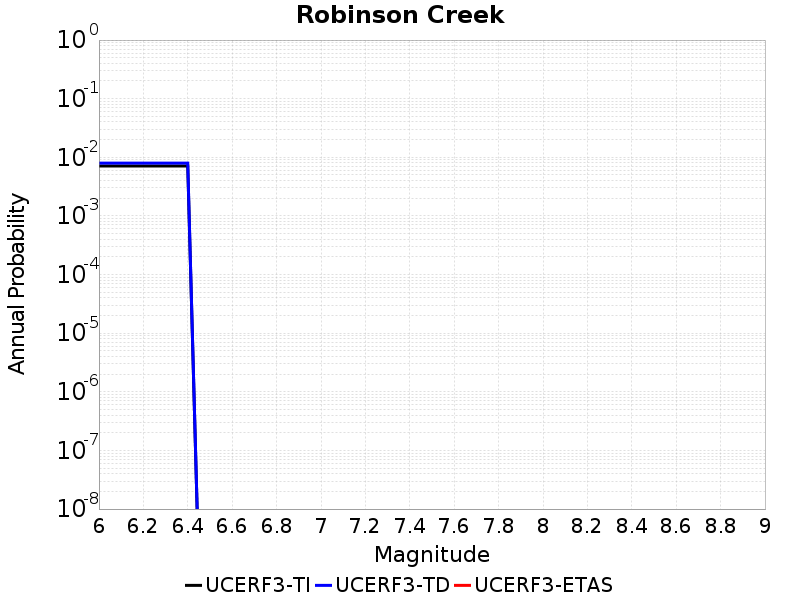 |
|-----|

| Magnitude | UCERF3-TI Prob | UCERF3-TD Prob | UCERF3-ETAS Prob |
|-----|-----|-----|-----|
| 6.0 | 0.0071257832 | 0.007965915 | 0.0 |
| 6.1 | 0.0071257832 | 0.007965915 | 0.0 |
| 6.2 | 0.0071257832 | 0.007965915 | 0.0 |
| 6.3 | 0.0071257832 | 0.007965915 | 0.0 |
| 6.4 | 0.0071257832 | 0.007965915 | 0.0 |

## Rocky Ledge 2011 CFM
*[(top)](#table-of-contents)*

| 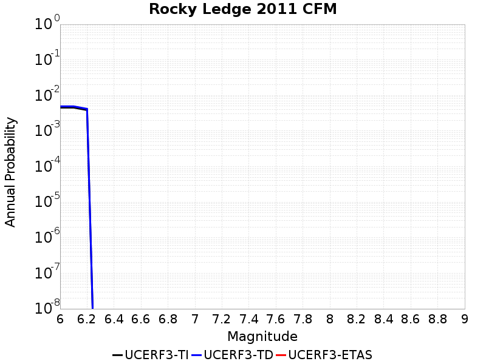 |
|-----|

| Magnitude | UCERF3-TI Prob | UCERF3-TD Prob | UCERF3-ETAS Prob |
|-----|-----|-----|-----|
| 6.0 | 0.0045578624 | 0.00494241 | 0.0 |
| 6.1 | 0.0045578624 | 0.00494241 | 0.0 |
| 6.2 | 0.0038757676 | 0.0042035184 | 0.0 |

## Rodgers Creek - Healdsburg 2011 CFM
*[(top)](#table-of-contents)*

|  |
|-----|

| Magnitude | UCERF3-TI Prob | UCERF3-TD Prob | UCERF3-ETAS Prob |
|-----|-----|-----|-----|
| 6.0 | 0.037828278 | 0.0656978 | 0.1 |
| 6.1 | 0.037469655 | 0.06520396 | 0.1 |
| 6.2 | 0.0365612 | 0.063726045 | 0.1 |
| 6.3 | 0.035492823 | 0.06205848 | 0.0 |
| 6.4 | 0.034234364 | 0.060013942 | 0.0 |
| 6.5 | 0.03371918 | 0.059280306 | 0.0 |
| 6.6 | 0.032286562 | 0.057025574 | 0.0 |
| 6.7 | 0.031405866 | 0.055648137 | 0.0 |
| 6.8 | 0.030434765 | 0.05402027 | 0.0 |
| 6.9 | 0.027799325 | 0.049580682 | 0.0 |
| 7.0 | 0.024867928 | 0.04426084 | 0.0 |
| 7.1 | 0.02080602 | 0.037549596 | 0.0 |
| 7.2 | 0.01602694 | 0.029104747 | 0.0 |
| 7.3 | 0.0122466255 | 0.022352973 | 0.0 |
| 7.4 | 0.009478063 | 0.01722926 | 0.0 |
| 7.5 | 0.006455223 | 0.011579545 | 0.0 |
| 7.6 | 0.0023333887 | 0.0041843127 | 0.0 |
| 7.7 | 1.1259195E-4 | 1.8532827E-4 | 0.0 |
| 7.8 | 5.198066E-5 | 1.0500327E-4 | 0.0 |
| 7.9 | 2.9608427E-5 | 6.2260864E-5 | 0.0 |
| 8.0 | 1.4930434E-5 | 3.4562803E-5 | 0.0 |
| 8.1 | 1.8286064E-6 | 4.674997E-6 | 0.0 |

## Rose Canyon
*[(top)](#table-of-contents)*

|  |
|-----|

| Magnitude | UCERF3-TI Prob | UCERF3-TD Prob | UCERF3-ETAS Prob |
|-----|-----|-----|-----|
| 6.0 | 0.023677798 | 0.025565585 | 0.0 |
| 6.1 | 0.023677798 | 0.025565585 | 0.0 |
| 6.2 | 0.0149382865 | 0.015332962 | 0.0 |
| 6.3 | 0.012017938 | 0.011992134 | 0.0 |
| 6.4 | 0.010415946 | 0.010190146 | 0.0 |
| 6.5 | 0.009229303 | 0.008871246 | 0.0 |
| 6.6 | 0.007914 | 0.007437312 | 0.0 |
| 6.7 | 0.006606833 | 0.0060600135 | 0.0 |
| 6.8 | 0.0060110865 | 0.0055098287 | 0.0 |
| 6.9 | 0.0045459294 | 0.0040969457 | 0.0 |
| 7.0 | 0.0030913667 | 0.0026560682 | 0.0 |
| 7.1 | 0.0026125133 | 0.0021729681 | 0.0 |
| 7.2 | 0.0021478499 | 0.0017071735 | 0.0 |
| 7.3 | 0.0016725556 | 0.0012694094 | 0.0 |
| 7.4 | 0.0012616527 | 9.194555E-4 | 0.0 |
| 7.5 | 7.220419E-4 | 4.8711E-4 | 0.0 |
| 7.6 | 5.2277505E-4 | 3.32977E-4 | 0.0 |
| 7.7 | 4.5717883E-5 | 3.3632856E-5 | 0.0 |

## Round Valley
*[(top)](#table-of-contents)*

| 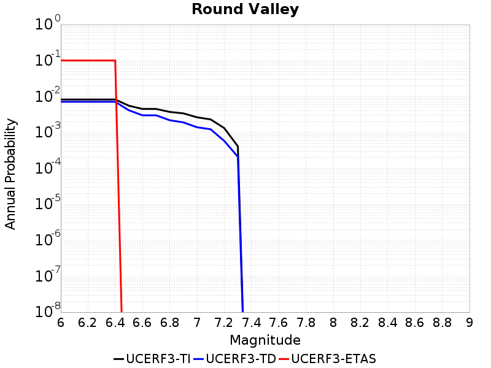 |
|-----|

| Magnitude | UCERF3-TI Prob | UCERF3-TD Prob | UCERF3-ETAS Prob |
|-----|-----|-----|-----|
| 6.0 | 0.008252576 | 0.007101096 | 0.1 |
| 6.1 | 0.008252576 | 0.007101096 | 0.1 |
| 6.2 | 0.008252576 | 0.007101096 | 0.1 |
| 6.3 | 0.008252576 | 0.007101096 | 0.1 |
| 6.4 | 0.008252576 | 0.007101096 | 0.1 |
| 6.5 | 0.005539963 | 0.0041339262 | 0.0 |
| 6.6 | 0.0044944426 | 0.0029987588 | 0.0 |
| 6.7 | 0.0044944426 | 0.0029987588 | 0.0 |
| 6.8 | 0.0037206567 | 0.0021837484 | 0.0 |
| 6.9 | 0.0033921495 | 0.001904249 | 0.0 |
| 7.0 | 0.0026375111 | 0.001394104 | 0.0 |
| 7.1 | 0.0023022245 | 0.0012245666 | 0.0 |
| 7.2 | 0.0013221119 | 5.80867E-4 | 0.0 |
| 7.3 | 4.121267E-4 | 2.105891E-4 | 0.0 |

## Russ 2011 CFM
*[(top)](#table-of-contents)*

|  |
|-----|

| Magnitude | UCERF3-TI Prob | UCERF3-TD Prob | UCERF3-ETAS Prob |
|-----|-----|-----|-----|
| 6.0 | 0.012345135 | 0.013598154 | 0.0 |
| 6.1 | 0.012345135 | 0.013598154 | 0.0 |
| 6.2 | 0.012345135 | 0.013598154 | 0.0 |
| 6.3 | 0.012345135 | 0.013598154 | 0.0 |
| 6.4 | 0.012345135 | 0.013598154 | 0.0 |
| 6.5 | 0.012345135 | 0.013598154 | 0.0 |
| 6.6 | 0.012345135 | 0.013598154 | 0.0 |
| 6.7 | 0.008580698 | 0.009439119 | 0.0 |
| 6.8 | 0.008580698 | 0.009439119 | 0.0 |
| 6.9 | 0.0067453682 | 0.0074153175 | 0.0 |
| 7.0 | 0.00530904 | 0.0058345287 | 0.0 |
| 7.1 | 0.004360176 | 0.004792536 | 0.0 |
| 7.2 | 0.0034635565 | 0.0038084595 | 0.0 |
| 7.3 | 0.0025820795 | 0.0028406996 | 0.0 |

## San Andreas (Big Bend)
*[(top)](#table-of-contents)*

| 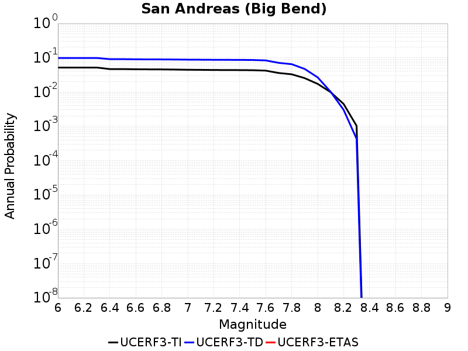 |
|-----|

| Magnitude | UCERF3-TI Prob | UCERF3-TD Prob | UCERF3-ETAS Prob |
|-----|-----|-----|-----|
| 6.0 | 0.051734097 | 0.098511286 | 0.0 |
| 6.1 | 0.051734097 | 0.098511286 | 0.0 |
| 6.2 | 0.051734097 | 0.098511286 | 0.0 |
| 6.3 | 0.051734097 | 0.098511286 | 0.0 |
| 6.4 | 0.046693064 | 0.09086954 | 0.0 |
| 6.5 | 0.046693064 | 0.09086954 | 0.0 |
| 6.6 | 0.046089325 | 0.08996763 | 0.0 |
| 6.7 | 0.045795817 | 0.089563265 | 0.0 |
| 6.8 | 0.04561414 | 0.08931251 | 0.0 |
| 6.9 | 0.04517103 | 0.08875577 | 0.0 |
| 7.0 | 0.044598386 | 0.087995514 | 0.0 |
| 7.1 | 0.04430731 | 0.087580524 | 0.0 |
| 7.2 | 0.043916024 | 0.087064154 | 0.0 |
| 7.3 | 0.043725148 | 0.086789966 | 0.0 |
| 7.4 | 0.043600157 | 0.08661314 | 0.0 |
| 7.5 | 0.043280575 | 0.08600031 | 0.0 |
| 7.6 | 0.042091176 | 0.08341497 | 0.0 |
| 7.7 | 0.035888977 | 0.07092104 | 0.0 |
| 7.8 | 0.03292141 | 0.064894155 | 0.0 |
| 7.9 | 0.025447013 | 0.047167666 | 0.0 |
| 8.0 | 0.017302496 | 0.026830563 | 0.0 |
| 8.1 | 0.009919235 | 0.010189685 | 0.0 |
| 8.2 | 0.0045001395 | 0.0030265683 | 0.0 |
| 8.3 | 0.0010342124 | 4.3275798E-4 | 0.0 |

## San Andreas (Carrizo) rev
*[(top)](#table-of-contents)*

| 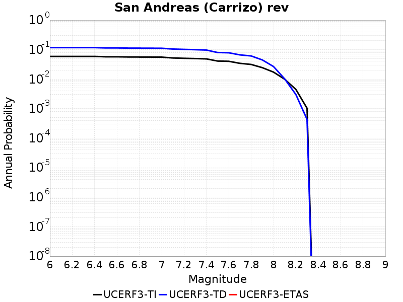 |
|-----|

| Magnitude | UCERF3-TI Prob | UCERF3-TD Prob | UCERF3-ETAS Prob |
|-----|-----|-----|-----|
| 6.0 | 0.0591016 | 0.11741765 | 0.0 |
| 6.1 | 0.0591016 | 0.11741765 | 0.0 |
| 6.2 | 0.0591016 | 0.11741765 | 0.0 |
| 6.3 | 0.0591016 | 0.11741765 | 0.0 |
| 6.4 | 0.0591016 | 0.11741765 | 0.0 |
| 6.5 | 0.057327334 | 0.114391476 | 0.0 |
| 6.6 | 0.057327334 | 0.114391476 | 0.0 |
| 6.7 | 0.05652051 | 0.11301412 | 0.0 |
| 6.8 | 0.056293584 | 0.1125765 | 0.0 |
| 6.9 | 0.05604569 | 0.11209501 | 0.0 |
| 7.0 | 0.055809796 | 0.111649565 | 0.0 |
| 7.1 | 0.052368138 | 0.10493914 | 0.0 |
| 7.2 | 0.050979212 | 0.10225739 | 0.0 |
| 7.3 | 0.049935985 | 0.09987388 | 0.0 |
| 7.4 | 0.048678253 | 0.09700334 | 0.0 |
| 7.5 | 0.04114753 | 0.0800431 | 0.0 |
| 7.6 | 0.040369697 | 0.078411594 | 0.0 |
| 7.7 | 0.034394164 | 0.066539675 | 0.0 |
| 7.8 | 0.031569764 | 0.06123049 | 0.0 |
| 7.9 | 0.024550365 | 0.044929933 | 0.0 |
| 8.0 | 0.017356034 | 0.026788626 | 0.0 |
| 8.1 | 0.009955673 | 0.010196983 | 0.0 |
| 8.2 | 0.0045001395 | 0.0030265683 | 0.0 |
| 8.3 | 0.0010342124 | 4.3275798E-4 | 0.0 |

## San Andreas (Cholame) rev
*[(top)](#table-of-contents)*

| 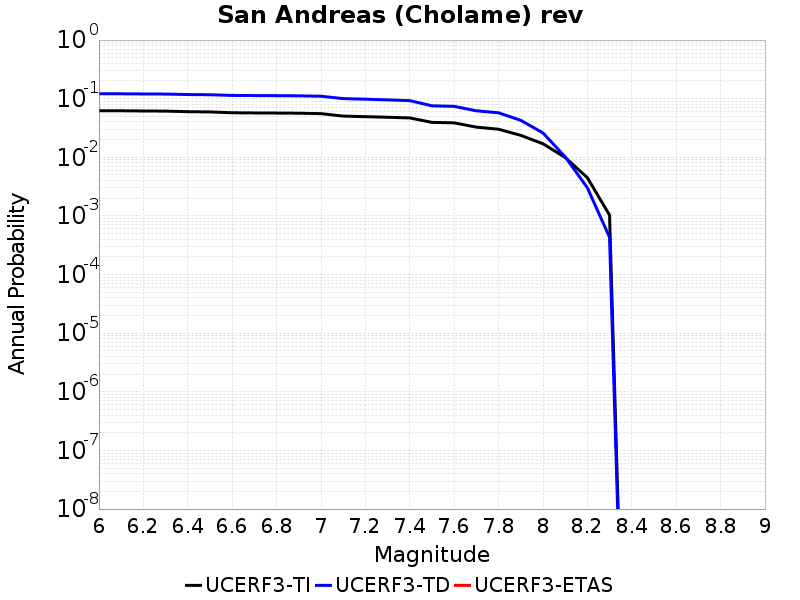 |
|-----|

| Magnitude | UCERF3-TI Prob | UCERF3-TD Prob | UCERF3-ETAS Prob |
|-----|-----|-----|-----|
| 6.0 | 0.06217949 | 0.12118372 | 0.0 |
| 6.1 | 0.06217949 | 0.12118372 | 0.0 |
| 6.2 | 0.061695136 | 0.120370865 | 0.0 |
| 6.3 | 0.06139677 | 0.119865455 | 0.0 |
| 6.4 | 0.060036868 | 0.117669016 | 0.0 |
| 6.5 | 0.059444077 | 0.11675263 | 0.0 |
| 6.6 | 0.057545185 | 0.113692 | 0.0 |
| 6.7 | 0.057119697 | 0.113000296 | 0.0 |
| 6.8 | 0.056856725 | 0.11250402 | 0.0 |
| 6.9 | 0.056506127 | 0.11183006 | 0.0 |
| 7.0 | 0.055614736 | 0.110149585 | 0.0 |
| 7.1 | 0.05048634 | 0.10032278 | 0.0 |
| 7.2 | 0.04934009 | 0.09807388 | 0.0 |
| 7.3 | 0.048228268 | 0.09548161 | 0.0 |
| 7.4 | 0.046973653 | 0.0926034 | 0.0 |
| 7.5 | 0.03946433 | 0.07562968 | 0.0 |
| 7.6 | 0.038697794 | 0.07402053 | 0.0 |
| 7.7 | 0.032734364 | 0.062145863 | 0.0 |
| 7.8 | 0.030132094 | 0.057472076 | 0.0 |
| 7.9 | 0.023692891 | 0.042717684 | 0.0 |
| 8.0 | 0.017046256 | 0.026106788 | 0.0 |
| 8.1 | 0.009956728 | 0.010197085 | 0.0 |
| 8.2 | 0.0045001395 | 0.0030265683 | 0.0 |
| 8.3 | 0.0010342124 | 4.3275798E-4 | 0.0 |

## San Andreas (Coachella) rev
*[(top)](#table-of-contents)*

|  |
|-----|

| Magnitude | UCERF3-TI Prob | UCERF3-TD Prob | UCERF3-ETAS Prob |
|-----|-----|-----|-----|
| 6.0 | 0.060334753 | 0.15119712 | 0.0 |
| 6.1 | 0.060334753 | 0.15119712 | 0.0 |
| 6.2 | 0.05451731 | 0.14036039 | 0.0 |
| 6.3 | 0.054396555 | 0.14012831 | 0.0 |
| 6.4 | 0.052604496 | 0.13668486 | 0.0 |
| 6.5 | 0.051971316 | 0.13546267 | 0.0 |
| 6.6 | 0.051421247 | 0.13444073 | 0.0 |
| 6.7 | 0.051094085 | 0.13382514 | 0.0 |
| 6.8 | 0.050728295 | 0.13297749 | 0.0 |
| 6.9 | 0.049738888 | 0.13081406 | 0.0 |
| 7.0 | 0.04338823 | 0.11673582 | 0.0 |
| 7.1 | 0.042484846 | 0.11497178 | 0.0 |
| 7.2 | 0.03870018 | 0.106410444 | 0.0 |
| 7.3 | 0.03628465 | 0.09897786 | 0.0 |
| 7.4 | 0.02649557 | 0.06975229 | 0.0 |
| 7.5 | 0.020801254 | 0.0540613 | 0.0 |
| 7.6 | 0.016132116 | 0.04195392 | 0.0 |
| 7.7 | 0.011465867 | 0.03114032 | 0.0 |
| 7.8 | 0.009081938 | 0.025959125 | 0.0 |
| 7.9 | 0.0072614877 | 0.019341752 | 0.0 |
| 8.0 | 0.006183513 | 0.015786693 | 0.0 |
| 8.1 | 0.002658026 | 0.0047030556 | 0.0 |
| 8.2 | 0.0011996223 | 0.0015079322 | 0.0 |
| 8.3 | 5.4391792E-5 | 2.9521738E-5 | 0.0 |

## San Andreas (Creeping Section) 2011 CFM
*[(top)](#table-of-contents)*

| 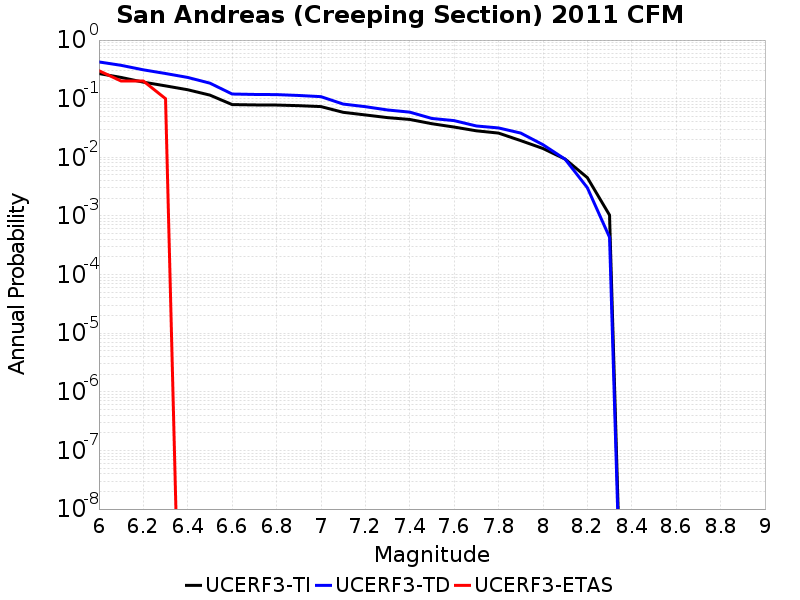 |
|-----|

| Magnitude | UCERF3-TI Prob | UCERF3-TD Prob | UCERF3-ETAS Prob |
|-----|-----|-----|-----|
| 6.0 | 0.26835477 | 0.42356014 | 0.3 |
| 6.1 | 0.23032776 | 0.37064838 | 0.2 |
| 6.2 | 0.19150782 | 0.3106429 | 0.2 |
| 6.3 | 0.16538359 | 0.2687815 | 0.1 |
| 6.4 | 0.14201577 | 0.2303097 | 0.0 |
| 6.5 | 0.11499573 | 0.18398824 | 0.0 |
| 6.6 | 0.07934396 | 0.120109946 | 0.0 |
| 6.7 | 0.0782586 | 0.1181377 | 0.0 |
| 6.8 | 0.07788358 | 0.11737262 | 0.0 |
| 6.9 | 0.07602952 | 0.11345376 | 0.0 |
| 7.0 | 0.073302895 | 0.10833461 | 0.0 |
| 7.1 | 0.058563538 | 0.08096924 | 0.0 |
| 7.2 | 0.052791595 | 0.07306388 | 0.0 |
| 7.3 | 0.047533102 | 0.06419474 | 0.0 |
| 7.4 | 0.044233937 | 0.058956526 | 0.0 |
| 7.5 | 0.03739367 | 0.045975182 | 0.0 |
| 7.6 | 0.032811474 | 0.04225593 | 0.0 |
| 7.7 | 0.0283165 | 0.03424054 | 0.0 |
| 7.8 | 0.025890453 | 0.031699084 | 0.0 |
| 7.9 | 0.019260362 | 0.025904257 | 0.0 |
| 8.0 | 0.014149235 | 0.016418068 | 0.0 |
| 8.1 | 0.009317525 | 0.009274815 | 0.0 |
| 8.2 | 0.0045001395 | 0.0030265683 | 0.0 |
| 8.3 | 0.0010342124 | 4.3275798E-4 | 0.0 |

## San Andreas (Mojave N)
*[(top)](#table-of-contents)*

|  |
|-----|

| Magnitude | UCERF3-TI Prob | UCERF3-TD Prob | UCERF3-ETAS Prob |
|-----|-----|-----|-----|
| 6.0 | 0.05023708 | 0.09529199 | 0.0 |
| 6.1 | 0.05023708 | 0.09529199 | 0.0 |
| 6.2 | 0.05023708 | 0.09529199 | 0.0 |
| 6.3 | 0.05023708 | 0.09529199 | 0.0 |
| 6.4 | 0.05023708 | 0.09529199 | 0.0 |
| 6.5 | 0.050156746 | 0.09517027 | 0.0 |
| 6.6 | 0.050156746 | 0.09517027 | 0.0 |
| 6.7 | 0.050125998 | 0.09512365 | 0.0 |
| 6.8 | 0.05008251 | 0.09505431 | 0.0 |
| 6.9 | 0.049980022 | 0.09490458 | 0.0 |
| 7.0 | 0.04976007 | 0.09458357 | 0.0 |
| 7.1 | 0.04941613 | 0.094123505 | 0.0 |
| 7.2 | 0.049176537 | 0.09379925 | 0.0 |
| 7.3 | 0.04899759 | 0.093576394 | 0.0 |
| 7.4 | 0.04882661 | 0.093298264 | 0.0 |
| 7.5 | 0.048669744 | 0.09304783 | 0.0 |
| 7.6 | 0.047957025 | 0.09144882 | 0.0 |
| 7.7 | 0.04189639 | 0.079462975 | 0.0 |
| 7.8 | 0.037304975 | 0.07221462 | 0.0 |
| 7.9 | 0.02772022 | 0.050597705 | 0.0 |
| 8.0 | 0.017935853 | 0.027838226 | 0.0 |
| 8.1 | 0.009943757 | 0.010297717 | 0.0 |
| 8.2 | 0.0045001395 | 0.0030265683 | 0.0 |
| 8.3 | 0.0010342124 | 4.3275798E-4 | 0.0 |

## San Andreas (Mojave S)
*[(top)](#table-of-contents)*

| 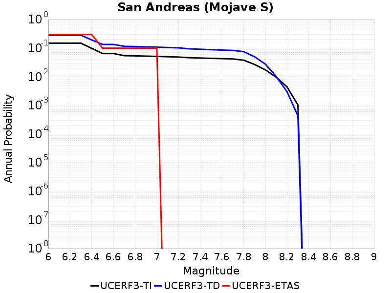 |
|-----|

| Magnitude | UCERF3-TI Prob | UCERF3-TD Prob | UCERF3-ETAS Prob |
|-----|-----|-----|-----|
| 6.0 | 0.1496549 | 0.2840013 | 0.3 |
| 6.1 | 0.1496549 | 0.2840013 | 0.3 |
| 6.2 | 0.1496549 | 0.2840013 | 0.3 |
| 6.3 | 0.1496549 | 0.2840013 | 0.3 |
| 6.4 | 0.098504856 | 0.19419123 | 0.3 |
| 6.5 | 0.065152965 | 0.13516365 | 0.1 |
| 6.6 | 0.065152965 | 0.13516365 | 0.1 |
| 6.7 | 0.054797906 | 0.116284 | 0.1 |
| 6.8 | 0.053930566 | 0.11423357 | 0.1 |
| 6.9 | 0.05279156 | 0.111531906 | 0.1 |
| 7.0 | 0.05161361 | 0.10879469 | 0.1 |
| 7.1 | 0.05027629 | 0.10568196 | 0.0 |
| 7.2 | 0.049064007 | 0.102875024 | 0.0 |
| 7.3 | 0.046464786 | 0.09511183 | 0.0 |
| 7.4 | 0.045316286 | 0.09176588 | 0.0 |
| 7.5 | 0.04425787 | 0.088748135 | 0.0 |
| 7.6 | 0.04315024 | 0.08593301 | 0.0 |
| 7.7 | 0.042181134 | 0.0837078 | 0.0 |
| 7.8 | 0.03810269 | 0.07575892 | 0.0 |
| 7.9 | 0.027066574 | 0.05039404 | 0.0 |
| 8.0 | 0.017481409 | 0.027737012 | 0.0 |
| 8.1 | 0.009693642 | 0.0102461185 | 0.0 |
| 8.2 | 0.0044469717 | 0.003019402 | 0.0 |
| 8.3 | 0.0010342124 | 4.3275798E-4 | 0.0 |

## San Andreas (North Branch Mill Creek)
*[(top)](#table-of-contents)*

|  |
|-----|

| Magnitude | UCERF3-TI Prob | UCERF3-TD Prob | UCERF3-ETAS Prob |
|-----|-----|-----|-----|
| 6.0 | 0.0069992766 | 0.011951505 | 0.0 |
| 6.1 | 0.0069992766 | 0.011951505 | 0.0 |
| 6.2 | 0.0069992766 | 0.011951505 | 0.0 |
| 6.3 | 0.0069992766 | 0.011951505 | 0.0 |
| 6.4 | 0.0069992766 | 0.011951505 | 0.0 |
| 6.5 | 0.006993862 | 0.011945817 | 0.0 |
| 6.6 | 0.006798926 | 0.011747028 | 0.0 |
| 6.7 | 0.0067863287 | 0.011734308 | 0.0 |
| 6.8 | 0.0067110364 | 0.011656188 | 0.0 |
| 6.9 | 0.006691564 | 0.011635294 | 0.0 |
| 7.0 | 0.0064990623 | 0.011327756 | 0.0 |
| 7.1 | 0.0064762887 | 0.011299505 | 0.0 |
| 7.2 | 0.006243344 | 0.010980333 | 0.0 |
| 7.3 | 0.0062021962 | 0.01091349 | 0.0 |
| 7.4 | 0.006039923 | 0.010593993 | 0.0 |
| 7.5 | 0.005742567 | 0.009933545 | 0.0 |
| 7.6 | 0.005578433 | 0.009648614 | 0.0 |
| 7.7 | 0.0048285574 | 0.008340231 | 0.0 |
| 7.8 | 0.0030398308 | 0.005646982 | 0.0 |
| 7.9 | 0.002444295 | 0.00430398 | 0.0 |
| 8.0 | 0.0015417566 | 0.002447035 | 0.0 |
| 8.1 | 8.54155E-4 | 0.0011067134 | 0.0 |
| 8.2 | 3.6326164E-4 | 2.2823595E-4 | 0.0 |
| 8.3 | 9.3270784E-5 | 4.2350635E-5 | 0.0 |

## San Andreas (North Coast) 2011 CFM
*[(top)](#table-of-contents)*

|  |
|-----|

| Magnitude | UCERF3-TI Prob | UCERF3-TD Prob | UCERF3-ETAS Prob |
|-----|-----|-----|-----|
| 6.0 | 0.0768977 | 0.03783724 | 0.0 |
| 6.1 | 0.0768977 | 0.03783724 | 0.0 |
| 6.2 | 0.07002798 | 0.032325696 | 0.0 |
| 6.3 | 0.07002798 | 0.032325696 | 0.0 |
| 6.4 | 0.06374981 | 0.027075108 | 0.0 |
| 6.5 | 0.05940335 | 0.023447603 | 0.0 |
| 6.6 | 0.058671024 | 0.022869188 | 0.0 |
| 6.7 | 0.057601593 | 0.021983596 | 0.0 |
| 6.8 | 0.05679232 | 0.02156137 | 0.0 |
| 6.9 | 0.055811852 | 0.021049634 | 0.0 |
| 7.0 | 0.054047033 | 0.020052053 | 0.0 |
| 7.1 | 0.053215165 | 0.019540824 | 0.0 |
| 7.2 | 0.052191395 | 0.018953618 | 0.0 |
| 7.3 | 0.051165357 | 0.018651925 | 0.0 |
| 7.4 | 0.049221683 | 0.017969977 | 0.0 |
| 7.5 | 0.04468165 | 0.01240978 | 0.0 |
| 7.6 | 0.040666126 | 0.0105646225 | 0.0 |
| 7.7 | 0.032776527 | 0.006690426 | 0.0 |
| 7.8 | 0.021954332 | 0.005083534 | 0.0 |
| 7.9 | 0.011742111 | 0.0043484387 | 0.0 |
| 8.0 | 0.007883203 | 0.003917025 | 0.0 |
| 8.1 | 0.0055577457 | 0.0035477784 | 0.0 |
| 8.2 | 0.004283088 | 0.0028346283 | 0.0 |
| 8.3 | 0.0010342124 | 4.3275798E-4 | 0.0 |

## San Andreas (Offshore) 2011 CFM
*[(top)](#table-of-contents)*

|  |
|-----|

| Magnitude | UCERF3-TI Prob | UCERF3-TD Prob | UCERF3-ETAS Prob |
|-----|-----|-----|-----|
| 6.0 | 0.085237645 | 0.0948813 | 0.0 |
| 6.1 | 0.085237645 | 0.0948813 | 0.0 |
| 6.2 | 0.08160117 | 0.09097087 | 0.0 |
| 6.3 | 0.075787395 | 0.083712734 | 0.0 |
| 6.4 | 0.0755203 | 0.08319299 | 0.0 |
| 6.5 | 0.064419635 | 0.068659864 | 0.0 |
| 6.6 | 0.05609626 | 0.058045007 | 0.0 |
| 6.7 | 0.052778035 | 0.053599946 | 0.0 |
| 6.8 | 0.051321987 | 0.051324733 | 0.0 |
| 6.9 | 0.049853306 | 0.048675142 | 0.0 |
| 7.0 | 0.048185747 | 0.04588498 | 0.0 |
| 7.1 | 0.04637333 | 0.04276954 | 0.0 |
| 7.2 | 0.045121472 | 0.040940437 | 0.0 |
| 7.3 | 0.040525194 | 0.031843122 | 0.0 |
| 7.4 | 0.0331872 | 0.020057356 | 0.0 |
| 7.5 | 0.02539953 | 0.0070600975 | 0.0 |
| 7.6 | 0.023780935 | 0.005787968 | 0.0 |
| 7.7 | 0.020366974 | 0.0032405655 | 0.0 |
| 7.8 | 0.014394675 | 0.00217705 | 0.0 |
| 7.9 | 0.008265611 | 0.0017440745 | 0.0 |
| 8.0 | 0.0047856434 | 0.0014807197 | 0.0 |
| 8.1 | 0.0029185633 | 0.0012834845 | 0.0 |
| 8.2 | 0.0022676561 | 0.0010631367 | 0.0 |
| 8.3 | 0.001020786 | 4.2547143E-4 | 0.0 |

## San Andreas (Parkfield)
*[(top)](#table-of-contents)*

| 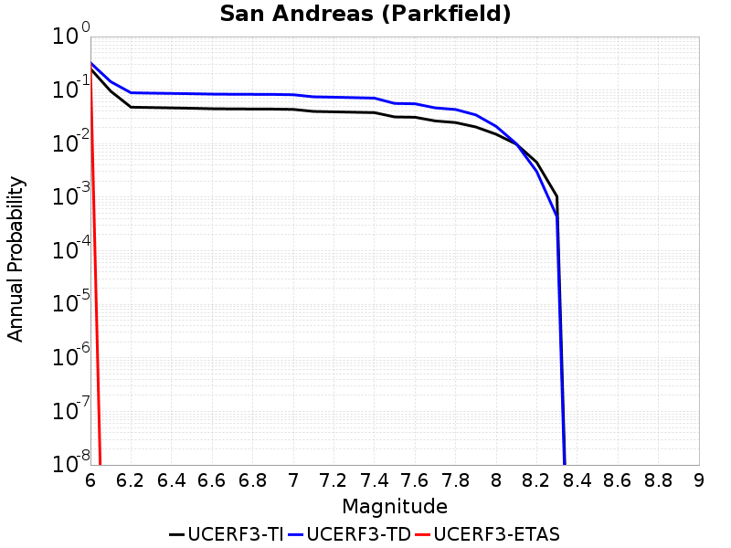 |
|-----|

| Magnitude | UCERF3-TI Prob | UCERF3-TD Prob | UCERF3-ETAS Prob |
|-----|-----|-----|-----|
| 6.0 | 0.25176284 | 0.32384077 | 0.3 |
| 6.1 | 0.095613256 | 0.14392558 | 0.0 |
| 6.2 | 0.048019063 | 0.08920902 | 0.0 |
| 6.3 | 0.047285385 | 0.08786676 | 0.0 |
| 6.4 | 0.046568092 | 0.08678279 | 0.0 |
| 6.5 | 0.045878403 | 0.08567991 | 0.0 |
| 6.6 | 0.04493529 | 0.0842393 | 0.0 |
| 6.7 | 0.04457213 | 0.08364496 | 0.0 |
| 6.8 | 0.04443313 | 0.08339745 | 0.0 |
| 6.9 | 0.044283327 | 0.08312779 | 0.0 |
| 7.0 | 0.043669727 | 0.081992865 | 0.0 |
| 7.1 | 0.040013418 | 0.07497462 | 0.0 |
| 7.2 | 0.0393371 | 0.073760636 | 0.0 |
| 7.3 | 0.038652334 | 0.072348595 | 0.0 |
| 7.4 | 0.03798529 | 0.0709499 | 0.0 |
| 7.5 | 0.03157923 | 0.056415386 | 0.0 |
| 7.6 | 0.031148417 | 0.0555928 | 0.0 |
| 7.7 | 0.026592141 | 0.04660223 | 0.0 |
| 7.8 | 0.024781305 | 0.04351607 | 0.0 |
| 7.9 | 0.020503636 | 0.034463704 | 0.0 |
| 8.0 | 0.015009012 | 0.021072919 | 0.0 |
| 8.1 | 0.009780403 | 0.009936604 | 0.0 |
| 8.2 | 0.0045001395 | 0.0030265683 | 0.0 |
| 8.3 | 0.0010342124 | 4.3275798E-4 | 0.0 |

## San Andreas (Peninsula) 2011 CFM
*[(top)](#table-of-contents)*

| 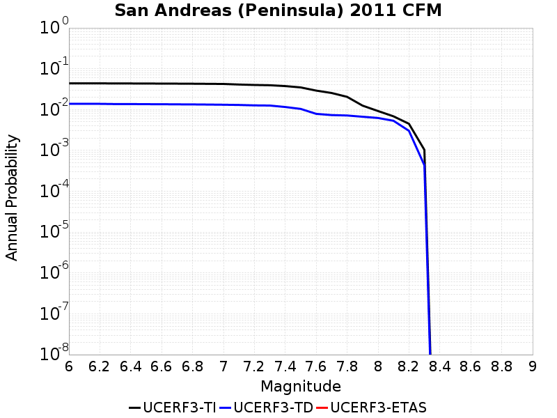 |
|-----|

| Magnitude | UCERF3-TI Prob | UCERF3-TD Prob | UCERF3-ETAS Prob |
|-----|-----|-----|-----|
| 6.0 | 0.043983612 | 0.013830858 | 0.0 |
| 6.1 | 0.043983612 | 0.013830858 | 0.0 |
| 6.2 | 0.043983612 | 0.013830858 | 0.0 |
| 6.3 | 0.043639794 | 0.013664388 | 0.0 |
| 6.4 | 0.043639794 | 0.013664388 | 0.0 |
| 6.5 | 0.04344007 | 0.013567946 | 0.0 |
| 6.6 | 0.043376986 | 0.013531137 | 0.0 |
| 6.7 | 0.043197807 | 0.013439204 | 0.0 |
| 6.8 | 0.043001823 | 0.013382614 | 0.0 |
| 6.9 | 0.04271523 | 0.013278752 | 0.0 |
| 7.0 | 0.042432297 | 0.0131532755 | 0.0 |
| 7.1 | 0.041091725 | 0.0129841855 | 0.0 |
| 7.2 | 0.040097635 | 0.012678356 | 0.0 |
| 7.3 | 0.03948827 | 0.012565744 | 0.0 |
| 7.4 | 0.037644852 | 0.011568845 | 0.0 |
| 7.5 | 0.034891766 | 0.010388065 | 0.0 |
| 7.6 | 0.02916862 | 0.007867567 | 0.0 |
| 7.7 | 0.02548303 | 0.0073363027 | 0.0 |
| 7.8 | 0.020511515 | 0.0071723033 | 0.0 |
| 7.9 | 0.012504238 | 0.006682355 | 0.0 |
| 8.0 | 0.009222416 | 0.0062320516 | 0.0 |
| 8.1 | 0.0068428386 | 0.0053265337 | 0.0 |
| 8.2 | 0.004495725 | 0.0030225604 | 0.0 |
| 8.3 | 0.0010342124 | 4.3275798E-4 | 0.0 |

## San Andreas (San Bernardino N)
*[(top)](#table-of-contents)*

| 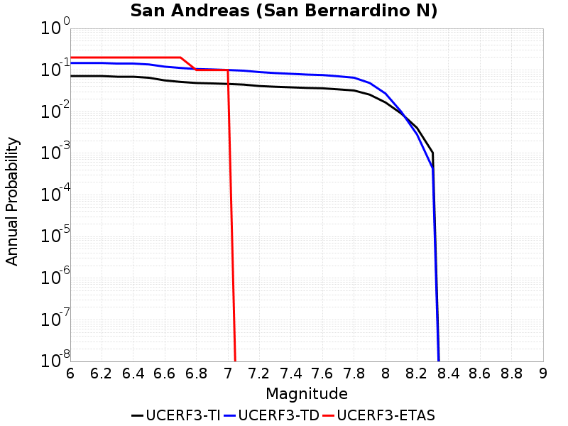 |
|-----|

| Magnitude | UCERF3-TI Prob | UCERF3-TD Prob | UCERF3-ETAS Prob |
|-----|-----|-----|-----|
| 6.0 | 0.07177748 | 0.14788894 | 0.2 |
| 6.1 | 0.07177748 | 0.14788894 | 0.2 |
| 6.2 | 0.07177748 | 0.14788894 | 0.2 |
| 6.3 | 0.06914291 | 0.1431871 | 0.2 |
| 6.4 | 0.06914291 | 0.1431871 | 0.2 |
| 6.5 | 0.06530788 | 0.13632807 | 0.2 |
| 6.6 | 0.056403454 | 0.12062153 | 0.2 |
| 6.7 | 0.051936906 | 0.11240836 | 0.2 |
| 6.8 | 0.048912346 | 0.105824836 | 0.1 |
| 6.9 | 0.04780577 | 0.1034183 | 0.1 |
| 7.0 | 0.046384744 | 0.10039537 | 0.1 |
| 7.1 | 0.044737056 | 0.0967136 | 0.0 |
| 7.2 | 0.041300658 | 0.08946113 | 0.0 |
| 7.3 | 0.03971748 | 0.08475271 | 0.0 |
| 7.4 | 0.038480744 | 0.08122947 | 0.0 |
| 7.5 | 0.03724827 | 0.07796618 | 0.0 |
| 7.6 | 0.036463667 | 0.075969435 | 0.0 |
| 7.7 | 0.034406938 | 0.070838735 | 0.0 |
| 7.8 | 0.032343175 | 0.06559652 | 0.0 |
| 7.9 | 0.025666296 | 0.048930768 | 0.0 |
| 8.0 | 0.016667323 | 0.027303318 | 0.0 |
| 8.1 | 0.009055517 | 0.009960685 | 0.0 |
| 8.2 | 0.004078103 | 0.0028383106 | 0.0 |
| 8.3 | 0.0010342124 | 4.3275798E-4 | 0.0 |

## San Andreas (San Bernardino S)
*[(top)](#table-of-contents)*

|  |
|-----|

| Magnitude | UCERF3-TI Prob | UCERF3-TD Prob | UCERF3-ETAS Prob |
|-----|-----|-----|-----|
| 6.0 | 0.06234337 | 0.14128412 | 0.1 |
| 6.1 | 0.06234337 | 0.14128412 | 0.1 |
| 6.2 | 0.06234337 | 0.14128412 | 0.1 |
| 6.3 | 0.059286322 | 0.1359996 | 0.1 |
| 6.4 | 0.059286322 | 0.1359996 | 0.1 |
| 6.5 | 0.05425003 | 0.1272578 | 0.1 |
| 6.6 | 0.049677886 | 0.11943158 | 0.1 |
| 6.7 | 0.04466656 | 0.1107524 | 0.0 |
| 6.8 | 0.043698758 | 0.10877027 | 0.0 |
| 6.9 | 0.031450346 | 0.08279362 | 0.0 |
| 7.0 | 0.03011414 | 0.08012254 | 0.0 |
| 7.1 | 0.028868021 | 0.07743117 | 0.0 |
| 7.2 | 0.025707912 | 0.07090831 | 0.0 |
| 7.3 | 0.024434982 | 0.0672134 | 0.0 |
| 7.4 | 0.023491086 | 0.06448361 | 0.0 |
| 7.5 | 0.022230545 | 0.060906358 | 0.0 |
| 7.6 | 0.017628696 | 0.048827145 | 0.0 |
| 7.7 | 0.01466633 | 0.041140888 | 0.0 |
| 7.8 | 0.013589768 | 0.03737358 | 0.0 |
| 7.9 | 0.011140184 | 0.029251454 | 0.0 |
| 8.0 | 0.0064597935 | 0.016004862 | 0.0 |
| 8.1 | 0.002563781 | 0.0041793347 | 0.0 |
| 8.2 | 0.0013366934 | 0.0016061495 | 0.0 |
| 8.3 | 2.7572823E-4 | 1.8448898E-4 | 0.0 |

## San Andreas (San Gorgonio Pass-Garnet HIll)
*[(top)](#table-of-contents)*

| 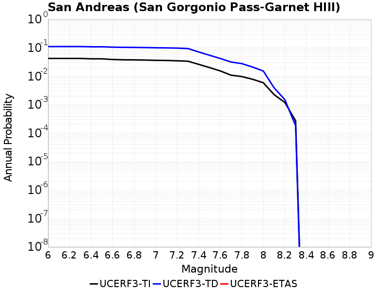 |
|-----|

| Magnitude | UCERF3-TI Prob | UCERF3-TD Prob | UCERF3-ETAS Prob |
|-----|-----|-----|-----|
| 6.0 | 0.042463828 | 0.111240424 | 0.0 |
| 6.1 | 0.042463828 | 0.111240424 | 0.0 |
| 6.2 | 0.042463828 | 0.111240424 | 0.0 |
| 6.3 | 0.042463828 | 0.111240424 | 0.0 |
| 6.4 | 0.041180745 | 0.109226406 | 0.0 |
| 6.5 | 0.041180745 | 0.109226406 | 0.0 |
| 6.6 | 0.03897764 | 0.10577075 | 0.0 |
| 6.7 | 0.038081564 | 0.10428034 | 0.0 |
| 6.8 | 0.03774495 | 0.103582904 | 0.0 |
| 6.9 | 0.037253562 | 0.10253245 | 0.0 |
| 7.0 | 0.03638325 | 0.10063885 | 0.0 |
| 7.1 | 0.036010686 | 0.09988409 | 0.0 |
| 7.2 | 0.035111405 | 0.098080255 | 0.0 |
| 7.3 | 0.033966612 | 0.09459087 | 0.0 |
| 7.4 | 0.02628654 | 0.07171577 | 0.0 |
| 7.5 | 0.020299247 | 0.055011384 | 0.0 |
| 7.6 | 0.0154556995 | 0.04229244 | 0.0 |
| 7.7 | 0.010967582 | 0.03177506 | 0.0 |
| 7.8 | 0.0097791655 | 0.027949948 | 0.0 |
| 7.9 | 0.007877152 | 0.021136278 | 0.0 |
| 8.0 | 0.005933798 | 0.015295707 | 0.0 |
| 8.1 | 0.0022677942 | 0.0039305473 | 0.0 |
| 8.2 | 0.0012016051 | 0.0015074589 | 0.0 |
| 8.3 | 2.7144665E-4 | 1.8165202E-4 | 0.0 |

## San Andreas (Santa Cruz Mts) 2011 CFM
*[(top)](#table-of-contents)*

| 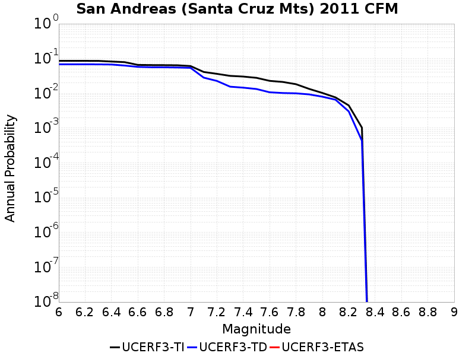 |
|-----|

| Magnitude | UCERF3-TI Prob | UCERF3-TD Prob | UCERF3-ETAS Prob |
|-----|-----|-----|-----|
| 6.0 | 0.08594794 | 0.06846155 | 0.0 |
| 6.1 | 0.08594794 | 0.06846155 | 0.0 |
| 6.2 | 0.08594794 | 0.06846155 | 0.0 |
| 6.3 | 0.08569809 | 0.06807724 | 0.0 |
| 6.4 | 0.08198654 | 0.067374 | 0.0 |
| 6.5 | 0.078865945 | 0.062890984 | 0.0 |
| 6.6 | 0.0657725 | 0.057570312 | 0.0 |
| 6.7 | 0.06494093 | 0.05629148 | 0.0 |
| 6.8 | 0.06461738 | 0.056007847 | 0.0 |
| 6.9 | 0.06408122 | 0.055284683 | 0.0 |
| 7.0 | 0.06084648 | 0.053991776 | 0.0 |
| 7.1 | 0.041133516 | 0.028253883 | 0.0 |
| 7.2 | 0.03633994 | 0.022723492 | 0.0 |
| 7.3 | 0.031802133 | 0.01554279 | 0.0 |
| 7.4 | 0.030350044 | 0.014558755 | 0.0 |
| 7.5 | 0.027907165 | 0.013314788 | 0.0 |
| 7.6 | 0.022854783 | 0.010723964 | 0.0 |
| 7.7 | 0.021258866 | 0.010209797 | 0.0 |
| 7.8 | 0.018306552 | 0.010008123 | 0.0 |
| 7.9 | 0.013403354 | 0.009322354 | 0.0 |
| 8.0 | 0.010266567 | 0.008005545 | 0.0 |
| 8.1 | 0.0076331664 | 0.0065526357 | 0.0 |
| 8.2 | 0.004497249 | 0.0030236659 | 0.0 |
| 8.3 | 0.0010342124 | 4.3275798E-4 | 0.0 |

## San Cayetano
*[(top)](#table-of-contents)*

| 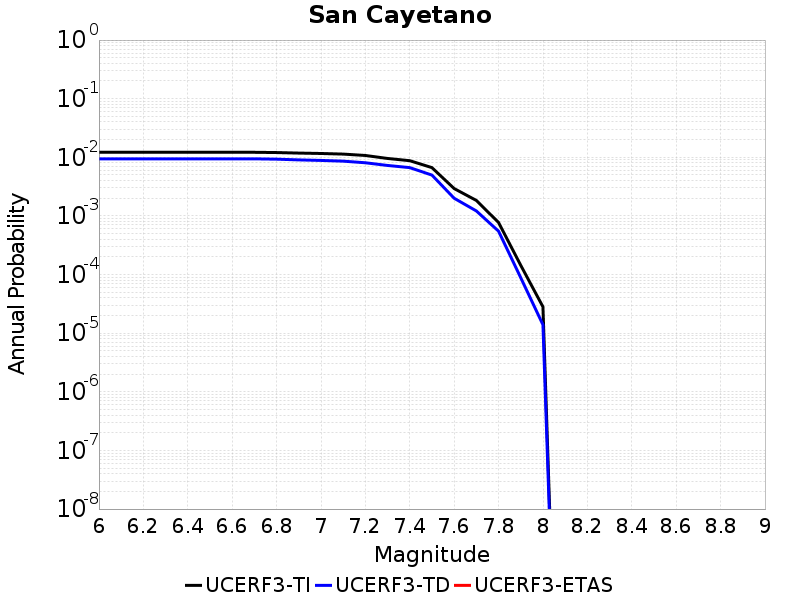 |
|-----|

| Magnitude | UCERF3-TI Prob | UCERF3-TD Prob | UCERF3-ETAS Prob |
|-----|-----|-----|-----|
| 6.0 | 0.012175002 | 0.009417152 | 0.0 |
| 6.1 | 0.012175002 | 0.009417152 | 0.0 |
| 6.2 | 0.012175002 | 0.009417152 | 0.0 |
| 6.3 | 0.012175002 | 0.009417152 | 0.0 |
| 6.4 | 0.012175002 | 0.009417152 | 0.0 |
| 6.5 | 0.012175002 | 0.009417152 | 0.0 |
| 6.6 | 0.012175002 | 0.009417152 | 0.0 |
| 6.7 | 0.012175002 | 0.009417152 | 0.0 |
| 6.8 | 0.012054204 | 0.009297327 | 0.0 |
| 6.9 | 0.011806256 | 0.009036982 | 0.0 |
| 7.0 | 0.011621549 | 0.008847841 | 0.0 |
| 7.1 | 0.011347309 | 0.008599945 | 0.0 |
| 7.2 | 0.010750249 | 0.008072346 | 0.0 |
| 7.3 | 0.009559342 | 0.0072624874 | 0.0 |
| 7.4 | 0.00875714 | 0.0066695223 | 0.0 |
| 7.5 | 0.006668452 | 0.0049753007 | 0.0 |
| 7.6 | 0.0029319301 | 0.0020039652 | 0.0 |
| 7.7 | 0.0018381984 | 0.0012167967 | 0.0 |
| 7.8 | 7.733494E-4 | 5.4973323E-4 | 0.0 |
| 7.9 | 1.4383643E-4 | 8.835681E-5 | 0.0 |
| 8.0 | 2.8216898E-5 | 1.3947291E-5 | 0.0 |

## San Clemente
*[(top)](#table-of-contents)*

|  |
|-----|

| Magnitude | UCERF3-TI Prob | UCERF3-TD Prob | UCERF3-ETAS Prob |
|-----|-----|-----|-----|
| 6.0 | 0.03426291 | 0.04166173 | 0.0 |
| 6.1 | 0.03426291 | 0.04166173 | 0.0 |
| 6.2 | 0.020349167 | 0.023908442 | 0.0 |
| 6.3 | 0.01686163 | 0.019566534 | 0.0 |
| 6.4 | 0.015251739 | 0.017608594 | 0.0 |
| 6.5 | 0.014456868 | 0.016661532 | 0.0 |
| 6.6 | 0.011667615 | 0.013334248 | 0.0 |
| 6.7 | 0.010310682 | 0.011741463 | 0.0 |
| 6.8 | 0.008674784 | 0.009840561 | 0.0 |
| 6.9 | 0.007909367 | 0.008958922 | 0.0 |
| 7.0 | 0.0064456454 | 0.0072863214 | 0.0 |
| 7.1 | 0.0056890585 | 0.0064283796 | 0.0 |
| 7.2 | 0.0049861963 | 0.0056358106 | 0.0 |
| 7.3 | 0.0041742986 | 0.0047228793 | 0.0 |
| 7.4 | 0.001542307 | 0.0017509572 | 0.0 |

## San Diego Trough north alt1
*[(top)](#table-of-contents)*

|  |
|-----|

| Magnitude | UCERF3-TI Prob | UCERF3-TD Prob | UCERF3-ETAS Prob |
|-----|-----|-----|-----|
| 6.0 | 0.03752231 | 0.04495125 | 0.0 |
| 6.1 | 0.019602431 | 0.023112558 | 0.0 |
| 6.2 | 0.0148357535 | 0.01719699 | 0.0 |
| 6.3 | 0.0148357535 | 0.01719699 | 0.0 |
| 6.4 | 0.011519298 | 0.013171785 | 0.0 |
| 6.5 | 0.010900296 | 0.0124398405 | 0.0 |
| 6.6 | 0.009454516 | 0.010730565 | 0.0 |
| 6.7 | 0.008254109 | 0.009327182 | 0.0 |
| 6.8 | 0.0074499645 | 0.008406646 | 0.0 |
| 6.9 | 0.0065396037 | 0.0073751784 | 0.0 |
| 7.0 | 0.00566297 | 0.006383354 | 0.0 |
| 7.1 | 0.0048892107 | 0.005511945 | 0.0 |
| 7.2 | 0.0042647356 | 0.0048128776 | 0.0 |
| 7.3 | 0.003265305 | 0.003687463 | 0.0 |
| 7.4 | 0.002597825 | 0.0029359271 | 0.0 |
| 7.5 | 9.1216754E-4 | 0.0010258782 | 0.0 |
| 7.6 | 8.8640954E-5 | 9.1454385E-5 | 0.0 |

## San Diego Trough south
*[(top)](#table-of-contents)*

| 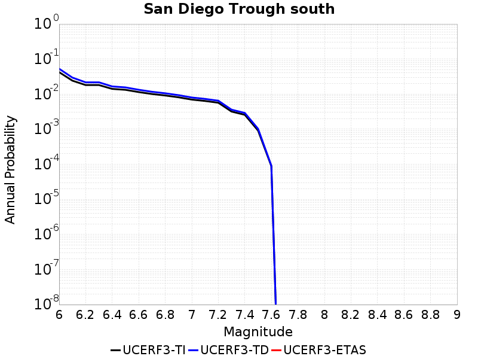 |
|-----|

| Magnitude | UCERF3-TI Prob | UCERF3-TD Prob | UCERF3-ETAS Prob |
|-----|-----|-----|-----|
| 6.0 | 0.042283054 | 0.05285947 | 0.0 |
| 6.1 | 0.024206603 | 0.029610844 | 0.0 |
| 6.2 | 0.018137876 | 0.021706017 | 0.0 |
| 6.3 | 0.018137876 | 0.021706017 | 0.0 |
| 6.4 | 0.014090929 | 0.01657361 | 0.0 |
| 6.5 | 0.013261181 | 0.015556689 | 0.0 |
| 6.6 | 0.011431668 | 0.013319921 | 0.0 |
| 6.7 | 0.01006902 | 0.011673977 | 0.0 |
| 6.8 | 0.009149387 | 0.010572723 | 0.0 |
| 6.9 | 0.008117969 | 0.009347118 | 0.0 |
| 7.0 | 0.006990582 | 0.008016082 | 0.0 |
| 7.1 | 0.0063810493 | 0.0073053264 | 0.0 |
| 7.2 | 0.0056831064 | 0.0064985524 | 0.0 |
| 7.3 | 0.0031833951 | 0.003603888 | 0.0 |
| 7.4 | 0.002570763 | 0.0029082922 | 0.0 |
| 7.5 | 9.1216754E-4 | 0.0010258782 | 0.0 |
| 7.6 | 8.8640954E-5 | 9.1454385E-5 | 0.0 |

## San Gabriel
*[(top)](#table-of-contents)*

| 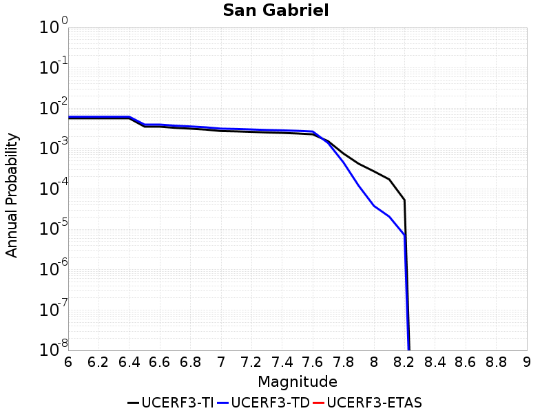 |
|-----|

| Magnitude | UCERF3-TI Prob | UCERF3-TD Prob | UCERF3-ETAS Prob |
|-----|-----|-----|-----|
| 6.0 | 0.0056390543 | 0.0061596315 | 0.0 |
| 6.1 | 0.0056390543 | 0.0061596315 | 0.0 |
| 6.2 | 0.0056390543 | 0.0061596315 | 0.0 |
| 6.3 | 0.0056390543 | 0.0061596315 | 0.0 |
| 6.4 | 0.0056390543 | 0.0061596315 | 0.0 |
| 6.5 | 0.003506398 | 0.0039435555 | 0.0 |
| 6.6 | 0.003506398 | 0.0039435555 | 0.0 |
| 6.7 | 0.0032687993 | 0.0036987606 | 0.0 |
| 6.8 | 0.003123856 | 0.003549449 | 0.0 |
| 6.9 | 0.0029626573 | 0.003375621 | 0.0 |
| 7.0 | 0.002726779 | 0.003128199 | 0.0 |
| 7.1 | 0.0026761394 | 0.0030712718 | 0.0 |
| 7.2 | 0.0025998424 | 0.0029849838 | 0.0 |
| 7.3 | 0.0025128627 | 0.0028976921 | 0.0 |
| 7.4 | 0.002455556 | 0.002840022 | 0.0 |
| 7.5 | 0.002371655 | 0.0027600091 | 0.0 |
| 7.6 | 0.0022638857 | 0.0026529557 | 0.0 |
| 7.7 | 0.0015309147 | 0.0013819399 | 0.0 |
| 7.8 | 7.584747E-4 | 4.5801396E-4 | 0.0 |
| 7.9 | 4.2250296E-4 | 1.203316E-4 | 0.0 |
| 8.0 | 2.7376044E-4 | 3.804712E-5 | 0.0 |
| 8.1 | 1.7302166E-4 | 2.0661872E-5 | 0.0 |
| 8.2 | 5.3405143E-5 | 7.187991E-6 | 0.0 |

## San Gabriel (Extension)
*[(top)](#table-of-contents)*

|  |
|-----|

| Magnitude | UCERF3-TI Prob | UCERF3-TD Prob | UCERF3-ETAS Prob |
|-----|-----|-----|-----|
| 6.0 | 0.0029430336 | 0.0029656957 | 0.0 |
| 6.1 | 0.0029430336 | 0.0029656957 | 0.0 |
| 6.2 | 0.0029430336 | 0.0029656957 | 0.0 |
| 6.3 | 0.0029430336 | 0.0029656957 | 0.0 |
| 6.4 | 0.0029430336 | 0.0029656957 | 0.0 |
| 6.5 | 0.0024563975 | 0.0024649065 | 0.0 |
| 6.6 | 0.0024563975 | 0.0024649065 | 0.0 |
| 6.7 | 0.0022135144 | 0.0022150022 | 0.0 |
| 6.8 | 0.0021464431 | 0.0021459789 | 0.0 |
| 6.9 | 0.0020140803 | 0.0020097569 | 0.0 |
| 7.0 | 0.0019260074 | 0.0019191183 | 0.0 |
| 7.1 | 0.0018603588 | 0.0018500087 | 0.0 |
| 7.2 | 0.001461157 | 0.0014354166 | 0.0 |
| 7.3 | 0.0013475444 | 0.0013152644 | 0.0 |
| 7.4 | 0.0012757082 | 0.0012376369 | 0.0 |
| 7.5 | 0.001064934 | 9.755129E-4 | 0.0 |
| 7.6 | 9.5579936E-4 | 8.4529654E-4 | 0.0 |
| 7.7 | 7.7126746E-4 | 6.441039E-4 | 0.0 |
| 7.8 | 4.0156685E-4 | 3.0892185E-4 | 0.0 |
| 7.9 | 9.206964E-5 | 4.5930505E-5 | 0.0 |
| 8.0 | 5.459536E-5 | 1.2123805E-5 | 0.0 |
| 8.1 | 4.109352E-5 | 6.654176E-6 | 0.0 |
| 8.2 | 6.9482307E-6 | 8.4162053E-7 | 0.0 |

## San Gorgonio Pass
*[(top)](#table-of-contents)*

| 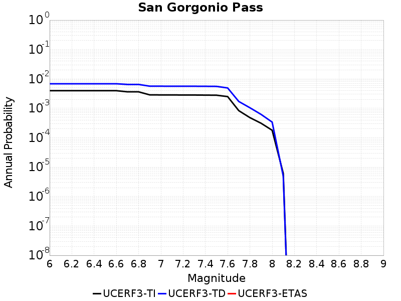 |
|-----|

| Magnitude | UCERF3-TI Prob | UCERF3-TD Prob | UCERF3-ETAS Prob |
|-----|-----|-----|-----|
| 6.0 | 0.003980772 | 0.0068459357 | 0.0 |
| 6.1 | 0.003980772 | 0.0068459357 | 0.0 |
| 6.2 | 0.003980772 | 0.0068459357 | 0.0 |
| 6.3 | 0.003980772 | 0.0068459357 | 0.0 |
| 6.4 | 0.003980772 | 0.0068459357 | 0.0 |
| 6.5 | 0.003980772 | 0.0068459357 | 0.0 |
| 6.6 | 0.003980772 | 0.0068459357 | 0.0 |
| 6.7 | 0.0036393967 | 0.0064855046 | 0.0 |
| 6.8 | 0.0036393967 | 0.0064855046 | 0.0 |
| 6.9 | 0.0028681618 | 0.005671883 | 0.0 |
| 7.0 | 0.00285665 | 0.0056596166 | 0.0 |
| 7.1 | 0.0028497311 | 0.0056522083 | 0.0 |
| 7.2 | 0.002841605 | 0.0056434097 | 0.0 |
| 7.3 | 0.0028356577 | 0.005636643 | 0.0 |
| 7.4 | 0.0028129534 | 0.005609404 | 0.0 |
| 7.5 | 0.002791768 | 0.0055716056 | 0.0 |
| 7.6 | 0.0025062046 | 0.0049268776 | 0.0 |
| 7.7 | 8.340483E-4 | 0.0017109228 | 0.0 |
| 7.8 | 4.8297356E-4 | 0.0010470157 | 0.0 |
| 7.9 | 3.1174847E-4 | 6.234027E-4 | 0.0 |
| 8.0 | 1.7954981E-4 | 3.400283E-4 | 0.0 |
| 8.1 | 6.1506507E-6 | 4.8888332E-6 | 0.0 |

## San Gregorio (North) 2011 CFM
*[(top)](#table-of-contents)*

|  |
|-----|

| Magnitude | UCERF3-TI Prob | UCERF3-TD Prob | UCERF3-ETAS Prob |
|-----|-----|-----|-----|
| 6.0 | 0.02589687 | 0.022145784 | 0.0 |
| 6.1 | 0.02589687 | 0.022145784 | 0.0 |
| 6.2 | 0.022186736 | 0.017751174 | 0.0 |
| 6.3 | 0.022186736 | 0.017751174 | 0.0 |
| 6.4 | 0.02121817 | 0.016669959 | 0.0 |
| 6.5 | 0.021183075 | 0.016627993 | 0.0 |
| 6.6 | 0.020714961 | 0.016127482 | 0.0 |
| 6.7 | 0.019931622 | 0.015198941 | 0.0 |
| 6.8 | 0.017807078 | 0.01263089 | 0.0 |
| 6.9 | 0.01666756 | 0.011256007 | 0.0 |
| 7.0 | 0.015114053 | 0.009385112 | 0.0 |
| 7.1 | 0.013907375 | 0.00790795 | 0.0 |
| 7.2 | 0.012718005 | 0.0065221596 | 0.0 |
| 7.3 | 0.012099981 | 0.0059444867 | 0.0 |
| 7.4 | 0.011484168 | 0.005366655 | 0.0 |
| 7.5 | 0.010895205 | 0.0048805987 | 0.0 |
| 7.6 | 0.008878695 | 0.0035760945 | 0.0 |
| 7.7 | 0.006642225 | 0.0020879535 | 0.0 |
| 7.8 | 0.0036676454 | 0.0010076356 | 0.0 |
| 7.9 | 0.0015364023 | 5.1654596E-4 | 0.0 |
| 8.0 | 5.963996E-4 | 2.6422E-4 | 0.0 |
| 8.1 | 1.391782E-4 | 8.2655744E-5 | 0.0 |
| 8.2 | 6.629041E-6 | 4.7790904E-6 | 0.0 |

## San Gregorio (South) 2011 CFM
*[(top)](#table-of-contents)*

|  |
|-----|

| Magnitude | UCERF3-TI Prob | UCERF3-TD Prob | UCERF3-ETAS Prob |
|-----|-----|-----|-----|
| 6.0 | 0.009746423 | 0.0084365895 | 0.0 |
| 6.1 | 0.009746423 | 0.0084365895 | 0.0 |
| 6.2 | 0.00909426 | 0.0077226944 | 0.0 |
| 6.3 | 0.00909426 | 0.0077226944 | 0.0 |
| 6.4 | 0.008316261 | 0.006868583 | 0.0 |
| 6.5 | 0.008316261 | 0.006868583 | 0.0 |
| 6.6 | 0.008025207 | 0.0065499377 | 0.0 |
| 6.7 | 0.0077441116 | 0.0062435474 | 0.0 |
| 6.8 | 0.0072142133 | 0.005662621 | 0.0 |
| 6.9 | 0.0069635725 | 0.005388637 | 0.0 |
| 7.0 | 0.006660442 | 0.0050567347 | 0.0 |
| 7.1 | 0.0063411663 | 0.004698334 | 0.0 |
| 7.2 | 0.0061223423 | 0.004449483 | 0.0 |
| 7.3 | 0.0059845424 | 0.004302105 | 0.0 |
| 7.4 | 0.005853653 | 0.0041703037 | 0.0 |
| 7.5 | 0.0055141128 | 0.003833764 | 0.0 |
| 7.6 | 0.004694739 | 0.0030265576 | 0.0 |
| 7.7 | 0.003252473 | 0.0016794266 | 0.0 |
| 7.8 | 0.0016653005 | 7.149625E-4 | 0.0 |
| 7.9 | 0.0010481571 | 3.5739696E-4 | 0.0 |
| 8.0 | 4.3575902E-4 | 1.6242222E-4 | 0.0 |
| 8.1 | 7.843835E-5 | 3.3389373E-5 | 0.0 |

## San Jacinto (Anza) rev
*[(top)](#table-of-contents)*

| 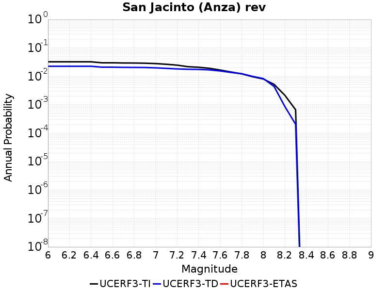 |
|-----|

| Magnitude | UCERF3-TI Prob | UCERF3-TD Prob | UCERF3-ETAS Prob |
|-----|-----|-----|-----|
| 6.0 | 0.032346968 | 0.02259011 | 0.0 |
| 6.1 | 0.032346968 | 0.02259011 | 0.0 |
| 6.2 | 0.032346968 | 0.02259011 | 0.0 |
| 6.3 | 0.032346968 | 0.02259011 | 0.0 |
| 6.4 | 0.032346968 | 0.02259011 | 0.0 |
| 6.5 | 0.02986684 | 0.020921005 | 0.0 |
| 6.6 | 0.02986684 | 0.020921005 | 0.0 |
| 6.7 | 0.029367693 | 0.02061993 | 0.0 |
| 6.8 | 0.029288229 | 0.020545883 | 0.0 |
| 6.9 | 0.028905109 | 0.02039068 | 0.0 |
| 7.0 | 0.027978465 | 0.019796936 | 0.0 |
| 7.1 | 0.026460782 | 0.018993752 | 0.0 |
| 7.2 | 0.024660049 | 0.018133417 | 0.0 |
| 7.3 | 0.02175019 | 0.017658567 | 0.0 |
| 7.4 | 0.020790804 | 0.017469231 | 0.0 |
| 7.5 | 0.01909306 | 0.016797885 | 0.0 |
| 7.6 | 0.01656168 | 0.0154031925 | 0.0 |
| 7.7 | 0.014152412 | 0.0136432815 | 0.0 |
| 7.8 | 0.012169928 | 0.012307434 | 0.0 |
| 7.9 | 0.0096645225 | 0.009941388 | 0.0 |
| 8.0 | 0.008034821 | 0.008299916 | 0.0 |
| 8.1 | 0.0051959283 | 0.0043993047 | 0.0 |
| 8.2 | 0.0021488064 | 8.652839E-4 | 0.0 |
| 8.3 | 6.6510175E-4 | 2.058152E-4 | 0.0 |

## San Jacinto (Borrego)
*[(top)](#table-of-contents)*

| 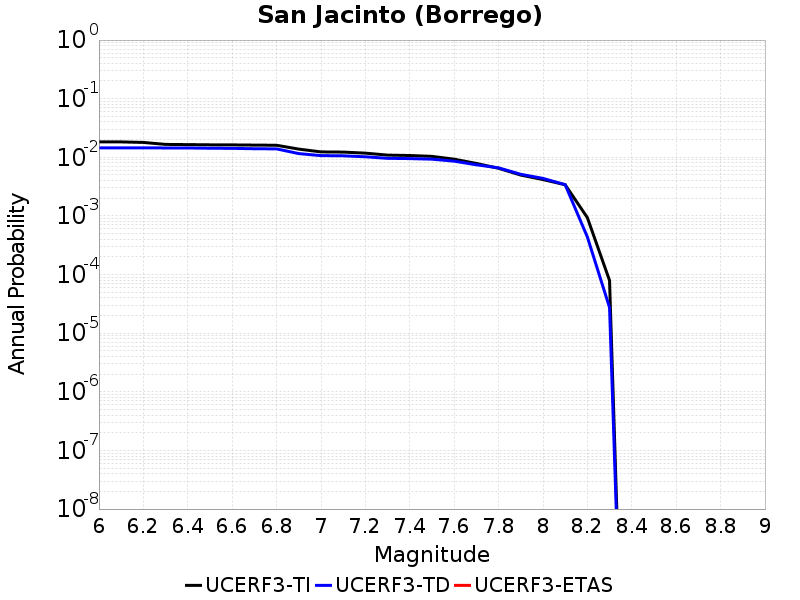 |
|-----|

| Magnitude | UCERF3-TI Prob | UCERF3-TD Prob | UCERF3-ETAS Prob |
|-----|-----|-----|-----|
| 6.0 | 0.018322436 | 0.014517232 | 0.0 |
| 6.1 | 0.018313672 | 0.014517232 | 0.0 |
| 6.2 | 0.017937548 | 0.014517231 | 0.0 |
| 6.3 | 0.016603488 | 0.01443841 | 0.0 |
| 6.4 | 0.016470885 | 0.014421544 | 0.0 |
| 6.5 | 0.0163348 | 0.014288566 | 0.0 |
| 6.6 | 0.016285548 | 0.014209006 | 0.0 |
| 6.7 | 0.01616033 | 0.014014338 | 0.0 |
| 6.8 | 0.016053487 | 0.013922511 | 0.0 |
| 6.9 | 0.0138054015 | 0.011571148 | 0.0 |
| 7.0 | 0.012369866 | 0.0106901685 | 0.0 |
| 7.1 | 0.0122763505 | 0.010605984 | 0.0 |
| 7.2 | 0.01178369 | 0.010207717 | 0.0 |
| 7.3 | 0.010906163 | 0.009608832 | 0.0 |
| 7.4 | 0.010734501 | 0.0095064035 | 0.0 |
| 7.5 | 0.010378438 | 0.009295737 | 0.0 |
| 7.6 | 0.00929122 | 0.008594512 | 0.0 |
| 7.7 | 0.007861412 | 0.0074535976 | 0.0 |
| 7.8 | 0.006501599 | 0.0066180048 | 0.0 |
| 7.9 | 0.0049763937 | 0.0051305857 | 0.0 |
| 8.0 | 0.0041744304 | 0.0043708356 | 0.0 |
| 8.1 | 0.0034076865 | 0.0034150796 | 0.0 |
| 8.2 | 9.371159E-4 | 4.3868448E-4 | 0.0 |
| 8.3 | 7.914075E-5 | 2.7351332E-5 | 0.0 |

## San Jacinto (Clark) rev
*[(top)](#table-of-contents)*

| 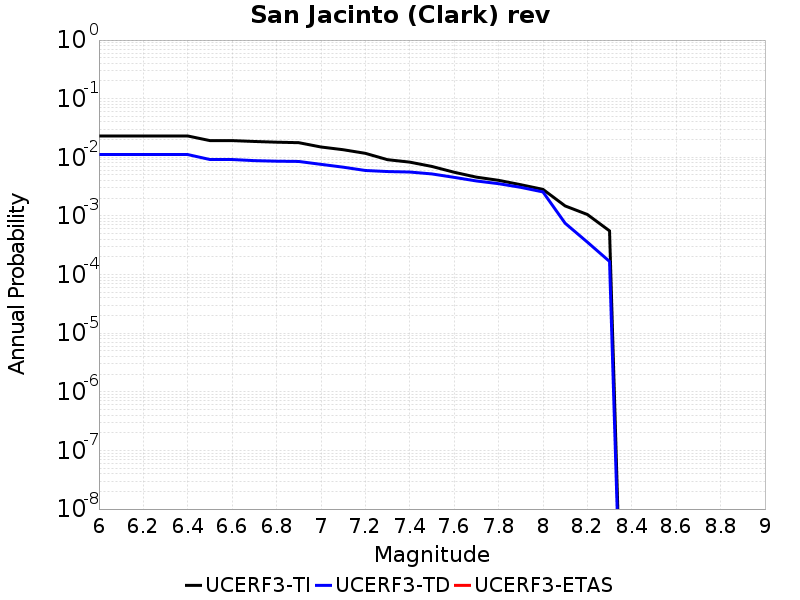 |
|-----|

| Magnitude | UCERF3-TI Prob | UCERF3-TD Prob | UCERF3-ETAS Prob |
|-----|-----|-----|-----|
| 6.0 | 0.02311874 | 0.011142462 | 0.0 |
| 6.1 | 0.02311874 | 0.011142462 | 0.0 |
| 6.2 | 0.02311874 | 0.011142462 | 0.0 |
| 6.3 | 0.02311874 | 0.011142462 | 0.0 |
| 6.4 | 0.02311874 | 0.011142462 | 0.0 |
| 6.5 | 0.01927216 | 0.009169247 | 0.0 |
| 6.6 | 0.01927216 | 0.009169247 | 0.0 |
| 6.7 | 0.01862939 | 0.008777973 | 0.0 |
| 6.8 | 0.01811338 | 0.008583141 | 0.0 |
| 6.9 | 0.017764548 | 0.008494253 | 0.0 |
| 7.0 | 0.014997416 | 0.007587126 | 0.0 |
| 7.1 | 0.013476475 | 0.006789224 | 0.0 |
| 7.2 | 0.011694785 | 0.005960708 | 0.0 |
| 7.3 | 0.009107036 | 0.0057166796 | 0.0 |
| 7.4 | 0.008274844 | 0.005609232 | 0.0 |
| 7.5 | 0.006982579 | 0.005204586 | 0.0 |
| 7.6 | 0.005561762 | 0.0045502675 | 0.0 |
| 7.7 | 0.0045876284 | 0.0039516366 | 0.0 |
| 7.8 | 0.0040515037 | 0.0035499644 | 0.0 |
| 7.9 | 0.0034086495 | 0.0030732527 | 0.0 |
| 8.0 | 0.0028390845 | 0.0025678119 | 0.0 |
| 8.1 | 0.0014806325 | 7.504784E-4 | 0.0 |
| 8.2 | 0.0010587925 | 3.5782205E-4 | 0.0 |
| 8.3 | 5.5605895E-4 | 1.6743355E-4 | 0.0 |

## San Jacinto (Coyote Creek)
*[(top)](#table-of-contents)*

|  |
|-----|

| Magnitude | UCERF3-TI Prob | UCERF3-TD Prob | UCERF3-ETAS Prob |
|-----|-----|-----|-----|
| 6.0 | 0.01418221 | 0.012585399 | 0.0 |
| 6.1 | 0.01418221 | 0.012585399 | 0.0 |
| 6.2 | 0.01418221 | 0.012585399 | 0.0 |
| 6.3 | 0.01418221 | 0.012585399 | 0.0 |
| 6.4 | 0.01418221 | 0.012585399 | 0.0 |
| 6.5 | 0.014134934 | 0.012526851 | 0.0 |
| 6.6 | 0.014134934 | 0.012526851 | 0.0 |
| 6.7 | 0.014100855 | 0.012488345 | 0.0 |
| 6.8 | 0.014030075 | 0.012445669 | 0.0 |
| 6.9 | 0.013980856 | 0.012404208 | 0.0 |
| 7.0 | 0.0137065975 | 0.012186282 | 0.0 |
| 7.1 | 0.013607717 | 0.01209686 | 0.0 |
| 7.2 | 0.013099162 | 0.01168242 | 0.0 |
| 7.3 | 0.012134149 | 0.011027611 | 0.0 |
| 7.4 | 0.011910575 | 0.010887915 | 0.0 |
| 7.5 | 0.011511209 | 0.010640178 | 0.0 |
| 7.6 | 0.010388365 | 0.009905237 | 0.0 |
| 7.7 | 0.008950562 | 0.008755154 | 0.0 |
| 7.8 | 0.0075264242 | 0.007845712 | 0.0 |
| 7.9 | 0.0057826187 | 0.0061178287 | 0.0 |
| 8.0 | 0.0048551033 | 0.0052111563 | 0.0 |
| 8.1 | 0.003658111 | 0.0036106643 | 0.0 |
| 8.2 | 0.001061699 | 4.954998E-4 | 0.0 |
| 8.3 | 1.0461917E-4 | 3.697466E-5 | 0.0 |

## San Jacinto (Lytle Creek connector)
*[(top)](#table-of-contents)*

|  |
|-----|

| Magnitude | UCERF3-TI Prob | UCERF3-TD Prob | UCERF3-ETAS Prob |
|-----|-----|-----|-----|
| 6.0 | 0.00348675 | 0.00343491 | 0.0 |
| 6.1 | 0.00348675 | 0.00343491 | 0.0 |
| 6.2 | 0.00348675 | 0.00343491 | 0.0 |
| 6.3 | 0.00348675 | 0.00343491 | 0.0 |
| 6.4 | 0.00348675 | 0.00343491 | 0.0 |
| 6.5 | 0.0034670907 | 0.0034142344 | 0.0 |
| 6.6 | 0.0034670907 | 0.0034142344 | 0.0 |
| 6.7 | 0.0034275902 | 0.0033722306 | 0.0 |
| 6.8 | 0.0034252026 | 0.0033693712 | 0.0 |
| 6.9 | 0.0034224992 | 0.003364912 | 0.0 |
| 7.0 | 0.0034193532 | 0.0033597935 | 0.0 |
| 7.1 | 0.0034157229 | 0.0033539436 | 0.0 |
| 7.2 | 0.0034099987 | 0.003344607 | 0.0 |
| 7.3 | 0.003404813 | 0.0033347013 | 0.0 |
| 7.4 | 0.0033998888 | 0.0033249715 | 0.0 |
| 7.5 | 0.0033916887 | 0.003312749 | 0.0 |
| 7.6 | 0.0033738504 | 0.0032916565 | 0.0 |
| 7.7 | 0.0032119295 | 0.0031847414 | 0.0 |
| 7.8 | 0.0028679797 | 0.002958306 | 0.0 |
| 7.9 | 0.0020273007 | 0.0021054286 | 0.0 |
| 8.0 | 0.0013914363 | 0.0013132211 | 0.0 |
| 8.1 | 8.298933E-4 | 6.358126E-4 | 0.0 |
| 8.2 | 3.1977732E-4 | 1.17826676E-4 | 0.0 |
| 8.3 | 9.197987E-5 | 2.615857E-5 | 0.0 |

## San Jacinto (San Bernardino)
*[(top)](#table-of-contents)*

|  |
|-----|

| Magnitude | UCERF3-TI Prob | UCERF3-TD Prob | UCERF3-ETAS Prob |
|-----|-----|-----|-----|
| 6.0 | 0.01763251 | 0.018699108 | 0.0 |
| 6.1 | 0.01763251 | 0.018699108 | 0.0 |
| 6.2 | 0.01763251 | 0.018699108 | 0.0 |
| 6.3 | 0.01763251 | 0.018699108 | 0.0 |
| 6.4 | 0.017588645 | 0.018644296 | 0.0 |
| 6.5 | 0.017284546 | 0.01826655 | 0.0 |
| 6.6 | 0.017258976 | 0.018234476 | 0.0 |
| 6.7 | 0.017256035 | 0.01822928 | 0.0 |
| 6.8 | 0.017213784 | 0.018175168 | 0.0 |
| 6.9 | 0.017192734 | 0.018145112 | 0.0 |
| 7.0 | 0.017172894 | 0.01811458 | 0.0 |
| 7.1 | 0.017138338 | 0.018053865 | 0.0 |
| 7.2 | 0.017089253 | 0.017986408 | 0.0 |
| 7.3 | 0.017049557 | 0.017919475 | 0.0 |
| 7.4 | 0.017028693 | 0.017880013 | 0.0 |
| 7.5 | 0.016978411 | 0.017811336 | 0.0 |
| 7.6 | 0.016826328 | 0.017670257 | 0.0 |
| 7.7 | 0.01567979 | 0.016890518 | 0.0 |
| 7.8 | 0.013637724 | 0.015456604 | 0.0 |
| 7.9 | 0.010774517 | 0.012255861 | 0.0 |
| 8.0 | 0.008178596 | 0.008454529 | 0.0 |
| 8.1 | 0.005259227 | 0.004433446 | 0.0 |
| 8.2 | 0.0021834858 | 8.7992783E-4 | 0.0 |
| 8.3 | 6.6548464E-4 | 2.0597292E-4 | 0.0 |

## San Jacinto (San Jacinto Valley) rev
*[(top)](#table-of-contents)*

| 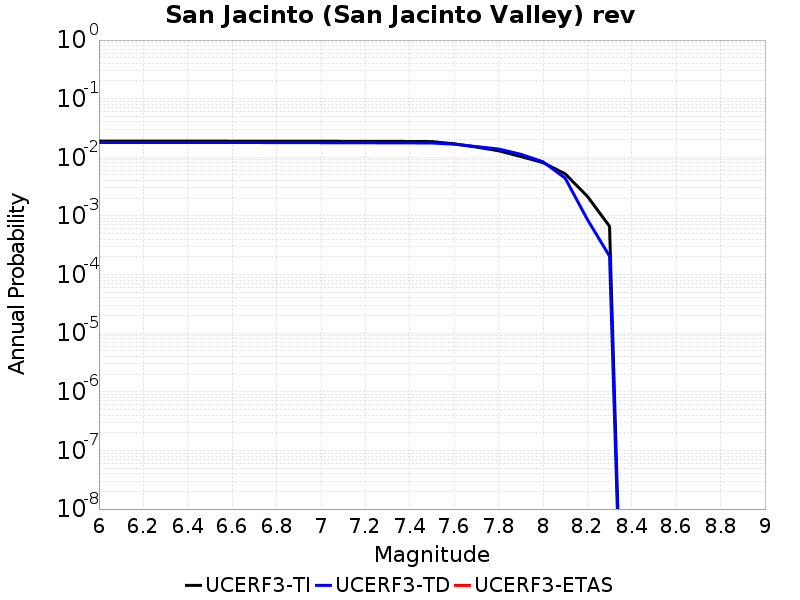 |
|-----|

| Magnitude | UCERF3-TI Prob | UCERF3-TD Prob | UCERF3-ETAS Prob |
|-----|-----|-----|-----|
| 6.0 | 0.018879099 | 0.017920323 | 0.0 |
| 6.1 | 0.018879099 | 0.017920323 | 0.0 |
| 6.2 | 0.018879099 | 0.017920323 | 0.0 |
| 6.3 | 0.018879099 | 0.017920323 | 0.0 |
| 6.4 | 0.018849645 | 0.017880317 | 0.0 |
| 6.5 | 0.018849645 | 0.017880317 | 0.0 |
| 6.6 | 0.018835869 | 0.01786164 | 0.0 |
| 6.7 | 0.018830549 | 0.017854284 | 0.0 |
| 6.8 | 0.018819023 | 0.017838491 | 0.0 |
| 6.9 | 0.018804269 | 0.017818289 | 0.0 |
| 7.0 | 0.018760284 | 0.017758066 | 0.0 |
| 7.1 | 0.018742796 | 0.017735716 | 0.0 |
| 7.2 | 0.01871693 | 0.01770208 | 0.0 |
| 7.3 | 0.018670462 | 0.017644906 | 0.0 |
| 7.4 | 0.018649481 | 0.0176181 | 0.0 |
| 7.5 | 0.018535944 | 0.017520094 | 0.0 |
| 7.6 | 0.017003361 | 0.016750801 | 0.0 |
| 7.7 | 0.014957713 | 0.015251074 | 0.0 |
| 7.8 | 0.012934455 | 0.013855804 | 0.0 |
| 7.9 | 0.010320415 | 0.011276629 | 0.0 |
| 8.0 | 0.00812392 | 0.008402628 | 0.0 |
| 8.1 | 0.0052278144 | 0.004416911 | 0.0 |
| 8.2 | 0.0021659054 | 8.7239273E-4 | 0.0 |
| 8.3 | 6.6548464E-4 | 2.0597292E-4 | 0.0 |

## San Jacinto (Stepovers Combined)
*[(top)](#table-of-contents)*

| 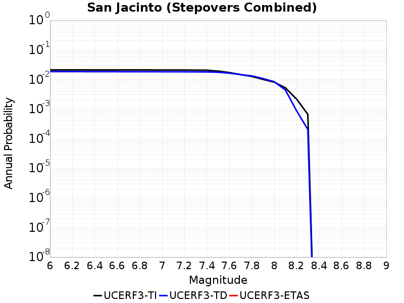 |
|-----|

| Magnitude | UCERF3-TI Prob | UCERF3-TD Prob | UCERF3-ETAS Prob |
|-----|-----|-----|-----|
| 6.0 | 0.020996714 | 0.018384544 | 0.0 |
| 6.1 | 0.020996714 | 0.018384544 | 0.0 |
| 6.2 | 0.020996714 | 0.018384544 | 0.0 |
| 6.3 | 0.020996714 | 0.018384544 | 0.0 |
| 6.4 | 0.020950472 | 0.018319318 | 0.0 |
| 6.5 | 0.020950472 | 0.018319318 | 0.0 |
| 6.6 | 0.020930743 | 0.018291485 | 0.0 |
| 6.7 | 0.020919468 | 0.018275728 | 0.0 |
| 6.8 | 0.020908125 | 0.018261187 | 0.0 |
| 6.9 | 0.020892553 | 0.018242028 | 0.0 |
| 7.0 | 0.02084144 | 0.018180903 | 0.0 |
| 7.1 | 0.020830948 | 0.01816983 | 0.0 |
| 7.2 | 0.020787042 | 0.018120795 | 0.0 |
| 7.3 | 0.020625217 | 0.018030811 | 0.0 |
| 7.4 | 0.020513052 | 0.017970942 | 0.0 |
| 7.5 | 0.019140124 | 0.017482564 | 0.0 |
| 7.6 | 0.01704153 | 0.016329851 | 0.0 |
| 7.7 | 0.014625421 | 0.014559975 | 0.0 |
| 7.8 | 0.012614589 | 0.01318047 | 0.0 |
| 7.9 | 0.0100566605 | 0.010719375 | 0.0 |
| 8.0 | 0.008098091 | 0.008375572 | 0.0 |
| 8.1 | 0.0052172043 | 0.0044116853 | 0.0 |
| 8.2 | 0.0021593217 | 8.698217E-4 | 0.0 |
| 8.3 | 6.6510175E-4 | 2.058152E-4 | 0.0 |

## San Jacinto (Superstition Mtn)
*[(top)](#table-of-contents)*

| 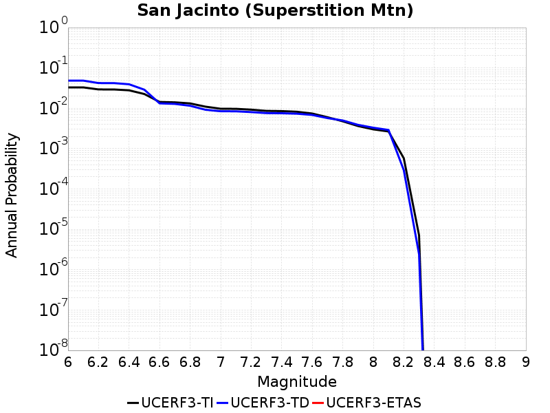 |
|-----|

| Magnitude | UCERF3-TI Prob | UCERF3-TD Prob | UCERF3-ETAS Prob |
|-----|-----|-----|-----|
| 6.0 | 0.03294174 | 0.0484613 | 0.0 |
| 6.1 | 0.03294174 | 0.0484613 | 0.0 |
| 6.2 | 0.029316625 | 0.0421557 | 0.0 |
| 6.3 | 0.029274331 | 0.042079095 | 0.0 |
| 6.4 | 0.02787096 | 0.039370406 | 0.0 |
| 6.5 | 0.022570757 | 0.028896803 | 0.0 |
| 6.6 | 0.014360986 | 0.013241006 | 0.0 |
| 6.7 | 0.014053487 | 0.012838225 | 0.0 |
| 6.8 | 0.0132051185 | 0.011540913 | 0.0 |
| 6.9 | 0.010981417 | 0.009204259 | 0.0 |
| 7.0 | 0.009738087 | 0.008445815 | 0.0 |
| 7.1 | 0.009698939 | 0.008407346 | 0.0 |
| 7.2 | 0.009247236 | 0.008043003 | 0.0 |
| 7.3 | 0.00861587 | 0.007602468 | 0.0 |
| 7.4 | 0.008514405 | 0.007532303 | 0.0 |
| 7.5 | 0.008205604 | 0.007345036 | 0.0 |
| 7.6 | 0.007407237 | 0.0068331445 | 0.0 |
| 7.7 | 0.006005941 | 0.0057144673 | 0.0 |
| 7.8 | 0.0047573727 | 0.0049899383 | 0.0 |
| 7.9 | 0.0036318225 | 0.0038858096 | 0.0 |
| 8.0 | 0.0030029714 | 0.0033016982 | 0.0 |
| 8.1 | 0.0026640517 | 0.0029023462 | 0.0 |
| 8.2 | 5.777599E-4 | 2.925337E-4 | 0.0 |
| 8.3 | 7.0881174E-6 | 2.4191015E-6 | 0.0 |

## San Joaquin Hills
*[(top)](#table-of-contents)*

|  |
|-----|

| Magnitude | UCERF3-TI Prob | UCERF3-TD Prob | UCERF3-ETAS Prob |
|-----|-----|-----|-----|
| 6.0 | 0.0017998833 | 0.0014660405 | 0.0 |
| 6.1 | 0.0017998833 | 0.0014660405 | 0.0 |
| 6.2 | 0.0017998833 | 0.0014660405 | 0.0 |
| 6.3 | 0.0017998833 | 0.0014660405 | 0.0 |
| 6.4 | 0.0017998833 | 0.0014660405 | 0.0 |
| 6.5 | 0.0017998833 | 0.0014660405 | 0.0 |
| 6.6 | 0.0017998833 | 0.0014660405 | 0.0 |
| 6.7 | 0.0017998833 | 0.0014660405 | 0.0 |
| 6.8 | 0.001766592 | 0.0014318896 | 0.0 |
| 6.9 | 0.0017044931 | 0.0013693332 | 0.0 |
| 7.0 | 0.0016927607 | 0.0013582158 | 0.0 |
| 7.1 | 0.0016612876 | 0.0013297336 | 0.0 |
| 7.2 | 0.0015756298 | 0.0012499491 | 0.0 |
| 7.3 | 0.0014534845 | 0.0011553183 | 0.0 |
| 7.4 | 0.0012824474 | 0.0010017299 | 0.0 |
| 7.5 | 0.0010048538 | 7.492956E-4 | 0.0 |
| 7.6 | 6.055767E-4 | 4.24122E-4 | 0.0 |
| 7.7 | 2.6695454E-4 | 1.4156128E-4 | 0.0 |
| 7.8 | 6.05567E-6 | 5.10352E-6 | 0.0 |

## San Jose
*[(top)](#table-of-contents)*

| 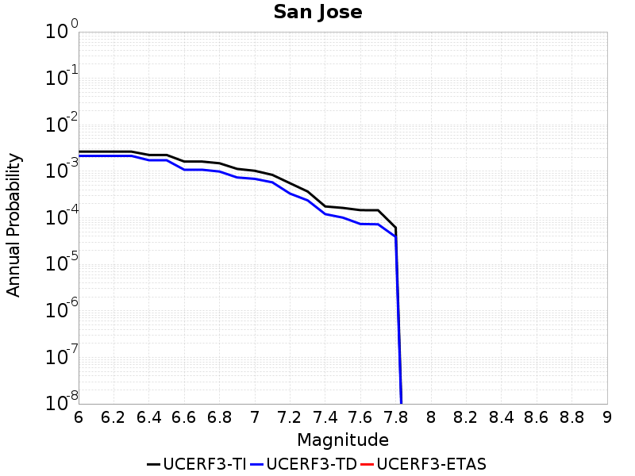 |
|-----|

| Magnitude | UCERF3-TI Prob | UCERF3-TD Prob | UCERF3-ETAS Prob |
|-----|-----|-----|-----|
| 6.0 | 0.0026498367 | 0.0021471018 | 0.0 |
| 6.1 | 0.0026498367 | 0.0021471018 | 0.0 |
| 6.2 | 0.0026498367 | 0.0021471018 | 0.0 |
| 6.3 | 0.0026498367 | 0.0021471018 | 0.0 |
| 6.4 | 0.0022471617 | 0.0017296107 | 0.0 |
| 6.5 | 0.0022471617 | 0.0017296107 | 0.0 |
| 6.6 | 0.0016216465 | 0.0010815564 | 0.0 |
| 6.7 | 0.0016216465 | 0.0010815564 | 0.0 |
| 6.8 | 0.0014894515 | 9.890756E-4 | 0.0 |
| 6.9 | 0.0011273995 | 7.370365E-4 | 0.0 |
| 7.0 | 0.001026573 | 6.8857684E-4 | 0.0 |
| 7.1 | 8.3817646E-4 | 5.791324E-4 | 0.0 |
| 7.2 | 5.545912E-4 | 3.319357E-4 | 0.0 |
| 7.3 | 3.6835007E-4 | 2.373852E-4 | 0.0 |
| 7.4 | 1.7570681E-4 | 1.2008886E-4 | 0.0 |
| 7.5 | 1.6326184E-4 | 1.0096005E-4 | 0.0 |
| 7.6 | 1.4613457E-4 | 7.363876E-5 | 0.0 |
| 7.7 | 1.4531724E-4 | 7.247975E-5 | 0.0 |
| 7.8 | 6.162516E-5 | 3.89088E-5 | 0.0 |

## San Juan
*[(top)](#table-of-contents)*

| 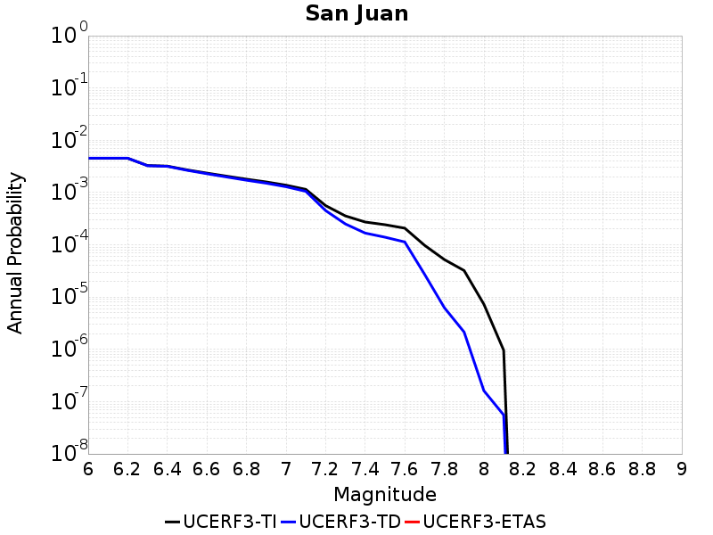 |
|-----|

| Magnitude | UCERF3-TI Prob | UCERF3-TD Prob | UCERF3-ETAS Prob |
|-----|-----|-----|-----|
| 6.0 | 0.004520337 | 0.0045390036 | 0.0 |
| 6.1 | 0.004520337 | 0.0045390036 | 0.0 |
| 6.2 | 0.004520337 | 0.0045390036 | 0.0 |
| 6.3 | 0.003284684 | 0.0032571172 | 0.0 |
| 6.4 | 0.0032033534 | 0.0031718225 | 0.0 |
| 6.5 | 0.0027121378 | 0.002663793 | 0.0 |
| 6.6 | 0.0023546559 | 0.00229117 | 0.0 |
| 6.7 | 0.002055947 | 0.0019822943 | 0.0 |
| 6.8 | 0.0018004322 | 0.001720424 | 0.0 |
| 6.9 | 0.0015953224 | 0.0015101768 | 0.0 |
| 7.0 | 0.0013820052 | 0.0012917649 | 0.0 |
| 7.1 | 0.0011493203 | 0.0010543515 | 0.0 |
| 7.2 | 5.6267687E-4 | 4.5203118E-4 | 0.0 |
| 7.3 | 3.571734E-4 | 2.505411E-4 | 0.0 |
| 7.4 | 2.7287923E-4 | 1.676335E-4 | 0.0 |
| 7.5 | 2.425198E-4 | 1.398489E-4 | 0.0 |
| 7.6 | 2.0820512E-4 | 1.1341791E-4 | 0.0 |
| 7.7 | 9.801057E-5 | 2.736533E-5 | 0.0 |
| 7.8 | 5.225804E-5 | 6.2816152E-6 | 0.0 |
| 7.9 | 3.2201115E-5 | 2.143679E-6 | 0.0 |
| 8.0 | 7.2917055E-6 | 1.6170151E-7 | 0.0 |
| 8.1 | 9.602667E-7 | 5.5491704E-8 | 0.0 |

## San Luis Range - Oceano 2011 CFM
*[(top)](#table-of-contents)*

|  |
|-----|

| Magnitude | UCERF3-TI Prob | UCERF3-TD Prob | UCERF3-ETAS Prob |
|-----|-----|-----|-----|
| 6.0 | 8.3585386E-4 | 8.449469E-4 | 0.0 |
| 6.1 | 8.3585386E-4 | 8.449469E-4 | 0.0 |
| 6.2 | 8.3585386E-4 | 8.449469E-4 | 0.0 |
| 6.3 | 8.3585386E-4 | 8.449469E-4 | 0.0 |
| 6.4 | 6.0619344E-4 | 6.1286363E-4 | 0.0 |
| 6.5 | 6.0619344E-4 | 6.1286363E-4 | 0.0 |
| 6.6 | 3.737756E-4 | 3.781047E-4 | 0.0 |
| 6.7 | 3.737756E-4 | 3.781047E-4 | 0.0 |
| 6.8 | 3.495447E-4 | 3.5353383E-4 | 0.0 |
| 6.9 | 2.9517582E-4 | 2.98476E-4 | 0.0 |
| 7.0 | 2.4043156E-4 | 2.4310315E-4 | 0.0 |
| 7.1 | 2.0440355E-4 | 2.0669414E-4 | 0.0 |
| 7.2 | 1.7725973E-4 | 1.7928203E-4 | 0.0 |
| 7.3 | 1.5078956E-4 | 1.5250896E-4 | 0.0 |
| 7.4 | 1.1416818E-4 | 1.1550033E-4 | 0.0 |
| 7.5 | 7.077241E-5 | 7.157079E-5 | 0.0 |
| 7.6 | 3.0925385E-5 | 3.1309643E-5 | 0.0 |
| 7.7 | 3.102654E-6 | 3.1494712E-6 | 0.0 |

## San Luis Range - Pecho 2011 CFM
*[(top)](#table-of-contents)*

| 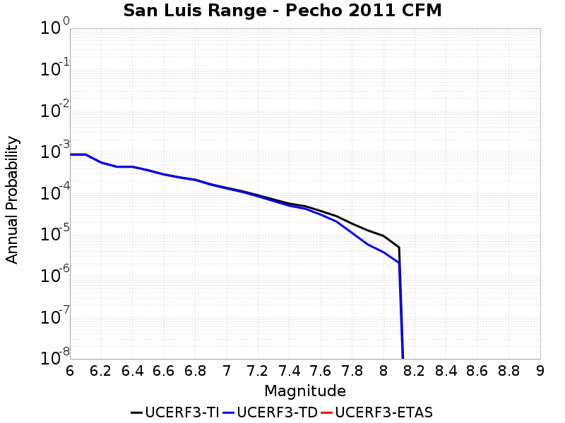 |
|-----|

| Magnitude | UCERF3-TI Prob | UCERF3-TD Prob | UCERF3-ETAS Prob |
|-----|-----|-----|-----|
| 6.0 | 8.8008645E-4 | 8.823873E-4 | 0.0 |
| 6.1 | 8.8008645E-4 | 8.823873E-4 | 0.0 |
| 6.2 | 5.6157995E-4 | 5.6165113E-4 | 0.0 |
| 6.3 | 4.4462472E-4 | 4.4392096E-4 | 0.0 |
| 6.4 | 4.4462472E-4 | 4.4392096E-4 | 0.0 |
| 6.5 | 3.653368E-4 | 3.637839E-4 | 0.0 |
| 6.6 | 2.9131788E-4 | 2.890116E-4 | 0.0 |
| 6.7 | 2.470043E-4 | 2.4416766E-4 | 0.0 |
| 6.8 | 2.1634075E-4 | 2.1311834E-4 | 0.0 |
| 6.9 | 1.67253E-4 | 1.633117E-4 | 0.0 |
| 7.0 | 1.3730342E-4 | 1.3285129E-4 | 0.0 |
| 7.1 | 1.1391206E-4 | 1.09001136E-4 | 0.0 |
| 7.2 | 9.075015E-5 | 8.531622E-5 | 0.0 |
| 7.3 | 7.171632E-5 | 6.581849E-5 | 0.0 |
| 7.4 | 5.6952744E-5 | 5.0634302E-5 | 0.0 |
| 7.5 | 4.951776E-5 | 4.296486E-5 | 0.0 |
| 7.6 | 3.7863592E-5 | 3.0892614E-5 | 0.0 |
| 7.7 | 2.8417471E-5 | 2.1063543E-5 | 0.0 |
| 7.8 | 1.8706294E-5 | 1.112352E-5 | 0.0 |
| 7.9 | 1.2829532E-5 | 5.8503456E-6 | 0.0 |
| 8.0 | 9.471285E-6 | 3.8058342E-6 | 0.0 |
| 8.1 | 4.987844E-6 | 2.0999225E-6 | 0.0 |

## San Luis Range 2011 CFM
*[(top)](#table-of-contents)*

|  |
|-----|

| Magnitude | UCERF3-TI Prob | UCERF3-TD Prob | UCERF3-ETAS Prob |
|-----|-----|-----|-----|
| 6.0 | 0.0046003438 | 0.004667011 | 0.0 |
| 6.1 | 0.0046003438 | 0.004667011 | 0.0 |
| 6.2 | 0.0046003438 | 0.004667011 | 0.0 |
| 6.3 | 0.0046003438 | 0.004667011 | 0.0 |
| 6.4 | 0.0020378039 | 0.0020539346 | 0.0 |
| 6.5 | 0.0020378039 | 0.0020539346 | 0.0 |
| 6.6 | 0.0015947534 | 0.0016030554 | 0.0 |
| 6.7 | 0.0013640919 | 0.0013684996 | 0.0 |
| 6.8 | 0.0013093639 | 0.0013127605 | 0.0 |
| 6.9 | 9.68196E-4 | 9.658843E-4 | 0.0 |
| 7.0 | 8.0642226E-4 | 8.014163E-4 | 0.0 |
| 7.1 | 6.972912E-4 | 6.901617E-4 | 0.0 |
| 7.2 | 5.5415864E-4 | 5.45174E-4 | 0.0 |
| 7.3 | 4.0856248E-4 | 4.0298104E-4 | 0.0 |
| 7.4 | 3.1072134E-4 | 3.082469E-4 | 0.0 |
| 7.5 | 2.1712543E-4 | 2.1484015E-4 | 0.0 |
| 7.6 | 1.2426086E-4 | 1.2189782E-4 | 0.0 |
| 7.7 | 5.1753424E-5 | 4.892535E-5 | 0.0 |
| 7.8 | 1.8253233E-5 | 1.5448733E-5 | 0.0 |
| 7.9 | 8.674601E-6 | 5.9548897E-6 | 0.0 |
| 8.0 | 3.3056278E-6 | 1.5909887E-6 | 0.0 |

## San Pedro Basin
*[(top)](#table-of-contents)*

|  |
|-----|

| Magnitude | UCERF3-TI Prob | UCERF3-TD Prob | UCERF3-ETAS Prob |
|-----|-----|-----|-----|
| 6.0 | 0.027504366 | 0.0325266 | 0.0 |
| 6.1 | 0.027504366 | 0.0325266 | 0.0 |
| 6.2 | 0.012027155 | 0.013789135 | 0.0 |
| 6.3 | 0.012027155 | 0.013789135 | 0.0 |
| 6.4 | 0.010206259 | 0.011639467 | 0.0 |
| 6.5 | 0.009008561 | 0.010238791 | 0.0 |
| 6.6 | 0.0074845953 | 0.008472161 | 0.0 |
| 6.7 | 0.006571059 | 0.0074190297 | 0.0 |
| 6.8 | 0.0059623276 | 0.0067195296 | 0.0 |
| 6.9 | 0.0047417083 | 0.005322079 | 0.0 |
| 7.0 | 0.0030920706 | 0.0034278356 | 0.0 |
| 7.1 | 0.0011242128 | 0.0011517964 | 0.0 |
| 7.2 | 0.0011082845 | 0.0011353049 | 0.0 |
| 7.3 | 8.9424395E-4 | 9.0935983E-4 | 0.0 |
| 7.4 | 7.546349E-4 | 7.6339766E-4 | 0.0 |
| 7.5 | 6.678579E-4 | 6.742533E-4 | 0.0 |
| 7.6 | 3.5240475E-4 | 3.5301998E-4 | 0.0 |
| 7.7 | 3.2412205E-5 | 2.3831482E-5 | 0.0 |
| 7.8 | 1.3869354E-6 | 7.8776003E-7 | 0.0 |

## San Pedro Escarpment
*[(top)](#table-of-contents)*

| 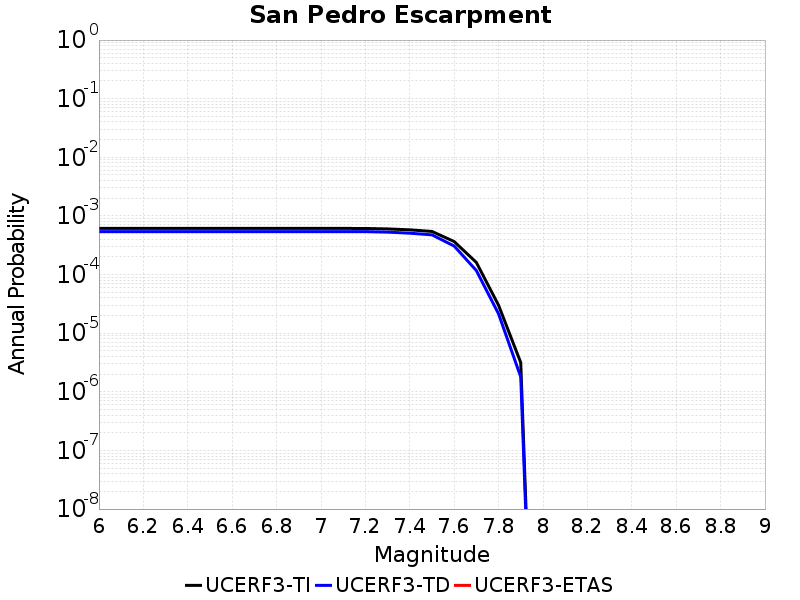 |
|-----|

| Magnitude | UCERF3-TI Prob | UCERF3-TD Prob | UCERF3-ETAS Prob |
|-----|-----|-----|-----|
| 6.0 | 6.124038E-4 | 5.413138E-4 | 0.0 |
| 6.1 | 6.124038E-4 | 5.413138E-4 | 0.0 |
| 6.2 | 6.124038E-4 | 5.413138E-4 | 0.0 |
| 6.3 | 6.124038E-4 | 5.413138E-4 | 0.0 |
| 6.4 | 6.124038E-4 | 5.413138E-4 | 0.0 |
| 6.5 | 6.124038E-4 | 5.413138E-4 | 0.0 |
| 6.6 | 6.124038E-4 | 5.413138E-4 | 0.0 |
| 6.7 | 6.124038E-4 | 5.413138E-4 | 0.0 |
| 6.8 | 6.124038E-4 | 5.413138E-4 | 0.0 |
| 6.9 | 6.124038E-4 | 5.413138E-4 | 0.0 |
| 7.0 | 6.124038E-4 | 5.413138E-4 | 0.0 |
| 7.1 | 6.124038E-4 | 5.413138E-4 | 0.0 |
| 7.2 | 6.114669E-4 | 5.4036855E-4 | 0.0 |
| 7.3 | 6.0066837E-4 | 5.294567E-4 | 0.0 |
| 7.4 | 5.792044E-4 | 5.07743E-4 | 0.0 |
| 7.5 | 5.438344E-4 | 4.755442E-4 | 0.0 |
| 7.6 | 3.661442E-4 | 3.0698438E-4 | 0.0 |
| 7.7 | 1.6106942E-4 | 1.170934E-4 | 0.0 |
| 7.8 | 3.0008836E-5 | 2.1399594E-5 | 0.0 |
| 7.9 | 3.1516086E-6 | 1.7961822E-6 | 0.0 |

## San Vicente
*[(top)](#table-of-contents)*

|  |
|-----|

| Magnitude | UCERF3-TI Prob | UCERF3-TD Prob | UCERF3-ETAS Prob |
|-----|-----|-----|-----|
| 6.0 | 2.1313342E-4 | 2.0164975E-4 | 0.0 |
| 6.1 | 2.1313342E-4 | 2.0164975E-4 | 0.0 |
| 6.2 | 2.0452376E-4 | 1.9301362E-4 | 0.0 |
| 6.3 | 2.0452376E-4 | 1.9301362E-4 | 0.0 |
| 6.4 | 1.6841863E-4 | 1.5675664E-4 | 0.0 |
| 6.5 | 1.6841863E-4 | 1.5675664E-4 | 0.0 |
| 6.6 | 1.6681894E-4 | 1.551517E-4 | 0.0 |
| 6.7 | 1.6091186E-4 | 1.4920479E-4 | 0.0 |
| 6.8 | 1.5043007E-4 | 1.3862956E-4 | 0.0 |
| 6.9 | 1.3913128E-4 | 1.2721766E-4 | 0.0 |
| 7.0 | 1.238306E-4 | 1.11848836E-4 | 0.0 |
| 7.1 | 1.1080493E-4 | 9.878251E-5 | 0.0 |
| 7.2 | 9.519454E-5 | 8.314708E-5 | 0.0 |
| 7.3 | 8.410499E-5 | 7.300835E-5 | 0.0 |
| 7.4 | 7.382432E-5 | 6.406429E-5 | 0.0 |
| 7.5 | 5.5877994E-5 | 4.8105157E-5 | 0.0 |
| 7.6 | 3.520289E-5 | 2.859026E-5 | 0.0 |
| 7.7 | 1.5100502E-5 | 1.0025081E-5 | 0.0 |
| 7.8 | 5.2968703E-6 | 3.301239E-6 | 0.0 |
| 7.9 | 1.4779177E-8 | 1.1147155E-8 | 0.0 |

## Santa Cruz Catalina Ridge alt1
*[(top)](#table-of-contents)*

|  |
|-----|

| Magnitude | UCERF3-TI Prob | UCERF3-TD Prob | UCERF3-ETAS Prob |
|-----|-----|-----|-----|
| 6.0 | 0.016986247 | 0.018890496 | 0.1 |
| 6.1 | 0.010296632 | 0.0112294825 | 0.1 |
| 6.2 | 0.010296632 | 0.0112294825 | 0.1 |
| 6.3 | 0.008173222 | 0.00884176 | 0.1 |
| 6.4 | 0.008173222 | 0.00884176 | 0.1 |
| 6.5 | 0.0071270303 | 0.0076839323 | 0.1 |
| 6.6 | 0.0065217763 | 0.0070193214 | 0.1 |
| 6.7 | 0.005984721 | 0.0064326916 | 0.1 |
| 6.8 | 0.0052704164 | 0.0056552514 | 0.0 |
| 6.9 | 0.0046647177 | 0.0049977186 | 0.0 |
| 7.0 | 0.004189935 | 0.004484337 | 0.0 |
| 7.1 | 0.0037166206 | 0.003974465 | 0.0 |
| 7.2 | 0.0033141149 | 0.0035419408 | 0.0 |
| 7.3 | 0.002607669 | 0.0027865963 | 0.0 |
| 7.4 | 0.0018194534 | 0.0019440735 | 0.0 |
| 7.5 | 5.850142E-4 | 6.200231E-4 | 0.0 |
| 7.6 | 1.4921463E-4 | 1.5619598E-4 | 0.0 |
| 7.7 | 1.0842913E-4 | 1.1339756E-4 | 0.0 |
| 7.8 | 1.8861208E-5 | 1.9631896E-5 | 0.0 |

## Santa Cruz Island
*[(top)](#table-of-contents)*

|  |
|-----|

| Magnitude | UCERF3-TI Prob | UCERF3-TD Prob | UCERF3-ETAS Prob |
|-----|-----|-----|-----|
| 6.0 | 0.015102667 | 0.016353728 | 0.0 |
| 6.1 | 0.015102667 | 0.016353728 | 0.0 |
| 6.2 | 0.015102667 | 0.016353728 | 0.0 |
| 6.3 | 0.008642701 | 0.009242282 | 0.0 |
| 6.4 | 0.008642701 | 0.009242282 | 0.0 |
| 6.5 | 0.0063656955 | 0.0067782984 | 0.0 |
| 6.6 | 0.005458487 | 0.0058008446 | 0.0 |
| 6.7 | 0.0045288634 | 0.0048049646 | 0.0 |
| 6.8 | 0.004325492 | 0.0045870566 | 0.0 |
| 6.9 | 0.004203596 | 0.0044562784 | 0.0 |
| 7.0 | 0.003966579 | 0.004201764 | 0.0 |
| 7.1 | 0.003709526 | 0.00392712 | 0.0 |
| 7.2 | 0.0033552512 | 0.0035538657 | 0.0 |
| 7.3 | 0.002862736 | 0.0030302987 | 0.0 |
| 7.4 | 0.0021267622 | 0.0022461843 | 0.0 |
| 7.5 | 0.0012298629 | 0.0012900498 | 0.0 |
| 7.6 | 4.954795E-4 | 5.1416154E-4 | 0.0 |
| 7.7 | 1.357257E-4 | 1.3778119E-4 | 0.0 |
| 7.8 | 2.1665488E-5 | 2.0686852E-5 | 0.0 |
| 7.9 | 4.030379E-7 | 3.101658E-7 | 0.0 |

## Santa Monica Bay
*[(top)](#table-of-contents)*

| 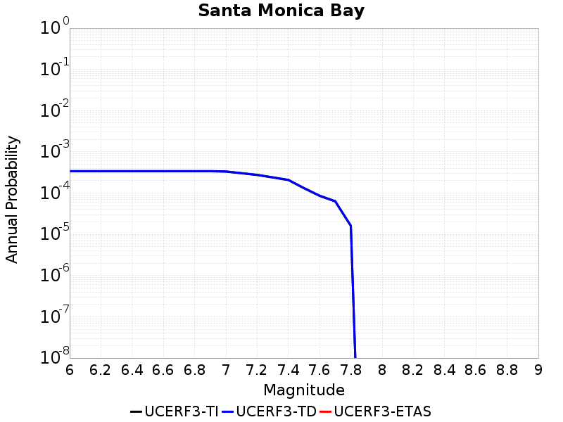 |
|-----|

| Magnitude | UCERF3-TI Prob | UCERF3-TD Prob | UCERF3-ETAS Prob |
|-----|-----|-----|-----|
| 6.0 | 3.3876215E-4 | 3.4276102E-4 | 0.0 |
| 6.1 | 3.3876215E-4 | 3.4276102E-4 | 0.0 |
| 6.2 | 3.3876215E-4 | 3.4276102E-4 | 0.0 |
| 6.3 | 3.3876215E-4 | 3.4276102E-4 | 0.0 |
| 6.4 | 3.3876215E-4 | 3.4276102E-4 | 0.0 |
| 6.5 | 3.3876215E-4 | 3.4276102E-4 | 0.0 |
| 6.6 | 3.3876215E-4 | 3.4276102E-4 | 0.0 |
| 6.7 | 3.3876215E-4 | 3.4276102E-4 | 0.0 |
| 6.8 | 3.3876215E-4 | 3.4276102E-4 | 0.0 |
| 6.9 | 3.3876215E-4 | 3.4276102E-4 | 0.0 |
| 7.0 | 3.31914E-4 | 3.3587957E-4 | 0.0 |
| 7.1 | 3.0239785E-4 | 3.0617657E-4 | 0.0 |
| 7.2 | 2.7470608E-4 | 2.78283E-4 | 0.0 |
| 7.3 | 2.3910566E-4 | 2.4237538E-4 | 0.0 |
| 7.4 | 2.0707825E-4 | 2.1002478E-4 | 0.0 |
| 7.5 | 1.3120825E-4 | 1.3323856E-4 | 0.0 |
| 7.6 | 8.56361E-5 | 8.706764E-5 | 0.0 |
| 7.7 | 6.2770705E-5 | 6.386994E-5 | 0.0 |
| 7.8 | 1.5935038E-5 | 1.6236636E-5 | 0.0 |

## Santa Monica alt 1
*[(top)](#table-of-contents)*

|  |
|-----|

| Magnitude | UCERF3-TI Prob | UCERF3-TD Prob | UCERF3-ETAS Prob |
|-----|-----|-----|-----|
| 6.0 | 0.005757478 | 0.0059687714 | 0.0 |
| 6.1 | 0.005757478 | 0.0059687714 | 0.0 |
| 6.2 | 0.005757478 | 0.0059687714 | 0.0 |
| 6.3 | 0.005757478 | 0.0059687714 | 0.0 |
| 6.4 | 0.005757478 | 0.0059687714 | 0.0 |
| 6.5 | 0.0042609703 | 0.0043364726 | 0.0 |
| 6.6 | 0.0042457907 | 0.004319974 | 0.0 |
| 6.7 | 0.0042232145 | 0.00429578 | 0.0 |
| 6.8 | 0.00398062 | 0.0040330747 | 0.0 |
| 6.9 | 0.0038381014 | 0.0038797006 | 0.0 |
| 7.0 | 0.0037549543 | 0.0037913464 | 0.0 |
| 7.1 | 0.0029195412 | 0.002875976 | 0.0 |
| 7.2 | 0.0024745662 | 0.002390988 | 0.0 |
| 7.3 | 0.0019959346 | 0.0018931287 | 0.0 |
| 7.4 | 0.001361329 | 0.0013024292 | 0.0 |
| 7.5 | 9.3467993E-4 | 9.163833E-4 | 0.0 |
| 7.6 | 5.984669E-4 | 5.7484437E-4 | 0.0 |
| 7.7 | 2.7812112E-4 | 2.4730258E-4 | 0.0 |
| 7.8 | 6.08831E-5 | 4.3152777E-5 | 0.0 |
| 7.9 | 4.1781706E-7 | 3.2131297E-7 | 0.0 |

## Santa Rosa Island
*[(top)](#table-of-contents)*

|  |
|-----|

| Magnitude | UCERF3-TI Prob | UCERF3-TD Prob | UCERF3-ETAS Prob |
|-----|-----|-----|-----|
| 6.0 | 0.021239553 | 0.024257151 | 0.0 |
| 6.1 | 0.01092941 | 0.012361273 | 0.0 |
| 6.2 | 0.01092941 | 0.012361273 | 0.0 |
| 6.3 | 0.007878214 | 0.008859277 | 0.0 |
| 6.4 | 0.006419184 | 0.0071938965 | 0.0 |
| 6.5 | 0.004716845 | 0.005259183 | 0.0 |
| 6.6 | 0.003929756 | 0.0043690694 | 0.0 |
| 6.7 | 0.0028669522 | 0.0031680765 | 0.0 |
| 6.8 | 0.0019470629 | 0.0021264327 | 0.0 |
| 6.9 | 0.0012808773 | 0.0013699621 | 0.0 |
| 7.0 | 0.0012121652 | 0.0012937139 | 0.0 |
| 7.1 | 0.0011602144 | 0.0012366945 | 0.0 |
| 7.2 | 0.0011134144 | 0.0011861353 | 0.0 |
| 7.3 | 0.0010322682 | 0.0010989386 | 0.0 |
| 7.4 | 8.840988E-4 | 9.4051735E-4 | 0.0 |
| 7.5 | 4.688299E-4 | 4.959018E-4 | 0.0 |
| 7.6 | 2.023439E-4 | 2.1134868E-4 | 0.0 |
| 7.7 | 3.225525E-5 | 3.306281E-5 | 0.0 |
| 7.8 | 7.1507833E-7 | 7.2848525E-7 | 0.0 |

## Santa Susana East (connector)
*[(top)](#table-of-contents)*

|  |
|-----|

| Magnitude | UCERF3-TI Prob | UCERF3-TD Prob | UCERF3-ETAS Prob |
|-----|-----|-----|-----|
| 6.0 | 0.014804244 | 0.016560275 | 0.0 |
| 6.1 | 0.014804244 | 0.016560275 | 0.0 |
| 6.2 | 0.014804244 | 0.016560275 | 0.0 |
| 6.3 | 0.010090181 | 0.0105614755 | 0.0 |
| 6.4 | 0.010090181 | 0.0105614755 | 0.0 |
| 6.5 | 0.010090181 | 0.0105614755 | 0.0 |
| 6.6 | 0.010090181 | 0.0105614755 | 0.0 |
| 6.7 | 0.010073971 | 0.010554996 | 0.0 |
| 6.8 | 0.0063546924 | 0.0060227644 | 0.0 |
| 6.9 | 0.0063546924 | 0.0060227644 | 0.0 |
| 7.0 | 0.0048284214 | 0.004190869 | 0.0 |
| 7.1 | 0.00475278 | 0.004130341 | 0.0 |
| 7.2 | 0.0046077054 | 0.0040260595 | 0.0 |
| 7.3 | 0.004463301 | 0.0039267517 | 0.0 |
| 7.4 | 0.0040888423 | 0.0035465697 | 0.0 |
| 7.5 | 0.0025466895 | 0.002226991 | 0.0 |
| 7.6 | 7.247352E-4 | 6.01935E-4 | 0.0 |
| 7.7 | 1.5613029E-4 | 1.232364E-4 | 0.0 |
| 7.8 | 2.5143789E-5 | 1.3675944E-5 | 0.0 |
| 7.9 | 1.3632817E-6 | 1.4434639E-6 | 0.0 |

## Santa Susana alt 1
*[(top)](#table-of-contents)*

| 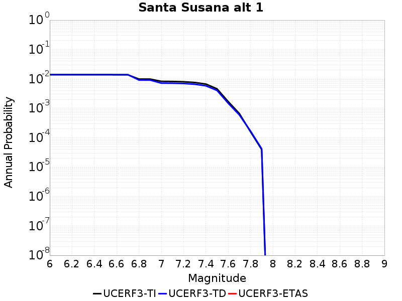 |
|-----|

| Magnitude | UCERF3-TI Prob | UCERF3-TD Prob | UCERF3-ETAS Prob |
|-----|-----|-----|-----|
| 6.0 | 0.013860362 | 0.014073127 | 0.0 |
| 6.1 | 0.013860362 | 0.014073127 | 0.0 |
| 6.2 | 0.013860362 | 0.014073127 | 0.0 |
| 6.3 | 0.013860362 | 0.014073127 | 0.0 |
| 6.4 | 0.013860362 | 0.014073127 | 0.0 |
| 6.5 | 0.013860362 | 0.014073127 | 0.0 |
| 6.6 | 0.013808494 | 0.014009659 | 0.0 |
| 6.7 | 0.013808494 | 0.014009659 | 0.0 |
| 6.8 | 0.009902848 | 0.009144654 | 0.0 |
| 6.9 | 0.0098866755 | 0.009135429 | 0.0 |
| 7.0 | 0.008271185 | 0.0071947416 | 0.0 |
| 7.1 | 0.008198941 | 0.0071327635 | 0.0 |
| 7.2 | 0.008011877 | 0.0069910367 | 0.0 |
| 7.3 | 0.007555048 | 0.0066020302 | 0.0 |
| 7.4 | 0.0066872234 | 0.00583175 | 0.0 |
| 7.5 | 0.0045955796 | 0.004056811 | 0.0 |
| 7.6 | 0.0016961104 | 0.0014925349 | 0.0 |
| 7.7 | 6.6514505E-4 | 5.965898E-4 | 0.0 |
| 7.8 | 1.6004729E-4 | 1.6892592E-4 | 0.0 |
| 7.9 | 3.977493E-5 | 4.2173095E-5 | 0.0 |

## Santa Ynez (East)
*[(top)](#table-of-contents)*

| 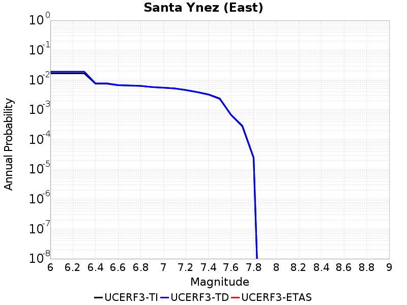 |
|-----|

| Magnitude | UCERF3-TI Prob | UCERF3-TD Prob | UCERF3-ETAS Prob |
|-----|-----|-----|-----|
| 6.0 | 0.016697178 | 0.019021844 | 0.0 |
| 6.1 | 0.016697178 | 0.019021844 | 0.0 |
| 6.2 | 0.016697178 | 0.019021844 | 0.0 |
| 6.3 | 0.016697178 | 0.019021844 | 0.0 |
| 6.4 | 0.0074880854 | 0.007710674 | 0.0 |
| 6.5 | 0.0074880854 | 0.007710674 | 0.0 |
| 6.6 | 0.006657724 | 0.0067599528 | 0.0 |
| 6.7 | 0.00647886 | 0.006561409 | 0.0 |
| 6.8 | 0.0062912325 | 0.0063555143 | 0.0 |
| 6.9 | 0.005777207 | 0.0057991915 | 0.0 |
| 7.0 | 0.0055039856 | 0.0055007976 | 0.0 |
| 7.1 | 0.0052155964 | 0.0051893014 | 0.0 |
| 7.2 | 0.0046197 | 0.0045500346 | 0.0 |
| 7.3 | 0.0039319694 | 0.0039046314 | 0.0 |
| 7.4 | 0.003286749 | 0.0032179318 | 0.0 |
| 7.5 | 0.002402707 | 0.0023122693 | 0.0 |
| 7.6 | 6.707218E-4 | 6.7797943E-4 | 0.0 |
| 7.7 | 2.7808524E-4 | 2.92632E-4 | 0.0 |
| 7.8 | 2.4074554E-5 | 2.5050393E-5 | 0.0 |

## Santa Ynez (West)
*[(top)](#table-of-contents)*

| 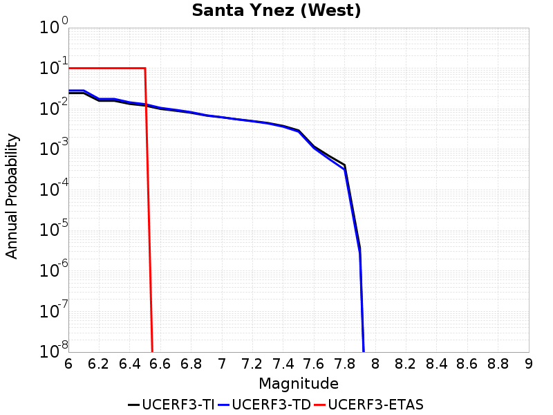 |
|-----|

| Magnitude | UCERF3-TI Prob | UCERF3-TD Prob | UCERF3-ETAS Prob |
|-----|-----|-----|-----|
| 6.0 | 0.024405818 | 0.028249888 | 0.1 |
| 6.1 | 0.024405818 | 0.028249888 | 0.1 |
| 6.2 | 0.015745522 | 0.017521797 | 0.1 |
| 6.3 | 0.015745522 | 0.017521797 | 0.1 |
| 6.4 | 0.013192902 | 0.0144396685 | 0.1 |
| 6.5 | 0.012003611 | 0.013009456 | 0.1 |
| 6.6 | 0.00992627 | 0.01055189 | 0.0 |
| 6.7 | 0.008949154 | 0.009413033 | 0.0 |
| 6.8 | 0.007960589 | 0.008266773 | 0.0 |
| 6.9 | 0.0067972173 | 0.006924023 | 0.0 |
| 7.0 | 0.006157372 | 0.0062008854 | 0.0 |
| 7.1 | 0.0055142213 | 0.0054803956 | 0.0 |
| 7.2 | 0.004992037 | 0.0049186517 | 0.0 |
| 7.3 | 0.004470094 | 0.0043583936 | 0.0 |
| 7.4 | 0.0037822074 | 0.0036168487 | 0.0 |
| 7.5 | 0.0029319443 | 0.0027334932 | 0.0 |
| 7.6 | 0.001181275 | 0.0010734692 | 0.0 |
| 7.7 | 6.832996E-4 | 5.737807E-4 | 0.0 |
| 7.8 | 4.12332E-4 | 3.161289E-4 | 0.0 |
| 7.9 | 3.691799E-6 | 2.6545881E-6 | 0.0 |

## Santa Ynez River
*[(top)](#table-of-contents)*

| 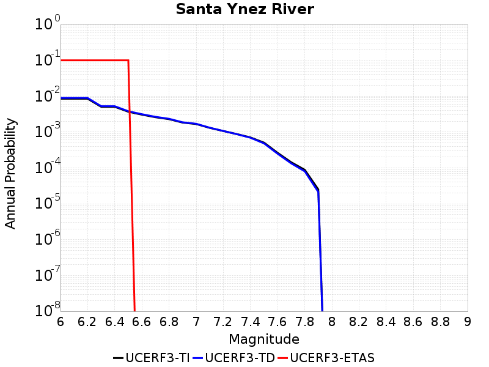 |
|-----|

| Magnitude | UCERF3-TI Prob | UCERF3-TD Prob | UCERF3-ETAS Prob |
|-----|-----|-----|-----|
| 6.0 | 0.0085190125 | 0.008937888 | 0.1 |
| 6.1 | 0.0085190125 | 0.008937888 | 0.1 |
| 6.2 | 0.0085190125 | 0.008937888 | 0.1 |
| 6.3 | 0.005067755 | 0.00526532 | 0.1 |
| 6.4 | 0.005067755 | 0.00526532 | 0.1 |
| 6.5 | 0.0036884616 | 0.0038152873 | 0.1 |
| 6.6 | 0.0030598943 | 0.0031551167 | 0.0 |
| 6.7 | 0.0025916274 | 0.0026642727 | 0.0 |
| 6.8 | 0.0022914023 | 0.0023495683 | 0.0 |
| 6.9 | 0.0018379007 | 0.0018761292 | 0.0 |
| 7.0 | 0.0016743679 | 0.0017055324 | 0.0 |
| 7.1 | 0.0013085462 | 0.0013239456 | 0.0 |
| 7.2 | 0.0010699122 | 0.0010744368 | 0.0 |
| 7.3 | 8.7860145E-4 | 8.7407953E-4 | 0.0 |
| 7.4 | 7.0939213E-4 | 6.9480925E-4 | 0.0 |
| 7.5 | 5.0784746E-4 | 4.8408707E-4 | 0.0 |
| 7.6 | 2.643637E-4 | 2.4903155E-4 | 0.0 |
| 7.7 | 1.444767E-4 | 1.3431945E-4 | 0.0 |
| 7.8 | 8.893267E-5 | 8.05618E-5 | 0.0 |
| 7.9 | 2.5225041E-5 | 2.1333622E-5 | 0.0 |

## Sargent 2011 CFM
*[(top)](#table-of-contents)*

|  |
|-----|

| Magnitude | UCERF3-TI Prob | UCERF3-TD Prob | UCERF3-ETAS Prob |
|-----|-----|-----|-----|
| 6.0 | 0.01928905 | 0.018946586 | 0.0 |
| 6.1 | 0.012327154 | 0.009595328 | 0.0 |
| 6.2 | 0.011987597 | 0.009198655 | 0.0 |
| 6.3 | 0.008978641 | 0.0054483595 | 0.0 |
| 6.4 | 0.0077132257 | 0.003891536 | 0.0 |
| 6.5 | 0.0074643586 | 0.003600294 | 0.0 |
| 6.6 | 0.005086244 | 7.2771794E-4 | 0.0 |
| 6.7 | 0.005075942 | 7.1661593E-4 | 0.0 |
| 6.8 | 0.005000906 | 6.560825E-4 | 0.0 |
| 6.9 | 0.004906904 | 5.961322E-4 | 0.0 |
| 7.0 | 0.0048136655 | 5.265298E-4 | 0.0 |
| 7.1 | 0.004682722 | 4.4302302E-4 | 0.0 |
| 7.2 | 0.004436213 | 2.8708926E-4 | 0.0 |
| 7.3 | 0.004188253 | 1.9253959E-4 | 0.0 |
| 7.4 | 0.0039901207 | 1.6430028E-4 | 0.0 |
| 7.5 | 0.0036259065 | 1.329484E-4 | 0.0 |
| 7.6 | 0.0032726745 | 9.625611E-5 | 0.0 |
| 7.7 | 0.0025713982 | 2.9290848E-5 | 0.0 |
| 7.8 | 0.0012375432 | 2.1478692E-5 | 0.0 |
| 7.9 | 9.5064886E-4 | 1.9039182E-5 | 0.0 |
| 8.0 | 9.963074E-5 | 7.815771E-6 | 0.0 |

## Scodie Lineament
*[(top)](#table-of-contents)*

| 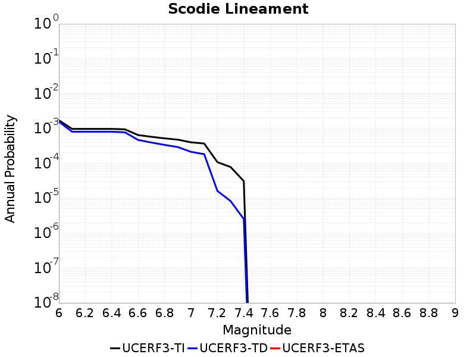 |
|-----|

| Magnitude | UCERF3-TI Prob | UCERF3-TD Prob | UCERF3-ETAS Prob |
|-----|-----|-----|-----|
| 6.0 | 0.0017162118 | 0.0015708467 | 0.0 |
| 6.1 | 9.7337784E-4 | 8.0763234E-4 | 0.0 |
| 6.2 | 9.7337784E-4 | 8.0763234E-4 | 0.0 |
| 6.3 | 9.7337784E-4 | 8.0763234E-4 | 0.0 |
| 6.4 | 9.7337784E-4 | 8.0763234E-4 | 0.0 |
| 6.5 | 9.4431615E-4 | 7.773712E-4 | 0.0 |
| 6.6 | 6.475708E-4 | 4.6914918E-4 | 0.0 |
| 6.7 | 5.770443E-4 | 3.9598823E-4 | 0.0 |
| 6.8 | 5.220012E-4 | 3.3895095E-4 | 0.0 |
| 6.9 | 4.782258E-4 | 2.936501E-4 | 0.0 |
| 7.0 | 4.0163012E-4 | 2.1447644E-4 | 0.0 |
| 7.1 | 3.7060137E-4 | 1.8359102E-4 | 0.0 |
| 7.2 | 1.08523476E-4 | 1.6238539E-5 | 0.0 |
| 7.3 | 7.851618E-5 | 8.29698E-6 | 0.0 |
| 7.4 | 3.095951E-5 | 2.5316594E-6 | 0.0 |

## Sheephole
*[(top)](#table-of-contents)*

| 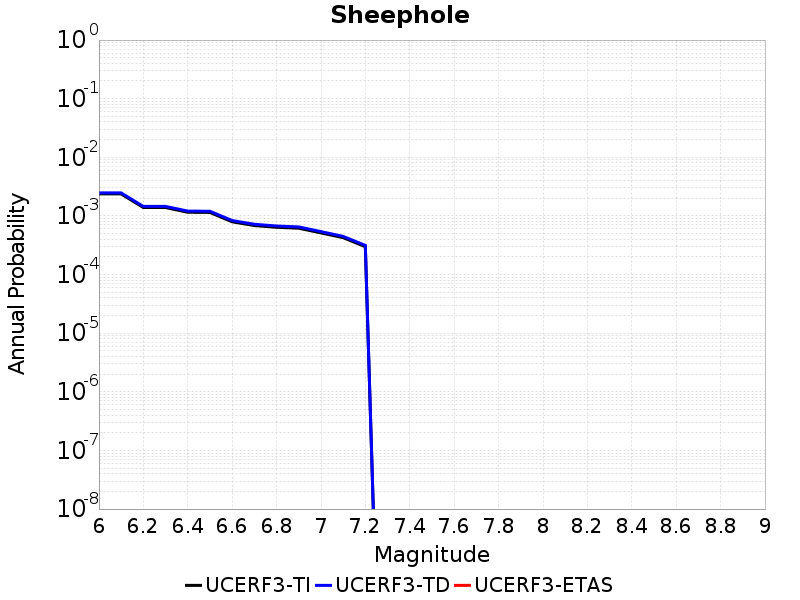 |
|-----|

| Magnitude | UCERF3-TI Prob | UCERF3-TD Prob | UCERF3-ETAS Prob |
|-----|-----|-----|-----|
| 6.0 | 0.0023754628 | 0.0024704349 | 0.0 |
| 6.1 | 0.0023754628 | 0.0024704349 | 0.0 |
| 6.2 | 0.0013910364 | 0.0014528034 | 0.0 |
| 6.3 | 0.0013910364 | 0.0014528034 | 0.0 |
| 6.4 | 0.0011555976 | 0.00121079 | 0.0 |
| 6.5 | 0.0011465458 | 0.0012013509 | 0.0 |
| 6.6 | 7.9448614E-4 | 8.3506625E-4 | 0.0 |
| 6.7 | 6.8525434E-4 | 7.208951E-4 | 0.0 |
| 6.8 | 6.4032647E-4 | 6.737129E-4 | 0.0 |
| 6.9 | 6.17452E-4 | 6.496444E-4 | 0.0 |
| 7.0 | 5.137943E-4 | 5.4046715E-4 | 0.0 |
| 7.1 | 4.259143E-4 | 4.4796552E-4 | 0.0 |
| 7.2 | 2.9891645E-4 | 3.1439698E-4 | 0.0 |

## Shoreline
*[(top)](#table-of-contents)*

|  |
|-----|

| Magnitude | UCERF3-TI Prob | UCERF3-TD Prob | UCERF3-ETAS Prob |
|-----|-----|-----|-----|
| 6.0 | 0.0020791737 | 0.0021098752 | 0.0 |
| 6.1 | 0.0020791737 | 0.0021098752 | 0.0 |
| 6.2 | 7.3230127E-4 | 7.351357E-4 | 0.0 |
| 6.3 | 7.3230127E-4 | 7.351357E-4 | 0.0 |
| 6.4 | 6.9447263E-4 | 6.965953E-4 | 0.0 |
| 6.5 | 5.83553E-4 | 5.8408163E-4 | 0.0 |
| 6.6 | 5.108591E-4 | 5.101076E-4 | 0.0 |
| 6.7 | 4.6928777E-4 | 4.6776107E-4 | 0.0 |
| 6.8 | 4.1377472E-4 | 4.1080156E-4 | 0.0 |
| 6.9 | 3.7282976E-4 | 3.6895942E-4 | 0.0 |
| 7.0 | 3.3331584E-4 | 3.283617E-4 | 0.0 |
| 7.1 | 2.8329415E-4 | 2.7682414E-4 | 0.0 |
| 7.2 | 2.4400349E-4 | 2.3634454E-4 | 0.0 |
| 7.3 | 2.1373246E-4 | 2.0524481E-4 | 0.0 |
| 7.4 | 1.8316023E-4 | 1.7383951E-4 | 0.0 |
| 7.5 | 1.4993713E-4 | 1.3970943E-4 | 0.0 |
| 7.6 | 1.0917276E-4 | 9.777022E-5 | 0.0 |
| 7.7 | 7.2643765E-5 | 6.0032213E-5 | 0.0 |
| 7.8 | 4.230553E-5 | 2.8967706E-5 | 0.0 |
| 7.9 | 2.6537167E-5 | 1.40503225E-5 | 0.0 |
| 8.0 | 1.6572056E-5 | 6.955718E-6 | 0.0 |
| 8.1 | 6.7560045E-6 | 2.8982852E-6 | 0.0 |

## Sierra Madre
*[(top)](#table-of-contents)*

|  |
|-----|

| Magnitude | UCERF3-TI Prob | UCERF3-TD Prob | UCERF3-ETAS Prob |
|-----|-----|-----|-----|
| 6.0 | 0.0069569005 | 0.005709414 | 0.0 |
| 6.1 | 0.0069569005 | 0.005709414 | 0.0 |
| 6.2 | 0.0069569005 | 0.005709414 | 0.0 |
| 6.3 | 0.0069569005 | 0.005709414 | 0.0 |
| 6.4 | 0.0069569005 | 0.005709414 | 0.0 |
| 6.5 | 0.006582173 | 0.005309798 | 0.0 |
| 6.6 | 0.006582173 | 0.005309798 | 0.0 |
| 6.7 | 0.0065024206 | 0.0052248053 | 0.0 |
| 6.8 | 0.006477792 | 0.0052000573 | 0.0 |
| 6.9 | 0.006358865 | 0.0050828033 | 0.0 |
| 7.0 | 0.006153469 | 0.004878659 | 0.0 |
| 7.1 | 0.005949879 | 0.0046645664 | 0.0 |
| 7.2 | 0.0056383642 | 0.004360228 | 0.0 |
| 7.3 | 0.005413687 | 0.004163661 | 0.0 |
| 7.4 | 0.0050843097 | 0.003848908 | 0.0 |
| 7.5 | 0.004522561 | 0.0033483286 | 0.0 |
| 7.6 | 0.003308182 | 0.0022987167 | 0.0 |
| 7.7 | 0.0024089129 | 0.0015203655 | 0.0 |
| 7.8 | 0.0016758774 | 0.0010107459 | 0.0 |
| 7.9 | 5.4208096E-4 | 2.906557E-4 | 0.0 |
| 8.0 | 6.318537E-5 | 3.4329365E-5 | 0.0 |

## Sierra Madre (San Fernando)
*[(top)](#table-of-contents)*

|  |
|-----|

| Magnitude | UCERF3-TI Prob | UCERF3-TD Prob | UCERF3-ETAS Prob |
|-----|-----|-----|-----|
| 6.0 | 0.0053840918 | 0.0032681709 | 0.0 |
| 6.1 | 0.0053840918 | 0.0032681709 | 0.0 |
| 6.2 | 0.0053840918 | 0.0032681709 | 0.0 |
| 6.3 | 0.0053840918 | 0.0032681709 | 0.0 |
| 6.4 | 0.0053338245 | 0.0032681709 | 0.0 |
| 6.5 | 0.0053338245 | 0.0032681709 | 0.0 |
| 6.6 | 0.0051542283 | 0.0032681709 | 0.0 |
| 6.7 | 0.005137938 | 0.0032616437 | 0.0 |
| 6.8 | 0.0049114493 | 0.0032118326 | 0.0 |
| 6.9 | 0.0045295 | 0.003139889 | 0.0 |
| 7.0 | 0.004502713 | 0.0031268909 | 0.0 |
| 7.1 | 0.0044283825 | 0.003080063 | 0.0 |
| 7.2 | 0.004238217 | 0.0029627539 | 0.0 |
| 7.3 | 0.004104078 | 0.0028865242 | 0.0 |
| 7.4 | 0.0039478904 | 0.0027847413 | 0.0 |
| 7.5 | 0.0033074263 | 0.0022912184 | 0.0 |
| 7.6 | 0.0023091463 | 0.0015016937 | 0.0 |
| 7.7 | 0.0015667742 | 9.090033E-4 | 0.0 |
| 7.8 | 9.627065E-4 | 5.491989E-4 | 0.0 |
| 7.9 | 5.132671E-4 | 2.7158725E-4 | 0.0 |
| 8.0 | 6.318537E-5 | 3.4329365E-5 | 0.0 |

## Sierra Nevada  (No Extension)
*[(top)](#table-of-contents)*

|  |
|-----|

| Magnitude | UCERF3-TI Prob | UCERF3-TD Prob | UCERF3-ETAS Prob |
|-----|-----|-----|-----|
| 6.0 | 0.004045588 | 0.003634843 | 0.0 |
| 6.1 | 0.004045588 | 0.003634843 | 0.0 |
| 6.2 | 0.004045588 | 0.003634843 | 0.0 |
| 6.3 | 0.004045588 | 0.003634843 | 0.0 |
| 6.4 | 0.004045588 | 0.003634843 | 0.0 |
| 6.5 | 0.004045588 | 0.003634843 | 0.0 |
| 6.6 | 0.0013833415 | 8.410635E-4 | 0.0 |
| 6.7 | 0.0013506424 | 8.0735947E-4 | 0.0 |
| 6.8 | 0.0013481114 | 8.0569636E-4 | 0.0 |
| 6.9 | 0.0012818627 | 7.405857E-4 | 0.0 |
| 7.0 | 0.0012692984 | 7.285799E-4 | 0.0 |
| 7.1 | 0.0012333926 | 6.946766E-4 | 0.0 |
| 7.2 | 0.0011848784 | 6.5106066E-4 | 0.0 |
| 7.3 | 0.001115068 | 5.9461244E-4 | 0.0 |
| 7.4 | 9.934074E-4 | 4.9847655E-4 | 0.0 |
| 7.5 | 8.0184115E-4 | 3.935136E-4 | 0.0 |
| 7.6 | 5.5712904E-4 | 2.4245585E-4 | 0.0 |
| 7.7 | 2.8741814E-4 | 8.092852E-5 | 0.0 |

## Silver Creek 2011 CFM
*[(top)](#table-of-contents)*

|  |
|-----|

| Magnitude | UCERF3-TI Prob | UCERF3-TD Prob | UCERF3-ETAS Prob |
|-----|-----|-----|-----|
| 6.0 | 0.0018365202 | 0.0020759369 | 0.0 |
| 6.1 | 0.0018365202 | 0.0020759369 | 0.0 |
| 6.2 | 0.0013746519 | 0.0016084629 | 0.0 |
| 6.3 | 0.0013179524 | 0.0015509764 | 0.0 |
| 6.4 | 0.0011361865 | 0.0013795847 | 0.0 |
| 6.5 | 0.0010608323 | 0.0013062222 | 0.0 |
| 6.6 | 9.834393E-4 | 0.0012186873 | 0.0 |
| 6.7 | 8.785453E-4 | 0.0010931835 | 0.0 |
| 6.8 | 7.9160964E-4 | 9.769534E-4 | 0.0 |
| 6.9 | 7.0089876E-4 | 8.531996E-4 | 0.0 |
| 7.0 | 6.0318917E-4 | 7.367611E-4 | 0.0 |
| 7.1 | 4.4874908E-4 | 5.5940816E-4 | 0.0 |
| 7.2 | 3.541468E-4 | 4.4193593E-4 | 0.0 |
| 7.3 | 2.6759884E-4 | 3.424571E-4 | 0.0 |
| 7.4 | 1.9935417E-4 | 2.5848098E-4 | 0.0 |
| 7.5 | 1.16312825E-4 | 1.5553666E-4 | 0.0 |
| 7.6 | 7.412145E-5 | 1.0529209E-4 | 0.0 |
| 7.7 | 5.8699567E-5 | 8.4597246E-5 | 0.0 |
| 7.8 | 4.4834796E-5 | 6.832701E-5 | 0.0 |
| 7.9 | 3.2123375E-5 | 5.3881242E-5 | 0.0 |
| 8.0 | 1.5251966E-5 | 2.71059E-5 | 0.0 |
| 8.1 | 2.925242E-6 | 3.9938886E-6 | 0.0 |

## Simi-Santa Rosa
*[(top)](#table-of-contents)*

| 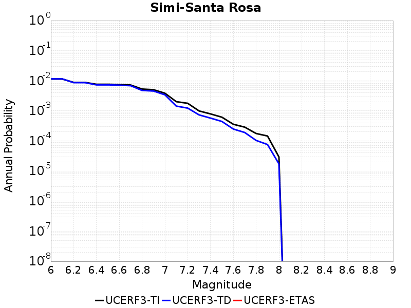 |
|-----|

| Magnitude | UCERF3-TI Prob | UCERF3-TD Prob | UCERF3-ETAS Prob |
|-----|-----|-----|-----|
| 6.0 | 0.011408163 | 0.011544412 | 0.0 |
| 6.1 | 0.011408163 | 0.011544412 | 0.0 |
| 6.2 | 0.008830327 | 0.008650455 | 0.0 |
| 6.3 | 0.008830327 | 0.008650455 | 0.0 |
| 6.4 | 0.0076234564 | 0.0072975764 | 0.0 |
| 6.5 | 0.0076234564 | 0.0072975764 | 0.0 |
| 6.6 | 0.007474003 | 0.0071304766 | 0.0 |
| 6.7 | 0.007217 | 0.0068603833 | 0.0 |
| 6.8 | 0.0052959146 | 0.004759538 | 0.0 |
| 6.9 | 0.005048454 | 0.0045628827 | 0.0 |
| 7.0 | 0.0038563553 | 0.0034129166 | 0.0 |
| 7.1 | 0.0020190678 | 0.0014366168 | 0.0 |
| 7.2 | 0.0017817242 | 0.0012326591 | 0.0 |
| 7.3 | 9.920754E-4 | 7.3266856E-4 | 0.0 |
| 7.4 | 7.9126534E-4 | 5.738922E-4 | 0.0 |
| 7.5 | 6.148568E-4 | 4.441761E-4 | 0.0 |
| 7.6 | 3.5851944E-4 | 2.4912445E-4 | 0.0 |
| 7.7 | 2.87601E-4 | 1.9074234E-4 | 0.0 |
| 7.8 | 1.7666233E-4 | 1.04167106E-4 | 0.0 |
| 7.9 | 1.458566E-4 | 7.592286E-5 | 0.0 |
| 8.0 | 2.935472E-5 | 1.7318787E-5 | 0.0 |

## Sisar
*[(top)](#table-of-contents)*

|  |
|-----|

| Magnitude | UCERF3-TI Prob | UCERF3-TD Prob | UCERF3-ETAS Prob |
|-----|-----|-----|-----|
| 6.0 | 0.0023682916 | 0.0019981836 | 0.0 |
| 6.1 | 0.0023682916 | 0.0019981836 | 0.0 |
| 6.2 | 0.0023682916 | 0.0019981836 | 0.0 |
| 6.3 | 0.0023682916 | 0.0019981836 | 0.0 |
| 6.4 | 0.0023682916 | 0.0019981836 | 0.0 |
| 6.5 | 0.0023682916 | 0.0019981836 | 0.0 |
| 6.6 | 0.0023682916 | 0.0019981836 | 0.0 |
| 6.7 | 0.0023682916 | 0.0019981836 | 0.0 |
| 6.8 | 0.0023682916 | 0.0019981836 | 0.0 |
| 6.9 | 0.002367267 | 0.0019971225 | 0.0 |
| 7.0 | 0.0023597833 | 0.0019893479 | 0.0 |
| 7.1 | 0.0023521832 | 0.0019814293 | 0.0 |
| 7.2 | 0.0023186638 | 0.0019462751 | 0.0 |
| 7.3 | 0.0022632615 | 0.0018910194 | 0.0 |
| 7.4 | 0.0021988105 | 0.0018386657 | 0.0 |
| 7.5 | 0.0020765243 | 0.0017422826 | 0.0 |
| 7.6 | 0.0014481564 | 0.0012240891 | 0.0 |
| 7.7 | 9.923846E-4 | 8.2930346E-4 | 0.0 |
| 7.8 | 2.5614293E-4 | 2.2722056E-4 | 0.0 |
| 7.9 | 6.0868573E-5 | 5.3901385E-5 | 0.0 |
| 8.0 | 1.3096993E-6 | 8.884544E-7 | 0.0 |

## Skinner Flat 2011 CFM
*[(top)](#table-of-contents)*

|  |
|-----|

| Magnitude | UCERF3-TI Prob | UCERF3-TD Prob | UCERF3-ETAS Prob |
|-----|-----|-----|-----|
| 6.0 | 0.002255697 | 0.0023392981 | 0.0 |
| 6.1 | 0.002255697 | 0.0023392981 | 0.0 |

## So Sierra Nevada
*[(top)](#table-of-contents)*

| 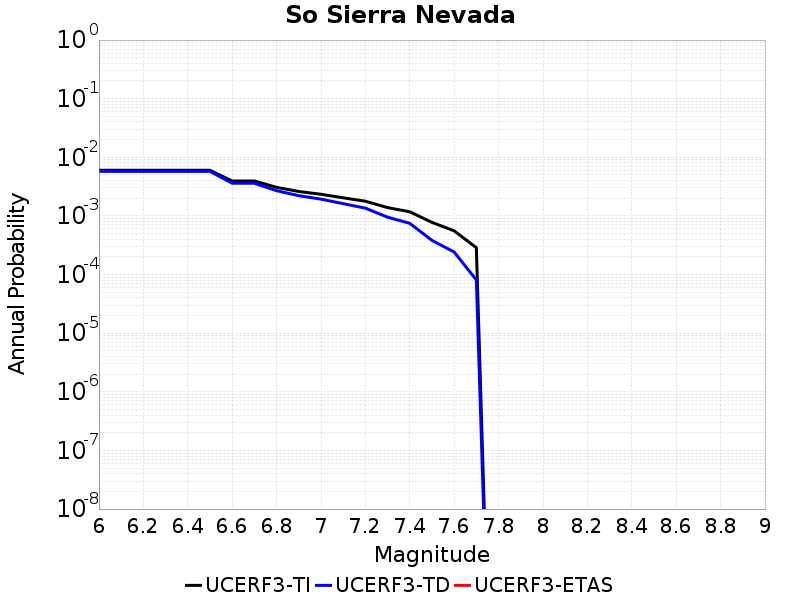 |
|-----|

| Magnitude | UCERF3-TI Prob | UCERF3-TD Prob | UCERF3-ETAS Prob |
|-----|-----|-----|-----|
| 6.0 | 0.006007948 | 0.0057626325 | 0.0 |
| 6.1 | 0.006007948 | 0.0057626325 | 0.0 |
| 6.2 | 0.006007948 | 0.0057626325 | 0.0 |
| 6.3 | 0.006007948 | 0.0057626325 | 0.0 |
| 6.4 | 0.006007948 | 0.0057626325 | 0.0 |
| 6.5 | 0.006007948 | 0.0057626325 | 0.0 |
| 6.6 | 0.003951 | 0.0036104338 | 0.0 |
| 6.7 | 0.003951 | 0.0036104338 | 0.0 |
| 6.8 | 0.0030752132 | 0.0026971528 | 0.0 |
| 6.9 | 0.0026117235 | 0.0022148176 | 0.0 |
| 7.0 | 0.0023413717 | 0.0019345128 | 0.0 |
| 7.1 | 0.0020390663 | 0.0016211093 | 0.0 |
| 7.2 | 0.0017829615 | 0.0013573032 | 0.0 |
| 7.3 | 0.0013866565 | 9.524606E-4 | 0.0 |
| 7.4 | 0.001177395 | 7.481951E-4 | 0.0 |
| 7.5 | 7.7680405E-4 | 3.8279276E-4 | 0.0 |
| 7.6 | 5.5712904E-4 | 2.4245585E-4 | 0.0 |
| 7.7 | 2.8741814E-4 | 8.092852E-5 | 0.0 |

## South Cuyama
*[(top)](#table-of-contents)*

|  |
|-----|

| Magnitude | UCERF3-TI Prob | UCERF3-TD Prob | UCERF3-ETAS Prob |
|-----|-----|-----|-----|
| 6.0 | 6.649156E-4 | 6.686067E-4 | 0.0 |
| 6.1 | 6.649156E-4 | 6.686067E-4 | 0.0 |
| 6.2 | 6.649156E-4 | 6.686067E-4 | 0.0 |
| 6.3 | 6.649156E-4 | 6.686067E-4 | 0.0 |
| 6.4 | 6.649156E-4 | 6.686067E-4 | 0.0 |
| 6.5 | 6.649156E-4 | 6.686067E-4 | 0.0 |
| 6.6 | 6.649156E-4 | 6.686067E-4 | 0.0 |
| 6.7 | 6.649156E-4 | 6.686067E-4 | 0.0 |
| 6.8 | 6.649156E-4 | 6.686067E-4 | 0.0 |
| 6.9 | 4.4115784E-4 | 4.4380387E-4 | 0.0 |
| 7.0 | 4.292224E-4 | 4.318054E-4 | 0.0 |
| 7.1 | 3.5298787E-4 | 3.5520457E-4 | 0.0 |
| 7.2 | 3.0172078E-4 | 3.036749E-4 | 0.0 |
| 7.3 | 2.679929E-4 | 2.697573E-4 | 0.0 |
| 7.4 | 2.2627445E-4 | 2.2779772E-4 | 0.0 |
| 7.5 | 1.7343998E-4 | 1.7464749E-4 | 0.0 |
| 7.6 | 1.0762575E-4 | 1.0840725E-4 | 0.0 |
| 7.7 | 3.210162E-5 | 3.2338834E-5 | 0.0 |
| 7.8 | 6.1390897E-6 | 6.1947662E-6 | 0.0 |
| 7.9 | 3.1506332E-7 | 3.1828515E-7 | 0.0 |

## South Klamath Lake East
*[(top)](#table-of-contents)*

|  |
|-----|

| Magnitude | UCERF3-TI Prob | UCERF3-TD Prob | UCERF3-ETAS Prob |
|-----|-----|-----|-----|
| 6.0 | 0.012207527 | 0.012984774 | 0.0 |
| 6.1 | 0.012207527 | 0.012984774 | 0.0 |
| 6.2 | 0.012207527 | 0.012984774 | 0.0 |
| 6.3 | 0.005104534 | 0.0054073767 | 0.0 |
| 6.4 | 0.005104534 | 0.0054073767 | 0.0 |
| 6.5 | 0.0032256835 | 0.0034105529 | 0.0 |
| 6.6 | 0.0022772867 | 0.0024046644 | 0.0 |
| 6.7 | 0.0017521014 | 0.0018502681 | 0.0 |
| 6.8 | 0.0013446413 | 0.0014201719 | 0.0 |
| 6.9 | 5.210149E-4 | 5.508808E-4 | 0.0 |

## South Klamath Lake West
*[(top)](#table-of-contents)*

|  |
|-----|

| Magnitude | UCERF3-TI Prob | UCERF3-TD Prob | UCERF3-ETAS Prob |
|-----|-----|-----|-----|
| 6.0 | 0.011279777 | 0.011950803 | 0.0 |
| 6.1 | 0.011279777 | 0.011950803 | 0.0 |
| 6.2 | 0.0051186057 | 0.0054064845 | 0.0 |
| 6.3 | 0.0051186057 | 0.0054064845 | 0.0 |
| 6.4 | 0.0031603249 | 0.0033324743 | 0.0 |
| 6.5 | 0.0031603249 | 0.0033324743 | 0.0 |
| 6.6 | 0.0022058594 | 0.002323935 | 0.0 |
| 6.7 | 0.0016613674 | 0.0017509041 | 0.0 |
| 6.8 | 0.0012411437 | 0.0013085994 | 0.0 |
| 6.9 | 4.6575698E-4 | 4.9167156E-4 | 0.0 |

## Superstition Hills
*[(top)](#table-of-contents)*

|  |
|-----|

| Magnitude | UCERF3-TI Prob | UCERF3-TD Prob | UCERF3-ETAS Prob |
|-----|-----|-----|-----|
| 6.0 | 0.03428881 | 0.007359253 | 0.0 |
| 6.1 | 0.033574644 | 0.0073592523 | 0.0 |
| 6.2 | 0.033574644 | 0.0073592523 | 0.0 |
| 6.3 | 0.02697292 | 0.0073592495 | 0.0 |
| 6.4 | 0.023422617 | 0.007359248 | 0.0 |
| 6.5 | 0.015363912 | 0.0073592453 | 0.0 |
| 6.6 | 0.013503874 | 0.0071845665 | 0.0 |
| 6.7 | 0.0075950073 | 0.006968614 | 0.0 |
| 6.8 | 0.006791762 | 0.00573091 | 0.0 |
| 6.9 | 0.005434267 | 0.004290048 | 0.0 |
| 7.0 | 0.0041894587 | 0.003532552 | 0.0 |
| 7.1 | 0.0041894587 | 0.003532552 | 0.0 |
| 7.2 | 0.003841052 | 0.0032770182 | 0.0 |
| 7.3 | 0.0034411973 | 0.0030438113 | 0.0 |
| 7.4 | 0.0033501536 | 0.0029818956 | 0.0 |
| 7.5 | 0.0031644711 | 0.0028749448 | 0.0 |
| 7.6 | 0.002969102 | 0.0027794593 | 0.0 |
| 7.7 | 0.00269182 | 0.0025865848 | 0.0 |
| 7.8 | 0.0019217018 | 0.0022042994 | 0.0 |
| 7.9 | 0.0015779877 | 0.0018749614 | 0.0 |
| 8.0 | 0.0013177631 | 0.0016254588 | 0.0 |
| 8.1 | 0.0012384299 | 0.0015362556 | 0.0 |
| 8.2 | 8.9676166E-7 | 6.0244605E-7 | 0.0 |

## Surprise Valley 2011 CFM
*[(top)](#table-of-contents)*

| 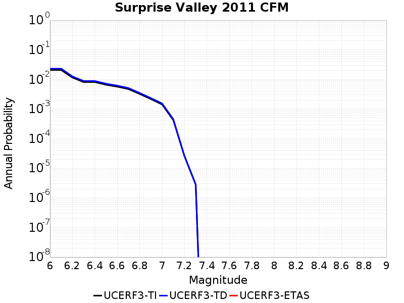 |
|-----|

| Magnitude | UCERF3-TI Prob | UCERF3-TD Prob | UCERF3-ETAS Prob |
|-----|-----|-----|-----|
| 6.0 | 0.020858008 | 0.023127439 | 0.0 |
| 6.1 | 0.020858008 | 0.023127439 | 0.0 |
| 6.2 | 0.011566074 | 0.012642533 | 0.0 |
| 6.3 | 0.008172315 | 0.00887434 | 0.0 |
| 6.4 | 0.008166086 | 0.008868042 | 0.0 |
| 6.5 | 0.0066221743 | 0.0071701026 | 0.0 |
| 6.6 | 0.0057148207 | 0.0061783525 | 0.0 |
| 6.7 | 0.004739512 | 0.005117083 | 0.0 |
| 6.8 | 0.003238301 | 0.0034893982 | 0.0 |
| 6.9 | 0.0021783116 | 0.0023452311 | 0.0 |
| 7.0 | 0.001432759 | 0.0015433364 | 0.0 |
| 7.1 | 4.2405148E-4 | 4.5486377E-4 | 0.0 |
| 7.2 | 2.537988E-5 | 2.5772762E-5 | 0.0 |
| 7.3 | 2.8130391E-6 | 2.856731E-6 | 0.0 |

## Swain Ravine - Spenceville
*[(top)](#table-of-contents)*

|  |
|-----|

| Magnitude | UCERF3-TI Prob | UCERF3-TD Prob | UCERF3-ETAS Prob |
|-----|-----|-----|-----|
| 6.0 | 0.00291575 | 0.002950856 | 0.0 |
| 6.1 | 0.00291575 | 0.002950856 | 0.0 |
| 6.2 | 0.00291575 | 0.002950856 | 0.0 |
| 6.3 | 0.00291575 | 0.002950856 | 0.0 |
| 6.4 | 0.0014821711 | 0.0014984346 | 0.0 |
| 6.5 | 0.0010018905 | 0.0010123934 | 0.0 |
| 6.6 | 0.0010018905 | 0.0010123934 | 0.0 |
| 6.7 | 7.6503144E-4 | 7.7285763E-4 | 0.0 |
| 6.8 | 5.778124E-4 | 5.836268E-4 | 0.0 |
| 6.9 | 4.441653E-4 | 4.4859614E-4 | 0.0 |
| 7.0 | 2.5326732E-4 | 2.557891E-4 | 0.0 |
| 7.1 | 1.9978154E-4 | 2.0177993E-4 | 0.0 |
| 7.2 | 7.6838325E-5 | 7.762795E-5 | 0.0 |
| 7.3 | 2.1852462E-5 | 2.2081775E-5 | 0.0 |

## Table Bluff
*[(top)](#table-of-contents)*

|  |
|-----|

| Magnitude | UCERF3-TI Prob | UCERF3-TD Prob | UCERF3-ETAS Prob |
|-----|-----|-----|-----|
| 6.0 | 0.009216278 | 0.010508978 | 0.0 |
| 6.1 | 0.009216278 | 0.010508978 | 0.0 |
| 6.2 | 0.009216278 | 0.010508978 | 0.0 |
| 6.3 | 0.009216278 | 0.010508978 | 0.0 |
| 6.4 | 0.009216278 | 0.010508978 | 0.0 |
| 6.5 | 0.0066682473 | 0.007703432 | 0.0 |
| 6.6 | 0.0066682473 | 0.007703432 | 0.0 |
| 6.7 | 0.005043458 | 0.0059299706 | 0.0 |
| 6.8 | 0.005043458 | 0.0059299706 | 0.0 |
| 6.9 | 0.004215506 | 0.005029848 | 0.0 |
| 7.0 | 0.0037424958 | 0.0045168456 | 0.0 |
| 7.1 | 0.0018213232 | 0.002098656 | 0.0 |
| 7.2 | 0.0012717636 | 0.0013929716 | 0.0 |

## Tank Canyon
*[(top)](#table-of-contents)*

|  |
|-----|

| Magnitude | UCERF3-TI Prob | UCERF3-TD Prob | UCERF3-ETAS Prob |
|-----|-----|-----|-----|
| 6.0 | 0.02488006 | 0.029800482 | 0.0 |
| 6.1 | 0.009242975 | 0.010815702 | 0.0 |
| 6.2 | 0.009242975 | 0.010815702 | 0.0 |
| 6.3 | 0.007027647 | 0.008176536 | 0.0 |
| 6.4 | 0.005655863 | 0.0065519176 | 0.0 |
| 6.5 | 0.0041473247 | 0.004779001 | 0.0 |
| 6.6 | 0.0034543579 | 0.003957582 | 0.0 |
| 6.7 | 0.0024981452 | 0.0028247258 | 0.0 |
| 6.8 | 0.0022842865 | 0.0025849375 | 0.0 |
| 6.9 | 0.001423255 | 0.0015987193 | 0.0 |
| 7.0 | 9.902435E-4 | 0.0011062527 | 0.0 |
| 7.1 | 7.786704E-4 | 8.654192E-4 | 0.0 |
| 7.2 | 5.576765E-4 | 6.153017E-4 | 0.0 |
| 7.3 | 4.5784327E-4 | 5.0869706E-4 | 0.0 |
| 7.4 | 3.942468E-4 | 4.431179E-4 | 0.0 |
| 7.5 | 2.9151395E-4 | 3.289008E-4 | 0.0 |

## Thirty Mile Bank
*[(top)](#table-of-contents)*

| 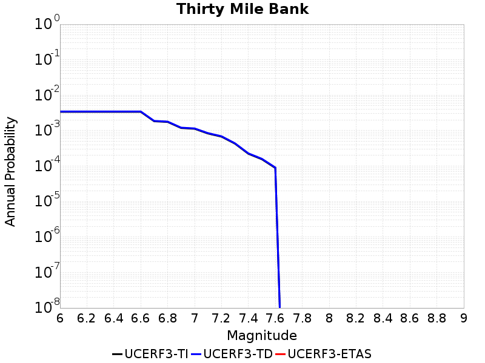 |
|-----|

| Magnitude | UCERF3-TI Prob | UCERF3-TD Prob | UCERF3-ETAS Prob |
|-----|-----|-----|-----|
| 6.0 | 0.0033923604 | 0.0034683477 | 0.0 |
| 6.1 | 0.0033923604 | 0.0034683477 | 0.0 |
| 6.2 | 0.0033923604 | 0.0034683477 | 0.0 |
| 6.3 | 0.0033923604 | 0.0034683477 | 0.0 |
| 6.4 | 0.0033923604 | 0.0034683477 | 0.0 |
| 6.5 | 0.0033923604 | 0.0034683477 | 0.0 |
| 6.6 | 0.0033923604 | 0.0034683477 | 0.0 |
| 6.7 | 0.0018381875 | 0.0018814283 | 0.0 |
| 6.8 | 0.0017572626 | 0.0017986521 | 0.0 |
| 6.9 | 0.0011867158 | 0.0012163763 | 0.0 |
| 7.0 | 0.0011273306 | 0.0011553228 | 0.0 |
| 7.1 | 8.293364E-4 | 8.5133326E-4 | 0.0 |
| 7.2 | 6.7661767E-4 | 6.9505733E-4 | 0.0 |
| 7.3 | 4.301423E-4 | 4.406471E-4 | 0.0 |
| 7.4 | 2.223553E-4 | 2.2877778E-4 | 0.0 |
| 7.5 | 1.562064E-4 | 1.6098208E-4 | 0.0 |
| 7.6 | 8.8640954E-5 | 9.1454385E-5 | 0.0 |

## Tin Mountain
*[(top)](#table-of-contents)*

|  |
|-----|

| Magnitude | UCERF3-TI Prob | UCERF3-TD Prob | UCERF3-ETAS Prob |
|-----|-----|-----|-----|
| 6.0 | 0.0021285915 | 0.0021793505 | 0.0 |
| 6.1 | 0.0021285915 | 0.0021793505 | 0.0 |
| 6.2 | 0.0021285915 | 0.0021793505 | 0.0 |
| 6.3 | 0.0021285915 | 0.0021793505 | 0.0 |
| 6.4 | 0.0021285915 | 0.0021793505 | 0.0 |
| 6.5 | 0.0012068636 | 0.0012372689 | 0.0 |
| 6.6 | 0.0012068636 | 0.0012372689 | 0.0 |
| 6.7 | 8.881827E-4 | 9.123953E-4 | 0.0 |
| 6.8 | 6.736412E-4 | 6.9353345E-4 | 0.0 |
| 6.9 | 3.0628822E-4 | 3.189898E-4 | 0.0 |
| 7.0 | 2.412905E-4 | 2.5198198E-4 | 0.0 |
| 7.1 | 1.9849923E-4 | 2.0792152E-4 | 0.0 |
| 7.2 | 1.8712023E-4 | 1.9616375E-4 | 0.0 |
| 7.3 | 1.743689E-4 | 1.8284924E-4 | 0.0 |
| 7.4 | 1.5502315E-4 | 1.6252618E-4 | 0.0 |
| 7.5 | 7.475195E-5 | 7.829407E-5 | 0.0 |

## Towne Pass
*[(top)](#table-of-contents)*

|  |
|-----|

| Magnitude | UCERF3-TI Prob | UCERF3-TD Prob | UCERF3-ETAS Prob |
|-----|-----|-----|-----|
| 6.0 | 0.0020067208 | 0.0020301742 | 0.0 |
| 6.1 | 0.0020067208 | 0.0020301742 | 0.0 |
| 6.2 | 0.0020067208 | 0.0020301742 | 0.0 |
| 6.3 | 0.0020067208 | 0.0020301742 | 0.0 |
| 6.4 | 0.0020067208 | 0.0020301742 | 0.0 |
| 6.5 | 6.235248E-4 | 6.27399E-4 | 0.0 |
| 6.6 | 6.235248E-4 | 6.27399E-4 | 0.0 |
| 6.7 | 4.3694986E-4 | 4.3863754E-4 | 0.0 |
| 6.8 | 3.3286537E-4 | 3.333655E-4 | 0.0 |
| 6.9 | 2.789081E-4 | 2.7876673E-4 | 0.0 |
| 7.0 | 1.8562283E-4 | 1.8420441E-4 | 0.0 |
| 7.1 | 1.5850292E-4 | 1.5644645E-4 | 0.0 |
| 7.2 | 1.0856859E-4 | 1.0541096E-4 | 0.0 |
| 7.3 | 5.8240406E-5 | 5.5444547E-5 | 0.0 |

## Trinidad (alt1)
*[(top)](#table-of-contents)*

| 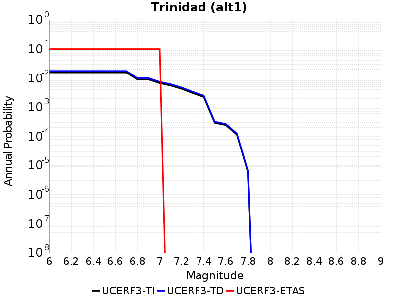 |
|-----|

| Magnitude | UCERF3-TI Prob | UCERF3-TD Prob | UCERF3-ETAS Prob |
|-----|-----|-----|-----|
| 6.0 | 0.0156177925 | 0.017596241 | 0.1 |
| 6.1 | 0.0156177925 | 0.017596241 | 0.1 |
| 6.2 | 0.0156177925 | 0.017596241 | 0.1 |
| 6.3 | 0.0156177925 | 0.017596241 | 0.1 |
| 6.4 | 0.0156177925 | 0.017596241 | 0.1 |
| 6.5 | 0.0156177925 | 0.017596241 | 0.1 |
| 6.6 | 0.0156177925 | 0.017596241 | 0.1 |
| 6.7 | 0.0156177925 | 0.017596241 | 0.1 |
| 6.8 | 0.008919522 | 0.009958718 | 0.1 |
| 6.9 | 0.008919522 | 0.009958718 | 0.1 |
| 7.0 | 0.006687004 | 0.0074477214 | 0.1 |
| 7.1 | 0.005509687 | 0.006134653 | 0.0 |
| 7.2 | 0.0042373384 | 0.0047170613 | 0.0 |
| 7.3 | 0.00301531 | 0.0033634922 | 0.0 |
| 7.4 | 0.0022430231 | 0.002501014 | 0.0 |
| 7.5 | 2.9248823E-4 | 3.2016236E-4 | 0.0 |
| 7.6 | 2.4363975E-4 | 2.6715038E-4 | 0.0 |
| 7.7 | 1.1520855E-4 | 1.2689526E-4 | 0.0 |
| 7.8 | 5.9683275E-6 | 6.610278E-6 | 0.0 |

## Ventura-Pitas Point
*[(top)](#table-of-contents)*

| 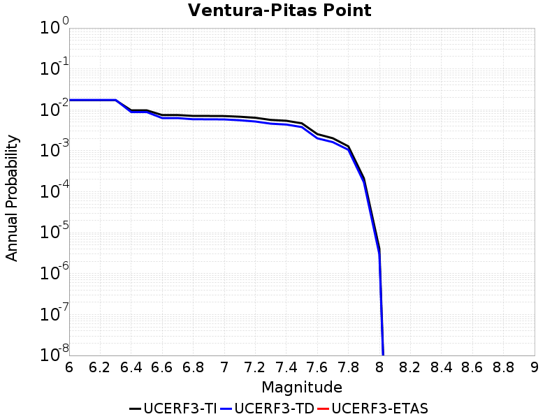 |
|-----|

| Magnitude | UCERF3-TI Prob | UCERF3-TD Prob | UCERF3-ETAS Prob |
|-----|-----|-----|-----|
| 6.0 | 0.017163932 | 0.017448543 | 0.0 |
| 6.1 | 0.017163932 | 0.017448543 | 0.0 |
| 6.2 | 0.017163932 | 0.017448543 | 0.0 |
| 6.3 | 0.017163932 | 0.017448543 | 0.0 |
| 6.4 | 0.009738282 | 0.008830176 | 0.0 |
| 6.5 | 0.009738282 | 0.008830176 | 0.0 |
| 6.6 | 0.0074657016 | 0.006294897 | 0.0 |
| 6.7 | 0.0074657016 | 0.006294897 | 0.0 |
| 6.8 | 0.007104293 | 0.005891935 | 0.0 |
| 6.9 | 0.007094092 | 0.0058805887 | 0.0 |
| 7.0 | 0.007055073 | 0.005838925 | 0.0 |
| 7.1 | 0.0067943637 | 0.0055687055 | 0.0 |
| 7.2 | 0.0064109527 | 0.0051929043 | 0.0 |
| 7.3 | 0.0056803077 | 0.0045962296 | 0.0 |
| 7.4 | 0.0054116896 | 0.0043783826 | 0.0 |
| 7.5 | 0.004693329 | 0.003794227 | 0.0 |
| 7.6 | 0.0025535747 | 0.0020153953 | 0.0 |
| 7.7 | 0.002025121 | 0.0016274353 | 0.0 |
| 7.8 | 0.0012856225 | 0.0010574608 | 0.0 |
| 7.9 | 2.1369511E-4 | 1.7081582E-4 | 0.0 |
| 8.0 | 4.065434E-6 | 2.9632592E-6 | 0.0 |

## Verdugo
*[(top)](#table-of-contents)*

| 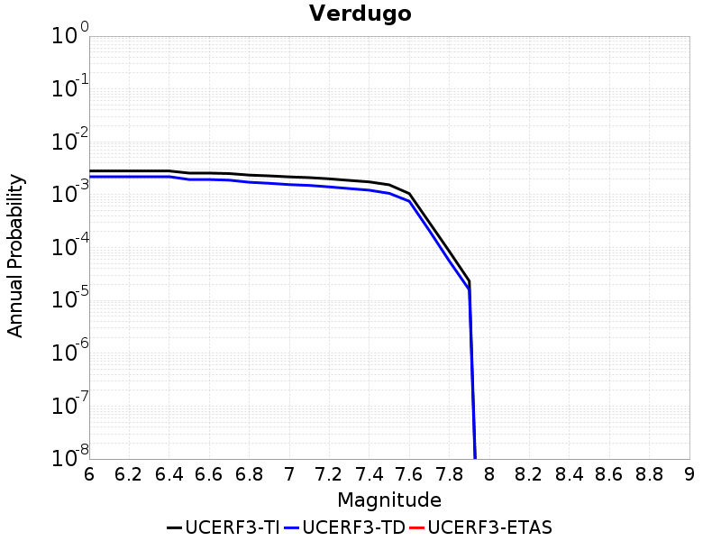 |
|-----|

| Magnitude | UCERF3-TI Prob | UCERF3-TD Prob | UCERF3-ETAS Prob |
|-----|-----|-----|-----|
| 6.0 | 0.0028100356 | 0.0021933268 | 0.0 |
| 6.1 | 0.0028100356 | 0.0021933268 | 0.0 |
| 6.2 | 0.0028100356 | 0.0021933268 | 0.0 |
| 6.3 | 0.0028100356 | 0.0021933268 | 0.0 |
| 6.4 | 0.0028100356 | 0.0021933268 | 0.0 |
| 6.5 | 0.002561549 | 0.0019361324 | 0.0 |
| 6.6 | 0.002561549 | 0.0019361324 | 0.0 |
| 6.7 | 0.0025102948 | 0.0018831263 | 0.0 |
| 6.8 | 0.0023491425 | 0.0017199343 | 0.0 |
| 6.9 | 0.0022710022 | 0.0016438848 | 0.0 |
| 7.0 | 0.0021742806 | 0.0015515512 | 0.0 |
| 7.1 | 0.0021060838 | 0.0014987761 | 0.0 |
| 7.2 | 0.0019967605 | 0.0014048873 | 0.0 |
| 7.3 | 0.0018636974 | 0.0013061567 | 0.0 |
| 7.4 | 0.0017469813 | 0.0012169476 | 0.0 |
| 7.5 | 0.0015371935 | 0.0010600361 | 0.0 |
| 7.6 | 0.0010500296 | 7.52023E-4 | 0.0 |
| 7.7 | 2.987527E-4 | 2.0997752E-4 | 0.0 |
| 7.8 | 8.477722E-5 | 5.5590783E-5 | 0.0 |
| 7.9 | 2.3206538E-5 | 1.5840182E-5 | 0.0 |

## Walker Spring 2011 CFM
*[(top)](#table-of-contents)*

|  |
|-----|

| Magnitude | UCERF3-TI Prob | UCERF3-TD Prob | UCERF3-ETAS Prob |
|-----|-----|-----|-----|
| 6.0 | 0.004576677 | 0.004820684 | 0.0 |
| 6.1 | 0.004576677 | 0.004820684 | 0.0 |
| 6.2 | 0.0029461053 | 0.0031237327 | 0.0 |
| 6.3 | 0.002393013 | 0.0025494578 | 0.0 |
| 6.4 | 0.00221164 | 0.002355916 | 0.0 |
| 6.5 | 0.0017957145 | 0.0019205326 | 0.0 |
| 6.6 | 0.0014014016 | 0.0015006157 | 0.0 |
| 6.7 | 3.068133E-4 | 3.2326914E-4 | 0.0 |
| 6.8 | 8.616484E-5 | 9.078691E-5 | 0.0 |

## West Napa 2011 CFM
*[(top)](#table-of-contents)*

|  |
|-----|

| Magnitude | UCERF3-TI Prob | UCERF3-TD Prob | UCERF3-ETAS Prob |
|-----|-----|-----|-----|
| 6.0 | 0.019495348 | 0.02295486 | 0.0 |
| 6.1 | 0.019495348 | 0.02295486 | 0.0 |
| 6.2 | 0.019495348 | 0.02295486 | 0.0 |
| 6.3 | 0.011145315 | 0.012938126 | 0.0 |
| 6.4 | 0.011145315 | 0.012938126 | 0.0 |
| 6.5 | 0.008770182 | 0.0101357745 | 0.0 |
| 6.6 | 0.008751754 | 0.010114984 | 0.0 |
| 6.7 | 0.0069657755 | 0.008029104 | 0.0 |
| 6.8 | 0.005276473 | 0.006065117 | 0.0 |
| 6.9 | 0.0040415525 | 0.0046236464 | 0.0 |
| 7.0 | 0.0011529627 | 0.0012300676 | 0.0 |
| 7.1 | 9.913679E-4 | 0.0010461869 | 0.0 |
| 7.2 | 9.6462725E-4 | 0.0010164106 | 0.0 |
| 7.3 | 9.3268487E-4 | 9.809977E-4 | 0.0 |
| 7.4 | 8.616491E-4 | 9.047858E-4 | 0.0 |
| 7.5 | 7.3233736E-4 | 7.687243E-4 | 0.0 |
| 7.6 | 6.790207E-5 | 7.4212665E-5 | 0.0 |
| 7.7 | 4.4567398E-5 | 4.989227E-5 | 0.0 |
| 7.8 | 2.9258597E-5 | 3.539651E-5 | 0.0 |
| 7.9 | 1.5379954E-5 | 1.984229E-5 | 0.0 |
| 8.0 | 6.959095E-6 | 1.1157685E-5 | 0.0 |
| 8.1 | 1.3874273E-7 | 2.495484E-7 | 0.0 |

## West Tahoe
*[(top)](#table-of-contents)*

|  |
|-----|

| Magnitude | UCERF3-TI Prob | UCERF3-TD Prob | UCERF3-ETAS Prob |
|-----|-----|-----|-----|
| 6.0 | 0.010135954 | 0.010988515 | 0.0 |
| 6.1 | 0.010135954 | 0.010988515 | 0.0 |
| 6.2 | 0.010135954 | 0.010988515 | 0.0 |
| 6.3 | 0.010135954 | 0.010988515 | 0.0 |
| 6.4 | 0.010135954 | 0.010988515 | 0.0 |
| 6.5 | 0.0065971776 | 0.007114075 | 0.0 |
| 6.6 | 0.0065971776 | 0.007114075 | 0.0 |
| 6.7 | 0.0047463053 | 0.0051023276 | 0.0 |
| 6.8 | 0.0045743673 | 0.00491969 | 0.0 |
| 6.9 | 0.0035191004 | 0.0037805466 | 0.0 |
| 7.0 | 0.0026988357 | 0.0028988977 | 0.0 |
| 7.1 | 0.0021322304 | 0.002290465 | 0.0 |
| 7.2 | 0.0011658648 | 0.0012519691 | 0.0 |

## White Mountains
*[(top)](#table-of-contents)*

|  |
|-----|

| Magnitude | UCERF3-TI Prob | UCERF3-TD Prob | UCERF3-ETAS Prob |
|-----|-----|-----|-----|
| 6.0 | 0.018115403 | 0.017471092 | 0.1 |
| 6.1 | 0.018115403 | 0.017471092 | 0.1 |
| 6.2 | 0.018115403 | 0.017471092 | 0.1 |
| 6.3 | 0.009254395 | 0.00826478 | 0.1 |
| 6.4 | 0.009254395 | 0.00826478 | 0.1 |
| 6.5 | 0.006966323 | 0.005893225 | 0.0 |
| 6.6 | 0.005629168 | 0.004486881 | 0.0 |
| 6.7 | 0.00472035 | 0.003540119 | 0.0 |
| 6.8 | 0.0037996976 | 0.0025699204 | 0.0 |
| 6.9 | 0.0032425157 | 0.001995406 | 0.0 |
| 7.0 | 0.002599207 | 0.0013951949 | 0.0 |
| 7.1 | 0.0020981359 | 9.818809E-4 | 0.0 |
| 7.2 | 0.0017352107 | 6.674597E-4 | 0.0 |
| 7.3 | 0.0012818464 | 3.1489498E-4 | 0.0 |
| 7.4 | 0.0010252813 | 1.6123868E-4 | 0.0 |
| 7.5 | 6.266873E-4 | 9.4521514E-5 | 0.0 |
| 7.6 | 1.3363175E-4 | 2.5362324E-5 | 0.0 |

## White Wolf
*[(top)](#table-of-contents)*

| 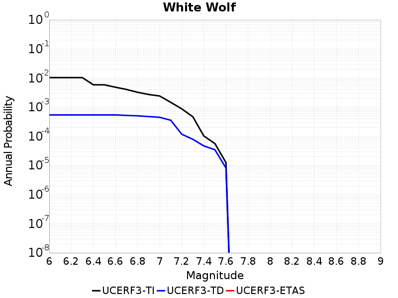 |
|-----|

| Magnitude | UCERF3-TI Prob | UCERF3-TD Prob | UCERF3-ETAS Prob |
|-----|-----|-----|-----|
| 6.0 | 0.010401085 | 5.455408E-4 | 0.0 |
| 6.1 | 0.010401085 | 5.455408E-4 | 0.0 |
| 6.2 | 0.010401085 | 5.455408E-4 | 0.0 |
| 6.3 | 0.010401085 | 5.455408E-4 | 0.0 |
| 6.4 | 0.005891764 | 5.455408E-4 | 0.0 |
| 6.5 | 0.005891764 | 5.455408E-4 | 0.0 |
| 6.6 | 0.0048655253 | 5.455408E-4 | 0.0 |
| 6.7 | 0.004083836 | 5.236253E-4 | 0.0 |
| 6.8 | 0.003264165 | 5.0730776E-4 | 0.0 |
| 6.9 | 0.0027400232 | 4.7857824E-4 | 0.0 |
| 7.0 | 0.0024363957 | 4.5137748E-4 | 0.0 |
| 7.1 | 0.001474007 | 3.582559E-4 | 0.0 |
| 7.2 | 8.8046055E-4 | 1.18278294E-4 | 0.0 |
| 7.3 | 4.739879E-4 | 7.95386E-5 | 0.0 |
| 7.4 | 1.028772E-4 | 4.695204E-5 | 0.0 |
| 7.5 | 5.6715195E-5 | 3.473347E-5 | 0.0 |
| 7.6 | 1.2636427E-5 | 8.2517945E-6 | 0.0 |

## White Wolf (Extension)
*[(top)](#table-of-contents)*

|  |
|-----|

| Magnitude | UCERF3-TI Prob | UCERF3-TD Prob | UCERF3-ETAS Prob |
|-----|-----|-----|-----|
| 6.0 | 0.0042812387 | 0.003159577 | 0.0 |
| 6.1 | 0.0042812387 | 0.003159577 | 0.0 |
| 6.2 | 0.0042812387 | 0.003159577 | 0.0 |
| 6.3 | 0.0042812387 | 0.003159577 | 0.0 |
| 6.4 | 0.0030331176 | 0.0018534556 | 0.0 |
| 6.5 | 0.0030041158 | 0.0018232261 | 0.0 |
| 6.6 | 0.0024200242 | 0.0012156698 | 0.0 |
| 6.7 | 0.002060454 | 8.5911853E-4 | 0.0 |
| 6.8 | 0.0017921652 | 6.382343E-4 | 0.0 |
| 6.9 | 0.0016353652 | 5.2297104E-4 | 0.0 |
| 7.0 | 0.0014754693 | 3.871576E-4 | 0.0 |
| 7.1 | 0.001256249 | 2.8260268E-4 | 0.0 |
| 7.2 | 7.2374323E-4 | 5.590045E-5 | 0.0 |
| 7.3 | 3.681084E-4 | 2.6011221E-5 | 0.0 |
| 7.4 | 3.095951E-5 | 2.5316594E-6 | 0.0 |

## Whittier alt 1
*[(top)](#table-of-contents)*

|  |
|-----|

| Magnitude | UCERF3-TI Prob | UCERF3-TD Prob | UCERF3-ETAS Prob |
|-----|-----|-----|-----|
| 6.0 | 0.02196019 | 0.024333946 | 0.0 |
| 6.1 | 0.02196019 | 0.024333946 | 0.0 |
| 6.2 | 0.02196019 | 0.024333946 | 0.0 |
| 6.3 | 0.01018413 | 0.00945624 | 0.0 |
| 6.4 | 0.008112748 | 0.0070451433 | 0.0 |
| 6.5 | 0.007874036 | 0.0067845643 | 0.0 |
| 6.6 | 0.006737438 | 0.0053824577 | 0.0 |
| 6.7 | 0.006522954 | 0.0051340708 | 0.0 |
| 6.8 | 0.0063434686 | 0.004924905 | 0.0 |
| 6.9 | 0.00602425 | 0.0045506097 | 0.0 |
| 7.0 | 0.0057049696 | 0.00419365 | 0.0 |
| 7.1 | 0.005323986 | 0.0038014296 | 0.0 |
| 7.2 | 0.0048972913 | 0.0033956242 | 0.0 |
| 7.3 | 0.0042889426 | 0.0029049024 | 0.0 |
| 7.4 | 0.0039222343 | 0.0026090986 | 0.0 |
| 7.5 | 0.003203666 | 0.002041612 | 0.0 |
| 7.6 | 0.0028437122 | 0.0017620799 | 0.0 |
| 7.7 | 0.0021722503 | 0.0012107622 | 0.0 |
| 7.8 | 1.1839878E-4 | 4.8602855E-5 | 0.0 |
| 7.9 | 3.4838679E-6 | 1.7881166E-6 | 0.0 |

## Wight Way 2011 CFM
*[(top)](#table-of-contents)*

| 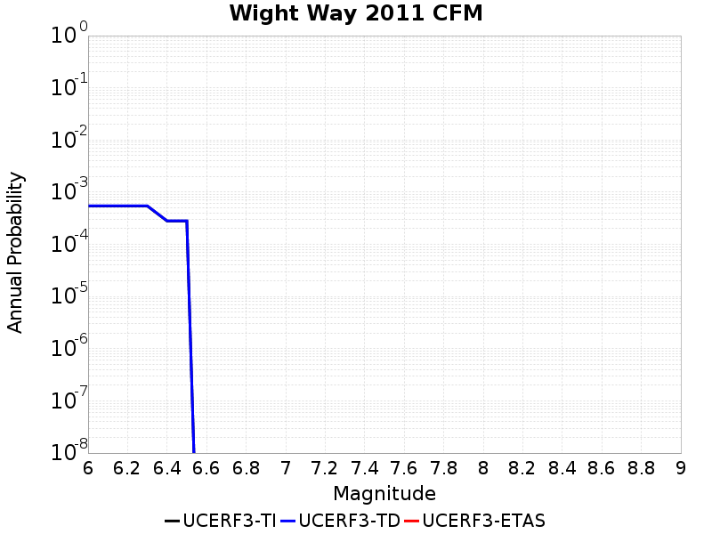 |
|-----|

| Magnitude | UCERF3-TI Prob | UCERF3-TD Prob | UCERF3-ETAS Prob |
|-----|-----|-----|-----|
| 6.0 | 5.4312614E-4 | 5.467613E-4 | 0.0 |
| 6.1 | 5.4312614E-4 | 5.467613E-4 | 0.0 |
| 6.2 | 5.4312614E-4 | 5.467613E-4 | 0.0 |
| 6.3 | 5.4312614E-4 | 5.467613E-4 | 0.0 |
| 6.4 | 2.7997742E-4 | 2.8182133E-4 | 0.0 |
| 6.5 | 2.7997742E-4 | 2.8182133E-4 | 0.0 |

## Yorba Linda
*[(top)](#table-of-contents)*

|  |
|-----|

| Magnitude | UCERF3-TI Prob | UCERF3-TD Prob | UCERF3-ETAS Prob |
|-----|-----|-----|-----|
| 6.0 | 0.0010089825 | 8.814672E-4 | 0.0 |
| 6.1 | 0.0010089825 | 8.814672E-4 | 0.0 |
| 6.2 | 0.0010089825 | 8.814672E-4 | 0.0 |
| 6.3 | 5.7529175E-4 | 4.4200002E-4 | 0.0 |
| 6.4 | 5.7529175E-4 | 4.4200002E-4 | 0.0 |
| 6.5 | 4.4055824E-4 | 3.0573242E-4 | 0.0 |
| 6.6 | 4.394015E-4 | 3.044565E-4 | 0.0 |
| 6.7 | 4.388285E-4 | 3.0382248E-4 | 0.0 |
| 6.8 | 3.9605703E-4 | 2.6014427E-4 | 0.0 |
| 6.9 | 3.9545933E-4 | 2.5942374E-4 | 0.0 |
| 7.0 | 3.9331234E-4 | 2.5744902E-4 | 0.0 |
| 7.1 | 3.1772171E-4 | 1.9688888E-4 | 0.0 |
| 7.2 | 3.0519423E-4 | 1.8678806E-4 | 0.0 |
| 7.3 | 2.5554223E-4 | 1.5817602E-4 | 0.0 |
| 7.4 | 2.0191289E-4 | 1.2872046E-4 | 0.0 |
| 7.5 | 1.5133592E-4 | 9.7081735E-5 | 0.0 |
| 7.6 | 1.1880523E-4 | 7.716916E-5 | 0.0 |
| 7.7 | 7.835451E-5 | 4.549082E-5 | 0.0 |
| 7.8 | 2.0327276E-5 | 9.6319045E-6 | 0.0 |
| 7.9 | 3.4690888E-6 | 1.7769695E-6 | 0.0 |

## Zayante-Vergeles 2011 CFM
*[(top)](#table-of-contents)*

|  |
|-----|

| Magnitude | UCERF3-TI Prob | UCERF3-TD Prob | UCERF3-ETAS Prob |
|-----|-----|-----|-----|
| 6.0 | 5.817369E-4 | 5.527732E-4 | 0.0 |
| 6.1 | 5.817369E-4 | 5.527732E-4 | 0.0 |
| 6.2 | 5.817369E-4 | 5.527732E-4 | 0.0 |
| 6.3 | 5.817369E-4 | 5.527732E-4 | 0.0 |
| 6.4 | 5.817369E-4 | 5.527732E-4 | 0.0 |
| 6.5 | 5.817369E-4 | 5.527732E-4 | 0.0 |
| 6.6 | 5.817369E-4 | 5.527732E-4 | 0.0 |
| 6.7 | 5.817369E-4 | 5.527732E-4 | 0.0 |
| 6.8 | 5.0121103E-4 | 4.7187475E-4 | 0.0 |
| 6.9 | 4.7607176E-4 | 4.4658844E-4 | 0.0 |
| 7.0 | 4.3513824E-4 | 4.0543056E-4 | 0.0 |
| 7.1 | 3.9255986E-4 | 3.6258117E-4 | 0.0 |
| 7.2 | 3.653771E-4 | 3.3524446E-4 | 0.0 |
| 7.3 | 3.3652913E-4 | 3.0651735E-4 | 0.0 |
| 7.4 | 3.0286296E-4 | 2.728549E-4 | 0.0 |
| 7.5 | 2.766784E-4 | 2.468571E-4 | 0.0 |
| 7.6 | 2.4538804E-4 | 2.1663186E-4 | 0.0 |
| 7.7 | 1.9758838E-4 | 1.6937882E-4 | 0.0 |
| 7.8 | 1.5328811E-4 | 1.3413196E-4 | 0.0 |
| 7.9 | 1.1087401E-4 | 1.0481652E-4 | 0.0 |
| 8.0 | 7.634422E-5 | 8.528467E-5 | 0.0 |
| 8.1 | 3.9785013E-5 | 5.261089E-5 | 0.0 |
| 8.2 | 2.9032954E-6 | 2.9111977E-6 | 0.0 |

